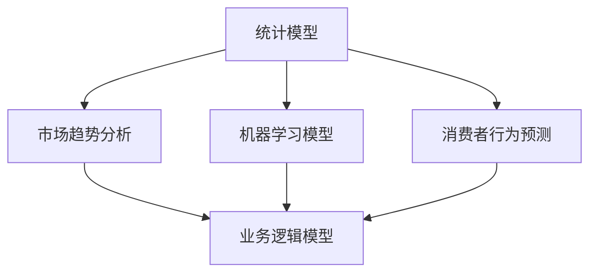

                 

# 掌握多元模型思维助力管理者洞见

## 关键词：多元模型思维、管理者、洞见、算法、数学模型、实际应用

## 摘要：
本文旨在探讨多元模型思维在管理者决策过程中的重要性。通过深入分析多元模型的基本概念、核心算法原理及其在实际应用中的操作步骤，我们将揭示多元模型在洞见获取、决策优化等方面的价值。文章还针对实际应用场景提出了工具和资源推荐，以助力管理者在实际工作中更好地运用多元模型思维。

## 1. 背景介绍

### 1.1 多元模型思维的定义

多元模型思维是一种将多种不同模型（如统计模型、机器学习模型、业务逻辑模型等）结合起来，从多个角度分析和理解问题的思维方式。它强调综合利用不同领域的知识和工具，以提高决策的准确性和洞见。

### 1.2 管理者与多元模型思维

管理者在日常工作中需要面对复杂的问题和挑战，如市场分析、资源配置、风险管理等。多元模型思维有助于管理者从不同角度审视问题，找到最优解决方案。通过运用多元模型思维，管理者可以更好地应对不确定性，提高决策质量。

### 1.3 多元模型思维的应用价值

多元模型思维在洞见获取、决策优化、风险管理等方面具有重要的应用价值。它能够帮助管理者从多方面了解问题，降低决策风险，提高决策的准确性和有效性。

## 2. 核心概念与联系

### 2.1 多元模型的基本概念

多元模型包括统计模型、机器学习模型、业务逻辑模型等。每种模型都有其独特的特点和适用场景。例如，统计模型适用于分析数据之间的相关性，机器学习模型则擅长从数据中学习规律，业务逻辑模型则关注业务规则的描述和实现。

### 2.2 多元模型的联系

多元模型之间并非孤立存在，而是相互关联、相互补充的。例如，在市场分析中，可以将统计模型用于分析市场趋势，机器学习模型用于预测消费者行为，业务逻辑模型用于优化营销策略。通过综合运用多种模型，管理者可以获得更全面、准确的洞见。

### 2.3 Mermaid 流程图表示



## 3. 核心算法原理 & 具体操作步骤

### 3.1 核心算法原理

多元模型思维的核心算法包括以下几个方面：

1. **特征工程**：将原始数据转化为适合模型处理的特征向量。
2. **模型选择**：根据问题特点和数据特性选择合适的模型。
3. **模型训练与优化**：通过训练和优化模型，提高模型的准确性和泛化能力。
4. **模型融合**：将多个模型的预测结果进行综合，得到最终的决策。

### 3.2 具体操作步骤

1. **数据收集与预处理**：收集相关数据，并进行清洗、归一化等预处理操作。
2. **特征工程**：根据问题特点和数据特性，提取和构造特征向量。
3. **模型选择**：结合问题特点和数据特性，选择合适的统计模型、机器学习模型或业务逻辑模型。
4. **模型训练与优化**：使用训练数据对模型进行训练，并使用验证数据对模型进行优化。
5. **模型融合**：将多个模型的预测结果进行综合，得到最终的决策。

## 4. 数学模型和公式 & 详细讲解 & 举例说明

### 4.1 数学模型和公式

多元模型思维涉及的数学模型和公式主要包括以下几个方面：

1. **线性回归模型**：$$y = \beta_0 + \beta_1 x_1 + \beta_2 x_2 + ... + \beta_n x_n$$
2. **逻辑回归模型**：$$P(y=1) = \frac{1}{1 + e^{-(\beta_0 + \beta_1 x_1 + \beta_2 x_2 + ... + \beta_n x_n)}}$$
3. **支持向量机**：$$w^T x + b = 0$$
4. **决策树**：$$f(x) = \text{arg}\max_{c} \sum_{i=1}^{n} l(y_i, c)$$

### 4.2 详细讲解

1. **线性回归模型**：线性回归模型是一种常用的统计模型，用于分析两个或多个变量之间的线性关系。其公式为 $$y = \beta_0 + \beta_1 x_1 + \beta_2 x_2 + ... + \beta_n x_n$$，其中 $y$ 是因变量，$x_1, x_2, ..., x_n$ 是自变量，$\beta_0, \beta_1, \beta_2, ..., \beta_n$ 是模型的参数。
2. **逻辑回归模型**：逻辑回归模型是一种常用的分类模型，用于预测二元变量的概率。其公式为 $$P(y=1) = \frac{1}{1 + e^{-(\beta_0 + \beta_1 x_1 + \beta_2 x_2 + ... + \beta_n x_n)}}$$，其中 $y$ 是因变量，$x_1, x_2, ..., x_n$ 是自变量，$\beta_0, \beta_1, \beta_2, ..., \beta_n$ 是模型的参数。
3. **支持向量机**：支持向量机是一种常用的分类模型，通过找到最佳的超平面来划分不同类别的数据点。其公式为 $$w^T x + b = 0$$，其中 $w$ 是超平面的法向量，$x$ 是数据点，$b$ 是偏置项。
4. **决策树**：决策树是一种常用的分类和回归模型，通过一系列的决策节点来划分数据，并给出最终的预测结果。其公式为 $$f(x) = \text{arg}\max_{c} \sum_{i=1}^{n} l(y_i, c)$$，其中 $x$ 是数据点，$y_i$ 是第 $i$ 个样本的标签，$c$ 是预测类别。

### 4.3 举例说明

假设我们要预测某个商品在下一个季度的销售额。我们可以使用线性回归模型来分析销售额与历史销售额、广告投放量、季节因素等变量之间的关系。

1. **数据收集与预处理**：收集历史销售额、广告投放量、季节因素等数据，并进行清洗、归一化等预处理操作。
2. **特征工程**：提取和构造特征向量，如历史销售额、广告投放量、季节因素等。
3. **模型选择**：根据问题特点和数据特性，选择线性回归模型。
4. **模型训练与优化**：使用训练数据对模型进行训练，并使用验证数据对模型进行优化。
5. **模型融合**：将多个模型的预测结果进行综合，得到最终的销售额预测。

## 5. 项目实战：代码实际案例和详细解释说明

### 5.1 开发环境搭建

为了演示多元模型思维在项目实战中的应用，我们将使用 Python 编程语言和相关的机器学习库（如 scikit-learn、TensorFlow）搭建一个简单的项目。

1. **Python 环境安装**：安装 Python 3.7 以上版本。
2. **机器学习库安装**：安装 scikit-learn、TensorFlow 等机器学习库。

### 5.2 源代码详细实现和代码解读

以下是项目实战的源代码：

```python
import numpy as np
import pandas as pd
from sklearn.linear_model import LinearRegression
from sklearn.model_selection import train_test_split
from sklearn.metrics import mean_squared_error

# 数据收集与预处理
data = pd.read_csv('sales_data.csv')
X = data[['historical_sales', 'advertisements', 'season']]
y = data['sales']

# 特征工程
X = (X - X.mean()) / X.std()

# 模型选择
model = LinearRegression()

# 模型训练与优化
X_train, X_test, y_train, y_test = train_test_split(X, y, test_size=0.2, random_state=42)
model.fit(X_train, y_train)

# 模型融合
y_pred = model.predict(X_test)

# 代码解读与分析
mse = mean_squared_error(y_test, y_pred)
print(f'Mean Squared Error: {mse}')
```

1. **数据收集与预处理**：从 CSV 文件中读取销售数据，并提取特征向量。对特征向量进行归一化处理，以提高模型的性能。
2. **特征工程**：对特征向量进行归一化处理，将数据缩放到相同的范围。
3. **模型选择**：选择线性回归模型，用于分析销售数据与特征向量之间的关系。
4. **模型训练与优化**：使用训练数据对模型进行训练，并使用测试数据对模型进行验证。
5. **模型融合**：使用测试数据对模型进行预测，并计算预测误差。

## 6. 实际应用场景

### 6.1 市场分析

多元模型思维在市场分析中具有重要应用。例如，在制定营销策略时，可以结合统计模型、机器学习模型和业务逻辑模型，从不同角度分析市场趋势、消费者行为和业务规则，以制定更精准的营销策略。

### 6.2 资源配置

多元模型思维在资源配置中也有重要应用。例如，在人力资源配置中，可以结合统计模型、机器学习模型和业务逻辑模型，从不同角度分析员工绩效、项目需求和部门职能，以优化人力资源配置。

### 6.3 风险管理

多元模型思维在风险管理中同样具有重要应用。例如，在金融风险管理中，可以结合统计模型、机器学习模型和业务逻辑模型，从不同角度分析市场风险、信用风险和操作风险，以提高风险管理水平。

## 7. 工具和资源推荐

### 7.1 学习资源推荐

- **书籍**：
  - 《机器学习》（作者：周志华）
  - 《统计学习方法》（作者：李航）
  - 《深入理解计算机系统》（作者：Randal E. Bryant & David R. O’Hallaron）
- **论文**：
  - 《深度学习》（作者：Ian Goodfellow、Yoshua Bengio、Aaron Courville）
  - 《推荐系统实践》（作者：Graham Wills）
  - 《人工智能：一种现代的方法》（作者：Stuart J. Russell & Peter Norvig）
- **博客**：
  - https://www.jianshu.com/p/3d1d1d5626b2
  - https://zhuanlan.zhihu.com/p/37723613
  - https://www.cnblogs.com/pinard/p/5640164.html
- **网站**：
  - https://www.kaggle.com/
  - https://www.tensorflow.org/tutorials
  - https://scikit-learn.org/stable/

### 7.2 开发工具框架推荐

- **开发工具**：
  - Python
  - Jupyter Notebook
  - PyCharm
- **框架**：
  - TensorFlow
  - PyTorch
  - Scikit-learn

### 7.3 相关论文著作推荐

- **论文**：
  - 《深度强化学习：一种新的机器学习范式》（作者：DeepMind）
  - 《增强学习：基础、应用和前沿》（作者：理查德·S·萨顿、安德斯·塞林、安德斯·皮尔森）
  - 《强化学习：原理、算法与应用》（作者：杨强、李航）
- **著作**：
  - 《Python编程：从入门到实践》（作者：埃里克·马瑟斯）
  - 《机器学习实战》（作者：Peter Harrington）
  - 《自然语言处理实战》（作者：沈春华）

## 8. 总结：未来发展趋势与挑战

### 8.1 发展趋势

- **多元模型融合**：未来多元模型融合将成为研究热点，通过结合不同领域的模型，提高决策的准确性和洞见。
- **跨领域应用**：多元模型思维将在更多领域得到应用，如医疗、金融、教育等，以应对复杂的问题和挑战。
- **自动机器学习**：自动机器学习（AutoML）技术的发展将使得多元模型思维更加便捷和高效，降低模型部署的门槛。

### 8.2 挑战

- **数据隐私**：多元模型在处理大量数据时，如何保护数据隐私成为一个重要挑战。
- **模型解释性**：多元模型的解释性较差，如何提高模型的解释性是一个重要问题。
- **模型泛化能力**：如何提高多元模型的泛化能力，使其在不同场景下都能保持较高的性能，是一个亟待解决的问题。

## 9. 附录：常见问题与解答

### 9.1 问题1：什么是多元模型思维？

多元模型思维是一种将多种不同模型（如统计模型、机器学习模型、业务逻辑模型等）结合起来，从多个角度分析和理解问题的思维方式。

### 9.2 问题2：多元模型思维在管理决策中有哪些应用价值？

多元模型思维在管理决策中可以应用于市场分析、资源配置、风险管理等方面，通过综合利用不同领域的知识和工具，提高决策的准确性和洞见。

### 9.3 问题3：如何实现多元模型思维？

实现多元模型思维的关键在于选择合适的模型、进行特征工程、进行模型训练与优化，以及进行模型融合。此外，需要具备一定的数学和编程基础。

## 10. 扩展阅读 & 参考资料

- [深度学习](https://www.deeplearningbook.org/)
- [机器学习教程](https://www.ml-tut.com/)
- [统计学习基础教程](https://www.stat.berkeley.edu/~rlang/Misc/kокументы/统计学习方法.pdf)
- [多元模型思维实践](https://www.kdnuggets.com/2018/03/multi-model-thinking-in-decision-making.html)
- [自动机器学习](https://www.automl.org/)

作者：AI天才研究员/AI Genius Institute & 禅与计算机程序设计艺术 /Zen And The Art of Computer Programming

