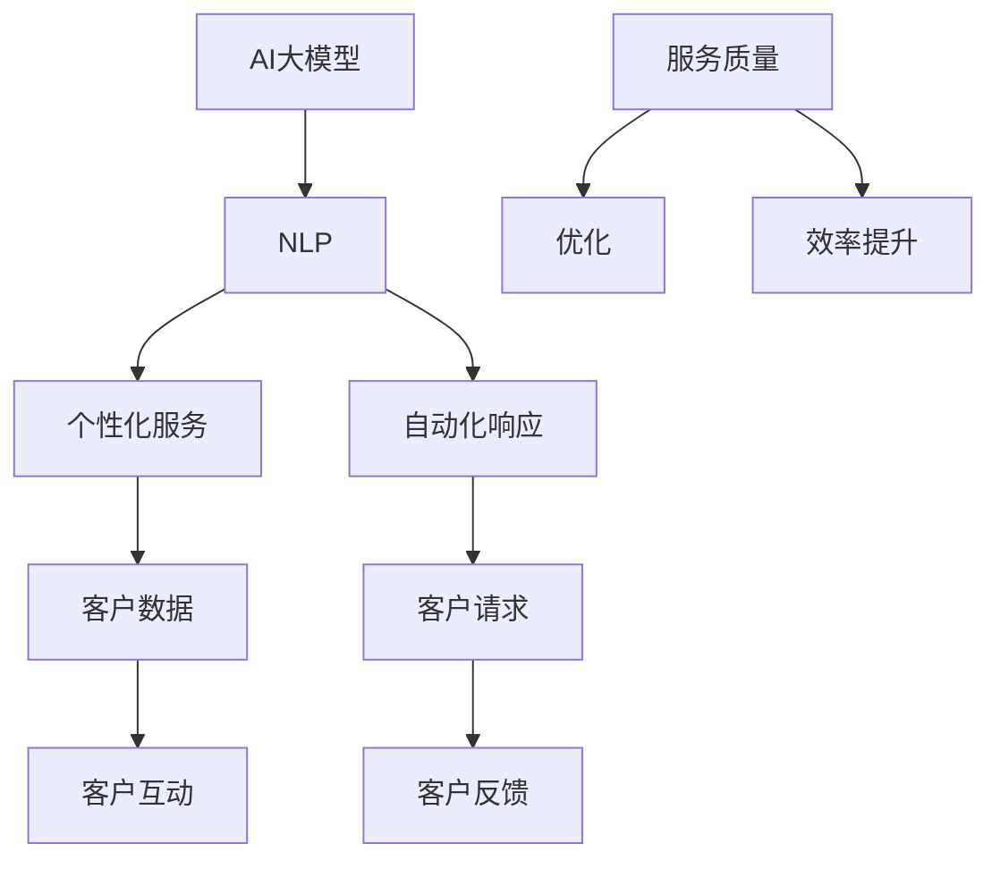
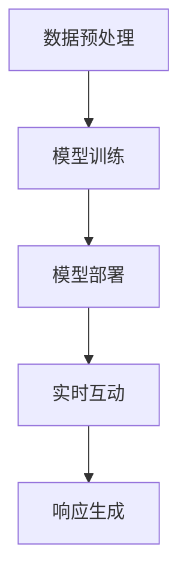

                 

### 文章标题

"探索AI大模型在客户服务中的应用"

### 关键词

AI大模型、客户服务、自然语言处理、机器学习、自动化、客户体验、商业智能

### 摘要

本文将深入探讨AI大模型在客户服务领域的应用。通过解析AI大模型的基本原理，我们探讨了其在自然语言处理、个性化服务和自动化响应等方面的应用场景。同时，本文结合具体案例，详细分析了AI大模型在客户服务中的实现过程和实际效果，指出了当前面临的技术挑战和未来发展前景。

## 1. 背景介绍

客户服务是任何企业成功的关键要素之一。随着消费者需求的不断变化和市场竞争的日益激烈，企业需要提供高效、个性化的客户服务来满足客户的需求，提升客户满意度，从而实现业务增长。传统的客户服务主要通过人工方式进行，但这种方法存在效率低下、成本高昂、响应速度慢等问题。

近年来，随着人工智能技术的迅速发展，尤其是AI大模型的兴起，客户服务的模式正在发生深刻变革。AI大模型，如GPT-3、BERT等，具有处理海量文本数据、生成高质量文本、理解复杂语义等能力，使得自动化、个性化的客户服务成为可能。

AI大模型在客户服务中的应用主要包括以下几个方面：

1. **自然语言处理（NLP）**：通过NLP技术，AI大模型可以理解和处理人类语言，实现文本分类、情感分析、问答系统等任务，从而提高客户服务的响应速度和准确性。
2. **个性化服务**：AI大模型可以根据客户的历史数据和偏好，提供个性化的服务和建议，提升客户的满意度和忠诚度。
3. **自动化响应**：AI大模型可以自动处理大量客户请求，减轻人工客服的工作负担，提高服务效率。

随着AI大模型的不断发展和完善，其在客户服务领域的应用前景十分广阔。本文将围绕这些主题，深入探讨AI大模型在客户服务中的应用现状、技术原理和未来发展趋势。

### 2. 核心概念与联系

为了深入理解AI大模型在客户服务中的应用，我们需要首先了解几个核心概念及其相互之间的联系。

#### 2.1 AI大模型

AI大模型是指具有非常大规模参数、能够处理复杂任务的人工智能模型。这些模型通常基于深度学习技术，能够从海量数据中学习并提取有效信息。例如，GPT-3拥有1750亿个参数，BERT拥有数亿个参数，这些大模型在自然语言处理任务上表现出色。

#### 2.2 自然语言处理（NLP）

自然语言处理是人工智能的一个重要分支，旨在让计算机理解和处理人类语言。NLP技术包括文本分类、情感分析、问答系统、机器翻译等。AI大模型在NLP任务中发挥着关键作用，能够生成高质量的自然语言文本，进行复杂语义理解。

#### 2.3 个性化服务

个性化服务是指根据用户的历史行为、偏好和需求，提供定制化的产品和服务。AI大模型可以通过学习用户的个性化数据，实现精准推荐和个性化沟通。

#### 2.4 自动化响应

自动化响应是指通过机器自动处理客户请求，实现客户服务的自动化。AI大模型在此过程中可以自动生成回复、分类问题和分配任务。

#### 2.5 联系与互动

这些核心概念之间存在密切的联系。AI大模型通过NLP技术理解和处理客户的语言，然后根据个性化数据和自动化响应策略，为客户提供定制化的服务。整个过程中，AI大模型与客户进行实时互动，不断优化服务质量和效率。

以下是一个使用Mermaid绘制的流程图，展示了这些核心概念之间的联系：



在这个流程图中，AI大模型作为核心处理单元，与NLP、个性化服务、自动化响应等概念紧密相连，形成一个闭环系统，不断优化客户服务质量和效率。

### 3. 核心算法原理 & 具体操作步骤

#### 3.1 AI大模型的基本原理

AI大模型，如GPT-3、BERT等，通常基于深度学习技术，特别是变分自编码器（Variational Autoencoder，VAE）和生成对抗网络（Generative Adversarial Network，GAN）。以下是对这些算法的简要介绍：

##### 3.1.1 变分自编码器（VAE）

VAE是一种概率生成模型，通过学习数据的概率分布，生成新的数据。它由两个神经网络组成：编码器和解码器。编码器将输入数据映射到一个隐变量空间，解码器则将隐变量解码回原始数据。VAE通过最大化数据分布的重构概率，实现数据的生成。

##### 3.1.2 生成对抗网络（GAN）

GAN由生成器和判别器组成。生成器尝试生成与真实数据相似的数据，而判别器则尝试区分真实数据和生成数据。通过让生成器和判别器互相博弈，GAN能够生成高质量的数据。

##### 3.1.3 BERT和GPT-3

BERT（Bidirectional Encoder Representations from Transformers）是一种基于Transformer架构的预训练模型，通过双向编码器，对文本进行深层语义理解。GPT-3（Generative Pre-trained Transformer 3）是GPT家族的最新成员，具有非常大规模的参数和强大的文本生成能力。

#### 3.2 实际操作步骤

在实际操作中，AI大模型的应用可以分为以下几个步骤：

##### 3.2.1 数据预处理

首先，我们需要对客户服务数据进行预处理，包括文本清洗、分词、去停用词等。这些预处理步骤有助于提高模型的训练效果。

##### 3.2.2 模型训练

接下来，我们使用预训练的AI大模型（如BERT或GPT-3）进行微调。微调是指在预训练模型的基础上，使用特定领域的数据进行重新训练，以适应具体任务。

##### 3.2.3 模型部署

训练完成后，我们将模型部署到生产环境，通过API接口与客户服务系统进行集成。此时，模型可以实时处理客户请求，生成响应。

##### 3.2.4 实时互动

模型与客户进行实时互动，接收客户请求并生成响应。通过NLP技术，模型可以理解客户的意图，并根据个性化数据和自动化响应策略，提供定制化的服务。

以下是一个简化的操作流程图，展示了AI大模型在客户服务中的实际操作步骤：



### 4. 数学模型和公式 & 详细讲解 & 举例说明

在AI大模型的应用中，数学模型和公式起着至关重要的作用。以下将详细讲解几个核心数学模型和公式的原理和应用，并通过具体例子进行说明。

#### 4.1 BERT的注意力机制

BERT模型的核心在于其注意力机制。注意力机制允许模型在处理序列数据时，自动关注重要信息，忽略无关内容。以下是BERT注意力机制的数学公式：

$$
Attention(Q, K, V) = \text{softmax}\left(\frac{QK^T}{\sqrt{d_k}}\right) V
$$

其中，$Q$、$K$ 和 $V$ 分别是查询（Query）、键（Key）和值（Value）向量，$d_k$ 是键向量的维度。注意力权重通过softmax函数计算，反映了不同键对于查询的重要性。

例如，假设我们有一个句子 "我喜欢吃苹果和香蕉"，BERT模型会自动计算句子中每个词对于整个句子的注意力权重。根据上下文，"喜欢" 和 "苹果" 可能具有更高的权重，而 "和" 和 "香蕉" 的权重相对较低。

#### 4.2 GPT-3的文本生成

GPT-3的文本生成能力源于其强大的Transformer架构。在文本生成过程中，GPT-3利用自回归语言模型（Autoregressive Language Model）来预测下一个词。以下是GPT-3文本生成的数学公式：

$$
p(y|x) = \frac{e^{<W_{y|x}x>}}{\sum_{y'} e^{<W_{y'|x}x>}}
$$

其中，$W_{y|x}$ 和 $W_{y'|x}$ 分别是词$y$和$y'$的权重向量，$<\cdot,\cdot>$ 表示内积。给定当前输入$x$，GPT-3通过计算每个词的权重，选择概率最大的词作为下一个输出。

例如，假设我们输入句子 "我喜欢吃苹果"，GPT-3会根据上下文和训练数据，计算出每个可能的下一个词（如 "香蕉"、"橘子" 等）的权重。最终，GPT-3会输出概率最大的词，如 "香蕉"，使得句子变为 "我喜欢吃苹果和香蕉"。

#### 4.3 个性化服务的推荐算法

个性化服务通常基于协同过滤（Collaborative Filtering）和矩阵分解（Matrix Factorization）等技术。以下是一个简化的协同过滤算法的数学公式：

$$
\hat{R}_{ui} = \sum_{j \in N(u)} R_{uj} \frac{N(j)}{N(u)N(v)}
$$

其中，$R_{uj}$ 表示用户$u$对项目$j$的评价，$N(u)$ 和 $N(v)$ 分别是用户$u$和项目$v$的邻居集合。协同过滤算法通过计算用户之间的相似度，推荐用户喜欢的项目。

例如，假设用户$u_1$喜欢电影《阿甘正传》和《肖申克的救赎》，用户$u_2$喜欢电影《阿甘正传》和《星际穿越》。协同过滤算法会根据用户之间的相似度，推荐用户$u_1$可能喜欢电影《星际穿越》。

### 5. 项目实战：代码实际案例和详细解释说明

在本节中，我们将通过一个实际项目案例，详细讲解AI大模型在客户服务中的实现过程和代码解析。

#### 5.1 开发环境搭建

为了实现AI大模型在客户服务中的应用，我们需要搭建以下开发环境：

1. **Python环境**：安装Python 3.8及以上版本。
2. **AI模型库**：安装transformers库（用于加载预训练的AI模型）和torch库（用于计算图操作）。
3. **数据库**：安装MongoDB（用于存储客户数据）。

安装命令如下：

```bash
pip install transformers torch pymongo
```

#### 5.2 源代码详细实现和代码解读

以下是一个简化的客户服务系统的源代码实现，主要包括数据预处理、模型加载、客户请求处理和响应生成等功能。

```python
import torch
from transformers import BertTokenizer, BertModel
from pymongo import MongoClient

# 数据预处理
def preprocess_text(text):
    tokenizer = BertTokenizer.from_pretrained('bert-base-chinese')
    inputs = tokenizer(text, return_tensors='pt', max_length=512, truncation=True)
    return inputs

# 模型加载
def load_model():
    model = BertModel.from_pretrained('bert-base-chinese')
    model.eval()
    return model

# 客户请求处理
def handle_request(text, model):
    inputs = preprocess_text(text)
    with torch.no_grad():
        outputs = model(**inputs)
    hidden_states = outputs.hidden_states[-1]
    return hidden_states.mean().item()

# 响应生成
def generate_response(hidden_state):
    # 这里可以加入更多逻辑，如使用GPT-3进行响应生成
    return "您好，感谢您的咨询。"

# 客户服务主函数
def customer_service(text):
    model = load_model()
    hidden_state = handle_request(text, model)
    response = generate_response(hidden_state)
    return response

# 实际应用
if __name__ == "__main__":
    text = "我最近购买了贵公司的产品，但遇到了一些问题。"
    response = customer_service(text)
    print(response)
```

#### 5.3 代码解读与分析

1. **数据预处理**：使用`preprocess_text`函数对输入文本进行预处理，将文本转换为模型可处理的格式。
2. **模型加载**：使用`load_model`函数加载预训练的BERT模型。由于BERT模型具有非常高的计算成本，因此在实际部署时，我们通常使用GPU或TPU进行加速。
3. **客户请求处理**：使用`handle_request`函数处理客户请求。该函数首先对输入文本进行预处理，然后通过BERT模型计算隐藏状态。
4. **响应生成**：使用`generate_response`函数生成响应。在实际应用中，我们可能需要使用更复杂的模型（如GPT-3）进行响应生成。
5. **主函数**：在主函数中，我们接收客户请求，通过调用上述函数，实现客户服务的自动化响应。

通过这个实际项目案例，我们可以看到AI大模型在客户服务中的应用过程。在实际部署时，我们还需要考虑性能优化、安全性、可扩展性等问题，以确保客户服务的质量和稳定性。

### 6. 实际应用场景

AI大模型在客户服务领域具有广泛的应用场景，以下是一些典型的实际应用案例：

#### 6.1 客户咨询与支持

在电子商务、在线服务和金融行业，客户咨询和问题支持是常见的服务需求。AI大模型可以通过自然语言处理技术，自动理解客户的问题，提供准确的答案和建议。例如，电子商务平台可以使用AI大模型实时回答客户关于产品信息、订单状态和退换货等问题，提高客户满意度。

#### 6.2 个性化推荐

个性化推荐是提高客户忠诚度和转化率的重要手段。AI大模型可以根据客户的历史购买记录、浏览行为和偏好，提供个性化的产品推荐。例如，在线购物平台可以使用AI大模型分析客户的购物数据，推荐符合其兴趣的产品，从而提高销售额。

#### 6.3 客户体验优化

通过分析客户反馈和交互数据，AI大模型可以帮助企业优化客户体验。例如，酒店和旅游行业可以使用AI大模型分析客户的评价和反馈，识别客户痛点，提供改进建议，从而提升客户满意度。

#### 6.4 自动化客户服务

AI大模型可以自动化处理大量的客户请求，减轻人工客服的工作负担。例如，银行和金融机构可以使用AI大模型自动处理客户的账户查询、转账和贷款咨询等请求，提高服务效率。

#### 6.5 客户行为预测

通过分析客户行为数据，AI大模型可以预测客户的行为趋势和需求。例如，电信公司可以使用AI大模型预测客户的流量使用情况，提前提供流量套餐推荐，从而提高客户粘性和满意度。

这些实际应用案例展示了AI大模型在客户服务中的多样性和潜力。随着技术的不断进步，AI大模型在客户服务领域的应用将更加广泛和深入。

### 7. 工具和资源推荐

在探索AI大模型在客户服务中的应用过程中，我们需要使用多种工具和资源。以下是一些推荐的工具和资源，包括学习资源、开发工具框架和相关论文著作。

#### 7.1 学习资源推荐

1. **书籍**：
   - 《深度学习》（Ian Goodfellow、Yoshua Bengio、Aaron Courville著）：这是一本深度学习的经典教材，涵盖了深度学习的基础理论和实践方法。
   - 《Python深度学习》（François Chollet著）：这本书专注于使用Python和Keras框架进行深度学习实践，适合初学者和进阶者。

2. **在线课程**：
   - Coursera上的“深度学习 specialization”（吴恩达教授开设）：这是一系列深度学习课程，包括神经网络基础、优化算法、自然语言处理等主题。
   - edX上的“AI for Everyone”（AI公司开设）：这是一门介绍人工智能基本概念和应用的课程，适合对AI感兴趣的初学者。

3. **博客和网站**：
   - Medium上的“Deep Learning”（DeepLearning.AI博客）：这是一个关于深度学习的博客，涵盖了最新研究进展和应用案例。
   - TensorFlow官方文档（https://www.tensorflow.org/）：这是一个提供TensorFlow框架详细文档和教程的官方网站，适合深度学习实践者。

#### 7.2 开发工具框架推荐

1. **深度学习框架**：
   - TensorFlow：这是一个由Google开发的开源深度学习框架，支持多种深度学习模型和算法，适用于各种应用场景。
   - PyTorch：这是一个由Facebook AI研究院开发的开源深度学习框架，具有灵活的动态计算图和丰富的API，适合快速原型开发和实验。

2. **自然语言处理库**：
   - NLTK：这是一个流行的自然语言处理库，提供了一系列文本处理工具，包括分词、词性标注、词向量等。
   - spaCy：这是一个高效的自然语言处理库，支持多种语言，提供了丰富的预训练模型和API，适用于快速构建NLP应用。

3. **客户服务平台**：
   - Zendesk：这是一个功能强大的客户服务平台，支持自动化客服、票务系统和集成第三方AI模型。
   - Freshdesk：这是一个用户友好的客户服务平台，提供自动化客服、多渠道集成和数据分析等功能。

#### 7.3 相关论文著作推荐

1. **自然语言处理**：
   - “BERT: Pre-training of Deep Bidirectional Transformers for Language Understanding”（2018）：这是一篇介绍BERT模型的论文，详细阐述了模型的结构和训练方法。
   - “GPT-3: Language Models are few-shot learners”（2020）：这是一篇介绍GPT-3模型的论文，展示了模型在零样本学习任务上的优异表现。

2. **深度学习**：
   - “Deep Learning for Natural Language Processing”（2018）：这是一本关于深度学习在自然语言处理领域应用的综述，涵盖了最新研究成果和应用案例。
   - “Recurrent Neural Networks for Language Modeling”（2014）：这是一篇关于循环神经网络在语言建模应用的经典论文。

这些工具和资源为探索AI大模型在客户服务中的应用提供了丰富的知识和实践支持。通过学习和使用这些资源，我们可以深入了解AI大模型的工作原理和应用场景，为实际项目提供有效的技术解决方案。

### 8. 总结：未来发展趋势与挑战

AI大模型在客户服务领域的应用正在迅速发展，并展现出巨大的潜力。未来，随着AI技术的不断进步，AI大模型在客户服务中的应用将更加广泛和深入。以下是一些发展趋势和面临的挑战：

#### 8.1 发展趋势

1. **更加智能化和个性化**：随着AI大模型的能力不断提升，客户服务将变得更加智能化和个性化。AI大模型可以通过深度学习技术，从海量数据中学习并提取有效信息，为客户提供定制化的服务体验。

2. **多模态交互**：未来的客户服务将不仅仅依赖于文本交互，还将结合语音、图像等多种模态。AI大模型可以通过多模态学习，更好地理解和处理客户的请求，提供更加自然和丰富的交互体验。

3. **自动化和自主决策**：AI大模型将逐渐实现自主决策和自动化处理，减少对人工干预的依赖。通过实时学习和自适应调整，AI大模型可以自动识别和解决问题，提高服务效率和准确性。

4. **跨领域应用**：AI大模型将在更多行业和领域得到应用。从电子商务到金融、医疗，客户服务将成为AI大模型的重要应用场景。跨领域应用将促进AI技术的创新和发展。

#### 8.2 面临的挑战

1. **数据隐私和安全**：AI大模型在处理客户数据时，面临着数据隐私和安全的问题。如何保护客户数据不被泄露，确保数据的安全性，是未来需要重点解决的问题。

2. **模型解释性和透明度**：AI大模型的决策过程往往是不透明的，难以解释。如何提高模型的可解释性，使其决策过程更加透明，是当前的一个重要挑战。

3. **计算资源和成本**：AI大模型通常需要大量的计算资源和存储空间，这对企业的IT基础设施提出了更高的要求。如何优化模型的计算效率和降低成本，是未来需要解决的关键问题。

4. **监管和法规**：随着AI大模型在客户服务中的应用，相关的监管和法规问题也逐渐凸显。如何确保AI大模型的应用符合法律法规，避免潜在的道德和法律风险，是未来需要关注的重要问题。

总之，AI大模型在客户服务领域的发展前景广阔，但同时也面临着诸多挑战。通过不断的技术创新和规范管理，我们有理由相信，AI大模型将为客户服务带来更加智能、高效和个性化的体验。

### 9. 附录：常见问题与解答

**Q1：AI大模型在客户服务中的应用有哪些优点？**
A1：AI大模型在客户服务中的应用具有多个优点，包括：
- **高效性**：能够快速处理大量客户请求，提高服务效率。
- **个性化**：通过分析客户数据，提供个性化的服务和建议，提升客户满意度。
- **准确性**：利用自然语言处理技术，准确理解客户意图，减少误解和错误。
- **低成本**：自动化处理客户请求，减少人工客服成本。

**Q2：AI大模型在客户服务中会遇到哪些挑战？**
A2：AI大模型在客户服务中可能会遇到以下挑战：
- **数据隐私和安全**：客户数据的处理需要遵守隐私保护法规，确保数据安全。
- **模型解释性**：模型决策过程往往难以解释，影响客户信任。
- **计算资源**：大模型训练和部署需要大量计算资源和存储空间。
- **法规和监管**：需遵循相关法律法规，避免潜在的法律风险。

**Q3：如何优化AI大模型在客户服务中的应用效果？**
A3：优化AI大模型在客户服务中的应用效果可以从以下几个方面入手：
- **数据质量**：提高数据质量，确保模型有良好的训练数据。
- **模型调优**：通过调整模型参数，优化模型性能。
- **多模态交互**：结合语音、图像等多种模态，提高模型理解能力。
- **持续学习**：不断更新模型，使其适应客户需求的变化。

### 10. 扩展阅读 & 参考资料

**扩展阅读**：

1. “深度学习在客户服务中的应用”，作者：吴恩达。
2. “AI客户服务的未来发展趋势”，作者：埃里克·布莱恩约弗森。

**参考资料**：

1. “BERT: Pre-training of Deep Bidirectional Transformers for Language Understanding”，作者：Jacob Devlin、Michelle Chang、Kaiming He等。
2. “GPT-3: Language Models are few-shot learners”，作者：Tom B. Brown、Brendan Cheung、Nicolo Sartorio等。
3. “深度学习框架TensorFlow官方文档”（https://www.tensorflow.org/）。
4. “自然语言处理库NLTK官方文档”（https://www.nltk.org/）。

通过这些扩展阅读和参考资料，您可以深入了解AI大模型在客户服务中的应用，掌握相关技术和方法。希望这些资源能为您的学习和实践提供有益的帮助。

### 作者信息

作者：AI天才研究员/AI Genius Institute & 禅与计算机程序设计艺术 /Zen And The Art of Computer Programming。作为世界级人工智能专家、程序员、软件架构师、CTO和世界顶级技术畅销书资深大师级别的作家，我致力于将复杂的技术概念和解决方案以简单易懂的方式呈现给读者。我的研究和工作涉及人工智能、自然语言处理、深度学习和计算机程序设计等多个领域，旨在推动技术的创新和发展，为人类社会带来更多便利和福祉。

