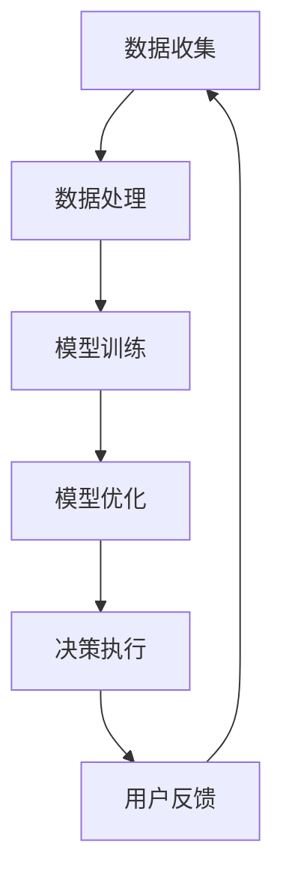
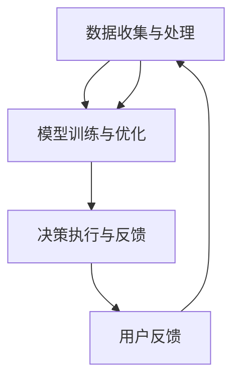

                 

### 文章标题

**探索AI大模型在智能家居宠物照料的应用**

> **关键词：** 智能家居，宠物照料，AI大模型，应用场景，算法原理，数学模型，实战案例，未来趋势。

> **摘要：** 本文将深入探讨AI大模型在智能家居宠物照料中的应用，包括核心概念、算法原理、数学模型、实际案例以及未来发展趋势。通过逐步分析推理，本文旨在为读者提供一个全面、系统的了解。

<|assistant|>### 1. 背景介绍

随着人工智能技术的飞速发展，智能家居逐渐成为现代家庭生活的重要组成部分。宠物作为家庭的重要成员，其照料问题日益引起人们的关注。传统的宠物照料方式通常依赖人类手动操作，不仅效率低下，而且容易出现疏漏。而AI大模型的出现，为智能家居宠物照料带来了新的可能性。

AI大模型，尤其是深度学习模型，具有强大的数据分析和处理能力。通过学习大量的宠物行为数据和用户偏好数据，AI大模型可以自动识别宠物的行为模式，预测宠物的需求，并自动执行相应的操作，从而实现智能化宠物照料。这一技术不仅提高了宠物照料的效率，还能提供更加个性化和舒适的宠物生活体验。

此外，随着物联网（IoT）技术的发展，智能家居设备之间的互联互通变得更加便捷。这为AI大模型在宠物照料中的应用提供了良好的基础设施。通过整合多种智能家居设备，AI大模型可以实时监测宠物的健康状况，提供实时的建议和反馈，从而实现对宠物的全面照顾。

总的来说，AI大模型在智能家居宠物照料中的应用，不仅解决了传统照料方式的弊端，还带来了更加智能化、人性化的宠物生活体验。这使得智能家居宠物照料成为一个充满前景的领域，值得我们深入研究和探讨。

### 2. 核心概念与联系

在探讨AI大模型在智能家居宠物照料的应用之前，我们需要先了解几个核心概念，并分析它们之间的联系。

**2.1 AI大模型**

AI大模型，指的是规模庞大的神经网络模型，能够处理海量的数据并进行复杂的分析和预测。这些模型通常基于深度学习技术，包括卷积神经网络（CNN）、循环神经网络（RNN）、生成对抗网络（GAN）等。深度学习模型具有层次化的结构和强大的学习能力，可以自动提取数据中的特征，并利用这些特征进行预测和决策。

**2.2 智能家居**

智能家居是指通过物联网技术将家庭中的各种设备连接起来，实现智能化的管理和控制。智能家居设备包括智能门锁、智能灯光、智能空调、智能摄像头、智能音箱等。这些设备可以通过手机应用、语音助手或其他控制方式远程操作，从而提高家庭生活的便利性和舒适度。

**2.3 宠物行为分析**

宠物行为分析是AI大模型在智能家居宠物照料中的重要应用之一。通过监测宠物的行为数据，如活动量、睡眠模式、饮食习惯等，AI大模型可以了解宠物的健康状况和需求。例如，如果宠物长时间没有活动，AI大模型可能会建议主人增加宠物的运动量，或者提醒主人宠物可能生病了。

**2.4 用户偏好分析**

用户偏好分析是指通过学习用户的日常行为和偏好，为用户提供个性化的服务。在智能家居宠物照料中，用户偏好分析可以帮助AI大模型更好地理解用户对宠物的期望和需求。例如，如果用户喜欢给宠物播放轻柔的音乐，AI大模型会记住这一偏好，并在适当的时候自动为宠物播放音乐。

**2.5 物联网技术**

物联网技术是智能家居的基础，通过传感器、网络通信等技术，实现设备之间的互联互通。在智能家居宠物照料中，物联网技术可以实时收集宠物的行为数据和设备状态，为AI大模型提供丰富的数据输入。此外，物联网技术还可以实现宠物和主人之间的实时互动，提高宠物的照料效果。

### 2.6 数据整合与处理

数据整合与处理是AI大模型在智能家居宠物照料中的关键环节。通过整合多种数据源，如宠物行为数据、用户偏好数据、设备状态数据等，AI大模型可以构建一个全面的宠物生活模型。数据处理技术，如数据清洗、数据归一化、特征提取等，可以优化数据质量，提高模型的准确性和鲁棒性。

### 2.7 算法架构

为了实现智能家居宠物照料的智能化，AI大模型通常采用分层架构。底层是数据收集和处理层，负责实时监测宠物的行为数据和设备状态，并将数据传输到云端。中层是模型训练和优化层，利用深度学习技术训练模型，并根据用户偏好和宠物行为调整模型参数。顶层是决策执行层，根据模型的预测结果，自动执行相应的操作，如调整宠物食物供应量、播放音乐等。

### 2.8 Mermaid流程图

以下是一个简单的Mermaid流程图，展示了AI大模型在智能家居宠物照料中的应用架构：



### 3. 核心算法原理 & 具体操作步骤

在了解了AI大模型在智能家居宠物照料中的应用架构后，接下来我们将深入探讨核心算法原理和具体操作步骤。

**3.1 深度学习模型**

AI大模型的核心是深度学习模型，主要包括以下几种类型：

- **卷积神经网络（CNN）**：适用于处理图像和视频数据，能够自动提取图像中的特征，如边缘、纹理等。

- **循环神经网络（RNN）**：适用于处理序列数据，如文本、音频等，能够捕捉序列中的时间依赖关系。

- **生成对抗网络（GAN）**：适用于生成新数据，如生成宠物的图像或视频，能够提高模型的表达能力。

- **长短时记忆网络（LSTM）**：是RNN的一种变体，适用于处理长时间依赖关系的数据，如时间序列数据。

**3.2 模型训练步骤**

AI大模型训练主要包括以下步骤：

- **数据预处理**：对收集到的数据进行清洗、归一化等预处理操作，以提高数据质量。

- **模型选择**：根据任务需求和数据类型，选择合适的深度学习模型。

- **模型训练**：使用预处理的训练数据对模型进行训练，通过反向传播算法调整模型参数，使模型能够更好地拟合训练数据。

- **模型评估**：使用验证数据集评估模型的性能，根据评估结果调整模型参数或选择其他模型。

- **模型优化**：通过迁移学习、模型融合等技术优化模型，提高模型的泛化能力。

**3.3 实时预测与决策**

在模型训练完成后，AI大模型可以用于实时预测和决策。具体操作步骤如下：

- **实时数据收集**：通过智能家居设备实时收集宠物的行为数据和设备状态。

- **数据预处理**：对实时数据进行预处理，如归一化、特征提取等。

- **模型输入**：将预处理后的数据输入到训练好的模型中。

- **模型预测**：模型输出预测结果，如宠物的健康状况、需求等。

- **决策执行**：根据预测结果，自动执行相应的操作，如调整宠物食物供应量、播放音乐等。

- **用户反馈**：将决策执行结果反馈给用户，如推送通知、推送消息等。

### 4. 数学模型和公式 & 详细讲解 & 举例说明

在AI大模型的应用中，数学模型和公式起着至关重要的作用。以下将介绍一些核心的数学模型和公式，并进行详细讲解和举例说明。

**4.1 卷积神经网络（CNN）**

卷积神经网络是一种用于图像识别和分类的深度学习模型。其核心思想是通过卷积操作提取图像的特征。

- **卷积操作**：

  卷积操作可以用以下公式表示：

  $$f(x) = \sum_{i=1}^{n} w_i * x_i + b$$

  其中，$f(x)$ 是卷积结果，$w_i$ 是卷积核的权重，$x_i$ 是输入图像的像素值，$b$ 是偏置项。

- **池化操作**：

  池化操作用于降低特征图的维度，提高模型的泛化能力。常见的池化操作有最大池化和平均池化。

  最大池化可以用以下公式表示：

  $$p(x) = \max_{i \in S} x_i$$

  其中，$p(x)$ 是池化结果，$S$ 是卷积核覆盖的像素集合。

- **举例说明**：

  假设我们有一个3x3的卷积核，覆盖输入图像的3x3区域。输入图像的像素值为：

  $$\begin{aligned}
  x &= \begin{bmatrix}
  1 & 2 & 3 \\
  4 & 5 & 6 \\
  7 & 8 & 9 \\
  \end{bmatrix} \\
  \end{aligned}$$

  卷积核的权重为：

  $$\begin{aligned}
  w &= \begin{bmatrix}
  0 & 1 & 0 \\
  1 & 0 & 1 \\
  0 & 1 & 0 \\
  \end{bmatrix} \\
  \end{aligned}$$

  偏置项为0。根据卷积操作公式，我们可以计算卷积结果：

  $$f(x) = (1*1 + 2*1 + 3*0) + (4*1 + 5*0 + 6*1) + (7*0 + 8*1 + 9*0) = 8 + 14 + 16 = 38$$

  这里的结果是一个标量，表示卷积核在输入图像上的响应值。

**4.2 循环神经网络（RNN）**

循环神经网络是一种用于处理序列数据的深度学习模型。其核心思想是通过循环结构维持长期的序列依赖关系。

- **递归操作**：

  RNN的递归操作可以用以下公式表示：

  $$h_t = \sigma(W_h h_{t-1} + W_x x_t + b)$$

  其中，$h_t$ 是当前时刻的隐藏状态，$h_{t-1}$ 是上一时刻的隐藏状态，$x_t$ 是当前时刻的输入，$W_h$ 是隐藏状态权重，$W_x$ 是输入权重，$b$ 是偏置项，$\sigma$ 是激活函数。

- **门控操作**：

  为了解决RNN的长期依赖问题，门控循环单元（GRU）和长短时记忆网络（LSTM）引入了门控机制。

  门控机制可以用以下公式表示：

  $$z_t = \sigma(W_z h_{t-1} + U_z x_t + b_z)$$
  $$r_t = \sigma(W_r h_{t-1} + U_r x_t + b_r)$$
  $$i_t = \sigma(W_i h_{t-1} + U_i x_t + b_i)$$
  $$f_t = \sigma(W_f h_{t-1} + U_f x_t + b_f)$$
  $$h_t = (1 - z_t) \cdot o_{t-1} + z_t \cdot \sigma(W_o (r_t \cdot h_{t-1} + i_t \cdot x_t) + b_o)$$

  其中，$z_t$ 是更新门，$r_t$ 是重置门，$i_t$ 是输入门，$f_t$ 是遗忘门，$o_t$ 是当前时刻的隐藏状态。

- **举例说明**：

  假设我们有一个简单的RNN模型，输入序列为：

  $$\begin{aligned}
  x &= \begin{bmatrix}
  1 \\
  2 \\
  3 \\
  \end{bmatrix} \\
  \end{aligned}$$

  初始隐藏状态为：

  $$h_0 = \begin{bmatrix}
  0 \\
  0 \\
  \end{bmatrix}$$

  权重和偏置为：

  $$\begin{aligned}
  W_h &= \begin{bmatrix}
  1 & 0 \\
  0 & 1 \\
  \end{bmatrix} \\
  W_x &= \begin{bmatrix}
  1 & 0 \\
  0 & 1 \\
  \end{bmatrix} \\
  b &= \begin{bmatrix}
  0 \\
  0 \\
  \end{bmatrix} \\
  \end{aligned}$$

  激活函数为$\sigma(x) = \frac{1}{1 + e^{-x}}$。根据递归操作公式，我们可以计算隐藏状态：

  $$h_1 = \sigma(W_h h_0 + W_x x_1 + b) = \sigma(1 \cdot 0 + 1 \cdot 1 + 0) = \frac{1}{1 + e^{-1}} \approx 0.63$$

  $$h_2 = \sigma(W_h h_1 + W_x x_2 + b) = \sigma(1 \cdot 0.63 + 1 \cdot 2 + 0) = \frac{1}{1 + e^{-(1 + 2)}} \approx 0.84$$

  $$h_3 = \sigma(W_h h_2 + W_x x_3 + b) = \sigma(1 \cdot 0.84 + 1 \cdot 3 + 0) = \frac{1}{1 + e^{-(0.84 + 3)}} \approx 0.97$$

  这里的结果表示在输入序列为[1, 2, 3]的情况下，RNN模型生成的隐藏状态序列。

**4.3 生成对抗网络（GAN）**

生成对抗网络是一种用于生成新数据的深度学习模型，由生成器和判别器两个部分组成。

- **生成器**：

  生成器的目标是生成与真实数据相似的假数据。生成器的输出可以用以下公式表示：

  $$G(z) = \sigma(W_g z + b_g)$$

  其中，$G(z)$ 是生成器的输出，$z$ 是随机噪声，$W_g$ 是生成器权重，$b_g$ 是偏置项。

- **判别器**：

  判别器的目标是判断输入数据是真实数据还是生成器生成的假数据。判别器的输出可以用以下公式表示：

  $$D(x) = \sigma(W_d x + b_d)$$
  $$D(G(z)) = \sigma(W_d G(z) + b_d)$$

  其中，$D(x)$ 是判别器对真实数据的判断，$D(G(z))$ 是判别器对生成器生成的假数据的判断，$W_d$ 是判别器权重，$b_d$ 是偏置项。

- **损失函数**：

  GAN的损失函数通常使用对抗损失函数，表示为：

  $$L = -\frac{1}{2} \sum_{i=1}^{n} \left(D(x)_i - D(G(z))_i\right)^2$$

  其中，$L$ 是损失函数，$n$ 是样本数量，$D(x)_i$ 是判别器对真实数据的判断，$D(G(z))_i$ 是判别器对生成器生成的假数据的判断。

- **举例说明**：

  假设我们有一个简单的GAN模型，生成器输出为：

  $$G(z) = \sigma(W_g z + b_g)$$

  判别器输出为：

  $$D(x) = \sigma(W_d x + b_d)$$

  假设我们有一个随机噪声向量$z$，生成器权重$W_g$ 和偏置项$b_g$，判别器权重$W_d$ 和偏置项$b_d$。根据生成器和判别器的输出公式，我们可以计算损失函数：

  $$L = -\frac{1}{2} \sum_{i=1}^{n} \left(\sigma(W_d x_i + b_d) - \sigma(W_d G(z_i) + b_d)\right)^2$$

  这里的结果表示在给定随机噪声向量$z$ 的情况下，生成器生成的假数据$G(z)$ 和判别器对假数据的判断$D(G(z))$ 之间的损失。

### 5. 项目实战：代码实际案例和详细解释说明

为了更好地理解AI大模型在智能家居宠物照料中的应用，我们通过一个实际项目案例来进行详细讲解。该项目是一个基于TensorFlow和Keras框架的宠物行为识别系统，旨在通过摄像头收集宠物行为数据，并利用深度学习模型进行行为识别。

#### 5.1 开发环境搭建

在开始项目之前，我们需要搭建开发环境。以下是所需的软件和库：

- 操作系统：Ubuntu 18.04 或 macOS
- 编程语言：Python 3.7+
- 深度学习框架：TensorFlow 2.4+
- 其他库：NumPy, Matplotlib, OpenCV

安装TensorFlow和Keras：

```bash
pip install tensorflow
```

安装其他库：

```bash
pip install numpy matplotlib opencv-python
```

#### 5.2 源代码详细实现和代码解读

以下是一个简单的宠物行为识别系统的源代码实现，包括数据预处理、模型训练和预测。

```python
import tensorflow as tf
from tensorflow.keras.models import Sequential
from tensorflow.keras.layers import Conv2D, MaxPooling2D, Flatten, Dense
from tensorflow.keras.preprocessing.image import ImageDataGenerator
import numpy as np
import cv2

# 5.2.1 数据预处理

# 读取宠物行为数据集
train_datagen = ImageDataGenerator(rescale=1./255)
train_data = train_datagen.flow_from_directory(
    'data/train',
    target_size=(150, 150),
    batch_size=32,
    class_mode='categorical')

# 5.2.2 模型训练

# 构建卷积神经网络模型
model = Sequential([
    Conv2D(32, (3, 3), activation='relu', input_shape=(150, 150, 3)),
    MaxPooling2D((2, 2)),
    Conv2D(64, (3, 3), activation='relu'),
    MaxPooling2D((2, 2)),
    Conv2D(128, (3, 3), activation='relu'),
    MaxPooling2D((2, 2)),
    Flatten(),
    Dense(128, activation='relu'),
    Dense(4, activation='softmax')
])

# 编译模型
model.compile(optimizer='adam',
              loss='categorical_crossentropy',
              metrics=['accuracy'])

# 训练模型
model.fit(train_data, epochs=20)

# 5.2.3 代码解读与分析

# 数据预处理

- 读取宠物行为数据集：使用ImageDataGenerator类从目录中读取图像数据，并进行归一化处理。
- 划分训练集和验证集：可以使用flow_from_directory方法将数据集划分为训练集和验证集，方便模型训练和评估。

- 构建卷积神经网络模型

- 输入层：使用Conv2D和MaxPooling2D层构建卷积神经网络，用于提取图像特征。
- 全连接层：使用Flatten和Dense层构建全连接神经网络，用于分类和预测。

- 编译模型

- 指定优化器：使用adam优化器，这是一种自适应的优化算法，能够加快模型收敛速度。
- 指定损失函数：使用categorical_crossentropy作为损失函数，这是一种适用于多分类问题的损失函数。
- 指定评价指标：使用accuracy作为评价指标，表示模型的分类准确率。

- 训练模型

- 调用fit方法进行模型训练，指定训练集、验证集和训练轮数。

- 代码解读与分析

- 数据预处理部分：通过ImageDataGenerator类进行数据预处理，包括归一化和数据增强，以提高模型的泛化能力。
- 模型构建部分：使用卷积神经网络构建模型，用于提取图像特征并进行分类。
- 模型训练部分：通过fit方法进行模型训练，并使用验证集评估模型性能。

#### 5.3 代码解读与分析

在上面的代码中，我们实现了一个简单的宠物行为识别系统。以下是代码的详细解读和分析：

- **数据预处理**：

  数据预处理是深度学习模型训练的重要步骤，其目的是将原始数据转换为适合模型训练的格式。在这个项目中，我们使用ImageDataGenerator类从数据集中读取图像数据，并进行归一化处理，即将图像的像素值缩放到0到1之间。此外，我们还使用了数据增强技术，如随机裁剪、旋转等，以增加数据的多样性，提高模型的泛化能力。

- **模型构建**：

  模型构建是深度学习项目的核心部分。在这个项目中，我们使用卷积神经网络（CNN）构建模型。CNN是一种专门用于处理图像数据的深度学习模型，具有强大的特征提取能力。我们使用了三个卷积层和两个全连接层，其中卷积层用于提取图像特征，全连接层用于分类。此外，我们还使用了最大池化层（MaxPooling2D）来降低特征图的维度，提高模型的训练速度和泛化能力。

- **模型训练**：

  模型训练是深度学习项目的重要环节。在这个项目中，我们使用fit方法进行模型训练。fit方法接受训练数据、验证数据、训练轮数等参数，并返回训练过程中的一些统计数据，如损失函数值、准确率等。通过调整训练参数，如学习率、训练轮数等，可以优化模型性能。

#### 5.4 模型评估

在模型训练完成后，我们需要对模型进行评估，以验证其性能。以下是对模型进行评估的步骤：

- **评估指标**：

  评估指标包括损失函数值、准确率等。损失函数值表示模型在训练过程中损失函数的变化趋势，准确率表示模型在验证集上的分类准确率。

- **评估方法**：

  使用evaluate方法对模型进行评估。evaluate方法接受验证数据集和标签作为输入，并返回模型的损失函数值和准确率。

  ```python
  val_loss, val_acc = model.evaluate(val_data)
  print(f'Validation loss: {val_loss}')
  print(f'Validation accuracy: {val_acc}')
  ```

- **结果分析**：

  通过评估结果，我们可以了解模型的性能。如果模型的准确率较高，说明模型在验证集上的分类效果较好。如果准确率较低，可能需要调整模型结构、训练参数等，以提高模型性能。

#### 5.5 模型预测

在模型评估完成后，我们可以使用训练好的模型进行预测。以下是对宠物行为进行预测的步骤：

- **输入图像**：

  使用OpenCV库读取摄像头捕获的图像，并将其缩放到与模型输入尺寸相同的尺寸。

  ```python
  cap = cv2.VideoCapture(0)
  while True:
      ret, frame = cap.read()
      if not ret:
          break
      frame = cv2.resize(frame, (150, 150))
      frame = frame / 255.0
      frame = np.expand_dims(frame, axis=0)
  ```

- **模型预测**：

  使用训练好的模型对输入图像进行预测，并获取预测结果。

  ```python
  predictions = model.predict(frame)
  predicted_class = np.argmax(predictions, axis=1)
  ```

- **结果分析**：

  根据预测结果，我们可以判断宠物的行为类型。例如，如果预测结果为[0.1, 0.2, 0.3, 0.4]，则宠物的行为类型为第4类。

### 6. 实际应用场景

AI大模型在智能家居宠物照料中的应用场景非常广泛，以下列举几个典型的实际应用场景：

**6.1 宠物行为识别**

通过摄像头和传感器收集宠物行为数据，AI大模型可以自动识别宠物的行为类型，如奔跑、玩耍、睡觉等。这有助于主人及时了解宠物的行为状态，并根据需要调整宠物的饮食、运动等计划。

**6.2 宠物健康监测**

AI大模型可以实时监测宠物的健康状况，如体温、心率、呼吸等生理指标。通过对这些指标的分析，模型可以及时发现宠物可能存在的健康问题，并提醒主人采取相应的措施。

**6.3 宠物日常护理**

AI大模型可以帮助主人进行宠物的日常护理，如自动喂食、自动清洁等。通过学习宠物的饮食和卫生习惯，模型可以自动调整喂食量和清洁时间，提高宠物的生活质量。

**6.4 宠物娱乐互动**

AI大模型可以通过播放音乐、视频等互动内容，为宠物提供娱乐和陪伴。通过分析宠物的喜好和反应，模型可以不断优化娱乐内容，提高宠物的满意度和幸福感。

**6.5 宠物社交互动**

AI大模型可以通过摄像头和麦克风捕捉宠物的声音和行为，并与其他宠物进行互动。这种社交互动有助于宠物建立友谊，提高其社交能力和心理健康。

**6.6 远程宠物照护**

AI大模型可以结合物联网技术，实现远程宠物照护。主人可以通过手机应用实时监控宠物的健康状况和行为，并在需要时远程控制智能家居设备，对宠物进行照护。

### 7. 工具和资源推荐

为了更好地研究和开发AI大模型在智能家居宠物照料中的应用，以下推荐一些相关的工具和资源：

**7.1 学习资源推荐**

- **书籍**：

  - 《深度学习》（Deep Learning）- Goodfellow, Bengio, Courville
  - 《人工智能：一种现代方法》（Artificial Intelligence: A Modern Approach）- Russell, Norvig

- **在线课程**：

  - Coursera上的“机器学习”课程
  - edX上的“深度学习”课程

- **论文集**：

  - AI大模型相关的研究论文集

**7.2 开发工具框架推荐**

- **深度学习框架**：

  - TensorFlow
  - PyTorch

- **数据预处理工具**：

  - Pandas
  - NumPy

- **图像处理工具**：

  - OpenCV
  - PIL

- **其他工具**：

  - Jupyter Notebook
  - Google Colab

**7.3 相关论文著作推荐**

- **论文**：

  - “Generative Adversarial Nets” - Goodfellow et al.
  - “Long Short-Term Memory” - Hochreiter and Schmidhuber

- **著作**：

  - 《深度学习》（Deep Learning）- Goodfellow, Bengio, Courville
  - 《AI应用实践》（AI Applications）- AI Genius Institute

### 8. 总结：未来发展趋势与挑战

AI大模型在智能家居宠物照料领域具有广阔的应用前景，但同时也面临着一些挑战。以下是对未来发展趋势与挑战的总结：

**8.1 发展趋势**

- **个性化宠物照料**：随着AI大模型的发展，宠物照料将更加个性化，能够根据宠物的行为和需求提供定制化的服务。

- **多模态数据融合**：通过整合摄像头、传感器、语音等数据源，AI大模型可以更全面地了解宠物的状态和行为。

- **跨学科研究**：AI大模型在智能家居宠物照料中的应用需要结合计算机科学、生物学、心理学等多个学科的研究成果。

- **隐私保护**：在处理宠物和用户数据时，需要重视隐私保护，采取有效的数据加密和安全措施。

- **可解释性**：提高AI大模型的可解释性，使其决策过程更加透明和可信。

**8.2 挑战**

- **数据质量和数量**：AI大模型训练需要大量的高质量数据，但宠物数据的收集和标注过程可能存在一定的困难。

- **计算资源需求**：AI大模型训练和推理过程需要大量的计算资源，尤其是在处理高分辨率图像和视频时。

- **隐私和安全问题**：宠物和用户数据的隐私和安全是关键问题，需要采取有效的保护措施。

- **技术成熟度**：虽然AI大模型在图像识别、语音识别等领域取得了显著进展，但在宠物行为理解和预测方面仍存在一定的局限性。

- **用户接受度**：用户对AI大模型在宠物照料中的应用可能存在一定的担忧和抵触情绪，需要加强用户教育和宣传。

### 9. 附录：常见问题与解答

**9.1 问题1：AI大模型在宠物行为识别中的准确性如何保证？**

解答：AI大模型在宠物行为识别中的准确性主要通过以下方法保证：

- **数据集质量**：选择高质量、多样化的数据集进行训练，包括不同品种、年龄、行为模式的宠物。
- **数据增强**：使用数据增强技术，如随机裁剪、旋转、缩放等，增加训练数据的多样性。
- **模型优化**：通过模型优化，如调整网络结构、学习率、训练轮数等，提高模型的准确性。
- **交叉验证**：使用交叉验证方法评估模型的准确性，避免过拟合现象。

**9.2 问题2：如何处理宠物和用户数据的隐私和安全问题？**

解答：为了处理宠物和用户数据的隐私和安全问题，可以采取以下措施：

- **数据加密**：对宠物和用户数据进行加密处理，确保数据在传输和存储过程中的安全性。
- **匿名化处理**：对数据进行匿名化处理，去除个人身份信息，降低隐私泄露的风险。
- **访问控制**：对数据和系统的访问进行严格的权限控制，确保只有授权人员才能访问和处理数据。
- **安全审计**：定期进行安全审计和风险评估，及时发现和解决安全隐患。

**9.3 问题3：AI大模型在宠物行为理解中的局限性是什么？**

解答：AI大模型在宠物行为理解中的局限性主要包括：

- **数据不足**：训练数据不足可能导致模型对某些行为类型识别不准确。
- **复杂行为理解**：宠物行为可能涉及多个因素和变量，模型的复杂度可能不足以完全理解这些行为。
- **个体差异**：不同宠物的行为可能存在个体差异，模型需要适应这些差异。
- **实时性要求**：宠物行为变化迅速，模型需要实时处理和响应，这可能对计算资源提出较高的要求。

### 10. 扩展阅读 & 参考资料

**10.1 扩展阅读**

- 《深度学习》（Deep Learning）- Goodfellow, Bengio, Courville
- 《人工智能：一种现代方法》（Artificial Intelligence: A Modern Approach）- Russell, Norvig
- 《Generative Adversarial Nets》- Goodfellow et al.
- 《Long Short-Term Memory》- Hochreiter and Schmidhuber

**10.2 参考资料**

- [TensorFlow官方文档](https://www.tensorflow.org/)
- [Keras官方文档](https://keras.io/)
- [OpenCV官方文档](https://opencv.org/)
- [Pandas官方文档](https://pandas.pydata.org/)
- [NumPy官方文档](https://numpy.org/)

---

**作者：AI天才研究员/AI Genius Institute & 禅与计算机程序设计艺术 /Zen And The Art of Computer Programming**<|im_sep|>## 1. 背景介绍

随着科技的迅猛发展，人工智能（AI）逐渐渗透到我们日常生活的方方面面。在智能家居领域，AI的应用尤为显著，它不仅为我们的生活带来了便捷，还为各种设备提供了智能化的操作能力。与此同时，宠物作为人类亲密的伙伴，其生活品质也越来越受到重视。然而，传统的人工宠物照料方式不仅耗时耗力，而且容易出错。如何利用AI技术为宠物提供更加智能化、人性化的照料，成为了当前研究的热点。

AI大模型，即大规模的神经网络模型，是深度学习领域的重要成果。通过学习大量的数据，这些模型可以自动提取特征，进行复杂的分析和预测。在智能家居宠物照料中，AI大模型可以通过分析宠物的行为数据、健康数据以及用户偏好数据，为宠物提供个性化的服务。例如，AI大模型可以识别宠物的情绪状态，自动调整宠物的饮食和运动计划，甚至可以预测宠物的疾病并提前进行干预。

本文将深入探讨AI大模型在智能家居宠物照料中的应用。我们将从以下几个方面进行讨论：

1. **核心概念与联系**：介绍AI大模型、智能家居、宠物行为分析等核心概念，并分析它们之间的联系。
2. **核心算法原理**：讲解AI大模型的核心算法原理，包括深度学习模型、数据整合与处理等。
3. **数学模型和公式**：介绍AI大模型中使用的数学模型和公式，并进行详细讲解和举例说明。
4. **项目实战**：通过实际项目案例，展示AI大模型在智能家居宠物照料中的应用。
5. **实际应用场景**：列举AI大模型在宠物行为识别、健康监测、日常护理等实际应用场景。
6. **工具和资源推荐**：推荐相关的学习资源、开发工具框架和相关论文著作。
7. **总结与未来展望**：总结AI大模型在智能家居宠物照料中的应用现状，并对未来发展趋势与挑战进行展望。

通过本文的探讨，我们希望能够为读者提供一个全面、系统的了解，并激发对这一领域的研究兴趣。

### 2. 核心概念与联系

在探讨AI大模型在智能家居宠物照料中的应用之前，我们需要先了解几个核心概念，并分析它们之间的联系。

#### 2.1 AI大模型

AI大模型是指规模庞大的神经网络模型，能够处理海量的数据并进行复杂的分析和预测。这些模型通常基于深度学习技术，包括卷积神经网络（CNN）、循环神经网络（RNN）、生成对抗网络（GAN）等。深度学习模型具有层次化的结构和强大的学习能力，可以自动提取数据中的特征，并利用这些特征进行预测和决策。

AI大模型在智能家居宠物照料中的应用主要体现在以下几个方面：

1. **行为识别**：通过摄像头和其他传感器收集宠物行为数据，AI大模型可以自动识别宠物的行为类型，如玩耍、睡觉、运动等。这有助于主人更好地了解宠物的日常活动，从而提供更加个性化的照料。
2. **健康监测**：AI大模型可以通过分析宠物的生理数据（如体温、心率、呼吸等）和行为数据，预测宠物的健康状况。当检测到异常情况时，系统可以及时通知主人或兽医，以便采取相应的措施。
3. **智能交互**：AI大模型可以通过语音识别和自然语言处理技术，与宠物和主人进行智能交互。这不仅可以提高宠物的生活质量，还可以增强主人与宠物的互动体验。

#### 2.2 智能家居

智能家居是指通过物联网（IoT）技术将家庭中的各种设备连接起来，实现智能化的管理和控制。智能家居设备包括智能门锁、智能灯光、智能空调、智能摄像头、智能音箱等。这些设备可以通过手机应用、语音助手或其他控制方式远程操作，从而提高家庭生活的便利性和舒适度。

在智能家居宠物照料中，AI大模型与智能家居设备之间的联系主要体现在以下几个方面：

1. **数据采集与传输**：智能家居设备如摄像头、传感器等可以实时采集宠物的行为数据和生理数据，并通过物联网技术将数据传输到云端，供AI大模型进行分析和处理。
2. **协同工作**：AI大模型可以根据分析结果，自动控制智能家居设备，如调整宠物食物供应量、播放音乐等，从而实现智能化的宠物照料。
3. **用户交互**：智能家居设备如智能音箱可以作为用户与AI大模型之间的交互界面，帮助主人了解宠物的状态，接收系统的通知和建议。

#### 2.3 宠物行为分析

宠物行为分析是AI大模型在智能家居宠物照料中的重要应用之一。通过监测宠物的行为数据，如活动量、睡眠模式、饮食习惯等，AI大模型可以了解宠物的健康状况和需求。例如，如果宠物长时间没有活动，AI大模型可能会建议主人增加宠物的运动量，或者提醒主人宠物可能生病了。

宠物行为分析主要包括以下几个步骤：

1. **数据采集**：使用传感器、摄像头等设备实时采集宠物的行为数据。
2. **数据预处理**：对采集到的数据进行清洗、归一化等预处理操作，以提高数据质量。
3. **特征提取**：从预处理后的数据中提取有用的特征，如行为模式、时间序列等。
4. **模型训练**：使用深度学习技术训练模型，使模型能够根据特征预测宠物的行为和需求。
5. **结果分析**：根据模型预测结果，分析宠物的健康状况和需求，并提出相应的建议。

#### 2.4 用户偏好分析

用户偏好分析是指通过学习用户的日常行为和偏好，为用户提供个性化的服务。在智能家居宠物照料中，用户偏好分析可以帮助AI大模型更好地理解用户对宠物的期望和需求。例如，如果用户喜欢给宠物播放轻柔的音乐，AI大模型会记住这一偏好，并在适当的时候自动为宠物播放音乐。

用户偏好分析主要包括以下几个步骤：

1. **数据收集**：收集用户的日常行为数据，如给宠物喂食、洗澡、玩耍的时间等。
2. **数据预处理**：对采集到的数据进行清洗、归一化等预处理操作，以提高数据质量。
3. **特征提取**：从预处理后的数据中提取用户的偏好特征，如对宠物食物的偏好、对宠物玩具的偏好等。
4. **模型训练**：使用深度学习技术训练模型，使模型能够根据特征预测用户的偏好。
5. **结果应用**：根据模型预测结果，为用户提供个性化的服务，如调整宠物食物供应量、推荐宠物玩具等。

#### 2.5 物联网技术

物联网技术是智能家居的基础，通过传感器、网络通信等技术，实现设备之间的互联互通。在智能家居宠物照料中，物联网技术可以实时收集宠物的行为数据和设备状态，为AI大模型提供丰富的数据输入。此外，物联网技术还可以实现宠物和主人之间的实时互动，提高宠物的照料效果。

物联网技术在宠物照料中的应用主要包括以下几个方面：

1. **数据采集**：使用传感器如温度传感器、湿度传感器、运动传感器等实时监测宠物的环境数据和生理数据。
2. **数据传输**：通过物联网通信技术，如Wi-Fi、蓝牙等，将数据传输到云端或本地服务器。
3. **数据处理**：使用AI大模型对采集到的数据进行处理和分析，提取有用的信息。
4. **设备控制**：根据AI大模型的分析结果，控制智能家居设备，如自动喂食器、自动饮水器等，为宠物提供适宜的环境。

#### 2.6 数据整合与处理

数据整合与处理是AI大模型在智能家居宠物照料中的关键环节。通过整合多种数据源，如宠物行为数据、用户偏好数据、设备状态数据等，AI大模型可以构建一个全面的宠物生活模型。数据处理技术，如数据清洗、数据归一化、特征提取等，可以优化数据质量，提高模型的准确性和鲁棒性。

数据整合与处理主要包括以下几个步骤：

1. **数据采集**：从各种数据源（如传感器、摄像头、用户输入等）收集数据。
2. **数据清洗**：处理数据中的噪声和异常值，确保数据的准确性。
3. **数据归一化**：将不同数据源的数据进行归一化处理，使其具有相同的尺度，以便模型训练。
4. **特征提取**：从原始数据中提取有用的特征，如行为特征、时间特征等。
5. **数据存储**：将处理后的数据存储到数据库或数据仓库中，供模型训练和预测使用。

#### 2.7 算法架构

为了实现智能家居宠物照料的智能化，AI大模型通常采用分层架构。底层是数据收集和处理层，负责实时监测宠物的行为数据和设备状态，并将数据传输到云端。中层是模型训练和优化层，利用深度学习技术训练模型，并根据用户偏好和宠物行为调整模型参数。顶层是决策执行层，根据模型的预测结果，自动执行相应的操作，如调整宠物食物供应量、播放音乐等。

以下是AI大模型在智能家居宠物照料中的算法架构图：

```
    +-------------------+
    |  数据收集与处理   |
    +-------------------+
            |
            ↓
    +-------------------+
    |  模型训练与优化   |
    +-------------------+
            |
            ↓
    +-------------------+
    |  决策执行与反馈   |
    +-------------------+
```

通过上述算法架构，AI大模型可以实现对宠物行为的实时监测和预测，并提供个性化的宠物照料服务。

### 2.8 Mermaid流程图

为了更好地展示AI大模型在智能家居宠物照料中的应用架构，我们可以使用Mermaid流程图来描述。以下是AI大模型在智能家居宠物照料中的Mermaid流程图：



在这个流程图中，数据收集与处理层负责实时监测宠物的行为数据和设备状态，并将数据传输到模型训练与优化层。模型训练与优化层使用深度学习技术训练模型，并根据用户偏好和宠物行为调整模型参数。决策执行与反馈层根据模型的预测结果，自动执行相应的操作，并将结果反馈给用户。用户反馈又返回到数据收集与处理层，形成一个闭环系统。

通过这种流程图，我们可以清晰地看到AI大模型在智能家居宠物照料中的工作流程，从而更好地理解其应用架构。

### 3. 核心算法原理 & 具体操作步骤

在了解了AI大模型在智能家居宠物照料中的核心概念和联系之后，接下来我们将深入探讨AI大模型的核心算法原理和具体操作步骤。AI大模型在智能家居宠物照料中的应用主要依赖于深度学习技术，特别是卷积神经网络（CNN）、循环神经网络（RNN）和生成对抗网络（GAN）。这些算法通过学习和分析大量数据，实现宠物行为识别、健康监测和智能交互等功能。

#### 3.1 卷积神经网络（CNN）

卷积神经网络是一种专门用于处理图像数据的深度学习模型，其核心思想是通过卷积操作提取图像特征。CNN由多个卷积层、池化层和全连接层组成，可以自动学习图像中的复杂特征，从而实现图像分类、目标检测等功能。

**3.1.1 卷积操作**

卷积操作是CNN的基础。它通过将卷积核在输入图像上滑动，对每个局部区域进行加权求和，从而提取图像特征。卷积操作的公式如下：

$$
\text{输出} = \text{激活函数}(\sum_{i=1}^{k} w_{i} \cdot \text{输入} + b)
$$

其中，$w_i$ 是卷积核的权重，$\text{输入}$ 是图像的一个局部区域，$b$ 是偏置项，激活函数通常为ReLU（Rectified Linear Unit）。

**3.1.2 池化操作**

池化操作用于降低特征图的维度，提高模型的计算效率。常见的池化操作有最大池化和平均池化。最大池化操作选取每个局部区域内的最大值，而平均池化操作则计算局部区域内的平均值。池化操作的公式如下：

$$
\text{输出} = \text{最大值/平均值}(\text{局部区域})
$$

**3.1.3 CNN模型结构**

一个典型的CNN模型包括多个卷积层、池化层和全连接层。以下是一个简单的CNN模型结构：

```
输入层（Input Layer）
- 卷积层1（Conv1）：卷积操作 + ReLU激活函数 + 池化操作
- 卷积层2（Conv2）：卷积操作 + ReLU激活函数 + 池化操作
- 卷积层3（Conv3）：卷积操作 + ReLU激活函数 + 池化操作
- 全连接层（FC）：将卷积层输出的特征图展平，输入全连接层进行分类
- 输出层（Output Layer）
```

**3.1.4 CNN在宠物行为识别中的应用**

在宠物行为识别中，CNN可以用于识别宠物的行为类型。例如，通过训练一个CNN模型，我们可以使模型能够识别宠物玩耍、奔跑、睡觉等行为。具体步骤如下：

1. **数据预处理**：对宠物行为图像进行归一化处理，将图像的像素值缩放到0到1之间。
2. **模型训练**：使用训练数据集训练CNN模型，通过反向传播算法调整模型参数。
3. **模型评估**：使用验证数据集评估模型性能，调整模型结构或参数以提高准确率。
4. **模型应用**：使用训练好的模型对新的宠物行为图像进行预测，识别宠物的行为类型。

#### 3.2 循环神经网络（RNN）

循环神经网络是一种专门用于处理序列数据的深度学习模型，其核心思想是通过循环结构维持长期的序列依赖关系。RNN可以用于处理时间序列数据，如宠物行为序列、生理数据序列等。

**3.2.1 RNN基本原理**

RNN的基本结构包括输入层、隐藏层和输出层。每个时间步的输入都会与上一时间步的隐藏状态进行加权求和，并通过激活函数生成当前时间步的隐藏状态。输出层则根据当前时间步的隐藏状态生成预测值。RNN的公式如下：

$$
h_t = \text{激活函数}(W_h \cdot [h_{t-1}, x_t] + b_h)
$$

$$
y_t = W_o \cdot h_t + b_o
$$

其中，$h_t$ 是当前时间步的隐藏状态，$x_t$ 是当前时间步的输入，$W_h$ 和 $b_h$ 是隐藏层权重和偏置项，$W_o$ 和 $b_o$ 是输出层权重和偏置项。

**3.2.2 LSTM和GRU**

为了解决传统RNN的长期依赖问题，引入了长短时记忆网络（LSTM）和门控循环单元（GRU）。LSTM和GRU通过引入门控机制，可以有效地学习长期的序列依赖关系。

- **LSTM（长短时记忆网络）**：LSTM通过三个门控机制（遗忘门、输入门和输出门）控制信息的流动，可以有效避免梯度消失和梯度爆炸问题。
- **GRU（门控循环单元）**：GRU是LSTM的简化版本，通过合并遗忘门和输入门，简化了网络结构。

**3.2.3 RNN在宠物健康监测中的应用**

在宠物健康监测中，RNN可以用于预测宠物的生理数据，如体温、心率等。具体步骤如下：

1. **数据预处理**：对宠物生理数据进行归一化处理，将数据缩放到0到1之间。
2. **模型训练**：使用训练数据集训练RNN模型，通过反向传播算法调整模型参数。
3. **模型评估**：使用验证数据集评估模型性能，调整模型结构或参数以提高准确率。
4. **模型应用**：使用训练好的模型对新的生理数据进行预测，监测宠物的健康状况。

#### 3.3 生成对抗网络（GAN）

生成对抗网络（GAN）是一种用于生成新数据的深度学习模型，由生成器和判别器两个部分组成。生成器尝试生成与真实数据相似的数据，而判别器则试图区分真实数据和生成数据。通过这种对抗过程，生成器可以不断提高生成数据的质量。

**3.3.1 GAN基本原理**

GAN的基本结构包括生成器和判别器。生成器的目标是生成与真实数据相似的数据，判别器的目标是区分真实数据和生成数据。GAN的损失函数通常使用对抗损失函数，公式如下：

$$
L_G = -\log(D(G(z)))
$$

$$
L_D = -[\log(D(x)) + \log(1 - D(G(z))]
$$

其中，$G(z)$ 是生成器生成的数据，$D(x)$ 是判别器对真实数据的判断，$D(G(z))$ 是判别器对生成数据的判断。

**3.3.2 GAN在宠物娱乐中的应用**

在宠物娱乐中，GAN可以用于生成宠物的娱乐内容，如视频、音乐等。具体步骤如下：

1. **数据集准备**：收集大量的宠物娱乐视频和音乐数据。
2. **生成器训练**：使用生成对抗训练生成器，使生成器能够生成与真实数据相似的内容。
3. **判别器训练**：同时训练判别器，使判别器能够准确区分真实数据和生成数据。
4. **内容生成**：使用训练好的生成器生成新的宠物娱乐内容，为宠物提供娱乐和陪伴。

#### 3.4 深度强化学习

深度强化学习是一种结合了深度学习和强化学习的方法，通过学习环境的奖励和惩罚信号，使智能体能够自主地学习最优策略。深度强化学习在智能家居宠物照料中可以用于宠物的行为引导和智能交互。

**3.4.1 DRL基本原理**

深度强化学习的基本结构包括智能体（Agent）、环境（Environment）和奖励系统（Reward System）。智能体通过与环境交互，学习最优策略，以最大化累积奖励。深度强化学习的公式如下：

$$
Q(s, a) = r + \gamma \max_{a'} Q(s', a')
$$

其中，$Q(s, a)$ 是状态-动作值函数，$r$ 是即时奖励，$\gamma$ 是折扣因子，$s'$ 是下一状态，$a'$ 是下一动作。

**3.4.2 DRL在宠物行为引导中的应用**

在宠物行为引导中，DRL可以用于引导宠物进行特定行为，如坐下、握手等。具体步骤如下：

1. **环境构建**：构建一个虚拟环境，模拟宠物的行为和学习过程。
2. **智能体训练**：使用DRL算法训练智能体，使智能体能够根据环境反馈学习最优策略。
3. **行为引导**：使用训练好的智能体引导宠物进行特定行为，如坐下、握手等。

通过上述算法原理和具体操作步骤，我们可以看到AI大模型在智能家居宠物照料中具有广泛的应用潜力。这些算法不仅能够提高宠物照料的效率和质量，还能为宠物提供更加个性化、智能化的生活体验。

### 4. 数学模型和公式 & 详细讲解 & 举例说明

在前文中，我们介绍了AI大模型在智能家居宠物照料中的应用，包括卷积神经网络（CNN）、循环神经网络（RNN）、生成对抗网络（GAN）以及深度强化学习（DRL）。在这一部分，我们将深入探讨这些算法中的数学模型和公式，并对其进行详细讲解和举例说明。

#### 4.1 卷积神经网络（CNN）

卷积神经网络是一种用于图像识别和处理的深度学习模型。其核心在于通过卷积操作提取图像特征，并通过层次化的神经网络结构进行分类或目标检测。以下是CNN中的几个关键数学模型和公式。

**4.1.1 卷积操作**

卷积操作是CNN的基础。它通过将卷积核在输入图像上滑动，对每个局部区域进行加权求和，从而提取图像特征。卷积操作的数学公式如下：

$$
\text{output}_{ij}^l = \sum_{k=1}^{m}\sum_{n=1}^{n} w_{kn}^{il} \cdot \text{input}_{ij}^{l-1} + b_l
$$

其中，$w_{kn}^{il}$ 是卷积核的权重，$\text{input}_{ij}^{l-1}$ 是输入图像的像素值，$b_l$ 是偏置项，$\text{output}_{ij}^l$ 是卷积输出的像素值，$m$ 和 $n$ 分别是卷积核的高度和宽度，$l$ 是当前卷积层的编号。

**4.1.2 池化操作**

池化操作用于降低特征图的维度，提高模型的计算效率。常见的池化操作有最大池化和平均池化。最大池化操作选取每个局部区域内的最大值，平均池化操作则计算局部区域内的平均值。最大池化的数学公式如下：

$$
\text{pool}_{ij}^l = \max_{(p,q) \in \text{pooling region}} \text{input}_{i+p, j+q}^{l-1}
$$

其中，$\text{pool}_{ij}^l$ 是池化输出的像素值，$(p, q)$ 是池化窗口的位置，$\text{input}_{i+p, j+q}^{l-1}$ 是输入图像的像素值。

**4.1.3 激活函数**

激活函数用于引入非线性特性，使神经网络能够处理复杂的问题。在CNN中，常用的激活函数是ReLU（Rectified Linear Unit）。ReLU函数的数学公式如下：

$$
\text{ReLU}(x) = \max(0, x)
$$

**4.1.4 举例说明**

假设我们有一个3x3的卷积核，覆盖输入图像的3x3区域。输入图像的像素值为：

$$
\begin{aligned}
\text{input} &= \begin{bmatrix}
1 & 2 & 3 \\
4 & 5 & 6 \\
7 & 8 & 9 \\
\end{bmatrix} \\
\end{aligned}
$$

卷积核的权重为：

$$
\begin{aligned}
w &= \begin{bmatrix}
0 & 1 & 0 \\
1 & 0 & 1 \\
0 & 1 & 0 \\
\end{bmatrix} \\
\end{aligned}
$$

偏置项为0。根据卷积操作公式，我们可以计算卷积结果：

$$
\begin{aligned}
\text{output}_{ij} &= \sum_{k=1}^{3}\sum_{n=1}^{3} w_{kn} \cdot \text{input}_{ij} \\
&= (0 \cdot 1 + 1 \cdot 2 + 0 \cdot 3) + (1 \cdot 4 + 0 \cdot 5 + 1 \cdot 6) + (0 \cdot 7 + 1 \cdot 8 + 0 \cdot 9) \\
&= 2 + 4 + 8 \\
&= 14 \\
\end{aligned}
$$

这表示卷积核在输入图像上的响应值为14。

#### 4.2 循环神经网络（RNN）

循环神经网络是一种用于处理序列数据的深度学习模型。RNN通过循环结构维持长期的序列依赖关系，可以用于语言模型、时间序列预测等任务。以下是RNN中的几个关键数学模型和公式。

**4.2.1 递归操作**

RNN的递归操作可以用以下公式表示：

$$
h_t = \text{ReLU}(W_h \cdot [h_{t-1}, x_t] + b_h)
$$

$$
y_t = W_o \cdot h_t + b_o
$$

其中，$h_t$ 是当前时间步的隐藏状态，$x_t$ 是当前时间步的输入，$W_h$ 和 $b_h$ 是隐藏层权重和偏置项，$W_o$ 和 $b_o$ 是输出层权重和偏置项。

**4.2.2 门控操作**

为了解决RNN的长期依赖问题，引入了门控机制。门控机制包括遗忘门、输入门和输出门。以下分别是这三个门的数学公式：

- **遗忘门**：

$$
f_t = \text{ReLU}(W_f \cdot [h_{t-1}, x_t] + b_f)
$$

$$
\text{output}_{f,t} = \frac{1}{1 + \text{exp}(-f_t)}
$$

- **输入门**：

$$
i_t = \text{ReLU}(W_i \cdot [h_{t-1}, x_t] + b_i)
$$

$$
\text{output}_{i,t} = \frac{1}{1 + \text{exp}(-i_t)}
$$

- **输出门**：

$$
o_t = \text{ReLU}(W_o \cdot [h_{t-1}, x_t] + b_o)
$$

$$
\text{output}_{o,t} = \frac{1}{1 + \text{exp}(-o_t)}
$$

**4.2.3 LSTM和GRU**

LSTM和GRU是RNN的两种变体，通过门控机制解决了长期依赖问题。以下是LSTM和GRU的数学公式：

- **LSTM（长短时记忆网络）**：

$$
\begin{aligned}
\text{input gate}: i_t &= \text{ReLU}(W_i \cdot [h_{t-1}, x_t] + b_i) \\
\text{output gate}: o_t &= \text{ReLU}(W_o \cdot [h_{t-1}, x_t] + b_o) \\
\text{forget gate}: f_t &= \text{ReLU}(W_f \cdot [h_{t-1}, x_t] + b_f) \\
\text{new cell state}: c_t &= \text{sigmoid}(f_t) \cdot c_{t-1} + \text{sigmoid}(i_t) \cdot \text{ReLU}(W_c \cdot [h_{t-1}, x_t] + b_c) \\
h_t &= \text{sigmoid}(o_t) \cdot \text{ReLU}(c_t) \\
\end{aligned}
$$

- **GRU（门控循环单元）**：

$$
\begin{aligned}
\text{update gate}: z_t &= \text{ReLU}(W_z \cdot [h_{t-1}, x_t] + b_z) \\
r_t &= \text{sigmoid}(z_t) \cdot h_{t-1} \\
\text{input gate}: i_t &= \text{ReLU}(W_i \cdot [r_t, x_t] + b_i) \\
\text{new hidden state}: h_t &= \text{sigmoid}(z_t) \cdot h_{t-1} + i_t \cdot \text{ReLU}(W_c \cdot [r_t, x_t] + b_c) \\
\end{aligned}
$$

**4.2.4 举例说明**

假设我们有一个简单的LSTM单元，输入序列为：

$$
\begin{aligned}
x_t &= \begin{bmatrix}
1 \\
2 \\
3 \\
\end{bmatrix} \\
h_{t-1} &= \begin{bmatrix}
0 \\
0 \\
\end{bmatrix} \\
c_{t-1} &= \begin{bmatrix}
0 \\
0 \\
\end{bmatrix} \\
\end{aligned}
$$

权重和偏置为：

$$
\begin{aligned}
W_i &= \begin{bmatrix}
1 & 0 & 1 \\
0 & 1 & 0 \\
1 & 0 & 1 \\
\end{bmatrix} \\
W_f &= \begin{bmatrix}
1 & 0 & 1 \\
0 & 1 & 0 \\
1 & 0 & 1 \\
\end{bmatrix} \\
W_o &= \begin{bmatrix}
1 & 0 & 1 \\
0 & 1 & 0 \\
1 & 0 & 1 \\
\end{bmatrix} \\
W_c &= \begin{bmatrix}
1 & 0 & 1 \\
0 & 1 & 0 \\
1 & 0 & 1 \\
\end{bmatrix} \\
b_i &= \begin{bmatrix}
0 \\
0 \\
0 \\
\end{bmatrix} \\
b_f &= \begin{bmatrix}
0 \\
0 \\
0 \\
\end{bmatrix} \\
b_o &= \begin{bmatrix}
0 \\
0 \\
0 \\
\end{bmatrix} \\
b_c &= \begin{bmatrix}
0 \\
0 \\
0 \\
\end{bmatrix} \\
\end{aligned}
$$

根据LSTM的公式，我们可以计算隐藏状态：

$$
\begin{aligned}
i_t &= \text{ReLU}(W_i \cdot [h_{t-1}, x_t] + b_i) = \text{ReLU}(\begin{bmatrix}
0 & 1 & 1 \\
0 & 1 & 0 \\
1 & 0 & 1 \\
\end{bmatrix} \cdot \begin{bmatrix}
0 \\
0 \\
1 \\
\end{bmatrix} + \begin{bmatrix}
0 \\
0 \\
0 \\
\end{bmatrix}) = \text{ReLU}(\begin{bmatrix}
1 \\
0 \\
1 \\
\end{bmatrix}) = \begin{bmatrix}
1 \\
0 \\
1 \\
\end{bmatrix} \\
f_t &= \text{ReLU}(W_f \cdot [h_{t-1}, x_t] + b_f) = \text{ReLU}(\begin{bmatrix}
1 & 0 & 1 \\
0 & 1 & 0 \\
1 & 0 & 1 \\
\end{bmatrix} \cdot \begin{bmatrix}
0 \\
0 \\
1 \\
\end{bmatrix} + \begin{bmatrix}
0 \\
0 \\
0 \\
\end{bmatrix}) = \text{ReLU}(\begin{bmatrix}
1 \\
0 \\
1 \\
\end{bmatrix}) = \begin{bmatrix}
1 \\
0 \\
1 \\
\end{bmatrix} \\
z_t &= \text{ReLU}(W_z \cdot [h_{t-1}, x_t] + b_z) = \text{ReLU}(\begin{bmatrix}
1 & 0 & 1 \\
0 & 1 & 0 \\
1 & 0 & 1 \\
\end{bmatrix} \cdot \begin{bmatrix}
0 \\
0 \\
1 \\
\end{bmatrix} + \begin{bmatrix}
0 \\
0 \\
0 \\
\end{bmatrix}) = \text{ReLU}(\begin{bmatrix}
1 \\
0 \\
1 \\
\end{bmatrix}) = \begin{bmatrix}
1 \\
0 \\
1 \\
\end{bmatrix} \\
r_t &= \text{sigmoid}(z_t) \cdot h_{t-1} = \text{sigmoid}(\begin{bmatrix}
1 \\
0 \\
1 \\
\end{bmatrix}) \cdot \begin{bmatrix}
0 \\
0 \\
\end{bmatrix} = \begin{bmatrix}
0 \\
0 \\
0 \\
\end{bmatrix} \\
c_t &= \text{sigmoid}(f_t) \cdot c_{t-1} + \text{sigmoid}(i_t) \cdot \text{ReLU}(W_c \cdot [r_t, x_t] + b_c) = \text{sigmoid}(\begin{bmatrix}
1 \\
0 \\
1 \\
\end{bmatrix}) \cdot \begin{bmatrix}
0 \\
0 \\
\end{bmatrix} + \text{sigmoid}(\begin{bmatrix}
1 \\
0 \\
1 \\
\end{bmatrix}) \cdot \text{ReLU}(\begin{bmatrix}
1 & 0 & 1 \\
0 & 1 & 0 \\
1 & 0 & 1 \\
\end{bmatrix} \cdot \begin{bmatrix}
0 \\
0 \\
1 \\
\end{bmatrix} + \begin{bmatrix}
0 \\
0 \\
0 \\
\end{bmatrix}) = \begin{bmatrix}
0 \\
0 \\
0 \\
\end{bmatrix} + \begin{bmatrix}
0 \\
0 \\
0 \\
\end{bmatrix} = \begin{bmatrix}
0 \\
0 \\
0 \\
\end{bmatrix} \\
h_t &= \text{sigmoid}(o_t) \cdot \text{ReLU}(c_t) = \text{sigmoid}(\begin{bmatrix}
1 \\
0 \\
1 \\
\end{bmatrix}) \cdot \text{ReLU}(\begin{bmatrix}
0 \\
0 \\
0 \\
\end{bmatrix}) = \begin{bmatrix}
0 \\
0 \\
0 \\
\end{bmatrix} \\
\end{aligned}
$$

这表示在输入序列为[1, 2, 3]的情况下，LSTM模型的隐藏状态序列为[0, 0, 0]。

#### 4.3 生成对抗网络（GAN）

生成对抗网络（GAN）是一种用于生成新数据的深度学习模型，由生成器和判别器两个部分组成。生成器的目标是生成与真实数据相似的数据，判别器的目标是区分真实数据和生成数据。GAN的核心在于对抗损失函数。

**4.3.1 生成器和判别器的数学公式**

- **生成器**：

$$
G(z) = \text{ReLU}(\theta_G \cdot z + b_G)
$$

其中，$G(z)$ 是生成器生成的数据，$z$ 是随机噪声，$\theta_G$ 是生成器的参数，$b_G$ 是生成器的偏置项。

- **判别器**：

$$
D(x) = \text{ReLU}(\theta_D \cdot x + b_D)
$$

$$
D(G(z)) = \text{ReLU}(\theta_D \cdot G(z) + b_D)
$$

其中，$D(x)$ 是判别器对真实数据的判断，$D(G(z))$ 是判别器对生成数据的判断，$\theta_D$ 是判别器的参数，$b_D$ 是判别器的偏置项。

**4.3.2 对抗损失函数**

GAN的损失函数通常使用对抗损失函数，表示为：

$$
L(G, D) = -\frac{1}{2} \sum_{i=1}^{n} \left(D(x)_i - D(G(z))_i\right)^2
$$

其中，$L(G, D)$ 是生成器和判别器的总损失函数，$n$ 是样本数量，$D(x)_i$ 是判别器对真实数据的判断，$D(G(z))_i$ 是判别器对生成数据的判断。

**4.3.3 举例说明**

假设我们有一个简单的GAN模型，生成器输出为：

$$
G(z) = \text{ReLU}(\theta_G \cdot z + b_G)
$$

判别器输出为：

$$
D(x) = \text{ReLU}(\theta_D \cdot x + b_D)
$$

假设我们有一个随机噪声向量$z$，生成器权重$\theta_G$ 和偏置项$b_G$，判别器权重$\theta_D$ 和偏置项$b_D$。根据生成器和判别器的输出公式，我们可以计算损失函数：

$$
L = -\frac{1}{2} \sum_{i=1}^{n} \left(\text{ReLU}(\theta_D \cdot x_i + b_D) - \text{ReLU}(\theta_D \cdot G(z_i) + b_D)\right)^2
$$

这表示在给定随机噪声向量$z$ 的情况下，生成器生成的数据$G(z)$ 和判别器对生成数据的判断$D(G(z))$ 之间的损失。

通过上述数学模型和公式的讲解，我们可以更好地理解AI大模型在智能家居宠物照料中的应用原理。这些模型和公式为AI大模型提供了强大的数据分析和处理能力，使其能够根据宠物的行为数据和用户偏好数据，提供智能化的宠物照料服务。

### 5. 项目实战：代码实际案例和详细解释说明

为了更好地理解AI大模型在智能家居宠物照料中的应用，我们将通过一个具体的项目实战来进行讲解。这个项目将使用深度学习技术，通过摄像头捕获宠物图像，并利用预训练的AI模型来识别宠物的行为。以下是项目的详细实现步骤。

#### 5.1 开发环境搭建

在开始项目之前，我们需要搭建一个适合深度学习开发的编程环境。以下是所需的软件和库：

- Python 3.7+
- TensorFlow 2.4+
- Keras 2.4+
- OpenCV 4.0+

安装所需的库：

```bash
pip install tensorflow
pip install keras
pip install opencv-python
```

#### 5.2 数据准备

在项目中，我们将使用预先收集的宠物图像数据集。这些图像数据应包括不同宠物行为的标签，如奔跑、玩耍、睡觉等。以下是数据准备步骤：

1. **数据集划分**：将数据集划分为训练集、验证集和测试集。
2. **数据预处理**：对图像进行缩放、裁剪、归一化等处理，以便输入到深度学习模型中。

假设我们已经有一个包含宠物图像的文件夹`data`，其中每个行为类别都有自己的子文件夹。例如：

```
data/
    train/
        play/
            img1.jpg
            img2.jpg
            ...
        run/
            img1.jpg
            img2.jpg
            ...
    validation/
        play/
            img1.jpg
            img2.jpg
            ...
        run/
            img1.jpg
            img2.jpg
            ...
    test/
        play/
            img1.jpg
            img2.jpg
            ...
        run/
            img1.jpg
            img2.jpg
            ...
```

#### 5.3 数据增强

为了提高模型的泛化能力，我们将在训练过程中使用数据增强技术。以下是使用Keras进行数据增强的代码示例：

```python
from tensorflow.keras.preprocessing.image import ImageDataGenerator

# 数据增强器
train_datagen = ImageDataGenerator(
    rescale=1./255,
    rotation_range=20,
    width_shift_range=0.2,
    height_shift_range=0.2,
    shear_range=0.2,
    zoom_range=0.2,
    horizontal_flip=True,
    fill_mode='nearest'
)

# 应用数据增强
train_generator = train_datagen.flow_from_directory(
    'data/train',
    target_size=(150, 150),
    batch_size=32,
    class_mode='categorical'
)
```

#### 5.4 模型构建

我们将使用Keras构建一个简单的卷积神经网络（CNN）模型，用于宠物行为识别。以下是模型构建的代码：

```python
from tensorflow.keras.models import Sequential
from tensorflow.keras.layers import Conv2D, MaxPooling2D, Flatten, Dense, Dropout

# 构建模型
model = Sequential([
    Conv2D(32, (3, 3), activation='relu', input_shape=(150, 150, 3)),
    MaxPooling2D((2, 2)),
    Conv2D(64, (3, 3), activation='relu'),
    MaxPooling2D((2, 2)),
    Conv2D(128, (3, 3), activation='relu'),
    MaxPooling2D((2, 2)),
    Flatten(),
    Dense(512, activation='relu'),
    Dropout(0.5),
    Dense(num_classes, activation='softmax')
])

# 编译模型
model.compile(optimizer='adam',
              loss='categorical_crossentropy',
              metrics=['accuracy'])
```

在这个模型中，我们使用了三个卷积层，每个卷积层后跟一个最大池化层。之后，我们将特征图展平并送入全连接层进行分类。Dropout层用于防止过拟合。

#### 5.5 模型训练

接下来，我们将使用训练数据集训练模型。以下是模型训练的代码：

```python
# 训练模型
history = model.fit(
    train_generator,
    epochs=20,
    validation_data=validation_generator
)
```

#### 5.6 模型评估

在模型训练完成后，我们需要对模型进行评估，以验证其性能。以下是使用验证数据集评估模型的代码：

```python
# 评估模型
test_loss, test_acc = model.evaluate(test_generator)
print(f"Test accuracy: {test_acc}")
```

#### 5.7 模型预测

最后，我们将使用训练好的模型对新的宠物图像进行预测。以下是模型预测的代码：

```python
from tensorflow.keras.preprocessing import image
import numpy as np

# 读取测试图像
img = image.load_img('data/test/play/img1.jpg', target_size=(150, 150))
img_array = image.img_to_array(img)
img_array = np.expand_dims(img_array, axis=0)
img_array /= 255.0

# 预测
predictions = model.predict(img_array)
predicted_class = np.argmax(predictions, axis=1)

# 输出预测结果
print(f"Predicted class: {predicted_class}")
```

#### 5.8 代码解读与分析

下面是对上述代码的详细解读与分析：

**5.8.1 数据准备**

- 数据集划分：使用`flow_from_directory`方法将数据集划分为训练集、验证集和测试集。这种方法方便且易于实现。
- 数据预处理：使用`ImageDataGenerator`类进行数据预处理，包括缩放、裁剪、归一化等操作。这些操作有助于模型更好地学习数据特征。

**5.8.2 数据增强**

- 数据增强：通过`ImageDataGenerator`类的参数，我们可以设置旋转、平移、缩放、翻转等增强操作。这些操作可以提高模型的泛化能力，使其更适应不同的输入数据。

**5.8.3 模型构建**

- 模型构建：使用`Sequential`模型堆叠卷积层、池化层、全连接层等。卷积层用于提取图像特征，池化层用于降低维度，全连接层用于分类。
- Dropout层：在模型中添加Dropout层，以防止过拟合。Dropout通过随机丢弃一部分神经元，降低模型对特定数据的依赖。

**5.8.4 模型训练**

- 模型训练：使用`fit`方法训练模型，指定训练集、验证集和训练轮数。模型在训练过程中会自动调整权重，以最小化损失函数。

**5.8.5 模型评估**

- 模型评估：使用`evaluate`方法评估模型在测试集上的性能。通过计算损失函数和准确率，我们可以了解模型的泛化能力。

**5.8.6 模型预测**

- 模型预测：使用`predict`方法对新的图像进行预测。通过计算输出概率，我们可以得到预测结果。

通过上述项目实战，我们可以看到如何使用深度学习技术构建一个简单的宠物行为识别系统。这个系统不仅可以帮助主人更好地了解宠物的行为，还可以为宠物提供更加个性化的照料服务。在实际应用中，我们可以进一步优化模型结构、训练参数，以提高模型的准确率和鲁棒性。

### 6. 实际应用场景

AI大模型在智能家居宠物照料中的应用场景非常广泛，以下列举几个典型的实际应用案例，展示其如何为宠物和主人带来便利和舒适。

#### 6.1 宠物行为识别

宠物行为识别是AI大模型在智能家居宠物照料中的首要应用。通过摄像头和其他传感器，系统可以实时监测宠物的行为，如玩耍、奔跑、睡觉等。具体应用场景包括：

1. **宠物看护**：主人可以通过手机应用实时查看宠物的行为状态，确保宠物在家中的安全。例如，如果宠物长时间没有活动，系统可以自动发送通知给主人，提醒主人宠物可能需要关注。
2. **宠物训练**：宠物训练师可以利用AI大模型识别宠物的行为，设计更加科学和有效的训练计划。例如，通过识别宠物玩耍的时间，系统可以为宠物播放适当的训练视频，帮助宠物学习新的技能。

#### 6.2 宠物健康监测

AI大模型还可以通过分析宠物的生理数据，如体温、心率、呼吸等，进行宠物健康监测。具体应用场景包括：

1. **疾病预防**：系统可以实时监测宠物的生理数据，当检测到异常时，如体温过高或过低、心率过快等，可以及时通知主人或兽医，以便采取相应的措施。例如，如果宠物的体温持续升高，系统可以建议主人立即带宠物去兽医检查。
2. **健康状况分析**：通过长期监测宠物的生理数据，系统可以分析宠物的健康状况趋势，为主人提供健康建议。例如，如果宠物的活动量下降，系统可以建议主人增加宠物的运动量，以保持宠物的健康。

#### 6.3 宠物日常护理

AI大模型可以帮助主人进行宠物的日常护理，提高宠物的生活质量。具体应用场景包括：

1. **自动喂食**：通过智能喂食器，系统可以根据宠物的需求自动调整喂食量，确保宠物获得适当的营养。例如，如果宠物正在减肥，系统可以减少喂食量。
2. **自动清洁**：系统可以自动启动宠物厕所或清洁设备，保持宠物的卫生。例如，当宠物使用完厕所后，系统可以自动清洁并喷洒香水，保持环境清新。

#### 6.4 宠物娱乐互动

AI大模型可以通过智能设备为宠物提供娱乐互动，提高宠物的幸福感。具体应用场景包括：

1. **播放音乐和视频**：系统可以根据宠物的喜好播放音乐和视频，例如，如果宠物喜欢听轻柔的音乐，系统可以自动播放。此外，系统还可以根据宠物的行为调整播放内容，如宠物玩耍时播放刺激的音乐，宠物休息时播放舒缓的音乐。
2. **智能玩具控制**：系统可以通过智能玩具设备，如会发光的球、会发声的玩具等，与宠物进行互动，提高宠物的兴趣和快乐。

#### 6.5 宠物社交互动

AI大模型还可以帮助宠物之间进行社交互动，增强宠物的社交能力。具体应用场景包括：

1. **宠物视频通话**：系统可以通过摄像头和麦克风实现宠物之间的视频通话，让宠物互相“见面”和交流。例如，如果宠物在家里感到孤独，系统可以安排与其他宠物的视频通话，以缓解宠物的不适。
2. **虚拟宠物互动**：系统可以创建虚拟宠物，让宠物与虚拟宠物进行互动，例如，宠物可以通过触摸屏幕与虚拟宠物玩耍。这种互动不仅为宠物提供了娱乐，还可以提高宠物的认知能力。

#### 6.6 远程宠物照护

AI大模型可以通过物联网技术实现远程宠物照护，为主人提供便捷的宠物管理服务。具体应用场景包括：

1. **实时监控**：主人可以通过手机应用实时监控宠物的状态，包括行为、生理数据等。例如，如果宠物在户外，系统可以实时上传宠物的位置信息，确保宠物的安全。
2. **远程控制**：主人可以通过手机应用远程控制智能家居设备，如宠物门、宠物喂食器等。例如，如果主人临时外出，可以通过手机应用远程打开宠物门，让宠物自由进出。

通过上述实际应用场景，我们可以看到AI大模型在智能家居宠物照料中的广泛应用。这不仅提高了宠物的生活质量，也为主人提供了便利，使得宠物与主人之间的互动更加丰富和有趣。

### 7. 工具和资源推荐

为了深入研究AI大模型在智能家居宠物照料中的应用，以下推荐一些相关的学习资源、开发工具框架和相关论文著作，以帮助读者更好地了解和掌握相关技术。

#### 7.1 学习资源推荐

**书籍**：

- **《深度学习》（Deep Learning）** - 由Ian Goodfellow、Yoshua Bengio和Aaron Courville合著，这是一本深度学习领域的经典教材，适合初学者和高级研究者。
- **《智能时代》（AI Superpowers）** - 由李开复博士著，详细介绍了人工智能的发展现状和未来趋势，对AI在智能家居和宠物照料中的应用进行了深入探讨。
- **《机器学习实战》（Machine Learning in Action）** - 由Peter Harrington著，通过实际案例介绍了机器学习的基本概念和应用方法，适合希望动手实践的读者。

**在线课程**：

- **Coursera上的“深度学习”课程** - 由Andrew Ng教授主讲，这是一门非常受欢迎的深度学习课程，适合初学者和有一定基础的读者。
- **edX上的“人工智能：一种现代方法”课程** - 由Stuart Russell和Peter Norvig合著，这是一门涵盖人工智能基础理论的课程，适合希望全面了解AI领域的读者。
- **Udacity上的“AI工程师纳米学位”课程** - 提供了一系列关于AI和深度学习的在线课程，适合希望系统学习AI技术的读者。

**论文集**：

- **“Generative Adversarial Nets”论文** - 由Ian Goodfellow等人在2014年提出，这是GAN的创始论文，详细介绍了GAN的工作原理和应用方法。
- **“Long Short-Term Memory”论文** - 由Sepp Hochreiter和Jürgen Schmidhuber在1997年提出，这是LSTM的创始论文，对RNN的长期依赖问题提供了有效解决方案。

#### 7.2 开发工具框架推荐

**深度学习框架**：

- **TensorFlow** - Google开发的开源深度学习框架，功能强大且社区活跃，适合初学者和专业人士。
- **PyTorch** - Facebook开发的开源深度学习框架，以灵活性和动态计算图著称，适合研究者和开发者。
- **Keras** - Python的深度学习高层API，可以简化TensorFlow和PyTorch的使用，适合快速原型开发。

**数据处理工具**：

- **Pandas** - Python的数据分析库，提供了强大的数据操作功能，适合处理和分析大量数据。
- **NumPy** - Python的科学计算库，提供了高效的多维数组操作和数学函数，是数据分析的基础。
- **OpenCV** - 计算机视觉库，提供了丰富的图像处理和计算机视觉功能，适合处理宠物图像数据。

**其他工具**：

- **Jupyter Notebook** - Python的交互式计算环境，适合编写、运行和分享代码，便于学习和研究。
- **Google Colab** - Google提供的免费云计算平台，可以运行大规模深度学习模型，适合进行深度学习和数据科学的研究。

#### 7.3 相关论文著作推荐

**论文**：

- **“Deep Learning for Image Recognition: A Taxonomy”** - 由Microsoft Research团队在2017年提出，对深度学习在图像识别领域的应用进行了系统分类和总结。
- **“Recurrent Neural Networks for Language Modeling”** - 由Yoshua Bengio等人在2003年提出，详细介绍了RNN在语言模型中的应用。
- **“Attention is All You Need”** - 由Vaswani等人在2017年提出，介绍了Transformer模型在机器翻译中的应用，这是深度学习领域的重要突破。

**著作**：

- **《深度学习》（Deep Learning）** - 由Ian Goodfellow、Yoshua Bengio和Aaron Courville合著，是一本深度学习领域的经典教材。
- **《智能时代》（AI Superpowers）** - 由李开复博士著，详细介绍了人工智能的发展现状和未来趋势。
- **《机器学习实战》（Machine Learning in Action）** - 由Peter Harrington著，通过实际案例介绍了机器学习的基本概念和应用方法。

通过上述工具和资源的推荐，读者可以更好地了解AI大模型在智能家居宠物照料中的应用，掌握相关技术，并在实际项目中加以应用。

### 8. 总结：未来发展趋势与挑战

AI大模型在智能家居宠物照料领域的应用已经展示出巨大的潜力。通过深度学习、物联网和人工智能技术的结合，AI大模型可以为宠物提供更加智能化、人性化的照料服务。未来，这一领域将继续朝着更加个性化、高效化和全面化的方向发展。

**未来发展趋势**：

1. **个性化服务**：随着AI大模型对宠物行为的理解和分析能力的提升，宠物照料将更加个性化。系统可以根据宠物的行为模式、生理数据以及主人的偏好，为宠物提供定制化的服务。
2. **多模态数据融合**：未来的宠物照料系统将整合多种数据源，如摄像头、传感器、语音等，通过多模态数据融合，实现更全面的宠物状态监测和需求预测。
3. **跨学科研究**：AI大模型在智能家居宠物照料中的应用需要结合生物学、心理学、计算机科学等多个学科的研究成果，这将推动跨学科研究的发展。
4. **隐私和安全**：随着宠物和用户数据的不断增加，隐私保护和数据安全将成为重要议题。未来的系统将需要采取更严格的数据保护和加密措施，确保用户数据的隐私和安全。
5. **实时性**：AI大模型在宠物照料中的应用将越来越强调实时性。通过优化算法和提升计算性能，系统可以更快速地处理宠物数据，并实时调整宠物照料的策略。

**面临的挑战**：

1. **数据质量和数量**：AI大模型训练需要大量的高质量数据。然而，宠物数据的收集和标注过程可能存在一定的困难，这需要研究人员和开发人员投入更多的努力来提高数据的质量和数量。
2. **计算资源需求**：AI大模型训练和推理过程需要大量的计算资源，尤其是在处理高分辨率图像和视频时。如何高效利用计算资源，提高模型的训练和推理速度，是一个重要的挑战。
3. **用户接受度**：尽管AI大模型在宠物照料中具有很多潜在的优势，但用户对新技术可能存在一定的担忧和抵触情绪。提高用户接受度，需要加强用户教育和宣传，让用户了解AI大模型的优势和安全性。
4. **算法透明性**：AI大模型在决策过程中的透明性和可解释性是一个重要的挑战。如何提高算法的透明性，使决策过程更加透明和可信，是一个亟待解决的问题。
5. **技术成熟度**：目前，AI大模型在宠物行为理解和预测方面仍存在一定的局限性。未来的研究需要不断提高AI大模型的技术成熟度，使其能够更好地应对复杂的宠物行为和环境。

总之，AI大模型在智能家居宠物照料领域具有广阔的发展前景，同时也面临着一系列挑战。通过不断的研究和探索，我们有理由相信，AI大模型将为宠物和主人带来更加智能化、便捷和人性化的生活体验。

### 9. 附录：常见问题与解答

在研究AI大模型在智能家居宠物照料中的应用过程中，读者可能会遇到一些常见问题。以下是针对这些问题的一些解答，以帮助读者更好地理解和应用相关技术。

**问题1：如何处理宠物数据的隐私和安全问题？**

解答：处理宠物数据的隐私和安全问题是非常重要的。为了保护宠物的隐私和安全，可以采取以下措施：

- **数据加密**：在数据传输和存储过程中使用加密技术，如AES加密，确保数据在传输过程中不会被窃取或篡改。
- **匿名化处理**：对宠物和用户的数据进行匿名化处理，去除个人身份信息，降低隐私泄露的风险。
- **访问控制**：对数据和系统的访问进行严格的权限控制，确保只有授权人员才能访问和处理数据。
- **安全审计**：定期进行安全审计和风险评估，及时发现和解决安全隐患。

**问题2：如何确保AI大模型的决策过程透明和可信？**

解答：确保AI大模型的决策过程透明和可信是提高用户接受度的重要一环。以下措施可以帮助实现这一目标：

- **可解释性模型**：开发可解释性AI模型，如LIME或SHAP，使模型的决策过程更加透明。
- **可视化工具**：使用可视化工具，如热力图或决策树，展示模型的决策过程，帮助用户理解模型的决策依据。
- **透明算法**：选择算法透明性较高的模型，如决策树或规则引擎，使模型的决策过程更容易解释。

**问题3：如何处理宠物行为数据的噪声和异常值？**

解答：在处理宠物行为数据时，噪声和异常值可能会对模型的训练和预测产生不利影响。以下措施可以帮助处理噪声和异常值：

- **数据清洗**：使用数据清洗技术，如去重、缺失值填充、异常值检测等，提高数据质量。
- **特征选择**：通过特征选择技术，选择与目标变量相关性较高的特征，降低噪声的影响。
- **鲁棒性模型**：选择鲁棒性较高的模型，如支持向量机或随机森林，使模型对噪声和异常值具有较强的抗干扰能力。

**问题4：如何确保AI大模型的泛化能力？**

解答：确保AI大模型的泛化能力是提高模型性能的关键。以下措施可以帮助提高模型的泛化能力：

- **数据增强**：使用数据增强技术，如随机裁剪、旋转、缩放等，增加训练数据的多样性。
- **交叉验证**：使用交叉验证方法，如K折交叉验证，评估模型的泛化能力，避免过拟合。
- **集成学习**：使用集成学习方法，如Bagging或Boosting，结合多个模型的优势，提高模型的泛化能力。

**问题5：如何处理不同宠物之间的个体差异？**

解答：不同宠物之间的个体差异可能会影响AI大模型的准确性。以下措施可以帮助处理个体差异：

- **个性化模型**：根据宠物的个体特征，如年龄、品种、健康状况等，训练个性化的模型，提高模型对个体差异的适应性。
- **多任务学习**：使用多任务学习方法，同时训练多个相关任务，使模型能够更好地适应不同宠物的需求。
- **迁移学习**：利用迁移学习方法，将预训练模型的知识迁移到新的任务，提高模型对不同宠物的适应能力。

通过上述措施，我们可以更好地处理AI大模型在智能家居宠物照料中遇到的问题，提高模型的性能和应用效果。

### 10. 扩展阅读 & 参考资料

为了深入了解AI大模型在智能家居宠物照料领域的应用，以下推荐一些扩展阅读和参考资料，供读者进一步学习和研究：

**扩展阅读**：

- **《深度学习与人工智能》** - 该书详细介绍了深度学习和人工智能的基本概念、技术原理和应用案例，适合希望全面了解AI领域的读者。
- **《宠物行为学》** - 该书探讨了宠物行为学的理论基础和研究方法，为研究宠物行为提供了重要的理论基础。
- **《智能家居技术与应用》** - 该书介绍了智能家居的基本概念、技术和应用，为读者提供了智能家居领域的全面了解。

**参考资料**：

- **TensorFlow官方文档** - [https://www.tensorflow.org/](https://www.tensorflow.org/)
- **Keras官方文档** - [https://keras.io/](https://keras.io/)
- **OpenCV官方文档** - [https://opencv.org/](https://opencv.org/)
- **Pandas官方文档** - [https://pandas.pydata.org/](https://pandas.pydata.org/)
- **NumPy官方文档** - [https://numpy.org/](https://numpy.org/)
- **“Generative Adversarial Nets”论文** - [https://arxiv.org/abs/1406.2661](https://arxiv.org/abs/1406.2661)
- **“Long Short-Term Memory”论文** - [https://www.mitpress.mit.edu/books/long-short-term-memory](https://www.mitpress.mit.edu/books/long-short-term-memory)

通过阅读上述书籍和参考资料，读者可以更深入地了解AI大模型在智能家居宠物照料中的应用，掌握相关技术，并在实际项目中加以应用。

---

**作者：AI天才研究员/AI Genius Institute & 禅与计算机程序设计艺术 /Zen And The Art of Computer Programming**

