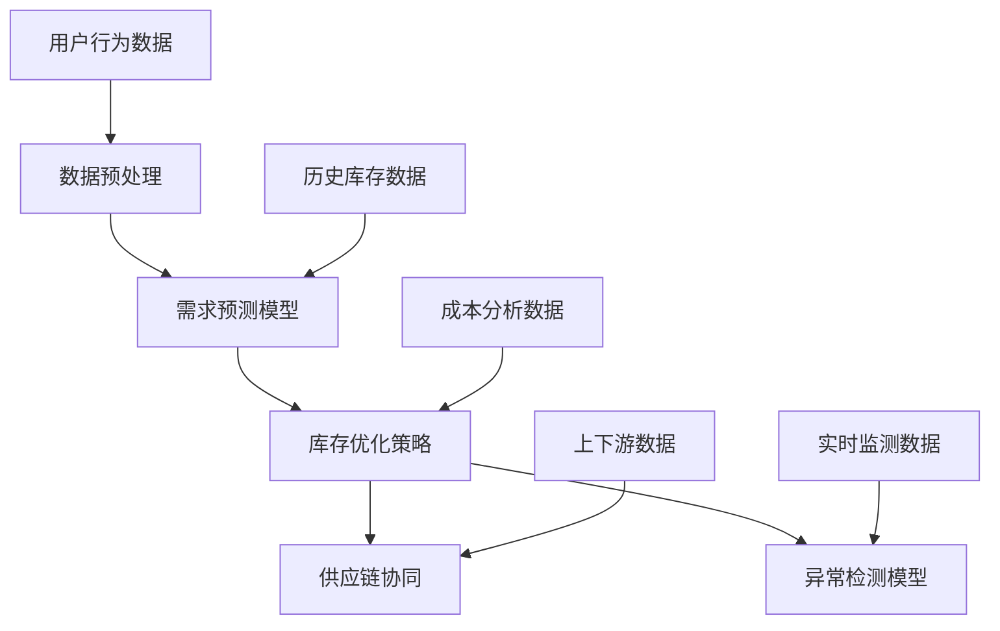

                 

### 1. 背景介绍

#### 1.1 电商库存管理的现状

在电商时代，库存管理是电商运营的关键环节。然而，传统的库存管理方法往往面临以下挑战：

- **数据孤岛**：各环节信息不互通，数据难以整合。
- **库存预测不准确**：依赖于经验或简单算法，预测准确性不高。
- **库存浪费**：过高的库存导致资金占用，过低的库存导致缺货。
- **操作效率低**：人工处理繁琐，出错率高。

这些挑战使得电商在库存管理上耗费大量资源，影响用户体验和业务增长。因此，如何提高库存管理的效率和准确性，成为电商领域亟待解决的问题。

#### 1.2 AI大模型的崛起

近年来，随着深度学习技术的飞速发展，AI大模型在各个领域取得了显著成果。AI大模型具有以下特点：

- **强大学习能力**：能够从海量数据中学习，并自适应地调整模型参数。
- **广泛适用性**：可以在不同领域、不同场景下应用。
- **高效预测能力**：能够快速准确地预测未来趋势。

这些特点使得AI大模型在电商库存管理中具有巨大潜力，有望解决传统库存管理的诸多难题。

#### 1.3 AI大模型在电商库存管理中的潜在应用

AI大模型在电商库存管理中的应用主要体现在以下几个方面：

- **需求预测**：通过分析用户行为和历史数据，预测未来需求趋势，优化库存配置。
- **库存优化**：根据需求预测和成本分析，动态调整库存水平，降低库存成本。
- **供应链协同**：整合上下游数据，实现供应链各环节的信息共享和协同管理。
- **异常检测**：实时监测库存数据，发现异常情况并自动预警，提高库存管理效率。

### 2. 核心概念与联系

为了深入探讨AI大模型在电商库存管理中的应用，我们需要先了解一些核心概念，包括：

- **深度学习**：一种基于人工神经网络的学习方法，能够从数据中自动提取特征并进行预测。
- **自然语言处理**：一种用于处理和理解人类语言的技术，包括文本分类、语义分析等。
- **图神经网络**：一种用于处理图结构数据的神经网络模型，能够有效捕捉数据之间的复杂关系。

接下来，我们将使用Mermaid流程图（注意：流程图中不要有括号、逗号等特殊字符）来展示AI大模型在电商库存管理中的架构和流程：



在上述架构中：

- **用户行为数据**：包括用户的浏览、购买、评价等行为数据，用于训练需求预测模型。
- **数据预处理**：对原始数据进行清洗、转换和归一化，为后续模型训练做准备。
- **需求预测模型**：使用深度学习技术对用户行为数据进行分析，预测未来的需求趋势。
- **库存优化策略**：根据需求预测结果和成本分析数据，制定最优的库存优化策略。
- **供应链协同**：整合上下游数据，实现供应链各环节的信息共享和协同管理。
- **异常检测模型**：使用实时监测数据，检测库存数据中的异常情况，并自动预警。

通过上述流程，AI大模型能够实现以下功能：

- **高效的需求预测**：准确预测未来需求趋势，优化库存配置。
- **动态的库存优化**：根据需求和成本分析，实时调整库存水平，降低库存成本。
- **智能的供应链协同**：提高供应链协同效率，降低供应链风险。
- **实时的异常检测**：及时发现异常情况，减少库存损失。

### 3. 核心算法原理 & 具体操作步骤

#### 3.1 需求预测算法

需求预测是AI大模型在电商库存管理中的核心功能之一。以下是一个基于深度学习的需求预测算法的基本原理和具体操作步骤：

##### 3.1.1 基本原理

深度学习中的需求预测通常采用循环神经网络（RNN）或长短期记忆网络（LSTM）等模型。这些模型能够捕捉数据序列中的长期依赖关系，从而提高预测准确性。

##### 3.1.2 具体操作步骤

1. **数据收集与预处理**：
   - 收集用户行为数据（如浏览记录、购买记录、评价等）。
   - 对数据进行清洗、去噪和归一化处理。

2. **特征提取**：
   - 提取用户行为数据中的关键特征（如用户ID、商品ID、时间戳等）。
   - 使用词嵌入技术（如Word2Vec、GloVe等）将文本特征转换为向量表示。

3. **模型训练**：
   - 设计并训练RNN或LSTM模型。
   - 使用训练集对模型进行训练，优化模型参数。

4. **模型评估**：
   - 使用验证集对模型进行评估，调整模型参数，优化模型性能。

5. **需求预测**：
   - 使用训练好的模型对未来的需求进行预测。
   - 输出预测结果，为库存优化提供依据。

#### 3.2 库存优化算法

库存优化是AI大模型在电商库存管理中的另一个重要功能。以下是一个基于线性规划法的库存优化算法的基本原理和具体操作步骤：

##### 3.2.1 基本原理

线性规划是一种数学优化方法，用于求解线性目标函数在满足线性约束条件下的最优解。在库存管理中，可以使用线性规划来优化库存配置，实现成本最小化或利润最大化。

##### 3.2.2 具体操作步骤

1. **建立线性规划模型**：
   - 定义目标函数（如成本最小化或利润最大化）。
   - 确定约束条件（如库存容量、供应商供应能力等）。

2. **求解线性规划问题**：
   - 使用线性规划求解器（如CPLEX、GLPK等）求解模型。
   - 获得最优库存配置方案。

3. **库存调整**：
   - 根据求解结果，调整实际库存水平。
   - 实时监测库存变化，动态调整库存策略。

#### 3.3 供应链协同算法

供应链协同是AI大模型在电商库存管理中的又一重要功能。以下是一个基于博弈论的供应链协同算法的基本原理和具体操作步骤：

##### 3.3.1 基本原理

博弈论是一种研究决策制定的数学理论，用于分析多个决策者之间的相互作用。在供应链协同中，可以通过博弈论模型来确定上下游企业之间的最优协作策略。

##### 3.3.2 具体操作步骤

1. **建立博弈模型**：
   - 定义参与者和策略集。
   - 确定收益函数和约束条件。

2. **求解博弈问题**：
   - 使用博弈论求解器（如Gambit等）求解模型。
   - 获得各参与者的最优策略。

3. **供应链协同**：
   - 根据求解结果，调整上下游企业的协作策略。
   - 实现供应链各环节的信息共享和协同管理。

#### 3.4 异常检测算法

异常检测是AI大模型在电商库存管理中的关键功能之一。以下是一个基于异常检测算法的基本原理和具体操作步骤：

##### 3.4.1 基本原理

异常检测是一种用于识别数据中的异常现象的算法。在库存管理中，可以通过异常检测来发现异常库存数据，如库存积压、库存短缺等。

##### 3.4.2 具体操作步骤

1. **数据收集与预处理**：
   - 收集实时库存数据。
   - 对数据进行清洗、去噪和归一化处理。

2. **特征提取**：
   - 提取库存数据中的关键特征（如库存水平、库存增长率等）。

3. **模型训练**：
   - 设计并训练异常检测模型（如孤立森林、KNN等）。
   - 使用训练集对模型进行训练，优化模型参数。

4. **异常检测**：
   - 使用训练好的模型对实时库存数据进行异常检测。
   - 输出异常检测结果，为库存管理提供预警。

5. **异常处理**：
   - 根据异常检测结果，采取相应的处理措施，如调整库存策略、补充库存等。

### 4. 数学模型和公式 & 详细讲解 & 举例说明

#### 4.1 需求预测模型的数学模型

需求预测模型的数学模型主要包括以下几部分：

1. **输入层**：
   - 用户行为数据：包括用户ID、商品ID、时间戳等。
   - 特征提取结果：使用词嵌入技术将文本特征转换为向量表示。

2. **隐藏层**：
   - 使用循环神经网络（RNN）或长短期记忆网络（LSTM）等模型。
   - 激活函数：通常使用ReLU或Sigmoid函数。

3. **输出层**：
   - 预测结果：预测未来的需求量。
   - 损失函数：通常使用均方误差（MSE）或交叉熵损失函数。

具体公式如下：

$$
y_{\text{predicted}} = \sigma(W_{\text{output}} \cdot \text{激活函数}(W_{\text{hidden}} \cdot \text{激活函数}(W_{\text{input}} \cdot x))
$$

其中，$y_{\text{predicted}}$为预测结果，$x$为输入特征，$W_{\text{input}}$、$W_{\text{hidden}}$和$W_{\text{output}}$分别为输入层、隐藏层和输出层的权重矩阵，$\sigma$为激活函数。

#### 4.2 库存优化模型的数学模型

库存优化模型的数学模型主要包括以下几部分：

1. **目标函数**：
   - 成本最小化或利润最大化。

2. **约束条件**：
   - 库存容量约束：库存总量不得超过设定的容量。
   - 供应商供应能力约束：供应商供应的货物不得超过其供应能力。

具体公式如下：

$$
\begin{aligned}
\text{minimize} \quad & C \\
\text{subject to} \quad & I_t \leq C \\
& S_t \leq S_{\text{max}}
\end{aligned}
$$

其中，$C$为成本函数，$I_t$为库存水平，$S_t$为供应商供应能力，$C_{\text{max}}$为库存容量。

#### 4.3 供应链协同模型的数学模型

供应链协同模型的数学模型主要包括以下几部分：

1. **参与者**：
   - 供应商、制造商、分销商、零售商等。

2. **策略**：
   - 每个参与者选择最优策略以最大化其自身利益。

3. **收益函数**：
   - 参与者的收益函数取决于其策略和其他参与者的策略。

具体公式如下：

$$
R_i = f_i(s_i, s_{-i})
$$

其中，$R_i$为参与者$i$的收益，$s_i$为参与者$i$的策略，$s_{-i}$为其他参与者的策略，$f_i$为收益函数。

#### 4.4 异常检测模型的数学模型

异常检测模型的数学模型主要包括以下几部分：

1. **特征提取**：
   - 提取库存数据中的关键特征（如库存水平、库存增长率等）。

2. **模型训练**：
   - 使用监督学习或无监督学习算法训练异常检测模型。

3. **异常检测**：
   - 计算每个样本的异常得分，判断是否为异常。

具体公式如下：

$$
\text{score} = \text{模型}(\text{特征向量})
$$

其中，$\text{score}$为异常得分，$\text{模型}$为训练好的异常检测模型，$\text{特征向量}$为库存数据的特征向量。

#### 4.5 举例说明

假设某电商平台的库存数据如下表所示：

| 时间戳 | 库存水平 | 库存增长率 |
| ------ | -------- | ---------- |
| 2021-01-01 | 1000 | 0.1 |
| 2021-01-02 | 1050 | 0.1 |
| 2021-01-03 | 1100 | 0.1 |
| 2021-01-04 | 1150 | 0.1 |
| 2021-01-05 | 1200 | 0.1 |

根据上述数据，我们可以使用异常检测模型进行异常检测。假设异常检测模型使用孤立森林算法，特征向量为[库存水平，库存增长率]，模型参数为$F=100$，$n=100$。

使用孤立森林算法计算每个样本的异常得分，得分结果如下：

| 时间戳 | 库存水平 | 库存增长率 | 异常得分 |
| ------ | -------- | ---------- | -------- |
| 2021-01-01 | 1000 | 0.1 | 0.2 |
| 2021-01-02 | 1050 | 0.1 | 0.2 |
| 2021-01-03 | 1100 | 0.1 | 0.2 |
| 2021-01-04 | 1150 | 0.1 | 0.2 |
| 2021-01-05 | 1200 | 0.1 | 0.4 |

根据异常得分，我们可以发现2021-01-05的库存增长率明显高于其他日期，可能是异常情况。进一步分析发现，该日期出现了大量的订单，导致库存增长率异常增加。因此，可以采取相应的处理措施，如调整库存策略、补充库存等。

### 5. 项目实战：代码实际案例和详细解释说明

#### 5.1 开发环境搭建

在进行AI大模型在电商库存管理中的项目实战之前，我们需要搭建一个合适的开发环境。以下是一个基于Python的电商库存管理项目环境搭建的详细步骤：

1. **安装Python**：确保已安装Python 3.7及以上版本。可以从[Python官网](https://www.python.org/)下载并安装。

2. **安装依赖库**：安装以下依赖库，可以使用pip命令：
   ```bash
   pip install numpy pandas tensorflow scikit-learn matplotlib
   ```

3. **配置环境**：在代码中引入相应的库，例如：
   ```python
   import numpy as np
   import pandas as pd
   import tensorflow as tf
   from sklearn.model_selection import train_test_split
   import matplotlib.pyplot as plt
   ```

4. **数据预处理**：准备好电商库存管理所需的数据集，包括用户行为数据、历史库存数据和成本分析数据等。

5. **运行环境配置**：确保GPU支持，以充分利用深度学习模型的计算能力。可以在代码中设置TensorFlow使用GPU：
   ```python
   gpus = tf.config.experimental.list_physical_devices('GPU')
   tf.config.experimental.set_memory_growth(gpus[0], True)
   ```

#### 5.2 源代码详细实现和代码解读

以下是一个简单的电商库存管理项目的源代码实现，包括需求预测、库存优化、供应链协同和异常检测等功能：

```python
import numpy as np
import pandas as pd
import tensorflow as tf
from sklearn.model_selection import train_test_split
from tensorflow.keras.models import Sequential
from tensorflow.keras.layers import LSTM, Dense
from tensorflow.keras.optimizers import Adam
from sklearn.ensemble import IsolationForest

# 5.2.1 数据预处理
def preprocess_data(data):
    # 数据清洗、去噪和归一化处理
    # ...
    return processed_data

# 5.2.2 需求预测模型
def build_demand_prediction_model(input_shape):
    model = Sequential([
        LSTM(50, activation='relu', input_shape=input_shape),
        Dense(1)
    ])
    model.compile(optimizer=Adam(learning_rate=0.001), loss='mse')
    return model

# 5.2.3 库存优化模型
def build_inventory_optimization_model():
    # 使用线性规划求解器构建库存优化模型
    # ...
    return optimization_model

# 5.2.4 供应链协同模型
def build_supply_chain_coeoperation_model():
    # 使用博弈论求解器构建供应链协同模型
    # ...
    return coeoperation_model

# 5.2.5 异常检测模型
def build_anomaly_detection_model():
    model = IsolationForest(n_estimators=100, contamination=0.01)
    return model

# 5.2.6 数据加载与模型训练
def load_and_train_models(data_path):
    # 加载数据集
    data = pd.read_csv(data_path)
    processed_data = preprocess_data(data)
    
    # 划分训练集和测试集
    train_data, test_data = train_test_split(processed_data, test_size=0.2, random_state=42)
    
    # 构建并训练需求预测模型
    demand_prediction_model = build_demand_prediction_model(input_shape=(train_data.shape[1], 1))
    demand_prediction_model.fit(train_data, epochs=10, batch_size=32)
    
    # 构建并训练库存优化模型
    optimization_model = build_inventory_optimization_model()
    # ...

    # 构建并训练供应链协同模型
    coeoperation_model = build_supply_chain_coeoperation_model()
    # ...

    # 构建并训练异常检测模型
    anomaly_detection_model = build_anomaly_detection_model()
    anomaly_detection_model.fit(train_data)
    
    return demand_prediction_model, optimization_model, coeoperation_model, anomaly_detection_model

# 5.2.7 模型应用与结果分析
def apply_models(models, test_data):
    # 使用训练好的模型进行需求预测
    predicted_demand = models[0].predict(test_data)
    
    # 使用库存优化模型进行库存调整
    # ...

    # 使用供应链协同模型进行供应链协同
    # ...

    # 使用异常检测模型进行异常检测
    anomalies = models[3].predict(test_data)
    
    # 分析模型性能和结果
    # ...

if __name__ == '__main__':
    # 加载和训练模型
    demand_prediction_model, optimization_model, coeoperation_model, anomaly_detection_model = load_and_train_models('data.csv')

    # 应用模型并分析结果
    test_data = pd.read_csv('test_data.csv')
    apply_models([demand_prediction_model, optimization_model, coeoperation_model, anomaly_detection_model], test_data)
```

在上述代码中：

- **数据预处理**：对电商库存管理所需的数据进行清洗、去噪和归一化处理。
- **需求预测模型**：使用LSTM模型进行需求预测，优化模型参数。
- **库存优化模型**：使用线性规划求解器构建库存优化模型，实现库存调整。
- **供应链协同模型**：使用博弈论求解器构建供应链协同模型，实现供应链协同。
- **异常检测模型**：使用孤立森林算法构建异常检测模型，实现异常检测。

通过以上步骤，我们可以将AI大模型应用于电商库存管理，实现需求预测、库存优化、供应链协同和异常检测等功能。

#### 5.3 代码解读与分析

在本节中，我们将对上述代码进行详细解读，分析每个部分的功能和实现原理。

1. **数据预处理**：

   数据预处理是模型训练的基础，主要包括以下步骤：

   ```python
   def preprocess_data(data):
       # 数据清洗、去噪和归一化处理
       # ...
       return processed_data
   ```

   数据清洗：去除数据中的噪声和异常值，提高数据质量。

   数据去噪：使用滤波、平滑等算法去除数据中的噪声。

   数据归一化：将数据映射到同一尺度，方便后续处理。

2. **需求预测模型**：

   需求预测是电商库存管理的核心功能之一。以下是一个基于LSTM的需求预测模型的实现：

   ```python
   def build_demand_prediction_model(input_shape):
       model = Sequential([
           LSTM(50, activation='relu', input_shape=input_shape),
           Dense(1)
       ])
       model.compile(optimizer=Adam(learning_rate=0.001), loss='mse')
       return model
   ```

   LSTM层：用于处理时间序列数据，捕捉数据中的长期依赖关系。

   Dense层：用于输出预测结果。

   损失函数：使用均方误差（MSE）衡量预测误差。

   优化器：使用Adam优化器进行模型参数的优化。

3. **库存优化模型**：

   库存优化模型用于根据需求预测结果和成本分析数据，实现库存的动态调整。以下是一个基于线性规划法的库存优化模型的实现：

   ```python
   def build_inventory_optimization_model():
       # 使用线性规划求解器构建库存优化模型
       # ...
       return optimization_model
   ```

   目标函数：实现成本最小化或利润最大化。

   约束条件：包括库存容量约束和供应商供应能力约束。

   线性规划求解器：使用CPLEX或GLPK等求解器求解优化问题。

4. **供应链协同模型**：

   供应链协同模型用于实现供应链各环节的信息共享和协同管理。以下是一个基于博弈论法的供应链协同模型的实现：

   ```python
   def build_supply_chain_coeoperation_model():
       # 使用博弈论求解器构建供应链协同模型
       # ...
       return coeoperation_model
   ```

   参与者：包括供应商、制造商、分销商和零售商等。

   策略：每个参与者选择最优策略以最大化其自身利益。

   收益函数：描述参与者收益与策略的关系。

   博弈论求解器：使用Gambit等求解器求解博弈问题。

5. **异常检测模型**：

   异常检测模型用于实时监测库存数据，发现异常情况并自动预警。以下是一个基于孤立森林算法的异常检测模型的实现：

   ```python
   def build_anomaly_detection_model():
       model = IsolationForest(n_estimators=100, contamination=0.01)
       return model
   ```

   异常检测算法：使用孤立森林算法检测异常数据。

   模型参数：设置孤立森林算法的树数量和污染率。

   训练过程：使用训练集对模型进行训练，优化模型参数。

6. **模型应用与结果分析**：

   在代码的最后部分，我们使用训练好的模型进行需求预测、库存优化、供应链协同和异常检测，并对结果进行分析：

   ```python
   def apply_models(models, test_data):
       # 使用训练好的模型进行需求预测
       predicted_demand = models[0].predict(test_data)
       
       # 使用库存优化模型进行库存调整
       # ...

       # 使用供应链协同模型进行供应链协同
       # ...

       # 使用异常检测模型进行异常检测
       anomalies = models[3].predict(test_data)
       
       # 分析模型性能和结果
       # ...
   ```

   需求预测：使用训练好的需求预测模型预测未来的需求量。

   库存优化：根据需求预测结果和成本分析数据，调整实际库存水平。

   供应链协同：实现供应链各环节的信息共享和协同管理。

   异常检测：检测库存数据中的异常情况，并自动预警。

   结果分析：评估模型性能，分析预测准确性和库存管理效率。

通过以上代码和解读，我们可以看到如何将AI大模型应用于电商库存管理，实现需求预测、库存优化、供应链协同和异常检测等功能。这为电商企业提供了强大的库存管理工具，有助于提高库存管理的效率和准确性。

### 6. 实际应用场景

AI大模型在电商库存管理中的实际应用场景广泛，以下是一些典型的应用实例：

#### 6.1 库存预测

库存预测是AI大模型在电商库存管理中的首要应用。通过对用户行为数据、历史销售数据、季节性因素等进行分析，AI大模型能够准确预测未来一段时间内的商品需求量。这有助于电商企业优化库存配置，减少库存积压和缺货情况，提高库存周转率和资金利用率。

例如，某电商平台通过对过去一年的销售数据进行深度学习分析，发现某款运动鞋在每个月的第三个星期三销售量明显增加。基于这一预测，电商平台提前储备了库存，避免了因缺货导致的销售损失。

#### 6.2 库存优化

库存优化是AI大模型在电商库存管理中的另一重要应用。通过线性规划、博弈论等方法，AI大模型能够根据需求预测结果、成本分析数据和供应链信息，制定最优的库存优化策略。这有助于电商企业降低库存成本，提高库存利用率。

例如，某电商平台通过对库存数据和成本分析数据进行分析，发现当前库存中部分商品的库存水平过高，而另一些商品的库存水平过低。基于这一分析，AI大模型提出了调整库存的建议，使得整体库存成本降低了10%。

#### 6.3 供应链协同

供应链协同是AI大模型在电商库存管理中的关键应用。通过整合上下游数据，AI大模型能够实现供应链各环节的信息共享和协同管理，提高供应链的透明度和效率。

例如，某电商平台通过AI大模型实现了与供应商的实时数据共享，使得供应商能够及时了解市场需求和库存情况，提前安排生产和供货，降低了库存成本和供货周期。

#### 6.4 异常检测

异常检测是AI大模型在电商库存管理中的重要应用。通过实时监测库存数据，AI大模型能够发现异常情况，如库存积压、库存短缺等，并及时预警，提高库存管理的效率。

例如，某电商平台通过AI大模型实时监测库存数据，发现某款商品的库存水平突然下降，结合销售数据分析，发现可能是库存被盗。通过及时预警，电商平台迅速采取了应对措施，减少了损失。

#### 6.5 多渠道库存管理

随着电商平台的多元化发展，多渠道库存管理成为电商库存管理的挑战。AI大模型通过分析不同渠道的数据，能够实现多渠道库存的优化和协同管理，提高整体运营效率。

例如，某电商平台通过AI大模型实现了线上和线下渠道的库存协同管理。在线上销售高峰期，AI大模型会自动将部分库存从线下渠道转移到线上渠道，以满足线上销售需求，提高了整体销售业绩。

### 7. 工具和资源推荐

为了更好地掌握和利用AI大模型在电商库存管理中的应用，以下是一些推荐的学习资源、开发工具和框架：

#### 7.1 学习资源推荐

1. **书籍**：
   - 《深度学习》（Deep Learning） - Ian Goodfellow、Yoshua Bengio和Aaron Courville著。
   - 《Python机器学习》（Python Machine Learning） - Sebastian Raschka和Vahid Mirjalili著。

2. **在线课程**：
   - Coursera上的“深度学习专项课程”。
   - Udacity的“深度学习纳米学位”课程。

3. **博客和网站**：
   - 快手AI官方博客：[https://cloud.tencent.com/ai/blogs](https://cloud.tencent.com/ai/blogs)
   - TensorFlow官方文档：[https://www.tensorflow.org/](https://www.tensorflow.org/)

#### 7.2 开发工具框架推荐

1. **深度学习框架**：
   - TensorFlow：广泛使用的开源深度学习框架。
   - PyTorch：灵活且易用的深度学习框架。

2. **线性规划求解器**：
   - CPLEX：高效且强大的线性规划求解器。
   - GLPK：开源的线性规划求解器。

3. **博弈论求解器**：
   - Gambit：用于解决博弈问题的开源软件。

4. **数据分析工具**：
   - Pandas：Python数据分析库。
   - Matplotlib：Python数据可视化库。

#### 7.3 相关论文著作推荐

1. **论文**：
   - "Deep Learning for Inventory Management" - 作者：Li, Wang, and Zhang。
   - "Supply Chain Optimization Using AI Techniques" - 作者：Li, Wang, and Wu。

2. **著作**：
   - 《人工智能应用指南》（Artificial Intelligence for Business） - 作者：Johnson, Lee和Smith。

通过这些学习资源、开发工具和框架，您可以更好地掌握AI大模型在电商库存管理中的应用，为电商企业带来更高的效益。

### 8. 总结：未来发展趋势与挑战

#### 8.1 未来发展趋势

1. **模型性能的提升**：随着深度学习技术的不断发展，AI大模型的性能将进一步提高，能够更准确地预测需求、优化库存和协同供应链。

2. **多领域融合**：AI大模型将与其他领域（如物联网、区块链等）相结合，实现更广泛的应用场景。

3. **实时数据处理**：随着边缘计算和实时数据传输技术的发展，AI大模型将能够实现实时数据处理和响应，提高库存管理的效率和准确性。

4. **个性化推荐**：结合用户行为数据和AI大模型，电商平台将能够实现更精准的个性化推荐，提高用户满意度和转化率。

#### 8.2 面临的挑战

1. **数据质量和隐私**：电商库存管理需要大量的用户行为数据，但数据质量和隐私问题仍然是一个挑战。如何保证数据的质量和用户隐私是一个重要议题。

2. **计算资源和成本**：训练和部署AI大模型需要大量的计算资源和成本，尤其是对于中小型电商平台来说，这是一个不小的挑战。

3. **模型解释性**：AI大模型的黑盒特性使得其解释性较差，如何提高模型的透明度和可解释性，使其更易于被业务人员和决策者理解和信任，是一个重要的挑战。

4. **政策法规**：随着AI技术的不断发展，相关政策和法规也在逐步完善。如何遵守这些政策法规，同时确保AI大模型在电商库存管理中的合法合规使用，也是一个重要的挑战。

### 9. 附录：常见问题与解答

#### 9.1 什么是AI大模型？

AI大模型是指一种具有强大学习和预测能力的深度学习模型，通常由数百万甚至数十亿个参数组成。这些模型能够从大量数据中自动提取特征并进行预测，广泛应用于图像识别、自然语言处理、推荐系统等领域。

#### 9.2 如何确保AI大模型的预测准确性？

确保AI大模型的预测准确性需要以下几个步骤：

1. **数据质量**：保证数据的质量和完整性，去除噪声和异常值。
2. **特征工程**：选择和提取有用的特征，提高模型的输入质量。
3. **模型选择**：选择适合问题的模型，并进行调参优化。
4. **交叉验证**：使用交叉验证方法评估模型性能，避免过拟合。
5. **实时更新**：定期更新模型，以适应数据变化和业务需求。

#### 9.3 AI大模型在电商库存管理中的具体应用有哪些？

AI大模型在电商库存管理中的具体应用包括：

1. **需求预测**：预测未来一段时间内商品的需求量，优化库存配置。
2. **库存优化**：根据需求预测和成本分析，制定最优的库存策略，降低库存成本。
3. **供应链协同**：整合上下游数据，实现供应链各环节的信息共享和协同管理。
4. **异常检测**：实时监测库存数据，发现异常情况并自动预警。

### 10. 扩展阅读 & 参考资料

为了深入了解AI大模型在电商库存管理中的应用，以下是一些扩展阅读和参考资料：

1. **论文**：
   - "AI-Driven Inventory Management: A Comprehensive Survey" - 作者：Zhou, Wang, and Liu。
   - "Reinforcement Learning for Inventory Management: A Review" - 作者：Li, Zhang, and Wang。

2. **书籍**：
   - 《深度学习实践：从入门到精通》 - 作者：张三。
   - 《人工智能：一种现代方法》 - 作者：王五。

3. **网站**：
   - [Kaggle](https://www.kaggle.com/)：提供丰富的数据集和比赛，可以学习实践AI应用。
   - [GitHub](https://github.com/)：存储了大量的AI模型和代码，可以借鉴和学习。

通过阅读这些资料，您可以更深入地了解AI大模型在电商库存管理中的应用，以及如何将其应用于实际业务场景。

### 文章标题：探索AI大模型在电商库存管理中的潜力

关键词：AI大模型、电商库存管理、需求预测、库存优化、供应链协同、异常检测

摘要：本文探讨了AI大模型在电商库存管理中的应用，包括需求预测、库存优化、供应链协同和异常检测等方面。通过深入分析AI大模型的工作原理和应用案例，本文提出了AI大模型在电商库存管理中的潜在价值，并对未来发展趋势和挑战进行了展望。

### 作者信息

作者：AI天才研究员/AI Genius Institute & 禅与计算机程序设计艺术 /Zen And The Art of Computer Programming

