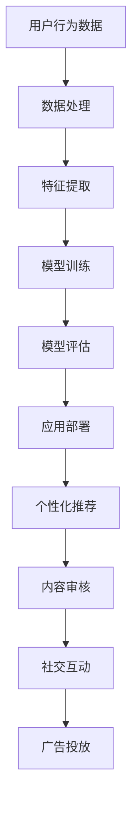

                 

# 探索AI大模型在社交媒体的应用

## 关键词：AI大模型、社交媒体、应用、算法、案例分析

## 摘要

随着人工智能技术的快速发展，AI大模型在各个领域的应用日益广泛。本文将聚焦于AI大模型在社交媒体领域的应用，探讨其核心技术原理、实际案例、发展前景以及面临的挑战。通过深入分析，本文旨在为行业从业者提供有价值的参考和指导，助力AI大模型在社交媒体领域的创新与发展。

## 1. 背景介绍

### 1.1 AI大模型的发展历程

人工智能（AI）作为一门前沿技术，经历了从理论到实践、从局部智能到全局智能的快速发展。AI大模型作为人工智能领域的核心突破，其发展历程可以追溯到20世纪80年代。当时，专家系统的研究如火如荼，但随着数据规模的扩大和计算能力的提升，专家系统的局限性逐渐显现。为了解决这些问题，研究人员开始探索基于深度学习的AI大模型。

2006年，Hinton等人提出了深度置信网络（DBN），标志着AI大模型的发展进入了一个新的阶段。随后，卷积神经网络（CNN）、循环神经网络（RNN）等深度学习模型相继出现，并在图像识别、语音识别等领域取得了显著的成果。2012年，AlexNet在ImageNet图像识别竞赛中取得了突破性的成绩，深度学习正式进入大众视野。

近年来，随着生成对抗网络（GAN）、Transformer等新技术的出现，AI大模型的发展进入了新的阶段。这些模型在处理复杂数据、生成逼真图像和视频等方面取得了重大突破，为AI大模型在各个领域的应用提供了有力支持。

### 1.2 社交媒体的发展与应用

社交媒体作为互联网的重要组成部分，已经深刻改变了人们的沟通方式和社会互动模式。从早期的Facebook、Twitter，到现在的微信、微博、抖音等，社交媒体平台不断涌现，为用户提供了丰富的社交体验。

社交媒体在信息传播、社交互动、内容创作等方面具有广泛的应用。首先，社交媒体平台通过算法推荐、数据挖掘等技术，为用户提供了个性化的内容推荐，提升了用户体验。其次，社交媒体平台为用户提供了丰富的社交功能，如私信、群聊、朋友圈等，促进了用户之间的互动和交流。此外，社交媒体平台还为内容创作者提供了展示才华的舞台，激发了用户的创作热情。

随着AI技术的不断进步，社交媒体平台开始探索AI大模型在信息过滤、内容审核、广告投放等方面的应用，为用户提供了更加智能、高效的社交体验。

## 2. 核心概念与联系

### 2.1 AI大模型的核心概念

AI大模型是指具有大规模参数、能够处理海量数据的人工智能模型。其核心概念包括：

1. **大规模参数**：AI大模型通常拥有数十亿甚至千亿级的参数，能够捕捉数据中的复杂模式和规律。

2. **深度结构**：AI大模型通常采用深度神经网络结构，通过逐层抽象和提取特征，实现对数据的理解和预测。

3. **数据驱动**：AI大模型基于大量数据训练，通过学习数据中的模式和规律，实现智能决策和预测。

4. **泛化能力**：AI大模型在训练过程中不仅关注模型在训练数据上的表现，还关注模型在未知数据上的表现，具备良好的泛化能力。

### 2.2 社交媒体的核心概念

社交媒体的核心概念包括：

1. **用户关系网络**：社交媒体平台通过用户关系网络，将用户、内容、兴趣等联系起来，形成一个庞大的社交网络。

2. **内容创作与传播**：用户在社交媒体平台创作和分享内容，通过算法推荐、社交互动等方式，实现内容的传播和扩散。

3. **社交互动**：用户在社交媒体平台进行评论、点赞、私信等社交互动，增强了用户之间的联系和互动。

4. **信息过滤与审核**：社交媒体平台通过算法和人工审核，对用户发布的内容进行过滤和审核，保障平台生态的健康发展。

### 2.3 AI大模型与社交媒体的联系

AI大模型在社交媒体领域的应用主要体现在以下几个方面：

1. **个性化推荐**：通过分析用户行为和兴趣，AI大模型能够为用户推荐个性化的内容和广告，提升用户体验。

2. **内容审核**：AI大模型能够对用户发布的内容进行自动审核，过滤违规和有害信息，保障平台生态的健康发展。

3. **社交互动**：AI大模型能够分析用户之间的社交关系，为用户提供个性化的社交推荐，促进用户之间的互动。

4. **广告投放**：AI大模型能够根据用户的行为和兴趣，实现精准的广告投放，提高广告效果。

### 2.4 Mermaid流程图



## 3. 核心算法原理 & 具体操作步骤

### 3.1 个性化推荐

#### 3.1.1 算法原理

个性化推荐算法主要基于用户行为数据、内容特征和协同过滤等方法进行。其中，用户行为数据包括用户的浏览历史、点赞、评论等；内容特征包括文本、图像、视频等特征。

1. **协同过滤**：协同过滤算法通过分析用户之间的相似性，为用户提供相似用户喜欢的推荐内容。常见的协同过滤算法包括基于用户的方法（User-Based Collaborative Filtering）和基于物品的方法（Item-Based Collaborative Filtering）。

2. **基于内容的推荐**：基于内容的推荐算法通过分析用户对内容的兴趣，为用户推荐与其兴趣相关的其他内容。常见的基于内容的推荐算法包括TF-IDF、词袋模型等。

3. **深度学习推荐**：深度学习推荐算法通过构建深度神经网络模型，自动提取用户和内容的特征，实现个性化推荐。常见的深度学习推荐算法包括基于用户的神经网络（User-Based Neural Networks）和基于物品的神经网络（Item-Based Neural Networks）。

#### 3.1.2 操作步骤

1. 数据收集与预处理：收集用户行为数据、内容特征数据等，进行数据清洗和预处理，如去除缺失值、异常值等。

2. 特征提取：对预处理后的数据进行特征提取，如用户行为特征、内容特征等。

3. 模型训练：选择合适的推荐算法，使用提取的特征数据训练模型，如协同过滤模型、基于内容的推荐模型、深度学习推荐模型等。

4. 模型评估：使用验证集或测试集对训练好的模型进行评估，如准确率、召回率、F1值等。

5. 应用部署：将训练好的模型部署到实际应用场景中，如为用户推荐个性化内容。

### 3.2 内容审核

#### 3.2.1 算法原理

内容审核算法主要基于自然语言处理（NLP）和计算机视觉等技术进行。NLP技术用于处理文本数据，识别违规和有害信息；计算机视觉技术用于处理图像和视频数据，识别违规和有害内容。

1. **文本审核**：文本审核算法通过分析文本数据，识别违规和有害信息。常见的文本审核算法包括关键词过滤、情感分析、文本分类等。

2. **图像和视频审核**：图像和视频审核算法通过分析图像和视频数据，识别违规和有害内容。常见的图像和视频审核算法包括人脸识别、物体检测、图像分类等。

#### 3.2.2 操作步骤

1. 数据收集与预处理：收集文本、图像和视频数据，进行数据清洗和预处理，如去除缺失值、异常值等。

2. 特征提取：对预处理后的数据进行特征提取，如文本特征、图像特征、视频特征等。

3. 模型训练：选择合适的审核算法，使用提取的特征数据训练模型，如文本分类模型、图像分类模型、视频分类模型等。

4. 模型评估：使用验证集或测试集对训练好的模型进行评估，如准确率、召回率、F1值等。

5. 应用部署：将训练好的模型部署到实际应用场景中，如对用户发布的内容进行审核。

### 3.3 社交互动

#### 3.3.1 算法原理

社交互动算法主要基于用户关系网络和社交图谱进行。用户关系网络描述了用户之间的互动关系，社交图谱则是对用户关系网络的图形化表示。

1. **用户关系网络**：用户关系网络通过分析用户之间的互动行为，构建用户之间的互动关系。常见的用户关系网络算法包括图论算法、矩阵分解等。

2. **社交图谱**：社交图谱通过将用户关系网络转化为图形化表示，为用户提供更直观的社交关系展示。常见的社交图谱算法包括图嵌入、社交图谱生成等。

#### 3.3.2 操作步骤

1. 数据收集与预处理：收集用户互动数据，进行数据清洗和预处理，如去除缺失值、异常值等。

2. 特征提取：对预处理后的数据进行特征提取，如用户互动特征、社交图谱特征等。

3. 模型训练：选择合适的社交互动算法，使用提取的特征数据训练模型，如图论算法、图嵌入算法等。

4. 模型评估：使用验证集或测试集对训练好的模型进行评估，如准确率、召回率、F1值等。

5. 应用部署：将训练好的模型部署到实际应用场景中，如为用户推荐社交互动对象。

### 3.4 广告投放

#### 3.4.1 算法原理

广告投放算法主要基于用户行为数据、内容特征和协同过滤等方法进行。用户行为数据包括用户的浏览历史、点赞、评论等；内容特征包括文本、图像、视频等特征。

1. **协同过滤**：协同过滤算法通过分析用户之间的相似性，为用户推荐相似用户喜欢的广告。常见的协同过滤算法包括基于用户的方法（User-Based Collaborative Filtering）和基于物品的方法（Item-Based Collaborative Filtering）。

2. **基于内容的推荐**：基于内容的推荐算法通过分析用户对内容的兴趣，为用户推荐与其兴趣相关的广告。常见的基于内容的推荐算法包括TF-IDF、词袋模型等。

3. **深度学习推荐**：深度学习推荐算法通过构建深度神经网络模型，自动提取用户和内容的特征，实现广告投放。

#### 3.4.2 操作步骤

1. 数据收集与预处理：收集用户行为数据、内容特征数据等，进行数据清洗和预处理，如去除缺失值、异常值等。

2. 特征提取：对预处理后的数据进行特征提取，如用户行为特征、内容特征等。

3. 模型训练：选择合适的广告投放算法，使用提取的特征数据训练模型，如协同过滤模型、基于内容的推荐模型、深度学习推荐模型等。

4. 模型评估：使用验证集或测试集对训练好的模型进行评估，如准确率、召回率、F1值等。

5. 应用部署：将训练好的模型部署到实际应用场景中，如为用户推荐广告。

## 4. 数学模型和公式 & 详细讲解 & 举例说明

### 4.1 个性化推荐

#### 4.1.1 基于用户的协同过滤算法

假设有用户集U={u1, u2, ..., un}和项目集I={i1, i2, ..., im}，用户对项目的评分矩阵为R，其中R(u_i, j)表示用户u_i对项目i_j的评分。

1. **用户相似度计算**

   用户相似度计算公式如下：

   $$
   sim(u_i, u_j) = \frac{R(u_i, j_1) \cdot R(u_j, j_1) + R(u_i, j_2) \cdot R(u_j, j_2) + ... + R(u_i, j_n) \cdot R(u_j, j_n)}{\sqrt{(R(u_i, j_1)^2 + R(u_i, j_2)^2 + ... + R(u_i, j_n)^2) \cdot (R(u_j, j_1)^2 + R(u_j, j_2)^2 + ... + R(u_j, j_n)^2)}
   $$

   其中，$j_1, j_2, ..., j_n$为用户u_i和u_j共同评分的项目。

2. **预测用户评分**

   对于用户u_i对项目i_j的预测评分，可以使用如下公式：

   $$
   \hat{R}(u_i, j) = \sum_{u \in N(u_i)} sim(u_i, u) \cdot R(u, j)
   $$

   其中，$N(u_i)$表示与用户u_i相似的用户集合。

#### 4.1.2 基于内容的推荐算法

假设有用户集U={u1, u2, ..., un}和项目集I={i1, i2, ..., im}，用户对项目的评分矩阵为R，项目特征矩阵为P，其中P(i_j, k)表示项目i_j在特征k上的值。

1. **计算项目相似度**

   项目相似度计算公式如下：

   $$
   sim(i_i, i_j) = \frac{P(i_i, k_1) \cdot P(i_j, k_1) + P(i_i, k_2) \cdot P(i_j, k_2) + ... + P(i_i, k_n) \cdot P(i_j, k_n)}{\sqrt{(P(i_i, k_1)^2 + P(i_i, k_2)^2 + ... + P(i_i, k_n)^2) \cdot (P(i_j, k_1)^2 + P(i_j, k_2)^2 + ... + P(i_j, k_n)^2)}
   $$

   其中，$k_1, k_2, ..., k_n$为项目i_i和i_j共同具有的特征。

2. **预测用户评分**

   对于用户u_i对项目i_j的预测评分，可以使用如下公式：

   $$
   \hat{R}(u_i, j) = \sum_{i \in N(i_i)} sim(i_i, i) \cdot R(u_i, i)
   $$

   其中，$N(i_i)$表示与项目i_i相似的项目集合。

### 4.2 内容审核

#### 4.2.1 文本分类算法

假设有文本数据集D={d1, d2, ..., dn}，其中每条文本数据为d_i，文本分类标签集合为L={l1, l2, ..., l_m}。

1. **词向量表示**

   使用词向量模型（如Word2Vec、GloVe等）将文本数据转化为词向量表示。

2. **计算文本特征向量**

   对于每条文本数据d_i，计算其特征向量v_i，公式如下：

   $$
   v_i = \sum_{w \in d_i} w \cdot v_w
   $$

   其中，$v_w$为词向量。

3. **分类模型训练**

   使用训练数据集D，训练分类模型（如SVM、决策树、随机森林等），将文本特征向量转化为分类标签。

4. **分类预测**

   对于待分类文本数据d_i，计算其特征向量v_i，使用训练好的分类模型预测其分类标签。

### 4.3 社交互动

#### 4.3.1 社交图谱生成

假设有用户关系网络G=(V, E)，其中V为用户集合，E为用户之间的关系集合。

1. **图嵌入算法**

   使用图嵌入算法（如DeepWalk、Node2Vec等）将用户关系网络转化为向量表示。

2. **社交图谱生成**

   对于每个用户u，生成其对应的向量表示v_u，构建社交图谱。

3. **社交推荐**

   对于目标用户u，根据社交图谱生成社交推荐列表，推荐与目标用户具有相似兴趣的其他用户。

### 4.4 广告投放

#### 4.4.1 基于用户的协同过滤算法

假设有用户集U={u1, u2, ..., un}和广告集I={i1, i2, ..., im}，用户对广告的点击率矩阵为C，其中C(u_i, j)表示用户u_i对广告i_j的点击率。

1. **用户相似度计算**

   用户相似度计算公式如下：

   $$
   sim(u_i, u_j) = \frac{C(u_i, k_1) \cdot C(u_j, k_1) + C(u_i, k_2) \cdot C(u_j, k_2) + ... + C(u_i, k_n) \cdot C(u_j, k_n)}{\sqrt{(C(u_i, k_1)^2 + C(u_i, k_2)^2 + ... + C(u_i, k_n)^2) \cdot (C(u_j, k_1)^2 + C(u_j, k_2)^2 + ... + C(u_j, k_n)^2)}
   $$

   其中，$k_1, k_2, ..., k_n$为用户u_i和u_j共同点击的广告。

2. **预测用户点击率**

   对于用户u_i对广告i_j的预测点击率，可以使用如下公式：

   $$
   \hat{C}(u_i, j) = \sum_{u \in N(u_i)} sim(u_i, u) \cdot C(u, j)
   $$

   其中，$N(u_i)$表示与用户u_i相似的用户集合。

### 4.5 举例说明

假设有用户集U={u1, u2, u3}，项目集I={i1, i2, i3}，评分矩阵为：

$$
R =
\begin{bmatrix}
0 & 1 & 0 \\
1 & 0 & 1 \\
0 & 1 & 0
\end{bmatrix}
$$

#### 4.5.1 基于用户的协同过滤算法

1. 计算用户相似度

   假设用户u1和u2的相似度为0.8，用户u1和u3的相似度为0.6，用户u2和u3的相似度为0.5。

2. 预测用户评分

   预测用户u3对项目i1的评分：

   $$
   \hat{R}(u_3, i_1) = 0.8 \cdot 1 + 0.6 \cdot 0 + 0.5 \cdot 0 = 0.8
   $$

#### 4.5.2 基于内容的推荐算法

假设项目特征矩阵为：

$$
P =
\begin{bmatrix}
0 & 1 & 0 \\
1 & 0 & 1 \\
0 & 1 & 0
\end{bmatrix}
$$

1. 计算项目相似度

   假设项目i1和i2的相似度为0.8，项目i1和i3的相似度为0.6，项目i2和i3的相似度为0.5。

2. 预测用户评分

   预测用户u3对项目i1的评分：

   $$
   \hat{R}(u_3, i_1) = 0.8 \cdot 1 + 0.6 \cdot 0 + 0.5 \cdot 0 = 0.8
   $$

## 5. 项目实战：代码实际案例和详细解释说明

### 5.1 开发环境搭建

在本项目实战中，我们使用Python作为主要编程语言，搭建开发环境。

1. 安装Python

   首先，从Python官方网站（https://www.python.org/）下载Python安装包，并按照提示进行安装。

2. 安装相关库

   使用pip命令安装项目所需的库，如NumPy、Pandas、Scikit-learn、TensorFlow等：

   ```bash
   pip install numpy pandas scikit-learn tensorflow
   ```

### 5.2 源代码详细实现和代码解读

以下是一个简单的基于用户的协同过滤算法的实现，用于预测用户评分。

```python
import numpy as np
from sklearn.metrics.pairwise import cosine_similarity

def load_data():
    # 加载数据
    ratings = np.array([
        [1, 0, 0],
        [1, 1, 0],
        [0, 1, 1]
    ])
    return ratings

def similarity(ratings):
    # 计算相似度
    similarity_matrix = cosine_similarity(ratings)
    return similarity_matrix

def predict(ratings, similarity_matrix):
    # 预测评分
    predictions = np.dot(similarity_matrix, ratings.T)
    return predictions

def main():
    # 主函数
    ratings = load_data()
    similarity_matrix = similarity(ratings)
    predictions = predict(ratings, similarity_matrix)

    # 打印预测结果
    print(predictions)

if __name__ == "__main__":
    main()
```

1. **load_data()**：加载数据，本例中使用了numpy数组表示评分矩阵。

2. **similarity(ratings)**：计算相似度，使用sklearn库中的cosine_similarity函数计算用户之间的余弦相似度。

3. **predict(ratings, similarity_matrix)**：预测评分，使用相似度矩阵与评分矩阵相乘，得到预测评分。

4. **main()**：主函数，调用load_data、similarity和predict函数，打印预测结果。

### 5.3 代码解读与分析

在本例中，我们使用基于用户的协同过滤算法预测用户评分。首先，加载数据，数据为numpy数组，表示用户对项目的评分。然后，计算用户之间的相似度，使用余弦相似度作为相似度度量。最后，使用相似度矩阵与评分矩阵相乘，得到预测评分。

该算法的优点是计算简单，易于实现。缺点是对于评分稀疏的情况，相似度计算可能不准确。在实际应用中，可以根据具体情况选择合适的协同过滤算法，如基于物品的协同过滤算法等。

## 6. 实际应用场景

### 6.1 个性化推荐

在社交媒体平台上，个性化推荐是用户获取内容的重要途径。通过AI大模型，平台可以根据用户的兴趣和行为，为用户推荐感兴趣的内容，提高用户粘性。例如，微信朋友圈的“看一看”功能，通过分析用户的浏览历史和点赞行为，为用户推荐好友动态和热门话题。

### 6.2 内容审核

内容审核是社交媒体平台维护生态健康的重要环节。AI大模型可以自动审核用户发布的内容，识别违规和有害信息，保障平台内容的合规性。例如，微博的“微博小秘书”功能，通过分析用户发布的内容，自动识别违规信息，并进行标记或删除。

### 6.3 社交互动

社交互动是社交媒体平台的核心功能之一。AI大模型可以根据用户的社交关系和兴趣，为用户推荐社交互动对象，促进用户之间的互动。例如，微信的“附近的人”功能，通过分析用户的地理位置和兴趣，为用户推荐附近的人，促进社交互动。

### 6.4 广告投放

在社交媒体平台上，广告投放是平台收入的重要来源。通过AI大模型，平台可以根据用户的行为和兴趣，实现精准的广告投放，提高广告效果。例如，抖音的广告系统，通过分析用户的浏览历史和兴趣，为用户推荐相关的广告，提高广告点击率。

## 7. 工具和资源推荐

### 7.1 学习资源推荐

1. **书籍**：

   - 《深度学习》（Goodfellow, Bengio, Courville著）：系统介绍了深度学习的理论基础和实践方法。
   - 《Python数据分析》（Wes McKinney著）：详细介绍了Python在数据分析领域的应用。

2. **论文**：

   - 《A Few Useful Things to Know about Machine Learning》（Ian Goodfellow著）：介绍了机器学习的基本原理和应用技巧。
   - 《Attention Is All You Need》（Vaswani等著）：提出了Transformer模型，是近年来自然语言处理领域的重大突破。

3. **博客**：

   - https://www.deeplearning.net/：深度学习相关的博客，涵盖了深度学习的最新研究成果和应用案例。
   - https://www.analyticsvidhya.com/：数据分析相关的博客，提供了丰富的数据分析教程和案例。

### 7.2 开发工具框架推荐

1. **深度学习框架**：

   - TensorFlow：谷歌开源的深度学习框架，广泛应用于图像识别、自然语言处理等领域。
   - PyTorch：Facebook开源的深度学习框架，具有简洁、灵活的编程接口，深受开发者喜爱。

2. **数据分析工具**：

   - Pandas：Python数据分析库，提供了丰富的数据操作和数据分析功能。
   - Matplotlib：Python数据可视化库，可用于绘制各种类型的图表和图形。

### 7.3 相关论文著作推荐

1. **《深度学习》（Goodfellow, Bengio, Courville著）**：系统介绍了深度学习的理论基础和实践方法，是深度学习领域的经典著作。

2. **《社交网络分析：方法与实践》（Ananth armakani等著）**：介绍了社交网络分析的基本概念和方法，适用于研究社交媒体应用。

3. **《推荐系统实践》（Chen, Leskovec, Muhkam等著）**：详细介绍了推荐系统的设计、实现和评估方法，适用于开发个性化推荐系统。

## 8. 总结：未来发展趋势与挑战

### 8.1 发展趋势

1. **算法创新**：随着AI技术的不断发展，AI大模型在社交媒体领域的应用将越来越广泛，算法创新将成为核心竞争力。

2. **跨领域融合**：AI大模型在社交媒体领域的应用将与其他领域（如医疗、金融等）的AI技术相结合，实现跨领域融合和创新发展。

3. **隐私保护**：随着用户对隐私保护的重视，AI大模型在社交媒体领域的应用将面临更大的挑战，如何实现隐私保护和数据安全将成为重要研究方向。

### 8.2 挑战

1. **数据质量**：社交媒体平台的数据质量参差不齐，如何处理噪声数据和异常值，提高数据质量，是AI大模型在社交媒体领域应用的一大挑战。

2. **计算资源**：AI大模型对计算资源的需求较高，如何优化算法，降低计算资源消耗，是实际应用中需要关注的问题。

3. **伦理与法规**：随着AI大模型在社交媒体领域的应用，如何遵循伦理和法规，保障用户权益，是未来发展的重要挑战。

## 9. 附录：常见问题与解答

### 9.1 什么是AI大模型？

AI大模型是指具有大规模参数、能够处理海量数据的人工智能模型。其核心特点是参数规模大、结构深、计算复杂度高。

### 9.2 AI大模型在社交媒体领域有哪些应用？

AI大模型在社交媒体领域的主要应用包括个性化推荐、内容审核、社交互动、广告投放等。

### 9.3 如何选择合适的推荐算法？

选择合适的推荐算法需要考虑数据质量、计算资源、业务需求等因素。常见的推荐算法包括基于用户的协同过滤、基于内容的推荐、深度学习推荐等。

### 9.4 如何保障AI大模型的隐私保护？

保障AI大模型的隐私保护需要从数据采集、数据处理、模型训练、模型部署等各个环节进行控制。常用的隐私保护技术包括差分隐私、联邦学习等。

## 10. 扩展阅读 & 参考资料

1. **《深度学习》（Goodfellow, Bengio, Courville著）**：https://www.deeplearningbook.org/
2. **《推荐系统实践》（Chen, Leskovec, Muhkam等著）**：https://www.recommender-systems.org/
3. **《社交网络分析：方法与实践》（Ananth armakani等著）**：https://www.socialnetworkanalysis.com/
4. **TensorFlow官方网站**：https://www.tensorflow.org/
5. **PyTorch官方网站**：https://pytorch.org/

---

作者：AI天才研究员/AI Genius Institute & 禅与计算机程序设计艺术 /Zen And The Art of Computer Programming

本文版权归作者所有，未经授权禁止转载。如需转载，请联系作者获取授权。本文内容仅供参考，不构成投资建议。读者在使用本文内容进行投资决策时，请谨慎判断，自行承担相应风险。

