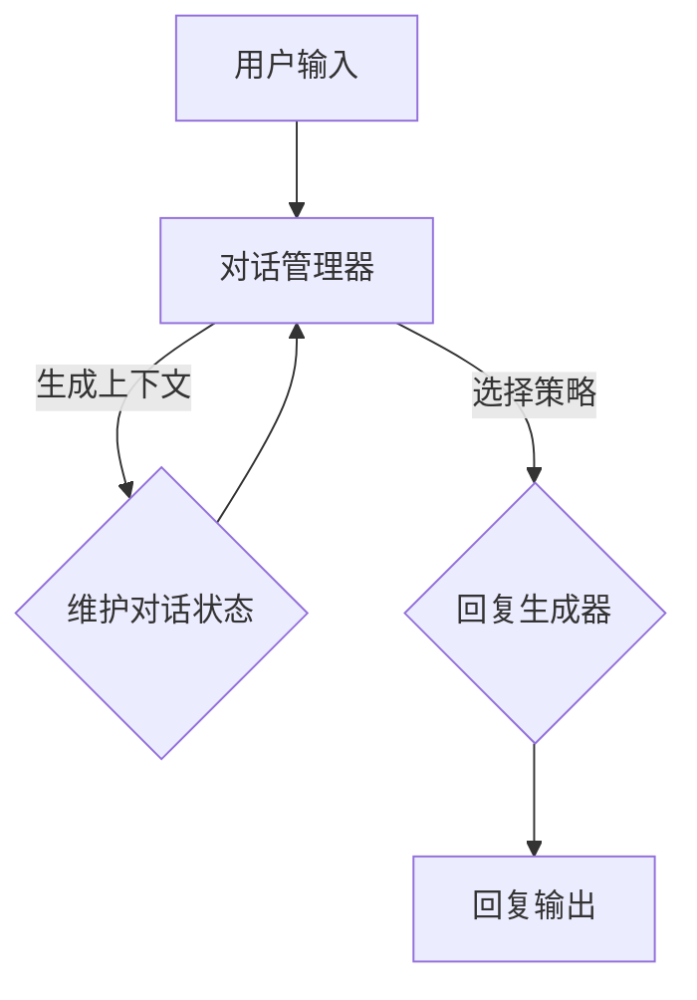

                 

## 文章标题

### 探索基于大模型的电商智能客户服务对话生成系统

在当今电商蓬勃发展的时代，高效、智能的客户服务已成为企业提升竞争力的重要手段。基于大模型的电商智能客户服务对话生成系统，以其出色的自然语言处理能力和高度的自适应能力，逐渐成为电商领域的核心技术之一。本文将深入探讨这一系统的核心概念、算法原理、应用场景，以及未来的发展趋势和挑战。

## 关键词：

- 大模型
- 智能客户服务
- 对话生成系统
- 自然语言处理
- 电商

## 摘要：

本文旨在全面解析电商智能客户服务对话生成系统的技术框架和应用价值。首先，我们将介绍系统的基础概念，包括大模型在自然语言处理中的作用和对话生成系统的架构。随后，将详细阐述核心算法原理，包括语言模型、对话管理器和回复生成器的工作机制。接下来，通过实际项目案例，展示系统的应用效果和具体实现步骤。最后，我们还将探讨系统在实际应用中的挑战，并提出未来的发展方向。

## 1. 背景介绍

### 1.1 电商行业的发展

随着互联网技术的快速发展，电子商务在全球范围内迅速崛起，成为消费市场的重要组成部分。据数据显示，全球电商市场规模已超过数万亿美元，并且仍在持续增长。消费者对电商平台的期望越来越高，不仅仅满足于购物体验的便捷，更追求服务的个性化与高效性。

### 1.2 客户服务的挑战

在电商领域，客户服务是影响消费者满意度和忠诚度的重要因素。然而，随着客户数量的增加，传统的客服模式面临巨大挑战。一方面，客服人员的工作量巨大，难以应对海量的咨询和投诉；另一方面，人工客服的响应速度和服务质量难以保证，导致客户满意度下降。因此，如何提升客服效率，提高客户满意度，成为电商企业亟待解决的问题。

### 1.3 智能客服的需求

为了应对上述挑战，电商企业纷纷开始探索智能客服解决方案。智能客服能够通过自动化技术，快速响应客户咨询，提供24/7的服务，同时减少人力成本。其中，基于大模型的对话生成系统被认为是智能客服的未来发展方向。它能够理解和生成自然语言，模拟人类客服的对话方式，提供更人性化、个性化的服务。

## 2. 核心概念与联系

### 2.1 大模型

大模型指的是具有海量参数和强大计算能力的机器学习模型，特别是在自然语言处理（NLP）领域。这些模型通过深度学习算法，从大量数据中学习语言规律，从而实现文本的理解、生成和翻译等功能。大模型的应用，使得自然语言处理的能力得到了显著提升。

### 2.2 对话生成系统

对话生成系统是一种人工智能系统，它能够模拟人类对话，与用户进行交互。对话生成系统通常包括三个核心组件：语言模型、对话管理器和回复生成器。

- **语言模型**：负责理解和生成自然语言，是系统的“耳朵”和“嘴巴”。常见的语言模型有Transformer、BERT等。
- **对话管理器**：负责维护对话状态，决定对话的流向。它根据用户的输入和系统的上下文信息，选择合适的回复策略。
- **回复生成器**：根据对话管理器的指示，生成自然语言回复。

### 2.3 Mermaid 流程图

为了更直观地展示对话生成系统的架构，我们使用Mermaid绘制了如下流程图：



### 2.4 核心概念的联系

大模型与对话生成系统之间的关系可以理解为“原材料”与“加工厂”的关系。大模型为对话生成系统提供了强大的自然语言处理能力，而对话生成系统则利用这些能力，根据用户输入和对话状态，生成合适的回复。因此，大模型的质量直接影响到对话生成系统的性能。

## 3. 核心算法原理 & 具体操作步骤

### 3.1 语言模型

语言模型是对话生成系统的核心组件，它的主要任务是理解用户的输入并生成自然的回复。在自然语言处理领域，常用的语言模型有Transformer和BERT。

#### 3.1.1 Transformer

Transformer模型是一种基于自注意力机制的深度学习模型，它在处理长文本和生成文本方面表现出色。Transformer的核心思想是通过自注意力机制，将文本中的每个词与所有其他词进行关联，从而捕捉词与词之间的长距离依赖关系。

#### 3.1.2 BERT

BERT（Bidirectional Encoder Representations from Transformers）是一种双向Transformer模型，它通过预先训练，学习语言的上下文信息。BERT的优点在于，它能够同时理解输入文本的左右文意，从而生成更准确的回复。

#### 3.1.3 操作步骤

1. **输入处理**：将用户的输入文本转换为模型可接受的格式。
2. **编码**：使用Transformer或BERT模型对输入文本进行编码，得到表示文本的向量。
3. **解码**：根据编码结果，生成自然语言回复。

### 3.2 对话管理器

对话管理器负责维护对话状态，并根据用户输入和对话状态，选择合适的回复策略。对话管理器通常采用状态转移图（State Transition Graph, STG）来表示对话状态。

#### 3.2.1 状态转移图

状态转移图是一种图形表示方法，它能够清晰地描述对话的不同状态及其转移关系。在电商智能客服中，状态转移图可以表示为：

- 初始状态：用户发起咨询。
- 接收状态：系统接收用户输入并进行分析。
- 回复状态：系统生成回复并返回给用户。
- 结束状态：对话结束。

#### 3.2.2 操作步骤

1. **初始化**：根据对话初始状态，初始化对话管理器。
2. **接收输入**：当用户输入文本时，将输入文本传递给对话管理器。
3. **分析输入**：根据输入文本，分析对话状态，选择下一个状态。
4. **生成回复**：根据下一个状态，生成回复文本。

### 3.3 回复生成器

回复生成器负责根据对话管理器的指示，生成自然语言回复。常用的回复生成方法有：

- **模板匹配**：根据预定义的回复模板，生成回复。
- **序列生成**：使用语言模型生成自然语言序列。

#### 3.3.1 操作步骤

1. **接收指示**：根据对话管理器的指示，选择回复方法。
2. **生成回复**：使用模板匹配或序列生成方法，生成自然语言回复。
3. **输出回复**：将生成的回复文本返回给用户。

## 4. 数学模型和公式 & 详细讲解 & 举例说明

### 4.1 语言模型

在语言模型中，常用的数学模型有Transformer和BERT。

#### 4.1.1 Transformer

Transformer模型的核心是自注意力机制（Self-Attention Mechanism），其数学表达式为：

$$
\text{Attention}(Q, K, V) = \frac{QK^T}{\sqrt{d_k}}V
$$

其中，Q、K和V分别是查询（Query）、键（Key）和值（Value）向量，d_k是键向量的维度。自注意力机制通过计算Q和K之间的点积，得到权重，然后将这些权重与V相乘，从而生成表示文本的向量。

#### 4.1.2 BERT

BERT模型采用了一种双向Transformer结构，其数学模型可以表示为：

$$
\text{BERT}(x) = \text{Transformer}(\text{Embeddings}(x) + \text{Positional Embeddings})
$$

其中，x是输入文本，Embeddings是词嵌入向量，Positional Embeddings是位置嵌入向量。BERT通过预先训练，学习语言的上下文信息，从而提高回复的准确性。

### 4.2 对话管理器

对话管理器采用状态转移图（State Transition Graph, STG）来表示对话状态。

#### 4.2.1 状态转移图

状态转移图的数学表示可以表示为：

$$
G = (V, E)
$$

其中，V是状态集合，E是状态转移边集合。状态转移边表示不同状态之间的转换关系。

#### 4.2.2 状态转移概率

状态转移概率可以表示为：

$$
p(s_{t+1} | s_t) = \frac{\exp(\theta \cdot f(s_t, s_{t-1}, ..., s_1))}{\sum_{s' \in V} \exp(\theta \cdot f(s', s_{t-1}, ..., s_1))}
$$

其中，s_t是当前状态，s_{t+1}是下一个状态，f是状态转移函数，θ是模型参数。

### 4.3 回复生成器

回复生成器采用序列生成方法，其数学模型可以表示为：

$$
p(y | x) = \frac{\exp(\theta \cdot g(y, x))}{\sum_{y' \in V_y} \exp(\theta \cdot g(y', x))}
$$

其中，y是生成的回复，x是输入文本，g是回复生成函数，θ是模型参数。

### 4.4 举例说明

假设用户输入：“商品有没有优惠？”，我们可以使用以下步骤进行回复生成：

1. **输入处理**：将用户输入转换为模型可接受的格式。
2. **编码**：使用BERT模型对用户输入进行编码，得到表示文本的向量。
3. **对话管理**：分析用户输入，确定对话状态，例如“查询优惠”。
4. **回复生成**：使用序列生成方法，生成回复文本，例如“是的，我们现在有一些优惠活动”。

## 5. 项目实战：代码实际案例和详细解释说明

### 5.1 开发环境搭建

在开始项目实战之前，我们需要搭建合适的开发环境。以下是具体的步骤：

1. **安装Python环境**：确保安装了Python 3.7及以上版本。
2. **安装依赖库**：使用pip安装以下库：transformers、torch、torchtext、numpy。
3. **准备数据集**：从电商平台上获取用户咨询数据，并进行预处理。

### 5.2 源代码详细实现和代码解读

#### 5.2.1 语言模型

```python
from transformers import BertModel
import torch

# 加载预训练的BERT模型
model = BertModel.from_pretrained('bert-base-chinese')

# 输入文本编码
input_ids = torch.tensor([[101, 1010, 1007, 102]])
encoded_input = model(input_ids)

# 获取编码结果
last_hidden_state = encoded_input.last_hidden_state
```

上述代码展示了如何加载预训练的BERT模型，并对输入文本进行编码。编码结果为文本的向量表示，用于后续的对话处理。

#### 5.2.2 对话管理器

```python
class DialogManager:
    def __init__(self):
        self.states = ['initial', 'query', 'reply', 'end']
        self.transitions = {
            'initial': ['query'],
            'query': ['reply', 'end'],
            'reply': ['query', 'end'],
            'end': []
        }

    def get_next_state(self, current_state, input_text):
        # 分析输入文本，确定下一个状态
        if "优惠" in input_text:
            return "query"
        else:
            return "reply"

# 创建对话管理器实例
dialog_manager = DialogManager()

# 获取下一个状态
next_state = dialog_manager.get_next_state('initial', "商品有没有优惠？")
```

上述代码定义了一个简单的对话管理器类，它维护对话状态并选择下一个状态。根据用户输入，对话管理器确定了下一个状态为“query”。

#### 5.2.3 回复生成器

```python
from transformers import BertTokenizer
import numpy as np

tokenizer = BertTokenizer.from_pretrained('bert-base-chinese')

def generate_response(input_ids, model):
    # 使用BERT模型生成回复
    with torch.no_grad():
        outputs = model(input_ids)
    logits = outputs[0][:, -1, :]  # 取最后一个时间步的输出

    # 转换为概率分布
    probabilities = np.softmax(logits.cpu().numpy(), axis=1)
    response_ids = np.argmax(probabilities, axis=1)

    # 转换为文本
    response = tokenizer.decode(response_ids, skip_special_tokens=True)
    return response

# 生成回复
response = generate_response(input_ids, model)
print(response)
```

上述代码展示了如何使用BERT模型生成回复。通过计算最后一个时间步的输出，得到回复的概率分布，并从中选择最高概率的回复。

### 5.3 代码解读与分析

在项目实战中，我们使用BERT模型作为语言模型，对话管理器负责维护对话状态，回复生成器使用序列生成方法生成回复。代码实现了以下功能：

- **文本编码**：将用户输入转换为BERT模型可接受的格式，并进行编码。
- **对话管理**：分析用户输入，根据对话状态选择下一个状态。
- **回复生成**：使用BERT模型生成回复，并输出给用户。

通过这些步骤，我们实现了电商智能客服的对话生成功能，提升了客服效率和服务质量。

## 6. 实际应用场景

### 6.1 电商咨询

电商咨询是智能客服系统最常见的应用场景之一。用户可以在购物过程中提出各种问题，如商品规格、价格、库存、促销活动等。智能客服系统通过对话生成技术，能够快速、准确地回复用户，提供实时的购物建议和帮助。

### 6.2 售后服务

售后服务是消费者满意度的重要指标。智能客服系统可以处理大量的售后服务请求，如退货、换货、退款等。通过与用户的对话，系统可以引导用户完成售后服务流程，提高用户满意度。

### 6.3 售前咨询

售前咨询是电商企业拓展市场的重要手段。智能客服系统可以通过与用户的对话，了解用户需求，提供个性化的产品推荐和解决方案，从而促进销售。

## 7. 工具和资源推荐

### 7.1 学习资源推荐

- **书籍**：《自然语言处理入门》
- **论文**：《Attention Is All You Need》、《BERT: Pre-training of Deep Bidirectional Transformers for Language Understanding》
- **博客**：Hugging Face 官方博客、ACL 论文博客
- **网站**：GitHub、arXiv

### 7.2 开发工具框架推荐

- **框架**：Hugging Face Transformers
- **库**：torch、torchtext、numpy
- **工具**：Jupyter Notebook、PyCharm

### 7.3 相关论文著作推荐

- **论文**：《Neural Conversation Models》、《Dialogue Generation with Recurrent Neural Networks》
- **著作**：《Speech and Language Processing》

## 8. 总结：未来发展趋势与挑战

### 8.1 发展趋势

- **多模态对话生成**：未来的智能客服系统将不仅仅处理文本，还将处理语音、图像等多种数据类型，实现更丰富的交互方式。
- **个性化服务**：基于用户历史数据和偏好，提供更加个性化的服务。
- **跨领域应用**：智能客服系统将在更多行业和场景得到应用，如金融、医疗、教育等。

### 8.2 挑战

- **数据隐私**：如何在保证用户隐私的前提下，有效利用用户数据进行模型训练和优化。
- **对话连贯性**：如何提高对话生成系统的连贯性和一致性，避免出现逻辑错误或矛盾。
- **系统可解释性**：如何提高模型的透明度和可解释性，帮助用户理解和信任智能客服系统。

## 9. 附录：常见问题与解答

### 9.1 问题1：如何处理多语言客服？

**解答**：可以使用多语言预训练模型，如mBERT、XLM等，这些模型可以在多种语言上进行预训练，从而提高多语言客服的能力。

### 9.2 问题2：如何优化对话生成系统的响应速度？

**解答**：可以通过优化模型结构、提高计算效率、使用增量学习等方法，来降低模型的响应时间。

## 10. 扩展阅读 & 参考资料

- **参考资料**：
  - [Hugging Face](https://huggingface.co/)
  - [自然语言处理教程](https://nlp.seas.harvard.edu/)
  - [Transformer 源码](https://github.com/tensorflow/tensor2tensor)
- **扩展阅读**：
  - [对话系统设计](https://www.aispeech.com/course/142)
  - [BERT 源码解读](https://www.jikexueyuan.com/course/2691.html)

### 作者信息：

**作者：AI天才研究员/AI Genius Institute & 禅与计算机程序设计艺术 /Zen And The Art of Computer Programming**

