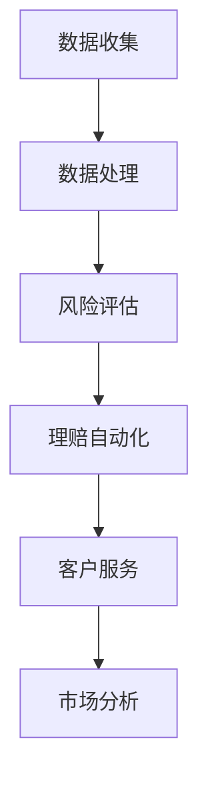

                 

### 文章标题

**探讨AI大模型在保险业的应用前景**

> **关键词**：AI大模型、保险业、应用前景、算法、数学模型、代码实战、实际应用场景

> **摘要**：本文将深入探讨人工智能大模型在保险业的应用前景。首先，我们将介绍保险业的基本概念和当前面临的挑战。随后，我们将详细阐述AI大模型的定义、核心算法原理以及其在保险业中的应用场景。此外，本文还将提供具体的数学模型和公式，并通过实际案例进行代码实战解析。最后，我们将总结AI大模型在保险业的应用发展趋势与挑战，并推荐相关学习资源和工具。

### 1. 背景介绍

#### 1.1 保险业概述

保险业是一种重要的金融服务行业，其主要目的是通过收取保费来为投保人提供风险保障。保险的种类繁多，包括人寿保险、健康保险、财产保险、意外保险等。在现代社会，保险已经成为人们风险管理的重要手段，其重要性日益凸显。

随着大数据、云计算、人工智能等技术的不断发展，保险业也面临着新的机遇和挑战。传统保险业务模式往往依赖于人工处理，效率低下，且容易出错。而AI大模型的引入，有望为保险业带来革命性的改变。

#### 1.2 当前保险业面临的挑战

1. **数据管理难题**：保险业积累了大量的历史数据和实时数据，但这些数据的处理和管理存在一定难度，如何有效利用这些数据成为保险业的一大挑战。

2. **风险评估不准确**：传统的风险评估方法往往依赖于经验和规则，难以准确预测风险，导致保险产品定价不合理，赔付率偏高。

3. **运营效率低下**：保险业涉及到大量的理赔、客户服务等环节，传统的人工操作效率低下，容易导致客户满意度下降。

4. **市场竞争力不足**：随着保险市场的竞争加剧，保险公司在产品设计、营销推广等方面需要不断创新，以提升市场竞争力。

### 2. 核心概念与联系

#### 2.1 AI大模型概述

AI大模型是指具有大规模参数、能够在多种任务上表现出卓越性能的人工智能模型。这些模型通常采用深度学习技术，具有强大的学习能力和泛化能力。

#### 2.2 AI大模型与保险业的关系

AI大模型在保险业的应用主要体现在以下几个方面：

1. **风险评估**：利用AI大模型对投保人的风险进行准确评估，实现精准定价。

2. **理赔自动化**：通过AI大模型实现理赔自动化，提高理赔效率。

3. **客户服务**：利用AI大模型提供智能客服，提升客户满意度。

4. **市场分析**：利用AI大模型分析市场数据，为企业提供决策支持。

#### 2.3 Mermaid流程图

下面是一个简化的Mermaid流程图，展示了AI大模型在保险业的核心应用流程：

在图中，A表示数据收集，B表示数据处理，C表示风险评估，D表示理赔自动化，E表示客户服务，F表示市场分析。这些环节相互关联，共同构成了AI大模型在保险业的应用全景。

### 3. 核心算法原理 & 具体操作步骤

#### 3.1 风险评估算法

风险评估是保险业的核心环节之一，其目的是对投保人的风险进行准确评估，以便实现精准定价。以下是风险评估算法的基本原理和具体操作步骤：

1. **数据收集**：从多个渠道收集投保人的个人信息、财务状况、病史等数据。

2. **数据处理**：对收集到的数据进行清洗、预处理，以便用于模型训练。

3. **特征提取**：从预处理后的数据中提取有助于风险评估的特征，如年龄、性别、健康状况等。

4. **模型训练**：使用提取的特征数据训练风险评估模型，如逻辑回归、决策树、支持向量机等。

5. **模型评估**：使用测试数据对训练好的模型进行评估，以确定模型的准确性和泛化能力。

6. **风险评估**：使用评估后的模型对投保人的风险进行评估，并据此制定保险产品定价策略。

#### 3.2 理赔自动化算法

理赔自动化是提高保险业运营效率的重要手段。以下是理赔自动化算法的基本原理和具体操作步骤：

1. **数据收集**：从保险公司内部系统收集理赔申请、理赔资料等数据。

2. **数据处理**：对收集到的数据进行清洗、预处理，以便用于模型训练。

3. **特征提取**：从预处理后的数据中提取有助于理赔自动化的特征，如理赔金额、理赔类型、理赔时效等。

4. **模型训练**：使用提取的特征数据训练理赔自动化模型，如决策树、随机森林、支持向量机等。

5. **模型评估**：使用测试数据对训练好的模型进行评估，以确定模型的准确性和泛化能力。

6. **理赔自动化**：使用评估后的模型对理赔申请进行自动化处理，包括理赔审核、理赔计算、理赔支付等。

#### 3.3 客户服务算法

客户服务是保险公司与客户之间的桥梁，其质量直接影响客户满意度。以下是客户服务算法的基本原理和具体操作步骤：

1. **数据收集**：从客户服务系统收集客户咨询、投诉、建议等数据。

2. **数据处理**：对收集到的数据进行清洗、预处理，以便用于模型训练。

3. **特征提取**：从预处理后的数据中提取有助于客户服务的特征，如客户年龄、性别、咨询内容、投诉类型等。

4. **模型训练**：使用提取的特征数据训练客户服务模型，如情感分析、文本分类、对话生成等。

5. **模型评估**：使用测试数据对训练好的模型进行评估，以确定模型的准确性和泛化能力。

6. **客户服务**：使用评估后的模型为客户提供智能客服服务，包括咨询回复、投诉处理、建议提

