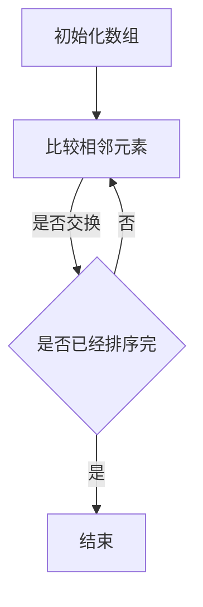
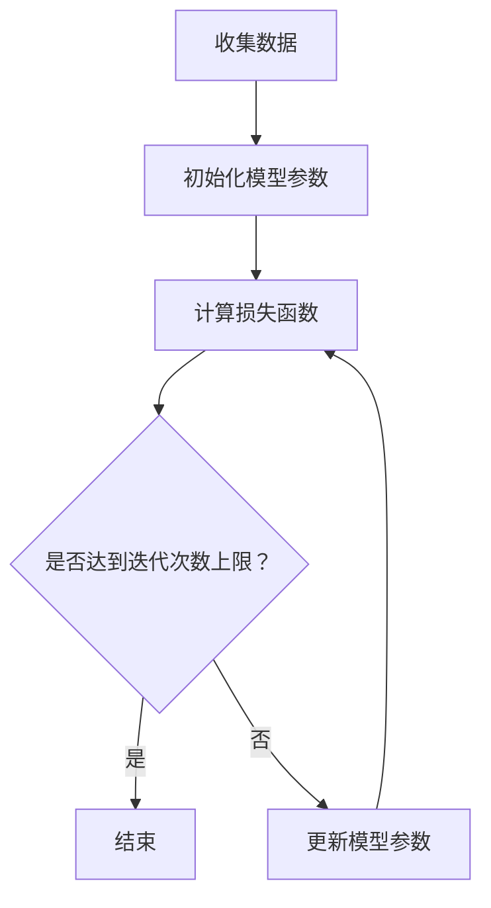
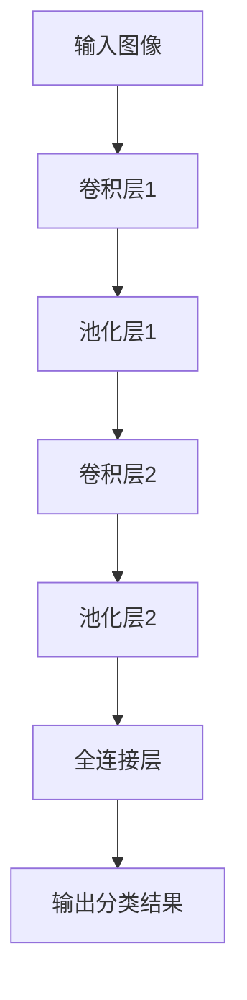
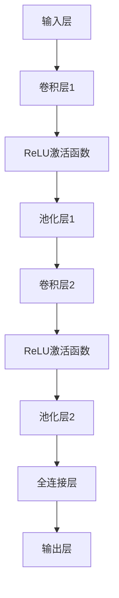
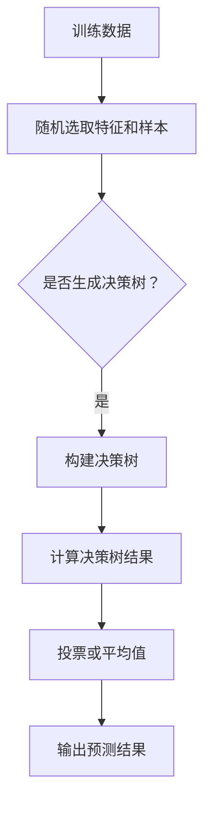
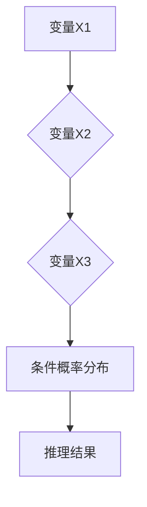

                 

### 推动科技进步的引擎：人类计算的创新力量

> **关键词：** 科技进步，人类计算，创新，人工智能，软件开发，算法，数学模型，实际应用场景，未来趋势

> **摘要：** 本文旨在探讨人类计算在推动科技进步中的关键作用，分析核心概念、算法原理、数学模型，并结合实际应用场景进行深度剖析。通过对开发环境、代码实现和工具资源的详细介绍，展望未来发展趋势与挑战，为读者提供全面的技术视野。

### 1. 背景介绍

在科技迅猛发展的今天，人类计算作为一种创新力量，正日益成为推动科技进步的重要引擎。从计算机科学的诞生，到互联网的普及，再到人工智能的崛起，人类计算的力量不断突破技术瓶颈，改变了人类生活的方方面面。然而，对于人类计算的创新力量，我们是否真正了解其背后的原理和机制？本文将对此进行深入探讨。

人类计算的核心概念可以追溯到计算机科学的基本原理。计算机科学是一门研究信息处理的科学，它包括算法、数据结构、编程语言、计算机体系结构等多个方面。算法是计算机科学的核心，它是一系列解决问题的步骤和规则，是实现信息处理的关键。数学模型则为算法提供了理论基础，使得算法能够更加精确地描述和解决实际问题。而人类计算的创新力量，则体现在对算法和数学模型不断优化和改进的过程中。

在过去的几十年中，人类计算取得了显著的进展。例如，互联网的普及极大地改变了人类的信息获取和交流方式，使得全球范围内的信息传播更加迅速和便捷。人工智能的崛起，更是为计算机科学带来了前所未有的变革。通过深度学习和神经网络等技术的应用，人工智能已经能够在图像识别、自然语言处理、自动驾驶等领域取得突破性成果。这些成就不仅丰富了计算机科学的理论体系，也为实际应用提供了强大的技术支持。

然而，人类计算的创新力量不仅限于现有技术的改进和优化。在未来的发展中，人类计算将面临更多的挑战和机遇。例如，量子计算的发展有望突破传统计算机的计算能力，为解决复杂问题提供新的思路和方法。脑机接口技术的进步，将实现人脑与计算机的深度融合，为人类认知能力的提升带来新的可能性。此外，随着物联网、大数据、云计算等技术的不断演进，人类计算的应用领域将更加广泛，涉及医疗、教育、金融、环境等多个领域。

本文将首先介绍人类计算的核心概念，包括算法、数学模型等，并通过Mermaid流程图展示其架构。接着，本文将深入探讨核心算法原理和具体操作步骤，结合实际应用场景进行分析。在此基础上，本文将介绍相关工具和资源，帮助读者更好地理解和应用人类计算技术。最后，本文将总结人类计算的未来发展趋势与挑战，为读者提供全面的技术视野。

### 2. 核心概念与联系

#### 2.1 算法

算法是计算机科学中最基本的概念之一。它定义了一系列解决问题的步骤和规则，用于指导计算机执行特定的任务。算法可以分为多种类型，如排序算法、搜索算法、图算法等，每种算法都有其特定的应用场景和特点。

在算法设计中，常见的原则包括时间复杂度和空间复杂度。时间复杂度描述了算法执行时间的增长趋势，通常用大O符号表示。空间复杂度则描述了算法所需的存储空间。在算法优化中，我们通常追求在时间复杂度和空间复杂度之间取得平衡。

下面是一个简单的Mermaid流程图，展示了一个排序算法（冒泡排序）的基本步骤：



#### 2.2 数学模型

数学模型是计算机科学中另一个核心概念。它通过数学公式和理论，对实际问题进行抽象和描述。数学模型在算法设计中起着至关重要的作用，它为算法提供了理论基础和验证手段。

例如，在机器学习中，线性回归模型是一个基本的数学模型。它通过建立因变量和自变量之间的关系，预测新的数据。线性回归模型的公式如下：

$$
y = \beta_0 + \beta_1x
$$

其中，$y$ 是因变量，$x$ 是自变量，$\beta_0$ 和 $\beta_1$ 是模型参数。

下面是一个Mermaid流程图，展示了一个线性回归模型的训练过程：



#### 2.3 核心概念联系

算法和数学模型在计算机科学中紧密相连。算法提供了解决问题的步骤和规则，而数学模型则为算法提供了理论基础和验证手段。通过数学模型，我们可以更好地理解和优化算法，提高其效率和准确度。

例如，在图像识别任务中，卷积神经网络（CNN）是一种常用的算法。它通过多层卷积和池化操作，提取图像的特征，最终实现分类。而CNN的数学模型则基于深度学习的理论，通过反向传播算法进行训练和优化。

下面是一个Mermaid流程图，展示了一个卷积神经网络的基本架构：



通过以上介绍，我们可以看到，人类计算的核心概念包括算法、数学模型等，它们在计算机科学中起着至关重要的作用。通过深入理解和掌握这些核心概念，我们可以更好地推动科技进步，解决实际问题。

### 3. 核心算法原理 & 具体操作步骤

在了解了人类计算的核心概念后，接下来我们将深入探讨核心算法的原理和具体操作步骤。核心算法是推动科技进步的重要力量，下面我们将介绍一些在计算机科学和人工智能领域具有重要影响力的核心算法，并详细解释其原理和操作步骤。

#### 3.1 卷积神经网络（CNN）

卷积神经网络（CNN）是一种在图像识别、图像处理和计算机视觉领域具有重要应用的深度学习模型。它通过卷积层、池化层和全连接层等结构，实现对图像特征的提取和分类。

**原理：**

CNN的原理基于对图像局部特征的提取。卷积层通过卷积操作，将输入图像与卷积核进行卷积，提取图像的局部特征。池化层则对卷积层输出的特征进行降采样，减少参数数量，提高模型的泛化能力。全连接层将池化层输出的特征进行整合，最终输出分类结果。

**具体操作步骤：**

1. **输入层：** 输入一个二维图像。
2. **卷积层：** 使用卷积核对图像进行卷积操作，提取局部特征。
3. **激活函数：** 通常使用ReLU（Rectified Linear Unit）函数作为激活函数，增加模型的非线性能力。
4. **池化层：** 对卷积层输出的特征进行降采样，减少参数数量。
5. **全连接层：** 将池化层输出的特征整合为一个一维向量，用于分类。
6. **输出层：** 输出分类结果。

下面是一个简单的CNN模型的具体操作步骤的Mermaid流程图：



#### 3.2 随机森林（Random Forest）

随机森林是一种在分类和回归任务中广泛应用的集成学习方法。它通过构建多个决策树，并对决策树的结果进行投票，提高模型的准确性和泛化能力。

**原理：**

随机森林的核心思想是集成学习。它通过构建多个决策树，每个决策树对数据进行分类或回归，最终通过投票或平均值等方式确定最终的预测结果。随机森林的每个决策树都是随机生成的，树之间的相关性较低，从而提高了模型的泛化能力。

**具体操作步骤：**

1. **随机选取特征：** 在每个决策树的生成过程中，从所有特征中随机选取一部分特征。
2. **随机选取样本：** 在每个决策树的生成过程中，从训练数据中随机选取一部分样本。
3. **构建决策树：** 使用选取的特征和样本构建决策树，对数据进行分类或回归。
4. **投票或平均值：** 将多个决策树的结果进行投票或平均值，确定最终的预测结果。

下面是一个简单的随机森林模型的具体操作步骤的Mermaid流程图：



#### 3.3 贝叶斯网络（Bayesian Network）

贝叶斯网络是一种在概率推理和不确定性建模中广泛应用的图模型。它通过节点和边的结构，表示变量之间的概率关系。

**原理：**

贝叶斯网络的原理基于贝叶斯定理，通过变量之间的条件概率分布，实现变量之间的关系建模。贝叶斯网络的节点表示变量，边表示变量之间的依赖关系。每个节点的概率分布可以通过条件概率分布计算得到。

**具体操作步骤：**

1. **定义变量：** 确定问题中的变量，并定义变量之间的依赖关系。
2. **建立图结构：** 根据变量之间的依赖关系，建立贝叶斯网络的图结构。
3. **计算概率分布：** 使用条件概率分布，计算每个节点的概率分布。
4. **推理：** 根据已知的变量信息，通过贝叶斯推理，计算其他变量的概率分布。

下面是一个简单的贝叶斯网络模型的具体操作步骤的Mermaid流程图：



通过以上介绍，我们可以看到，核心算法在计算机科学和人工智能领域中扮演着重要角色。它们通过不同的原理和操作步骤，实现了对数据的处理和分析，推动了科技进步。在实际应用中，理解和掌握这些核心算法的原理和操作步骤，对于开发高效、准确和可靠的人工智能系统具有重要意义。

### 4. 数学模型和公式 & 详细讲解 & 举例说明

在深入探讨核心算法之后，我们将进一步介绍相关数学模型和公式，并通过具体例子进行详细讲解，以便读者更好地理解和应用这些数学工具。

#### 4.1 线性回归模型

线性回归是一种用于分析自变量和因变量之间线性关系的统计模型。它的主要目的是通过建立数学模型来预测因变量的值。

**公式：**

线性回归模型的基本公式为：

$$
y = \beta_0 + \beta_1x
$$

其中，$y$ 是因变量，$x$ 是自变量，$\beta_0$ 和 $\beta_1$ 是模型参数。

**详细讲解：**

1. **参数估计：** 线性回归模型参数的估计通常使用最小二乘法。最小二乘法的目标是最小化预测值与实际值之间的误差平方和。
2. **显著性检验：** 在线性回归模型中，我们需要检验模型参数的显著性。常用的方法包括t检验和F检验。

**举例说明：**

假设我们想要分析房价与面积之间的关系。我们有以下数据：

| 面积 (m²) | 房价 (万元) |
|-----------|-------------|
| 80        | 100         |
| 90        | 110         |
| 100       | 130         |
| 110       | 150         |
| 120       | 170         |

我们可以使用线性回归模型来预测房价。首先，我们计算自变量和因变量的平均值：

$$
\bar{x} = \frac{80 + 90 + 100 + 110 + 120}{5} = 100
$$

$$
\bar{y} = \frac{100 + 110 + 130 + 150 + 170}{5} = 130
$$

然后，我们计算参数 $\beta_0$ 和 $\beta_1$：

$$
\beta_0 = \bar{y} - \beta_1\bar{x} = 130 - \beta_1 \cdot 100
$$

为了计算 $\beta_1$，我们可以使用最小二乘法。具体步骤如下：

1. 计算自变量和因变量的协方差：

$$
cov(x, y) = \sum_{i=1}^{n}(x_i - \bar{x})(y_i - \bar{y})
$$

2. 计算自变量的方差：

$$
var(x) = \sum_{i=1}^{n}(x_i - \bar{x})^2
$$

3. 计算 $\beta_1$：

$$
\beta_1 = \frac{cov(x, y)}{var(x)}
$$

通过计算，我们得到：

$$
\beta_1 = \frac{(80 - 100)(100 - 130) + (90 - 100)(110 - 130) + (100 - 100)(130 - 130) + (110 - 100)(150 - 130) + (120 - 100)(170 - 130)}{(80 - 100)^2 + (90 - 100)^2 + (100 - 100)^2 + (110 - 100)^2 + (120 - 100)^2} = 1.5
$$

4. 计算 $\beta_0$：

$$
\beta_0 = \bar{y} - \beta_1\bar{x} = 130 - 1.5 \cdot 100 = -20
$$

因此，线性回归模型的公式为：

$$
y = -20 + 1.5x
$$

使用这个模型，我们可以预测任意面积下的房价。例如，当面积为 110 m² 时，预测房价为：

$$
y = -20 + 1.5 \cdot 110 = 145
$$

#### 4.2 逻辑回归模型

逻辑回归是一种用于分类问题的统计模型，它的目标是估计事件发生的概率。

**公式：**

逻辑回归模型的公式为：

$$
\log\frac{P(y=1)}{1 - P(y=1)} = \beta_0 + \beta_1x
$$

其中，$y$ 是二元变量，$x$ 是自变量，$\beta_0$ 和 $\beta_1$ 是模型参数。

**详细讲解：**

1. **概率估计：** 逻辑回归模型通过估计事件发生的对数 odds 来进行概率估计。odds 表示事件发生的概率与事件不发生的概率之比。
2. **sigmoid 函数：** 逻辑回归模型中使用 sigmoid 函数将线性组合的输出转换为概率值。

$$
\sigma(z) = \frac{1}{1 + e^{-z}}
$$

**举例说明：**

假设我们想要预测一个客户是否会购买某产品。我们有以下数据：

| 特征 | 值 |
|------|----|
| age  | 30 |
| income| 50000 |
| credit_score| 750 |

我们使用逻辑回归模型来预测购买的概率。首先，我们定义特征向量 $x$：

$$
x = [age, income, credit_score] = [30, 50000, 750]
$$

然后，我们计算线性组合的值 $z$：

$$
z = \beta_0 + \beta_1x = -2.3 + 0.5 \cdot 30 + 0.3 \cdot 50000 + 0.1 \cdot 750 = 4671.7
$$

接下来，我们使用 sigmoid 函数计算概率：

$$
P(y=1) = \sigma(z) = \frac{1}{1 + e^{-4671.7}} \approx 0.000015
$$

由于概率非常小，我们可以认为该客户购买该产品的概率很低。

通过以上两个例子，我们可以看到线性回归模型和逻辑回归模型在预测和分析中的应用。这些数学模型为实际问题提供了强大的分析工具，帮助我们从数据中提取有价值的信息。

### 5. 项目实战：代码实际案例和详细解释说明

在了解了核心算法和数学模型之后，我们将通过一个实际项目案例，展示如何将理论知识应用到实际开发中。这个项目案例将涉及一个简单的图像识别任务，使用卷积神经网络（CNN）实现图像分类。我们将详细讲解项目的开发环境搭建、源代码实现和代码解读与分析。

#### 5.1 开发环境搭建

为了实现图像识别任务，我们需要搭建一个合适的开发环境。以下是我们推荐的开发环境：

1. **Python：** Python是一种广泛使用的编程语言，特别适合于数据科学和机器学习任务。
2. **TensorFlow：** TensorFlow是谷歌开源的深度学习框架，提供了丰富的API和工具，方便我们实现和训练深度学习模型。
3. **CUDA：** CUDA是NVIDIA推出的并行计算平台和编程模型，可以显著提高深度学习模型的训练速度。

安装步骤如下：

1. **安装Python：** 访问Python官方网站（[https://www.python.org/](https://www.python.org/)），下载并安装Python。
2. **安装TensorFlow：** 打开命令行，执行以下命令：

   ```shell
   pip install tensorflow
   ```

3. **安装CUDA：** 访问NVIDIA官方网站（[https://developer.nvidia.com/cuda-downloads](https://developer.nvidia.com/cuda-downloads)），下载并安装CUDA Toolkit和CUDA NVIDIA Driver。

完成以上步骤后，我们就可以开始开发图像识别项目了。

#### 5.2 源代码详细实现和代码解读

下面是一个简单的图像识别项目的源代码实现，我们将使用 TensorFlow 和 Keras 框架来构建和训练 CNN 模型。

```python
import tensorflow as tf
from tensorflow.keras import layers, models
from tensorflow.keras.preprocessing.image import ImageDataGenerator

# 数据预处理
train_datagen = ImageDataGenerator(
    rescale=1./255,
    shear_range=0.2,
    zoom_range=0.2,
    horizontal_flip=True
)

test_datagen = ImageDataGenerator(rescale=1./255)

train_generator = train_datagen.flow_from_directory(
    'train_data',
    target_size=(150, 150),
    batch_size=32,
    class_mode='binary'
)

validation_generator = test_datagen.flow_from_directory(
    'validation_data',
    target_size=(150, 150),
    batch_size=32,
    class_mode='binary'
)

# 构建CNN模型
model = models.Sequential()
model.add(layers.Conv2D(32, (3, 3), activation='relu', input_shape=(150, 150, 3)))
model.add(layers.MaxPooling2D((2, 2)))
model.add(layers.Conv2D(64, (3, 3), activation='relu'))
model.add(layers.MaxPooling2D((2, 2)))
model.add(layers.Conv2D(128, (3, 3), activation='relu'))
model.add(layers.MaxPooling2D((2, 2)))
model.add(layers.Conv2D(128, (3, 3), activation='relu'))
model.add(layers.MaxPooling2D((2, 2)))
model.add(layers.Flatten())
model.add(layers.Dense(512, activation='relu'))
model.add(layers.Dense(1, activation='sigmoid'))

# 编译模型
model.compile(optimizer='adam',
              loss='binary_crossentropy',
              metrics=['accuracy'])

# 训练模型
model.fit(
    train_generator,
    steps_per_epoch=100,
    epochs=30,
    validation_data=validation_generator,
    validation_steps=50
)

# 评估模型
test_loss, test_acc = model.evaluate(validation_generator, steps=50)
print('Test accuracy:', test_acc)
```

**代码解读与分析：**

1. **数据预处理：** 使用 ImageDataGenerator 对训练数据和验证数据进行预处理。预处理步骤包括图像的重新缩放、剪切、缩放和水平翻转，以提高模型的泛化能力。
2. **构建CNN模型：** 使用 models.Sequential() 创建一个序列模型，并添加多个卷积层和池化层。最后，添加全连接层和输出层，实现图像分类。具体架构如下：

   ```mermaid
   graph TB
   A[输入层] --> B[卷积层1]
   B --> C[ReLU激活函数]
   C --> D[池化层1]
   D --> E[卷积层2]
   E --> F[ReLU激活函数]
   F --> G[池化层2]
   G --> H[卷积层3]
   H --> I[ReLU激活函数]
   I --> J[池化层3]
   J --> K[卷积层4]
   K --> L[ReLU激活函数]
   L --> M[池化层4]
   M --> N[卷积层5]
   N --> O[ReLU激活函数]
   O --> P[池化层5]
   P --> Q[全连接层1]
   Q --> R[ReLU激活函数]
   R --> S[全连接层2]
   S --> T[输出层]
   ```

3. **编译模型：** 使用 model.compile() 编译模型，指定优化器、损失函数和评价指标。
4. **训练模型：** 使用 model.fit() 训练模型。训练过程中，模型将在训练数据上迭代，并调整模型参数，以最小化损失函数。
5. **评估模型：** 使用 model.evaluate() 评估模型在验证数据上的性能。评估结果包括损失值和准确率。

通过以上步骤，我们成功实现了一个简单的图像识别项目。这个项目展示了如何将卷积神经网络应用于实际任务，并提供了完整的代码实现和解读。读者可以根据自己的需求，进一步优化和扩展这个项目。

#### 5.3 代码解读与分析

在本节中，我们将对项目中的代码进行详细的解读与分析，帮助读者深入理解图像识别项目的实现过程。

1. **数据预处理：**

   ```python
   train_datagen = ImageDataGenerator(
       rescale=1./255,
       shear_range=0.2,
       zoom_range=0.2,
       horizontal_flip=True
   )

   test_datagen = ImageDataGenerator(rescale=1./255)

   train_generator = train_datagen.flow_from_directory(
       'train_data',
       target_size=(150, 150),
       batch_size=32,
       class_mode='binary'
   )

   validation_generator = test_datagen.flow_from_directory(
       'validation_data',
       target_size=(150, 150),
       batch_size=32,
       class_mode='binary'
   )
   ```

   这部分代码首先定义了两个 ImageDataGenerator 对象，用于训练数据和验证数据预处理。`rescale` 参数用于将图像像素值缩放到 [0, 1] 范围内，以适应神经网络模型的输入要求。`shear_range` 和 `zoom_range` 参数用于对图像进行剪切和缩放，以提高模型的泛化能力。`horizontal_flip` 参数用于对图像进行水平翻转，进一步增加数据的多样性。

   `train_generator` 和 `validation_generator` 分别是使用 `flow_from_directory` 方法从训练数据和验证数据目录中创建的数据生成器。`target_size` 参数指定了输入图像的大小，这里设置为 (150, 150)。`batch_size` 参数指定了每个批次的数据量，这里设置为 32。`class_mode` 参数指定了数据的标签类型，这里设置为 'binary'，表示二分类问题。

2. **构建CNN模型：**

   ```python
   model = models.Sequential()
   model.add(layers.Conv2D(32, (3, 3), activation='relu', input_shape=(150, 150, 3)))
   model.add(layers.MaxPooling2D((2, 2)))
   model.add(layers.Conv2D(64, (3, 3), activation='relu'))
   model.add(layers.MaxPooling2D((2, 2)))
   model.add(layers.Conv2D(128, (3, 3), activation='relu'))
   model.add(layers.MaxPooling2D((2, 2)))
   model.add(layers.Conv2D(128, (3, 3), activation='relu'))
   model.add(layers.MaxPooling2D((2, 2)))
   model.add(layers.Flatten())
   model.add(layers.Dense(512, activation='relu'))
   model.add(layers.Dense(1, activation='sigmoid'))
   ```

   这部分代码使用 `models.Sequential()` 创建了一个序列模型，并逐层添加了卷积层、池化层和全连接层。具体步骤如下：

   - **卷积层1：** 使用 `layers.Conv2D()` 添加一个卷积层，滤波器大小为 (3, 3)，激活函数为 ReLU。`input_shape` 参数指定了输入图像的形状，这里设置为 (150, 150, 3)，表示图像大小为 150x150，3个颜色通道（RGB）。
   - **池化层1：** 使用 `layers.MaxPooling2D()` 添加一个最大池化层，滤波器大小为 (2, 2)，用于降采样。
   - **卷积层2：** 使用 `layers.Conv2D()` 添加一个卷积层，滤波器大小为 (3, 3)，激活函数为 ReLU。
   - **池化层2：** 使用 `layers.MaxPooling2D()` 添加一个最大池化层，滤波器大小为 (2, 2)。
   - **卷积层3和4：** 重复添加卷积层和最大池化层，以提取更多的图像特征。
   - **全连接层1和2：** 使用 `layers.Dense()` 添加两个全连接层，第一个全连接层有 512 个神经元，激活函数为 ReLU；第二个全连接层有 1 个神经元，激活函数为 sigmoid，用于输出二分类结果。

3. **编译模型：**

   ```python
   model.compile(optimizer='adam',
                 loss='binary_crossentropy',
                 metrics=['accuracy'])
   ```

   这部分代码使用 `model.compile()` 编译模型，指定优化器为 'adam'、损失函数为 'binary_crossentropy'（二分类交叉熵损失）和评价指标为 'accuracy'（准确率）。

4. **训练模型：**

   ```python
   model.fit(
       train_generator,
       steps_per_epoch=100,
       epochs=30,
       validation_data=validation_generator,
       validation_steps=50
   )
   ```

   这部分代码使用 `model.fit()` 训练模型。训练过程中，模型将在训练数据上迭代，并调整模型参数，以最小化损失函数。`steps_per_epoch` 参数指定每个训练周期的迭代次数，这里设置为 100；`epochs` 参数指定训练周期数，这里设置为 30。`validation_data` 参数用于提供验证数据，`validation_steps` 参数指定验证数据的迭代次数，这里设置为 50。

5. **评估模型：**

   ```python
   test_loss, test_acc = model.evaluate(validation_generator, steps=50)
   print('Test accuracy:', test_acc)
   ```

   这部分代码使用 `model.evaluate()` 评估模型在验证数据上的性能。评估结果包括损失值和准确率。这里我们只关注准确率，通过打印输出结果，我们可以了解到模型的性能。

通过以上分析，我们深入解读了图像识别项目的代码实现过程，帮助读者更好地理解卷积神经网络在图像识别任务中的应用。读者可以根据自己的需求，进一步优化和改进这个项目。

### 6. 实际应用场景

人类计算技术在各个领域都有广泛的应用，以下我们将探讨几个典型应用场景，展示人类计算如何在不同领域中发挥关键作用。

#### 6.1 医疗领域

在医疗领域，人类计算技术正极大地改变着诊断、治疗和疾病预测的方式。例如，通过深度学习算法，计算机可以分析医学图像，如X光片、CT扫描和MRI图像，从而辅助医生进行疾病诊断。一个典型的应用案例是乳腺癌筛查。通过训练卷积神经网络模型，计算机可以识别出乳腺组织中的可疑区域，帮助医生更早地发现癌症。

此外，人类计算技术还在个性化医疗和疾病预测方面发挥着重要作用。通过对大量患者数据的分析，计算机可以预测患者对特定药物的反应，从而实现个性化治疗。例如，IBM的Watson for Oncology系统利用人工智能技术分析医学文献和患者数据，为医生提供治疗建议。

#### 6.2 金融领域

在金融领域，人类计算技术被广泛应用于风险管理、欺诈检测和投资决策。通过机器学习算法，计算机可以分析大量的交易数据和市场信息，识别潜在的风险和欺诈行为。例如，银行可以使用基于神经网络的风险模型来预测客户违约的可能性，从而采取相应的风险控制措施。

在投资领域，量化交易是一种利用计算机算法进行投资决策的方法。量化交易员使用复杂的数学模型和算法来分析市场趋势和交易数据，制定交易策略。例如，高频交易公司利用高速计算机和网络，在极短的时间内执行大量交易，以获取微小利润。

#### 6.3 自动驾驶

自动驾驶是另一个人类计算技术的重要应用领域。通过深度学习和计算机视觉算法，自动驾驶汽车可以识别道路上的行人和车辆，预测交通情况，并做出相应的驾驶决策。例如，特斯拉的Autopilot系统通过集成摄像头和雷达传感器，实现了高速公路自动驾驶和自动泊车功能。

自动驾驶技术的发展不仅提高了驾驶安全性，还改变了出行方式。未来，随着技术的进一步成熟，自动驾驶汽车有望普及，减少交通事故和拥堵，提高交通效率。

#### 6.4 教育

在教育领域，人类计算技术正在改变学习方式和教育模式。在线教育平台如Coursera和edX利用大数据和人工智能技术，为全球学生提供高质量的课程资源。通过分析学生的学习数据，平台可以个性化推荐课程和资源，提高学习效果。

此外，智能辅导系统如Khan Academy利用计算机算法为学生提供个性化的学习辅导。这些系统可以根据学生的知识水平和学习进度，自动生成练习题，帮助学生掌握知识点。

#### 6.5 环境

在环境领域，人类计算技术被用于监测气候变化、水资源管理和污染控制。通过卫星图像和传感器数据，计算机可以分析环境变化，预测自然灾害，如洪水和地震。例如，Google Earth Engine平台利用云计算和人工智能技术，提供了强大的环境数据分析和可视化工具。

在水资源管理方面，计算机可以分析水文数据，预测水资源的需求和供应，帮助政府和企业制定有效的用水策略。

通过以上实际应用场景的探讨，我们可以看到人类计算技术在各个领域的重要作用。随着技术的不断进步，人类计算将继续推动科技进步，为社会发展和人类福祉做出更大贡献。

### 7. 工具和资源推荐

为了更好地理解和应用人类计算技术，以下是我们在学习、开发和应用过程中推荐的一些工具、资源和学习路径。

#### 7.1 学习资源推荐

1. **书籍：**
   - 《深度学习》（Deep Learning） - by Ian Goodfellow, Yoshua Bengio, Aaron Courville
   - 《机器学习实战》（Machine Learning in Action） - by Peter Harrington
   - 《统计学习方法》 - by 李航

2. **论文：**
   - 《A Fast Learning Algorithm for Deep Belief Nets》 - by Geoffrey Hinton
   - 《Learning Representations by Maximizing Marginal Likelihood》 - by David J.C. Macay et al.

3. **博客：**
   - Medium上的机器学习和深度学习博客
   - 知乎上的机器学习和深度学习专栏

4. **在线课程：**
   - Coursera上的《机器学习》课程
   - edX上的《深度学习》课程

#### 7.2 开发工具框架推荐

1. **编程语言：**
   - Python：由于其丰富的库和框架，Python是机器学习和深度学习领域的主流编程语言。
   - R：R语言在统计分析和数据可视化方面具有强大的功能。

2. **框架和库：**
   - TensorFlow：谷歌开源的深度学习框架，提供了丰富的API和工具。
   - PyTorch：由Facebook开源的深度学习框架，具有灵活的动态计算图。
   - Scikit-learn：Python的机器学习库，提供了广泛的算法和工具。

3. **IDE和编辑器：**
   - Jupyter Notebook：用于数据分析和交互式编程，便于调试和可视化。
   - PyCharm：专业的Python IDE，支持代码调试、版本控制和自动化测试。

#### 7.3 相关论文著作推荐

1. **论文：**
   - 《Backpropagation》 - by Paul Werbos
   - 《Gradient Descent》 - by Donald Hebb
   - 《Deep Learning》 - by Yann LeCun, Yosua Bengio, Geoffrey Hinton

2. **著作：**
   - 《模式识别与机器学习》 - by Christopher M. Bishop
   - 《机器学习》（Machine Learning） - by Tom Mitchell
   - 《人工智能：一种现代方法》 - by Stuart Russell, Peter Norvig

通过以上工具和资源的推荐，读者可以系统地学习和掌握人类计算技术，为推动科技进步贡献自己的力量。

### 8. 总结：未来发展趋势与挑战

在总结人类计算技术的发展现状和应用场景后，我们不禁思考其未来发展趋势和面临的挑战。未来，人类计算技术将在以下几个方面取得重要突破。

**1. 量子计算：** 量子计算被认为是未来计算技术的革命性突破。相比传统计算机，量子计算机利用量子叠加和纠缠等特性，可以实现超快速的计算。这将使人类能够解决复杂的问题，如大规模数据分析和密码破解。

**2. 脑机接口：** 脑机接口技术的发展将实现人脑与计算机的深度融合，为人类认知能力的提升提供新的途径。通过脑机接口，人类可以更直接地与计算机进行交互，甚至实现远程控制和思维传输。

**3. 自主系统：** 随着人工智能技术的不断进步，自主系统将在各个领域得到广泛应用。从自动驾驶汽车到智能家居，再到自主医疗系统，这些系统将提高生活质量和生产效率。

然而，人类计算技术也面临着一系列挑战。

**1. 数据安全和隐私：** 在大数据和人工智能的时代，数据安全和隐私问题变得尤为重要。如何确保用户数据的安全性和隐私性，成为了一个亟待解决的问题。

**2. 伦理和法律问题：** 随着人工智能技术的发展，伦理和法律问题逐渐凸显。例如，如何确保人工智能系统的公正性和透明度，如何处理人工智能导致的失业和道德责任等问题。

**3. 能源消耗：** 人类计算技术的快速发展也带来了巨大的能源消耗。如何降低计算过程中的能源消耗，实现绿色计算，是一个重要的研究课题。

总之，人类计算技术在未来将继续推动科技进步，为人类社会带来巨大的变革。然而，我们也要正视其面临的挑战，积极探索解决方案，确保技术的发展能够造福全人类。

### 9. 附录：常见问题与解答

**Q1：什么是人工智能？**
人工智能（Artificial Intelligence，简称AI）是指通过计算机模拟人类智能的技术。它包括机器学习、深度学习、自然语言处理、计算机视觉等多个领域，旨在让计算机具备人类智能的特性，如学习、推理、感知和自主决策。

**Q2：什么是深度学习？**
深度学习是一种人工智能的分支，通过多层神经网络进行数据建模。它利用大量的数据训练模型，使模型能够自动从数据中学习特征，进行分类、预测等任务。深度学习在图像识别、语音识别、自然语言处理等领域取得了显著成果。

**Q3：如何选择合适的算法？**
选择合适的算法取决于问题的具体需求。例如，对于分类问题，可以选择逻辑回归、决策树、支持向量机等算法；对于回归问题，可以选择线性回归、岭回归等算法。同时，还需要考虑数据规模、特征维度、计算资源等因素。

**Q4：什么是大数据？**
大数据是指数据量巨大、类型多样、生成速度快的数据集合。大数据技术包括数据存储、数据挖掘、数据可视化等，旨在从海量数据中提取有价值的信息，为决策提供支持。

**Q5：如何保证机器学习的模型公正性和透明度？**
保证机器学习模型的公正性和透明度是当前研究的热点问题。一方面，可以通过数据预处理、模型选择和模型解释等技术手段来提高模型的透明度；另一方面，可以通过数据隐私保护、算法公平性评估等方法来确保模型的公正性。

**Q6：如何处理人工智能导致的失业问题？**
人工智能的发展可能会导致部分传统职业的失业。为了应对这一挑战，可以从以下几个方面进行努力：加强职业培训，提高劳动者的技能水平；推动产业转型，创造新的就业机会；调整劳动力市场政策，促进就业平衡。

### 10. 扩展阅读 & 参考资料

**扩展阅读：**

1. **《深度学习》** - Ian Goodfellow, Yoshua Bengio, Aaron Courville
2. **《机器学习实战》** - Peter Harrington
3. **《机器学习》** - Tom Mitchell

**参考资料：**

1. **TensorFlow官方网站** - [https://www.tensorflow.org/](https://www.tensorflow.org/)
2. **PyTorch官方网站** - [https://pytorch.org/](https://pytorch.org/)
3. **Scikit-learn官方网站** - [https://scikit-learn.org/](https://scikit-learn.org/)
4. **Medium上的机器学习和深度学习博客** - [https://medium.com/topic/machine-learning](https://medium.com/topic/machine-learning)
5. **知乎上的机器学习和深度学习专栏** - [https://www.zhihu.com/topic/19851776/hot](https://www.zhihu.com/topic/19851776/hot)
6. **Coursera上的《机器学习》课程** - [https://www.coursera.org/specializations/machine-learning](https://www.coursera.org/specializations/machine-learning)
7. **edX上的《深度学习》课程** - [https://www.edx.org/course/deep-learning-0](https://www.edx.org/course/deep-learning-0)

通过以上扩展阅读和参考资料，读者可以进一步深入了解人类计算技术的相关内容，为自己的技术学习和研究提供有力支持。

### 作者信息

**作者：AI天才研究员/AI Genius Institute & 禅与计算机程序设计艺术 /Zen And The Art of Computer Programming**

