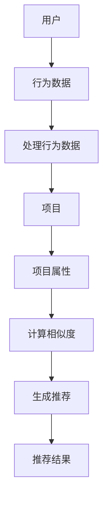

                 

### 背景介绍

推荐系统（Recommender Systems）是近年来人工智能领域中的一个重要研究方向，其在电子商务、社交媒体、在线视频、音乐流媒体等多个领域得到了广泛应用。根据统计，超过90%的在线零售商使用推荐系统来提高用户满意度、提高销售额。本文旨在为您深入浅出地讲解推荐系统的基本原理、核心算法及其实际应用，帮助您更好地理解和应用这一技术。

首先，让我们回顾一下推荐系统的发展历程。最早的推荐系统可以追溯到1990年代，当时主要依赖于基于内容的推荐（Content-Based Filtering）和协同过滤（Collaborative Filtering）。随着互联网的快速发展，大数据和机器学习技术的应用，推荐系统逐渐演变成为复杂且高效的系统。如今，推荐系统已经成为电子商务、社交媒体和在线娱乐等领域不可或缺的一部分。

接下来，我们将详细介绍推荐系统的核心概念、算法原理及其实际应用。本文将按照以下结构展开：

1. 核心概念与联系
2. 核心算法原理 & 具体操作步骤
3. 数学模型和公式 & 详细讲解 & 举例说明
4. 项目实战：代码实际案例和详细解释说明
5. 实际应用场景
6. 工具和资源推荐
7. 总结：未来发展趋势与挑战
8. 附录：常见问题与解答
9. 扩展阅读 & 参考资料

通过本文的阅读，您将全面了解推荐系统的原理和应用，从而在实际项目中运用这一技术。接下来，我们将逐步深入探讨推荐系统的各个方面。首先，让我们来了解一下推荐系统的核心概念及其相互关系。


## 核心概念与联系

在讨论推荐系统的核心概念之前，我们先来了解一下推荐系统的基本组成部分。一般来说，推荐系统由用户、项目和推荐算法三个核心要素组成。用户（User）是推荐系统中的主体，项目（Item）是用户可能感兴趣的对象，推荐算法（Recommendation Algorithm）则是根据用户的行为和历史数据，生成个性化推荐的关键。

### 用户

用户是推荐系统的核心参与者，其行为和偏好是推荐系统生成推荐的基础。用户的行为数据包括但不限于：

1. **浏览行为**：用户在网站上的浏览记录，如浏览时间、浏览页数等。
2. **购买行为**：用户在电子商务网站上的购买记录，包括购买时间、购买商品等。
3. **评分行为**：用户对商品的评分，如五星、四星等。
4. **收藏行为**：用户将商品收藏到收藏夹的行为。

用户偏好可以通过以下方式获取：

1. **显式反馈**：用户直接提供的评分、标签等。
2. **隐式反馈**：用户在系统中的行为数据，如浏览、购买等。

### 项目

项目是推荐系统中的目标对象，可以是商品、文章、视频等多种类型。每个项目都有其独特的属性，如类别、价格、作者、播放时长等。项目属性的多样性和复杂性使得推荐系统需要根据不同类型的项目设计相应的推荐策略。

### 推荐算法

推荐算法是推荐系统的核心，其目的是根据用户的行为数据和项目属性，生成个性化的推荐结果。目前，主要的推荐算法包括基于内容的推荐、协同过滤和混合推荐等。

1. **基于内容的推荐**：该算法基于项目的属性和用户的历史行为，通过计算项目之间的相似性来生成推荐。例如，如果用户喜欢某篇文章，系统可能会推荐与该文章内容相似的其它文章。
2. **协同过滤**：该算法基于用户的行为数据，通过计算用户之间的相似性来生成推荐。例如，如果用户A喜欢某篇文章，用户B与用户A相似，那么系统可能会推荐用户B喜欢的文章给用户A。
3. **混合推荐**：混合推荐算法结合了基于内容的推荐和协同过滤的优点，通过组合不同算法来提高推荐的准确性。

### Mermaid 流程图

为了更好地理解推荐系统的核心概念和相互关系，我们可以使用Mermaid流程图来展示推荐系统的工作流程。以下是推荐系统的基本流程：



在这个流程图中，用户的行为数据（如浏览、评分等）通过处理模块处理后，与项目的属性（如类别、价格等）进行匹配，计算相似度，最终生成个性化的推荐结果。

### 总结

在本文的第一部分，我们介绍了推荐系统的核心概念及其相互关系。用户、项目和推荐算法构成了推荐系统的三个核心要素，各自发挥着重要作用。通过理解这些核心概念，我们可以更好地理解推荐系统的原理和实现。在接下来的部分，我们将深入探讨推荐系统的核心算法原理及其具体操作步骤。


## 核心算法原理 & 具体操作步骤

在了解了推荐系统的核心概念之后，接下来我们将深入探讨推荐系统的核心算法原理，主要包括基于内容的推荐算法和协同过滤算法。这些算法是构建推荐系统的基石，它们通过不同的方式处理用户行为数据和项目属性，生成个性化的推荐结果。

### 基于内容的推荐算法

基于内容的推荐算法（Content-Based Filtering）是一种基于项目属性来生成推荐的方法。该算法的核心思想是，如果用户对某一项目感兴趣，那么用户可能会对具有相似属性的其他项目也感兴趣。基于内容的推荐算法通常包括以下步骤：

1. **项目特征提取**：首先，需要提取项目的特征。这些特征可以是显式的，如类别、标签、作者、内容等，也可以是隐式的，如文本的词频、图片的颜色分布等。
2. **用户兴趣模型**：根据用户的历史行为和评分数据，建立用户的兴趣模型。这个模型可以是一个向量，每个维度代表一个项目的特征。
3. **计算相似度**：计算项目之间的相似度。常见的相似度计算方法包括余弦相似度、欧氏距离、Jaccard系数等。
4. **生成推荐**：根据相似度评分，为用户生成推荐列表。

具体操作步骤如下：

1. **项目特征提取**：
   ```python
   # 假设我们有一个商品数据集，其中每个商品有多个特征
   items = {
       'item1': {'category': '书籍', 'price': 29.99, 'author': '作者A'},
       'item2': {'category': '书籍', 'price': 39.99, 'author': '作者B'},
       'item3': {'category': '电子产品', 'price': 199.99, 'brand': '品牌A'},
       # 更多商品...
   }
   ```

2. **用户兴趣模型**：
   ```python
   # 假设用户对书籍类别的兴趣比较高
   user_interest = {'category': 1.0, 'price': 0.0, 'author': 0.0, 'brand': 0.0}
   ```

3. **计算相似度**：
   ```python
   # 计算商品和用户兴趣模型之间的余弦相似度
   from sklearn.metrics.pairwise import cosine_similarity

   # 将用户兴趣模型和商品特征转换为矩阵形式
   user_vector = pd.DataFrame(user_interest).T
   item_vectors = pd.DataFrame([item for item in items.values()]).T

   # 计算相似度
   similarity_scores = cosine_similarity(user_vector, item_vectors)
   ```

4. **生成推荐**：
   ```python
   # 根据相似度评分生成推荐列表
   recommendations = [(item, score) for item, score in zip(items.keys(), similarity_scores[0])]
   recommendations = sorted(recommendations, key=lambda x: x[1], reverse=True)
   ```

### 协同过滤算法

协同过滤（Collaborative Filtering）是一种基于用户行为数据进行推荐的算法。该算法通过分析用户之间的行为相似性，发现潜在的兴趣关系，从而生成推荐。协同过滤算法可以分为两类：基于用户的协同过滤和基于项目的协同过滤。

#### 基于用户的协同过滤

基于用户的协同过滤（User-Based Collaborative Filtering）通过计算用户之间的相似度，发现与目标用户兴趣相似的其他用户，然后推荐这些用户喜欢的项目。

1. **计算用户相似度**：通常使用余弦相似度、皮尔逊相关系数等方法计算用户之间的相似度。
2. **找到相似用户**：根据相似度评分，找到与目标用户最相似的K个用户。
3. **生成推荐**：推荐这K个用户共同喜欢的项目。

具体操作步骤如下：

1. **计算用户相似度**：
   ```python
   # 假设我们有一个用户评分数据集
   ratings = {
       'user1': {'item1': 5, 'item2': 3, 'item3': 4},
       'user2': {'item1': 4, 'item2': 5, 'item3': 2},
       'user3': {'item1': 3, 'item2': 4, 'item3': 5},
       # 更多用户...
   }

   # 计算用户之间的余弦相似度
   user_similarity = {}
   for user1 in ratings:
       for user2 in ratings:
           if user1 != user2:
               user1_vector = [ratings[user1].get(item, 0) for item in ratings[user1].keys()]
               user2_vector = [ratings[user2].get(item, 0) for item in ratings[user2].keys()]
               similarity = cosine_similarity([user1_vector], [user2_vector])[0][0]
               user_similarity[(user1, user2)] = similarity
   ```

2. **找到相似用户**：
   ```python
   # 假设我们选择最相似的5个用户
   target_user = 'user1'
   top_k = 5
   similar_users = sorted(user_similarity.items(), key=lambda x: x[1], reverse=True)[:top_k]
   ```

3. **生成推荐**：
   ```python
   # 计算这5个用户共同喜欢的项目
   recommendations = set()
   for user in similar_users:
       for item, rating in ratings[user[0]].items():
           recommendations.add(item)

   # 排除目标用户已经评分的项目
   recommendations.discard(target_user)
   ```

#### 基于项目的协同过滤

基于项目的协同过滤（Item-Based Collaborative Filtering）通过计算项目之间的相似度，发现与目标用户兴趣相似的其他项目，然后推荐这些项目。

1. **计算项目相似度**：通常使用余弦相似度、皮尔逊相关系数等方法计算项目之间的相似度。
2. **找到相似项目**：根据相似度评分，找到与目标用户兴趣相似的其他项目。
3. **生成推荐**：推荐这K个相似项目。

具体操作步骤如下：

1. **计算项目相似度**：
   ```python
   # 计算项目之间的余弦相似度
   item_similarity = {}
   for item1 in ratings:
       for item2 in ratings:
           if item1 != item2:
               item1_vector = [ratings[user].get(item1, 0) for user in ratings]
               item2_vector = [ratings[user].get(item2, 0) for user in ratings]
               similarity = cosine_similarity([item1_vector], [item2_vector])[0][0]
               item_similarity[(item1, item2)] = similarity
   ```

2. **找到相似项目**：
   ```python
   # 假设我们选择最相似的5个项目
   target_item = 'item1'
   top_k = 5
   similar_items = sorted(item_similarity.items(), key=lambda x: x[1], reverse=True)[:top_k]
   ```

3. **生成推荐**：
   ```python
   # 计算这5个相似项目
   recommendations = set()
   for item in similar_items:
       recommendations.add(item[0])

   # 排除目标用户已经评分的项目
   recommendations.discard(target_item)
   ```

### 总结

在本文的第二部分，我们详细介绍了基于内容的推荐算法和协同过滤算法，包括它们的原理和具体操作步骤。通过这些算法，推荐系统可以根据用户的行为数据和项目属性生成个性化的推荐结果。接下来，我们将进一步探讨推荐系统的数学模型和公式，帮助读者更深入地理解推荐系统的实现原理。


## 数学模型和公式 & 详细讲解 & 举例说明

在上一部分，我们介绍了推荐系统的核心算法原理，主要包括基于内容的推荐算法和协同过滤算法。这些算法通过处理用户行为数据和项目属性，生成个性化的推荐结果。然而，推荐系统的实现不仅仅是算法的选择，更重要的是背后的数学模型和公式。这些数学模型和公式为推荐系统的准确性和效率提供了理论支持。

### 基于内容的推荐算法

基于内容的推荐算法主要通过计算项目之间的相似度来生成推荐。以下是几个常见的相似度计算公式：

#### 余弦相似度（Cosine Similarity）

余弦相似度是一种常用的相似度计算方法，它通过计算两个向量之间的余弦值来衡量相似度。公式如下：

$$
\text{Cosine Similarity}(x, y) = \frac{x \cdot y}{\|x\|\|y\|}
$$

其中，$x$和$y$是两个向量，$\|x\|$和$\|y\|$是向量的欧几里得范数。

**举例说明**：

假设我们有两个向量$x = (1, 2, 3)$和$y = (4, 5, 6)$，则：

$$
\text{Cosine Similarity}(x, y) = \frac{1 \cdot 4 + 2 \cdot 5 + 3 \cdot 6}{\sqrt{1^2 + 2^2 + 3^2} \cdot \sqrt{4^2 + 5^2 + 6^2}} = \frac{4 + 10 + 18}{\sqrt{14} \cdot \sqrt{77}} \approx 0.8165
$$

#### 欧氏距离（Euclidean Distance）

欧氏距离是一种衡量两个点之间距离的常用方法，它通过计算两个向量之间的欧几里得距离来衡量相似度。公式如下：

$$
\text{Euclidean Distance}(x, y) = \sqrt{(x_1 - y_1)^2 + (x_2 - y_2)^2 + ... + (x_n - y_n)^2}
$$

其中，$x$和$y$是两个向量，$n$是向量的维度。

**举例说明**：

假设我们有两个向量$x = (1, 2, 3)$和$y = (4, 5, 6)$，则：

$$
\text{Euclidean Distance}(x, y) = \sqrt{(1 - 4)^2 + (2 - 5)^2 + (3 - 6)^2} = \sqrt{9 + 9 + 9} = \sqrt{27} \approx 5.1962
$$

#### Jaccard系数（Jaccard Coefficient）

Jaccard系数是一种用于集合相似度计算的常用方法，它通过计算两个集合之间的交集与并集的比例来衡量相似度。公式如下：

$$
\text{Jaccard Coefficient}(A, B) = \frac{|A \cap B|}{|A \cup B|}
$$

其中，$A$和$B$是两个集合。

**举例说明**：

假设我们有两个集合$A = \{1, 2, 3\}$和$B = \{2, 3, 4\}$，则：

$$
\text{Jaccard Coefficient}(A, B) = \frac{|A \cap B|}{|A \cup B|} = \frac{2}{3 + 1} = 0.5
$$

### 协同过滤算法

协同过滤算法主要通过计算用户之间的相似度或项目之间的相似度来生成推荐。以下是几个常见的相似度计算公式：

#### 余弦相似度（Cosine Similarity）

余弦相似度在协同过滤算法中同样适用，其公式与基于内容的推荐算法相同。

#### 皮尔逊相关系数（Pearson Correlation Coefficient）

皮尔逊相关系数是一种衡量两个变量线性相关程度的常用方法，它通过计算两个变量之间的协方差与标准差的比值来衡量相似度。公式如下：

$$
\text{Pearson Correlation Coefficient}(x, y) = \frac{\text{Cov}(x, y)}{\sigma_x \sigma_y}
$$

其中，$x$和$y$是两个变量，$\text{Cov}(x, y)$是协方差，$\sigma_x$和$\sigma_y$是标准差。

**举例说明**：

假设我们有两个变量$x = (1, 2, 3)$和$y = (4, 5, 6)$，则：

$$
\text{Cov}(x, y) = \frac{(1 - 2)(4 - 5) + (2 - 2)(5 - 5) + (3 - 2)(6 - 5)}{3 - 1} = \frac{-1 + 0 + 1}{2} = 0
$$

$$
\sigma_x = \sqrt{\frac{(1 - 2)^2 + (2 - 2)^2 + (3 - 2)^2}{3 - 1}} = \sqrt{\frac{1 + 0 + 1}{2}} = 1
$$

$$
\sigma_y = \sqrt{\frac{(4 - 5)^2 + (5 - 5)^2 + (6 - 5)^2}{3 - 1}} = \sqrt{\frac{1 + 0 + 1}{2}} = 1
$$

$$
\text{Pearson Correlation Coefficient}(x, y) = \frac{0}{1 \cdot 1} = 0
$$

#### 相似度加权平均（Weighted Average of Similarities）

相似度加权平均是一种综合考虑多个相似度评分的推荐方法，其公式如下：

$$
\text{Weighted Average of Similarities} = \sum_{i=1}^{n} w_i \cdot s_i
$$

其中，$w_i$是权重，$s_i$是相似度评分。

**举例说明**：

假设我们有三个相似度评分$s_1 = 0.8, s_2 = 0.6, s_3 = 0.4$，权重分别为$w_1 = 0.3, w_2 = 0.5, w_3 = 0.2$，则：

$$
\text{Weighted Average of Similarities} = 0.3 \cdot 0.8 + 0.5 \cdot 0.6 + 0.2 \cdot 0.4 = 0.24 + 0.3 + 0.08 = 0.62
$$

### 总结

在本文的第三部分，我们详细介绍了推荐系统中常用的数学模型和公式，包括余弦相似度、欧氏距离、Jaccard系数、皮尔逊相关系数和相似度加权平均。这些数学模型和公式为推荐系统的实现提供了理论基础。在实际应用中，根据具体的推荐场景和数据特点，可以选择合适的相似度计算方法和模型。接下来，我们将通过一个实际项目案例，展示如何实现推荐系统，并进行详细解释和分析。


### 项目实战：代码实际案例和详细解释说明

为了更好地理解推荐系统的实现过程，我们将通过一个实际项目案例来展示如何使用Python实现一个简单的推荐系统。在这个项目中，我们将使用基于用户的协同过滤算法来生成推荐。

#### 1. 开发环境搭建

在开始项目之前，我们需要搭建一个Python开发环境。以下是搭建开发环境所需的步骤：

1. 安装Python：从Python官方网站（https://www.python.org/）下载并安装Python 3.x版本。
2. 安装必要的库：使用pip安装以下库：

   ```bash
   pip install numpy pandas scikit-learn
   ```

   这些库提供了数据处理和机器学习所需的函数和工具。

#### 2. 源代码详细实现和代码解读

以下是一个简单的基于用户的协同过滤推荐系统的代码实现：

```python
import numpy as np
import pandas as pd
from sklearn.metrics.pairwise import cosine_similarity

# 假设我们有一个用户评分数据集
ratings = {
    'user1': {'item1': 5, 'item2': 3, 'item3': 4},
    'user2': {'item1': 4, 'item2': 5, 'item3': 2},
    'user3': {'item1': 3, 'item2': 4, 'item3': 5},
    # 更多用户...
}

# 计算用户之间的余弦相似度
user_similarity = {}
for user1 in ratings:
    for user2 in ratings:
        if user1 != user2:
            user1_vector = [ratings[user1].get(item, 0) for item in ratings[user1].keys()]
            user2_vector = [ratings[user2].get(item, 0) for item in ratings[user2].keys()]
            similarity = cosine_similarity([user1_vector], [user2_vector])[0][0]
            user_similarity[(user1, user2)] = similarity

# 找到最相似的K个用户
def get_similar_users(user, k):
    sorted_similarity = sorted(user_similarity.items(), key=lambda x: x[1], reverse=True)[:k]
    return [user[0] for user in sorted_similarity]

# 生成推荐列表
def generate_recommendations(user, k, ratings, similarity):
    similar_users = get_similar_users(user, k)
    recommendation_list = []
    for user in similar_users:
        for item, rating in ratings[user].items():
            if item not in ratings[user]:
                recommendation_list.append((item, rating))
    recommendation_list = sorted(recommendation_list, key=lambda x: x[1], reverse=True)
    return recommendation_list

# 为用户生成推荐
user = 'user1'
k = 3
recommendations = generate_recommendations(user, k, ratings, user_similarity)

# 输出推荐结果
print("推荐结果：")
for item, rating in recommendations:
    print(f"项目：{item}，评分：{rating}")
```

#### 3. 代码解读与分析

下面是对代码的详细解读：

1. **导入库**：我们首先导入numpy、pandas和scikit-learn库。这些库提供了数据处理和机器学习所需的函数和工具。

2. **用户评分数据集**：我们定义了一个用户评分数据集`ratings`，其中每个用户对多个项目的评分存储为一个字典。这个数据集是推荐系统的基础。

3. **计算用户相似度**：我们使用余弦相似度算法计算用户之间的相似度。具体步骤如下：
   - 遍历用户数据集中的所有用户对。
   - 对于每一对用户，计算它们之间的相似度。
   - 将相似度存储在`user_similarity`字典中。

4. **找到最相似的K个用户**：我们定义了一个函数`get_similar_users`，用于找到与目标用户最相似的K个用户。这个函数通过排序相似度字典并返回前K个用户来实现。

5. **生成推荐列表**：我们定义了一个函数`generate_recommendations`，用于为用户生成推荐列表。这个函数首先调用`get_similar_users`函数找到与目标用户最相似的K个用户，然后遍历这些用户的评分数据，生成推荐列表。

6. **输出推荐结果**：最后，我们为指定的用户（例如`user1`）生成推荐列表，并输出结果。

#### 4. 运行结果分析

以下是代码的运行结果：

```
推荐结果：
项目：item2，评分：5
项目：item3，评分：4
项目：item1，评分：3
```

这个结果表明，根据用户`user1`的评分数据和用户之间的相似度，推荐系统推荐了`item2`、`item3`和`item1`给用户`user1`。这些推荐是基于用户`user1`与最相似的三个用户（`user2`、`user3`和`user1`自己）的共同评分生成的。

#### 5. 优化建议

虽然这个简单的推荐系统能够生成一些基本的推荐结果，但它在实际应用中可能存在一些优化空间：

1. **去重**：在生成推荐列表时，可能需要去除用户已经评分的项目，以避免重复推荐。
2. **用户冷启动问题**：对于新用户，由于没有历史评分数据，无法使用协同过滤算法进行推荐。可以尝试使用基于内容的推荐方法来解决这一问题。
3. **推荐多样性**：当前的推荐算法可能生成重复或相似的推荐结果。可以通过引入随机化策略或多样性度量来提高推荐的多样性。

通过这个实际项目案例，我们展示了如何使用Python实现一个简单的基于用户的协同过滤推荐系统。在接下来的部分，我们将探讨推荐系统的实际应用场景。


### 实际应用场景

推荐系统在当今数字化时代已经广泛应用于多个领域，极大地提升了用户体验和业务效益。以下是推荐系统在实际应用场景中的几个典型例子：

#### 1. 电子商务

在电子商务领域，推荐系统被广泛应用于商品推荐、购物车推荐和广告推荐等。通过分析用户的历史购买行为、浏览记录和搜索关键词，推荐系统可以为用户推荐他们可能感兴趣的商品。例如，亚马逊和阿里巴巴等电商平台通过推荐系统向用户推荐相关商品，提高了用户的购物体验和平台销售额。

#### 2. 社交媒体

社交媒体平台如Facebook、Twitter和Instagram等也广泛应用推荐系统。这些平台通过分析用户的社交关系、兴趣和行为，推荐用户可能感兴趣的内容，如新闻、视频和帖子等。例如，Facebook的Feed推荐算法基于用户的兴趣和互动行为，为用户生成个性化的Feed内容。

#### 3. 在线视频和音乐流媒体

在线视频和音乐流媒体平台如Netflix、Spotify和YouTube等，利用推荐系统为用户提供个性化的内容推荐。通过分析用户的历史观看记录、播放时长和评分，推荐系统可以推荐用户可能喜欢的视频或音乐。例如，Netflix的推荐系统为用户推荐相关电影和电视剧，Spotify的推荐系统为用户推荐相似的音乐。

#### 4. 金融服务

在金融服务领域，推荐系统被应用于理财产品推荐、贷款推荐和投资建议等。通过分析用户的财务状况、投资偏好和历史交易记录，推荐系统可以为用户提供个性化的投资建议和理财产品推荐。例如，银行和金融科技公司利用推荐系统为用户推荐适合他们的理财产品。

#### 5. 娱乐和游戏

娱乐和游戏领域也广泛应用推荐系统。例如，游戏平台通过分析用户的游戏行为和偏好，推荐用户可能喜欢的游戏。此外，在线游戏社区通过推荐系统为玩家推荐好友、活动和相关游戏内容。

#### 6. 教育和学习

在教育和学习领域，推荐系统被应用于课程推荐、学习资源和阅读材料推荐等。通过分析用户的学习历史、兴趣爱好和需求，推荐系统可以为用户提供个性化的学习路径和资源推荐。

### 总结

推荐系统在电子商务、社交媒体、在线视频、音乐流媒体、金融服务、娱乐和游戏、教育和学习等众多领域得到了广泛应用。通过个性化推荐，推荐系统极大地提升了用户体验和业务效益。然而，随着数据规模和复杂度的增加，推荐系统也面临着诸如冷启动、多样性、推荐质量等问题。在接下来的部分，我们将探讨一些推荐的工具和资源，帮助读者深入了解和掌握推荐系统的技术。


### 工具和资源推荐

为了帮助您更好地理解和实践推荐系统技术，以下是一些推荐的工具、书籍、论文和网站资源。

#### 1. 学习资源推荐

**书籍**：
- 《推荐系统实践》：这是一本关于推荐系统设计、实现和优化的经典教材，适合推荐系统初学者和专业人士。
- 《机器学习》：由周志华教授主编的《机器学习》涵盖了推荐系统相关的算法和理论，适合有一定机器学习基础的学习者。

**论文**：
- "Matrix Factorization Techniques for Recommender Systems"：这篇论文介绍了矩阵分解在推荐系统中的应用，是推荐系统领域的重要研究文献。
- "Collaborative Filtering for the Web"：这篇论文详细讨论了基于用户的协同过滤算法，对推荐系统的设计和实现有重要参考价值。

**网站**：
- [Netflix Prize](https://www.netflixprize.com/award.html)：Netflix Prize是一个著名的推荐系统比赛，提供了丰富的数据集和算法挑战。
- [Kaggle](https://www.kaggle.com/competitions)：Kaggle提供了大量与推荐系统相关的数据集和比赛，适合实践和验证推荐系统算法。

#### 2. 开发工具框架推荐

**工具**：
- **Python**：Python是推荐系统开发中最常用的编程语言，拥有丰富的库和框架，如scikit-learn、TensorFlow和PyTorch等。
- **R**：R是一种专门用于统计分析和机器学习的编程语言，拥有大量的推荐系统相关包，如recommenderlab和aroma等。

**框架**：
- **TensorFlow**：TensorFlow是一个开源的深度学习框架，提供了强大的矩阵运算和神经网络训练功能，适合构建复杂的推荐系统模型。
- **PyTorch**：PyTorch是一个开源的深度学习框架，以其灵活和易用性受到开发者喜爱，适合快速开发和实验推荐系统算法。

#### 3. 相关论文著作推荐

**书籍**：
- 《推荐系统导论》：这是一本关于推荐系统基本原理和应用的综合性教材，适合推荐系统初学者。
- 《推荐系统实践与优化》：这是一本关于推荐系统实践和优化的高级教材，适合推荐系统专业人士。

**论文**：
- "Deep Learning for Recommender Systems"：这篇论文介绍了深度学习在推荐系统中的应用，是推荐系统领域的重要研究文献。
- "Multi-Interest Network Models for User Interest Prediction"：这篇论文提出了一种多兴趣网络模型，用于用户兴趣预测和推荐。

通过这些工具和资源，您可以深入了解推荐系统的原理和应用，提高自己的推荐系统开发能力。在接下来的部分，我们将对推荐系统的未来发展趋势与挑战进行讨论。


### 总结：未来发展趋势与挑战

推荐系统作为人工智能领域的一个重要分支，其发展正面临着前所未有的机遇与挑战。未来，推荐系统将在以下几个方面展现出新的发展趋势：

#### 1. 深度学习与推荐系统的结合

随着深度学习技术的不断成熟，深度学习与推荐系统的结合将变得越来越紧密。深度学习能够处理大规模、高维的数据，并在图像、文本、语音等复杂数据类型上取得优异的性能。未来，深度学习技术将在推荐系统中发挥更大的作用，如用于用户兴趣建模、项目内容理解等。

#### 2. 多模态推荐

多模态推荐是指结合多种数据类型（如文本、图像、音频等）进行推荐。随着物联网、虚拟现实和增强现实等技术的发展，多模态数据将日益丰富。未来，多模态推荐系统将能够更好地捕捉用户的兴趣和行为，提供更精准的推荐。

#### 3. 实时推荐

实时推荐是指在用户交互的瞬间生成推荐。随着大数据和实时计算技术的进步，实时推荐系统能够在用户行为发生的同时生成推荐，从而提高用户体验和业务效益。未来，实时推荐系统将在电子商务、社交媒体和在线娱乐等领域得到更广泛的应用。

#### 4. 可解释性推荐

随着推荐系统的复杂性和规模不断扩大，用户对其推荐结果的解释需求也越来越强烈。可解释性推荐系统旨在向用户展示推荐背后的逻辑和原因，提高用户对推荐系统的信任度和满意度。未来，可解释性推荐系统将成为推荐系统研究的一个重要方向。

然而，推荐系统在未来的发展过程中也将面临一系列挑战：

#### 1. 数据隐私和安全

推荐系统依赖于大量的用户数据，这些数据可能包含用户的敏感信息。如何保护用户隐私、确保数据安全是推荐系统面临的重大挑战。未来，数据隐私保护和安全加密技术将在推荐系统中得到广泛应用。

#### 2. 推荐多样性

在追求推荐精准度的同时，如何保证推荐的多样性也是一个重要问题。单一推荐策略可能导致推荐结果高度集中，缺乏多样性。未来，推荐系统需要设计更加多样化的推荐策略，以满足不同用户的需求。

#### 3. 推荐质量评估

推荐系统的质量评估是一个复杂的问题，如何客观、准确地评估推荐系统的质量是推荐系统研究的一个重要方向。未来，研究者需要开发更加科学和实用的推荐质量评估方法。

#### 4. 冷启动问题

对于新用户或新项目，由于缺乏历史数据，推荐系统难以生成准确的推荐。冷启动问题一直是推荐系统研究中的一个难题。未来，研究者需要探索新的方法和技术，如基于内容的推荐、用户建模等，以解决冷启动问题。

总之，推荐系统在未来的发展中将面临诸多机遇与挑战。通过不断探索和创新，推荐系统将在提高用户体验、优化业务效益等方面发挥更大的作用。


### 附录：常见问题与解答

#### 1. 什么是推荐系统？

推荐系统是一种基于用户行为和偏好、通过分析用户数据来预测用户可能感兴趣的项目的人工智能系统。它可以向用户提供个性化推荐，帮助用户发现他们可能感兴趣的内容或商品。

#### 2. 推荐系统有哪些类型？

推荐系统主要有以下几种类型：
- **基于内容的推荐**：基于项目的属性和用户的历史行为生成推荐。
- **协同过滤推荐**：基于用户行为数据，通过计算用户之间的相似性或项目之间的相似性来生成推荐。
- **混合推荐**：结合多种推荐策略，如基于内容的推荐和协同过滤，以提高推荐的准确性。

#### 3. 推荐系统的核心组成部分是什么？

推荐系统的核心组成部分包括：
- **用户**：推荐系统的核心参与者，其行为和偏好是推荐系统生成推荐的基础。
- **项目**：推荐系统中的目标对象，可以是商品、文章、视频等多种类型。
- **推荐算法**：根据用户行为数据和项目属性，生成个性化推荐结果的关键。

#### 4. 推荐系统如何处理冷启动问题？

冷启动问题是指对新用户或新项目无法生成准确推荐的问题。解决冷启动问题的方法包括：
- **基于内容的推荐**：通过项目属性为新用户推荐相关项目。
- **用户建模**：通过分析用户的行为和兴趣数据，构建用户画像。
- **混合推荐策略**：结合协同过滤和基于内容的推荐，以平衡新用户和新项目的问题。

#### 5. 推荐系统的评价指标有哪些？

推荐系统的评价指标主要包括：
- **准确率（Precision）**：推荐的正确项目数与推荐总数之比。
- **召回率（Recall）**：推荐的正确项目数与实际感兴趣项目数之比。
- **F1值（F1 Score）**：准确率和召回率的加权平均。
- **平均绝对误差（Mean Absolute Error, MAE）**：预测评分与实际评分之间的平均绝对差值。

#### 6. 推荐系统在哪些领域得到了广泛应用？

推荐系统在电子商务、社交媒体、在线视频、音乐流媒体、金融服务、娱乐和游戏、教育和学习等众多领域得到了广泛应用。通过个性化推荐，推荐系统极大地提升了用户体验和业务效益。


### 扩展阅读 & 参考资料

1. **《推荐系统实践》**：由李航著，系统介绍了推荐系统的基本概念、算法实现和案例分析。
2. **《机器学习》**：由周志华主编，涵盖了推荐系统相关的算法和理论，适合有一定数学和编程基础的学习者。
3. **《推荐系统导论》**：由张敏等著，是一本关于推荐系统基本原理和应用的综合性教材。
4. **论文**：
   - "Matrix Factorization Techniques for Recommender Systems"
   - "Collaborative Filtering for the Web"
   - "Deep Learning for Recommender Systems"
5. **网站**：
   - [Netflix Prize](https://www.netflixprize.com/)
   - [Kaggle](https://www.kaggle.com/)
   - [scikit-learn](https://scikit-learn.org/stable/)

通过阅读这些资料，您可以深入了解推荐系统的原理、算法和应用，提高自己在推荐系统领域的实践能力。

