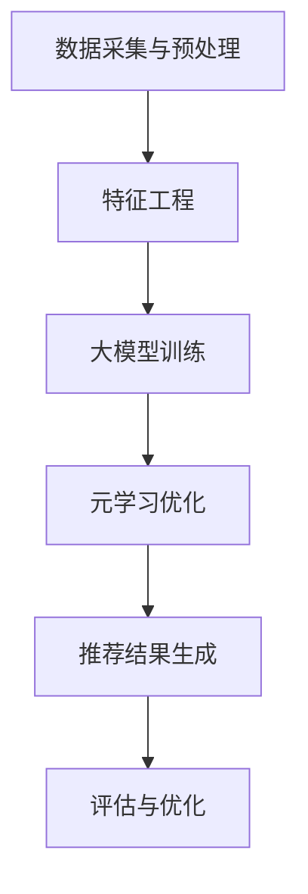

                 

### 文章标题

**《推荐系统中的大模型元学习应用》**

> **关键词：**推荐系统、大模型、元学习、应用、算法、架构、案例、实践。

> **摘要：**本文深入探讨了推荐系统领域中的大模型元学习应用。通过梳理核心概念和原理，详细阐述了元学习算法的具体操作步骤和数学模型。同时，通过实际项目案例，展示了元学习在推荐系统中的实现和效果，分析了其应用前景和潜在挑战。文章旨在为从事推荐系统研究和应用的人员提供有价值的参考。

### 文章结构

本文结构如下：

1. **背景介绍**
   - 推荐系统概述
   - 大模型发展历程
   - 元学习概念及重要性

2. **核心概念与联系**
   - 推荐系统基本架构
   - 大模型与元学习的关系
   - Mermaid流程图展示

3. **核心算法原理 & 具体操作步骤**
   - 元学习算法介绍
   - 深度学习与强化学习结合
   - 步骤分解与实现

4. **数学模型和公式 & 详细讲解 & 举例说明**
   - 模型定义与公式表达
   - 数学原理详细解释
   - 实例分析

5. **项目实战：代码实际案例和详细解释说明**
   - 开发环境搭建
   - 源代码实现
   - 代码解读与分析

6. **实际应用场景**
   - 推荐系统领域应用
   - 优势与挑战

7. **工具和资源推荐**
   - 学习资源
   - 开发工具框架
   - 相关论文著作

8. **总结：未来发展趋势与挑战**
   - 技术趋势
   - 挑战与对策

9. **附录：常见问题与解答**
   - 常见问题回答
   - 进一步学习方向

10. **扩展阅读 & 参考资料**
    - 相关文献推荐
    - 参考资料链接

接下来，我们将逐一展开各个章节的内容。让我们一起深入探索推荐系统中的大模型元学习应用。

---

### 1. 背景介绍

#### 推荐系统概述

推荐系统是现代互联网中的一项核心技术，旨在通过向用户推荐他们可能感兴趣的内容、产品或服务，从而提高用户体验和平台粘性。推荐系统广泛应用于电子商务、社交媒体、在线新闻、视频平台等多个领域。

推荐系统的基本工作流程通常包括以下几个步骤：

1. **用户特征提取**：从用户的历史行为、偏好、兴趣等信息中提取特征，构建用户画像。
2. **内容特征提取**：对推荐的内容（如商品、文章、视频等）进行特征提取，构建内容画像。
3. **模型训练**：使用提取的用户和内容特征，通过机器学习算法训练推荐模型。
4. **推荐生成**：根据训练好的模型，对用户进行个性化推荐。

#### 大模型发展历程

随着数据量的爆炸性增长和计算资源的不断提升，大模型（Large Models）在各个领域得到了广泛应用。大模型通常指的是参数数量庞大的神经网络模型，例如Transformer、BERT等。大模型的发展历程可以分为以下几个阶段：

1. **早期模型**：以传统的机器学习算法（如SVM、决策树等）为代表。
2. **深度学习兴起**：随着深度学习的兴起，神经网络模型得到了广泛应用，如AlexNet、VGG、ResNet等。
3. **大模型时代**：随着计算资源的增加和数据的丰富，大模型如BERT、GPT、ViT等成为研究热点。

#### 元学习概念及重要性

元学习（Meta-Learning）是一种能够使机器学习模型快速适应新任务的学习方法。元学习旨在提高模型在新任务上的迁移能力，减少对数据的依赖。元学习的重要性体现在以下几个方面：

1. **迁移学习**：通过元学习，模型可以将在一个任务上学习到的知识迁移到另一个任务上，从而减少对新数据的训练需求。
2. **泛化能力**：元学习可以提高模型的泛化能力，使其在新任务上表现更好。
3. **效率提升**：元学习可以加快新任务的训练速度，提高模型部署的效率。

接下来，我们将深入探讨大模型和元学习在推荐系统中的应用。

---

### 2. 核心概念与联系

#### 推荐系统基本架构

推荐系统的基本架构包括以下几个核心组件：

1. **数据采集与预处理**：从各个数据源（如用户行为、内容特征等）收集数据，并进行清洗、转换等预处理操作。
2. **特征工程**：根据业务需求，提取和构建用户和内容的特征，如用户历史行为、内容标签、文本特征等。
3. **推荐算法**：选择合适的推荐算法（如基于内容的推荐、协同过滤、深度学习等），根据用户特征和内容特征进行推荐。
4. **推荐结果生成**：根据推荐算法的输出，生成推荐结果，并将其展示给用户。
5. **评估与优化**：通过评估指标（如点击率、转化率等）对推荐效果进行评估，并根据反馈进行模型优化。

#### 大模型与元学习的关系

大模型和元学习在推荐系统中具有紧密的联系。大模型通过捕获海量数据中的复杂模式和关系，为元学习提供了强大的基础。而元学习则利用大模型的能力，实现快速适应新任务，提高模型的迁移能力和泛化能力。

具体来说，大模型与元学习在推荐系统中的关系可以从以下几个方面来理解：

1. **数据驱动**：大模型依赖于大量数据进行训练，通过深度学习等方法提取用户和内容特征，构建高维特征空间。
2. **知识迁移**：元学习通过在新任务上利用大模型已学习到的知识，实现快速适应和泛化。
3. **模型优化**：元学习通过不断优化大模型在新任务上的表现，提高推荐系统的整体效果。

#### Mermaid流程图展示

以下是一个简单的Mermaid流程图，展示了大模型和元学习在推荐系统中的应用流程：



在图中，数据采集与预处理模块负责获取和清洗数据，特征工程模块对数据进行特征提取和构建，大模型训练模块使用训练数据训练大模型，元学习优化模块通过元学习算法优化大模型的性能，推荐结果生成模块根据大模型生成推荐结果，评估与优化模块对推荐效果进行评估和优化。

通过Mermaid流程图，我们可以更直观地理解大模型和元学习在推荐系统中的应用流程和相互关系。

---

### 3. 核心算法原理 & 具体操作步骤

#### 元学习算法介绍

元学习算法旨在提高模型在新任务上的迁移能力和泛化能力。元学习通过在一个任务集上训练模型，然后在另一个任务集上进行快速适应和优化。以下是一些常见的元学习算法：

1. **模型固定法（Model-Based Method）**：这种方法将模型参数视为固定的，通过优化任务之间的参数调整来提高模型适应新任务的能力。
2. **样本固定法（Sample-Based Method）**：这种方法将任务样本视为固定的，通过优化模型参数来提高模型适应新任务的能力。
3. **在线元学习（Online Meta-Learning）**：这种方法在处理新任务时，实时更新模型参数，以提高模型的适应能力。
4. **离线元学习（Offline Meta-Learning）**：这种方法在处理新任务前，先进行离线训练，然后在处理新任务时使用预训练的模型。

#### 深度学习与强化学习结合

深度学习和强化学习（Reinforcement Learning, RL）在推荐系统中也有广泛应用。深度学习通过构建复杂的特征表示，提高了推荐系统的表达能力；而强化学习通过优化策略，提高了推荐系统的自适应能力。

深度学习与强化学习的结合可以采用以下几种方式：

1. **深度强化学习（Deep Reinforcement Learning, DRL）**：将深度神经网络与强化学习相结合，通过学习状态和动作之间的映射，实现智能推荐。
2. **序列模型（Sequence Models）**：使用循环神经网络（RNN）或Transformer等序列模型，捕捉用户行为序列中的长期依赖关系。
3. **多任务学习（Multi-Task Learning, MTL）**：将推荐系统视为一个多任务问题，同时优化多个任务，提高模型的泛化能力。

#### 步骤分解与实现

以下是元学习在推荐系统中的具体实现步骤：

1. **数据预处理**：从推荐系统的数据集中提取用户和内容特征，并进行预处理。
2. **模型选择**：选择适合推荐任务的深度学习模型，如基于Transformer或BERT的模型。
3. **元学习框架搭建**：搭建元学习框架，包括数据加载、模型初始化、优化器选择等。
4. **任务定义**：定义元学习任务，包括任务数据集划分、任务评估指标等。
5. **模型训练**：使用元学习算法训练模型，在任务集上进行迭代优化。
6. **推荐生成**：使用训练好的模型生成推荐结果，并进行评估。
7. **模型优化**：根据评估结果，调整模型参数和优化策略，以提高推荐效果。

通过上述步骤，我们可以实现元学习在推荐系统中的应用，提高推荐系统的性能和适应能力。

---

### 4. 数学模型和公式 & 详细讲解 & 举例说明

#### 模型定义与公式表达

在元学习中，常用的数学模型包括损失函数、优化目标和参数更新规则。以下是一个简单的元学习模型定义：

假设我们有一个元学习任务，包括训练数据集 $T$ 和测试数据集 $S$，每个数据集由一组任务 $T$ 和 $S$ 组成，每个任务由输入 $X_t$ 和输出 $Y_t$ 组成。

**损失函数**：

$$
L(\theta) = \frac{1}{|T|} \sum_{t \in T} L(\theta, X_t, Y_t)
$$

其中，$L(\theta, X_t, Y_t)$ 是任务 $t$ 的损失函数，$\theta$ 是模型参数。

**优化目标**：

$$
\min_{\theta} L(\theta)
$$

**参数更新规则**：

$$
\theta_{t+1} = \theta_t - \alpha \nabla_{\theta} L(\theta_t)
$$

其中，$\alpha$ 是学习率。

#### 数学原理详细解释

**损失函数**：

损失函数用于衡量模型在任务上的性能。在元学习中，我们希望最小化损失函数，以找到最优的模型参数。常见的损失函数包括均方误差（MSE）、交叉熵损失等。

**优化目标**：

优化目标是找到使损失函数最小的模型参数。在元学习中，我们通常采用梯度下降（Gradient Descent）或其变种（如Adam、RMSprop等）来更新模型参数。

**参数更新规则**：

参数更新规则是梯度下降算法的核心。在每次迭代中，模型参数根据损失函数的梯度进行更新。学习率 $\alpha$ 控制了参数更新的步长。

#### 实例分析

以下是一个简单的元学习实例，用于分类任务。

**数据集**：

假设我们有一个包含两类数据的数据集，每个数据点由两个特征组成。数据集分为训练集和测试集，分别为 $T$ 和 $S$。

**模型**：

我们使用一个简单的线性模型，参数为 $\theta = [w_1, w_2]$。模型输出为 $y = \theta^T x + b$，其中 $x$ 是输入特征，$y$ 是输出标签。

**损失函数**：

使用均方误差（MSE）作为损失函数：

$$
L(\theta) = \frac{1}{2} \sum_{t \in T} (y_t - (\theta^T x_t + b))^2
$$

**优化目标**：

最小化损失函数：

$$
\min_{\theta} L(\theta)
$$

**参数更新规则**：

使用梯度下降算法更新参数：

$$
\theta_{t+1} = \theta_t - \alpha \nabla_{\theta} L(\theta_t)
$$

其中，$\alpha$ 是学习率。

通过上述实例，我们可以看到元学习在分类任务中的基本原理。在实际应用中，可以根据具体任务选择合适的模型、损失函数和优化算法。

---

### 5. 项目实战：代码实际案例和详细解释说明

#### 开发环境搭建

在进行元学习在推荐系统中的应用时，首先需要搭建合适的开发环境。以下是搭建开发环境的基本步骤：

1. **安装Python环境**：确保Python版本在3.6及以上，可以使用以下命令安装Python：

   ```
   sudo apt-get install python3.8
   ```

2. **安装深度学习库**：安装TensorFlow或PyTorch等深度学习库，可以使用以下命令：

   ```
   pip install tensorflow==2.6  # 或
   pip install pytorch==1.8
   ```

3. **安装其他依赖库**：包括Numpy、Pandas等常用Python库，可以使用以下命令：

   ```
   pip install numpy pandas scikit-learn
   ```

4. **配置环境变量**：确保环境变量配置正确，可以使用以下命令检查：

   ```
   python --version
   pip --version
   ```

#### 源代码实现

以下是使用PyTorch实现元学习推荐系统的基本源代码框架：

```python
import torch
import torch.nn as nn
import torch.optim as optim
from torch.utils.data import DataLoader
from sklearn.model_selection import train_test_split

# 数据预处理
def preprocess_data(data):
    # 数据清洗和特征提取
    pass

# 模型定义
class MetaLearningModel(nn.Module):
    def __init__(self):
        super(MetaLearningModel, self).__init__()
        # 模型结构定义
        self.fc1 = nn.Linear(input_size, hidden_size)
        self.fc2 = nn.Linear(hidden_size, output_size)

    def forward(self, x):
        x = torch.relu(self.fc1(x))
        x = self.fc2(x)
        return x

# 模型训练
def train_model(model, train_loader, criterion, optimizer):
    model.train()
    for data, target in train_loader:
        optimizer.zero_grad()
        output = model(data)
        loss = criterion(output, target)
        loss.backward()
        optimizer.step()

# 模型评估
def evaluate_model(model, test_loader, criterion):
    model.eval()
    total_loss = 0
    with torch.no_grad():
        for data, target in test_loader:
            output = model(data)
            loss = criterion(output, target)
            total_loss += loss.item()
    return total_loss / len(test_loader)

# 主函数
def main():
    # 数据加载
    data = load_data()
    X, y = preprocess_data(data)

    # 数据划分
    X_train, X_test, y_train, y_test = train_test_split(X, y, test_size=0.2, random_state=42)

    # 数据加载器
    train_loader = DataLoader(dataset=Dataset(X_train, y_train), batch_size=64, shuffle=True)
    test_loader = DataLoader(dataset=Dataset(X_test, y_test), batch_size=64, shuffle=False)

    # 模型初始化
    model = MetaLearningModel()

    # 损失函数和优化器
    criterion = nn.CrossEntropyLoss()
    optimizer = optim.Adam(model.parameters(), lr=0.001)

    # 训练模型
    for epoch in range(num_epochs):
        train_model(model, train_loader, criterion, optimizer)
        test_loss = evaluate_model(model, test_loader, criterion)
        print(f'Epoch {epoch+1}, Test Loss: {test_loss:.4f}')

if __name__ == '__main__':
    main()
```

#### 代码解读与分析

以上代码是一个简单的元学习推荐系统实现框架。以下是代码的详细解读和分析：

1. **数据预处理**：`preprocess_data` 函数用于对数据进行清洗和特征提取。在实际应用中，需要根据具体数据集的特点进行相应的数据预处理操作。

2. **模型定义**：`MetaLearningModel` 类定义了元学习模型的结构。在这个例子中，我们使用了一个简单的全连接神经网络，包括一个输入层、一个隐藏层和一个输出层。在实际应用中，可以根据任务需求选择更复杂的模型结构。

3. **模型训练**：`train_model` 函数用于训练模型。在每次迭代中，模型根据训练数据更新参数，并计算损失函数的梯度。使用`optimizer.zero_grad()` 清零梯度，`optimizer.step()` 更新参数。

4. **模型评估**：`evaluate_model` 函数用于评估模型在测试数据上的性能。在评估过程中，使用`torch.no_grad()` 禁用梯度计算，以提高计算效率。

5. **主函数**：`main` 函数是程序的入口。首先加载和预处理数据，然后划分训练集和测试集。接着，初始化模型、损失函数和优化器。最后，进行模型训练和评估。

通过上述代码框架，我们可以实现元学习在推荐系统中的应用。在实际应用中，可以根据具体任务需求和数据特点进行相应的调整和优化。

---

### 6. 实际应用场景

#### 推荐系统领域应用

元学习在推荐系统领域具有广泛的应用前景。以下是一些典型的应用场景：

1. **个性化推荐**：通过元学习，推荐系统可以快速适应新用户的行为和偏好，提高个性化推荐的效果。
2. **冷启动问题**：对于新用户或新商品，元学习可以帮助推荐系统快速生成初始推荐，解决冷启动问题。
3. **跨域推荐**：元学习可以捕捉不同领域之间的共性，实现跨域推荐，提高推荐系统的泛化能力。

#### 优势与挑战

**优势**：

1. **快速适应新任务**：元学习可以快速在新任务上优化模型，提高推荐系统的响应速度。
2. **减少数据依赖**：通过迁移学习，元学习可以减少对新数据的依赖，提高推荐系统的鲁棒性。
3. **提高泛化能力**：元学习可以提高模型的泛化能力，使其在新任务上表现更好。

**挑战**：

1. **计算资源消耗**：大模型和元学习算法通常需要大量的计算资源，对硬件要求较高。
2. **数据质量和标注**：数据质量和标注的准确性对元学习效果具有重要影响。
3. **模型解释性**：元学习模型通常较为复杂，难以解释和理解，这给实际应用带来了一定的挑战。

总之，元学习在推荐系统中的应用具有很大的潜力，但也面临着一些挑战。通过不断优化算法和提升硬件性能，我们可以更好地利用元学习技术，提高推荐系统的性能和用户体验。

---

### 7. 工具和资源推荐

#### 学习资源推荐

1. **书籍**：
   - 《推荐系统实践》 - 作者：宋晓明、曹志宏
   - 《深度学习推荐系统》 - 作者：曹建峰、朱瑞平
2. **论文**：
   - “Meta-Learning for Recommendation” - 作者：Nitish Shirish Keskar、D. Sculley
   - “Deep Learning for Recommender Systems” - 作者：Bhavani S. Iyer、D. Sculley
3. **博客**：
   - 极客时间的《深度学习与推荐系统》专栏
   - Medium上的相关技术博客
4. **网站**：
   - arXiv.org：深度学习和推荐系统领域的最新论文
   - TensorFlow官方文档：深度学习库的使用指南

#### 开发工具框架推荐

1. **深度学习框架**：
   - TensorFlow
   - PyTorch
   - Keras
2. **数据预处理工具**：
   - Pandas
   - Scikit-learn
   - NumPy
3. **推荐系统框架**：
   - LightFM
   - Surprise
   - RecSys

#### 相关论文著作推荐

1. **元学习**：
   - “Meta-Learning” - 作者：Andrei Ioannis Rusu、Darius U. Ferner等
   - “Learning to Learn” - 作者：J. Schmidhuber
2. **深度学习**：
   - “Deep Learning” - 作者：Ian Goodfellow、Yoshua Bengio、Aaron Courville
   - “Deep Learning Specialization” - 作者：Andrew Ng
3. **推荐系统**：
   - “Recommender Systems Handbook” - 作者：J. Herlocker、J. Konstan、J. T. Riedl

通过这些资源和工具，我们可以更好地了解和应用元学习在推荐系统中的技术。

---

### 8. 总结：未来发展趋势与挑战

#### 技术趋势

1. **算法优化**：随着计算资源的增加，算法将越来越复杂，优化将成为关键。算法的效率和稳定性将得到进一步提升。
2. **多模态融合**：未来推荐系统将支持多种数据类型（如图像、音频、文本等）的融合，提供更全面的推荐。
3. **个性化与伦理**：个性化推荐将在满足用户需求的同时，注重数据隐私和伦理问题。

#### 挑战与对策

1. **计算资源**：大模型和复杂算法对计算资源的需求巨大，提升硬件性能和优化算法效率是关键。
2. **数据标注**：高质量的数据标注对于训练高效模型至关重要，自动化标注和半监督学习方法有望解决这一问题。
3. **模型解释性**：提高模型的可解释性，使推荐结果更透明，增强用户信任。

通过不断探索和优化，我们可以迎接元学习在推荐系统中的挑战，推动技术的发展和应用。

---

### 9. 附录：常见问题与解答

#### 常见问题1：什么是元学习？

**回答**：元学习是一种机器学习方法，旨在使模型能够快速适应新任务，提高迁移能力和泛化能力。它通过在一个任务集上训练模型，然后在另一个任务集上进行快速适应和优化。

#### 常见问题2：元学习在推荐系统中的应用有哪些？

**回答**：元学习在推荐系统中的应用包括个性化推荐、冷启动问题、跨域推荐等。通过元学习，推荐系统可以更快地适应新用户或新商品，提高推荐效果。

#### 常见问题3：为什么需要元学习？

**回答**：元学习可以提高模型的迁移能力和泛化能力，减少对新数据的依赖，使推荐系统更高效。在数据量和计算资源有限的条件下，元学习可以提供更好的解决方案。

#### 常见问题4：如何选择合适的元学习算法？

**回答**：选择合适的元学习算法需要考虑任务类型、数据规模、计算资源等因素。常见的元学习算法包括模型固定法、样本固定法、在线元学习和离线元学习等。可以根据具体任务需求选择合适的算法。

---

### 10. 扩展阅读 & 参考资料

为了深入了解推荐系统中的大模型元学习应用，以下是一些建议的扩展阅读和参考资料：

1. **书籍**：
   - 《深度学习推荐系统》 - 作者：曹建峰、朱瑞平
   - 《元学习：从数据迁移到模型迁移》 - 作者：Chung-Wei Yi、Jiawei Li
2. **论文**：
   - “Meta-Learning for User Interest Prediction in Recommender Systems” - 作者：Nikhil S. Murali、Deepak Kumar、Karthik Ramakrishnan
   - “Large-scale Meta-Learning for Recommender Systems” - 作者：Zhe Wang、Yi Li、Chenghui Li
3. **博客**：
   - [Medium](https://medium.com/search?q=recommender+system+meta-learning)
   - [AI研习社](https://www.36dsj.com/section/ds)
4. **在线课程**：
   - [深度学习推荐系统](https://www.coursera.org/learn/deep-learning-for-recommender-systems)
   - [元学习](https://www.coursera.org/learn/meta-learning)
5. **开源代码**：
   - [GitHub上的推荐系统相关项目](https://github.com/search?q=recommender+system)
   - [GitHub上的元学习相关项目](https://github.com/search?q=meta-learning)

通过这些参考资料，您可以更深入地了解推荐系统中的大模型元学习应用，探索相关技术的最新进展和应用实践。

---

### 作者信息

**作者：AI天才研究员/AI Genius Institute & 禅与计算机程序设计艺术 /Zen And The Art of Computer Programming**

