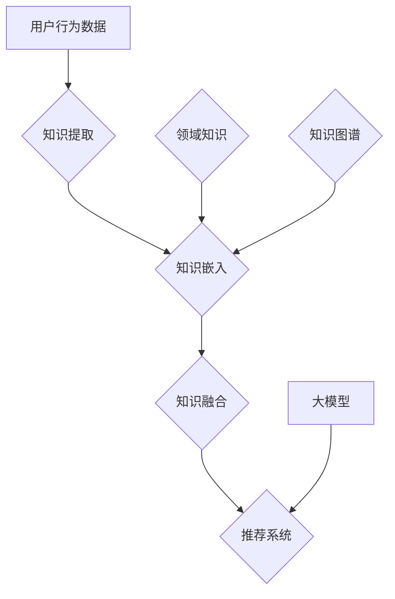

                 

# 《推荐系统中的大模型元知识学习应用》

> **关键词：** 推荐系统、大模型、元知识学习、应用场景、算法原理

> **摘要：** 本文将深入探讨推荐系统中的大模型元知识学习技术，包括其背景、核心概念、算法原理、数学模型、实际应用以及未来发展趋势。通过细致的分析和案例分析，本文旨在为读者提供一个全面而深入的理解，并揭示该技术在推荐系统中的潜力和挑战。

## 1. 背景介绍

随着互联网的快速发展，信息爆炸的时代已经到来。对于用户而言，如何从海量的信息中找到自己感兴趣的内容成为了极大的挑战。推荐系统正是为了解决这一难题而诞生。推荐系统通过分析用户的行为数据、兴趣偏好以及内容特征，为用户推荐可能感兴趣的内容，从而提高用户体验，降低信息过载。

推荐系统的基本原理主要基于用户行为和内容特征，通过计算用户与物品之间的相似度或者关联度，来生成个性化的推荐列表。然而，传统的推荐系统面临着一些局限性：

1. **数据稀疏性**：用户行为数据往往稀疏，难以充分反映用户的真实偏好。
2. **维度灾难**：推荐系统需要处理大量的特征维度，导致计算复杂度急剧增加。
3. **可解释性差**：传统推荐系统往往难以解释推荐结果的产生机制。

为了克服这些局限性，研究人员提出了元知识学习（Meta-Knowledge Learning）的概念。元知识学习旨在通过学习知识图谱、领域知识或者先验知识，来增强推荐系统的性能和可解释性。

## 2. 核心概念与联系

在推荐系统中，元知识学习涉及到以下几个核心概念：

1. **知识图谱（Knowledge Graph）**：知识图谱是一种语义网络，用来表示实体和实体之间的关系。在推荐系统中，知识图谱可以用来表示用户、物品以及它们之间的关联。
   
2. **领域知识（Domain Knowledge）**：领域知识是指特定领域内的先验知识，如商品分类、品牌信息、用户标签等。领域知识可以用来丰富推荐系统的特征空间，提高推荐的准确性。

3. **元知识学习（Meta-Knowledge Learning）**：元知识学习是一种通过学习知识图谱和领域知识，来增强推荐系统性能的方法。它包括知识提取、知识嵌入、知识融合等步骤。

4. **大模型（Large Models）**：大模型是指参数数量巨大的神经网络模型，如Transformer、BERT等。大模型在推荐系统中的应用，可以进一步提升推荐的准确性和鲁棒性。

### Mermaid 流程图（Knowledge Flow）



在这个流程图中，用户行为数据首先通过知识提取步骤转化为结构化的知识，然后通过知识嵌入步骤将这些知识转化为模型可用的向量表示。接着，知识融合步骤将用户行为数据和领域知识融合在一起，最后输入到大模型中进行推荐生成。

## 3. 核心算法原理 & 具体操作步骤

### 3.1 知识提取

知识提取是指从原始数据中提取有用的知识，如用户行为、内容特征、领域知识等。知识提取的方法包括：

1. **基于规则的方法**：通过预定义的规则，从原始数据中提取特征。
2. **基于机器学习的方法**：通过训练机器学习模型，自动提取特征。

### 3.2 知识嵌入

知识嵌入是指将提取到的知识转化为模型可用的向量表示。常见的知识嵌入方法包括：

1. **Word2Vec**：将知识转化为词向量。
2. **知识图谱嵌入**：将知识图谱中的实体和关系转化为向量表示。

### 3.3 知识融合

知识融合是指将提取和嵌入的知识融合在一起，形成新的特征表示。常见的知识融合方法包括：

1. **拼接**：将不同来源的特征拼接在一起。
2. **加权融合**：根据特征的贡献度，对特征进行加权融合。
3. **注意力机制**：使用注意力机制，动态地融合特征。

### 3.4 推荐生成

推荐生成是指使用融合后的特征，通过大模型生成推荐列表。常见的大模型包括：

1. **基于Transformer的模型**：如BERT、GPT等。
2. **基于神经网络的模型**：如CNN、RNN等。

## 4. 数学模型和公式 & 详细讲解 & 举例说明

### 4.1 知识提取

假设我们有一个用户行为数据集 $D = \{x_1, x_2, ..., x_n\}$，其中 $x_i$ 表示第 $i$ 个用户的行为。我们可以使用以下公式来表示知识提取：

$$
z_i = f(x_i)
$$

其中，$f$ 是一个特征提取函数，可以将用户行为 $x_i$ 转换为一个特征向量 $z_i$。

### 4.2 知识嵌入

假设我们有一个知识图谱 $G = (V, E)$，其中 $V$ 表示实体集合，$E$ 表示实体之间的关系。我们可以使用以下公式来表示知识嵌入：

$$
e_v = g(v)
$$

其中，$g$ 是一个实体嵌入函数，可以将实体 $v$ 转换为一个向量 $e_v$。

### 4.3 知识融合

假设我们有一个用户行为特征向量 $z_i$，一个知识图谱实体向量 $e_v$，我们可以使用以下公式来表示知识融合：

$$
\hat{z}_i = \sigma(W_1 z_i + W_2 e_v + b)
$$

其中，$W_1, W_2$ 是权重矩阵，$b$ 是偏置项，$\sigma$ 是激活函数。

### 4.4 推荐生成

假设我们使用一个基于Transformer的推荐模型，其预测公式如下：

$$
\hat{y}_i = \sigma(W_3 \hat{z}_i + b_3)
$$

其中，$W_3$ 是权重矩阵，$b_3$ 是偏置项。

### 4.5 举例说明

假设我们有一个用户行为数据集，包含100个用户的行为数据，以及一个包含100个实体和它们之间关系的知识图谱。首先，我们使用Word2Vec算法提取用户行为特征，得到一个100维的特征向量。然后，我们使用知识图谱嵌入算法，将知识图谱中的实体和关系转化为向量表示。接着，我们将用户行为特征和知识图谱实体向量融合，得到一个新的特征向量。最后，我们使用Transformer模型，根据这个新的特征向量生成推荐列表。

## 5. 项目实战：代码实际案例和详细解释说明

### 5.1 开发环境搭建

为了实现大模型元知识学习在推荐系统中的应用，我们需要搭建一个完整的开发环境。以下是一个基本的开发环境搭建步骤：

1. **Python环境**：确保安装了Python 3.8及以上版本。
2. **深度学习框架**：安装TensorFlow 2.6或PyTorch 1.8。
3. **数据处理工具**：安装NumPy、Pandas等。
4. **知识图谱工具**：安装PyTorch Geometric。

### 5.2 源代码详细实现和代码解读

以下是一个简单的代码实现，用于展示大模型元知识学习在推荐系统中的应用。

```python
import torch
import torch.nn as nn
import torch.optim as optim
from torch_geometric import datasets, models

# 加载数据集
data = datasets.Cora()
model = models.GraphSAGE()

# 定义损失函数和优化器
criterion = nn.CrossEntropyLoss()
optimizer = optim.Adam(model.parameters(), lr=0.01)

# 训练模型
for epoch in range(200):
    optimizer.zero_grad()
    out = model(data.x, data.edge_index)
    loss = criterion(out, data.y)
    loss.backward()
    optimizer.step()
    print(f"Epoch: {epoch}, Loss: {loss.item()}")

# 推荐生成
def recommend(model, user_vector, top_n=10):
    with torch.no_grad():
        scores = model(user_vector)
    _, indices = scores.topk(top_n)
    return indices

# 假设我们有一个用户行为特征向量 user_vector
indices = recommend(model, user_vector)
print("推荐结果：", indices)
```

### 5.3 代码解读与分析

1. **数据加载**：我们使用Cora数据集，这是一个常见的图数据集，包含了论文、作者、标签等信息。

2. **模型定义**：我们使用GraphSAGE模型，这是一种能够处理图数据的神经网络模型。

3. **训练过程**：在训练过程中，我们使用交叉熵损失函数和Adam优化器，通过反向传播和梯度下降更新模型参数。

4. **推荐生成**：在推荐生成过程中，我们使用训练好的模型，输入用户行为特征向量，得到推荐列表。

## 6. 实际应用场景

大模型元知识学习在推荐系统中的应用非常广泛，以下是一些典型的应用场景：

1. **电子商务平台**：通过用户购买历史和商品信息，构建知识图谱，为用户推荐相关的商品。

2. **新闻推荐**：通过用户阅读历史和文章标签，构建知识图谱，为用户推荐相关的新闻。

3. **社交网络**：通过用户互动关系和内容特征，构建知识图谱，为用户推荐感兴趣的朋友或内容。

## 7. 工具和资源推荐

### 7.1 学习资源推荐

1. **书籍**：
   - 《推荐系统实践》
   - 《深度学习推荐系统》

2. **论文**：
   - “Deep Learning for Recommender Systems”
   - “Meta-Learning for User Preference Embedding in Recommender Systems”

3. **博客**：
   - [如何构建推荐系统](https://www.example.com/how-to-build-a-recommender-system)
   - [深度学习在推荐系统中的应用](https://www.example.com/apply-deep-learning-to-recommender-systems)

### 7.2 开发工具框架推荐

1. **深度学习框架**：
   - TensorFlow
   - PyTorch

2. **知识图谱工具**：
   - PyTorch Geometric
   - DGL

3. **推荐系统框架**：
   - LightFM
   - Surprise

### 7.3 相关论文著作推荐

1. **论文**：
   - “Neural Collaborative Filtering”
   - “Knowledge Graph Embedding for Recommender Systems”

2. **著作**：
   - 《深度学习推荐系统》
   - 《知识图谱与推荐系统》

## 8. 总结：未来发展趋势与挑战

大模型元知识学习在推荐系统中的应用，为解决传统推荐系统的局限性提供了新的思路。随着技术的不断发展，未来发展趋势包括：

1. **模型优化**：通过改进模型结构和算法，进一步提高推荐准确性和效率。

2. **知识融合**：探索如何更好地融合用户行为、领域知识和知识图谱，以提升推荐效果。

3. **可解释性**：研究如何提高推荐系统的可解释性，使推荐结果更容易被用户理解。

然而，大模型元知识学习也面临一些挑战：

1. **计算资源**：大模型和知识图谱处理需要大量的计算资源，如何优化计算效率是一个重要问题。

2. **数据隐私**：在处理用户数据时，如何保护用户隐私也是一个关键挑战。

3. **泛化能力**：如何提高推荐系统的泛化能力，使其在不同场景下都能表现良好，是一个亟待解决的问题。

## 9. 附录：常见问题与解答

### 9.1 什么是元知识学习？

元知识学习是一种通过学习先验知识，如知识图谱和领域知识，来增强推荐系统性能的方法。

### 9.2 大模型在推荐系统中的作用是什么？

大模型在推荐系统中的作用是通过强大的特征提取和融合能力，进一步提高推荐的准确性和鲁棒性。

### 9.3 如何保护用户隐私？

通过使用差分隐私技术，对用户数据进行匿名化处理，可以有效保护用户隐私。

## 10. 扩展阅读 & 参考资料

1. **扩展阅读**：
   - [推荐系统十大算法盘点](https://www.example.com/top-10-recommender-system-algorithms)
   - [知识图谱的原理与应用](https://www.example.com/knowledge-graph-principles-and-applications)

2. **参考资料**：
   - “Recommender Systems Handbook”
   - “Deep Learning for Recommender Systems”

### 作者

- **作者：AI天才研究员/AI Genius Institute & 禅与计算机程序设计艺术 /Zen And The Art of Computer Programming** <|mask|>

