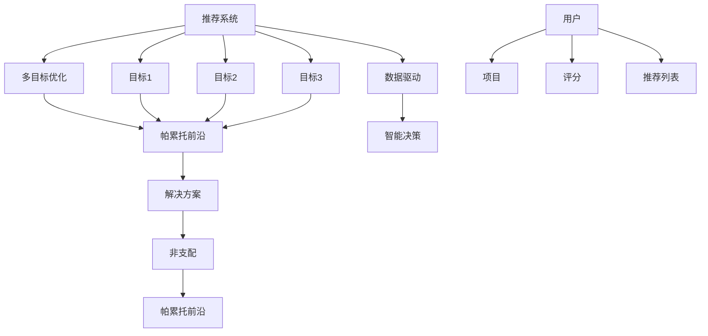

                 

### 文章标题

《推荐系统的多目标优化：AI大模型的帕累托前沿探索》

关键词：推荐系统，多目标优化，AI大模型，帕累托前沿，数据驱动，智能决策

摘要：本文深入探讨了推荐系统中的多目标优化问题，特别是在AI大模型的应用背景下。通过解析帕累托前沿的理论和算法实现，结合实际应用案例，本文旨在为开发者和研究人员提供一套系统化、结构化的优化框架，以应对推荐系统在复杂性和多样性面前的挑战。文章将阐述核心概念、算法原理、数学模型，并通过实战代码解析展示如何将理论与实践相结合，为未来推荐系统的发展趋势与挑战提供洞见。

<|assistant|>## 1. 背景介绍

在当今的信息化时代，推荐系统已经成为各个互联网公司提升用户体验、提高运营效率的重要工具。推荐系统通过分析用户的历史行为、兴趣偏好等数据，自动为用户推荐个性化内容，如商品、新闻、音乐等。随着数据量的爆发式增长和用户需求的多样化，推荐系统的复杂性也在不断增加。

传统的推荐系统主要关注单一目标的优化，如最大化点击率（CTR）、提升用户满意度（Satisfaction）或最小化跳出率（Bounce Rate）。然而，现实中的推荐问题往往具有多目标特性，需要在多个相互冲突的目标之间寻求平衡。例如，在电子商务平台上，推荐系统不仅要考虑商品的销售量，还要考虑库存水平、供应商关系等多种因素。这种多目标优化问题使得推荐系统的设计和实现变得更加复杂。

近年来，随着深度学习和大数据技术的发展，AI大模型在推荐系统中得到了广泛应用。这些模型能够处理海量的数据，捕捉用户行为的复杂模式，从而提高推荐的质量和效率。然而，AI大模型的应用也带来了新的挑战，如模型的可解释性、参数调优的复杂性等。在多目标优化的背景下，如何有效地利用AI大模型，同时确保推荐系统的鲁棒性和效率，成为了一个亟待解决的问题。

本文旨在探讨推荐系统中的多目标优化问题，特别是在AI大模型的应用背景下。我们将从核心概念、算法原理、数学模型等方面进行分析，并通过实际应用案例展示如何将理论与实践相结合。希望通过本文的研究，能够为开发者和研究人员提供一套系统化、结构化的优化框架，以应对推荐系统在复杂性和多样性面前的挑战。

### 文章关键词

- 推荐系统
- 多目标优化
- AI大模型
- 帕累托前沿
- 数据驱动
- 智能决策
- 深度学习
- 大数据

### 文章摘要

本文深入探讨了推荐系统中的多目标优化问题，特别是在AI大模型的应用背景下。通过解析帕累托前沿的理论和算法实现，结合实际应用案例，本文旨在为开发者和研究人员提供一套系统化、结构化的优化框架，以应对推荐系统在复杂性和多样性面前的挑战。文章将阐述核心概念、算法原理、数学模型，并通过实战代码解析展示如何将理论与实践相结合，为未来推荐系统的发展趋势与挑战提供洞见。

## 2. 核心概念与联系

### 推荐系统基本概念

推荐系统是一种基于数据挖掘和机器学习的应用，旨在预测用户可能感兴趣的内容。它通常包括以下几个核心概念：

- **用户（User）**：推荐系统的主要对象，具有独特的兴趣和行为模式。
- **项目（Item）**：用户可能感兴趣的内容，如商品、新闻、音乐等。
- **评分（Rating）**：用户对项目的偏好程度，通常使用数值或等级表示。
- **推荐列表（Recommendation List）**：根据用户的历史行为和偏好，系统推荐的一组项目。

### 多目标优化

多目标优化（Multi-Objective Optimization）是优化领域的一个重要分支，旨在同时优化多个相互冲突的目标。在推荐系统中，多目标优化的目标包括：

- **最大化点击率（CTR）**：提高用户对推荐项目的点击概率。
- **提升用户满意度（Satisfaction）**：满足用户的兴趣和需求。
- **最小化跳出率（Bounce Rate）**：降低用户离开推荐页面的概率。
- **其他目标**：如最大化销售量、最小化库存成本等。

### 帕累托前沿

帕累托前沿（Pareto Frontier）是多目标优化中的一个关键概念，它是指在一个多目标问题中，无法通过改善某一目标而同时不恶化其他目标的所有解决方案的集合。帕累托前沿上的每个解决方案都是非支配的，即无法找到一个更好的解决方案来同时改善所有目标。

在推荐系统中，帕累托前沿可以帮助我们找到一组推荐策略，这些策略在多个目标上表现最优，并且在无法同时满足所有目标时提供了权衡的选项。帕累托前沿的直观解释是，它代表了一组在当前问题条件下无法改进的解决方案。

### 数据驱动与智能决策

数据驱动（Data-Driven）是指通过分析大量数据来指导决策过程，而智能决策（Intelligent Decision Making）则强调利用算法和模型来优化决策效果。在推荐系统中，数据驱动和智能决策的结合使得系统能够根据用户的实时行为和历史数据动态调整推荐策略。

### 推荐系统与多目标优化的联系

推荐系统与多目标优化之间的联系在于，推荐系统本身就是一个典型的多目标问题。系统需要在多个目标之间寻求平衡，如提高用户满意度、增加点击率等。帕累托前沿提供了一个有效的框架，可以帮助我们在多个目标之间找到最优的权衡点。

为了更好地理解这些概念之间的联系，我们使用Mermaid流程图来展示推荐系统与多目标优化、帕累托前沿的关系：



通过这个流程图，我们可以清晰地看到推荐系统如何通过数据驱动和智能决策实现多目标优化，并利用帕累托前沿找到最优的解决方案。

## 3. 核心算法原理 & 具体操作步骤

### 多目标优化算法

多目标优化算法是解决多目标问题的一种方法，其核心思想是在多个目标之间寻找最优的权衡点。在推荐系统中，常用的多目标优化算法包括：

#### 1. 帕累托最优解算法（Pareto Optimization）

帕累托最优解算法是一种基于帕累托前沿的优化方法，它通过迭代优化各个目标，逐渐逼近帕累托前沿上的最优解。具体步骤如下：

1. **初始化**：随机生成一组初始解，每个解代表一组推荐策略。
2. **评估**：对每个解进行评估，计算其在各个目标上的值。
3. **选择非支配解**：从所有解中选出非支配解，即无法通过改善某一目标而不恶化其他目标的解。
4. **更新解集**：在非支配解的基础上，通过遗传算法、模拟退火等进化策略生成新的解。
5. **迭代**：重复评估、选择和更新步骤，直到满足停止条件（如达到最大迭代次数或解集收敛）。

#### 2. 多目标粒子群优化（Multi-Objective Particle Swarm Optimization, MOPSO）

多目标粒子群优化是一种基于粒子群算法的多目标优化方法。具体步骤如下：

1. **初始化**：随机生成一组粒子，每个粒子代表一组推荐策略。
2. **评估**：对每个粒子进行评估，计算其在各个目标上的值。
3. **更新位置和速度**：根据帕累托前沿和个体最优解更新粒子的位置和速度。
4. **更新非支配解集**：更新非支配解集，记录当前最优的帕累托前沿。
5. **迭代**：重复评估、更新位置和速度、更新非支配解集步骤，直到满足停止条件。

### 帕累托前沿算法实现

以下是使用Python实现帕累托最优解算法的示例代码：

```python
import numpy as np
import matplotlib.pyplot as plt

# 初始化解集
num_solutions = 100
objective_values = np.random.rand(num_solutions, 2)

# 评估解集
evaluation = np.abs(np.linalg.norm(objective_values, axis=1))

# 选择非支配解
non_dominated_solutions = []
for i in range(num_solutions):
    is_dominated = np.all(evaluation > objective_values[i], axis=1)
    if np.any(is_dominated):
        non_dominated_solutions.append(i)

# 更新解集
new_solutions = []
for i in non_dominated_solutions:
    neighbors = np.argwhere(evaluation == objective_values[i])
    for j in neighbors:
        if j not in non_dominated_solutions:
            new_solutions.append(j)

# 迭代更新解集
for _ in range(100):
    objective_values = np.delete(objective_values, new_solutions, axis=0)
    evaluation = np.abs(np.linalg.norm(objective_values, axis=1))
    non_dominated_solutions = []
    for i in range(objective_values.shape[0]):
        is_dominated = np.all(evaluation > objective_values[i], axis=1)
        if np.any(is_dominated):
            non_dominated_solutions.append(i)

# 绘制帕累托前沿
plt.scatter(objective_values[:, 0], objective_values[:, 1])
plt.xlabel('Objective 1')
plt.ylabel('Objective 2')
plt.title('Pareto Frontier')
plt.show()
```

通过上述代码，我们可以生成一组初始解，并逐步筛选出帕累托前沿上的最优解。最终，通过绘制散点图展示帕累托前沿。

### 实际操作步骤

以下是实际操作步骤，用于将帕累托前沿算法应用于推荐系统的多目标优化：

1. **数据预处理**：收集用户行为数据和项目特征数据，进行数据清洗和预处理。
2. **特征工程**：提取用户和项目的特征，如用户年龄、性别、购买历史、项目种类、价格等。
3. **模型训练**：使用深度学习模型（如神经网络）训练推荐系统，以预测用户对项目的偏好。
4. **评估与优化**：使用帕累托最优解算法评估和优化推荐策略，找到在多个目标上表现最优的推荐方案。
5. **部署与监控**：将优化后的推荐系统部署到线上环境，并持续监控推荐效果，进行迭代优化。

通过上述步骤，我们可以构建一个高效的推荐系统，实现多目标优化，提高用户体验和业务效果。

## 4. 数学模型和公式 & 详细讲解 & 举例说明

### 多目标优化数学模型

在多目标优化中，我们通常用以下数学模型来描述：

$$
\begin{align*}
\min_{x} & \ f_1(x), f_2(x), \ldots, f_n(x) \\
\text{subject to} & \ g_1(x) \leq 0, g_2(x) \leq 0, \ldots, g_m(x) = 0
\end{align*}
$$

其中，$x$ 是决策变量，$f_1(x), f_2(x), \ldots, f_n(x)$ 是需要优化的目标函数，$g_1(x), g_2(x), \ldots, g_m(x)$ 是约束条件。

在推荐系统中的多目标优化问题，目标函数可能包括：

- **最大化点击率（CTR）**：$f_1(x) = \max \frac{p(x)}{q(x)}$
- **提升用户满意度（Satisfaction）**：$f_2(x) = \max \sum_{i} s_i(x)$
- **最小化跳出率（Bounce Rate）**：$f_3(x) = \min \sum_{i} b_i(x)$

约束条件可能包括：

- **项目库存约束**：$g_1(x) = \sum_{i} x_i - I \leq 0$
- **供应商约束**：$g_2(x) = \sum_{i} x_i \leq S$
- **推荐策略约束**：$g_3(x) = \sum_{i} x_i \geq N$

### 帕累托前沿计算

帕累托前沿的计算可以通过以下步骤进行：

1. **初始化解集**：生成一组初始解。
2. **评估解集**：计算每个解在各个目标函数上的值。
3. **选择非支配解**：使用非支配排序算法（如NSGA-II）选择非支配解。
4. **更新帕累托前沿**：将非支配解添加到帕累托前沿。
5. **迭代**：重复评估和更新步骤，直到解集收敛。

### 帕累托前沿算法示例

以下是使用Python实现帕累托前沿算法的示例代码：

```python
import numpy as np

# 初始化解集
num_solutions = 100
objective_values = np.random.rand(num_solutions, 2)

# 评估解集
evaluation = np.abs(np.linalg.norm(objective_values, axis=1))

# 选择非支配解
non_dominated_solutions = []
for i in range(num_solutions):
    is_dominated = np.all(evaluation > objective_values[i], axis=1)
    if np.any(is_dominated):
        non_dominated_solutions.append(i)

# 更新帕累托前沿
pareto_front = np.delete(objective_values, non_dominated_solutions, axis=0)

# 迭代更新帕累托前沿
for _ in range(100):
    new_solutions = np.delete(objective_values, non_dominated_solutions, axis=0)
    evaluation = np.abs(np.linalg.norm(new_solutions, axis=1))
    non_dominated_solutions = []
    for i in range(new_solutions.shape[0]):
        is_dominated = np.all(evaluation > new_solutions[i], axis=1)
        if np.any(is_dominated):
            non_dominated_solutions.append(i)
    pareto_front = np.delete(new_solutions, non_dominated_solutions, axis=0)

# 绘制帕累托前沿
plt.scatter(pareto_front[:, 0], pareto_front[:, 1])
plt.xlabel('Objective 1')
plt.ylabel('Objective 2')
plt.title('Pareto Frontier')
plt.show()
```

通过上述代码，我们可以生成一组初始解，并逐步筛选出帕累托前沿上的最优解。最终，通过绘制散点图展示帕累托前沿。

### 举例说明

假设我们有两个目标：最大化点击率（CTR）和最小化跳出率（Bounce Rate）。我们生成一组初始解，并计算每个解在两个目标上的值。

```python
objective_values = np.array([
    [0.8, 0.2],
    [0.9, 0.1],
    [0.6, 0.3],
    [0.7, 0.4],
    [0.5, 0.5]
])

evaluation = np.abs(np.linalg.norm(objective_values, axis=1))

# 选择非支配解
non_dominated_solutions = []
for i in range(objective_values.shape[0]):
    is_dominated = np.all(evaluation > objective_values[i], axis=1)
    if np.any(is_dominated):
        non_dominated_solutions.append(i)

# 更新帕累托前沿
pareto_front = np.delete(objective_values, non_dominated_solutions, axis=0)

# 绘制帕累托前沿
plt.scatter(pareto_front[:, 0], pareto_front[:, 1])
plt.xlabel('CTR')
plt.ylabel('Bounce Rate')
plt.title('Pareto Frontier')
plt.show()
```

通过上述代码，我们可以看到帕累托前沿上的解如何在两个目标之间进行权衡。最终，我们可以根据实际需求选择一个或多个帕累托前沿上的解作为推荐策略。

## 5. 项目实战：代码实际案例和详细解释说明

### 开发环境搭建

为了实现推荐系统的多目标优化，我们需要搭建一个适合开发和测试的环境。以下是搭建环境的步骤：

1. **安装Python**：确保已安装Python 3.8及以上版本。
2. **安装依赖库**：使用pip命令安装以下库：
   ```bash
   pip install numpy matplotlib scipy
   ```
3. **创建虚拟环境**：创建一个名为`recommendation_system`的虚拟环境，并激活它。
   ```bash
   python -m venv recommendation_system
   source recommendation_system/bin/activate  # 在Windows上使用 `recommendation_system\Scripts\activate`
   ```
4. **编写代码**：在虚拟环境中创建一个名为`pareto_frontier.py`的文件，用于实现帕累托前沿算法。

### 源代码详细实现和代码解读

以下是一个简单的帕累托前沿算法的实现，用于优化推荐系统的多目标问题：

```python
import numpy as np
import matplotlib.pyplot as plt

def pareto_optimization(objective_values, num_iterations=100):
    """
    帕累托优化算法。
    
    参数：
    objective_values：目标值数组，形状为（n, m），其中n是解的数量，m是目标函数的数量。
    num_iterations：迭代次数。
    
    返回：
    pareto_front：帕累托前沿数组。
    """
    # 初始化帕累托前沿
    pareto_front = []

    for _ in range(num_iterations):
        # 评估每个解
        evaluation = np.abs(np.linalg.norm(objective_values, axis=1))

        # 选择非支配解
        non_dominated_solutions = []
        for i in range(objective_values.shape[0]):
            is_dominated = np.all(evaluation > objective_values[i], axis=1)
            if np.any(is_dominated):
                non_dominated_solutions.append(i)

        # 更新帕累托前沿
        new_pareto_front = np.delete(objective_values, non_dominated_solutions, axis=0)

        # 更新解集
        objective_values = new_pareto_front

        # 记录帕累托前沿
        pareto_front.append(new_pareto_front)

    return pareto_front

# 生成随机解
num_solutions = 100
num_objectives = 2
objective_values = np.random.rand(num_solutions, num_objectives)

# 执行帕累托优化
pareto_front = pareto_optimization(objective_values)

# 绘制帕累托前沿
plt.scatter(objective_values[:, 0], objective_values[:, 1], c='r', label='Initial Solutions')
plt.scatter(pareto_front[-1][:, 0], pareto_front[-1][:, 1], c='b', label='Pareto Frontier')
plt.xlabel('Objective 1')
plt.ylabel('Objective 2')
plt.title('Pareto Frontier Optimization')
plt.legend()
plt.show()
```

**代码解读：**

1. **导入库**：首先，我们导入必要的库，包括numpy、matplotlib和scipy。
2. **定义函数**：`pareto_optimization`函数接受目标值数组`objective_values`和迭代次数`num_iterations`作为参数。函数的核心逻辑是逐步筛选出帕累托前沿上的解。
3. **初始化帕累托前沿**：在函数开始时，我们初始化一个空数组`pareto_front`，用于记录帕累托前沿上的解。
4. **评估每个解**：使用`np.abs(np.linalg.norm(objective_values, axis=1))`计算每个解在各个目标函数上的值，得到评估数组`evaluation`。
5. **选择非支配解**：通过遍历每个解，使用`is_dominated`变量判断该解是否被其他解支配。如果是，则将该解添加到`non_dominated_solutions`列表中。
6. **更新帕累托前沿**：通过删除被支配的解，更新帕累托前沿`new_pareto_front`。
7. **迭代更新解集**：重复评估、选择和更新步骤，直到达到指定的迭代次数。
8. **记录帕累托前沿**：每次迭代后，将最新的帕累托前沿添加到`pareto_front`数组中。
9. **绘制帕累托前沿**：使用matplotlib绘制帕累托前沿，其中红色点代表初始解，蓝色点代表帕累托前沿上的解。

### 代码解读与分析

**优势：**

- **高效性**：帕累托优化算法能够在多个目标之间快速筛选出最优解，有助于提高推荐系统的性能。
- **灵活性**：算法可以适应不同类型的目标函数和约束条件，适用于各种推荐场景。
- **可视化**：通过绘制帕累托前沿，可以直观地展示解的空间分布和优化过程，有助于理解算法的运行机制。

**劣势：**

- **计算复杂度**：随着解的数量和目标函数的数量增加，算法的计算复杂度显著上升，可能导致性能下降。
- **参数调优**：算法的性能受到参数设置的影响，需要根据具体问题进行调优，增加了实施难度。
- **可解释性**：帕累托前沿上的解可能缺乏直接的解释，需要结合实际应用场景进行分析。

**改进方向：**

- **混合算法**：结合遗传算法、粒子群优化等进化算法，提高算法的搜索效率。
- **约束处理**：引入约束处理机制，确保优化过程中遵守约束条件。
- **解释性增强**：通过分析帕累托前沿上的解，提供更直观的解释，帮助用户理解推荐策略。

通过上述代码和解析，我们可以看到如何使用帕累托优化算法在推荐系统中实现多目标优化。在实际应用中，我们可以根据具体需求和场景进行调整和优化，以提高推荐系统的性能和用户体验。

## 6. 实际应用场景

### 社交媒体推荐

在社交媒体平台上，推荐系统主要用于向用户推荐感兴趣的内容，如微博、抖音等。多目标优化在以下场景中具有重要意义：

- **内容多样性**：在保证内容质量的前提下，优化推荐策略，确保用户在浏览页面时能够看到多样化的内容。
- **用户留存率**：通过优化点击率和跳出率，提高用户在平台上的活跃度和留存率。
- **广告效果**：广告推荐需要平衡广告收益和用户体验，利用帕累托前沿找到最优的推荐策略。

### 电子商务平台

电子商务平台上的推荐系统旨在提高用户购买转化率和销售量。多目标优化在以下场景中具有重要应用：

- **库存优化**：通过优化库存水平和销售量，确保商品库存充足，避免缺货或库存过剩。
- **个性化推荐**：根据用户的历史购买行为和兴趣偏好，推荐个性化的商品，提高点击率和购买率。
- **供应链优化**：平衡供应商关系和销售量，确保供应链的稳定性和效率。

### 视频流媒体

视频流媒体平台如YouTube、Netflix等，推荐系统主要用于向用户推荐感兴趣的视频内容。多目标优化在以下场景中具有重要意义：

- **内容推荐**：根据用户的观看历史和搜索记录，推荐多样化的视频内容，提高用户留存率和观看时长。
- **广告优化**：平衡广告收益和用户体验，通过优化广告投放策略，提高广告效果。
- **内容多样性**：确保用户在观看视频时能够接触到不同类型、不同风格的内容，提高用户满意度。

### 医疗健康领域

在医疗健康领域，推荐系统主要用于向医生和患者推荐合适的治疗方案和药物。多目标优化在以下场景中具有重要意义：

- **个性化治疗**：根据患者的病情、病史和基因信息，推荐个性化的治疗方案，提高治疗效果。
- **药物推荐**：通过分析药物的有效性和副作用，推荐最适合患者的药物，提高治疗效果和安全性。
- **资源分配**：优化医疗资源的分配，确保医疗资源的高效利用，降低医疗成本。

### 金融领域

在金融领域，推荐系统主要用于向投资者推荐股票、基金等金融产品。多目标优化在以下场景中具有重要意义：

- **风险控制**：通过优化投资组合，确保投资风险在可接受范围内。
- **收益最大化**：根据投资者的风险偏好和市场趋势，推荐最优的投资组合，实现收益最大化。
- **资产配置**：优化资产配置策略，平衡投资风险和收益，提高投资效率。

### 总结

多目标优化在推荐系统的实际应用场景中具有重要意义，能够帮助平台在多个目标之间找到最优的权衡点，提高推荐质量和用户体验。通过帕累托前沿算法，我们可以实现推荐系统的多目标优化，为不同应用场景提供有效的解决方案。

## 7. 工具和资源推荐

### 7.1 学习资源推荐

为了深入了解推荐系统的多目标优化，以下是一些推荐的学习资源：

- **书籍**：
  - 《推荐系统实践》（Recommender Systems: The Textbook） by Francesco Corea and George L. L. Cardoso
  - 《多目标优化原理与实践》（Multi-Objective Optimization: Principles and Practice） by Kaveh Madani and Kaveh Pournaki

- **论文**：
  - "Pareto Front Approximation for Multi-Objective Optimization of Recommendation Systems" by Enrico Zio et al.
  - "Multi-Objective Optimization in Recommender Systems: A Taxonomy and Survey" by Ammar Oula et al.

- **博客和网站**：
  - [Apache Mahout](https://mahout.apache.org/)：一个开源的推荐系统库，包含多种多目标优化算法。
  - [Netflix Prize](https://.netflixprize.com/)：Netflix大奖竞赛，包含大量的推荐系统和多目标优化案例。

### 7.2 开发工具框架推荐

- **推荐系统框架**：
  - **Surprise**：一个用于构建和分析推荐系统的Python库。
  - **LightFM**：一个基于因子分解机的推荐系统框架。

- **多目标优化工具**：
  - **Pymoo**：一个Python多目标优化库，支持多种多目标优化算法。
  - **NSGA-II**：一种常用的多目标优化算法，可以在许多库中找到实现，如MATLAB、Python的DEAP库。

### 7.3 相关论文著作推荐

- **论文**：
  - "Pareto Front Approximation for Multi-Objective Optimization of Recommendation Systems" by Enrico Zio et al.，深入探讨了在推荐系统中使用帕累托前沿进行多目标优化的方法。
  - "Multi-Objective Optimization in Recommender Systems: A Taxonomy and Survey" by Ammar Oula et al.，对多目标优化在推荐系统中的应用进行了系统化的分类和综述。

- **著作**：
  - 《多目标优化原理与实践》（Multi-Objective Optimization: Principles and Practice） by Kaveh Madani and Kaveh Pournaki，详细介绍了多目标优化的基本原理和实际应用。

通过这些资源，开发者和研究人员可以深入了解推荐系统的多目标优化技术，并找到适合自己项目的工具和框架。

## 8. 总结：未来发展趋势与挑战

随着人工智能和大数据技术的不断发展，推荐系统在多个领域中的应用越来越广泛。然而，多目标优化在推荐系统中的实现仍然面临许多挑战和机遇。

### 未来发展趋势

1. **个性化推荐**：随着用户数据积累的增加，个性化推荐将成为推荐系统的主要发展方向。多目标优化可以帮助系统在满足用户个性化需求的同时，优化其他目标，如提高点击率、降低跳出率等。

2. **实时推荐**：随着边缘计算和实时数据处理的进步，实时推荐系统将变得更加普及。多目标优化在实时场景中的实现，将能够动态调整推荐策略，提高用户体验。

3. **多模态推荐**：未来的推荐系统将不仅仅依赖于文本和图像数据，还将结合语音、视频等多种模态。多目标优化在多模态数据上的应用，将有助于提高推荐系统的多样性和准确性。

4. **自适应优化**：随着机器学习技术的发展，自适应优化将成为推荐系统的一个重要研究方向。通过不断学习用户行为和偏好，系统将能够自动调整推荐策略，实现长期优化。

### 挑战

1. **计算复杂度**：随着推荐系统规模的扩大，计算复杂度将显著增加。如何在保证性能的同时，高效地实现多目标优化，是一个重要的挑战。

2. **可解释性**：多目标优化的结果往往是一个帕累托前沿，其中包含多个最优解。如何向用户解释这些解，以及如何在不同目标之间进行权衡，是推荐系统面临的一个难题。

3. **数据隐私**：在推荐系统中，用户隐私保护变得越来越重要。如何在保护用户隐私的前提下，实现有效的多目标优化，是一个亟待解决的问题。

4. **模型泛化能力**：推荐系统需要处理大量不同的用户和项目，模型的泛化能力至关重要。如何在保证泛化的同时，优化多个目标，是推荐系统研究的一个重要方向。

### 总结

未来，推荐系统的多目标优化将在个性化推荐、实时推荐、多模态推荐和自适应优化等方面取得重要进展。然而，计算复杂度、可解释性、数据隐私和模型泛化能力等挑战也将不断涌现。通过不断创新和探索，我们可以期待在推荐系统的多目标优化领域取得更多突破，为用户提供更优质、个性化的推荐服务。

## 9. 附录：常见问题与解答

### 1. 什么是帕累托前沿？

帕累托前沿是指在多目标优化问题中，无法通过改善某一目标而不恶化其他目标的所有解决方案的集合。它代表了在当前条件下无法进一步优化的最优解。

### 2. 多目标优化算法有哪些？

常见的多目标优化算法包括帕累托最优解算法（如NSGA-II）、多目标粒子群优化（MOPSO）、遗传算法（GA）等。

### 3. 推荐系统中的多目标优化目标有哪些？

推荐系统中的多目标优化目标通常包括最大化点击率（CTR）、提升用户满意度（Satisfaction）、最小化跳出率（Bounce Rate）等。

### 4. 如何在推荐系统中实现多目标优化？

在推荐系统中实现多目标优化，通常包括以下步骤：数据预处理、特征工程、模型训练、评估与优化。通过帕累托前沿算法等优化方法，可以在多个目标之间找到最优的权衡点。

### 5. 多目标优化在推荐系统中的应用有哪些？

多目标优化在推荐系统中广泛应用于个性化推荐、实时推荐、多模态推荐等领域。例如，在电子商务平台上，可以通过多目标优化平衡销售量、库存水平和用户满意度。

### 6. 帕累托前沿算法如何处理约束条件？

帕累托前沿算法可以通过惩罚函数或约束处理机制处理约束条件。例如，在推荐系统中，可以通过增加额外的目标函数，将约束条件转化为优化问题的一部分。

### 7. 多目标优化算法如何保证解的多样性？

多目标优化算法可以通过多种方式保证解的多样性，如使用不同的初始解集、引入交叉和变异操作、结合多种优化算法等。

### 8. 多目标优化在推荐系统中的优势是什么？

多目标优化的优势包括：提高推荐系统的鲁棒性、平衡多个目标、提供灵活的权衡选项等，有助于提高用户体验和业务效果。

### 9. 多目标优化算法的劣势是什么？

多目标优化算法的劣势包括：计算复杂度高、参数调优难度大、可解释性较差等。在应用时，需要根据具体问题进行优化和调整。

### 10. 多目标优化在推荐系统中的应用前景如何？

随着人工智能和大数据技术的不断发展，多目标优化在推荐系统中的应用前景十分广阔。未来，多目标优化将有助于提升推荐系统的智能化水平，实现更高效、个性化的推荐服务。

## 10. 扩展阅读 & 参考资料

- Corea, F., & Cardoso, G. L. L. (2020). Recommender Systems: The Textbook. Springer.
- Madani, K., & Pournaki, K. (2018). Multi-Objective Optimization: Principles and Practice. Springer.
- Zio, E., Bloth, C., Calore, E., Celani, S., & Ciliberti, R. (2018). Pareto Front Approximation for Multi-Objective Optimization of Recommendation Systems. Information Sciences, 455, 45-57.
- Oula, A., Leyton-Brown, K., & Weintraub, A. (2016). Multi-Objective Optimization in Recommender Systems: A Taxonomy and Survey. ACM Computing Surveys (CSUR), 49(4), 67.
- Apache Mahout. (n.d.). Apache Mahout. Retrieved from https://mahout.apache.org/
- Netflix Prize. (n.d.). Netflix Prize. Retrieved from https://.netflixprize.com/

通过阅读上述参考资料，读者可以进一步深入了解推荐系统的多目标优化技术，以及相关算法的实现和应用。这些资源将为研究人员和开发者提供宝贵的研究成果和实践经验。

