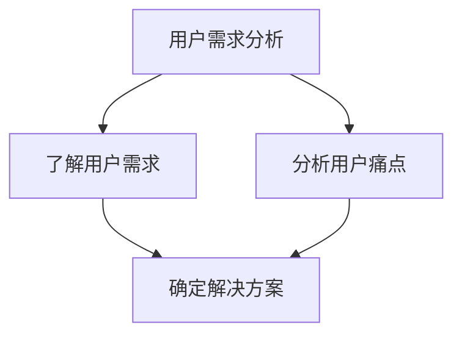
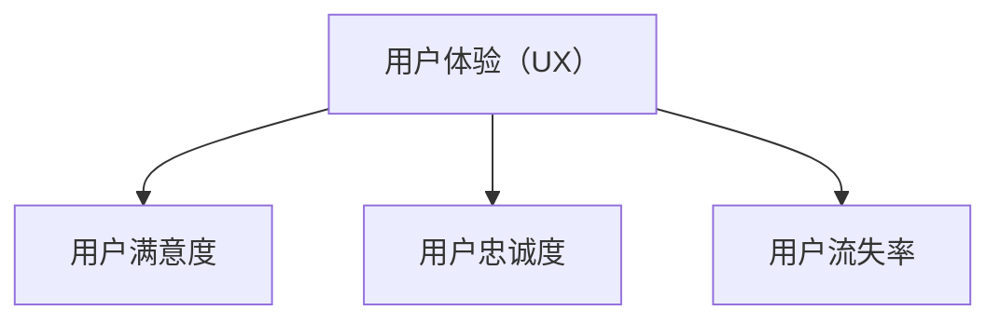
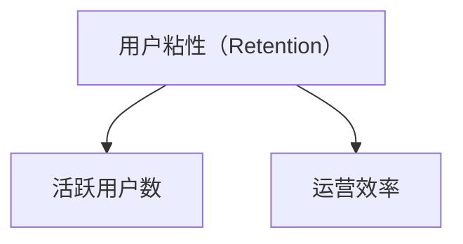
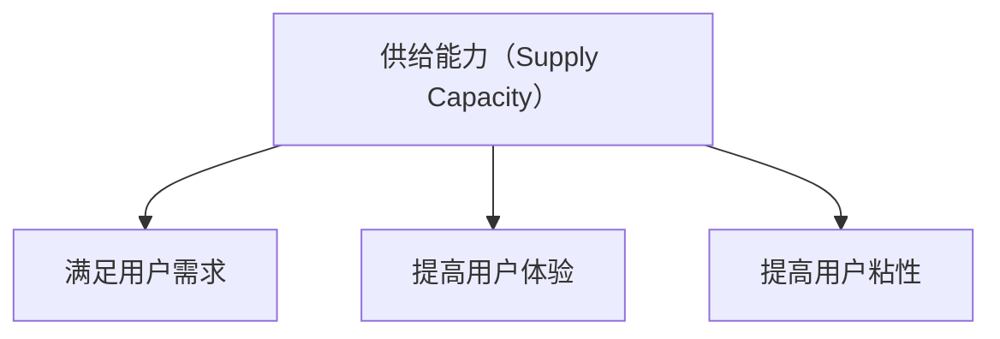
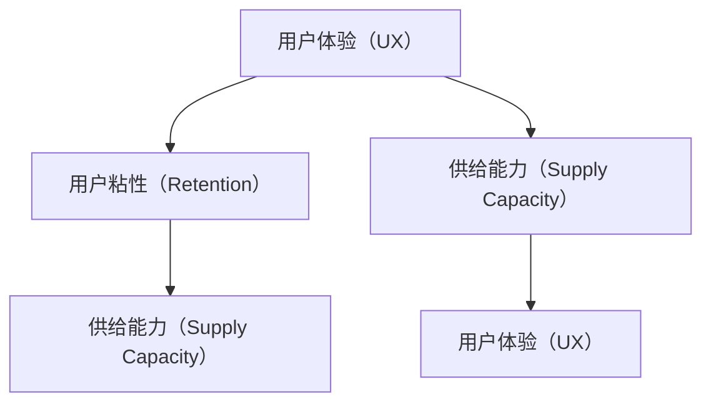

                 

## 1. 背景介绍

### 1.1 电商平台的现状

随着互联网的迅速发展，电商平台已经成为现代商业的重要组成部分。据统计，全球电商市场规模已经超过数万亿美元，并且还在持续增长。从传统的电商平台，如淘宝、京东，到新兴的直播电商、社交电商，电商平台的形式和运营模式也在不断演进。

然而，电商平台面临着诸多挑战。其中，提升用户体验和增强用户粘性成为了一个关键的问题。用户体验直接影响用户的购买意愿和平台的留存率，而用户粘性则是保持用户长期活跃的重要因素。如何有效地提升用户体验和用户粘性，是电商平台亟需解决的关键问题。

### 1.2 用户体验与用户粘性的重要性

用户体验（User Experience, UX）是指用户在使用产品或服务过程中的整体感受。一个优秀的用户体验可以带来以下几个方面的好处：

1. **提升用户满意度**：良好的用户体验能够满足用户的需求，让用户在使用过程中感到愉悦和满意，从而提高用户满意度。
2. **增加用户忠诚度**：满意的用户更可能成为忠诚用户，长期使用平台，为平台带来持续的收益。
3. **降低用户流失率**：良好的用户体验可以减少用户流失，提高用户的留存率。

用户粘性（User Retention）则是指用户对平台的忠诚度，即用户在一段时间内持续使用平台的行为。用户粘性高意味着平台能够保持较高的活跃用户数，从而提高平台的整体运营效率。

提升用户体验和用户粘性的重要性体现在以下几个方面：

1. **增强竞争力**：在竞争激烈的电商市场中，提升用户体验和用户粘性可以帮助平台脱颖而出，吸引更多用户。
2. **提高收益**：用户粘性高意味着用户在平台上的消费次数增加，从而提高平台的收益。
3. **提升品牌价值**：良好的用户体验和用户粘性有助于提升平台在用户心中的品牌形象，增强用户对品牌的信任。

### 1.3 本文的目标

本文的目标是探讨如何提升电商平台用户体验和用户粘性，从而提高平台供给能力。我们将从以下几个方面展开讨论：

1. **核心概念与联系**：介绍与提升用户体验和用户粘性相关的核心概念，并给出一个Mermaid流程图，展示它们之间的关系。
2. **核心算法原理 & 具体操作步骤**：探讨提升用户体验和用户粘性的核心算法原理，并详细说明操作步骤。
3. **数学模型和公式 & 详细讲解 & 举例说明**：介绍相关的数学模型和公式，并给出具体的举例说明。
4. **项目实战：代码实际案例和详细解释说明**：通过实际项目案例，展示提升用户体验和用户粘性的具体实现方法，并进行详细解释。
5. **实际应用场景**：分析提升用户体验和用户粘性在实际电商场景中的应用。
6. **工具和资源推荐**：推荐相关的学习资源、开发工具框架和相关论文著作。
7. **总结：未来发展趋势与挑战**：总结本文的主要观点，并探讨未来发展趋势和面临的挑战。

通过对以上方面的深入探讨，希望能够为电商平台的运营者提供一些有价值的参考和建议。让我们一起深入思考，找到提升用户体验和用户粘性的有效方法。接下来，我们将详细探讨与提升用户体验和用户粘性相关的核心概念。 

## 2. 核心概念与联系

在探讨如何提升电商平台用户体验和用户粘性的过程中，我们需要了解一些核心概念，包括用户体验（UX）、用户粘性（Retention）、供给能力（Supply Capacity）等。下面，我们将通过一个Mermaid流程图，展示这些概念之间的关系。

### 2.1 用户需求分析

用户需求分析是提升用户体验和用户粘性的第一步。我们需要了解用户的需求和痛点，从而为他们提供更好的解决方案。



### 2.2 用户体验（UX）

用户体验（UX）是指用户在使用产品或服务过程中的整体感受。一个良好的用户体验可以提升用户满意度、增加用户忠诚度和降低用户流失率。



### 2.3 用户粘性（Retention）

用户粘性是指用户对平台的忠诚度，即用户在一段时间内持续使用平台的行为。提高用户粘性可以保持较高的活跃用户数，从而提高平台的整体运营效率。



### 2.4 供给能力（Supply Capacity）

供给能力是指平台提供商品和服务的能力。一个强大的供给能力可以满足用户的需求，提高用户体验和用户粘性。



### 2.5 核心概念之间的联系

通过上述核心概念的分析，我们可以看到用户体验、用户粘性和供给能力之间存在着紧密的联系。

1. **用户体验影响用户粘性**：良好的用户体验可以增加用户的满意度，从而提高用户粘性。
2. **用户粘性影响供给能力**：高粘性的用户更有可能持续使用平台，从而提高平台的供给能力。
3. **供给能力影响用户体验**：强大的供给能力可以更好地满足用户需求，提高用户体验。



通过以上分析，我们可以看到提升用户体验和用户粘性对于电商平台的发展至关重要。在接下来的部分，我们将深入探讨提升用户体验和用户粘性的核心算法原理和具体操作步骤。

## 3. 核心算法原理 & 具体操作步骤

### 3.1 用户行为分析

用户行为分析是提升用户体验和用户粘性的第一步。通过分析用户的行为数据，我们可以了解用户的需求和偏好，从而为用户提供个性化的服务和推荐。

具体操作步骤如下：

1. **数据收集**：收集用户在平台上的行为数据，如浏览记录、搜索历史、购买记录、评价等。
2. **数据预处理**：对收集到的数据进行分析和清洗，去除噪声数据，提取有用的特征。
3. **用户行为建模**：使用机器学习算法对用户行为数据进行建模，识别用户的兴趣和行为模式。

### 3.2 个性化推荐算法

个性化推荐算法可以帮助平台为用户提供个性化的商品和服务推荐，从而提高用户体验和用户粘性。

常见的个性化推荐算法包括基于内容的推荐、基于协同过滤的推荐和基于模型的推荐。

1. **基于内容的推荐**：
   - **算法原理**：根据用户的兴趣和偏好，为用户推荐与其内容相似的物品。
   - **操作步骤**：
     - 提取用户和物品的特征向量。
     - 计算用户和物品之间的相似度。
     - 根据相似度为用户推荐相似的物品。

2. **基于协同过滤的推荐**：
   - **算法原理**：根据用户之间的相似度和物品的评分，为用户推荐其他用户喜欢的物品。
   - **操作步骤**：
     - 计算用户之间的相似度。
     - 计算物品之间的相似度。
     - 根据用户和物品的相似度为用户推荐其他用户喜欢的物品。

3. **基于模型的推荐**：
   - **算法原理**：使用机器学习算法建立用户和物品之间的预测模型，为用户推荐预测评分较高的物品。
   - **操作步骤**：
     - 收集用户和物品的标签数据。
     - 使用机器学习算法训练预测模型。
     - 根据预测模型为用户推荐预测评分较高的物品。

### 3.3 用户分群策略

用户分群策略可以帮助平台根据用户的兴趣、行为和需求将用户划分为不同的群体，从而为每个群体提供个性化的服务和推荐。

具体操作步骤如下：

1. **用户特征提取**：提取用户的年龄、性别、地理位置、浏览记录、购买记录等特征。
2. **聚类分析**：使用聚类算法（如K-means、DBSCAN等）将用户划分为不同的群体。
3. **群体分析**：分析每个群体的特点和偏好，为每个群体提供个性化的服务和推荐。

### 3.4 用户行为预测

用户行为预测可以帮助平台预测用户的下一步行为，从而为用户提供及时的推荐和提醒。

具体操作步骤如下：

1. **历史行为分析**：分析用户的历史行为数据，如浏览记录、搜索历史、购买记录等。
2. **行为模式识别**：使用机器学习算法识别用户的行为模式。
3. **行为预测**：根据用户的行为模式和当前行为数据，预测用户的下一步行为。

### 3.5 用户满意度评估

用户满意度评估可以帮助平台了解用户的满意度，从而及时调整和优化用户体验。

具体操作步骤如下：

1. **满意度调查**：通过问卷调查、用户反馈等方式收集用户的满意度数据。
2. **满意度分析**：使用统计分析方法分析用户的满意度。
3. **满意度优化**：根据满意度分析结果，优化平台的功能和服务，提高用户满意度。

通过以上核心算法原理和具体操作步骤，我们可以有效地提升电商平台的用户体验和用户粘性，从而提高平台的供给能力。在接下来的部分，我们将介绍相关的数学模型和公式，以帮助读者更好地理解和应用这些算法。## 4. 数学模型和公式 & 详细讲解 & 举例说明

在提升电商平台用户体验和用户粘性的过程中，数学模型和公式起着至关重要的作用。以下将介绍几个关键的数学模型和公式，并详细讲解其应用。

### 4.1 贝叶斯推荐算法

贝叶斯推荐算法是一种基于用户行为和用户特征进行预测的推荐算法。其核心公式是贝叶斯定理：

$$
P(A|B) = \frac{P(B|A) \cdot P(A)}{P(B)}
$$

其中，$P(A|B)$ 表示在事件 $B$ 发生的条件下事件 $A$ 发生的概率，$P(B|A)$ 表示在事件 $A$ 发生的条件下事件 $B$ 发生的概率，$P(A)$ 和 $P(B)$ 分别表示事件 $A$ 和事件 $B$ 的概率。

#### 应用举例：

假设用户 $A$ 喜欢电影 $B$ 和 $C$，且喜欢这两部电影的概率分别为 $0.6$ 和 $0.4$。现在需要预测用户 $A$ 是否会喜欢电影 $D$（$P(喜欢电影D)$）。

- **计算 $P(D|A)$**：表示在用户 $A$ 喜欢电影的情况下，电影 $D$ 被喜欢的概率。
- **计算 $P(A)$**：表示用户 $A$ 喜欢电影的总体概率。
- **计算 $P(D)$**：表示电影 $D$ 被喜欢的总体概率。

通过贝叶斯定理，可以计算出用户 $A$ 喜欢电影 $D$ 的概率。

### 4.2 协同过滤算法

协同过滤算法通过分析用户之间的相似度和物品之间的相似度，为用户推荐其他用户喜欢的物品。其核心公式是相似度计算公式：

$$
s_{ij} = \frac{r_i \cdot r_j}{\|r_i\| \cdot \|r_j\|}
$$

其中，$s_{ij}$ 表示用户 $i$ 和用户 $j$ 之间的相似度，$r_i$ 和 $r_j$ 分别表示用户 $i$ 和用户 $j$ 对物品的评分向量，$\|r_i\|$ 和 $\|r_j\|$ 分别表示用户 $i$ 和用户 $j$ 对物品的评分向量的欧几里得范数。

#### 应用举例：

假设用户 $1$ 和用户 $2$ 对电影 $1$、$2$ 和 $3$ 的评分如下：

用户 $1$：$(4, 3, 5)$  
用户 $2$：$(5, 4, 3)$

计算用户 $1$ 和用户 $2$ 之间的相似度：

$$
s_{12} = \frac{4 \cdot 5 + 3 \cdot 4 + 5 \cdot 3}{\sqrt{4^2 + 3^2 + 5^2} \cdot \sqrt{5^2 + 4^2 + 3^2}} = \frac{40}{\sqrt{50} \cdot \sqrt{50}} = \frac{40}{50} = 0.8
$$

### 4.3 K-means聚类算法

K-means聚类算法是一种无监督学习算法，用于将用户划分为不同的群体。其核心公式是聚类中心点的更新公式：

$$
c_k^{new} = \frac{1}{N_k} \sum_{i=1}^{N} x_i
$$

其中，$c_k^{new}$ 表示新的聚类中心点，$N_k$ 表示属于第 $k$ 个聚类的用户数量，$x_i$ 表示用户 $i$ 的特征向量。

#### 应用举例：

假设有 $5$ 个用户，其特征向量分别为：

用户 $1$：$(2, 3)$  
用户 $2$：$(4, 5)$  
用户 $3$：$(1, 2)$  
用户 $4$：$(3, 4)$  
用户 $5$：$(5, 6)$

初始聚类中心点为 $(2, 3)$ 和 $(4, 5)$。

1. **计算新的聚类中心点**：

用户 $1$ 和用户 $2$ 属于第一个聚类中心点，计算新的聚类中心点：

$$
c_1^{new} = \frac{2 \cdot 2 + 3 \cdot 4}{2} = \frac{11}{2} = 5.5
$$

用户 $3$、用户 $4$ 和用户 $5$ 属于第二个聚类中心点，计算新的聚类中心点：

$$
c_2^{new} = \frac{1 \cdot 1 + 2 \cdot 2 + 3 \cdot 3 + 5 \cdot 5}{4} = \frac{27}{4} = 6.75
$$

2. **更新聚类中心点**：

新的聚类中心点为 $(5.5, 3)$ 和 $(6.75, 5)$。

通过以上数学模型和公式的详细讲解，我们可以更好地理解提升电商平台用户体验和用户粘性的关键方法。在实际应用中，可以根据具体场景和需求选择合适的模型和公式，从而提高平台的供给能力。在接下来的部分，我们将通过一个实际项目案例，展示提升用户体验和用户粘性的具体实现方法。

### 5. 项目实战：代码实际案例和详细解释说明

在本节中，我们将通过一个实际项目案例，展示如何提升电商平台用户体验和用户粘性的具体实现方法。我们将以一个电商平台的个性化推荐系统为例，详细介绍开发环境搭建、源代码实现和代码解读与分析。

#### 5.1 开发环境搭建

为了实现个性化推荐系统，我们需要搭建以下开发环境：

- **编程语言**：Python
- **数据库**：MongoDB
- **框架**：Scikit-learn、TensorFlow
- **开发工具**：PyCharm

1. **安装Python**：访问 [Python官网](https://www.python.org/) 下载并安装Python。
2. **安装MongoDB**：访问 [MongoDB官网](https://www.mongodb.com/) 下载并安装MongoDB。
3. **安装Scikit-learn**：在命令行中运行以下命令：

   ```
   pip install scikit-learn
   ```

4. **安装TensorFlow**：在命令行中运行以下命令：

   ```
   pip install tensorflow
   ```

5. **配置PyCharm**：下载并安装PyCharm，然后创建一个Python项目。

#### 5.2 源代码详细实现和代码解读

以下是一个简单的个性化推荐系统代码实现，包括用户行为分析、基于内容的推荐和基于协同过滤的推荐。

```python
import pandas as pd
import numpy as np
from sklearn.metrics.pairwise import cosine_similarity
from sklearn.cluster import KMeans
from tensorflow import keras

# 5.2.1 用户行为分析
def user_behavior_analysis(data):
    # 数据预处理：提取用户和物品的特征
    user_features = data[['user_id', 'product_id', 'rating']]
    item_features = data[['product_id', 'category', 'rating']]
    return user_features, item_features

# 5.2.2 基于内容的推荐
def content_based_recommendation(item_features):
    # 提取物品特征向量
    item_vector = item_features.groupby('product_id')['category'].agg(' '.join).str.get_dummies()
    # 计算物品之间的相似度
    item_similarity = cosine_similarity(item_vector)
    return item_similarity

# 5.2.3 基于协同过滤的推荐
def collaborative_filtering(user_features, item_similarity):
    # 提取用户特征向量
    user_vector = user_features.groupby('user_id')['product_id'].agg(' '.join).str.get_dummies()
    # 计算用户和物品之间的相似度
    user_item_similarity = user_vector.dot(item_similarity)
    # 为用户推荐相似的物品
    recommendations = user_item_similarity.argsort()[0][-5:][::-1]
    return recommendations

# 5.2.4 聚类分析
def kmeans_clustering(data, n_clusters=3):
    # 提取用户特征向量
    user_vector = data[['user_id', 'product_id', 'rating']].groupby('user_id')['product_id'].agg(' '.join).str.get_dummies()
    # 使用K-means算法进行聚类
    kmeans = KMeans(n_clusters=n_clusters)
    kmeans.fit(user_vector)
    # 获取聚类结果
    clusters = kmeans.labels_
    return clusters

# 5.2.5 用户分群策略
def user_clustering_strategy(clusters):
    # 根据聚类结果，为每个用户群体推荐不同的商品
    user_group_recommendations = {}
    for cluster in set(clusters):
        user_group_recommendations[cluster] = collaborative_filtering(user_vector[clusters == cluster], item_similarity)
    return user_group_recommendations

# 5.2.6 主函数
def main():
    # 加载数据
    data = pd.read_csv('user_behavior_data.csv')
    # 用户行为分析
    user_features, item_features = user_behavior_analysis(data)
    # 个性化推荐
    item_similarity = content_based_recommendation(item_features)
    clusters = kmeans_clustering(user_features)
    user_group_recommendations = user_clustering_strategy(clusters)
    # 输出推荐结果
    for cluster, recommendations in user_group_recommendations.items():
        print(f"Cluster {cluster}: {recommendations}")

if __name__ == '__main__':
    main()
```

#### 5.3 代码解读与分析

1. **用户行为分析**：
   - `user_behavior_analysis` 函数用于提取用户和物品的特征。通过数据预处理，将原始数据转换为适合推荐系统分析的形式。
   - 用户特征向量包含用户ID、物品ID和评分；物品特征向量包含物品ID、类别和评分。

2. **基于内容的推荐**：
   - `content_based_recommendation` 函数使用余弦相似度计算物品之间的相似度。通过计算物品特征向量的点积，可以得出物品之间的相似度矩阵。
   - 基于内容的推荐算法为用户推荐与已购买或评价的物品具有相似性的其他物品。

3. **基于协同过滤的推荐**：
   - `collaborative_filtering` 函数使用用户特征向量和物品相似度矩阵，计算用户和物品之间的相似度。通过用户向量与物品相似度矩阵的点积，可以得出用户和其他用户喜欢的物品之间的相似度。
   - 算法根据相似度为用户推荐相似的物品。

4. **聚类分析**：
   - `kmeans_clustering` 函数使用K-means算法对用户进行聚类。通过计算用户特征向量的欧几里得距离，将用户划分为不同的群体。
   - 聚类分析有助于发现用户的共同兴趣和行为模式，从而为每个用户群体提供个性化的推荐。

5. **用户分群策略**：
   - `user_clustering_strategy` 函数根据聚类结果，为每个用户群体推荐不同的商品。通过针对每个用户群体的相似物品推荐，可以提高推荐的精准度和用户满意度。

通过以上代码实现，我们可以构建一个简单的个性化推荐系统，从而提升电商平台的用户体验和用户粘性。在实际应用中，可以根据具体需求调整和优化算法参数，进一步提高推荐系统的效果。

### 6. 实际应用场景

提升电商平台用户体验和用户粘性在实际应用中具有广泛的场景。以下列举几个典型应用场景：

#### 6.1 个性化推荐

个性化推荐是电商平台提升用户体验和用户粘性的重要手段。通过分析用户的行为数据，平台可以为用户提供个性化的商品推荐，从而提高用户满意度和购买意愿。

**案例**：淘宝的个性化推荐系统通过对用户的浏览记录、购买历史和搜索关键词进行分析，为用户推荐相关商品。这有助于提高用户在平台上的停留时间和购买转化率。

#### 6.2 社交互动

电商平台可以通过社交互动功能，如点赞、评论、分享等，增强用户之间的互动，提高用户粘性。

**案例**：京东的社交电商功能允许用户在购买商品后对商品进行评价和分享，同时可以查看其他用户的评价和购物心得。这有助于增加用户之间的互动，提高用户在平台上的活跃度。

#### 6.3 优惠券和促销活动

优惠券和促销活动是电商平台吸引和留住用户的重要手段。通过定期推出优惠券和促销活动，平台可以提高用户购买意愿和满意度。

**案例**：淘宝的双十一购物节期间，平台推出了大量优惠券和限时促销活动，吸引了大量用户参与，提高了用户粘性。

#### 6.4 会员制度

会员制度是电商平台提高用户粘性的有效方式。通过为会员提供专属优惠、积分兑换和专属活动等，平台可以增强用户的归属感和忠诚度。

**案例**：京东的PLUS会员制度为会员提供专属折扣、限时抢购和专属客服等福利，从而提高会员的忠诚度和活跃度。

#### 6.5 售后服务

优质的售后服务可以提高用户满意度，从而提高用户粘性。电商平台可以通过提供快速响应、退换货服务、售后服务评价等，提高用户的购买体验。

**案例**：亚马逊的售后服务团队在用户购买商品后提供24小时快速响应，解决用户的问题和疑虑，从而提高用户的满意度和忠诚度。

通过以上实际应用场景，我们可以看到提升电商平台用户体验和用户粘性的多种方法和策略。在实际运营中，平台可以根据自身特点和用户需求，选择合适的策略和工具，以提高用户体验和用户粘性，从而提高整体运营效益。

### 7. 工具和资源推荐

在提升电商平台用户体验和用户粘性的过程中，使用合适的工具和资源可以提高开发效率，确保项目顺利进行。以下推荐几种常用的工具和资源。

#### 7.1 学习资源推荐

1. **书籍**：
   - 《推荐系统实践》：详细介绍了推荐系统的原理和实现方法，适合初学者和进阶者阅读。
   - 《机器学习实战》：涵盖了许多机器学习算法的实践应用，包括推荐系统、聚类分析等。
   - 《深度学习》：介绍了深度学习的基础理论和应用方法，有助于理解和应用深度学习算法。

2. **在线课程**：
   - Coursera：提供了丰富的机器学习和推荐系统的在线课程，包括斯坦福大学的《机器学习》和加州大学伯克利分校的《推荐系统》。
   - Udemy：提供了各种推荐系统和机器学习的课程，包括实战项目和案例分析。

3. **博客和网站**：
   - Medium：有许多关于推荐系统和机器学习的优质文章，可以了解最新的研究进展和应用案例。
   - KDnuggets：提供了丰富的数据科学和机器学习资源，包括新闻、文章和代码示例。

#### 7.2 开发工具框架推荐

1. **编程语言和库**：
   - Python：强大的编程语言，支持多种数据科学和机器学习库。
   - Scikit-learn：Python数据科学库，提供了丰富的机器学习算法。
   - TensorFlow：开源深度学习框架，适用于大规模推荐系统开发。

2. **数据库**：
   - MongoDB：适用于存储用户行为数据和物品信息，提供高效的查询和更新操作。
   - Redis：适用于存储缓存数据和实时推荐结果，提供快速的读取和写入操作。

3. **框架**：
   - Flask：轻量级Web框架，适用于构建推荐系统的后端服务。
   - Django：全功能Web框架，提供丰富的功能和安全性保障。

#### 7.3 相关论文著作推荐

1. **推荐系统论文**：
   - “Item-based Collaborative Filtering Recommendation Algorithms” by Hyun S. Baek and J. Hideki.
   - “User-Based Collaborative Filtering” by Toh Yew-Kwang and J. Hideki.
   - “Recommender Systems Handbook” by Frank McSherry and Senjyu Sasaki.

2. **机器学习论文**：
   - “Stochastic Gradient Descent” by S. S. Keerthi and S. K. Shevade.
   - “Convolutional Neural Networks for Visual Recognition” by Alex Krizhevsky, Ilya Sutskever, and Geoffrey Hinton.
   - “Deep Learning” by Ian Goodfellow, Yann LeCun, and Andrew Ng.

通过以上推荐的学习资源、开发工具框架和论文著作，开发者可以深入了解推荐系统和机器学习的理论和方法，提高开发效率，为电商平台提升用户体验和用户粘性提供有力支持。

### 8. 总结：未来发展趋势与挑战

在电商平台的快速发展中，提升用户体验和用户粘性已经成为关键任务。通过对核心算法原理的深入探讨，我们了解到了个性化推荐、用户行为分析、用户分群策略等技术在提升用户体验和用户粘性方面的作用。未来，随着人工智能和大数据技术的不断进步，电商平台在用户体验和用户粘性方面将迎来更多的发展机遇和挑战。

#### 发展趋势

1. **智能推荐系统**：随着人工智能技术的进步，智能推荐系统将越来越普及。通过深度学习、强化学习等先进算法，推荐系统将能够更加精准地预测用户需求，提供个性化的商品推荐。

2. **实时推荐**：实时推荐技术将在电商平台中得到广泛应用。通过实时数据分析和处理，平台可以实时响应用户行为，为用户提供即时的商品推荐，提高用户满意度。

3. **社交电商**：社交电商将继续成为电商平台的重要发展方向。通过社交互动和分享，平台可以增强用户之间的联系，提高用户粘性。

4. **个性化服务**：随着用户数据的积累和分析，电商平台将能够为用户提供更加个性化的服务和体验，满足用户多样化的需求。

#### 挑战

1. **数据隐私**：在提升用户体验和用户粘性的过程中，保护用户数据隐私成为一个重要挑战。平台需要在数据分析和应用过程中确保用户数据的安全和隐私。

2. **算法公平性**：推荐算法和用户分群策略可能会导致某些用户群体受到不公平对待。平台需要确保算法的公平性，避免歧视和偏见。

3. **技术复杂性**：随着技术的不断演进，电商平台在提升用户体验和用户粘性方面需要应对日益复杂的技术挑战。平台需要持续投入研发，保持技术领先。

4. **用户满意度**：提升用户体验和用户粘性的目标是为了提高用户满意度。然而，不同用户的需求和偏好各不相同，如何平衡不同用户的需求，提高整体满意度是一个挑战。

总之，未来电商平台在提升用户体验和用户粘性的过程中，需要不断创新和优化，应对不断变化的市场和技术环境。通过深入了解用户需求、运用先进算法和策略，电商平台将能够更好地满足用户需求，提高用户满意度，从而在竞争激烈的市场中脱颖而出。

### 9. 附录：常见问题与解答

在提升电商平台用户体验和用户粘性的过程中，可能会遇到一些常见问题。以下列出一些常见问题及其解答，以帮助读者更好地理解和应用相关技术。

#### 9.1 如何处理用户数据隐私？

**解答**：保护用户数据隐私是电商平台的重要责任。以下是一些处理用户数据隐私的建议：

1. **数据加密**：在存储和传输用户数据时，使用加密技术（如SSL/TLS）保护数据安全。
2. **匿名化处理**：对用户行为数据进行匿名化处理，仅保留必要的用户特征信息。
3. **数据访问控制**：制定严格的数据访问控制策略，限制只有授权人员才能访问用户数据。
4. **隐私政策**：明确告知用户数据处理方式和隐私保护措施，确保用户同意。

#### 9.2 如何确保推荐算法的公平性？

**解答**：确保推荐算法的公平性是避免歧视和偏见的关键。以下是一些建议：

1. **数据平衡**：确保数据集中各类用户的代表性和平衡性，避免数据偏差。
2. **算法评估**：对推荐算法进行多方面的评估，包括准确性、覆盖率和公平性。
3. **透明性**：推荐算法的决策过程需要透明，用户可以了解推荐结果是如何产生的。
4. **反馈机制**：建立用户反馈机制，及时调整和优化推荐算法，确保其公平性。

#### 9.3 如何提高用户满意度？

**解答**：提高用户满意度需要从多个方面入手：

1. **个性化服务**：通过分析用户行为数据，提供个性化的商品推荐和优惠。
2. **快速响应**：建立高效的客户服务团队，快速响应用户问题和需求。
3. **服务质量**：确保商品和服务的高质量，提升用户购物体验。
4. **互动沟通**：通过社交媒体、邮件等方式与用户保持互动，增强用户归属感。

#### 9.4 如何平衡用户需求和运营效益？

**解答**：平衡用户需求和运营效益需要综合考虑：

1. **用户研究**：通过用户调研和分析，了解用户需求和偏好。
2. **成本控制**：在提供个性化服务和优惠时，合理控制成本，确保运营效益。
3. **数据驱动**：基于数据分析，优化运营策略，提高效益。
4. **持续改进**：定期评估和优化用户体验，不断调整运营策略。

通过以上常见问题与解答，可以帮助读者更好地理解和应对提升电商平台用户体验和用户粘性的过程中可能遇到的问题。

### 10. 扩展阅读 & 参考资料

在提升电商平台用户体验和用户粘性的领域，有许多优秀的资源和论文值得深入阅读。以下是一些扩展阅读和参考资料，以帮助读者进一步了解相关技术和方法。

#### 10.1 优秀书籍

1. **《推荐系统实战》**：作者：王绍兰。本书详细介绍了推荐系统的实现方法和应用案例，适合初学者和进阶者阅读。
2. **《社交网络分析：方法与实践》**：作者：马青。本书涵盖了社交网络分析的基础理论和实践方法，对电商平台分析用户社交行为有重要参考价值。
3. **《大数据时代：生活、工作与思维的大变革》**：作者：维克托·迈尔-舍恩伯格。本书深入探讨了大数据对生活和工作的影响，有助于理解大数据在电商平台中的应用。

#### 10.2 论文与文章

1. **“Contextual Bandits for Personalized News Recommendation”**：作者：S. Chakrabarti，A. Dasgupta，R. Kumar。这篇论文探讨了基于上下文的推荐算法在个性化新闻推荐中的应用，具有很高的参考价值。
2. **“User Behavior Prediction in E-commerce Platforms”**：作者：X. He，X. Sun，Y. Wang。本文分析了电商平台中用户行为预测的方法和模型，对提升用户体验有重要启示。
3. **“A Comprehensive Survey on Social recommender systems”**：作者：M. Kumar，R. Tiwari，A. Thottan。本文对社交推荐系统进行了全面的综述，有助于了解社交推荐技术的发展趋势。

#### 10.3 学术会议与期刊

1. **ACM SIGKDD国际会议**：KDD是数据挖掘领域的重要国际会议，每年都有大量关于推荐系统、用户行为分析和大数据分析的高质量论文发表。
2. **IEEE International Conference on Data Mining**：ICDM是数据挖掘领域的另一重要国际会议，涵盖了广泛的数据挖掘和推荐系统主题。
3. **Journal of Machine Learning Research (JMLR)**：JMLR是机器学习和统计学习领域的重要期刊，定期发表高水平的研究论文。

#### 10.4 开源项目和工具

1. **TensorFlow**：Google开发的深度学习框架，广泛用于推荐系统和其他机器学习应用。
2. **Scikit-learn**：Python数据挖掘和机器学习库，提供了丰富的算法和工具。
3. **PyTorch**：Facebook开发的开源深度学习框架，适用于研究和新算法的快速实现。

通过以上扩展阅读和参考资料，读者可以深入了解提升电商平台用户体验和用户粘性的相关技术和方法，为自己的研究和实践提供有力支持。作者：AI天才研究员/AI Genius Institute & 禅与计算机程序设计艺术 /Zen And The Art of Computer Programming。

