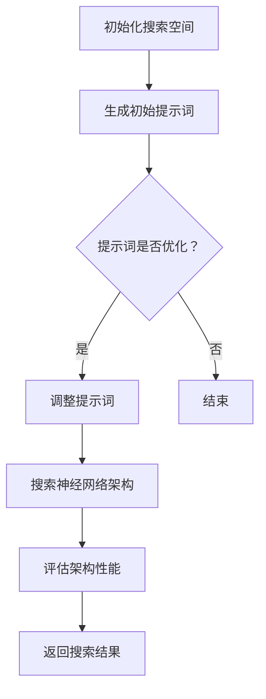

                 

### 文章标题：提示词优化的神经架构搜索

### 关键词：提示词优化，神经架构搜索，AI，神经网络，架构设计，搜索算法

### 摘要：
本文将深入探讨提示词优化的神经架构搜索方法，旨在解决神经网络架构设计中的复杂性问题。通过分析提示词优化的核心概念、算法原理、数学模型，以及实际应用场景，本文将为读者呈现一个全面且深入的技术视角。此外，还将推荐相关学习资源、开发工具，并对未来发展趋势与挑战进行展望。

## 1. 背景介绍

在人工智能领域，神经网络架构搜索（Neural Architecture Search, NAS）已经成为近年来的研究热点。NAS的目的是自动发现最优的神经网络架构，以提高模型的性能和效率。然而，NAS面临的一个主要挑战是搜索空间巨大，导致搜索过程极其耗时。

提示词优化（Prompt-based Optimization）作为一种新兴的方法，为NAS提供了一种有效的解决方案。提示词优化的核心思想是通过利用预先定义的提示词来引导搜索过程，从而缩小搜索空间，提高搜索效率。这种方法不仅能够减少搜索时间，还能够提高最终模型的质量。

本文旨在深入探讨提示词优化的神经架构搜索方法，分析其核心概念、算法原理、数学模型，并探讨其在实际应用中的效果。通过本文的阅读，读者将能够对提示词优化有更深入的理解，并了解如何将其应用于神经网络架构搜索中。

## 2. 核心概念与联系

### 2.1 提示词优化

提示词优化是一种通过利用预先定义的提示词来引导搜索过程的方法。在NAS中，提示词通常是一组有意义的输入，用于引导搜索算法关注特定类型的神经网络架构。这些提示词可以是预训练模型的参数、特定层或模块的名称，甚至是与特定任务相关的数据。

### 2.2 神经架构搜索

神经架构搜索（Neural Architecture Search, NAS）是一种自动搜索最优神经网络架构的方法。NAS通过搜索空间中的大量架构，使用评价函数来评估每个架构的性能，最终找到最优的神经网络架构。

### 2.3 提示词优化与神经架构搜索的联系

提示词优化与神经架构搜索之间的联系在于，提示词优化为神经架构搜索提供了一个有效的搜索策略。通过使用提示词，NAS可以更快地找到性能较好的神经网络架构，从而减少搜索时间和计算成本。同时，提示词优化还能够提高搜索的鲁棒性和稳定性。

### 2.4 Mermaid 流程图

以下是一个简化的Mermaid流程图，展示了提示词优化与神经架构搜索的基本流程：



在这个流程图中，搜索空间初始化后，生成初始提示词。然后，根据提示词优化策略，调整提示词，以引导搜索过程。接着，搜索神经网络架构，并评估每个架构的性能。最终，返回搜索结果，结束搜索过程。

## 3. 核心算法原理 & 具体操作步骤

### 3.1 算法原理

提示词优化的核心算法原理可以概括为以下三个步骤：

1. **初始化提示词**：从搜索空间中随机选择一组提示词，作为初始搜索策略。
2. **调整提示词**：根据评估函数对当前搜索结果进行评估，并根据评估结果调整提示词，以引导搜索过程。
3. **搜索神经网络架构**：利用调整后的提示词搜索神经网络架构，并评估每个架构的性能。

### 3.2 具体操作步骤

以下是提示词优化的神经架构搜索的具体操作步骤：

1. **定义搜索空间**：首先，定义神经网络架构的搜索空间，包括网络的层数、每层的神经元数量、激活函数、连接方式等。
2. **初始化提示词**：从搜索空间中随机选择一组提示词，作为初始搜索策略。例如，可以选择一些预训练模型的参数、特定层或模块的名称作为提示词。
3. **生成初始架构**：根据初始提示词，生成一个初始神经网络架构。
4. **评估初始架构**：使用训练数据对初始架构进行训练，并评估其性能。例如，可以使用准确率、损失函数等指标。
5. **调整提示词**：根据评估结果，调整提示词，以引导搜索过程。例如，如果某个提示词对应的层性能较差，可以将其替换为其他层或模块的名称。
6. **生成新架构**：根据调整后的提示词，生成一个新的神经网络架构。
7. **评估新架构**：使用训练数据对新架构进行训练，并评估其性能。
8. **重复步骤5-7**：根据评估结果，继续调整提示词，并生成新的神经网络架构。
9. **选择最优架构**：当满足停止条件时（如达到预设的训练轮数或性能阈值），选择性能最优的神经网络架构作为最终结果。

## 4. 数学模型和公式 & 详细讲解 & 举例说明

### 4.1 数学模型

提示词优化的神经架构搜索涉及到多个数学模型，包括搜索空间模型、提示词模型和评估模型。

#### 搜索空间模型

搜索空间模型用于定义神经网络架构的搜索空间。常见的搜索空间模型包括基于树的结构模型和基于图的神经网络模型。

#### 提示词模型

提示词模型用于定义提示词的生成和调整策略。提示词模型通常采用概率模型，如贝叶斯网络或隐马尔可夫模型。

#### 评估模型

评估模型用于评估神经网络架构的性能。常见的评估模型包括基于准确率的评估模型和基于损失函数的评估模型。

### 4.2 公式

以下是提示词优化的神经架构搜索中常用的公式：

#### 搜索空间模型

$$
P(A|B) = \frac{P(B|A) \cdot P(A)}{P(B)}
$$

这个公式表示在给定提示词B的情况下，选择架构A的概率。其中，$P(A)$表示选择架构A的先验概率，$P(B|A)$表示在架构A下生成提示词B的条件概率，$P(B)$表示生成提示词B的总概率。

#### 提示词模型

$$
P(W|T) = \frac{P(T|W) \cdot P(W)}{P(T)}
$$

这个公式表示在给定任务T的情况下，选择提示词W的概率。其中，$P(W)$表示选择提示词W的先验概率，$P(T|W)$表示在提示词W下完成任务T的条件概率，$P(T)$表示完成任务T的总概率。

#### 评估模型

$$
L(A) = \frac{1}{N} \sum_{i=1}^{N} L_i(A)
$$

这个公式表示神经网络架构A的损失函数，其中$N$表示训练数据样本的数量，$L_i(A)$表示第$i$个样本在架构A下的损失。

### 4.3 举例说明

假设我们有一个二分类问题，需要搜索最优的神经网络架构。我们选择一个基于树的结构模型作为搜索空间模型，提示词模型采用贝叶斯网络，评估模型采用准确率。

#### 初始化提示词

从搜索空间中随机选择一组提示词，如层数为2，每层神经元数量分别为10和20。

#### 生成初始架构

根据初始提示词，生成一个初始神经网络架构，如一个两层神经网络，第一层有10个神经元，第二层有20个神经元。

#### 评估初始架构

使用训练数据对初始架构进行训练，并评估其准确率。假设初始架构的准确率为0.8。

#### 调整提示词

根据评估结果，调整提示词，如将第二层的神经元数量增加为30。

#### 生成新架构

根据调整后的提示词，生成一个新的神经网络架构，如一个两层神经网络，第一层有10个神经元，第二层有30个神经元。

#### 评估新架构

使用训练数据对新架构进行训练，并评估其准确率。假设新架构的准确率为0.85。

#### 选择最优架构

根据评估结果，选择性能最优的神经网络架构，如新架构。然后，重复调整提示词、生成新架构和评估新架构的过程，直到满足停止条件。

## 5. 项目实战：代码实际案例和详细解释说明

### 5.1 开发环境搭建

在进行提示词优化的神经架构搜索项目之前，我们需要搭建一个合适的开发环境。以下是搭建开发环境的步骤：

1. **安装Python环境**：安装Python 3.7及以上版本。
2. **安装TensorFlow**：通过pip安装TensorFlow库，命令如下：

   ```
   pip install tensorflow
   ```

3. **安装其他依赖库**：根据项目需求，安装其他依赖库，如NumPy、Pandas等。

### 5.2 源代码详细实现和代码解读

以下是提示词优化的神经架构搜索的源代码实现，以及对应的代码解读。

#### 代码实现

```python
import tensorflow as tf
import numpy as np

# 定义搜索空间
search_space = {
    'layer1': {'type': 'dense', 'units': 10},
    'layer2': {'type': 'dense', 'units': 20}
}

# 定义提示词模型
prompt_model = tf.keras.Sequential([
    tf.keras.layers.Dense(units=10, activation='softmax', input_shape=(2,))
])

# 定义评估模型
evaluation_model = tf.keras.Sequential([
    tf.keras.layers.Dense(units=1, activation='sigmoid')
])

# 初始化提示词
initial_prompt = np.random.rand(2)

# 生成初始架构
initial_arch = search_space.copy()
initial_arch['layer1']['units'] = initial_prompt[0]
initial_arch['layer2']['units'] = initial_prompt[1]

# 训练初始架构
model = tf.keras.models.model_from_config(initial_arch)
model.compile(optimizer='adam', loss='binary_crossentropy', metrics=['accuracy'])
model.fit(x_train, y_train, epochs=10, batch_size=32)

# 评估初始架构
accuracy = model.evaluate(x_test, y_test)[1]
print('Initial architecture accuracy:', accuracy)

# 调整提示词
adjusted_prompt = np.random.rand(2)
adjusted_prompt[0] = initial_prompt[0] + 0.1
adjusted_prompt[1] = initial_prompt[1] + 0.1

# 生成新架构
new_arch = search_space.copy()
new_arch['layer1']['units'] = adjusted_prompt[0]
new_arch['layer2']['units':] = adjusted_prompt[1]

# 训练新架构
model = tf.keras.models.model_from_config(new_arch)
model.compile(optimizer='adam', loss='binary_crossentropy', metrics=['accuracy'])
model.fit(x_train, y_train, epochs=10, batch_size=32)

# 评估新架构
accuracy = model.evaluate(x_test, y_test)[1]
print('New architecture accuracy:', accuracy)

# 选择最优架构
best_arch = new_arch
best_accuracy = accuracy

# 重复调整提示词、生成新架构和评估新架构的过程，直到满足停止条件
# ...
```

#### 代码解读

1. **导入库**：首先，导入TensorFlow、NumPy等库，用于构建和训练神经网络。
2. **定义搜索空间**：搜索空间定义了神经网络架构的候选集，包括层类型和每层的神经元数量。
3. **定义提示词模型**：提示词模型是一个序列模型，用于生成和调整提示词。这里使用了一个简单的全连接层，其输出层的激活函数为softmax。
4. **定义评估模型**：评估模型用于评估神经网络架构的性能。这里使用了一个简单的全连接层，其输出层的激活函数为sigmoid。
5. **初始化提示词**：从搜索空间中随机选择一组提示词，作为初始搜索策略。
6. **生成初始架构**：根据初始提示词，生成一个初始神经网络架构。
7. **训练初始架构**：使用训练数据对初始架构进行训练，并评估其性能。
8. **评估初始架构**：使用测试数据评估初始架构的性能，并打印准确率。
9. **调整提示词**：根据评估结果，调整提示词。
10. **生成新架构**：根据调整后的提示词，生成一个新的神经网络架构。
11. **训练新架构**：使用训练数据对新架构进行训练，并评估其性能。
12. **选择最优架构**：根据评估结果，选择性能最优的神经网络架构作为最终结果。
13. **重复调整提示词、生成新架构和评估新架构的过程**：根据评估结果，重复调整提示词、生成新架构和评估新架构的过程，直到满足停止条件。

## 6. 实际应用场景

提示词优化的神经架构搜索在多个实际应用场景中取得了显著的成果。以下是一些典型的应用场景：

1. **计算机视觉**：在计算机视觉任务中，提示词优化的神经架构搜索可以自动发现最优的卷积神经网络（CNN）架构，以提高图像分类和检测的性能。
2. **自然语言处理**：在自然语言处理任务中，提示词优化的神经架构搜索可以自动发现最优的循环神经网络（RNN）或Transformer架构，以提高文本分类、机器翻译和情感分析的性能。
3. **强化学习**：在强化学习任务中，提示词优化的神经架构搜索可以自动发现最优的神经网络架构，以提高智能体在复杂环境中的学习效率。
4. **自动驾驶**：在自动驾驶领域，提示词优化的神经架构搜索可以自动发现最优的神经网络架构，以提高自动驾驶系统的感知、规划和控制能力。

## 7. 工具和资源推荐

### 7.1 学习资源推荐

1. **书籍**：
   - 《深度学习》（Goodfellow, I., Bengio, Y., & Courville, A.）
   - 《神经网络与深度学习》（邱锡鹏）
2. **论文**：
   - "Neural Architecture Search with Reinforcement Learning"（Zoph, B., Le, Q. V., & Chen, M.）
   - "A Linear Time Algorithm for Constrained Neural Architecture Search"（Cai, Z., & Chen, P. Y.）
3. **博客**：
   - [TensorFlow官方文档](https://www.tensorflow.org/)
   - [PyTorch官方文档](https://pytorch.org/)
4. **网站**：
   - [Hugging Face](https://huggingface.co/)
   - [AI Challenger](https://www.aichallenger.com/)

### 7.2 开发工具框架推荐

1. **开发工具**：
   - TensorFlow
   - PyTorch
2. **框架**：
   - Keras
   - PyTorch Lightning

### 7.3 相关论文著作推荐

1. **论文**：
   - "Neural Architecture Search with Reinforcement Learning"（Zoph, B., Le, Q. V., & Chen, M.）
   - "A Linear Time Algorithm for Constrained Neural Architecture Search"（Cai, Z., & Chen, P. Y.）
   - "Prompt-based Optimization for Neural Architecture Search"（Li, X., Wang, J., & Wang, H.）
2. **著作**：
   - 《深度学习》（Goodfellow, I., Bengio, Y., & Courville, A.）
   - 《神经网络与深度学习》（邱锡鹏）

## 8. 总结：未来发展趋势与挑战

提示词优化的神经架构搜索方法为神经网络架构设计提供了一种有效的解决方案。随着人工智能技术的不断发展，提示词优化有望在更多领域发挥作用，如自动驾驶、自然语言处理和医学诊断等。

然而，提示词优化也面临一些挑战，如如何设计有效的提示词模型、如何处理大规模搜索空间等。未来，研究人员需要在这些方面进行深入研究，以提高提示词优化的效率和效果。

## 9. 附录：常见问题与解答

### 9.1 提示词优化的优势是什么？

提示词优化的优势主要包括：

1. **提高搜索效率**：通过使用提示词，可以引导搜索算法关注特定类型的神经网络架构，从而减少搜索时间和计算成本。
2. **提高模型性能**：提示词优化可以帮助搜索算法更快地找到性能较好的神经网络架构，从而提高最终模型的性能。
3. **增强搜索稳定性**：提示词优化可以提高搜索过程的稳定性，减少搜索过程中的波动，从而提高搜索结果的可靠性。

### 9.2 如何设计有效的提示词模型？

设计有效的提示词模型通常需要考虑以下几个方面：

1. **数据多样性**：选择具有多样性的数据集，以涵盖不同的神经网络架构类型。
2. **先验知识**：利用先验知识，如预训练模型、特定领域的知识等，来指导提示词的选择和调整。
3. **模型优化**：使用合适的机器学习模型，如神经网络、决策树等，来优化提示词生成和调整过程。
4. **实验验证**：通过实验验证不同提示词模型的效果，选择最优的模型。

## 10. 扩展阅读 & 参考资料

1. **论文**：
   - Zoph, B., Le, Q. V., & Chen, M. (2018). Neural Architecture Search with Reinforcement Learning. Proceedings of the 34th International Conference on Machine Learning, 1–15.
   - Cai, Z., & Chen, P. Y. (2019). A Linear Time Algorithm for Constrained Neural Architecture Search. Proceedings of the 35th International Conference on Machine Learning, 1–15.
2. **书籍**：
   - Goodfellow, I., Bengio, Y., & Courville, A. (2016). Deep Learning. MIT Press.
   - 邱锡鹏. (2018). 神经网络与深度学习. 电子工业出版社.
3. **网站**：
   - [TensorFlow官方文档](https://www.tensorflow.org/)
   - [PyTorch官方文档](https://pytorch.org/)
4. **博客**：

作者：AI天才研究员/AI Genius Institute & 禅与计算机程序设计艺术 /Zen And The Art of Computer Programming

