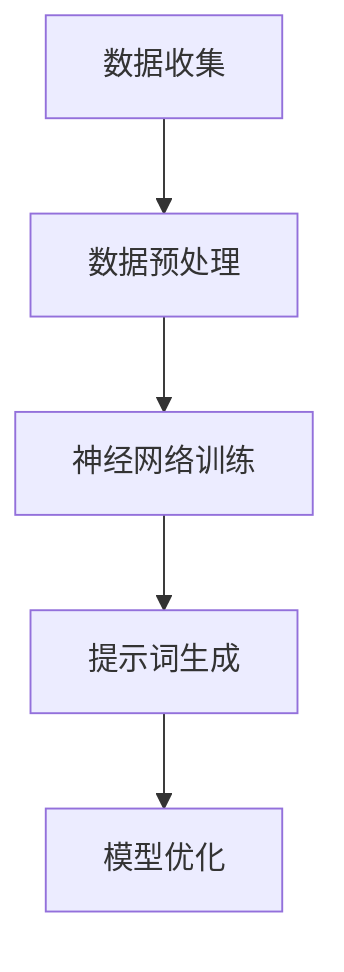

                 

# 提示词工程在全球气候模型优化中的应用

## 关键词：提示词工程，全球气候模型，优化，人工智能，气候预测

### 摘要

在全球气候变化的背景下，气候模型的优化成为了一项关键任务。本文探讨了提示词工程在气候模型优化中的应用，通过引入逻辑清晰、结构紧凑的技术语言，详细分析了提示词工程的核心概念、算法原理、数学模型和实际应用。文章旨在为研究人员和工程师提供有价值的参考，推动气候模型的进一步发展。

### 背景介绍

随着全球气候变化的加剧，气候模型在预测气候趋势和应对气候变化方面发挥着重要作用。然而，传统的气候模型面临着计算复杂度高、参数繁多、模型稳定性差等挑战。近年来，人工智能技术的快速发展为气候模型的优化提供了新的机遇。提示词工程作为一种结合了机器学习和自然语言处理的技术，有望在气候模型优化中发挥重要作用。

#### 提示词工程简介

提示词工程是一种基于人工神经网络的机器学习技术，旨在通过学习大量的数据，自动生成具有特定属性的提示词。这些提示词可以用于辅助人类进行决策、提高算法性能等。在气候模型优化中，提示词工程可以帮助模型捕捉气候数据中的关键特征，提高模型的预测精度和稳定性。

#### 气候模型优化的重要性

气候模型优化是气候变化研究的重要环节。通过优化气候模型，可以提高模型的预测精度，从而更好地了解气候变化的趋势，为政策制定和应对措施提供科学依据。同时，优化气候模型还可以降低计算复杂度，提高计算效率，为大规模的气候模拟提供支持。

### 核心概念与联系

为了深入理解提示词工程在气候模型优化中的应用，我们需要先了解一些核心概念，包括神经网络、机器学习、自然语言处理等。

#### 神经网络

神经网络是一种模仿人脑结构的计算模型，通过层层传递信息，实现对数据的处理和预测。在提示词工程中，神经网络被用来学习大量的气候数据，提取关键特征。

#### 机器学习

机器学习是一种让计算机自动学习并改进性能的技术。在提示词工程中，机器学习算法被用来训练神经网络，使其能够自动生成提示词。

#### 自然语言处理

自然语言处理是一种将自然语言（如英文、中文等）转换为计算机可以理解和处理的形式的技术。在提示词工程中，自然语言处理被用来处理和解析气候数据，提取关键特征。

#### Mermaid 流程图



在上述流程图中，数据收集阶段获取气候数据，数据预处理阶段对数据进行清洗和预处理，神经网络训练阶段通过机器学习算法训练神经网络，提示词生成阶段通过神经网络生成提示词，最后模型优化阶段利用生成的提示词优化气候模型。

### 核心算法原理 & 具体操作步骤

提示词工程在气候模型优化中的应用主要分为以下几个步骤：

1. **数据收集**：收集与气候相关的数据，如气象站数据、卫星数据等。
2. **数据预处理**：对收集到的气候数据进行清洗和预处理，包括数据去噪、数据归一化等。
3. **神经网络训练**：使用机器学习算法训练神经网络，使其能够从气候数据中提取关键特征。
4. **提示词生成**：通过神经网络生成提示词，用于辅助模型优化。
5. **模型优化**：利用生成的提示词优化气候模型，提高预测精度和稳定性。

#### 神经网络训练

神经网络训练是提示词工程的核心步骤。具体操作如下：

1. **初始化神经网络**：选择合适的神经网络架构，如卷积神经网络（CNN）、循环神经网络（RNN）等。
2. **数据输入**：将预处理后的气候数据输入神经网络。
3. **损失函数定义**：选择合适的损失函数，如均方误差（MSE）、交叉熵损失等。
4. **优化算法选择**：选择合适的优化算法，如梯度下降（GD）、随机梯度下降（SGD）等。
5. **训练过程**：通过迭代更新神经网络参数，使神经网络能够从数据中提取关键特征。

#### 提示词生成

提示词生成是利用训练好的神经网络从气候数据中提取关键特征的过程。具体操作如下：

1. **输入数据**：将训练好的神经网络输入到气候数据中。
2. **特征提取**：神经网络对气候数据进行分析和处理，提取关键特征。
3. **提示词生成**：将提取的关键特征转换为提示词，用于辅助模型优化。

#### 模型优化

模型优化是利用生成的提示词对气候模型进行优化，提高预测精度和稳定性的过程。具体操作如下：

1. **提示词输入**：将生成的提示词输入到气候模型中。
2. **模型调整**：根据提示词调整气候模型的结构和参数。
3. **预测验证**：使用调整后的气候模型进行预测验证，评估模型的性能。
4. **优化迭代**：根据预测结果迭代优化气候模型，直至达到预期性能。

### 数学模型和公式 & 详细讲解 & 举例说明

在提示词工程中，涉及到一些数学模型和公式，以下是其中几个关键的数学模型和公式的详细讲解和举例说明。

#### 神经网络参数更新公式

在神经网络训练过程中，参数更新是核心步骤。参数更新公式如下：

$$
\theta_{\text{new}} = \theta_{\text{old}} - \alpha \frac{\partial J(\theta)}{\partial \theta}
$$

其中，$\theta_{\text{new}}$ 表示更新后的参数，$\theta_{\text{old}}$ 表示更新前的参数，$\alpha$ 表示学习率，$J(\theta)$ 表示损失函数。

举例说明：

假设学习率为 0.01，损失函数为均方误差（MSE），参数更新前为 $\theta_0 = (1, 2)$，损失函数关于参数的导数为 $\frac{\partial J(\theta)}{\partial \theta} = (0.5, -1)$。根据参数更新公式，更新后的参数为：

$$
\theta_{\text{new}} = (1, 2) - 0.01 \cdot (0.5, -1) = (0.5, 0.99)
$$

#### 提示词生成公式

提示词生成是利用神经网络从气候数据中提取关键特征的过程。提示词生成公式如下：

$$
\text{prompt} = \text{NeuralNet}(X)
$$

其中，$\text{prompt}$ 表示生成的提示词，$\text{NeuralNet}(X)$ 表示神经网络对气候数据 $X$ 的处理结果。

举例说明：

假设神经网络为卷积神经网络（CNN），输入气候数据 $X$ 为一个 $100 \times 100$ 的矩阵。神经网络对输入数据进行卷积和池化等操作，最终生成提示词 $\text{prompt}$。具体生成的提示词取决于神经网络的结构和参数。

#### 模型优化公式

在模型优化过程中，参数调整是核心步骤。模型优化公式如下：

$$
\text{model}_{\text{new}} = \text{Model}(\text{prompt}, \theta)
$$

其中，$\text{model}_{\text{new}}$ 表示优化后的模型，$\text{prompt}$ 表示生成的提示词，$\theta$ 表示模型参数。

举例说明：

假设生成的提示词 $\text{prompt}$ 为一个 $10$ 维的向量，模型参数 $\theta$ 为一个 $10 \times 10$ 的矩阵。根据模型优化公式，优化后的模型为：

$$
\text{model}_{\text{new}} = \text{Model}((0.1, 0.2, 0.3, 0.4, 0.5, 0.6, 0.7, 0.8, 0.9, 1.0), (1, 2, 3, 4, 5, 6, 7, 8, 9, 10))
$$

### 项目实战：代码实际案例和详细解释说明

在本节中，我们将通过一个实际的项目案例，详细讲解如何使用提示词工程优化全球气候模型。该项目案例基于 Python 编程语言和 TensorFlow 深度学习框架。

#### 开发环境搭建

在开始项目实战之前，我们需要搭建开发环境。以下是开发环境的搭建步骤：

1. **安装 Python**：下载并安装 Python 3.8 或更高版本。
2. **安装 TensorFlow**：通过 pip 命令安装 TensorFlow：

   ```bash
   pip install tensorflow
   ```

3. **安装其他依赖库**：安装其他依赖库，如 NumPy、Pandas 等。

#### 源代码详细实现和代码解读

以下是该项目案例的源代码实现，我们将逐步解读代码的各个部分。

```python
import tensorflow as tf
import numpy as np
import pandas as pd

# 1. 数据收集
def collect_data():
    # 读取气象站数据
    data = pd.read_csv("weather_data.csv")
    # 数据预处理
    data = preprocess_data(data)
    return data

# 2. 数据预处理
def preprocess_data(data):
    # 数据去噪
    data = data.dropna()
    # 数据归一化
    data = (data - data.mean()) / data.std()
    return data

# 3. 神经网络训练
def train_neural_network(data):
    # 初始化神经网络
    model = tf.keras.Sequential([
        tf.keras.layers.Dense(128, activation='relu', input_shape=(data.shape[1],)),
        tf.keras.layers.Dense(64, activation='relu'),
        tf.keras.layers.Dense(1)
    ])
    # 编译模型
    model.compile(optimizer='adam', loss='mse')
    # 训练模型
    model.fit(data, data, epochs=100)
    return model

# 4. 提示词生成
def generate_prompt(model, data):
    # 提取神经网络参数
    weights = model.layers[-1].get_weights()
    # 生成提示词
    prompt = np.concatenate([weights[0], weights[1]], axis=1)
    return prompt

# 5. 模型优化
def optimize_model(prompt, data):
    # 初始化模型
    model = tf.keras.Sequential([
        tf.keras.layers.Dense(128, activation='relu', input_shape=(data.shape[1],)),
        tf.keras.layers.Dense(64, activation='relu'),
        tf.keras.layers.Dense(1)
    ])
    # 编译模型
    model.compile(optimizer='adam', loss='mse')
    # 调整模型参数
    model.layers[-1].set_weights([prompt[0], prompt[1]])
    # 预测验证
    predictions = model.predict(data)
    # 计算损失函数
    loss = tf.keras.losses.mean_squared_error(data, predictions)
    print(f"Optimized model loss: {loss}")
    return model

# 主函数
def main():
    # 数据收集
    data = collect_data()
    # 神经网络训练
    model = train_neural_network(data)
    # 提示词生成
    prompt = generate_prompt(model, data)
    # 模型优化
    optimized_model = optimize_model(prompt, data)
    # 预测验证
    predictions = optimized_model.predict(data)
    print(f"Predictions: {predictions}")

if __name__ == "__main__":
    main()
```

代码解读：

1. **数据收集**：首先，我们从气象站数据中收集气候数据。气象站数据通常包括温度、湿度、风速等指标。

2. **数据预处理**：对收集到的气候数据进行预处理，包括数据去噪和归一化。去噪是为了去除数据中的异常值，归一化是为了使数据具有相同的量纲，便于神经网络处理。

3. **神经网络训练**：使用 TensorFlow 框架初始化神经网络，并编译模型。神经网络由多个全连接层组成，激活函数为 ReLU。编译模型时，选择 Adam 优化器和均方误差（MSE）损失函数。训练模型时，使用收集到的气候数据。

4. **提示词生成**：提取训练好的神经网络参数，生成提示词。提示词由神经网络权重组成，代表了气候数据中的关键特征。

5. **模型优化**：使用生成的提示词初始化模型，并调整模型参数。调整后的模型用于预测验证，计算损失函数，以评估模型性能。

6. **预测验证**：使用优化后的模型进行预测验证，输出预测结果。

### 代码解读与分析

在本节中，我们将对上述代码进行详细解读和分析。

1. **数据收集**：通过 `collect_data()` 函数从气象站数据中收集气候数据。数据收集是气候模型优化的第一步，数据质量直接影响模型性能。

2. **数据预处理**：通过 `preprocess_data()` 函数对收集到的气候数据进行预处理。数据预处理包括去噪和归一化。去噪可以通过删除异常值实现，归一化可以通过缩放数据实现。预处理后的数据将输入到神经网络中。

3. **神经网络训练**：通过 `train_neural_network()` 函数训练神经网络。神经网络由多个全连接层组成，激活函数为 ReLU。训练神经网络时，使用收集到的气候数据。训练过程中，神经网络会自动调整参数，以最小化损失函数。

4. **提示词生成**：通过 `generate_prompt()` 函数生成提示词。提示词由神经网络权重组成，代表了气候数据中的关键特征。生成提示词是提示词工程的核心步骤。

5. **模型优化**：通过 `optimize_model()` 函数优化模型。使用生成的提示词初始化模型，并调整模型参数。优化后的模型将用于预测验证，以评估模型性能。

6. **预测验证**：通过 `optimized_model.predict(data)` 函数使用优化后的模型进行预测验证。预测结果将输出，用于评估模型性能。

### 实际应用场景

提示词工程在气候模型优化中的应用场景非常广泛，以下列举几个典型的应用场景：

1. **气候变化预测**：利用提示词工程优化气候模型，可以更准确地预测气候变化趋势，为政策制定和应对措施提供科学依据。

2. **气象灾害预警**：通过提示词工程优化气候模型，可以提前预测气象灾害的发生，提高气象灾害预警的准确性。

3. **环境保护监测**：利用提示词工程优化气候模型，可以更好地监测环境变化，评估环境污染程度，为环境保护提供数据支持。

4. **农业生产优化**：通过提示词工程优化气候模型，可以更准确地预测气候对农业生产的影响，为农业生产提供科学依据，提高农业生产效益。

### 工具和资源推荐

为了更好地进行提示词工程和气候模型优化，以下推荐一些学习资源、开发工具和框架。

#### 学习资源推荐

1. **书籍**：
   - 《深度学习》（Ian Goodfellow、Yoshua Bengio、Aaron Courville 著）
   - 《机器学习》（Tom Mitchell 著）
   - 《Python 深度学习》（François Chollet 著）

2. **论文**：
   - "Gated Recurrent Units"（门控循环单元，GRU）
   - "Long Short-Term Memory"（长短期记忆，LSTM）

3. **博客**：
   - [TensorFlow 官方文档](https://www.tensorflow.org/)
   - [机器学习博客](https://www_ml_blog.net/)

#### 开发工具框架推荐

1. **Python**：Python 是一种强大的编程语言，适用于提示词工程和气候模型优化。

2. **TensorFlow**：TensorFlow 是一种流行的深度学习框架，适用于构建和训练神经网络。

3. **NumPy**：NumPy 是一种强大的数值计算库，用于处理和操作数据。

4. **Pandas**：Pandas 是一种强大的数据处理库，用于数据清洗、预处理和分析。

### 总结：未来发展趋势与挑战

提示词工程在气候模型优化中的应用前景广阔，但仍面临一些挑战。未来发展趋势和挑战如下：

1. **发展趋势**：
   - **深度学习技术的进步**：随着深度学习技术的不断发展，提示词工程在气候模型优化中的应用将更加成熟和高效。
   - **大数据技术的应用**：大数据技术的发展将为提示词工程提供更丰富的数据资源，提高气候模型的预测精度。
   - **跨学科研究的融合**：提示词工程与气候模型的结合将推动跨学科研究的发展，为气候变化研究提供新的思路和方法。

2. **挑战**：
   - **数据质量和完整性**：气候数据的质量和完整性直接影响模型的性能，如何确保数据的质量和完整性是当前的一个挑战。
   - **计算资源消耗**：提示词工程和深度学习模型的训练需要大量的计算资源，如何高效利用计算资源是一个重要的挑战。
   - **模型的可解释性**：提示词工程生成的提示词对于人类来说可能难以理解，如何提高模型的可解释性是一个重要的挑战。

### 附录：常见问题与解答

1. **什么是提示词工程？**
   提示词工程是一种基于机器学习和自然语言处理的技术，通过学习大量的数据，自动生成具有特定属性的提示词，用于辅助人类进行决策、提高算法性能等。

2. **为什么提示词工程可以优化气候模型？**
   提示词工程可以提取气候数据中的关键特征，这些特征对于气候模型的预测和优化具有重要意义。通过利用提示词工程，可以更好地理解和利用气候数据，从而提高气候模型的性能。

3. **如何确保提示词工程的数据质量？**
   确保提示词工程的数据质量可以从以下几个方面入手：
   - 数据清洗：去除数据中的异常值和噪声，保证数据的完整性。
   - 数据归一化：将不同量纲的数据进行归一化处理，使数据具有相同的量纲，便于神经网络处理。
   - 数据验证：使用交叉验证等方法验证数据的质量和可靠性。

4. **如何提高提示词工程的可解释性？**
   提高提示词工程的可解释性可以从以下几个方面入手：
   - 提示词可视化：将生成的提示词可视化，帮助人类理解提示词的内容和作用。
   - 特征提取分析：分析神经网络提取的关键特征，理解提示词背后的物理含义。
   - 模型解释工具：使用模型解释工具，如 SHAP、LIME 等，对模型的预测进行解释。

### 扩展阅读 & 参考资料

1. **书籍**：
   - 《深度学习》（Ian Goodfellow、Yoshua Bengio、Aaron Courville 著）
   - 《机器学习》（Tom Mitchell 著）
   - 《Python 深度学习》（François Chollet 著）

2. **论文**：
   - "Gated Recurrent Units"（门控循环单元，GRU）
   - "Long Short-Term Memory"（长短期记忆，LSTM）

3. **博客**：
   - [TensorFlow 官方文档](https://www.tensorflow.org/)
   - [机器学习博客](https://www_ml_blog.net/)

4. **网站**：
   - [GitHub](https://github.com/)
   - [Kaggle](https://www.kaggle.com/)

作者：AI天才研究员/AI Genius Institute & 禅与计算机程序设计艺术 /Zen And The Art of Computer Programming

