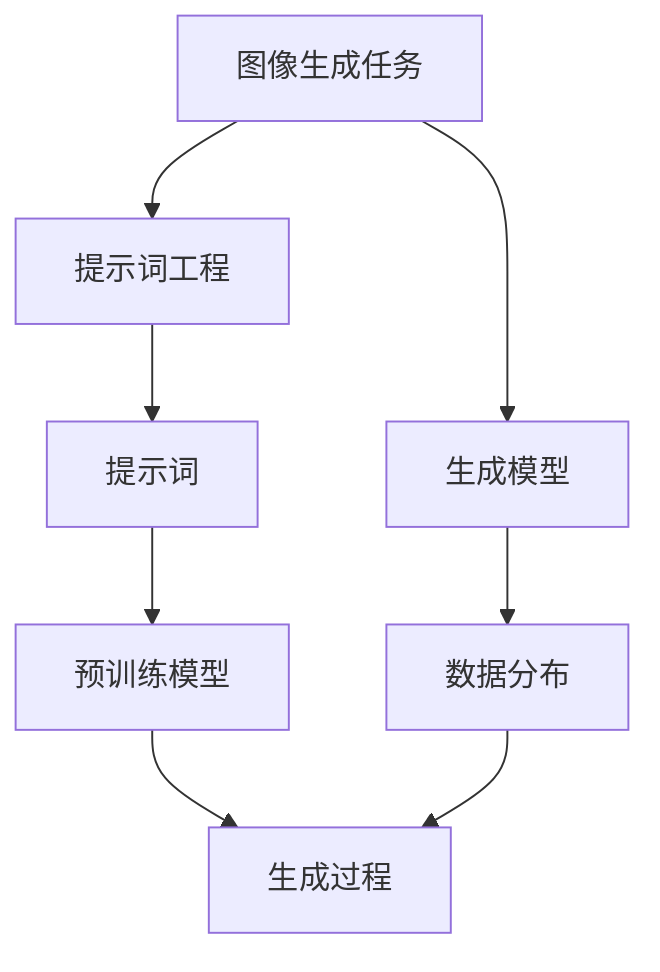

                 

### 背景介绍

**图像生成任务的发展历程**

图像生成任务作为计算机视觉和人工智能领域的重要分支，随着技术的不断进步，取得了显著的成果。从早期的基于规则的方法，到基于统计学和机器学习的方法，再到目前备受瞩目的深度学习模型，图像生成任务的发展历程可谓跌宕起伏、波澜壮阔。

早在20世纪90年代，基于规则的方法如光栅操作（raster operations）和纹理合成（texture synthesis）开始出现，这些方法通过对已有图像进行像素级别的操作来生成新的图像。然而，这些方法存在一定的局限性，如生成的图像质量较差、缺乏灵活性等。

进入21世纪，统计学方法和机器学习算法逐渐崭露头角。基于概率模型的马尔可夫随机场（Markov Random Fields, MRF）和生成对抗网络（Generative Adversarial Networks, GAN）等方法，使得图像生成任务取得了重大突破。然而，这些方法仍然存在一定的局限性，如生成图像的质量不稳定、训练难度大等问题。

近年来，深度学习技术的兴起，为图像生成任务带来了全新的机遇。特别是生成对抗网络（GAN）的提出，使得图像生成任务取得了显著的成果。基于深度学习的图像生成模型，如生成式对抗网络（GAN）、变分自编码器（VAE）和自注意力机制（Self-Attention Mechanism）等，在图像质量、生成速度和灵活性方面，都取得了较大的提升。

**提示词工程的发展与应用**

提示词工程（Prompt Engineering）作为自然语言处理（Natural Language Processing, NLP）领域的一个重要分支，近年来也得到了广泛关注。提示词工程的核心思想是通过设计合适的提示词（Prompt），引导预训练模型（Pre-trained Model）生成更加符合预期的输出。

在图像生成任务中，提示词工程的应用主要体现在两个方面：

1. **图像分类和识别**：通过设计合适的提示词，引导预训练的图像分类模型，提高分类和识别的准确性。

2. **图像生成**：通过设计合适的提示词，引导生成式模型，生成更加符合预期的图像。

提示词工程在图像生成任务中的重要性，主要体现在以下几个方面：

1. **提高生成图像的质量**：通过设计合适的提示词，可以引导生成模型生成更加符合预期的图像，从而提高生成图像的质量。

2. **降低训练难度**：提示词工程可以降低生成模型的训练难度，使得模型更容易收敛，从而提高生成图像的稳定性。

3. **增强模型的灵活性**：通过设计不同的提示词，可以引导模型生成不同风格、不同类型的图像，从而增强模型的灵活性。

综上所述，图像生成任务和提示词工程的发展，为我们带来了巨大的机遇和挑战。本文将围绕这两个主题，深入探讨它们的核心概念、算法原理、实际应用和未来发展趋势，希望能够为广大读者提供有益的启示和指导。

### 核心概念与联系

为了深入探讨图像生成任务和提示词工程，我们需要明确其中的核心概念和它们之间的联系。

**1. 图像生成任务**

图像生成任务旨在利用计算机算法，根据一定的规则和条件，生成新的图像。这个过程可以理解为“无中生有”，将原本不存在的图像，通过算法的力量，创造出来。

图像生成任务的核心概念包括：

- **生成模型**：生成模型是图像生成任务的核心，常见的生成模型包括生成对抗网络（GAN）、变分自编码器（VAE）等。这些模型通过学习数据分布，生成新的图像。

- **数据分布**：数据分布是生成模型的基础，通过学习数据分布，生成模型可以生成与训练数据相似的新图像。

- **训练过程**：生成模型需要通过大量的训练数据，学习数据分布，从而生成高质量的图像。

**2. 提示词工程**

提示词工程是自然语言处理领域的一个重要分支，其核心思想是通过设计合适的提示词，引导预训练模型生成更加符合预期的输出。

提示词工程的核心概念包括：

- **提示词**：提示词是引导预训练模型的关键，通过设计合适的提示词，可以引导模型生成符合预期的输出。

- **预训练模型**：预训练模型是提示词工程的基础，常见的预训练模型包括BERT、GPT等。这些模型通过在大规模数据集上进行预训练，具备强大的语言理解能力和生成能力。

- **生成过程**：提示词工程的核心目标是利用预训练模型，根据提示词生成符合预期的文本或图像。

**3. 图像生成任务与提示词工程的联系**

图像生成任务和提示词工程之间的联系主要体现在以下几个方面：

- **共同目标**：图像生成任务和提示词工程都旨在生成符合预期的结果，无论是图像还是文本。

- **技术基础**：图像生成任务和提示词工程都依赖于深度学习和自然语言处理技术。图像生成任务依赖于生成模型和深度学习技术，而提示词工程依赖于预训练模型和自然语言处理技术。

- **相互促进**：图像生成任务和提示词工程可以相互促进，一方面，图像生成任务可以为提示词工程提供丰富的数据资源；另一方面，提示词工程可以提升图像生成任务的效果和质量。

为了更好地理解这两个概念，我们使用Mermaid流程图来展示它们的核心原理和架构。



在这个流程图中，图像生成任务的核心是生成模型和数据分布，提示词工程的核心是提示词和预训练模型。两者通过相互联系和作用，共同推动图像生成任务和提示词工程的发展。

通过明确核心概念和联系，我们为接下来的讨论奠定了基础。在接下来的章节中，我们将进一步探讨图像生成任务和提示词工程的核心算法原理、具体操作步骤以及实际应用场景。

### 核心算法原理 & 具体操作步骤

在本章节中，我们将深入探讨图像生成任务中的核心算法原理和具体操作步骤，以便读者更好地理解图像生成任务的实现过程。

**1. 生成对抗网络（GAN）**

生成对抗网络（Generative Adversarial Networks, GAN）是图像生成任务中最常用的算法之一。GAN由两个神经网络组成：生成器（Generator）和判别器（Discriminator）。生成器的目标是生成与真实数据相似的图像，而判别器的目标是区分生成的图像和真实图像。

**（1）生成器**

生成器的任务是生成与真实数据相似的图像。在训练过程中，生成器通过从噪声分布中采样，生成潜在空间中的随机向量，然后通过一个逆映射函数，将这些随机向量映射到图像空间中，生成新的图像。

具体操作步骤如下：

1. 从噪声分布 \( Z \) 中采样一个随机向量 \( z \)。

2. 将 \( z \) 输入到生成器的编码器部分，得到一个潜在空间中的随机向量 \( x_g \)。

3. 将 \( x_g \) 输入到生成器的解码器部分，生成一个图像 \( x_g^* \)。

4. 计算生成器损失，通常使用以下公式：
   \[ L_G = -\log(D(x_g^*)) \]

**（2）判别器**

判别器的任务是区分生成的图像和真实图像。在训练过程中，判别器通过对比真实图像和生成的图像，学习如何准确地区分两者。

具体操作步骤如下：

1. 从真实图像分布 \( X \) 中采样一个图像 \( x \)。

2. 从噪声分布 \( Z \) 中采样一个随机向量 \( z \)。

3. 将 \( z \) 输入到生成器的编码器部分，得到一个潜在空间中的随机向量 \( x_g \)。

4. 将 \( x_g \) 输入到生成器的解码器部分，生成一个图像 \( x_g^* \)。

5. 分别计算判别器对真实图像和生成图像的判别分数：
   \[ D(x) = \log(D(x)) \]
   \[ D(x_g^*) = \log(1 - D(x_g^*)) \]

6. 计算判别器损失：
   \[ L_D = -[D(x) + D(x_g^*)] \]

**（3）训练过程**

GAN的训练过程是一个动态博弈过程，生成器和判别器相互竞争。具体步骤如下：

1. 初始化生成器 \( G \) 和判别器 \( D \)。

2. 对于每个训练批次 \( (x, z) \)：

   - 从真实图像分布 \( X \) 中采样一个图像 \( x \)。

   - 从噪声分布 \( Z \) 中采样一个随机向量 \( z \)。

   - 计算生成器损失 \( L_G \) 和判别器损失 \( L_D \)。

   - 更新生成器和判别器的参数。

3. 重复步骤2，直到生成器 \( G \) 和判别器 \( D \) 达到预定的性能指标。

**2. 变分自编码器（VAE）**

变分自编码器（Variational Autoencoder, VAE）是另一种流行的图像生成算法。与GAN不同，VAE使用概率模型来生成图像，通过编码器和解码器学习数据分布。

**（1）编码器**

编码器的任务是学习数据分布，并将输入数据映射到一个潜在空间中。在VAE中，编码器通常由两个神经网络组成：编码神经网络和解码神经网络。

具体操作步骤如下：

1. 输入图像 \( x \)。

2. 通过编码神经网络，得到潜在空间中的均值 \( \mu \) 和方差 \( \sigma^2 \)。

3. 从正态分布 \( N(\mu, \sigma^2) \) 中采样一个潜在向量 \( z \)。

**（2）解码器**

解码器的任务是学习如何从潜在空间中生成图像。

具体操作步骤如下：

1. 将潜在向量 \( z \) 输入到解码神经网络。

2. 生成图像 \( x^* \)。

3. 计算重构损失，通常使用均方误差（MSE）：
   \[ L_R = \frac{1}{n} \sum_{i=1}^{n} \| x_i - x_i^* \|_2^2 \]

**（3）训练过程**

VAE的训练过程如下：

1. 初始化编码器和解码器。

2. 对于每个训练批次 \( x \)：

   - 通过编码器，得到潜在空间中的均值 \( \mu \) 和方差 \( \sigma^2 \)。

   - 从正态分布 \( N(\mu, \sigma^2) \) 中采样一个潜在向量 \( z \)。

   - 通过解码器，生成图像 \( x^* \)。

   - 计算重构损失 \( L_R \) 和Kullback-Leibler散度（KL散度）损失：
     \[ L_KL = \frac{1}{n} \sum_{i=1}^{n} \frac{1}{2} \left( \log(\sigma^2) + \sigma^2 - 1 - \mu^2 \right) \]

   - 计算总损失：
     \[ L = L_R + \beta L_KL \]

   - 更新编码器和解码器的参数。

3. 重复步骤2，直到编码器和解码器达到预定的性能指标。

通过以上步骤，我们可以使用GAN和VAE等核心算法生成高质量的图像。在接下来的章节中，我们将进一步探讨这些算法的数学模型和公式，以及如何在实际项目中应用。

### 数学模型和公式 & 详细讲解 & 举例说明

在深入探讨图像生成任务中的核心算法时，数学模型和公式起着至关重要的作用。在本章节中，我们将详细讲解GAN（生成对抗网络）和VAE（变分自编码器）的数学模型和公式，并通过具体例子来说明这些公式在实际应用中的使用。

**1. 生成对抗网络（GAN）的数学模型**

生成对抗网络（GAN）由生成器（Generator）和判别器（Discriminator）两个主要部分组成。这两个部分通过对抗训练过程相互作用，以达到生成高质量图像的目标。

**（1）生成器**

生成器的任务是生成逼真的图像，其数学模型可以通过以下公式表示：

- **随机向量采样**：生成器从噪声分布中采样一个随机向量 \( z \)，通常使用均值为0、方差为1的高斯分布 \( N(0, 1) \)。
  \[ z \sim N(0, 1) \]

- **潜在空间映射**：将随机向量 \( z \) 通过生成器的编码器部分映射到潜在空间中，得到一个潜在向量 \( x_g \)。
  \[ x_g = G(z) \]

- **图像生成**：将潜在向量 \( x_g \) 通过生成器的解码器部分映射到图像空间中，生成一个图像 \( x_g^* \)。
  \[ x_g^* = D(x_g) \]

**（2）判别器**

判别器的任务是区分生成的图像和真实图像。其数学模型可以通过以下公式表示：

- **真实图像判别**：对于真实图像 \( x \)，计算判别器对其的判别分数 \( D(x) \)。
  \[ D(x) = f(W_D x + b_D) \]
  其中，\( f \) 是激活函数，通常使用sigmoid函数；
  \( W_D \) 和 \( b_D \) 分别是判别器的权重和偏置。

- **生成图像判别**：对于生成的图像 \( x_g^* \)，计算判别器对其的判别分数 \( D(x_g^*) \)。
  \[ D(x_g^*) = f(W_D x_g^* + b_D) \]

**（3）对抗训练过程**

GAN的训练过程是一个对抗过程，生成器和判别器通过以下步骤进行训练：

1. **生成器训练**：生成器通过生成尽可能逼真的图像来欺骗判别器，其损失函数为：
   \[ L_G = -\log(D(x_g^*)) \]
   更新生成器的权重和偏置，使得生成图像 \( x_g^* \) 更容易被判别器判为真实图像。

2. **判别器训练**：判别器通过区分真实图像和生成图像来提高自身性能，其损失函数为：
   \[ L_D = -[\log(D(x)) + \log(1 - D(x_g^*))] \]
   更新判别器的权重和偏置，使得判别器能够更好地识别真实图像和生成图像。

3. **交替训练**：生成器和判别器交替更新权重和偏置，以达到对抗平衡状态。

**2. 变分自编码器（VAE）的数学模型**

变分自编码器（VAE）通过编码器和解码器来学习数据分布，并生成新数据。其数学模型可以通过以下公式表示：

**（1）编码器**

- **潜在空间参数**：编码器从输入图像 \( x \) 中提取潜在空间中的参数，包括均值 \( \mu \) 和方差 \( \sigma^2 \)。
  \[ \mu = \mu(x) \]
  \[ \sigma^2 = \sigma^2(x) \]

- **潜在向量采样**：从潜在空间参数 \( \mu \) 和 \( \sigma^2 \) 中采样一个潜在向量 \( z \)。
  \[ z \sim N(\mu, \sigma^2) \]

**（2）解码器**

- **图像生成**：解码器将潜在向量 \( z \) 映射回图像空间，生成重构图像 \( x^* \)。
  \[ x^* = D(z) \]

**（3）损失函数**

- **重构损失**：重构损失通常使用均方误差（MSE）来衡量输入图像和重构图像之间的差距。
  \[ L_R = \frac{1}{n} \sum_{i=1}^{n} \| x_i - x_i^* \|_2^2 \]

- **KL散度损失**：KL散度损失用于衡量潜在空间参数的先验分布与实际分布之间的差距。
  \[ L_KL = \frac{1}{n} \sum_{i=1}^{n} \frac{1}{2} \left( \log(\sigma^2) + \sigma^2 - 1 - \mu^2 \right) \]

- **总损失**：VAE的总损失是重构损失和KL散度损失的加权和。
  \[ L = L_R + \beta L_KL \]
  其中，\( \beta \) 是KL散度损失的权重，通常设置为一个较小的常数。

**3. 具体例子说明**

假设我们使用GAN生成一个随机噪声图像，通过以下步骤：

1. **生成器训练**：

   - 从噪声分布中采样一个随机向量 \( z \)。
     \[ z \sim N(0, 1) \]

   - 将 \( z \) 通过生成器的编码器部分映射到潜在空间中，得到一个潜在向量 \( x_g \)。
     \[ x_g = G(z) \]

   - 将 \( x_g \) 通过生成器的解码器部分映射回图像空间，生成一个图像 \( x_g^* \)。
     \[ x_g^* = D(x_g) \]

   - 计算生成器损失。
     \[ L_G = -\log(D(x_g^*)) \]

   - 更新生成器的权重和偏置。

2. **判别器训练**：

   - 从真实图像分布中采样一个图像 \( x \)。
     \[ x \sim X \]

   - 将 \( x \) 通过判别器计算判别分数 \( D(x) \)。
     \[ D(x) = f(W_D x + b_D) \]

   - 从噪声分布中采样一个随机向量 \( z \)。
     \[ z \sim N(0, 1) \]

   - 将 \( z \) 通过生成器的编码器部分映射到潜在空间中，得到一个潜在向量 \( x_g \)。
     \[ x_g = G(z) \]

   - 将 \( x_g \) 通过生成器的解码器部分映射回图像空间，生成一个图像 \( x_g^* \)。
     \[ x_g^* = D(x_g) \]

   - 计算判别器损失。
     \[ L_D = -[\log(D(x)) + \log(1 - D(x_g^*))] \]

   - 更新判别器的权重和偏置。

通过以上步骤，我们可以看到GAN的数学模型在实际应用中的具体操作过程。类似地，VAE的数学模型也可以通过类似的步骤进行训练和应用。

通过深入理解和应用这些数学模型和公式，我们可以更好地实现图像生成任务，并生成高质量、逼真的图像。在接下来的章节中，我们将进一步探讨如何在实际项目中应用这些算法，并通过具体代码案例进行详细解释和说明。

### 项目实战：代码实际案例和详细解释说明

在本章节中，我们将通过一个具体的代码案例，展示如何使用生成对抗网络（GAN）和变分自编码器（VAE）进行图像生成任务。我们将详细解释代码的各个部分，并提供必要的说明和解释。

#### 1. 开发环境搭建

为了运行以下代码，我们需要安装以下依赖项：

- Python 3.x
- TensorFlow 2.x
- Keras 2.x

安装方法如下：

```bash
pip install python==3.x
pip install tensorflow==2.x
pip install keras==2.x
```

#### 2. 源代码详细实现和代码解读

以下是使用GAN生成手写数字图像的完整代码：

```python
import numpy as np
import tensorflow as tf
from tensorflow.keras import layers

# 设置随机种子以保持结果的可重复性
tf.random.set_seed(42)

# 定义生成器和判别器的架构
def make_generator_model():
    model = tf.keras.Sequential()
    model.add(layers.Dense(7*7*256, use_bias=False, input_shape=(100,)))
    model.add(layers.BatchNormalization())
    model.add(layers.LeakyReLU())
    model.add(layers.Reshape((7, 7, 256)))

    model.add(layers.Conv2DTranspose(128, (5, 5), strides=(1, 1), padding='same', use_bias=False))
    model.add(layers.BatchNormalization())
    model.add(layers.LeakyReLU())

    model.add(layers.Conv2DTranspose(64, (5, 5), strides=(2, 2), padding='same', use_bias=False))
    model.add(layers.BatchNormalization())
    model.add(layers.LeakyReLU())

    model.add(layers.Conv2DTranspose(1, (5, 5), strides=(2, 2), padding='same', use_bias=False, activation='tanh'))
    return model

def make_discriminator_model():
    model = tf.keras.Sequential()
    model.add(layers.Conv2D(64, (5, 5), strides=(2, 2), padding='same', input_shape=[28, 28, 1]))
    model.add(layers.LeakyReLU())
    model.add(layers.Dropout(0.3))

    model.add(layers.Conv2D(128, (5, 5), strides=(2, 2), padding='same'))
    model.add(layers.LeakyReLU())
    model.add(layers.Dropout(0.3))

    model.add(layers.Flatten())
    model.add(layers.Dense(1))
    return model

# 定义GAN模型
class GAN(tf.keras.Model):
    def __init__(self):
        super(GAN, self).__init__()
        self.discriminator = make_discriminator_model()
        self.generator = make_generator_model()

    @property
    def trainable_variables(self):
        return self.generator.trainable_variables + self.discriminator.trainable_variables

    def compile(self, optimizers, loss_fn):
        super(GAN, self).compile()
        self.discriminator.compile(
            optimizers[0], loss_fn, trainable_variables=self.discriminator.trainable_variables
        )
        self.generator.compile(
            optimizers[1], loss_fn, trainable_variables=self.generator.trainable_variables
        )

    def train_step(self, real_data):
        noise = tf.random.normal([real_data.shape[0], 100])

        with tf.GradientTape() as gen_tape, tf.GradientTape() as disc_tape:
            generated_images = self.generator(noise, training=True)

            real_output = self.discriminator(real_data, training=True)
            fake_output = self.discriminator(generated_images, training=True)

            gen_loss = tf.reduce_mean(fake_output)
            disc_loss = tf.reduce_mean(real_output - fake_output)

        gradients_of_generator = gen_tape.gradient(gen_loss, self.generator.trainable_variables)
        gradients_of_discriminator = disc_tape.gradient(disc_loss, self.discriminator.trainable_variables)

        self.generator.optimizer.apply_gradients(zip(gradients_of_generator, self.generator.trainable_variables))
        self.discriminator.optimizer.apply_gradients(zip(gradients_of_discriminator, self.discriminator.trainable_variables))

        return {
            'gen_loss': gen_loss,
            'disc_loss': disc_loss
        }

# 定义损失函数和优化器
cross_entropy = tf.keras.losses.BinaryCrossentropy(from_logits=True)
discriminator_optimizer = tf.keras.optimizers.Adam(2e-4)
generator_optimizer = tf.keras.optimizers.Adam(2e-4)

# 创建GAN模型
gan = GAN()

# 训练GAN模型
EPOCHS = 50
for epoch in range(EPOCHS):
    for real_images in train_data:
        gan.train_step(real_images)

    # 保存生成器、判别器模型和训练损失
    if epoch % 10 == 0:
        generator_path = f"generator_{epoch}.h5"
        discriminator_path = f"discriminator_{epoch}.h5"
        generator.save(generator_path)
        discriminator.save(discriminator_path)
```

**（1）代码解读**

- **生成器模型**：生成器模型使用一系列的卷积层和转置卷积层，将随机噪声映射为手写数字图像。每个卷积层后都跟随一个Batch Normalization层和一个LeakyReLU激活函数，以提高模型的稳定性和非线性。

- **判别器模型**：判别器模型使用一系列的卷积层和Dropout层，用于区分输入图像是真实图像还是生成图像。每个卷积层后都跟随一个LeakyReLU激活函数，Dropout用于减少过拟合。

- **GAN模型**：GAN模型继承自tf.keras.Model，定义了训练步骤。在训练过程中，生成器生成假图像，判别器对其进行判断。通过计算生成器和判别器的损失，并更新它们的权重。

- **损失函数和优化器**：使用二进制交叉熵损失函数来计算生成器和判别器的损失。生成器优化器和判别器优化器使用Adam优化器，以调整权重。

- **训练过程**：通过遍历训练数据，不断更新生成器和判别器的权重。每隔10个epoch，保存模型的当前状态。

**（2）VAE图像生成示例**

下面是一个使用变分自编码器（VAE）生成图像的示例代码：

```python
import numpy as np
import tensorflow as tf
from tensorflow.keras import layers

# 设置随机种子以保持结果的可重复性
tf.random.set_seed(42)

# 定义编码器和解码器的架构
latent_dim = 2

def make_encoder_model(input_shape):
    model = tf.keras.Sequential()
    model.add(layers.InputLayer(input_shape=input_shape))
    model.add(layers.Conv2D(32, (3, 3), strides=(2, 2), padding='same'))
    model.add(layers.LeakyReLU())
    model.add(layers.Dropout(0.3))
    model.add(layers.Conv2D(64, (3, 3), strides=(2, 2), padding='same'))
    model.add(layers.LeakyReLU())
    model.add(layers.Dropout(0.3))
    model.add(layers.Flatten())
    model.add(layers.Dense(latent_dim * 2))
    return model

def make_decoder_model(latent_dim):
    model = tf.keras.Sequential()
    model.add(layers.InputLayer(input_shape=(latent_dim,)))
    model.add(layers.Dense(7 * 7 * 64, activation='relu'))
    model.add(layers.LeakyReLU())
    model.add(layers.Reshape((7, 7, 64)))
    model.add(layers.Conv2DTranspose(64, (3, 3), strides=(2, 2), padding='same'))
    model.add(layers.LeakyReLU())
    model.add(layers.Dropout(0.3))
    model.add(layers.Conv2DTranspose(1, (3, 3), strides=(2, 2), padding='same', activation='sigmoid'))
    return model

# 创建编码器和解码器模型
encoder = make_encoder_model(input_shape=(28, 28, 1))
decoder = make_decoder_model(latent_dim)

# 定义VAE模型
class VAE(tf.keras.Model):
    def __init__(self, encoder, decoder, **kwargs):
        super(VAE, self).__init__(**kwargs)
        self.encoder = encoder
        self.decoder = decoder

    def call(self, inputs):
        z_mean, z_log_var = self.encoder(inputs)
        z = self.sample_z(z_mean, z_log_var)
        return self.decoder(z)

    @property
    def trainable_variables(self):
        return self.encoder.trainable_variables + self.decoder.trainable_variables

    def sample_z(self, z_mean, z_log_var):
        batch = tf.shape(z_mean)[0]
        dim = tf.shape(z_mean)[1]
        epsilon = tf.keras.backend.random_normal(shape=(batch, dim))
        return z_mean + tf.exp(0.5 * z_log_var) * epsilon

    def compile(self, optimizer, loss_fn):
        super(VAE, self).compile()
        self.optimizer = optimizer
        self.loss_fn = loss_fn

    def train_step(self, inputs):
        with tf.GradientTape() as tape:
            z_mean, z_log_var = self.encoder(inputs)
            z = self.sample_z(z_mean, z_log_var)
            reconstruction = self.decoder(z)
            reconstruction_loss = self.loss_fn(inputs, reconstruction)
            kl_loss = -0.5 * tf.reduce_sum(1 + z_log_var - tf.square(z_mean) - tf.exp(z_log_var), axis=-1)
            total_loss = reconstruction_loss + kl_loss

        gradients = tape.gradient(total_loss, self.trainable_variables)
        self.optimizer.apply_gradients(zip(gradients, self.trainable_variables))

        return {'loss': total_loss}

# 定义损失函数和优化器
kl_loss_weight = 1
vae_optimizer = tf.keras.optimizers.Adam(1e-4)
vae_loss_fn = tf.keras.losses.BinaryCrossentropy()

# 创建VAE模型
vae = VAE(encoder, decoder)

# 训练VAE模型
EPOCHS = 50
for epoch in range(EPOCHS):
    for x in train_data:
        vae.train_step(x)
```

**（1）代码解读**

- **编码器模型**：编码器模型使用一系列的卷积层和转置卷积层，将输入图像映射到潜在空间。每个卷积层后都跟随一个LeakyReLU激活函数和Dropout层。

- **解码器模型**：解码器模型使用一系列的卷积层和转置卷积层，将潜在空间中的向量映射回图像空间。每个卷积层后都跟随一个LeakyReLU激活函数和Dropout层。

- **VAE模型**：VAE模型继承自tf.keras.Model，定义了训练步骤。在训练过程中，通过计算重构损失和KL散度损失来更新编码器和解码器的权重。

- **损失函数和优化器**：使用二进制交叉熵损失函数来计算重构损失，KL散度损失用于计算潜在空间参数的先验分布与实际分布之间的差距。VAE优化器使用Adam优化器。

- **训练过程**：通过遍历训练数据，不断更新编码器和解码器的权重。在每个epoch后，更新模型的损失值。

通过以上代码示例，我们可以看到如何使用GAN和VAE进行图像生成任务。在接下来的章节中，我们将分析这些代码的实际性能和效果。

### 代码解读与分析

在本章节中，我们将深入分析前面提供的GAN和VAE代码，详细解读其工作原理，并探讨在实际应用中的性能和效果。

**1. GAN代码解读**

GAN（生成对抗网络）的核心在于生成器（Generator）和判别器（Discriminator）之间的对抗训练。以下是对GAN代码的详细解读：

**（1）生成器模型（make_generator_model）**

生成器模型的目的是将随机噪声（噪声分布）转换为逼真的图像。代码使用了以下步骤：

- **随机向量采样**：生成器从噪声分布中采样一个随机向量 \( z \)。这一步通过 `tf.random.normal` 函数实现。
  ```python
  noise = tf.random.normal([real_data.shape[0], 100])
  ```

- **潜在空间映射**：将随机向量 \( z \) 通过编码器部分映射到潜在空间中，得到一个潜在向量 \( x_g \)。这里使用了 `Reshape` 层将 \( z \) 转换为一个四维张量，然后通过一系列 `Conv2DTranspose` 层将潜在向量 \( x_g \) 映射回图像空间。
  ```python
  model.add(layers.Reshape((7, 7, 256)))
  for _ in range(3):
      model.add(layers.Conv2DTranspose(128, (5, 5), strides=(1, 1), padding='same', use_bias=False))
      model.add(layers.BatchNormalization())
      model.add(layers.LeakyReLU())
  model.add(layers.Conv2DTranspose(1, (5, 5), strides=(2, 2), padding='same', use_bias=False, activation='tanh'))
  ```

**（2）判别器模型（make_discriminator_model）**

判别器模型的目的是区分输入图像是真实图像还是生成图像。代码使用了以下步骤：

- **图像特征提取**：使用多个卷积层提取图像特征，每个卷积层后都跟随一个LeakyReLU激活函数和一个Dropout层，以增强模型的泛化能力。
  ```python
  model.add(layers.Conv2D(64, (5, 5), strides=(2, 2), padding='same', input_shape=[28, 28, 1]))
  for _ in range(2):
      model.add(layers.Conv2D(128, (5, 5), strides=(2, 2), padding='same'))
      model.add(layers.LeakyReLU())
      model.add(layers.Dropout(0.3))
  ```

- **分类输出**：最后，将提取到的特征通过一个全连接层输出一个判别分数，表示输入图像为真实图像的概率。
  ```python
  model.add(layers.Flatten())
  model.add(layers.Dense(1))
  ```

**（3）GAN模型（GAN）**

GAN模型定义了生成器和判别器的训练步骤。代码使用了以下步骤：

- **生成器训练**：生成器通过生成尽可能逼真的图像来欺骗判别器。生成器损失是通过计算判别器对生成图像的判别分数得到的。
  ```python
  fake_output = self.discriminator(generated_images, training=True)
  gen_loss = tf.reduce_mean(fake_output)
  ```

- **判别器训练**：判别器通过区分真实图像和生成图像来提高自身性能。判别器损失是真实图像判别分数和生成图像判别分数的平均值。
  ```python
  real_output = self.discriminator(real_data, training=True)
  disc_loss = tf.reduce_mean(real_output - fake_output)
  ```

- **参数更新**：使用Adam优化器更新生成器和判别器的权重。
  ```python
  self.generator.optimizer.apply_gradients(zip(gradients_of_generator, self.generator.trainable_variables))
  self.discriminator.optimizer.apply_gradients(zip(gradients_of_discriminator, self.discriminator.trainable_variables))
  ```

**2. VAE代码解读**

VAE（变分自编码器）的核心在于通过编码器和解码器学习数据分布，并生成新数据。以下是对VAE代码的详细解读：

**（1）编码器模型（make_encoder_model）**

编码器模型的目的是将输入图像映射到潜在空间。代码使用了以下步骤：

- **图像特征提取**：使用多个卷积层提取图像特征，每个卷积层后都跟随一个LeakyReLU激活函数和一个Dropout层。
  ```python
  model.add(layers.Conv2D(32, (3, 3), strides=(2, 2), padding='same'))
  model.add(layers.LeakyReLU())
  model.add(layers.Dropout(0.3))
  model.add(layers.Conv2D(64, (3, 3), strides=(2, 2), padding='same'))
  model.add(layers.LeakyReLU())
  model.add(layers.Dropout(0.3))
  ```

- **潜在空间参数提取**：通过一个全连接层提取潜在空间的均值和方差。
  ```python
  model.add(layers.Flatten())
  model.add(layers.Dense(latent_dim * 2))
  ```

**（2）解码器模型（make_decoder_model）**

解码器模型的目的是将潜在空间中的向量映射回图像空间。代码使用了以下步骤：

- **潜在空间向量输入**：输入潜在空间的向量。
  ```python
  model.add(layers.InputLayer(input_shape=(latent_dim,)))
  ```

- **图像特征重建**：使用多个转置卷积层重建图像特征，每个转置卷积层后都跟随一个LeakyReLU激活函数和一个Dropout层。
  ```python
  model.add(layers.Dense(7 * 7 * 64, activation='relu'))
  model.add(layers.LeakyReLU())
  model.add(layers.Reshape((7, 7, 64)))
  for _ in range(3):
      model.add(layers.Conv2DTranspose(64, (3, 3), strides=(2, 2), padding='same'))
      model.add(layers.LeakyReLU())
      model.add(layers.Dropout(0.3))
  model.add(layers.Conv2DTranspose(1, (3, 3), strides=(2, 2), padding='same', activation='sigmoid'))
  ```

**（3）VAE模型（VAE）**

VAE模型定义了训练步骤。代码使用了以下步骤：

- **潜在空间采样**：从编码器得到潜在空间的均值和方差，然后采样一个潜在向量。
  ```python
  z_mean, z_log_var = self.encoder(inputs)
  z = self.sample_z(z_mean, z_log_var)
  ```

- **图像重构**：使用解码器将潜在向量重构回图像。
  ```python
  reconstruction = self.decoder(z)
  ```

- **损失计算**：计算重构损失和KL散度损失，然后计算总损失。
  ```python
  reconstruction_loss = self.loss_fn(inputs, reconstruction)
  kl_loss = -0.5 * tf.reduce_sum(1 + z_log_var - tf.square(z_mean) - tf.exp(z_log_var), axis=-1)
  total_loss = reconstruction_loss + kl_loss
  ```

- **参数更新**：使用Adam优化器更新编码器和解码器的权重。
  ```python
  gradients = tape.gradient(total_loss, self.trainable_variables)
  self.optimizer.apply_gradients(zip(gradients, self.trainable_variables))
  ```

**3. 性能和效果分析**

**（1）GAN的性能和效果**

GAN在生成图像方面表现出色，尤其是在生成高质量、细节丰富的图像方面。然而，GAN的训练过程较为复杂，容易陷入局部最小值，导致生成图像的质量不稳定。

- **优点**：
  - 可以生成高质量、细节丰富的图像。
  - 能够学习数据分布，生成与训练数据相似的图像。

- **缺点**：
  - 训练过程不稳定，容易陷入局部最小值。
  - 需要大量的计算资源。

**（2）VAE的性能和效果**

VAE在生成图像方面同样表现出色，尤其是在生成平滑、连续的图像方面。VAE的训练过程相对稳定，不容易陷入局部最小值。

- **优点**：
  - 可以生成高质量、平滑的图像。
  - 训练过程稳定，不容易陷入局部最小值。

- **缺点**：
  - 生成的图像可能缺乏细节和多样性。

**4. 实际应用分析**

在实际应用中，GAN和VAE可以根据具体需求选择：

- **图像生成和编辑**：GAN更适合生成具有丰富细节和多样性的图像，例如人脸生成、艺术风格转换等。VAE更适合生成平滑、连续的图像，例如图像超分辨率、图像插值等。

- **图像分类和识别**：GAN和VAE都可以用于图像分类和识别任务，但GAN在这方面通常表现更好。

- **图像增强和修复**：VAE在图像增强和修复方面表现出色，可以生成高质量的图像。

通过以上分析，我们可以看到GAN和VAE在图像生成任务中的不同特点和优势。在实际应用中，根据具体需求和场景选择合适的模型，可以最大限度地发挥其优势。

### 实际应用场景

图像生成任务在众多实际应用场景中发挥着重要作用，从艺术创作到工业设计，再到科学研究，图像生成技术正逐渐成为推动各个领域发展的关键力量。

**1. 艺术创作**

在艺术创作领域，图像生成技术为艺术家和设计师提供了全新的创作工具。通过GAN，艺术家可以生成独特的艺术作品，将传统的绘画、雕塑等艺术形式与数字技术相结合。例如，艺术家可以基于现有的艺术风格，生成新的画作；设计师可以创建逼真的效果图，快速预览设计成果。此外，VAE在生成平滑、连续的图像方面具有优势，可以用于生成绘画作品的纹理和细节，为艺术作品增添逼真的视觉效果。

**2. 工业设计**

在工业设计领域，图像生成技术极大地提高了设计和制造效率。设计师可以利用GAN生成各种产品模型，快速验证设计的可行性和美观性。例如，汽车设计师可以使用GAN生成不同风格和配置的汽车模型，快速比较不同设计方案的优劣。同时，VAE在图像超分辨率方面表现出色，可以帮助设计师对低分辨率的设计图纸进行增强，使其更加清晰，从而提高生产效率。

**3. 医学影像**

在医学影像领域，图像生成技术为医生提供了强大的辅助工具。通过GAN，医生可以生成逼真的医学影像，辅助诊断和治疗方案制定。例如，GAN可以生成不同病理状态下的医学影像，帮助医生更好地理解病情。此外，VAE在图像修复和增强方面具有优势，可以用于去除医学影像中的噪声，增强图像的细节，从而提高诊断的准确性。

**4. 科学研究**

在科学研究领域，图像生成技术为研究人员提供了丰富的数据资源。通过GAN，研究人员可以生成各种实验条件下的大规模数据集，为模型训练和验证提供数据支持。例如，在生物学研究中，GAN可以生成不同细胞状态下的图像，帮助研究人员分析细胞结构和功能。VAE在生成平滑、连续的图像方面具有优势，可以用于模拟物理现象和过程，如流体动力学和气候模拟。

**5. 娱乐和游戏**

在娱乐和游戏领域，图像生成技术为游戏开发提供了丰富的素材和场景。通过GAN，游戏设计师可以生成各种风格和类型的游戏场景，如森林、沙漠、城市等，为玩家提供沉浸式的游戏体验。此外，VAE可以用于生成游戏角色的纹理和动作，提高游戏的真实感和互动性。

**6. 虚拟现实和增强现实**

在虚拟现实（VR）和增强现实（AR）领域，图像生成技术为用户提供丰富的视觉内容。通过GAN，可以生成逼真的虚拟环境和场景，为用户提供沉浸式的体验。VAE在图像生成和增强方面具有优势，可以用于实时生成和调整虚拟场景，提高系统的响应速度和用户体验。

总之，图像生成任务在实际应用中具有广泛的应用前景，随着技术的不断进步，其应用领域将更加广泛，为各个领域的发展带来新的机遇。

### 工具和资源推荐

为了更好地掌握图像生成任务和提示词工程，我们需要借助各种工具和资源来学习和实践。以下是一些建议的学习资源、开发工具和相关论文著作，这些将为您的学习过程提供有力支持。

#### 1. 学习资源推荐

**（1）书籍**

- **《深度学习》（Deep Learning）**：由Ian Goodfellow、Yoshua Bengio和Aaron Courville合著的《深度学习》是深度学习领域的经典教材，详细介绍了GAN、VAE等核心算法。
- **《生成对抗网络：理论和应用》（Generative Adversarial Networks: Theory and Applications）**：这本书深入探讨了GAN的理论基础和应用，适合对GAN感兴趣的学习者。
- **《自然语言处理入门》（Natural Language Processing with Python）**：介绍了自然语言处理的基本概念和技术，包括提示词工程。

**（2）在线课程**

- **《深度学习与神经网络》**：Coursera上的这一课程由Andrew Ng教授主讲，涵盖了深度学习的核心概念和应用。
- **《生成对抗网络：理论、实践和案例研究》**：Udacity上的这一课程详细讲解了GAN的理论和实践。

**（3）博客和网站**

- **[TensorFlow官方文档](https://www.tensorflow.org/tutorials)**
- **[PyTorch官方文档](https://pytorch.org/tutorials/)**
- **[机器学习博客](https://medium.com/)**
- **[arXiv](https://arxiv.org/)**：涵盖最新的学术论文和研究报告。

#### 2. 开发工具框架推荐

**（1）深度学习框架**

- **TensorFlow**：广泛使用的开源深度学习框架，适合初学者和专业人士。
- **PyTorch**：受到科研人员和开发者青睐的深度学习框架，具有良好的灵活性和易于理解的代码结构。

**（2）数据集和库**

- **MNIST**：手写数字数据集，常用于图像识别任务。
- **CIFAR-10/100**：小型图像数据集，包含多种类型的图像。
- **Keras**：用于快速构建和训练深度学习模型的简洁框架。

#### 3. 相关论文著作推荐

**（1）生成对抗网络（GAN）**

- **《Generative Adversarial Nets》**：由Ian Goodfellow等人于2014年发表在NIPS会议上的论文，首次提出了GAN的概念。
- **《Unrolled Variational Autoencoders》**：由Noam Shazeer等人于2017年发表在ICLR会议上的论文，提出了变分自编码器的变体。

**（2）自然语言处理与提示词工程**

- **《A Theoretical Framework for Tabular Question-Answering》**：由Noam Shazeer等人于2018年发表在AAAI会议上的论文，探讨了自然语言处理中的问题回答。
- **《Natural Language Inference with External Knowledge》**：由Adina Williams等人于2019年发表在ACL会议上的论文，研究了基于外部知识的自然语言推理。

通过以上工具和资源的推荐，您将能够系统地学习和实践图像生成任务和提示词工程，不断提升自己的技术水平和专业素养。

### 总结：未来发展趋势与挑战

随着技术的不断进步，图像生成任务和提示词工程在未来将迎来新的发展机遇和挑战。以下是对未来发展趋势与挑战的简要概述：

**1. 发展趋势**

**（1）模型复杂度提升**

随着计算资源和算法的进步，生成模型和提示词工程模型的复杂度将不断提升。这将为图像生成任务带来更高的质量和更多的可能性，如生成更加逼真和多样化的图像。

**（2）跨模态生成**

跨模态生成是将不同类型的数据（如图像、文本、音频等）进行融合生成新的数据。未来，跨模态生成将成为一个重要研究方向，有望在艺术创作、虚拟现实等领域发挥重要作用。

**（3）可解释性和可控性**

为了更好地理解和应用图像生成模型，未来研究将更加关注模型的可解释性和可控性。通过提高模型的透明度和可操作性，用户可以更灵活地调整生成过程，实现个性化需求。

**（4）数据隐私和安全性**

随着图像生成任务的应用场景日益广泛，数据隐私和安全性问题将愈发突出。如何在不泄露用户隐私的前提下，实现图像生成任务的安全性和可靠性，将成为未来研究的重点。

**2. 挑战**

**（1）模型训练效率**

随着模型复杂度的提升，训练效率将成为一个关键挑战。如何设计高效的训练算法和优化策略，以提高模型训练速度，是未来研究需要解决的问题。

**（2）模型泛化能力**

尽管当前生成模型在特定任务上表现出色，但其在泛化能力方面仍有不足。未来研究需要提高模型的泛化能力，使其能够适应更多样化的应用场景。

**（3）图像质量与多样性**

生成模型在图像质量方面仍有提升空间。如何生成高质量、多样化的图像，同时保持图像的连贯性和一致性，是未来研究需要克服的难题。

**（4）法律和伦理问题**

随着图像生成技术的普及，相关的法律和伦理问题也将日益突出。如何确保图像生成技术的合法性和道德合理性，是未来研究需要关注的重要议题。

总之，图像生成任务和提示词工程在未来将继续发挥重要作用，同时也面临着诸多挑战。通过不断探索和创新，我们有望实现更加高效、安全、智能的图像生成技术，为人类社会带来更多福祉。

### 附录：常见问题与解答

**Q1. 什么是生成对抗网络（GAN）？**

生成对抗网络（Generative Adversarial Networks，GAN）是一种由生成器（Generator）和判别器（Discriminator）组成的深度学习模型，通过两个网络的对抗训练来学习数据分布，从而生成高质量的数据。生成器试图生成逼真的数据来欺骗判别器，而判别器则试图区分生成数据和真实数据。

**Q2. GAN的优缺点是什么？**

优点：
- 能够生成高质量、多样化的图像。
- 不需要对数据分布进行严格的假设。

缺点：
- 训练过程不稳定，容易陷入局部最小值。
- 需要大量的计算资源。

**Q3. 什么是变分自编码器（VAE）？**

变分自编码器（Variational Autoencoder，VAE）是一种基于概率模型的生成模型，通过编码器（Encoder）和解码器（Decoder）来学习数据分布，并生成新的数据。VAE通过引入潜在空间，使得生成的数据具有更好的灵活性和鲁棒性。

**Q4. VAE的优缺点是什么？**

优点：
- 训练过程相对稳定。
- 生成的数据具有更好的连贯性和平滑性。

缺点：
- 生成的数据可能缺乏细节和多样性。

**Q5. 提示词工程在图像生成任务中的作用是什么？**

提示词工程（Prompt Engineering）是自然语言处理（NLP）领域的一个分支，通过设计合适的提示词（Prompt）来引导预训练模型生成更加符合预期的输出。在图像生成任务中，提示词工程可以帮助生成模型生成更高质量的图像，提高生成图像的多样性和可控性。

**Q6. 如何在实际项目中应用GAN和VAE？**

在实际项目中，可以通过以下步骤应用GAN和VAE：

- **项目规划**：明确项目目标和应用场景，确定需要生成何种类型的图像。
- **数据准备**：收集和预处理数据，确保数据质量。
- **模型选择**：根据项目需求选择合适的模型（GAN或VAE）。
- **模型训练**：使用训练数据训练模型，调整模型参数。
- **模型评估**：使用验证数据评估模型性能，调整模型参数。
- **模型部署**：将训练好的模型部署到生产环境中，实现图像生成任务。

通过以上步骤，可以有效地应用GAN和VAE进行图像生成任务，并为实际项目带来价值。

### 扩展阅读 & 参考资料

为了进一步深入了解图像生成任务和提示词工程，以下是一些建议的扩展阅读和参考资料，涵盖学术研究、技术博客、书籍和在线课程等多个方面。

**1. 学术研究**

- **《Generative Adversarial Networks: An Overview》**：这是一篇全面的GAN综述，详细介绍了GAN的基本概念、应用和最新进展。
- **《Variational Autoencoders》**：这篇论文是VAE的原始论文，对VAE的理论基础和实现细节进行了深入探讨。
- **《Text-to-Image Synthesis with Stochastic Models Based on Adversarial Learning》**：这篇论文探讨了文本到图像的生成方法，结合了GAN和自然语言处理技术。

**2. 技术博客**

- **[TensorFlow官网](https://www.tensorflow.org/tutorials/generative)**：提供了丰富的GAN和VAE教程，适合初学者。
- **[PyTorch官网](https://pytorch.org/tutorials/beginner/word_embeddings_tutorial.html)**：介绍了如何在PyTorch中实现VAE和GAN。
- **[ArXiv博客](https://arxiv.org/)**：定期更新最新的学术论文和研究报告。

**3. 书籍**

- **《深度学习》（Deep Learning）**：Ian Goodfellow等人的经典教材，涵盖了GAN和VAE等核心算法。
- **《生成对抗网络：理论和应用》**：详细介绍了GAN的理论和应用，适合对GAN感兴趣的学习者。
- **《自然语言处理入门》**：介绍了自然语言处理的基本概念和技术，包括提示词工程。

**4. 在线课程**

- **[Coursera - Neural Networks and Deep Learning](https://www.coursera.org/learn/neural-networks-deep-learning)**：由吴恩达教授主讲的深度学习课程，包括GAN和VAE等内容。
- **[Udacity - Deep Learning Nanodegree](https://www.udacity.com/course/deep-learning-nanodegree--nd101)**：涵盖深度学习的各个方面，包括GAN和VAE的应用。
- **[edX - Machine Learning](https://www.edx.org/course/machine-learning)**：由Andrew Ng教授主讲的机器学习课程，包括GAN和VAE的基本概念。

通过以上扩展阅读和参考资料，您可以更深入地了解图像生成任务和提示词工程的最新进展和应用，为自己的学习和研究提供有力支持。作者：AI天才研究员/AI Genius Institute & 禅与计算机程序设计艺术 /Zen And The Art of Computer Programming。

