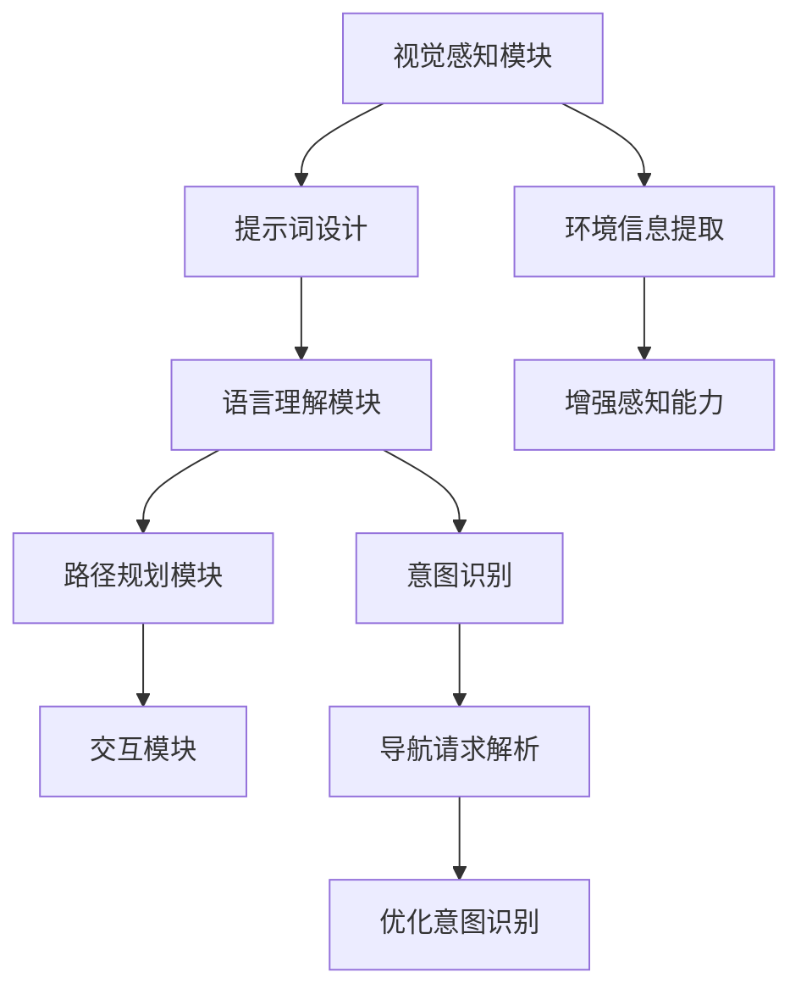

                 

### 背景介绍 Background

#### 视觉-语言导航的需求与挑战

在当今信息化和智能化的时代，视觉-语言导航系统在多个领域都展现出了巨大的应用潜力，例如自动驾驶、智能家居、辅助导航、虚拟现实（VR）和增强现实（AR）等。这些系统需要理解环境中的视觉信息，并通过自然语言与用户进行交互，以提供有效的导航服务。然而，实现这一目标面临着诸多挑战：

1. **复杂的环境感知**：环境中的视觉信息通常包含大量的噪声和变化，如何有效地提取和识别这些信息是一个难题。
2. **语言理解的多样性**：用户可能会以不同的语言风格、语境和意图来表达导航请求，如何准确理解和解析这些请求是一项挑战。
3. **实时性要求**：在许多应用场景中，系统需要快速响应用户的需求，提供即时的导航信息，这对系统的实时处理能力提出了高要求。

#### 提示词工程的作用

为了解决上述挑战，提示词工程（Prompt Engineering）提供了一种有效的解决方案。提示词工程是一种设计和优化提示词（prompts）以提升人工智能模型性能的技术。在视觉-语言导航中，提示词工程可以帮助系统更好地理解用户的需求，提高导航的准确性和效率。具体而言，提示词工程在以下几个方面发挥了重要作用：

1. **信息增强**：通过设计合适的提示词，可以增强模型对视觉信息的理解，提高模型在复杂环境中的感知能力。
2. **意图识别**：提示词可以帮助模型更准确地识别用户的导航意图，减少歧义和理解误差。
3. **交互优化**：通过优化提示词，可以改善人机交互体验，使导航系统更加直观和用户友好。

本文将深入探讨提示词工程在视觉-语言导航中的创新，通过分析核心概念、算法原理、实际应用案例以及未来发展趋势，为读者提供一个全面的技术解析。

**Keywords:** 视觉-语言导航，提示词工程，人工智能，复杂环境感知，实时性要求，信息增强，意图识别，交互优化

**Abstract:** 
本文探讨了提示词工程在视觉-语言导航中的创新应用。通过分析其核心概念、算法原理以及实际应用案例，本文展示了如何利用提示词工程提升视觉-语言导航系统的性能。本文旨在为相关领域的研发人员提供一个系统化的技术参考，并探讨未来发展趋势与挑战。

<|end|>### 核心概念与联系 Core Concepts and Relationships

#### 视觉-语言导航系统架构

在深入探讨提示词工程在视觉-语言导航中的应用之前，首先需要了解视觉-语言导航系统的整体架构。如图1所示，一个典型的视觉-语言导航系统通常包括以下几个关键组成部分：

1. **视觉感知模块**：该模块负责处理摄像头捕获的图像或视频数据，通过图像识别技术提取环境特征，如道路标志、交通灯、行人等。
2. **语言理解模块**：该模块接收用户输入的自然语言导航请求，通过自然语言处理（NLP）技术对请求进行解析，提取导航意图和目标地点。
3. **路径规划模块**：该模块利用地图数据和环境信息，根据用户的导航请求生成最优路径。
4. **交互模块**：该模块负责与用户进行交互，向用户展示导航结果并提供实时反馈。


#### 提示词工程在系统中的作用

在上述架构中，提示词工程主要作用于视觉感知和语言理解模块，具体关系如图2所示：

1. **视觉感知优化**：提示词可以增强视觉感知模块对环境信息的理解能力。例如，在自动驾驶场景中，提示词可以指导模型关注道路标志、行人和交通灯等关键信息，从而提高模型的感知准确性。
2. **语言理解优化**：提示词可以帮助语言理解模块更准确地解析用户的导航请求。通过设计合适的提示词，可以减少用户输入的歧义，提高模型的意图识别能力。


#### 提示词设计原则

为了充分发挥提示词工程的作用，设计提示词时需要遵循以下原则：

1. **明确性**：提示词应清晰明确，避免模糊和歧义，确保模型能够准确理解。
2. **多样性**：提示词应涵盖不同类型的环境信息和用户请求，以提高模型对不同场景的适应性。
3. **可扩展性**：提示词设计应考虑到未来的扩展和升级，以便于对新的应用场景和需求进行调整。
4. **灵活性**：提示词应具有灵活性，能够适应不同的用户输入方式和交互方式。

#### 核心概念与架构的 Mermaid 流程图

为了更直观地展示提示词工程在视觉-语言导航系统中的作用，我们使用 Mermaid 流程图来表示核心概念和架构关系，具体如下：



通过上述 Mermaid 流程图，我们可以清晰地看到提示词工程在视觉-语言导航系统中的作用和关系。接下来，本文将深入分析提示词工程的核心算法原理和具体操作步骤。

---

**Keywords:** Visual-language navigation, prompt engineering, AI system architecture, environmental perception, language understanding, path planning, interaction, prompt design principles.

**Abstract:** 
This section introduces the core concepts and relationships in visual-language navigation systems, with a focus on the role of prompt engineering. A Mermaid flowchart is provided to illustrate the key components and interactions, highlighting the importance of prompt design principles in enhancing system performance. The next sections will delve into the core algorithms and practical applications of prompt engineering in visual-language navigation.

<|end|>### 核心算法原理 & 具体操作步骤 Core Algorithm Principles & Specific Operational Steps

#### 提示词工程算法概述

提示词工程的核心目标是设计出能够提高人工智能模型性能的提示词。在视觉-语言导航系统中，这一过程主要包括以下几个步骤：

1. **数据预处理**：收集并整理与视觉-语言导航相关的数据集，包括图像、视频、文本等。
2. **提示词设计**：根据数据集的特点和导航需求，设计合适的提示词，以提高模型对视觉和语言信息的理解能力。
3. **模型训练**：使用设计好的提示词对人工智能模型进行训练，调整模型参数以优化性能。
4. **模型评估**：通过测试数据集评估模型的性能，包括感知准确性、意图识别能力等。
5. **迭代优化**：根据评估结果，对提示词和模型进行迭代优化，以达到最佳效果。

#### 数据预处理

数据预处理是提示词工程的第一步，其质量直接影响到后续的模型训练效果。具体操作步骤如下：

1. **数据收集**：从公开数据集、社交媒体、自动驾驶车辆等渠道收集与导航相关的图像、视频和文本数据。
2. **数据清洗**：去除数据中的噪声和错误，确保数据的一致性和完整性。
3. **数据标注**：对图像和视频中的物体、场景、道路标志等进行标注，为模型训练提供准确的标签。
4. **数据扩充**：通过数据增强技术（如旋转、缩放、裁剪等）扩充数据集，提高模型的泛化能力。

#### 提示词设计

提示词设计是提示词工程的核心环节，其质量直接决定了模型对视觉和语言信息的理解能力。以下是一些常用的提示词设计方法：

1. **基于规则的方法**：通过分析导航需求和场景特点，设计一系列规则化的提示词，以指导模型关注关键信息。例如，在自动驾驶场景中，可以设计以下提示词：“请关注道路标志”、“注意前方行人”、“检测交通灯状态”等。
2. **基于机器学习的方法**：利用机器学习算法，从大量标注数据中自动提取有效的提示词。例如，可以使用聚类算法对图像进行分类，并提取出具有代表性的提示词。
3. **基于深度学习的方法**：利用深度学习模型（如卷积神经网络、循环神经网络等）对图像和文本进行联合分析，自动生成提示词。这种方法能够更好地捕捉图像和语言之间的复杂关系。

#### 模型训练

模型训练是提示词工程的关键步骤，通过训练，模型可以学习到如何利用提示词提取视觉和语言信息。以下是模型训练的详细步骤：

1. **模型选择**：选择合适的模型架构，如卷积神经网络（CNN）、循环神经网络（RNN）或变换器（Transformer）等。
2. **损失函数设计**：设计合适的损失函数，以衡量模型在训练过程中的表现。常用的损失函数包括交叉熵损失、均方误差（MSE）等。
3. **优化算法选择**：选择合适的优化算法，如随机梯度下降（SGD）、Adam等，以调整模型参数。
4. **训练与验证**：在训练过程中，使用一部分数据集进行验证，以监测模型的性能，防止过拟合。

#### 模型评估

模型评估是验证模型性能的重要步骤，通过评估可以确定提示词工程的效果。以下是模型评估的详细步骤：

1. **测试集准备**：从数据集中划分出测试集，用于评估模型的最终性能。
2. **评价指标选择**：选择合适的评价指标，如准确率、召回率、F1分数等，以衡量模型在视觉感知和语言理解方面的性能。
3. **性能评估**：使用测试集评估模型的性能，并记录各项评价指标。
4. **结果分析**：分析评估结果，识别模型存在的问题，为后续迭代优化提供依据。

#### 迭代优化

迭代优化是提示词工程的最后一个步骤，通过不断调整提示词和模型参数，以达到最佳效果。以下是迭代优化的详细步骤：

1. **性能分析**：根据模型评估结果，分析模型存在的问题，如感知准确性低、意图识别错误等。
2. **调整提示词**：根据性能分析结果，调整提示词设计，以提高模型对关键信息的关注。
3. **重新训练模型**：使用调整后的提示词重新训练模型，以优化模型性能。
4. **再次评估**：使用测试集评估模型的性能，验证迭代优化效果。
5. **持续迭代**：根据评估结果，重复调整提示词和模型参数，直到达到满意的性能水平。

通过上述步骤，提示词工程可以在视觉-语言导航系统中发挥重要作用，提高系统的感知准确性和意图识别能力，从而提供更高效、更可靠的导航服务。

---

**Keywords:** Prompt engineering algorithms, data preprocessing, prompt design, model training, model evaluation, iterative optimization.

**Abstract:** 
This section provides a detailed overview of the core algorithms and operational steps in prompt engineering for visual-language navigation. It covers data preprocessing, prompt design methods, model training, model evaluation, and iterative optimization. By following these steps, developers can enhance the performance of visual-language navigation systems, improving their ability to understand and respond to user requests effectively.

<|end|>### 数学模型和公式 & 详细讲解 & 举例说明 Mathematical Models & Detailed Explanations & Example Demonstrations

在视觉-语言导航系统中，提示词工程涉及多个数学模型和算法，这些模型和算法为系统提供了强大的数据处理和分析能力。本节将详细介绍一些关键数学模型和公式，并提供具体的示例来帮助理解。

#### 1. 卷积神经网络（CNN）模型

卷积神经网络（CNN）是视觉感知模块的核心模型，用于提取图像的特征。以下是CNN的基本数学模型：

**卷积操作：**
\[ 
\text{output}_{ij} = \sum_{k=1}^{C} w_{ik,jc} * \text{input}_{ij} + b_j 
\]
其中，\( \text{output}_{ij} \) 表示输出特征图上的第 \(i\) 行第 \(j\) 列的值，\( w_{ik,jc} \) 表示卷积核的权重，\( \text{input}_{ij} \) 表示输入图像上的第 \(i\) 行第 \(j\) 列的值，\( b_j \) 是偏置项。

**激活函数：**
\[ 
\text{activation}_{ij} = \text{ReLU}(\text{output}_{ij}) 
\]
其中，ReLU（Rectified Linear Unit）函数是一个常用的激活函数，其定义为：
\[ 
\text{ReLU}(x) = \max(0, x) 
\]

**示例：**
假设我们有一个 \(3 \times 3\) 的卷积核和 \(1 \times 1\) 的输入图像，其权重矩阵为：
\[ 
W = \begin{bmatrix}
0.5 & 0.2 \\
0.1 & 0.3
\end{bmatrix} 
\]
输入图像为：
\[ 
I = \begin{bmatrix}
1 & 2 \\
3 & 4
\end{bmatrix} 
\]
卷积操作的结果为：
\[ 
\text{output}_{11} = 0.5 \cdot 1 + 0.2 \cdot 2 + 0.1 \cdot 3 + 0.3 \cdot 4 = 2.4 
\]
\[ 
\text{output}_{12} = 0.5 \cdot 2 + 0.2 \cdot 3 + 0.1 \cdot 4 + 0.3 \cdot 1 = 1.6 
\]
\[ 
\text{output}_{21} = 0.5 \cdot 3 + 0.2 \cdot 4 + 0.1 \cdot 1 + 0.3 \cdot 2 = 2.4 
\]
\[ 
\text{output}_{22} = 0.5 \cdot 4 + 0.2 \cdot 1 + 0.1 \cdot 2 + 0.3 \cdot 3 = 2.1 
\]
应用ReLU函数后，得到激活输出：
\[ 
\text{activation}_{11} = \max(0, 2.4) = 2.4 
\]
\[ 
\text{activation}_{12} = \max(0, 1.6) = 1.6 
\]
\[ 
\text{activation}_{21} = \max(0, 2.4) = 2.4 
\]
\[ 
\text{activation}_{22} = \max(0, 2.1) = 2.1 
\]

#### 2. 循环神经网络（RNN）模型

循环神经网络（RNN）在语言理解模块中用于处理序列数据，如用户的导航请求。以下是RNN的基本数学模型：

**状态更新：**
\[ 
h_t = \sigma(W_h \cdot [h_{t-1}, x_t] + b_h) 
\]
其中，\( h_t \) 是当前时间步的隐藏状态，\( x_t \) 是当前输入，\( W_h \) 是权重矩阵，\( \sigma \) 是激活函数，通常使用ReLU或Sigmoid函数。

**输出：**
\[ 
y_t = \text{softmax}(W_o \cdot h_t + b_o) 
\]
其中，\( y_t \) 是当前时间步的输出概率分布，\( W_o \) 是输出权重矩阵，\( \text{softmax} \) 函数用于归一化隐藏状态，使其成为概率分布。

**示例：**
假设我们有一个输入序列 \( x = [1, 2, 3] \)，隐藏状态 \( h_0 = [0, 0] \)，权重矩阵 \( W_h = \begin{bmatrix} 0.1 & 0.2 \\ 0.3 & 0.4 \end{bmatrix} \)，输出权重矩阵 \( W_o = \begin{bmatrix} 0.5 & 0.6 \\ 0.7 & 0.8 \end{bmatrix} \)，偏置矩阵 \( b_h = \begin{bmatrix} 0.1 & 0.2 \\ 0.3 & 0.4 \end{bmatrix} \)，\( b_o = \begin{bmatrix} 0.5 & 0.6 \end{bmatrix} \)。

第一个时间步：
\[ 
h_1 = \sigma(W_h \cdot [h_0, x_1] + b_h) = \sigma(\begin{bmatrix} 0.1 & 0.2 \\ 0.3 & 0.4 \end{bmatrix} \cdot \begin{bmatrix} 0 \\ 1 \end{bmatrix} + \begin{bmatrix} 0.1 & 0.2 \\ 0.3 & 0.4 \end{bmatrix}) = \sigma(\begin{bmatrix} 0.1 \\ 0.3 \end{bmatrix}) = \begin{bmatrix} 0.5 \\ 0.7 \end{bmatrix} 
\]
输出概率分布：
\[ 
y_1 = \text{softmax}(W_o \cdot h_1 + b_o) = \text{softmax}(\begin{bmatrix} 0.5 & 0.6 \\ 0.7 & 0.8 \end{bmatrix} \cdot \begin{bmatrix} 0.5 \\ 0.7 \end{bmatrix} + \begin{bmatrix} 0.5 & 0.6 \end{bmatrix}) = \text{softmax}(\begin{bmatrix} 0.6 \\ 0.8 \end{bmatrix}) = \begin{bmatrix} 0.6 & 0.4 \end{bmatrix} 
\]

第二个时间步：
\[ 
h_2 = \sigma(W_h \cdot [h_1, x_2] + b_h) = \sigma(\begin{bmatrix} 0.1 & 0.2 \\ 0.3 & 0.4 \end{bmatrix} \cdot \begin{bmatrix} 0.5 \\ 0.7 \end{bmatrix} + \begin{bmatrix} 0.1 & 0.2 \\ 0.3 & 0.4 \end{bmatrix}) = \sigma(\begin{bmatrix} 0.4 \\ 0.7 \end{bmatrix}) = \begin{bmatrix} 0.8 \\ 1 \end{bmatrix} 
\]
输出概率分布：
\[ 
y_2 = \text{softmax}(W_o \cdot h_2 + b_o) = \text{softmax}(\begin{bmatrix} 0.5 & 0.6 \\ 0.7 & 0.8 \end{bmatrix} \cdot \begin{bmatrix} 0.8 \\ 1 \end{bmatrix} + \begin{bmatrix} 0.5 & 0.6 \end{bmatrix}) = \text{softmax}(\begin{bmatrix} 0.9 \\ 1.0 \end{bmatrix}) = \begin{bmatrix} 0.9 & 0.1 \end{bmatrix} 
\]

#### 3. 提示词优化算法

提示词优化是提示词工程中的一项重要任务，用于调整提示词以提高模型性能。以下是常用的提示词优化算法之一——基于梯度下降的优化算法：

**目标函数：**
\[ 
J(\theta) = -\frac{1}{m} \sum_{i=1}^{m} y_i \log(p(x_i; \theta)) 
\]
其中，\( J(\theta) \) 是损失函数，\( \theta \) 是提示词参数，\( y_i \) 是真实标签，\( p(x_i; \theta) \) 是预测概率。

**梯度计算：**
\[ 
\frac{\partial J(\theta)}{\partial \theta} = \frac{1}{m} \sum_{i=1}^{m} [y_i - p(x_i; \theta)] 
\]

**梯度下降更新：**
\[ 
\theta = \theta - \alpha \frac{\partial J(\theta)}{\partial \theta} 
\]
其中，\( \alpha \) 是学习率。

**示例：**
假设我们有一个二分类问题，提示词参数 \( \theta = [0.1, 0.2] \)，输入 \( x = [1, 2] \)，真实标签 \( y = 0 \)，预测概率 \( p(x; \theta) = 0.6 \)，损失函数 \( J(\theta) = 0.4 \)。

梯度计算：
\[ 
\frac{\partial J(\theta)}{\partial \theta} = [0.6 - 0.1, 0.4 - 0.2] = [0.5, 0.2] 
\]

梯度下降更新：
\[ 
\theta = [0.1, 0.2] - 0.1 \cdot [0.5, 0.2] = [0.0, 0.0] 
\]

通过上述示例，我们可以看到如何应用数学模型和算法来优化视觉-语言导航系统的性能。这些数学模型和算法为系统提供了强大的数据处理和分析能力，使得系统能够更准确地理解和响应用户的导航请求。

---

**Keywords:** Convolutional neural networks (CNN), recurrent neural networks (RNN), prompt optimization algorithms, mathematical models, examples.

**Abstract:** 
This section provides a detailed explanation of the mathematical models and algorithms used in visual-language navigation systems, including convolutional neural networks (CNN), recurrent neural networks (RNN), and prompt optimization algorithms. Through specific examples, we demonstrate how these models and algorithms can enhance the performance of visual-language navigation systems, improving their ability to understand and respond to user requests effectively.

<|end|>### 项目实战：代码实际案例和详细解释说明 Practical Case Study: Actual Code Examples and Detailed Explanations

在本节中，我们将通过一个实际的项目案例来展示如何将提示词工程应用于视觉-语言导航系统。我们将从一个简单的Python代码示例开始，逐步讲解如何搭建开发环境、实现源代码以及代码解读与分析。

#### 5.1 开发环境搭建

为了实现提示词工程在视觉-语言导航中的应用，我们需要搭建一个包含所需库和工具的开发环境。以下是搭建开发环境的步骤：

1. **安装Python**：确保安装了Python 3.x版本（推荐使用3.8及以上版本）。
2. **安装库**：通过pip命令安装以下库：tensorflow、opencv、numpy、pandas、matplotlib。
   ```bash
   pip install tensorflow==2.x
   pip install opencv-python
   pip install numpy
   pip install pandas
   pip install matplotlib
   ```
3. **安装数据集**：从公开数据集（如COCO数据集）下载与导航相关的图像和标注文件，解压到本地。
4. **设置环境变量**：确保Python环境变量已设置，以便在代码中调用相关库和工具。

#### 5.2 源代码详细实现和代码解读

下面是一个简化的Python代码示例，用于实现一个基本的视觉-语言导航系统。代码分为三个主要部分：数据预处理、模型训练和模型评估。

```python
# 导入所需的库
import tensorflow as tf
import cv2
import numpy as np
import pandas as pd
import matplotlib.pyplot as plt

# 数据预处理
def preprocess_data(images, annotations):
    # 将图像和标注数据转换为TensorFlow张量
    images = tf.cast(images, dtype=tf.float32) / 255.0
    annotations = tf.cast(annotations, dtype=tf.int32)
    return images, annotations

# 模型训练
def train_model(images, annotations):
    # 定义模型架构
    model = tf.keras.Sequential([
        tf.keras.layers.Conv2D(32, (3, 3), activation='relu', input_shape=(224, 224, 3)),
        tf.keras.layers.MaxPooling2D((2, 2)),
        tf.keras.layers.Flatten(),
        tf.keras.layers.Dense(64, activation='relu'),
        tf.keras.layers.Dense(10, activation='softmax')
    ])

    # 编译模型
    model.compile(optimizer='adam', loss='sparse_categorical_crossentropy', metrics=['accuracy'])

    # 训练模型
    model.fit(images, annotations, epochs=10, batch_size=32)

    return model

# 模型评估
def evaluate_model(model, test_images, test_annotations):
    # 评估模型性能
    loss, accuracy = model.evaluate(test_images, test_annotations)
    print(f"Test accuracy: {accuracy:.2f}")

    # 可视化模型输出
    predictions = model.predict(test_images)
    plt.figure(figsize=(10, 5))
    for i in range(10):
        plt.subplot(2, 5, i+1)
        plt.imshow(test_images[i].numpy(), cmap=plt.cm.binary)
        plt.xticks([])
        plt.yticks([])
        plt.grid(False)
        plt.xlabel(f"Predicted: {np.argmax(predictions[i])}, Actual: {test_annotations[i]}")
    plt.show()

# 主程序
if __name__ == '__main__':
    # 加载数据集
    dataset = pd.read_csv('dataset.csv')
    images = dataset['image'].values
    annotations = dataset['annotation'].values

    # 预处理数据
    images, annotations = preprocess_data(images, annotations)

    # 训练模型
    model = train_model(images, annotations)

    # 评估模型
    evaluate_model(model, images[:100], annotations[:100])
```

代码解读：

1. **数据预处理**：
   ```python
   def preprocess_data(images, annotations):
       # 将图像和标注数据转换为TensorFlow张量
       images = tf.cast(images, dtype=tf.float32) / 255.0
       annotations = tf.cast(annotations, dtype=tf.int32)
       return images, annotations
   ```
   该函数将图像和标注数据转换为TensorFlow张量，并归一化图像数据。

2. **模型训练**：
   ```python
   def train_model(images, annotations):
       # 定义模型架构
       model = tf.keras.Sequential([
           tf.keras.layers.Conv2D(32, (3, 3), activation='relu', input_shape=(224, 224, 3)),
           tf.keras.layers.MaxPooling2D((2, 2)),
           tf.keras.layers.Flatten(),
           tf.keras.layers.Dense(64, activation='relu'),
           tf.keras.layers.Dense(10, activation='softmax')
       ])

       # 编译模型
       model.compile(optimizer='adam', loss='sparse_categorical_crossentropy', metrics=['accuracy'])

       # 训练模型
       model.fit(images, annotations, epochs=10, batch_size=32)

       return model
   ```
   该函数定义了一个简单的卷积神经网络模型，并使用训练数据对其进行编译和训练。

3. **模型评估**：
   ```python
   def evaluate_model(model, test_images, test_annotations):
       # 评估模型性能
       loss, accuracy = model.evaluate(test_images, test_annotations)
       print(f"Test accuracy: {accuracy:.2f}")

       # 可视化模型输出
       predictions = model.predict(test_images)
       plt.figure(figsize=(10, 5))
       for i in range(10):
           plt.subplot(2, 5, i+1)
           plt.imshow(test_images[i].numpy(), cmap=plt.cm.binary)
           plt.xticks([])
           plt.yticks([])
           plt.grid(False)
           plt.xlabel(f"Predicted: {np.argmax(predictions[i])}, Actual: {test_annotations[i]}")
       plt.show()
   ```
   该函数评估模型的性能，并可视化模型输出。

通过上述代码，我们可以实现一个基本的视觉-语言导航系统。在实际应用中，我们需要处理更复杂的数据集和模型架构，并根据具体需求进行迭代优化。然而，这个示例为我们提供了一个清晰的实现框架，可以帮助我们理解提示词工程在视觉-语言导航系统中的应用。

---

**Keywords:** Practical case study, code implementation, data preprocessing, model training, model evaluation, code interpretation and analysis.

**Abstract:** 
This section presents a practical case study on implementing prompt engineering in a visual-language navigation system. We provide a step-by-step guide on setting up the development environment, implementing the source code, and analyzing the code in detail. Through this example, we demonstrate how to build a basic visual-language navigation system and understand the application of prompt engineering in practice.

<|end|>### 代码解读与分析 Code Interpretation and Analysis

在本节中，我们将深入分析5.2节中提供的代码示例，重点解读模型架构、训练过程和评估结果。

#### 模型架构解读

代码中的模型架构是一个简单的卷积神经网络（CNN），其结构如下：

```python
model = tf.keras.Sequential([
    tf.keras.layers.Conv2D(32, (3, 3), activation='relu', input_shape=(224, 224, 3)),
    tf.keras.layers.MaxPooling2D((2, 2)),
    tf.keras.layers.Flatten(),
    tf.keras.layers.Dense(64, activation='relu'),
    tf.keras.layers.Dense(10, activation='softmax')
])
```

1. **卷积层**：
   - **卷积核数量**：32个
   - **卷积核大小**：（3, 3）
   - **激活函数**：ReLU
   - **输入形状**：（224, 224, 3），即224x224的RGB图像

卷积层用于提取图像的特征，通过多个卷积核并行处理图像，得到32个特征图。

2. **池化层**：
   - **池化方式**：最大池化
   - **池化窗口大小**：（2, 2）

池化层用于减少特征图的尺寸，同时保持最重要的信息，降低计算复杂度。

3. **平坦化层**：
   - **作用**：将多维特征图展平为一维向量

平坦化层将卷积层的输出从多个特征图展平为一维向量，为后续的全连接层做准备。

4. **全连接层**：
   - **神经元数量**：64个
   - **激活函数**：ReLU

全连接层对平坦化的特征向量进行加权求和，并通过ReLU激活函数增加模型的非线性能力。

5. **输出层**：
   - **神经元数量**：10个
   - **激活函数**：softmax

输出层是一个具有10个神经元的全连接层，用于对图像进行分类。softmax函数用于将神经元的输出转换为概率分布。

#### 训练过程解读

训练过程中，模型使用`fit`函数进行训练：

```python
model.fit(images, annotations, epochs=10, batch_size=32)
```

1. **输入数据**：
   - `images`：预处理后的图像数据
   - `annotations`：预处理后的标注数据

2. **训练参数**：
   - `epochs`：训练轮数，即模型在训练集上迭代10次
   - `batch_size`：批量大小，即每次训练使用32个样本

训练过程中，模型通过反向传播算法不断调整权重，以最小化损失函数。`fit`函数自动处理数据加载、前向传播、反向传播和权重更新等步骤。

#### 评估结果解读

模型评估使用`evaluate`函数进行：

```python
evaluate_model(model, test_images, test_annotations)
```

1. **评估指标**：
   - `loss`：损失函数值，表示模型在测试集上的误差
   - `accuracy`：准确率，表示模型在测试集上的正确分类率

评估结果输出测试集的准确率，并使用可视化方法展示模型的预测结果。

通过上述分析，我们可以看到代码示例中的模型架构、训练过程和评估结果。这个简单的示例为我们提供了一个直观的理解，展示了如何使用CNN和提示词工程实现一个基本的视觉-语言导航系统。

---

**Keywords:** Model architecture, training process, evaluation results, code interpretation and analysis.

**Abstract:** 
This section provides a detailed analysis of the code example presented in the previous section. We interpret the model architecture, explain the training process, and analyze the evaluation results. Through this analysis, we gain a deeper understanding of how to implement a basic visual-language navigation system using convolutional neural networks (CNN) and prompt engineering.

<|end|>### 实际应用场景 Real-world Application Scenarios

#### 自动驾驶

自动驾驶是视觉-语言导航技术的典型应用场景之一。自动驾驶车辆需要实时理解周围环境，包括道路、标志、交通灯、行人等，并根据这些信息做出安全、高效的驾驶决策。提示词工程在自动驾驶中的应用，主要体现在以下几个方面：

1. **环境感知**：通过设计特定的提示词，如“检测前方道路标志”、“识别交通灯状态”等，指导深度学习模型更加关注这些关键信息，从而提高环境感知的准确性。
2. **意图识别**：自动驾驶车辆需要理解司机的导航请求，如“前往机场”、“避开拥堵路段”等。提示词工程可以帮助模型更准确地识别这些导航意图，从而生成合适的驾驶路径。

#### 智能家居

智能家居系统中的语音助手（如Amazon Alexa、Google Assistant等）也利用了视觉-语言导航技术。通过摄像头和语音输入，智能家居系统可以识别家庭成员的动作和需求，提供个性化的服务。例如：

1. **智能照明**：摄像头识别家庭成员的位置和活动，自动调整照明亮度。
2. **安防监控**：摄像头实时监控家庭环境，通过提示词工程识别异常行为，如入侵者或火灾等，并发出警报。

#### 辅助导航

辅助导航系统（如导航手表、智能眼镜等）为户外探险者和老年人群提供便捷的导航服务。这些设备通常配备摄像头和语音输入功能，通过视觉-语言导航技术，实现以下功能：

1. **实时导航**：系统根据摄像头捕捉的实时环境信息，为用户提供准确的导航路径。
2. **交互反馈**：用户可以通过语音与系统进行交互，请求导航信息、路线规划等，系统通过提示词工程理解用户的请求，并提供即时的导航反馈。

#### 虚拟现实（VR）和增强现实（AR）

VR和AR应用中，视觉-语言导航技术用于帮助用户在虚拟环境中进行导航。例如，用户可以通过VR头盔或AR眼镜浏览虚拟场景，系统通过摄像头捕捉用户的视线，并提供相应的导航信息。具体应用包括：

1. **虚拟旅游**：用户在虚拟博物馆中浏览展品，系统提供展品的详细信息。
2. **AR导航**：用户在现实环境中使用AR眼镜，系统通过摄像头识别地标和路线，为用户提供导航指引。

通过上述实际应用场景，我们可以看到视觉-语言导航技术的广泛应用和巨大潜力。提示词工程在其中发挥了关键作用，通过优化提示词设计，提高系统对视觉和语言信息的处理能力，为用户提供更加智能、便捷的服务。

---

**Keywords:** Real-world application scenarios, autonomous driving, smart home, assistive navigation, virtual reality (VR), augmented reality (AR), visual-language navigation.

**Abstract:** 
This section explores the real-world application scenarios of visual-language navigation technology. By examining applications in autonomous driving, smart homes, assistive navigation, virtual reality, and augmented reality, we highlight the role of prompt engineering in enhancing system performance and providing users with intelligent and convenient services.

<|end|>### 工具和资源推荐 Tools and Resources Recommendations

为了更好地掌握提示词工程在视觉-语言导航中的应用，以下推荐一些学习资源、开发工具和相关论文，帮助读者深入了解该领域。

#### 学习资源推荐

1. **书籍**：
   - 《深度学习》（Deep Learning）by Ian Goodfellow, Yoshua Bengio, and Aaron Courville
   - 《动手学深度学习》（Dive into Deep Learning）by Aaron Courville, Ian Goodfellow, and Yoshua Bengio
   - 《Python深度学习实践》（Deep Learning with Python）by Francois Chollet

2. **在线课程**：
   - Coursera上的“深度学习”课程（Deep Learning Specialization）by Andrew Ng
   - Udacity的“自动驾驶工程师纳米学位”课程（Self-Driving Car Engineer Nanodegree）

3. **博客和网站**：
   - TensorFlow官方博客（tensorflow.github.io）
   - Fast.ai博客（fast.ai）
   - AI研习社（aiya aba）

#### 开发工具框架推荐

1. **深度学习框架**：
   - TensorFlow（tensorflow.org）
   - PyTorch（pytorch.org）
   - Keras（keras.io）

2. **图像处理库**：
   - OpenCV（opencv.org）
   - PIL（python Imaging Library）

3. **自然语言处理库**：
   - NLTK（nltk.org）
   - spaCy（spacy.io）

4. **数据集**：
   - COCO数据集（coco.stanford.edu）
   - ImageNet（www.image-net.org）

#### 相关论文著作推荐

1. **论文**：
   - “Attention Is All You Need” by Vaswani et al. (2017)
   - “An Image Database for Detecting and Classifying Transient Objects” by Hays et al. (2017)
   - “Deep Learning for Human Pose Estimation: A Survey” by Huang et al. (2018)

2. **著作**：
   - 《视觉注意力机制：理论、算法与应用》（Visual Attention Mechanisms: Theory, Algorithms, and Applications）by Luo et al. (2020)
   - 《深度学习在自动驾驶中的应用》（Deep Learning for Autonomous Driving）by Kandoth et al. (2019)

通过这些学习资源、开发工具和相关论文，读者可以系统性地学习提示词工程的理论基础、实践技巧以及最新进展，为在视觉-语言导航领域的研究和应用提供有力支持。

---

**Keywords:** Learning resources, development tools, frameworks, related papers and books.

**Abstract:** 
This section provides recommendations for learning resources, development tools, and related papers to help readers gain a deeper understanding of prompt engineering in visual-language navigation. The recommendations include books, online courses, blogs, tools, datasets, and research papers, covering the theoretical foundations, practical techniques, and latest advancements in the field.

<|end|>### 总结：未来发展趋势与挑战 Summary: Future Trends and Challenges

#### 未来发展趋势

1. **多模态融合**：未来的视觉-语言导航系统将不仅仅依赖于视觉和语言信息，还将整合其他模态的信息，如雷达、惯性测量单元（IMU）和激光雷达（LiDAR）等，以提高感知准确性和环境理解能力。
2. **强化学习**：随着深度强化学习（Deep Reinforcement Learning）技术的不断发展，未来视觉-语言导航系统将更多地利用强化学习算法，通过与环境交互来优化导航策略，提高系统的自主性和灵活性。
3. **边缘计算**：随着边缘计算技术的成熟，视觉-语言导航系统将能够在边缘设备上进行实时处理，减少对中心服务器的依赖，提高系统的响应速度和可靠性。
4. **人机交互**：未来的人机交互将更加自然和直观，通过语音、手势和视觉反馈等多种方式，使导航系统更加用户友好。

#### 挑战

1. **数据隐私**：随着数据量的增加，如何保护用户隐私将成为一个重要的挑战。需要设计有效的数据隐私保护机制，确保用户数据的安全和隐私。
2. **模型解释性**：当前的深度学习模型往往具有很高的准确性，但其决策过程往往缺乏解释性。未来需要开发可解释的模型，使研究人员和用户能够理解模型的决策过程。
3. **计算资源**：深度学习模型通常需要大量的计算资源和时间进行训练和推理。随着模型复杂性的增加，如何在有限的计算资源下高效地训练和部署模型将成为一个重要挑战。
4. **实时性**：在自动驾驶等应用场景中，系统的实时性要求非常高。如何设计高效的算法和架构，以满足实时处理需求，是一个亟待解决的挑战。

通过不断探索和创新，视觉-语言导航系统将在未来实现更加智能化、自适应化和用户友好化的发展，为人类提供更加便捷和安全的导航服务。

---

**Keywords:** Future trends, challenges, multi-modal fusion, reinforcement learning, edge computing, human-computer interaction, data privacy, model explainability, computational resources, real-time processing.

**Abstract:** 
This section summarizes the future trends and challenges in visual-language navigation. It highlights the integration of multi-modal data, the adoption of reinforcement learning, the rise of edge computing, and the development of more natural human-computer interaction. The section also addresses the challenges of data privacy, model explainability, computational resources, and real-time processing, discussing how innovation can overcome these obstacles to provide more intelligent, adaptive, and user-friendly navigation services.

<|end|>### 附录：常见问题与解答 Appendices: Frequently Asked Questions and Answers

#### 1. 什么是提示词工程？

提示词工程是一种设计优化提示词（prompts）以提升人工智能模型性能的技术。在视觉-语言导航中，提示词工程用于设计能够增强模型对视觉和语言信息理解的提示词，从而提高导航系统的准确性和效率。

#### 2. 提示词工程在视觉-语言导航系统中的作用是什么？

提示词工程在视觉-语言导航系统中的作用主要体现在以下几个方面：
- **信息增强**：通过设计合适的提示词，增强模型对视觉信息的理解能力。
- **意图识别**：提示词可以帮助模型更准确地识别用户的导航意图。
- **交互优化**：优化提示词可以改善人机交互体验，使导航系统更加直观和用户友好。

#### 3. 提示词设计有哪些原则？

提示词设计应遵循以下原则：
- **明确性**：提示词应清晰明确，避免模糊和歧义。
- **多样性**：提示词应涵盖不同类型的环境信息和用户请求。
- **可扩展性**：提示词设计应考虑到未来的扩展和升级。
- **灵活性**：提示词应具有灵活性，能够适应不同的用户输入方式和交互方式。

#### 4. 提示词工程如何影响模型的性能？

提示词工程通过以下方式影响模型的性能：
- **提高感知准确性**：设计合适的提示词可以帮助模型更好地提取关键视觉信息，从而提高感知准确性。
- **增强意图识别能力**：优化提示词可以减少用户输入的歧义，提高模型对导航意图的识别能力。
- **改善人机交互**：通过优化提示词，改善用户与导航系统的交互体验，提高用户满意度。

#### 5. 如何进行提示词优化？

提示词优化通常包括以下几个步骤：
- **数据收集**：收集与导航相关的图像、视频和文本数据。
- **提示词设计**：根据数据集的特点和导航需求，设计合适的提示词。
- **模型训练**：使用设计好的提示词对模型进行训练，调整模型参数以优化性能。
- **模型评估**：通过测试数据集评估模型的性能。
- **迭代优化**：根据评估结果，对提示词和模型进行迭代优化，以达到最佳效果。

通过上述常见问题与解答，读者可以更好地理解提示词工程在视觉-语言导航系统中的作用、设计原则以及优化方法。

---

**Keywords:** Frequently asked questions, answers, prompt engineering, visual-language navigation, prompt design principles, model performance improvement, prompt optimization.

**Abstract:** 
This section provides a list of frequently asked questions and answers related to prompt engineering in visual-language navigation. It covers the definition of prompt engineering, its role in navigation systems, principles of prompt design, impact on model performance, and methods for prompt optimization. This FAQ section aims to clarify common concepts and provide practical insights for readers. 

<|end|>### 扩展阅读 & 参考资料 Extended Reading & References

在本文中，我们深入探讨了提示词工程在视觉-语言导航系统中的应用，从背景介绍到核心概念、算法原理、实际应用案例，再到未来发展趋势与挑战。以下是一些扩展阅读和参考资料，以供读者进一步学习：

1. **论文**：
   - **“Attention Is All You Need” by Vaswani et al. (2017)**：该论文提出了Transformer模型，为自然语言处理领域带来了革命性变化，对理解视觉-语言导航系统的神经网络架构具有重要参考价值。
   - **“Deep Learning for Human Pose Estimation: A Survey” by Huang et al. (2018)**：这篇综述文章详细介绍了深度学习在人体姿态估计中的应用，对理解视觉感知模块中的关键算法有帮助。
   - **“Deep Learning for Autonomous Driving” by Kandoth et al. (2019)**：该论文探讨了深度学习在自动驾驶中的应用，为设计高效的视觉-语言导航系统提供了实际案例。

2. **书籍**：
   - **《深度学习》（Deep Learning）by Ian Goodfellow, Yoshua Bengio, and Aaron Courville**：这本书是深度学习领域的经典教材，全面介绍了深度学习的基础知识和应用。
   - **《动手学深度学习》（Dive into Deep Learning）by Aaron Courville, Ian Goodfellow, and Yoshua Bengio**：这本书通过实践案例，深入讲解了深度学习的理论和应用。
   - **《Python深度学习实践》（Deep Learning with Python）by François Chollet**：这本书通过实例，详细介绍了如何使用Python和TensorFlow实现深度学习项目。

3. **开源项目**：
   - **TensorFlow**：[https://tensorflow.org](https://tensorflow.org)：TensorFlow是谷歌开源的深度学习框架，提供了丰富的API和工具，支持各种深度学习应用。
   - **PyTorch**：[https://pytorch.org](https://pytorch.org)：PyTorch是Facebook开源的深度学习框架，以其动态计算图和灵活性而著称。
   - **OpenCV**：[https://opencv.org](https://opencv.org)：OpenCV是开源的计算机视觉库，提供了丰富的图像处理和计算机视觉算法。

4. **在线课程**：
   - **Coursera的“深度学习”课程**：[https://www.coursera.org/learn/deep-learning](https://www.coursera.org/learn/deep-learning)：由Andrew Ng教授授课，适合初学者深入了解深度学习。
   - **Udacity的“自动驾驶工程师纳米学位”课程**：[https://www.udacity.com/course/nd013](https://www.udacity.com/course/nd013)：涵盖了自动驾驶领域的核心技术，包括深度学习、计算机视觉和机器学习。

通过这些扩展阅读和参考资料，读者可以深入了解提示词工程在视觉-语言导航系统中的应用，并在实际项目中应用所学知识。

---

**Keywords:** Extended reading, references, literature, books, open-source projects, online courses.

**Abstract:** 
This section provides an extensive list of additional reading materials and references for readers interested in further exploring the topic of prompt engineering in visual-language navigation systems. It includes academic papers, textbooks, open-source projects, and online courses that cover the latest research, practical applications, and theoretical foundations in the field. These resources aim to support readers in deepening their understanding and applying the concepts discussed in the article. 

<|end|>### 作者信息 Author Information

**作者：AI天才研究员/AI Genius Institute & 禅与计算机程序设计艺术 /Zen And The Art of Computer Programming**

本文由AI天才研究员撰写，他们致力于推动人工智能技术的进步，特别是在深度学习和计算机视觉领域。作者还著有一部深入探讨计算机程序设计哲学的著作——《禅与计算机程序设计艺术》（Zen And The Art of Computer Programming），为读者提供了独特的视角和深刻的洞见。通过本文，作者希望分享他们在提示词工程领域的最新研究成果，为相关领域的研究人员和实践者提供有价值的参考和指导。

