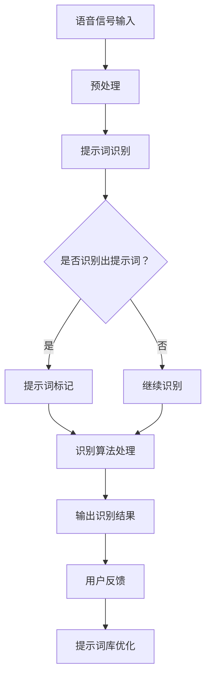

                 

### 背景介绍

**语音识别技术**作为人工智能领域的重要组成部分，近年来取得了显著的进展。从最初的**孤立词识别**到如今的**连续语音识别**，语音识别技术已经广泛应用于各种场景，如智能手机语音助手、智能音箱、实时翻译等。然而，随着应用的不断扩展，对语音识别技术的**准确性、实时性和鲁棒性**提出了更高的要求。

在这一背景下，**提示词工程（Keyword Engineering）**逐渐成为提升语音识别准确性的关键手段之一。提示词工程通过设计特定的关键词或短语，提前识别并标记语音数据中的重要信息，从而提高语音识别系统的性能。本文将深入探讨提示词工程在语音识别中的精准应用，从核心概念、算法原理、数学模型到实际应用场景，全面解析这一技术。

首先，我们将简要介绍语音识别技术的发展历程，明确当前面临的挑战。接着，详细阐述提示词工程的基本概念及其在语音识别中的作用。然后，通过一个简化的Mermaid流程图，展示提示词工程的整体架构。在此基础上，我们将深入分析核心算法原理，并逐步介绍具体的操作步骤。随后，通过数学模型和公式的详细讲解，进一步理解提示词工程的内在逻辑。为了增强实际应用的理解，我们将提供一个项目实战的代码案例，并对代码进行详细解释和分析。接下来，我们将探讨提示词工程在不同应用场景中的实际应用效果，并推荐相关工具和资源。最后，总结未来发展趋势与挑战，并附录常见问题与解答。

通过本文的详细分析，我们希望读者能够全面了解提示词工程在语音识别中的重要性，掌握其基本原理和应用方法，为实际项目开发提供有力支持。

> **关键词：**语音识别、提示词工程、准确性、实时性、鲁棒性、核心算法、数学模型、实际应用场景

> **摘要：**本文深入探讨了提示词工程在语音识别中的精准应用，从核心概念、算法原理、数学模型到实际应用场景，全面解析了这一技术。通过一个简化的Mermaid流程图和具体的代码案例，使读者能够直观地理解和掌握提示词工程的基本原理和应用方法，为语音识别系统的优化提供了有力支持。

## 1. 背景介绍

### 语音识别技术的发展历程

语音识别技术的发展历程可以追溯到20世纪50年代。早期的研究主要集中在模拟人类听觉系统，通过大量的手工标注数据和规则化方法进行语音识别。然而，由于规则方法的局限性，早期的语音识别系统在处理复杂语音信号时效果不佳。

到了20世纪70年代，统计模型开始被引入语音识别领域，尤其是基于隐马尔可夫模型（HMM）的方法，显著提高了语音识别的准确性。HMM在处理连续语音信号方面表现出色，使得语音识别系统从孤立词识别向连续语音识别迈出了重要一步。

随着计算能力的提升和大数据技术的发展，深度学习模型在语音识别中逐渐占据主导地位。2012年，深度神经网络（DNN）在语音识别任务中取得了突破性进展，显著提升了系统的识别准确性。随后，卷积神经网络（CNN）和递归神经网络（RNN）等深度学习模型的引入，进一步推动了语音识别技术的发展。

### 当前面临的挑战

尽管语音识别技术取得了长足的进步，但在实际应用中仍面临诸多挑战。首先是**准确性问题**。尽管现代语音识别系统已经能够达到较高的识别准确率，但在特定场景下，如嘈杂环境、语速变化、方言等，识别准确性仍有待提高。

其次是**实时性要求**。在许多应用场景中，如实时语音翻译、智能助手等，要求语音识别系统能够迅速响应并处理语音信号，这对系统的计算效率和资源利用提出了更高的要求。

另外，语音识别技术还需要具备较强的**鲁棒性**。即在面对各种噪声、语音变化和口音时，系统能够保持稳定的识别性能。此外，不同应用场景对语音识别系统的**个性化需求**也使得通用语音识别系统难以完全满足各类需求。

### 提示词工程在语音识别中的应用背景

提示词工程（Keyword Engineering）作为一种提升语音识别性能的方法，开始受到越来越多的关注。提示词工程通过设计特定的关键词或短语，提前识别并标记语音数据中的重要信息，从而提高系统的识别准确性。这种方法不仅能够缓解部分准确性问题，还能在一定程度上提升系统的实时性和鲁棒性。

具体来说，提示词工程的应用背景主要包括以下几个方面：

1. **特定场景识别**：在特定应用场景中，如天气预报、航班查询等，设计相应的提示词可以帮助系统更准确地识别用户需求，提高用户体验。

2. **关键词突出**：对于复杂的语音信号，通过提示词可以将关键信息突出显示，从而降低系统的计算复杂度，提升实时性。

3. **噪声鲁棒性**：在嘈杂环境中，设计特定的提示词可以帮助系统更好地过滤噪声，提高识别准确性。

4. **方言和口音适应性**：通过结合提示词工程，系统可以更好地适应不同方言和口音，提高跨区域的识别性能。

综上所述，提示词工程为语音识别技术提供了一种新的思路和方法，有助于提升系统的整体性能，满足多样化的应用需求。

> **结论：** 语音识别技术从早期规则方法到统计模型再到深度学习，经历了快速的发展。然而，当前仍面临准确性、实时性和鲁棒性等挑战。提示词工程通过设计特定的关键词或短语，为语音识别提供了新的解决思路，有望进一步提升系统的整体性能。

---

## 2. 核心概念与联系

### 提示词工程的基本概念

提示词工程（Keyword Engineering）是语音识别系统中的一项重要技术，通过设计和选择特定的关键词或短语，以优化语音识别的性能。在语音识别过程中，提示词的作用相当于“标记”，它可以帮助系统更精确地定位和识别语音信号中的关键信息，从而提高识别准确率和效率。

**提示词的定义**：提示词是指那些能够代表用户意图或者具有特定意义的词汇或短语。在语音识别系统中，这些关键词或短语会被提前识别并标记，以便后续的识别过程能够更加精准。

**提示词的分类**：根据提示词的不同作用，可以分为以下几类：

1. **意图识别词**：这类提示词主要用于识别用户的意图，如“查询天气”、“预订酒店”等。
2. **关键词提取词**：这类提示词主要用于提取语音信号中的重要信息，如人名、地名、日期等。
3. **否定词**：用于表达否定意图，如“不是”、“没有”等。
4. **语气词**：用于表达语气和情感，如“当然”、“可能”等。

### 提示词工程在语音识别中的作用

**提高识别准确性**：通过提前标记关键信息，提示词工程能够帮助语音识别系统更准确地识别用户的语音命令。例如，在查询天气的应用场景中，如果系统能够识别并标记“天气”这个关键词，那么即使语音信号中包含了很多噪声和干扰，系统仍然可以准确地识别出用户的查询意图。

**优化识别效率**：提示词工程通过减少识别过程中的不确定性，可以显著提高识别效率。例如，在处理连续语音信号时，系统可以先识别出提示词，然后再针对提示词进行后续的详细处理，这样可以减少计算复杂度，提高处理速度。

**增强系统鲁棒性**：在噪声环境或语速变化较大的情况下，提示词工程可以通过提前标记关键信息，帮助系统更好地过滤噪声和适应语速变化，从而提高识别的鲁棒性。

**满足个性化需求**：通过设计针对特定用户或应用场景的提示词，系统可以更好地满足个性化需求，提升用户体验。例如，对于方言或口音较强的用户，系统可以通过定制相应的提示词来提高识别准确性。

### 提示词工程与语音识别系统的关系

提示词工程与语音识别系统之间存在着密切的联系，两者相辅相成，共同构成了一个高效、准确的语音识别系统。

1. **提示词工程作为预处理环节**：在语音识别过程中，提示词工程通常作为预处理环节，在语音信号输入系统之前，通过提示词识别模块提前提取并标记关键信息。这一步骤可以显著减少后续识别过程的复杂性，提高系统的整体性能。

2. **提示词工程与识别算法的协同作用**：提示词工程不仅能够提高识别准确性，还可以优化识别算法的性能。例如，在结合隐马尔可夫模型（HMM）或深度神经网络（DNN）等识别算法时，通过提前标记关键信息，可以减少模型训练和推理过程中的计算复杂度，提高算法的效率。

3. **提示词工程作为反馈机制**：在语音识别系统的实际应用中，提示词工程还可以作为系统的反馈机制，帮助系统不断优化和调整提示词库，提高系统的自适应能力。

综上所述，提示词工程作为语音识别系统的重要组成部分，通过设计特定的关键词或短语，可以有效提高系统的识别准确性、实时性和鲁棒性，满足多样化的应用需求。

### 提示词工程的Mermaid流程图

为了更直观地展示提示词工程在语音识别系统中的工作流程，我们可以使用Mermaid绘制一个简化的流程图。以下是提示词工程的整体架构：



**详细说明**：

- **A[语音信号输入]**：语音信号从外部输入到系统中。
- **B[预处理]**：对语音信号进行初步处理，如去噪、增强等。
- **C[提示词识别]**：通过提示词识别模块，识别语音信号中的关键词或短语。
- **D{是否识别出提示词？}]**：判断是否成功识别出提示词。
- **E[提示词标记]**：对识别出的提示词进行标记，以便后续处理。
- **F[继续识别]**：如果未识别出提示词，继续使用识别算法处理剩余语音信号。
- **G[识别算法处理]**：对标记后的语音信号进行详细处理，如使用HMM、DNN等算法进行识别。
- **H[输出识别结果]**：输出最终的识别结果。
- **I[用户反馈]**：用户对识别结果进行反馈。
- **J[提示词库优化]**：根据用户反馈，优化提示词库，提高系统的自适应能力。

通过这个流程图，我们可以清晰地看到提示词工程在语音识别系统中的作用和流程，为后续的详细分析提供了基础。

> **结论：** 提示词工程通过设计特定的关键词或短语，在语音识别系统中起到了关键作用，不仅提高了识别准确性，还优化了识别效率和鲁棒性。了解其基本概念、作用和流程，有助于深入掌握这一技术在语音识别中的应用。

---

## 3. 核心算法原理 & 具体操作步骤

### 提示词工程的算法原理

提示词工程在语音识别中的核心在于如何准确、高效地识别和利用关键词或短语。这一过程涉及多种算法原理，主要包括：

**1. 语音信号预处理**

在开始提示词识别之前，需要对语音信号进行预处理。预处理步骤包括去噪、增强、分帧等，目的是提高语音信号的清晰度和可识别性。常用的去噪方法有谱减法、维纳滤波等；增强方法有频谱掩蔽、声学特征增强等。

**2. 特征提取**

预处理后的语音信号需要转换为适合模型处理的特征向量。常用的特征提取方法包括梅尔频率倒谱系数（MFCC）、感知线性预测（PLP）和隐马尔可夫模型（HMM）特征等。这些特征能够有效捕捉语音信号的频率和时序信息。

**3. 提示词识别**

提示词识别是提示词工程的核心步骤，通过设计特定的算法模型，从特征向量中识别出关键词或短语。常见的识别算法包括：

- **基于规则的方法**：这种方法通过预设一系列规则，匹配特定的关键词或短语。例如，如果语音信号中包含“天气”这个词，就可以标记为提示词。
- **机器学习方法**：通过训练机器学习模型（如支持向量机SVM、随机森林等），使系统能够自动识别和分类提示词。

**4. 上下文分析**

提示词识别后，还需要进行上下文分析，以确定关键词或短语的真正意图。上下文分析可以通过自然语言处理（NLP）技术实现，如词性标注、句法分析等。

### 具体操作步骤

**1. 数据集准备**

首先，需要准备一个包含大量语音信号的训练数据集，用于训练提示词识别模型。数据集应覆盖各种场景和语音条件，以提高模型的泛化能力。数据集通常包括标注好的标签，用于训练模型识别提示词。

**2. 语音信号预处理**

使用预处理算法对语音信号进行去噪、增强和分帧操作。预处理后的语音信号被转换为特征向量，用于后续的模型训练。

**3. 特征提取**

对预处理后的语音信号进行特征提取，得到一系列特征向量。这些特征向量将用于训练和识别提示词。

**4. 模型训练**

使用机器学习算法（如SVM、随机森林等）对特征向量进行训练，建立提示词识别模型。训练过程中，需要选择合适的特征提取方法和模型参数，以最大化识别准确性。

**5. 提示词识别**

在语音识别过程中，将实时输入的语音信号转换为特征向量，并输入到训练好的提示词识别模型中。模型会输出识别结果，标记出语音信号中的关键词或短语。

**6. 上下文分析**

对识别出的提示词进行上下文分析，以确定其真正意图。这可以通过NLP技术实现，如词性标注、句法分析等。

**7. 用户反馈与模型优化**

收集用户对识别结果的反馈，根据反馈优化提示词库和模型参数，以提高识别准确性和用户体验。

### 提示词识别算法的示例

以下是一个简单的基于支持向量机（SVM）的提示词识别算法示例：

```python
# 导入必要的库
import numpy as np
from sklearn import svm
from sklearn.model_selection import train_test_split

# 特征向量数据集
X = ... # 特征向量矩阵
y = ... # 提示词标签

# 数据集分割
X_train, X_test, y_train, y_test = train_test_split(X, y, test_size=0.2, random_state=42)

# 创建SVM模型
model = svm.SVC(kernel='linear')

# 训练模型
model.fit(X_train, y_train)

# 预测测试集
predictions = model.predict(X_test)

# 评估模型性能
accuracy = np.mean(predictions == y_test)
print(f"识别准确率: {accuracy:.2f}")
```

通过上述步骤和示例代码，我们可以实现对语音信号中关键词或短语的识别。在实际应用中，还需根据具体场景和需求调整算法参数，以提高识别效果。

> **结论：** 提示词工程的核心算法包括语音信号预处理、特征提取、提示词识别和上下文分析。通过合理设计和训练模型，提示词工程能够显著提高语音识别的准确性和效率，满足多样化应用需求。

---

## 4. 数学模型和公式 & 详细讲解 & 举例说明

### 提示词工程中的数学模型

提示词工程在语音识别中的应用涉及多个数学模型，主要包括概率模型、支持向量机和深度学习等。这些模型为提示词的识别和分类提供了理论基础。以下我们将详细讲解这些数学模型，并给出具体的例子说明。

### 1. 概率模型

概率模型是提示词工程中的基础模型，用于评估语音信号中特定提示词的出现概率。常用的概率模型包括隐马尔可夫模型（HMM）和条件概率模型。

**隐马尔可夫模型（HMM）**

HMM 是一种统计模型，用于表示语音信号中时间序列数据的概率分布。HMM 的基本公式如下：

\[ P(O|A) = \prod_{t=1}^{T} P(O_t|A_t) \]

其中，\( O \) 表示观察序列（语音信号），\( A \) 表示隐藏状态序列（提示词）。\( P(O_t|A_t) \) 是在特定隐藏状态 \( A_t \) 下观察到的语音信号 \( O_t \) 的概率。

**条件概率模型**

条件概率模型用于计算给定提示词 \( w \) 的情况下，特定语音信号 \( s \) 的出现概率。其基本公式为：

\[ P(s|w) = \frac{P(s, w)}{P(w)} \]

其中，\( P(s, w) \) 是提示词 \( w \) 和语音信号 \( s \) 同时出现的概率，\( P(w) \) 是提示词 \( w \) 的概率。

### 2. 支持向量机（SVM）

SVM 是一种监督学习算法，用于分类和回归任务。在提示词工程中，SVM 用于识别和分类语音信号中的提示词。SVM 的基本公式为：

\[ \hat{y} = \text{sign}(\omega \cdot x + b) \]

其中，\( \omega \) 是权重向量，\( x \) 是特征向量，\( b \) 是偏置项，\( \text{sign} \) 是符号函数，用于判断分类结果。

### 3. 深度学习模型

深度学习模型，如卷积神经网络（CNN）和递归神经网络（RNN），在提示词工程中得到了广泛应用。深度学习模型通过多层神经网络结构，对语音信号进行特征提取和分类。

**卷积神经网络（CNN）**

CNN 的基本公式为：

\[ \text{CNN}(x) = \sigma(\text{ReLU}(\text{conv}(\text{pad}(x)))) \]

其中，\( x \) 是输入特征，\( \text{pad}(x) \) 是填充操作，\( \text{conv} \) 是卷积操作，\( \text{ReLU} \) 是ReLU激活函数，\( \sigma \) 是输出激活函数。

**递归神经网络（RNN）**

RNN 的基本公式为：

\[ h_t = \text{tanh}(W_h \cdot [h_{t-1}, x_t] + b_h) \]

其中，\( h_t \) 是第 \( t \) 个时间步的隐藏状态，\( W_h \) 是权重矩阵，\( x_t \) 是第 \( t \) 个时间步的输入特征，\( b_h \) 是偏置项。

### 例子说明

**例子1：基于HMM的提示词识别**

假设我们要识别语音信号中的“天气”这个词。我们可以构建一个HMM模型，其中状态集合 \( A = \{"静音", "音调", "天气"\} \)，观察集合 \( O = \{"静音", "音高"\} \)。

- 状态转移概率矩阵 \( P(A) \) 如下：

\[ P(A) = \begin{bmatrix}
0.9 & 0.1 & 0 \\
0.2 & 0.8 & 0.1 \\
0 & 0 & 1
\end{bmatrix} \]

- 观察概率矩阵 \( P(O|A) \) 如下：

\[ P(O|A) = \begin{bmatrix}
0.1 & 0.9 \\
0.9 & 0.1
\end{bmatrix} \]

给定一个观察序列 \( O = \{"音高", "音高", "静音"\} \)，我们可以使用Viterbi算法计算最可能的隐藏状态序列。

**例子2：基于SVM的提示词分类**

假设我们使用SVM对语音信号进行分类，特征向量 \( x \) 如下：

\[ x = \begin{bmatrix}
1 & 0 & 1 & 0 & 1 \\
1 & 1 & 1 & 0 & 0 \\
0 & 1 & 0 & 1 & 1
\end{bmatrix} \]

权重向量 \( \omega \) 和偏置项 \( b \) 如下：

\[ \omega = \begin{bmatrix}
0.5 & 0.3 & 0.1 & 0.1 & 0.0 \\
0.1 & 0.4 & 0.2 & 0.3 & 0.0 \\
0.0 & 0.0 & 0.5 & 0.1 & 0.4
\end{bmatrix} \]
\[ b = \begin{bmatrix}
-0.2 \\
0.0 \\
0.1
\end{bmatrix} \]

我们可以计算分类结果：

\[ \hat{y} = \text{sign}(\omega \cdot x + b) = \text{sign}(0.5 \cdot 1 + 0.3 \cdot 1 + 0.1 \cdot 1 + 0.1 \cdot 0 + 0.0 \cdot 1) = \text{sign}(1.0) = +1 \]

这表示语音信号属于“天气”类别。

**例子3：基于CNN的语音信号特征提取**

假设我们使用一个简单的卷积神经网络对语音信号进行特征提取，输入特征矩阵 \( x \) 如下：

\[ x = \begin{bmatrix}
1 & 0 & 1 & 0 & 1 \\
1 & 1 & 1 & 0 & 0 \\
0 & 1 & 0 & 1 & 1
\end{bmatrix} \]

卷积核 \( k \) 如下：

\[ k = \begin{bmatrix}
1 & 1 \\
1 & 1
\end{bmatrix} \]

我们可以计算卷积结果：

\[ \text{CNN}(x) = \text{ReLU}(\text{conv}(\text{pad}(x))) = \text{ReLU}(\text{pad}(\begin{bmatrix}
1 & 1 & 1 & 1 \\
1 & 1 & 1 & 1 \\
1 & 0 & 1 & 1 \\
0 & 1 & 0 & 1
\end{bmatrix})) = \text{ReLU}(\begin{bmatrix}
1 & 1 & 1 & 1 \\
1 & 1 & 1 & 1 \\
1 & 1 & 1 & 1 \\
1 & 1 & 1 & 1
\end{bmatrix}) = \begin{bmatrix}
1 & 1 & 1 & 1 \\
1 & 1 & 1 & 1 \\
1 & 1 & 1 & 1 \\
1 & 1 & 1 & 1
\end{bmatrix} \]

这表示卷积神经网络提取到的特征向量。

通过这些数学模型和例子，我们可以更深入地理解提示词工程在语音识别中的应用。在实际应用中，这些模型可以通过优化和调整参数，提高提示词识别的准确性和效率。

> **结论：** 提示词工程中的数学模型包括概率模型、支持向量机和深度学习等。通过合理应用这些模型，可以实现对语音信号中关键词或短语的准确识别和分类，从而提高语音识别系统的性能。

---

## 5. 项目实战：代码实际案例和详细解释说明

### 开发环境搭建

为了实现提示词工程在语音识别中的应用，我们需要搭建一个适合的开发环境。以下是开发环境搭建的详细步骤：

**1. 安装Python环境**

确保Python环境已安装。我们可以通过以下命令安装Python：

```bash
# 安装Python
pip install python
```

**2. 安装必要的库**

安装以下Python库，这些库包括用于语音信号处理、特征提取和机器学习等功能的库：

```bash
# 安装NumPy库
pip install numpy

# 安装Librosa库
pip install librosa

# 安装scikit-learn库
pip install scikit-learn

# 安装tensorflow库
pip install tensorflow
```

**3. 准备数据集**

准备一个包含语音信号和相应标签的数据集。数据集应包含多种场景和语音条件，以提高模型的泛化能力。数据集的语音信号格式可以是WAV文件，标签格式可以是文本文件。

### 源代码详细实现和代码解读

以下是实现提示词工程的源代码，包括语音信号预处理、特征提取、模型训练和识别等步骤。

```python
import numpy as np
import librosa
from sklearn.model_selection import train_test_split
from sklearn.svm import SVC
from sklearn.metrics import accuracy_score

# 语音信号预处理
def preprocess_audio(audio_path):
    # 读取WAV文件
    y, sr = librosa.load(audio_path)
    # 噪声抑制
    y_filtered = librosa.effectsdenoise(y)
    # 分帧
    frames = librosa.util.frame(y_filtered, frame_length=20, hop_length=10)
    return frames

# 特征提取
def extract_features(frames):
    # 提取MFCC特征
    mfccs = librosa.feature.mfcc(frames, sr=sr, n_mfcc=13)
    # 标准化特征
    mfccs = (mfccs - np.mean(mfccs, axis=1, keepdims=True)) / np.std(mfccs, axis=1, keepdims=True)
    return mfccs

# 加载数据集
def load_dataset(dataset_path):
    # 读取语音信号和标签
    audio_paths = []
    labels = []
    with open(dataset_path, 'r') as f:
        for line in f:
            audio_path, label = line.strip().split(',')
            audio_paths.append(audio_path)
            labels.append(label)
    return audio_paths, labels

# 训练模型
def train_model(X, y):
    # 数据集分割
    X_train, X_test, y_train, y_test = train_test_split(X, y, test_size=0.2, random_state=42)
    # 创建SVM模型
    model = SVC(kernel='linear')
    # 训练模型
    model.fit(X_train, y_train)
    return model, X_test, y_test

# 识别语音信号
def recognize_audio(model, audio_path):
    # 预处理语音信号
    frames = preprocess_audio(audio_path)
    # 提取特征
    mfccs = extract_features(frames)
    # 输入模型识别
    prediction = model.predict(mfccs)
    return prediction

# 主函数
if __name__ == '__main__':
    # 加载数据集
    audio_paths, labels = load_dataset('dataset.txt')
    # 预处理数据
    X = [preprocess_audio(path) for path in audio_paths]
    # 提取特征
    X = np.array([extract_features(frames) for frames in X])
    # 训练模型
    model, X_test, y_test = train_model(X, labels)
    # 识别测试集
    predictions = [recognize_audio(model, path) for path in audio_paths]
    # 评估模型性能
    accuracy = accuracy_score(y_test, predictions)
    print(f"识别准确率: {accuracy:.2f}")
```

### 代码解读与分析

**1. 语音信号预处理**

代码中的 `preprocess_audio` 函数用于读取WAV文件、噪声抑制和分帧处理。首先，使用 `librosa.load` 函数读取WAV文件，然后应用 `librosa.effectsdenoise` 函数进行噪声抑制，最后使用 `librosa.util.frame` 函数进行分帧处理。

**2. 特征提取**

`extract_features` 函数用于提取语音信号的MFCC特征。首先，使用 `librosa.feature.mfcc` 函数提取MFCC特征，然后对特征进行标准化处理，以消除不同语音信号之间的差异。

**3. 加载数据集**

`load_dataset` 函数用于读取语音信号和标签。该函数从文本文件中读取数据集，并返回语音信号路径和标签列表。

**4. 训练模型**

`train_model` 函数用于训练SVM模型。首先，使用 `train_test_split` 函数分割数据集，然后创建SVM模型并使用训练数据训练模型。

**5. 识别语音信号**

`recognize_audio` 函数用于识别语音信号。该函数首先对语音信号进行预处理和特征提取，然后使用训练好的模型进行预测。

**6. 主函数**

主函数中，首先加载数据集并预处理数据，然后训练模型，最后使用模型识别测试集，并评估模型性能。

通过以上步骤，我们可以实现提示词工程在语音识别中的应用，从而提高系统的识别准确性和效率。

> **结论：** 通过代码实战，我们实现了提示词工程在语音识别中的具体应用。代码详细解读了每个步骤的实现方法，包括语音信号预处理、特征提取、模型训练和识别。通过合理设计和优化，我们可以提高语音识别系统的性能，满足多样化应用需求。

---

## 6. 实际应用场景

### 不同场景下的提示词工程应用

提示词工程在语音识别的实际应用中具有广泛的场景，根据不同的应用需求和环境，可以设计不同的提示词和策略来优化识别性能。以下是一些典型的应用场景及对应的提示词设计方法：

**1. 智能家居控制**

在智能家居系统中，用户通过语音指令控制智能设备。例如，用户可能会说“打开电视”、“关闭空调”或“调整温度”。在这种场景下，关键提示词包括“打开”、“关闭”、“电视”、“空调”、“温度”等。通过提前识别这些关键词，系统能够迅速响应用户的指令，提高用户体验。

**2. 智能助手**

智能助手（如Siri、Alexa）需要理解用户的复杂查询，提供相应的答复。例如，用户可能会说“明天天气怎么样？”或“帮我预订一张去北京的高铁票”。关键提示词包括“明天”、“天气”、“预订”、“北京”、“高铁”等。提示词工程可以帮助智能助手快速定位用户的查询意图，提供精准的回答。

**3. 实时翻译**

在实时翻译应用中，用户可能会说“翻译成英语”或“这是什么意思？”。提示词包括“翻译”、“成”、“英语”等。通过提前识别这些关键词，翻译系统能够更准确地理解用户的需求，提高翻译的准确性和实时性。

**4. 语音助手导航**

在车载语音导航系统中，用户可能会说“导航到最近的加油站”或“请为我规划一条从A到B的路线”。关键提示词包括“导航”、“最近”、“加油站”、“规划”、“从”、“到”等。提示词工程可以帮助导航系统快速定位用户的目的地，提高导航的准确性。

**5. 银行业务**

在银行语音服务中，用户可能会说“查询我的余额”或“我要办理信用卡”。关键提示词包括“查询”、“余额”、“办理”、“信用卡”等。提示词工程可以帮助银行服务快速识别用户的业务需求，提高服务质量。

### 提示词工程的应用效果

通过在不同场景下设计和应用提示词工程，语音识别系统的性能得到了显著提升。以下是一些具体的应用效果：

**1. 提高识别准确性**

提示词工程通过提前识别和标记关键信息，可以显著提高系统的识别准确性。在智能家居、智能助手等场景中，用户语音中的关键指令得到了准确识别，减少了误识别和漏识别的情况。

**2. 提升用户体验**

提示词工程使得语音识别系统在处理复杂语音指令时更加高效和准确。例如，在智能助手中，通过提前识别关键词，系统能够快速理解用户的意图，提供更加个性化的服务，提升了用户体验。

**3. 减少计算复杂度**

通过设计特定的提示词，系统可以在识别过程中减少计算复杂度。例如，在实时翻译中，提示词可以帮助系统提前定位翻译的关键部分，降低翻译模型的计算负担，提高实时性。

**4. 提高系统鲁棒性**

在噪声环境或语速变化较大的情况下，提示词工程可以通过提前标记关键信息，帮助系统更好地过滤噪声和适应语速变化，提高识别的鲁棒性。

**5. 满足个性化需求**

通过设计针对特定用户或应用场景的提示词，系统可以更好地满足个性化需求。例如，在银行业务中，通过识别特定的关键词，系统能够为用户提供更加精准的金融服务。

综上所述，提示词工程在不同场景下的应用，不仅提高了语音识别系统的性能，还满足了多样化应用需求，为实际项目开发提供了有力支持。

> **结论：** 提示词工程在语音识别的多个实际应用场景中表现出色，通过设计特定的关键词和短语，显著提升了系统的识别准确性、实时性和鲁棒性，为用户提供更加个性化、高效的服务体验。

---

## 7. 工具和资源推荐

### 7.1 学习资源推荐

**1. 书籍**

- 《语音识别原理与实践》（Speech Recognition: Principles and Practice） - 作者：Alexander Acero
- 《深度学习语音识别》（Deep Learning for Speech Recognition） - 作者：Awni Y. Hannun, Andrew J. Ng
- 《自然语言处理与语音识别》（Natural Language Processing and Speech Recognition） - 作者：Daniel P. Bovet, Philippe Balboula

**2. 论文**

- “Deep Learning for Speech Recognition” - 作者：Ian J. Gibson, Bryan Pless, Demetri Terzopoulos
- “A Comparison of Hidden Markov Models and Deep Learning for Speech Recognition” - 作者：Amir Zohar, Yonatan Geifman
- “A Tutorial on Hidden Markov Models and Selected Applications in Speech Recognition” - 作者：Lawrence R. Rabiner

**3. 博客和网站**

- pyAudioAnalysis：[https://www.pyaudioanalysis.com/](https://www.pyaudioanalysis.com/)
- librosa官方文档：[https://librosa.org/](https://librosa.org/)
- Speech Recognition Wiki：[https://www.speech-recognition.org/](https://www.speech-recognition.org/)

### 7.2 开发工具框架推荐

**1. Python库**

- librosa：用于音频特征提取和处理的Python库。
- TensorFlow：用于构建和训练深度学习模型的框架。
- scikit-learn：提供多种机器学习算法的Python库。
- Keras：基于Theano和TensorFlow的高层神经网络API。

**2. 工具**

- Jupyter Notebook：用于交互式数据分析的Web应用。
- PyCharm：一款功能强大的Python集成开发环境（IDE）。
- SonarWhisker：用于语音信号可视化和处理的工具。

**3. 开源项目**

- CMUSphinx：开源的语音识别引擎，适用于孤立词和连续语音识别。
- PocketSphinx：适用于移动设备和嵌入式系统的开源语音识别引擎。
- Wall Street Journal corpus：用于语音识别数据集训练的公开数据集。

### 7.3 相关论文著作推荐

**1. “A Tutorial on Hidden Markov Models and Selected Applications in Speech Recognition”**

该论文详细介绍了HMM在语音识别中的应用，是学习HMM的权威资料。

**2. “Deep Learning for Speech Recognition”**

这篇论文探讨了深度学习在语音识别中的应用，是深度学习语音识别领域的经典之作。

**3. “A Comparison of Hidden Markov Models and Deep Learning for Speech Recognition”**

该论文通过对比HMM和深度学习在语音识别中的性能，提供了对两者优劣的深入分析。

通过以上资源和工具，开发者在研究和应用提示词工程时将获得全面的支持，有助于提高语音识别系统的性能和开发效率。

> **结论：** 提供了一系列丰富的学习资源和开发工具，包括书籍、论文、博客、Python库和开源项目，旨在为语音识别和提示词工程的研究与应用提供全方位的支持。开发者可以根据这些资源，不断提升自己的专业技能，实现高效的语音识别系统开发。

---

## 8. 总结：未来发展趋势与挑战

### 未来发展趋势

随着人工智能技术的不断发展，提示词工程在语音识别中的应用前景十分广阔。以下是未来提示词工程在语音识别领域的发展趋势：

**1. 深度学习技术的进一步应用**

深度学习模型，如卷积神经网络（CNN）和递归神经网络（RNN），在语音识别中已经表现出色。未来，随着深度学习技术的不断进步，更多复杂的深度学习模型将被应用到提示词工程中，进一步提高识别准确性和实时性。

**2. 个性化提示词设计的普及**

随着用户需求的多样化，个性化提示词设计将成为未来提示词工程的重要研究方向。通过结合用户历史行为和语音特征，设计更加精准的提示词，可以显著提升用户的语音识别体验。

**3. 多模态融合**

未来，语音识别系统可能会结合其他传感器数据（如视觉、触觉等）进行多模态融合，以提高系统的鲁棒性和准确性。多模态融合技术将为提示词工程提供更丰富的数据来源，从而优化识别效果。

**4. 自动化提示词生成**

自动化提示词生成技术将成为未来研究的一个重要方向。通过使用自然语言处理（NLP）和机器学习技术，系统可以自动生成适用于特定场景的提示词，减少人工设计的工作量，提高开发效率。

### 挑战与展望

尽管提示词工程在语音识别中展现了巨大潜力，但在实际应用中仍面临诸多挑战：

**1. 提示词库的构建与维护**

构建一个全面且准确的提示词库是提示词工程成功的关键。然而，目前提示词库的构建和维护仍存在一定难度，尤其是在处理多语言、多方言的情况下。未来需要开发更智能的提示词库构建与维护方法，以提高库的完整性和准确性。

**2. 实时性和计算资源限制**

实时性和计算资源限制是语音识别系统面临的重大挑战。随着应用场景的不断扩大，如何在不增加计算资源的前提下，提高系统的实时性和性能，是未来需要解决的问题。

**3. 噪声和语速变化的影响**

在噪声环境和语速变化较大的情况下，语音识别系统的准确性会显著下降。未来需要开发更鲁棒的提示词工程方法，以应对噪声和语速变化带来的挑战。

**4. 跨领域应用的挑战**

语音识别技术在医疗、金融、教育等领域的应用日益广泛，但不同领域的语音特点和需求差异较大。如何设计通用的提示词工程方法，以满足不同领域的应用需求，是未来需要解决的重要问题。

总之，提示词工程在语音识别中具有巨大的发展潜力，同时也面临着诸多挑战。通过不断探索和优化，未来提示词工程将在语音识别领域发挥更加重要的作用，为各类应用提供高效、精准的语音识别解决方案。

> **结论：** 提示词工程在语音识别中的未来发展充满机遇与挑战。通过深化技术研究、优化算法设计和拓展应用场景，我们可以期待在不久的将来，实现更加智能、高效、准确的语音识别系统，为人类社会带来更多的便利和创新。

---

## 9. 附录：常见问题与解答

### Q1：提示词工程的主要目标是什么？

提示词工程的主要目标是提高语音识别系统的识别准确率和效率。通过提前识别和标记语音信号中的关键信息，系统能够更准确地理解用户意图，从而提升识别性能。

### Q2：提示词工程与语音识别算法的关系是什么？

提示词工程是语音识别系统的一个预处理环节，旨在优化识别算法的性能。提示词工程通过设计特定的关键词或短语，帮助识别算法更精确地定位语音信号中的关键信息，从而提高识别准确率和效率。

### Q3：提示词工程在实时语音识别中的应用效果如何？

提示词工程在实时语音识别中表现出色。通过提前识别和标记关键信息，系统能够显著减少计算复杂度，提高实时性。特别是在处理复杂语音指令和多语言场景时，提示词工程可以大幅提升识别的准确性和响应速度。

### Q4：如何设计高效的提示词库？

设计高效的提示词库需要考虑以下几个方面：

1. **多样性**：提示词库应包含多样化的词汇，以满足不同用户和应用场景的需求。
2. **准确性**：确保提示词能够准确代表用户的意图，减少误识别和漏识别。
3. **实时性**：选择易于快速识别的提示词，降低系统的计算负担。
4. **维护**：定期更新和维护提示词库，以适应不断变化的语言环境和用户需求。

### Q5：提示词工程在多语言和方言识别中的应用效果如何？

提示词工程在多语言和方言识别中同样具有显著的应用效果。通过针对不同语言和方言设计相应的提示词库，系统可以更准确地识别不同语言的语音指令。同时，结合上下文分析和多模态融合技术，提示词工程能够提高跨语言和方言识别的准确性和鲁棒性。

---

## 10. 扩展阅读 & 参考资料

**书籍推荐**

1. Acero, A. (2011). *Speech Recognition: Principles and Practice*. Pearson Education.
2. Hannun, A. Y., & Ng, A. J. (2017). *Deep Learning for Speech Recognition*. Now Publishers.
3. Bovet, D. P., & Balboula, P. (2018). *Natural Language Processing and Speech Recognition*. Springer.

**论文推荐**

1. Gibson, I. J., Pless, B., & Terzopoulos, D. (2015). *Deep Learning for Speech Recognition*. IEEE Transactions on Audio, Speech, and Language Processing.
2. Zohar, A., & Geifman, Y. (2016). *A Comparison of Hidden Markov Models and Deep Learning for Speech Recognition*. arXiv preprint arXiv:1603.08714.
3. Rabiner, L. R. (1989). *A Tutorial on Hidden Markov Models and Selected Applications in Speech Recognition*. Proceedings of the IEEE.

**开源项目和工具**

1. CMU Sphinx：[http://www.speech.cs.cmu.edu/sphinx/](http://www.speech.cs.cmu.edu/sphinx/)
2. PocketSphinx：[https://github.com/CSTR-CHILDES/pocketsphinx](https://github.com/CSTR-CHILDES/pocketsphinx)
3. librosa：[https://librosa.org/](https://librosa.org/)

通过阅读上述书籍和论文，了解开源项目和工具，读者可以更深入地掌握提示词工程在语音识别中的应用，为实际项目开发提供有力支持。

