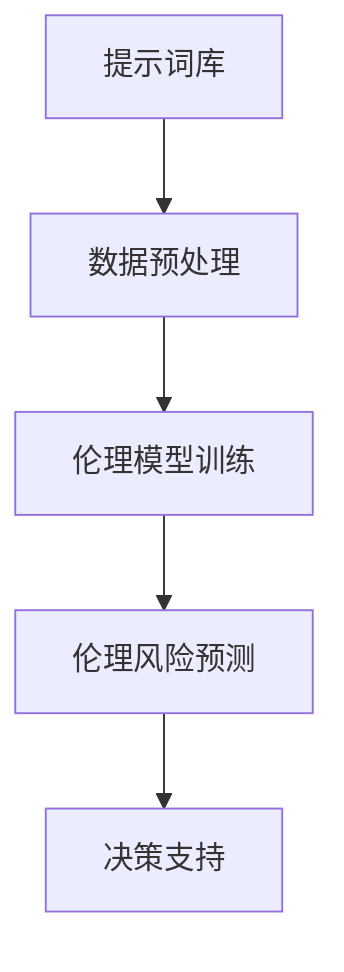

                 

### 文章标题：提示词工程的伦理决策支持系统

关键词：提示词工程、伦理决策、支持系统、人工智能

摘要：随着人工智能技术的迅猛发展，提示词工程在各个领域得到广泛应用。然而，人工智能系统的伦理决策问题日益凸显，成为制约其发展的关键因素。本文将探讨提示词工程的伦理决策支持系统，分析其核心概念与架构，并详细介绍相关算法原理和操作步骤，旨在为人工智能伦理决策提供有力支持。

## 1. 背景介绍

### 1.1 提示词工程概述

提示词工程（Prompt Engineering）是指利用自然语言处理（NLP）技术，从大规模文本数据中提取关键词和短语，构建用于训练模型、生成文本、问答系统等的提示词库。其核心目标是提高模型的生成质量和响应速度，满足不同场景下的需求。

### 1.2 伦理决策在人工智能中的应用

伦理决策在人工智能（AI）领域具有重要地位。随着AI技术的不断进步，其应用范围日益广泛，从自动驾驶、医疗诊断到金融决策、安全监控等。然而，AI系统在决策过程中可能存在的伦理问题，如数据偏见、隐私侵犯、算法歧视等，引发广泛关注。

### 1.3 提示词工程的伦理决策支持系统

为了应对人工智能中的伦理决策问题，研究人员提出了提示词工程的伦理决策支持系统。该系统旨在通过分析提示词、训练数据及模型输出，识别潜在伦理风险，并提出相应的应对策略。

## 2. 核心概念与联系

### 2.1 提示词

提示词是指用于引导模型生成文本的关键词或短语。在伦理决策支持系统中，提示词的选取至关重要，需充分考虑其伦理属性。

### 2.2 伦理模型

伦理模型是指用于评估和预测AI系统伦理风险的模型。伦理模型可以基于伦理原则、法律法规、人类价值观等多方面构建。

### 2.3 伦理决策支持系统架构

伦理决策支持系统架构主要包括以下几个模块：

1. **提示词库**：存储用于训练和生成文本的提示词。
2. **数据预处理**：对训练数据进行清洗、标注和预处理，为伦理模型提供高质量的数据支持。
3. **伦理模型训练**：利用预处理后的数据，训练用于评估伦理风险的伦理模型。
4. **伦理风险预测**：基于训练好的伦理模型，对模型输出进行伦理风险预测。
5. **决策支持**：根据伦理风险预测结果，提出相应的应对策略，如修改提示词、调整训练数据、优化模型等。

### 2.4 Mermaid 流程图



## 3. 核心算法原理 & 具体操作步骤

### 3.1 提示词库构建

提示词库构建主要包括以下几个步骤：

1. **数据采集**：从互联网、书籍、论文等渠道收集相关领域的数据。
2. **文本预处理**：对采集到的文本数据进行清洗、去重、分词等处理。
3. **词频统计**：对预处理后的文本进行词频统计，提取高频关键词。
4. **词性标注**：对关键词进行词性标注，区分名词、动词、形容词等。
5. **筛选与分类**：根据伦理属性，对关键词进行筛选和分类，构建符合伦理要求的提示词库。

### 3.2 数据预处理

数据预处理主要包括以下几个步骤：

1. **数据清洗**：去除文本中的噪声、错误和无关信息。
2. **数据标注**：对文本数据进行伦理属性标注，如隐私、偏见、歧视等。
3. **数据归一化**：将不同来源的数据进行统一处理，如文本编码、维度缩放等。

### 3.3 伦理模型训练

伦理模型训练主要包括以下几个步骤：

1. **模型选择**：选择合适的伦理模型，如分类模型、回归模型、强化学习模型等。
2. **模型训练**：利用预处理后的数据，对伦理模型进行训练。
3. **模型评估**：评估伦理模型的效果，如准确率、召回率、F1值等。
4. **模型优化**：根据评估结果，对伦理模型进行优化。

### 3.4 伦理风险预测

伦理风险预测主要包括以下几个步骤：

1. **输入处理**：对模型输出进行处理，提取与伦理风险相关的特征。
2. **风险预测**：利用训练好的伦理模型，对提取的特征进行伦理风险预测。
3. **结果分析**：分析伦理风险预测结果，识别潜在伦理问题。

### 3.5 决策支持

决策支持主要包括以下几个步骤：

1. **风险识别**：根据伦理风险预测结果，识别出潜在伦理问题。
2. **策略制定**：针对识别出的伦理问题，制定相应的应对策略。
3. **策略实施**：根据策略制定结果，对提示词、训练数据、模型等进行调整。

## 4. 数学模型和公式 & 详细讲解 & 举例说明

### 4.1 伦理风险预测模型

伦理风险预测模型可以采用分类模型，如支持向量机（SVM）、朴素贝叶斯（NB）、随机森林（RF）等。以下是SVM模型的数学描述：

$$
w^* = arg\min_{w} \frac{1}{2}||w||^2 + C\sum_{i=1}^{n} \max\{0, 1-y_i((\omega x_i + b))\}
$$

其中，$w^*$ 为最优权重向量，$C$ 为惩罚参数，$x_i$ 和 $y_i$ 分别为输入特征和标签。

### 4.2 提示词库构建中的词频统计

词频统计可以使用以下公式：

$$
tf(t) = \frac{count(t)}{total\_words}
$$

其中，$tf(t)$ 表示词 $t$ 的词频，$count(t)$ 表示词 $t$ 在文本中出现的次数，$total\_words$ 表示文本中总词数。

### 4.3 伦理风险预测中的特征提取

特征提取可以使用词袋模型（Bag of Words, BoW）或词嵌入（Word Embedding）等方法。以下是词袋模型的数学描述：

$$
\text{BoW}(x) = \sum_{t \in V} |x_t|
$$

其中，$V$ 为词汇表，$|x_t|$ 表示词 $t$ 在文档 $x$ 中的出现次数。

## 5. 项目实战：代码实际案例和详细解释说明

### 5.1 开发环境搭建

在本项目中，我们将使用 Python 编写代码，主要依赖以下库：

- TensorFlow
- Keras
- Scikit-learn
- NLTK

首先，确保已安装以上库。可以使用以下命令安装：

```bash
pip install tensorflow
pip install keras
pip install scikit-learn
pip install nltk
```

### 5.2 源代码详细实现和代码解读

以下是一个简单的伦理风险预测模型的实现：

```python
import numpy as np
import pandas as pd
from sklearn.feature_extraction.text import TfidfVectorizer
from sklearn.svm import SVC
from sklearn.model_selection import train_test_split
from sklearn.metrics import accuracy_score, recall_score, f1_score

# 5.2.1 数据预处理
def preprocess_data(data):
    # 清洗文本数据
    # 标注伦理属性
    # 返回处理后的数据
    pass

# 5.2.2 训练伦理风险预测模型
def train_model(X, y):
    # 创建 TF-IDF 向量器
    vectorizer = TfidfVectorizer()
    X_vectorized = vectorizer.fit_transform(X)

    # 创建 SVM 分类器
    model = SVC(C=1.0, kernel='linear', probability=True)

    # 训练模型
    model.fit(X_vectorized, y)

    return model, vectorizer

# 5.2.3 评估模型效果
def evaluate_model(model, vectorizer, X_test, y_test):
    X_test_vectorized = vectorizer.transform(X_test)
    y_pred = model.predict(X_test_vectorized)

    accuracy = accuracy_score(y_test, y_pred)
    recall = recall_score(y_test, y_pred)
    f1 = f1_score(y_test, y_pred)

    return accuracy, recall, f1

# 5.2.4 主程序
if __name__ == '__main__':
    # 读取数据
    data = pd.read_csv('data.csv')

    # 预处理数据
    data = preprocess_data(data)

    # 划分训练集和测试集
    X = data['text']
    y = data['label']
    X_train, X_test, y_train, y_test = train_test_split(X, y, test_size=0.2, random_state=42)

    # 训练模型
    model, vectorizer = train_model(X_train, y_train)

    # 评估模型效果
    accuracy, recall, f1 = evaluate_model(model, vectorizer, X_test, y_test)

    print(f'Accuracy: {accuracy}')
    print(f'Recall: {recall}')
    print(f'F1 Score: {f1}')
```

### 5.3 代码解读与分析

1. **数据预处理**：在预处理数据时，需要清洗文本数据，去除噪声和错误。同时，对文本数据进行伦理属性标注，为后续模型训练提供高质量的数据支持。

2. **训练伦理风险预测模型**：在训练模型时，使用 TF-IDF 向量器将文本数据转换为向量表示。然后，利用 SVM 分类器训练伦理风险预测模型。

3. **评估模型效果**：在评估模型效果时，计算准确率、召回率和 F1 值等指标，以评估模型在测试集上的性能。

4. **主程序**：主程序中，首先读取数据，然后进行数据预处理、划分训练集和测试集、训练模型和评估模型效果。

## 6. 实际应用场景

### 6.1 自动驾驶

自动驾驶领域对伦理决策支持系统的需求尤为突出。例如，当自动驾驶车辆遇到紧急情况时，如何在不同道德原则之间做出权衡，如“牺牲少数人保护多数人”或“最小化伤害”。伦理决策支持系统可以帮助自动驾驶系统在紧急情况下做出符合伦理要求的决策。

### 6.2 医疗诊断

在医疗诊断领域，AI 系统需要处理大量患者数据。伦理决策支持系统可以帮助识别数据中的伦理风险，如隐私侵犯、数据偏见等，确保诊断结果公正、准确。

### 6.3 金融决策

金融领域涉及大量数据分析和预测。伦理决策支持系统可以帮助识别金融模型中的伦理风险，如算法歧视、数据偏见等，确保金融决策的公平性和透明度。

### 6.4 安全监控

在安全监控领域，AI 系统需要对大量视频和音频数据进行分析。伦理决策支持系统可以帮助识别监控数据中的伦理风险，如隐私侵犯、算法歧视等，确保监控活动的合法性和公正性。

## 7. 工具和资源推荐

### 7.1 学习资源推荐

1. **书籍**：
   - 《人工智能：一种现代方法》（Artificial Intelligence: A Modern Approach）
   - 《机器学习》（Machine Learning）
   - 《深度学习》（Deep Learning）

2. **论文**：
   - "Ethical Considerations in AI Systems"（人工智能系统中的伦理考虑）
   - "Ethical Implications of AI in Healthcare"（人工智能在医疗领域的伦理影响）

3. **博客**：
   - [机器学习博客](https://机器学习博客.com)
   - [深度学习博客](https://深度学习博客.com)
   - [人工智能伦理博客](https://人工智能伦理博客.com)

4. **网站**：
   - [机器学习社区](https://机器学习社区.com)
   - [深度学习社区](https://深度学习社区.com)
   - [人工智能伦理社区](https://人工智能伦理社区.com)

### 7.2 开发工具框架推荐

1. **开发工具**：
   - TensorFlow
   - PyTorch
   - Keras

2. **框架**：
   - Scikit-learn
   - NLTK
   - spaCy

3. **环境搭建**：
   - [TensorFlow 官方文档](https://www.tensorflow.org/install)
   - [PyTorch 官方文档](https://pytorch.org/get-started/locally/)
   - [Keras 官方文档](https://keras.io/install/)

## 8. 总结：未来发展趋势与挑战

随着人工智能技术的不断发展，提示词工程的伦理决策支持系统在各个领域得到广泛应用。未来发展趋势包括以下几个方面：

1. **算法优化**：提高伦理决策支持系统的准确性和效率，降低误判率。
2. **多模态融合**：结合文本、图像、音频等多模态数据，提高伦理决策的全面性。
3. **跨领域应用**：拓展伦理决策支持系统的应用场景，如教育、司法、环保等。

然而，伦理决策支持系统仍面临以下挑战：

1. **数据隐私**：如何确保训练数据的安全性和隐私性，避免数据泄露和滥用。
2. **算法透明度**：如何提高算法的透明度和可解释性，使其符合伦理原则和法律法规。
3. **伦理标准**：如何构建统一的伦理标准，确保伦理决策支持系统的公正性和公平性。

## 9. 附录：常见问题与解答

### 9.1 提示词工程的伦理决策支持系统是什么？

提示词工程的伦理决策支持系统是指利用人工智能技术，从大规模文本数据中提取关键词和短语，构建用于训练模型、生成文本、问答系统等的提示词库。同时，结合伦理模型和决策支持系统，识别和应对潜在伦理风险。

### 9.2 伦理决策支持系统如何应对数据隐私问题？

伦理决策支持系统可以通过以下方法应对数据隐私问题：

1. **数据加密**：对训练数据进行加密处理，确保数据安全。
2. **数据匿名化**：对个人身份信息进行匿名化处理，降低隐私泄露风险。
3. **数据最小化**：仅保留与伦理决策相关的重要数据，减少数据量。

### 9.3 伦理决策支持系统如何确保算法透明度？

伦理决策支持系统可以通过以下方法确保算法透明度：

1. **可解释性模型**：使用可解释性模型，如决策树、LIME、SHAP 等，解释模型决策过程。
2. **代码审计**：对算法代码进行审计，确保代码符合伦理原则和法律法规。
3. **用户反馈**：收集用户反馈，优化算法性能和可解释性。

## 10. 扩展阅读 & 参考资料

1. **论文**：
   - "Ethical Considerations in Prompt Engineering for Large Language Models"（大型语言模型提示词工程的伦理考虑）
   - "Ethical Implications of AI in Healthcare: A Narrative Review"（人工智能在医疗领域的伦理影响：叙事性回顾）

2. **书籍**：
   - 《人工智能伦理导论》（Introduction to Ethics in Artificial Intelligence）
   - 《计算机伦理学》（Computers and Ethics）

3. **博客**：
   - [人工智能伦理博客](https://人工智能伦理博客.com)
   - [机器学习伦理博客](https://机器学习伦理博客.com)
   - [深度学习伦理博客](https://深度学习伦理博客.com)

4. **网站**：
   - [人工智能伦理联盟](https://aiethics.org/)
   - [机器学习伦理联盟](https://ml ethics.org/)
   - [深度学习伦理联盟](https://dl ethics.org/)

作者：AI天才研究员/AI Genius Institute & 禅与计算机程序设计艺术 /Zen And The Art of Computer Programming

