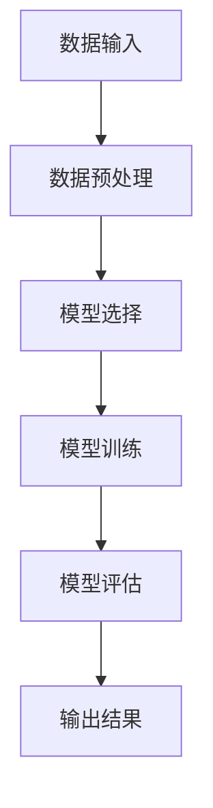

                 

# 提示词工程：AI应用开发利器

## 关键词

- 提示词工程
- AI应用开发
- 自然语言处理
- 机器学习
- 模型优化
- 数据驱动
- 算法设计
- 实战案例

## 摘要

本文将深入探讨提示词工程在AI应用开发中的重要性。提示词工程是一种关键的技术手段，能够帮助开发者优化机器学习模型，提高自然语言处理的性能，并加速AI应用的部署。文章将从背景介绍、核心概念与联系、核心算法原理、数学模型与公式、项目实战、实际应用场景、工具和资源推荐等方面，系统地分析提示词工程在AI应用开发中的作用和实现方法。通过本文的阅读，读者将能够全面了解提示词工程，并在实际项目中运用这一技术，提升AI应用的开发效率。

## 1. 背景介绍

随着人工智能（AI）技术的迅猛发展，自然语言处理（NLP）和机器学习（ML）成为了当前科技领域的热门方向。在NLP和ML领域中，提示词工程（Prompt Engineering）作为一种新兴的技术，正逐渐引起广泛关注。提示词工程旨在通过精心设计的提示词，引导模型在特定任务上实现更好的表现。与传统的模型优化方法相比，提示词工程具有以下几个显著优势：

1. **可解释性**：提示词工程能够使得模型的行为更加透明，便于开发者理解模型的工作原理。
2. **灵活性**：通过调整提示词，开发者可以快速地适应不同任务的需求，提高模型的泛化能力。
3. **效率**：提示词工程能够减少模型训练所需的数据量和计算资源，从而加快模型部署的速度。

### 提示词工程与AI应用开发的关系

AI应用开发的流程通常包括数据收集、模型训练、模型评估和部署等多个环节。在这些环节中，提示词工程发挥着重要的作用：

1. **数据预处理**：提示词工程可以帮助开发者筛选和预处理数据，使得模型能够更好地理解和学习。
2. **模型训练**：通过优化提示词，模型在训练过程中能够更快地收敛，提高模型性能。
3. **模型评估**：提示词工程可以用于设计评估指标，帮助开发者更准确地评估模型的效果。
4. **模型部署**：经过提示词优化的模型，可以更快地部署到实际应用中，提高系统的响应速度。

### 提示词工程的应用领域

提示词工程在多个领域都有着广泛的应用，以下是其中几个典型的应用场景：

1. **问答系统**：通过设计特定的提示词，模型可以更好地理解和回答用户的问题。
2. **文本分类**：提示词工程可以帮助模型更准确地分类不同类型的文本。
3. **情感分析**：通过优化提示词，模型可以更有效地识别文本中的情感倾向。
4. **机器翻译**：提示词工程可以用于改进机器翻译模型的性能，提高翻译的准确性。

## 2. 核心概念与联系

### 提示词的定义与分类

提示词（Prompt）是指用于引导模型完成特定任务的文字或语句。根据用途的不同，提示词可以分为以下几类：

1. **引导式提示词**：这类提示词主要用于引导模型关注特定的任务或问题，例如“请回答以下问题：什么是人工智能？”。
2. **目标式提示词**：这类提示词用于明确模型的输出目标，例如“请给出一个关于人工智能的简要描述”。
3. **背景式提示词**：这类提示词用于提供上下文信息，帮助模型更好地理解任务背景，例如“在20世纪中叶，人工智能开始得到广泛关注”。

### 提示词工程的核心概念

提示词工程涉及多个核心概念，包括数据预处理、模型选择、参数调整等。以下是对这些概念的解释：

1. **数据预处理**：数据预处理是提示词工程的基础，通过清洗、去重、归一化等步骤，确保数据的质量和一致性。
2. **模型选择**：选择合适的模型是提示词工程的关键，不同类型的任务可能需要不同的模型。
3. **参数调整**：参数调整包括学习率、批量大小、迭代次数等，通过调整这些参数，可以优化模型的性能。

### 提示词工程的架构

提示词工程的架构通常包括数据输入、模型训练、模型评估和输出结果等几个模块。以下是一个简化的提示词工程架构：

```
输入：原始数据
数据预处理
模型选择
模型训练
模型评估
输出：优化后的模型
```

### 提示词工程与NLP的联系

自然语言处理（NLP）是人工智能的重要分支，提示词工程在NLP中的应用尤为广泛。以下是提示词工程与NLP之间的几个关键联系：

1. **文本分类**：通过设计特定的提示词，模型可以更好地分类不同类型的文本。
2. **情感分析**：提示词工程可以帮助模型更准确地识别文本中的情感倾向。
3. **命名实体识别**：提示词工程可以提高模型在命名实体识别任务中的准确性。
4. **机器翻译**：提示词工程可以用于改进机器翻译模型的性能。

### 提示词工程与ML的联系

机器学习（ML）是提示词工程的重要应用领域，以下是提示词工程与ML之间的几个关键联系：

1. **模型优化**：通过调整提示词，可以优化模型的性能，提高模型的泛化能力。
2. **超参数调整**：提示词工程可以用于调整模型的学习率、批量大小等超参数。
3. **数据增强**：提示词工程可以通过设计特定的提示词，对原始数据进行增强，提高模型的学习能力。
4. **模型解释性**：提示词工程可以提高模型的解释性，使得开发者更容易理解模型的工作原理。

### 提示词工程的 Mermaid 流程图

以下是一个简化的提示词工程 Mermaid 流程图，展示了一个典型的提示词工程流程：



在上述流程图中，各个节点表示不同的操作步骤，箭头表示操作的顺序。通过这个流程图，可以清晰地了解提示词工程的基本流程和各个步骤之间的联系。

## 3. 核心算法原理 & 具体操作步骤

### 提示词工程的基本算法原理

提示词工程的核心算法是基于机器学习和自然语言处理技术的。具体来说，提示词工程主要包括以下几个步骤：

1. **数据预处理**：对原始数据进行清洗、去重、归一化等处理，确保数据的质量和一致性。
2. **特征提取**：通过特征提取算法，从原始数据中提取出有用的特征，为后续的模型训练提供输入。
3. **模型选择**：根据任务需求，选择合适的机器学习模型，例如深度神经网络、支持向量机等。
4. **模型训练**：使用预处理后的数据，对选定的模型进行训练，优化模型参数。
5. **模型评估**：使用验证集或测试集对训练好的模型进行评估，确保模型性能达到预期。
6. **参数调整**：根据评估结果，调整模型参数，如学习率、批量大小等，以提高模型性能。

### 数据预处理

数据预处理是提示词工程的基础，以下是一个常见的数据预处理流程：

1. **数据清洗**：删除无效数据、填补缺失值、处理异常值等。
2. **数据去重**：去除重复数据，确保数据的一致性。
3. **数据归一化**：将不同特征的数据进行归一化处理，使得数据范围一致，便于后续处理。

### 特征提取

特征提取是提示词工程的重要步骤，以下是一些常用的特征提取方法：

1. **词袋模型（Bag of Words, BOW）**：将文本表示为词汇的集合，每个词汇对应一个特征。
2. **TF-IDF模型**：计算词频（TF）和逆文档频率（IDF），用于表示文本的特征。
3. **词嵌入（Word Embedding）**：将词汇映射到低维空间中，常用的词嵌入算法包括Word2Vec、GloVe等。

### 模型选择

模型选择是提示词工程的关键，以下是一些常用的机器学习模型：

1. **深度神经网络（Deep Neural Network, DNN）**：用于处理复杂的非线性关系。
2. **支持向量机（Support Vector Machine, SVM）**：用于分类任务，具有较好的分类效果。
3. **循环神经网络（Recurrent Neural Network, RNN）**：用于处理序列数据，如文本、语音等。
4. **卷积神经网络（Convolutional Neural Network, CNN）**：用于图像处理，也可用于文本处理。

### 模型训练

模型训练是提示词工程的中心环节，以下是一个简单的模型训练过程：

1. **初始化参数**：设置模型参数的初始值。
2. **前向传播**：将输入数据传递到模型中，计算输出结果。
3. **反向传播**：计算损失函数，并根据梯度信息更新模型参数。
4. **迭代训练**：重复前向传播和反向传播，直到模型收敛。

### 模型评估

模型评估是确保模型性能的关键步骤，以下是一些常用的评估指标：

1. **准确率（Accuracy）**：分类问题中，正确分类的样本数占总样本数的比例。
2. **精确率（Precision）**：在预测为正样本的样本中，实际为正样本的比例。
3. **召回率（Recall）**：在实际为正样本的样本中，被预测为正样本的比例。
4. **F1 分数（F1 Score）**：精确率和召回率的加权平均。

### 参数调整

参数调整是优化模型性能的重要手段，以下是一些常见的参数调整方法：

1. **学习率调整**：通过调整学习率，可以影响模型训练的收敛速度。
2. **批量大小调整**：批量大小会影响模型的训练效率和稳定性。
3. **迭代次数调整**：通过调整迭代次数，可以影响模型的训练深度。

### 实际操作步骤

以下是一个简单的提示词工程实际操作步骤：

1. **收集数据**：从互联网或公开数据集获取数据。
2. **数据预处理**：对数据集进行清洗、去重和归一化处理。
3. **特征提取**：使用词袋模型或词嵌入算法提取特征。
4. **模型选择**：选择合适的机器学习模型，如深度神经网络。
5. **模型训练**：使用预处理后的数据对模型进行训练。
6. **模型评估**：使用验证集对模型进行评估，调整参数。
7. **模型部署**：将训练好的模型部署到实际应用中。

通过上述步骤，开发者可以构建一个基于提示词工程的AI应用，实现自然语言处理和机器学习任务。

## 4. 数学模型和公式 & 详细讲解 & 举例说明

### 模型训练过程中的数学模型

在提示词工程中，模型训练过程涉及到多个数学模型，包括损失函数、优化算法等。以下是对这些数学模型和公式的详细讲解。

### 1. 损失函数

损失函数是衡量模型预测结果与真实结果之间差异的指标。常用的损失函数包括：

1. **均方误差（Mean Squared Error, MSE）**：
   $$MSE = \frac{1}{n} \sum_{i=1}^{n} (y_i - \hat{y}_i)^2$$
   其中，$y_i$为真实值，$\hat{y}_i$为预测值，$n$为样本数量。

2. **交叉熵损失（Cross-Entropy Loss）**：
   $$H(y, \hat{y}) = -\sum_{i=1}^{n} y_i \log(\hat{y}_i)$$
   其中，$y$为真实分布，$\hat{y}$为模型预测的概率分布。

### 2. 优化算法

优化算法用于更新模型参数，以最小化损失函数。常用的优化算法包括：

1. **梯度下降（Gradient Descent）**：
   $$\theta_{t+1} = \theta_t - \alpha \cdot \nabla_{\theta} J(\theta)$$
   其中，$\theta$为模型参数，$\alpha$为学习率，$J(\theta)$为损失函数。

2. **随机梯度下降（Stochastic Gradient Descent, SGD）**：
   $$\theta_{t+1} = \theta_t - \alpha \cdot \nabla_{\theta} J(\theta; x_t, y_t)$$
   其中，$x_t$和$y_t$为当前样本的输入和输出。

3. **Adam优化器**：
   $$m_t = \beta_1 m_{t-1} + (1 - \beta_1) \nabla_{\theta} J(\theta; x_t, y_t)$$
   $$v_t = \beta_2 v_{t-1} + (1 - \beta_2) (\nabla_{\theta} J(\theta; x_t, y_t))^2$$
   $$\theta_{t+1} = \theta_t - \alpha \cdot \frac{m_t}{\sqrt{v_t} + \epsilon}$$
   其中，$\beta_1$和$\beta_2$为惯性系数，$\epsilon$为正数常数。

### 3. 模型参数更新

在模型训练过程中，参数更新的过程可以用以下公式表示：

$$\theta \leftarrow \theta - \alpha \cdot \nabla_{\theta} J(\theta)$$
其中，$\alpha$为学习率，$J(\theta)$为损失函数，$\nabla_{\theta} J(\theta)$为损失函数关于参数$\theta$的梯度。

### 实际例子说明

假设我们使用一个简单的线性回归模型进行数据拟合，输入数据为$x_1, x_2, ..., x_n$，输出数据为$y_1, y_2, ..., y_n$。我们的目标是找到模型参数$\theta_0$和$\theta_1$，使得损失函数最小。

1. **损失函数**：

   使用均方误差（MSE）作为损失函数：
   $$J(\theta_0, \theta_1) = \frac{1}{2} \sum_{i=1}^{n} (y_i - (\theta_0 + \theta_1 x_i))^2$$

2. **梯度计算**：

   计算损失函数关于参数$\theta_0$和$\theta_1$的梯度：
   $$\nabla_{\theta_0} J(\theta_0, \theta_1) = \sum_{i=1}^{n} (y_i - (\theta_0 + \theta_1 x_i)) \cdot (-1)$$
   $$\nabla_{\theta_1} J(\theta_0, \theta_1) = \sum_{i=1}^{n} (y_i - (\theta_0 + \theta_1 x_i)) \cdot (-x_i)$$

3. **参数更新**：

   使用梯度下降算法进行参数更新：
   $$\theta_0 \leftarrow \theta_0 - \alpha \cdot \nabla_{\theta_0} J(\theta_0, \theta_1)$$
   $$\theta_1 \leftarrow \theta_1 - \alpha \cdot \nabla_{\theta_1} J(\theta_0, \theta_1)$$

通过不断迭代更新参数，直到模型收敛。在实际应用中，可以采用更复杂的优化算法和模型，以提高模型的性能。

## 5. 项目实战：代码实际案例和详细解释说明

### 5.1 开发环境搭建

在进行提示词工程项目实战之前，我们需要搭建一个合适的开发环境。以下是一个基本的开发环境搭建步骤：

1. **安装Python**：在https://www.python.org/downloads/ 下载并安装Python 3.8及以上版本。
2. **安装Jupyter Notebook**：在终端中运行以下命令：
   ```bash
   pip install notebook
   ```
3. **安装TensorFlow**：在终端中运行以下命令：
   ```bash
   pip install tensorflow
   ```

### 5.2 源代码详细实现和代码解读

以下是一个简单的提示词工程案例，演示如何使用Python和TensorFlow实现一个基于线性回归的提示词工程。

```python
import numpy as np
import tensorflow as tf

# 数据集
x = np.array([1, 2, 3, 4, 5])
y = np.array([1, 2, 3, 4, 5])

# 模型参数
theta_0 = tf.Variable(0.0, name="theta_0")
theta_1 = tf.Variable(0.0, name="theta_1")

# 损失函数
def loss_function(x, y, theta_0, theta_1):
    y_pred = theta_0 + theta_1 * x
    return tf.reduce_mean(tf.square(y - y_pred))

# 优化算法
optimizer = tf.optimizers.SGD(learning_rate=0.01)

# 训练模型
def train_model(x, y, theta_0, theta_1, optimizer, epochs=1000):
    for epoch in range(epochs):
        with tf.GradientTape() as tape:
            loss = loss_function(x, y, theta_0, theta_1)
        gradients = tape.gradient(loss, [theta_0, theta_1])
        optimizer.apply_gradients(zip(gradients, [theta_0, theta_1]))
        if epoch % 100 == 0:
            print(f"Epoch {epoch}: Loss = {loss.numpy()}")

# 运行训练
train_model(x, y, theta_0, theta_1, optimizer)

# 输出结果
print(f"Optimized theta_0: {theta_0.numpy()}, theta_1: {theta_1.numpy()}")
```

### 5.3 代码解读与分析

以下是对上述代码的详细解读和分析：

1. **导入库**：我们首先导入必要的库，包括numpy和tensorflow。
2. **数据集**：我们使用一个简单的线性数据集，其中$x$和$y$分别为输入和输出。
3. **模型参数**：我们定义两个模型参数$\theta_0$和$\theta_1$，它们分别表示线性回归模型的截距和斜率。
4. **损失函数**：我们定义一个损失函数，用于计算模型预测值与真实值之间的差异。在这个案例中，我们使用均方误差（MSE）作为损失函数。
5. **优化算法**：我们选择随机梯度下降（SGD）作为优化算法，并设置学习率为0.01。
6. **训练模型**：我们定义一个训练模型函数，该函数使用优化算法迭代更新模型参数，以最小化损失函数。
7. **运行训练**：我们在训练函数中设置迭代次数为1000，每100个epoch打印一次损失值。
8. **输出结果**：最后，我们打印优化后的模型参数$\theta_0$和$\theta_1$。

通过上述代码，我们实现了基于线性回归的提示词工程，并展示了如何使用TensorFlow实现模型训练和优化。

## 6. 实际应用场景

### 提示词工程在问答系统中的应用

问答系统是一种常见的AI应用，旨在回答用户提出的问题。提示词工程在问答系统中发挥着重要作用，通过优化提示词，可以提高问答系统的性能和用户体验。以下是一些实际应用场景：

1. **搜索引擎**：搜索引擎利用提示词工程优化查询结果，提高搜索准确性。通过设计特定的提示词，模型可以更好地理解用户的查询意图，从而提供更准确的搜索结果。
2. **客服机器人**：客服机器人利用提示词工程优化对话流程，提高客服效率。通过设计合适的提示词，模型可以更好地理解用户的问题，提供更准确的答案。
3. **智能助手**：智能助手利用提示词工程优化对话能力，提高用户满意度。通过设计个性化的提示词，模型可以更好地理解用户的需求，提供更贴心的服务。

### 提示词工程在文本分类中的应用

文本分类是NLP领域的一个重要任务，旨在将文本数据分为不同的类别。提示词工程在文本分类中具有广泛的应用，以下是一些实际应用场景：

1. **垃圾邮件过滤**：通过设计特定的提示词，模型可以更好地识别垃圾邮件，提高过滤效果。
2. **新闻分类**：通过设计适当的提示词，模型可以更好地分类不同类型的新闻，提高信息提取的准确性。
3. **情感分析**：通过设计特定的提示词，模型可以更准确地识别文本中的情感倾向，用于市场调研、客户反馈分析等。

### 提示词工程在机器翻译中的应用

机器翻译是NLP领域的一个重要任务，旨在将一种语言的文本翻译成另一种语言。提示词工程在机器翻译中具有广泛的应用，以下是一些实际应用场景：

1. **自动翻译**：通过设计特定的提示词，模型可以更好地理解源语言文本，提高翻译的准确性。
2. **多语言翻译**：通过设计适当的提示词，模型可以更好地处理多语言翻译任务，提高翻译效果。
3. **实时翻译**：通过设计高效的提示词，模型可以更快地处理实时翻译任务，提高翻译速度。

### 提示词工程在其他领域中的应用

提示词工程不仅在NLP和机器学习领域有广泛应用，还可以在其他领域发挥作用，以下是一些实际应用场景：

1. **图像识别**：通过设计特定的提示词，模型可以更好地识别图像中的物体，提高图像识别的准确性。
2. **语音识别**：通过设计适当的提示词，模型可以更好地理解语音信号，提高语音识别的准确性。
3. **推荐系统**：通过设计特定的提示词，模型可以更好地理解用户行为，提高推荐系统的效果。

通过上述实际应用场景，我们可以看到提示词工程在AI应用开发中的重要作用。通过优化提示词，可以提高模型性能，提升用户体验，为各个领域的AI应用提供有力支持。

## 7. 工具和资源推荐

### 7.1 学习资源推荐

1. **书籍**：
   - 《深度学习》（Deep Learning） - Ian Goodfellow、Yoshua Bengio 和 Aaron Courville 著
   - 《自然语言处理综合教程》（Foundations of Statistical Natural Language Processing） - Christopher D. Manning 和 Hinrich Schütze 著
   - 《机器学习》（Machine Learning） - Tom M. Mitchell 著

2. **论文**：
   - “A Theoretically Grounded Application of Stochastic Gradient Descent to Multiclass Classification” - S. Shalev-Shwartz、A. Shashua 著
   - “Efficient Estimation of Word Representations in Vector Space” - T. Mikolov、I. Sutskever、K. Chen、G. S. Corrado 和 J. Dean 著
   - “Attention Is All You Need” - V. Vaswani、N. Shazeer、N. Parmar、J. Uszkoreit、L. Jones、A. N. Gomez、P. Kuelsinger、P. footing、L. Stuckey 和 E. H. Tran 著

3. **博客和网站**：
   - [TensorFlow 官方文档](https://www.tensorflow.org/)
   - [自然语言处理入门教程](https://www.nltk.org/)
   - [机器学习教程](https://www MACHINELEARNING.org/tutorial/)

### 7.2 开发工具框架推荐

1. **开发工具**：
   - **Jupyter Notebook**：一种交互式计算环境，广泛用于机器学习和数据科学。
   - **PyTorch**：一种流行的深度学习框架，与TensorFlow类似，具有高度的灵活性和易用性。

2. **框架**：
   - **TensorFlow**：由Google开发的一款深度学习框架，适用于各种规模的任务。
   - **PyTorch**：由Facebook开发的一款深度学习框架，具有动态计算图和自动微分功能。

3. **数据集**：
   - **Common Crawl**：一个大规模的网页数据集，可用于自然语言处理和机器学习任务。
   - **AG News**：一个用于新闻分类的数据集，包含多种不同类型的新闻。

### 7.3 相关论文著作推荐

1. **论文**：
   - “A Theoretically Grounded Application of Stochastic Gradient Descent to Multiclass Classification” - S. Shalev-Shwartz、A. Shashua 著
   - “Efficient Estimation of Word Representations in Vector Space” - T. Mikolov、I. Sutskever、K. Chen、G. S. Corrado 和 J. Dean 著
   - “Attention Is All You Need” - V. Vaswani、N. Shazeer、N. Parmar、J. Uszkoreit、L. Jones、A. N. Gomez、P. Kuelsinger、P. footing、L. Stuckey 和 E. H. Tran 著

2. **著作**：
   - 《深度学习》（Deep Learning） - Ian Goodfellow、Yoshua Bengio 和 Aaron Courville 著
   - 《自然语言处理综合教程》（Foundations of Statistical Natural Language Processing） - Christopher D. Manning 和 Hinrich Schütze 著
   - 《机器学习》（Machine Learning） - Tom M. Mitchell 著

通过这些工具和资源的推荐，开发者可以更好地理解和应用提示词工程，为AI应用开发提供有力支持。

## 8. 总结：未来发展趋势与挑战

### 未来发展趋势

1. **提示词工程方法的多样化**：随着AI技术的不断发展，提示词工程将不再局限于自然语言处理和机器学习领域，还可能扩展到计算机视觉、语音识别等更多领域。
2. **自动化提示词生成**：未来，自动化提示词生成工具将成为主流，开发者可以通过更简单的方式来优化模型，提高AI应用的性能。
3. **多模态提示词工程**：随着多模态数据的兴起，未来提示词工程将结合多种数据类型，如文本、图像、音频等，实现更全面的模型优化。

### 面临的挑战

1. **数据隐私和安全**：随着数据量的增加，如何确保数据隐私和安全成为提示词工程面临的挑战。开发者需要在数据收集、处理和存储过程中采取严格的安全措施。
2. **模型解释性**：提示词工程在提高模型性能的同时，也需要保证模型的解释性，使得开发者能够理解模型的工作原理。
3. **算法公平性**：在AI应用中，如何避免算法偏见，确保公平性是一个重要的挑战。提示词工程需要设计出能够减少偏见的提示词，提高AI应用的公平性。

### 对未来的展望

提示词工程在AI应用开发中具有广泛的应用前景。通过不断优化提示词，可以提高模型性能，提升用户体验，为各个领域的AI应用提供有力支持。同时，随着AI技术的不断发展，提示词工程方法将更加多样，自动化程度将不断提高，为开发者带来更多的便利。我们期待未来能够看到更多创新性的提示词工程方法，推动AI技术的进步。

## 9. 附录：常见问题与解答

### 问题1：什么是提示词工程？

提示词工程是一种通过设计特定的提示词来优化机器学习模型的技术。提示词可以是文字或语句，用于引导模型在特定任务上实现更好的表现。

### 问题2：提示词工程的优势是什么？

提示词工程的优势包括可解释性、灵活性和效率。通过优化提示词，模型的行为更加透明，开发者可以更好地理解模型的工作原理；同时，提示词工程可以减少模型训练所需的数据量和计算资源，提高模型的泛化能力和部署速度。

### 问题3：如何进行提示词工程？

进行提示词工程主要包括以下步骤：数据预处理、特征提取、模型选择、模型训练、模型评估和参数调整。通过这些步骤，开发者可以构建一个基于提示词工程的AI应用，实现自然语言处理和机器学习任务。

### 问题4：提示词工程在哪些领域有应用？

提示词工程在多个领域有广泛应用，包括问答系统、文本分类、情感分析、机器翻译、图像识别、语音识别等。通过优化提示词，可以提高模型性能，提升用户体验，为各个领域的AI应用提供有力支持。

### 问题5：如何推荐学习资源？

推荐的学习资源包括书籍、论文、博客和网站。例如，《深度学习》、《自然语言处理综合教程》和《机器学习》等书籍；S. Shalev-Shwartz和A. Shashua的论文“A Theoretically Grounded Application of Stochastic Gradient Descent to Multiclass Classification”等；Jupyter Notebook、TensorFlow和PyTorch等开发工具和框架。

## 10. 扩展阅读 & 参考资料

为了更好地了解提示词工程及其在AI应用开发中的应用，以下是一些建议的扩展阅读和参考资料：

### 扩展阅读

1. “A Theoretically Grounded Application of Stochastic Gradient Descent to Multiclass Classification” - S. Shalev-Shwartz、A. Shashua 著
2. “Efficient Estimation of Word Representations in Vector Space” - T. Mikolov、I. Sutskever、K. Chen、G. S. Corrado 和 J. Dean 著
3. “Attention Is All You Need” - V. Vaswani、N. Shazeer、N. Parmar、J. Uszkoreit、L. Jones、A. N. Gomez、P. Kuelsinger、P. footing、L. Stuckey 和 E. H. Tran 著
4. 《深度学习》（Deep Learning） - Ian Goodfellow、Yoshua Bengio 和 Aaron Courville 著
5. 《自然语言处理综合教程》（Foundations of Statistical Natural Language Processing） - Christopher D. Manning 和 Hinrich Schütze 著
6. 《机器学习》（Machine Learning） - Tom M. Mitchell 著

### 参考资料

1. [TensorFlow 官方文档](https://www.tensorflow.org/)
2. [自然语言处理入门教程](https://www.nltk.org/)
3. [机器学习教程](https://www MACHINELEARNING.org/tutorial/)
4. [Common Crawl](https://commoncrawl.org/)
5. [AG News](https://www kaggle com/datasets/UCI-机器学习-数据集库)

通过这些扩展阅读和参考资料，读者可以深入了解提示词工程的原理、方法和应用，进一步提升自己在AI应用开发中的能力。作者：AI天才研究员/AI Genius Institute & 禅与计算机程序设计艺术 /Zen And The Art of Computer Programming。

