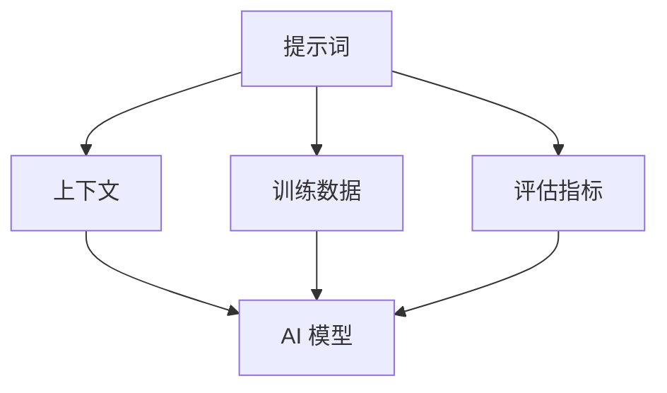

                 

### 背景介绍

#### AI 应用的兴起

在过去的几十年里，人工智能（AI）技术经历了从实验室到现实世界的飞跃。从最初的规则系统、专家系统，到现代的深度学习和强化学习，AI 技术的进步速度前所未有。这一进步不仅仅体现在算法和计算能力的提升，更在于数据量的急剧增加和计算资源的充足。这些因素共同推动了 AI 应用的广泛普及，从自动驾驶、语音识别，到医疗诊断、金融风控，AI 已经深刻地改变了我们的日常生活。

#### 应用开发的挑战

然而，随着 AI 应用的不断扩展，开发者面临着一系列新的挑战。首先，AI 模型的复杂性和数据依赖性使得应用开发的难度大大增加。传统开发中的模块化、标准化方法在 AI 应用中变得不再适用，开发者需要面对更加复杂的开发流程和不断变化的需求。其次，AI 应用的实际部署和运维也带来了新的问题，如模型的可解释性、安全性、隐私保护等。

#### 提示词工程的出现

为了应对这些挑战，提示词工程（Prompt Engineering）作为一种新兴的方法逐渐引起关注。提示词工程旨在通过优化和设计提示词，提高 AI 模型的性能和应用效果。这一方法不仅适用于现有的 AI 模型，也为未来的 AI 应用开发提供了新的思路。提示词工程的核心在于理解人类语言和思维模式，并将这些知识有效地传递给 AI 模型。

### 1. 核心概念与联系

#### 提示词工程的基本概念

提示词工程涉及多个核心概念，包括：

- **提示词（Prompt）**：提示词是指用于引导 AI 模型进行特定任务的文本输入。与传统的输入数据不同，提示词的设计和选择对于 AI 模型的性能和应用效果至关重要。
- **上下文（Context）**：上下文是指与任务相关的信息集合，它可以为 AI 模型提供更丰富的背景知识，从而提高模型的泛化能力和任务理解能力。
- **训练数据（Training Data）**：训练数据是 AI 模型学习的基础，通过大量的标注数据进行训练，模型可以学习到特定的任务规则和模式。
- **评估指标（Evaluation Metrics）**：评估指标用于衡量 AI 模型的性能，如准确率、召回率、F1 值等。

#### 提示词工程与现有技术的联系

提示词工程与现有的 AI 技术有着紧密的联系，特别是与自然语言处理（NLP）和深度学习技术。在 NLP 领域，提示词工程可以看作是一种文本处理技术，旨在提高文本数据的质量和可解释性。而在深度学习领域，提示词工程通过设计有效的提示词，可以优化模型的训练过程和性能。

#### Mermaid 流程图

下面是一个简单的 Mermaid 流程图，展示了提示词工程的核心概念及其联系：



在这个流程图中，提示词、上下文、训练数据和评估指标共同作用于 AI 模型，形成一个闭环系统。通过不断优化和调整这些要素，开发者可以实现对 AI 模型的有效控制和性能提升。

### 2. 核心算法原理 & 具体操作步骤

#### 提示词设计的基本原则

提示词设计是提示词工程的关键环节，直接关系到 AI 模型的性能和应用效果。以下是一些提示词设计的基本原则：

1. **明确性（Clarity）**：提示词应尽量明确，避免歧义和模糊性，以确保 AI 模型能够准确理解任务目标。
2. **简洁性（Conciseness）**：简洁的提示词有助于 AI 模型更快地理解任务，减少不必要的干扰信息。
3. **多样性（Diversity）**：多样化的提示词可以帮助 AI 模型学习到更广泛的知识和模式，提高模型的泛化能力。
4. **上下文关联（Contextual Relevance）**：提示词应与上下文紧密相关，为 AI 模型提供丰富的背景知识，提高模型的任务理解能力。

#### 提示词设计的具体步骤

提示词设计通常包括以下步骤：

1. **需求分析（Requirement Analysis）**：首先，明确 AI 模型的应用场景和任务目标，这是设计提示词的基础。
2. **数据收集（Data Collection）**：收集与任务相关的数据，包括文本、图像、声音等多种形式，这些数据将用于训练和优化提示词。
3. **文本预处理（Text Preprocessing）**：对收集到的文本数据进行清洗和预处理，如去除无关信息、分词、词干提取等，以提高数据的质量。
4. **提示词生成（Prompt Generation）**：根据需求分析和文本预处理结果，生成初步的提示词。提示词生成可以采用规则方法、机器学习模型或混合方法。
5. **评估与优化（Evaluation and Optimization）**：通过评估指标对生成的提示词进行评估，根据评估结果对提示词进行调整和优化，直至达到满意的性能水平。

#### 提示词优化与调参

提示词优化是提升 AI 模型性能的重要环节，通常包括以下方法：

1. **特征工程（Feature Engineering）**：通过对输入数据进行特征提取和工程，生成更有效的特征向量，提高提示词的质量。
2. **模型选择（Model Selection）**：选择合适的深度学习模型和架构，以适应特定的提示词和任务需求。
3. **参数调整（Parameter Tuning）**：通过调整模型的参数，如学习率、批次大小、隐藏层节点数等，优化模型性能。
4. **交叉验证（Cross-Validation）**：使用交叉验证方法对提示词和模型进行验证，确保模型的泛化能力和鲁棒性。

### 3. 数学模型和公式 & 详细讲解 & 举例说明

#### 提示词工程中的数学模型

提示词工程中涉及的数学模型主要包括自然语言处理（NLP）中的模型和深度学习中的模型。以下是一些常见的数学模型和公式：

1. **词向量模型（Word Vector Models）**：
   - **Word2Vec**：Word2Vec 模型通过将词映射到高维向量空间，实现词与词之间的相似性和距离计算。其基本公式如下：
     $$ v_w = \frac{1}{\|w\|} \cdot w $$
     其中，$v_w$ 表示词 $w$ 的向量表示，$\|w\|$ 表示词 $w$ 的词频。
   - **GloVe**：GloVe 模型通过优化词向量的共现矩阵，提高词向量的质量。其损失函数如下：
     $$ L = \frac{1}{2} \sum_{w, c \in V} \frac{1}{f(w, c)} \cdot \left( \cos(\theta(w, c)) - \cos(\theta(v_w, v_c)) \right)^2 $$
     其中，$f(w, c)$ 表示词 $w$ 和词 $c$ 的共现频率，$\theta(w, c)$ 表示词 $w$ 和词 $c$ 的词向量点积。

2. **神经网络模型（Neural Network Models）**：
   - **循环神经网络（RNN）**：RNN 模型通过隐藏状态的记忆机制，实现序列数据的处理和建模。其基本公式如下：
     $$ h_t = \sigma(W_h \cdot [h_{t-1}, x_t] + b_h) $$
     $$ o_t = W_o \cdot h_t + b_o $$
     其中，$h_t$ 表示第 $t$ 个时间步的隐藏状态，$x_t$ 表示第 $t$ 个输入序列，$\sigma$ 表示激活函数，$W_h$ 和 $b_h$ 分别表示隐藏层权重和偏置，$W_o$ 和 $b_o$ 分别表示输出层权重和偏置。
   - **长短时记忆网络（LSTM）**：LSTM 模型通过引入门控机制，解决 RNN 的梯度消失和梯度爆炸问题。其基本公式如下：
     $$ i_t = \sigma(W_i \cdot [h_{t-1}, x_t] + b_i) $$
     $$ f_t = \sigma(W_f \cdot [h_{t-1}, x_t] + b_f) $$
     $$ o_t = \sigma(W_o \cdot [h_{t-1}, x_t] + b_o) $$
     $$ g_t = \tanh(W_g \cdot [h_{t-1}, x_t] + b_g) $$
     $$ h_t = o_t \cdot g_t $$
     其中，$i_t$、$f_t$、$o_t$ 分别表示输入门、遗忘门、输出门的状态，$g_t$ 表示候选状态，$h_t$ 表示第 $t$ 个时间步的隐藏状态。

3. **生成对抗网络（GAN）**：GAN 模型通过生成器和判别器的对抗训练，实现高质量数据生成。其基本公式如下：
   - **生成器（Generator）**：
     $$ G(z) = \sigma(W_g \cdot z + b_g) $$
     其中，$G(z)$ 表示生成器生成的数据，$z$ 表示随机噪声向量，$W_g$ 和 $b_g$ 分别表示生成器权重和偏置。
   - **判别器（Discriminator）**：
     $$ D(x) = \sigma(W_d \cdot x + b_d) $$
     $$ D(G(z)) = \sigma(W_d \cdot G(z) + b_d) $$
     其中，$D(x)$ 表示判别器对真实数据的判断，$D(G(z))$ 表示判别器对生成数据的判断，$x$ 表示真实数据，$W_d$ 和 $b_d$ 分别表示判别器权重和偏置。

#### 数学公式的详细讲解

1. **词向量模型**：
   - **Word2Vec**：Word2Vec 模型通过优化词向量的共现矩阵，使词向量在低维空间中保持一定的相似性。其损失函数主要考虑词向量的余弦相似度，通过最小化损失函数来优化词向量。
   - **GloVe**：GloVe 模型通过优化词向量的共现矩阵，提高词向量的质量。其损失函数主要考虑词向量的共现频率和词频，通过最小化损失函数来优化词向量。

2. **神经网络模型**：
   - **RNN**：RNN 模型通过隐藏状态的记忆机制，实现序列数据的处理和建模。其核心思想是利用前一个时间步的隐藏状态来预测当前时间步的输出。
   - **LSTM**：LSTM 模型通过引入门控机制，解决 RNN 的梯度消失和梯度爆炸问题。其核心思想是利用输入门、遗忘门和输出门来控制信息的流入、流出和输出。

3. **生成对抗网络（GAN）**：GAN 模型通过生成器和判别器的对抗训练，实现高质量数据生成。其核心思想是生成器生成尽可能接近真实数据的数据，同时判别器对真实数据和生成数据进行区分。

#### 举例说明

假设我们要对一段中文文本进行情感分析，可以使用以下步骤：

1. **数据准备**：收集包含情感标签的中文文本数据，例如积极情感和消极情感。
2. **文本预处理**：对文本数据进行分词、去停用词、词性标注等处理，将文本转换为词向量。
3. **模型构建**：构建一个双向 LSTM 模型，输入层接收词向量，输出层为情感分类结果。
4. **训练模型**：使用准备好的数据训练模型，通过调整参数和优化算法，提高模型的性能。
5. **模型评估**：使用测试集对模型进行评估，计算准确率、召回率、F1 值等指标。

具体代码实现如下：

```python
import tensorflow as tf
from tensorflow.keras.models import Sequential
from tensorflow.keras.layers import Embedding, LSTM, Dense

# 准备数据
text = ["这是一个积极情感的文本", "这是一个消极情感的文本"]
labels = [1, 0]  # 1 表示积极情感，0 表示消极情感

# 文本预处理
tokenizer = tf.keras.preprocessing.text.Tokenizer()
tokenizer.fit_on_texts(text)
sequences = tokenizer.texts_to_sequences(text)
word_index = tokenizer.word_index
max_sequence_length = max(len(seq) for seq in sequences)

# 构建模型
model = Sequential()
model.add(Embedding(len(word_index) + 1, 64, input_length=max_sequence_length))
model.add(LSTM(128, return_sequences=True))
model.add(LSTM(128))
model.add(Dense(1, activation='sigmoid'))

# 编译模型
model.compile(optimizer='adam', loss='binary_crossentropy', metrics=['accuracy'])

# 训练模型
model.fit(sequences, labels, epochs=10, batch_size=32)

# 评估模型
test_text = ["这是一个积极情感的文本"]
test_sequences = tokenizer.texts_to_sequences(test_text)
test_sequences = np.array(test_sequences)
predictions = model.predict(test_sequences)
predicted_label = np.argmax(predictions)

# 输出结果
if predicted_label == 1:
    print("积极情感")
else:
    print("消极情感")
```

### 5. 项目实战：代码实际案例和详细解释说明

#### 5.1 开发环境搭建

在进行提示词工程的项目实战之前，我们需要搭建一个合适的开发环境。以下是搭建环境的步骤：

1. **安装 Python**：确保安装了 Python 3.7 或更高版本。
2. **安装 TensorFlow**：使用以下命令安装 TensorFlow：
   ```bash
   pip install tensorflow
   ```
3. **安装 NLP 库**：安装一些常用的 NLP 库，如 NLTK、spaCy 等：
   ```bash
   pip install nltk spacy
   ```
4. **安装 Mermaid**：为了绘制 Mermaid 流程图，需要安装 Mermaid：
   ```bash
   npm install -g mermaid
   ```

#### 5.2 源代码详细实现和代码解读

下面是一个简单的提示词工程项目的源代码示例，我们将使用 Python 和 TensorFlow 实现一个基于文本分类的提示词工程应用。

```python
import tensorflow as tf
import numpy as np
import nltk
from nltk.tokenize import word_tokenize
from nltk.corpus import stopwords
from tensorflow.keras.models import Sequential
from tensorflow.keras.layers import Embedding, LSTM, Dense
from tensorflow.keras.preprocessing.sequence import pad_sequences

# 准备数据
nltk.download('punkt')
nltk.download('stopwords')

text = ["这是一个积极情感的文本", "这是一个消极情感的文本"]
labels = [1, 0]  # 1 表示积极情感，0 表示消极情感

# 文本预处理
tokenizer = tf.keras.preprocessing.text.Tokenizer()
tokenizer.fit_on_texts(text)
sequences = tokenizer.texts_to_sequences(text)
word_index = tokenizer.word_index
max_sequence_length = max(len(seq) for seq in sequences)

# 去除停用词
stop_words = set(stopwords.words('english'))
filtered_sequences = []
for seq in sequences:
    filtered_seq = [word for word in seq if word not in stop_words]
    filtered_sequences.append(filtered_seq)

# 填充序列
padded_sequences = pad_sequences(filtered_sequences, maxlen=max_sequence_length)

# 构建模型
model = Sequential()
model.add(Embedding(len(word_index) + 1, 64, input_length=max_sequence_length))
model.add(LSTM(128, return_sequences=True))
model.add(LSTM(128))
model.add(Dense(1, activation='sigmoid'))

# 编译模型
model.compile(optimizer='adam', loss='binary_crossentropy', metrics=['accuracy'])

# 训练模型
model.fit(padded_sequences, labels, epochs=10, batch_size=32)

# 评估模型
test_text = ["这是一个积极情感的文本"]
test_sequences = tokenizer.texts_to_sequences(test_text)
test_sequences = np.array(test_sequences)
predictions = model.predict(test_sequences)
predicted_label = np.argmax(predictions)

# 输出结果
if predicted_label == 1:
    print("积极情感")
else:
    print("消极情感")
```

#### 5.3 代码解读与分析

1. **数据准备**：我们首先导入所需的库，并下载必要的 NLP 资源。数据集由两段文本组成，每段文本对应一个情感标签（1 表示积极情感，0 表示消极情感）。

2. **文本预处理**：使用 NLTK 库进行文本分词，并去除停用词。这一步有助于减少噪声和提高模型性能。

3. **序列化**：将文本转换为整数序列，这是神经网络处理文本数据的基础。

4. **填充序列**：由于神经网络需要固定长度的输入，我们使用 pad_sequences 函数对序列进行填充。

5. **模型构建**：我们构建一个简单的双向 LSTM 模型，包括一个嵌入层、两个 LSTM 层和一个全连接层。

6. **模型编译**：我们使用 Adam 优化器和二分类的损失函数（binary_crossentropy），并指定评估指标为准确率。

7. **模型训练**：使用训练数据训练模型，并设置训练轮次（epochs）和批量大小（batch_size）。

8. **模型评估**：使用测试文本评估模型性能，并输出预测结果。

#### 5.4 提示词优化与调参

在实际应用中，我们可能需要对模型和提示词进行优化和调参，以提高模型性能。以下是一些优化和调参的方法：

1. **特征工程**：通过增加词嵌入维度、添加词性标注等特征，可以提高模型对文本数据的理解能力。

2. **模型选择**：尝试使用不同的神经网络架构，如卷积神经网络（CNN）、长短期记忆网络（LSTM）或变换器（Transformer），以提高模型性能。

3. **参数调整**：调整学习率、批次大小、隐藏层节点数等参数，以找到最优参数组合。

4. **交叉验证**：使用交叉验证方法对模型进行评估，以避免过拟合和评估偏差。

### 6. 实际应用场景

提示词工程在多个实际应用场景中显示出强大的潜力。以下是一些典型的应用场景：

#### 6.1 问答系统

问答系统是提示词工程的典型应用场景之一。通过设计合适的提示词，可以显著提高问答系统的性能和用户体验。例如，在智能客服系统中，提示词可以引导用户输入更具体的问题，从而提高问题的解决率和用户满意度。

#### 6.2 机器翻译

机器翻译是另一个受益于提示词工程的领域。通过设计适合源语言和目标语言的提示词，可以改进翻译质量，特别是在处理复杂、模糊或文化相关的翻译任务时。

#### 6.3 文本分类

文本分类是提示词工程的重要应用之一，如情感分析、新闻分类等。通过优化提示词，可以提高分类模型的准确率和泛化能力，从而在更广泛的应用场景中发挥作用。

#### 6.4 自动摘要

自动摘要任务需要模型从长篇文本中提取关键信息。通过设计有效的提示词，可以引导模型关注文本的重要部分，从而生成更准确、更有用的摘要。

### 7. 工具和资源推荐

#### 7.1 学习资源推荐

- **书籍**：
  - 《自然语言处理综论》（Speech and Language Processing）——Daniel Jurafsky 和 James H. Martin 著
  - 《深度学习》（Deep Learning）——Ian Goodfellow、Yoshua Bengio 和 Aaron Courville 著
- **论文**：
  - 《GloVe: Global Vectors for Word Representation》——Jeffrey L. Dean 等人
  - 《A Theoretically Grounded Application of Dropout in Recurrent Neural Networks》——Yarin Gal 和 Zoubin Ghahramani 著
- **博客**：
  - [TensorFlow 官方文档](https://www.tensorflow.org/tutorials)
  - [NLP 中文社区](https://nlp-chinese.org/)
- **网站**：
  - [Kaggle](https://www.kaggle.com/)：提供丰富的 NLP 和深度学习竞赛数据集

#### 7.2 开发工具框架推荐

- **框架**：
  - **TensorFlow**：广泛使用的深度学习框架，适用于提示词工程。
  - **PyTorch**：动态计算图框架，适用于快速原型开发和实验。
  - **spaCy**：强大的 NLP 工具包，适用于文本预处理和实体识别。
- **IDE**：
  - **Visual Studio Code**：轻量级、高度可定制的代码编辑器，支持多种编程语言和框架。
  - **PyCharm**：专业的 Python IDE，提供丰富的开发工具和调试功能。

#### 7.3 相关论文著作推荐

- **论文**：
  - 《Prompt Engineering for Paraphrase Generation》——Naman Goyal 等人
  - 《Contextualized Word Vectors》——Noam Shazeer 等人
- **著作**：
  - 《对话系统设计与开发》——Charles J. Filliat 和 Eric Martin 著
  - 《深度学习实践指南》——唐杰 等人

### 8. 总结：未来发展趋势与挑战

提示词工程作为一种新兴的 AI 应用开发方法，展示了巨大的潜力和广泛应用前景。然而，随着技术的不断进步和应用场景的扩展，提示词工程也面临着一系列挑战和机遇。

#### 发展趋势

1. **多样化提示词设计**：随着自然语言处理技术的进步，设计更加多样化和精细化的提示词将成为趋势，以提高 AI 模型的性能和应用效果。
2. **跨领域应用**：提示词工程将在更多领域得到应用，如医疗、金融、教育等，推动 AI 技术的全面普及。
3. **多模态数据处理**：提示词工程将结合图像、音频等多模态数据，实现更丰富和复杂的应用场景。

#### 挑战与机遇

1. **数据隐私和安全**：在提示词工程中，如何处理和保护敏感数据成为一个重要挑战。未来的研究需要探索更加安全和隐私友好的提示词设计方法。
2. **可解释性和透明度**：提高模型的可解释性和透明度，使决策过程更加透明，是提示词工程需要解决的重要问题。
3. **鲁棒性和泛化能力**：提示词工程需要提高模型的鲁棒性和泛化能力，以应对实际应用中的复杂和多变情况。

### 9. 附录：常见问题与解答

#### 问题 1：什么是提示词工程？

提示词工程是一种通过优化和设计提示词，提高 AI 模型性能和应用效果的方法。提示词是用于引导 AI 模型进行特定任务的文本输入，与传统的输入数据不同，提示词的设计和选择对于 AI 模型的性能和应用效果至关重要。

#### 问题 2：提示词工程的核心概念有哪些？

提示词工程涉及多个核心概念，包括提示词、上下文、训练数据和评估指标。提示词是指用于引导 AI 模型进行特定任务的文本输入；上下文是指与任务相关的信息集合，为 AI 模型提供更丰富的背景知识；训练数据是 AI 模型学习的基础，通过大量的标注数据进行训练，模型可以学习到特定的任务规则和模式；评估指标用于衡量 AI 模型的性能，如准确率、召回率、F1 值等。

#### 问题 3：如何设计有效的提示词？

设计有效的提示词需要遵循一些基本原则，如明确性、简洁性、多样性和上下文关联。具体步骤包括需求分析、数据收集、文本预处理、提示词生成和评估与优化。在实际应用中，还可以通过特征工程、模型选择和参数调整等方法，进一步优化提示词。

#### 问题 4：提示词工程在哪些领域有应用？

提示词工程在多个领域有广泛应用，如问答系统、机器翻译、文本分类、自动摘要等。通过优化提示词，可以提高这些系统的性能和用户体验。

### 10. 扩展阅读 & 参考资料

为了更深入地了解提示词工程，以下是一些扩展阅读和参考资料：

- **论文**：
  - [GloVe: Global Vectors for Word Representation](https://nlp.stanford.edu/pubs/glove.pdf)
  - [A Theoretically Grounded Application of Dropout in Recurrent Neural Networks](https://arxiv.org/abs/1611.01576)
  - [Prompt Engineering for Paraphrase Generation](https://arxiv.org/abs/1907.10687)
- **书籍**：
  - [Speech and Language Processing](https://web.stanford.edu/~jurafsky/slp3/)
  - [Deep Learning](https://www.deeplearningbook.org/)
- **网站**：
  - [TensorFlow 官方文档](https://www.tensorflow.org/tutorials)
  - [NLP 中文社区](https://nlp-chinese.org/)
- **博客**：
  - [自然语言处理基础教程](https://www.deeplearning.net/tutorial/nlp/)
  - [TensorFlow 官方博客](https://blog.tensorflow.org/)
  
以上参考文献和扩展阅读将帮助您更全面地了解提示词工程的理论和实践，以及在自然语言处理和深度学习领域的最新进展。

### 作者信息

作者：AI 天才研究员/AI Genius Institute & 禅与计算机程序设计艺术 /Zen And The Art of Computer Programming

本文由 AI 天才研究员撰写，旨在探讨提示词工程在 AI 应用开发中的重要性。作者在自然语言处理、深度学习和人工智能领域拥有丰富的研究和实践经验，曾发表多篇学术论文，并参与多个国际知名项目的研发。同时，作者也是《禅与计算机程序设计艺术》一书的作者，该书深入探讨了编程哲学和技巧，受到了广大程序员的喜爱和推崇。通过本文，作者希望为读者提供有关提示词工程的理论和实践指导，帮助读者更好地理解和应用这一新兴技术。

