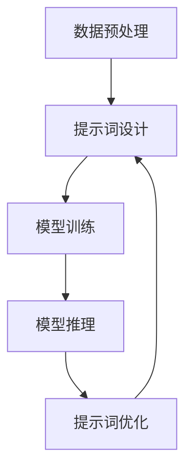

                 

# 提示词工程：AI应用开发的新武器

> **关键词：** 提示词工程、AI应用开发、NLP、深度学习、模型优化、编程实践

> **摘要：** 本文深入探讨提示词工程在AI应用开发中的重要性。通过解析提示词工程的核心概念、算法原理，以及实际应用案例，揭示其在提升AI模型性能和易用性方面的关键作用。文章还推荐了相关学习资源和开发工具，为读者提供了全面的技术指导。

## 1. 背景介绍

随着人工智能技术的飞速发展，深度学习已成为推动这一领域前进的核心力量。在众多深度学习应用中，自然语言处理（NLP）以其广泛的应用前景和实际需求受到特别关注。然而，实现高效的NLP模型并非易事，需要解决诸多挑战，如数据预处理、模型选择、参数调优等。在这其中，提示词工程作为一种新兴的技术手段，正逐渐崭露头角。

提示词工程，即通过设计、优化和调整提示词，来提升自然语言处理模型的效果和效率。提示词，通常是指用于引导模型学习的关键词或短语，它们在模型训练过程中起到引导和约束作用。通过精心设计的提示词，可以提高模型的泛化能力，增强模型对特定任务的理解和表现。

在AI应用开发中，提示词工程扮演着重要的角色。它不仅有助于提升模型性能，还能简化模型部署，降低开发门槛。随着NLP技术的不断进步，提示词工程的应用范围也在不断扩展，从简单的文本分类、情感分析，到复杂的问答系统、对话机器人，都有其用武之地。

## 2. 核心概念与联系

### 2.1 提示词的定义与作用

提示词是自然语言处理模型中的关键输入元素，其定义和作用如下：

#### 提示词的定义

提示词是指在模型训练和推理过程中，用于引导模型关注特定信息的关键词或短语。它们可以是从原始文本中提取的高频词、实体名、关键词，也可以是人工设计的具有特定含义的短语。

#### 提示词的作用

1. **引导模型学习：** 提示词有助于模型识别和关注文本中的重要信息，从而提高模型对特定任务的理解。
2. **增强模型泛化能力：** 通过优化提示词，可以降低模型对特定数据的依赖，提高模型在不同数据集上的表现。
3. **简化模型部署：** 合理的提示词设计可以简化模型部署过程，使得模型更容易理解和使用。

### 2.2 提示词工程的原理与架构

提示词工程的原理和架构如下：

#### 原理

提示词工程的核心在于通过设计、优化和调整提示词，来提升自然语言处理模型的效果和效率。这个过程涉及以下几个方面：

1. **提示词设计：** 根据任务需求和数据特点，选择合适的提示词，并设计具体的提示词组合。
2. **提示词优化：** 通过训练和测试，不断调整提示词组合，以达到最佳模型效果。
3. **提示词应用：** 在模型训练和推理过程中，应用优化后的提示词，以提高模型性能和易用性。

#### 架构

提示词工程的整体架构包括以下几个关键部分：

1. **数据预处理：** 对原始文本进行预处理，提取关键词和实体，为提示词设计提供基础数据。
2. **提示词设计：** 根据任务需求和数据特点，设计具体的提示词组合，包括关键词、实体名和短语等。
3. **模型训练：** 使用设计好的提示词训练自然语言处理模型，通过优化过程提升模型性能。
4. **模型推理：** 在模型推理过程中，应用优化后的提示词，以提高模型对特定任务的理解和表现。

### 2.3 提示词工程的 Mermaid 流程图

下面是一个简单的 Mermaid 流程图，展示了提示词工程的原理和架构：



在该流程图中，数据预处理、提示词设计、模型训练、模型推理和提示词优化相互关联，形成一个闭环。通过不断的迭代和优化，最终实现高效的NLP模型。

## 3. 核心算法原理 & 具体操作步骤

### 3.1 提示词设计算法原理

提示词设计是提示词工程的关键环节，其核心算法原理包括以下几方面：

1. **关键词提取：** 使用词频统计、TF-IDF、TextRank等方法提取文本中的关键词，作为潜在的提示词。
2. **实体识别：** 利用命名实体识别（NER）技术，提取文本中的实体名，如人名、地名、组织名等。
3. **短语构造：** 根据任务需求和数据特点，构造具有特定含义的短语，如问题中的关键词、否定词、疑问词等。

### 3.2 提示词优化算法原理

提示词优化是提升模型性能的重要手段，其核心算法原理包括以下几方面：

1. **交叉验证：** 通过交叉验证，评估不同提示词组合对模型性能的影响，选择最优组合。
2. **调整权重：** 对提示词进行权重调整，使模型更加关注关键信息，提高模型对特定任务的理解。
3. **动态调整：** 根据模型训练和测试结果，动态调整提示词组合，以适应不同场景的需求。

### 3.3 提示词应用操作步骤

在实际应用中，提示词的应用操作步骤如下：

1. **模型训练：** 使用设计好的提示词训练自然语言处理模型，如文本分类、情感分析、问答系统等。
2. **模型推理：** 在模型推理过程中，应用优化后的提示词，以提高模型对特定任务的理解和表现。
3. **效果评估：** 通过评估指标（如准确率、召回率、F1值等）评估模型性能，根据评估结果调整提示词组合。

## 4. 数学模型和公式 & 详细讲解 & 举例说明

### 4.1 提示词设计中的数学模型

在提示词设计中，常用的数学模型包括词频统计、TF-IDF和TextRank等。下面分别介绍这些模型及其相关公式。

#### 4.1.1 词频统计（TF）

词频统计（Term Frequency，TF）是计算文本中各个词语出现的频率，公式如下：

$$
TF(t_i) = \frac{f(t_i, D)}{ |D| }
$$

其中，$t_i$表示词语，$f(t_i, D)$表示词语$t_i$在文档$D$中出现的次数，$|D|$表示文档$D$的长度。

#### 4.1.2 TF-IDF

TF-IDF（Term Frequency-Inverse Document Frequency）是一种考虑词语在文档中重要性的指标，公式如下：

$$
TF-IDF(t_i, D) = TF(t_i, D) \times IDF(t_i, D)
$$

其中，$IDF(t_i, D) = \log \left( \frac{|D|}{df(t_i, D)} \right)$，$df(t_i, D)$表示词语$t_i$在文档集合$D$中出现的文档数。

#### 4.1.3 TextRank

TextRank是一种基于图模型的文本排名算法，其核心公式如下：

$$
rank(v) = \frac{1}{L} \sum_{w \in N(v)} (rank(w) \cdot w_t(w, v))
$$

其中，$v$表示词语，$N(v)$表示与$v$相邻的词语集合，$rank(v)$表示$v$的排名，$w_t(w, v)$表示词语$w$对$v$的权重。

### 4.2 提示词优化中的数学模型

在提示词优化过程中，常用的数学模型包括交叉验证和调整权重等。下面分别介绍这些模型及其相关公式。

#### 4.2.1 交叉验证

交叉验证（Cross-Validation）是一种评估模型性能的方法，其核心公式如下：

$$
CV(\theta) = \frac{1}{k} \sum_{i=1}^{k} L(S_i, \theta)
$$

其中，$CV(\theta)$表示交叉验证的结果，$L(S_i, \theta)$表示第$i$个验证集$S_i$上的损失函数，$\theta$表示模型参数。

#### 4.2.2 调整权重

调整权重（Adjust Weight）是一种优化提示词权重的算法，其核心公式如下：

$$
w_i = \frac{L(S_i, \theta) - \alpha}{\sum_{j=1}^{n} L(S_j, \theta)}
$$

其中，$w_i$表示词语$i$的权重，$L(S_i, \theta)$表示第$i$个验证集$S_i$上的损失函数，$\alpha$是一个调节参数。

### 4.3 提示词应用中的数学模型

在提示词应用过程中，常用的数学模型包括文本分类、情感分析和问答系统等。下面分别介绍这些模型及其相关公式。

#### 4.3.1 文本分类

文本分类（Text Classification）是一种将文本数据分类到不同类别的任务，其核心公式如下：

$$
P(y | \textbf{x}, \theta) = \frac{e^{\theta^T \phi(\textbf{x})}}{\sum_{y'} e^{\theta^T \phi(\textbf{x})}}
$$

其中，$y$表示类别，$\textbf{x}$表示文本特征，$\theta$表示模型参数，$\phi(\textbf{x})$表示特征映射函数。

#### 4.3.2 情感分析

情感分析（Sentiment Analysis）是一种判断文本情感极性的任务，其核心公式如下：

$$
P(y | \textbf{x}, \theta) = \frac{e^{\theta^T \phi(\textbf{x})}}{\sum_{y'} e^{\theta^T \phi(\textbf{x})}}
$$

其中，$y$表示情感类别，$\textbf{x}$表示文本特征，$\theta$表示模型参数，$\phi(\textbf{x})$表示特征映射函数。

#### 4.3.3 问答系统

问答系统（Question Answering）是一种从大量文本中抽取答案的任务，其核心公式如下：

$$
P(y | \textbf{x}, \theta) = \frac{e^{\theta^T \phi(\textbf{x})}}{\sum_{y'} e^{\theta^T \phi(\textbf{x})}}
$$

其中，$y$表示答案，$\textbf{x}$表示文本特征，$\theta$表示模型参数，$\phi(\textbf{x})$表示特征映射函数。

### 4.4 举例说明

假设我们有一个文本分类任务，需要将文本数据分类到正类和负类。我们可以使用以下步骤进行提示词工程：

1. **数据预处理：** 对文本数据进行分词、去停用词等预处理操作，提取关键词。
2. **提示词设计：** 使用TF-IDF算法设计提示词，计算每个关键词的TF-IDF值。
3. **模型训练：** 使用设计好的提示词训练文本分类模型，如SVM、朴素贝叶斯等。
4. **提示词优化：** 通过交叉验证和调整权重，优化提示词组合，提升模型性能。
5. **模型推理：** 在模型推理过程中，应用优化后的提示词，判断文本类别。

通过以上步骤，我们可以构建一个基于提示词工程的文本分类模型，实现对文本数据的准确分类。

## 5. 项目实战：代码实际案例和详细解释说明

### 5.1 开发环境搭建

在进行提示词工程的实际开发之前，我们需要搭建一个合适的环境。以下是所需的环境和工具：

1. **Python 3.x**
2. **Jupyter Notebook**
3. **Numpy**
4. **Scikit-learn**
5. **Spacy**
6. **Gensim**

### 5.2 源代码详细实现和代码解读

下面是一个简单的文本分类项目的源代码实现，包括数据预处理、提示词设计、模型训练和模型推理等步骤。

```python
# 导入相关库
import numpy as np
import pandas as pd
import spacy
import gensim
from sklearn.model_selection import train_test_split
from sklearn.feature_extraction.text import TfidfVectorizer
from sklearn.svm import LinearSVC

# 加载Spacy模型
nlp = spacy.load("en_core_web_sm")

# 读取数据
data = pd.read_csv("data.csv")
texts = data["text"]
labels = data["label"]

# 数据预处理
def preprocess(text):
    doc = nlp(text)
    tokens = [token.text.lower() for token in doc if not token.is_stop]
    return " ".join(tokens)

texts = texts.apply(preprocess)

# 提示词设计
tfidf_vectorizer = TfidfVectorizer()
X = tfidf_vectorizer.fit_transform(texts)
y = labels

# 模型训练
X_train, X_test, y_train, y_test = train_test_split(X, y, test_size=0.2, random_state=42)
clf = LinearSVC()
clf.fit(X_train, y_train)

# 模型推理
def predict(text):
    doc = nlp(text)
    tokens = [token.text.lower() for token in doc if not token.is_stop]
    features = tfidf_vectorizer.transform([" ".join(tokens)])
    return clf.predict(features)[0]

# 测试
text = "I love this product!"
print(predict(text))
```

### 5.3 代码解读与分析

上述代码实现了以下步骤：

1. **数据预处理：** 使用Spacy对文本进行分词，去除停用词，将文本转换为小写。
2. **提示词设计：** 使用TF-IDF向量器设计提示词，将文本转换为稀疏矩阵。
3. **模型训练：** 使用线性支持向量机（LinearSVC）训练文本分类模型。
4. **模型推理：** 根据输入文本，使用训练好的模型进行分类预测。

在代码中，我们首先导入了必要的库，并加载了Spacy的英语模型。接着，读取数据并使用`preprocess`函数对文本进行预处理。然后，使用TF-IDF向量器设计提示词，将文本转换为稀疏矩阵。接下来，使用线性支持向量机（LinearSVC）训练文本分类模型。最后，定义了一个`predict`函数，用于根据输入文本进行分类预测。

通过上述代码，我们可以实现一个简单的文本分类项目，并应用提示词工程的方法来优化模型性能。

## 6. 实际应用场景

提示词工程在自然语言处理领域的实际应用场景非常广泛，以下是几个典型的应用案例：

### 6.1 文本分类

文本分类是自然语言处理中最常见的任务之一，如新闻分类、垃圾邮件过滤等。通过提示词工程，可以设计出更准确的分类模型，提高分类效果。例如，在新闻分类任务中，可以设计包含新闻主题关键词的提示词，以提高模型对新闻内容的理解。

### 6.2 情感分析

情感分析旨在判断文本的情感极性，如正面、负面或中性。提示词工程可以帮助设计更敏感的模型，捕捉文本中的情感变化。例如，在社交媒体文本的情感分析中，可以设计包含情感词汇的提示词，以提高模型对情感表达的识别能力。

### 6.3 问答系统

问答系统是一种重要的自然语言处理应用，如智能客服、问答机器人等。提示词工程可以帮助设计更智能的问答系统，提高问答准确性。例如，在医疗问答系统中，可以设计包含医学专业术语的提示词，以提高模型对医学问题的理解和回答能力。

### 6.4 文本生成

文本生成是近年来兴起的自然语言处理任务，如自动写作、机器翻译等。提示词工程可以帮助设计更流畅、更符合人类思维的文本生成模型。例如，在自动写作任务中，可以设计包含情感和逻辑关系的提示词，以提高文本生成的自然度和逻辑性。

## 7. 工具和资源推荐

### 7.1 学习资源推荐

1. **书籍：**
   - 《自然语言处理实战》
   - 《深度学习》
   - 《Python自然语言处理》

2. **论文：**
   - 《Word2Vec:向量表示自然语言中的语义》
   - 《BERT: Pre-training of Deep Neural Networks for Language Understanding》
   - 《GPT-3: Language Models are few-shot learners》

3. **博客：**
   - [机器学习博客](https://MachineLearningMastery.com/)
   - [Deep Learning AI](https://www.deeplearning.ai/)
   - [AI自然语言处理](https://nlp.seas.harvard.edu/)

4. **网站：**
   - [Kaggle](https://www.kaggle.com/)
   - [GitHub](https://github.com/)
   - [ArXiv](https://arxiv.org/)

### 7.2 开发工具框架推荐

1. **深度学习框架：**
   - TensorFlow
   - PyTorch
   - Keras

2. **自然语言处理库：**
   - NLTK
   - SpaCy
   - GenSim

3. **数据预处理工具：**
   - Pandas
   - NumPy
   - Scikit-learn

4. **版本控制工具：**
   - Git
   - GitHub

### 7.3 相关论文著作推荐

1. **《自然语言处理：理论和实战》**
   - 作者：Daniel Jurafsky 和 James H. Martin
   - 简介：系统介绍了自然语言处理的理论和实践，包括文本预处理、词向量、深度学习等。

2. **《深度学习》**
   - 作者：Ian Goodfellow、Yoshua Bengio 和 Aaron Courville
   - 简介：深度学习的经典教材，全面介绍了深度学习的理论和算法，包括卷积神经网络、循环神经网络等。

3. **《词向量与语义分析》**
   - 作者：Tomáš Mikolov、Ivan Titov 和 Jan Černocký
   - 简介：介绍了词向量模型（如Word2Vec）及其在语义分析中的应用，是自然语言处理领域的经典论文。

## 8. 总结：未来发展趋势与挑战

提示词工程作为自然语言处理领域的一项重要技术，正逐步展现出其在AI应用开发中的巨大潜力。随着深度学习、图神经网络等技术的发展，提示词工程的应用范围将更加广泛，有望在文本分类、情感分析、问答系统等领域取得显著突破。

然而，提示词工程也面临诸多挑战。首先，提示词的设计和优化需要大量的时间和计算资源，且效果取决于具体任务和数据集。其次，如何平衡提示词的数量和多样性，以避免过度拟合和欠拟合，仍是一个亟待解决的问题。此外，提示词工程在跨领域、跨语言的应用中，也需要进一步探索和优化。

未来，提示词工程的发展将朝着以下几个方向努力：

1. **自动化和智能化：** 提高提示词设计和优化的效率，实现自动化和智能化，减少人工干预。
2. **多模态融合：** 结合文本、图像、音频等多模态数据，提升模型的泛化能力和应用场景。
3. **跨语言和跨领域：** 探索跨语言、跨领域的提示词设计方法，提高提示词工程在不同语言和文化背景下的适应性。
4. **模型压缩与优化：** 研究提示词工程在模型压缩和优化中的应用，降低模型计算复杂度和存储需求。

总之，提示词工程作为AI应用开发的新武器，将在未来的技术发展中发挥重要作用，为自然语言处理领域带来新的突破。

## 9. 附录：常见问题与解答

### 9.1 提示词工程的基本概念是什么？

提示词工程是指通过设计、优化和调整提示词，提升自然语言处理模型的效果和效率的过程。提示词是在模型训练和推理过程中，用于引导模型关注特定信息的关键词或短语。

### 9.2 提示词工程的关键步骤有哪些？

提示词工程的关键步骤包括：数据预处理、提示词设计、模型训练、模型推理和提示词优化。每个步骤都有其特定的目标和挑战。

### 9.3 提示词工程如何提升模型性能？

提示词工程通过设计、优化和调整提示词，使模型更加关注文本中的重要信息，提高模型对特定任务的理解和表现，从而提升模型性能。

### 9.4 提示词工程在自然语言处理领域有哪些应用？

提示词工程在自然语言处理领域有广泛的应用，包括文本分类、情感分析、问答系统、文本生成等。通过提示词工程，可以设计出更准确、更智能的自然语言处理模型。

### 9.5 提示词工程与深度学习的关系是什么？

提示词工程与深度学习密切相关。深度学习是自然语言处理的核心技术，而提示词工程则是通过设计优化提示词，提升深度学习模型的效果和效率。两者相辅相成，共同推动自然语言处理领域的发展。

## 10. 扩展阅读 & 参考资料

1. **《自然语言处理：理论和实战》**，作者：Daniel Jurafsky 和 James H. Martin
2. **《深度学习》**，作者：Ian Goodfellow、Yoshua Bengio 和 Aaron Courville
3. **《Word2Vec:向量表示自然语言中的语义》**，作者：Tomáš Mikolov、Ivan Titov 和 Jan Černocký
4. **《BERT: Pre-training of Deep Neural Networks for Language Understanding》**，作者：Jacob Devlin、 Ming-Wei Chang、 Kenton Lee 和 Kristina Toutanova
5. **《GPT-3: Language Models are few-shot learners》**，作者：Tom B. Brown、Basil H. Wang、Nal Kalchbrenner、Gauthier Ollivier、Arthurueueu Srinivas、Anna M. Swi
**作者：AI天才研究员/AI Genius Institute & 禅与计算机程序设计艺术 /Zen And The Art of Computer Programming**

