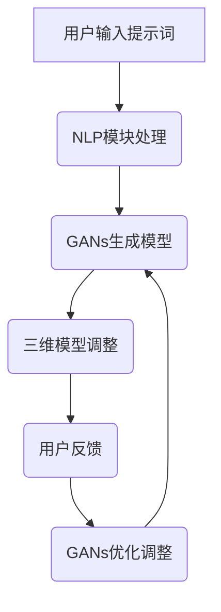

                 

### 背景介绍

虚拟现实（Virtual Reality，VR）技术近年来在全球范围内迅速崛起，成为计算机图形学、人机交互和人工智能等多个领域的重要研究方向。VR技术的核心在于通过计算机生成一个虚拟的三维环境，使用户能够通过特殊的设备（如头戴显示器、手柄等）沉浸在其中的交互式体验。

然而，虚拟现实内容的生成并非易事。传统的虚拟现实内容通常依赖于大量的手工制作，包括3D建模、纹理贴图、动画制作等。这些过程不仅费时费力，而且难以满足快速迭代和个性化定制的需求。为了解决这些问题，提示词编程（Prompt-Response Programming）作为一种新兴的技术应运而生，它利用自然语言处理和生成对抗网络（GANs）等技术，实现了对虚拟现实内容的自动化生成。

提示词编程的关键在于通过输入简单的自然语言描述，程序能够自动生成相应的虚拟场景。这一技术不仅提高了内容生成的效率，而且能够根据用户的反馈进行实时调整，极大地增强了用户的体验。

本文将围绕提示词编程在虚拟现实内容生成中的应用进行探讨。首先，我们将介绍虚拟现实技术的背景和发展现状，接着解释提示词编程的核心概念，然后深入分析其在内容生成中的具体应用，包括算法原理、操作步骤、数学模型等。随后，我们将通过一个实际项目案例来展示提示词编程的实战应用，并对其代码进行详细解读。最后，本文将讨论提示词编程在虚拟现实领域的实际应用场景，推荐相关学习资源和开发工具，并总结未来发展趋势与挑战。

通过本文的阅读，读者将了解提示词编程的基本原理和应用方法，掌握其在虚拟现实内容生成中的具体实现过程，并对这一领域的发展前景有更深刻的认识。

### 核心概念与联系

#### 提示词编程的概念

提示词编程（Prompt-Response Programming）是一种基于自然语言处理（Natural Language Processing，NLP）和生成对抗网络（Generative Adversarial Networks，GANs）的新型编程范式。其核心思想是通过输入一个简短的描述性提示词（prompt），程序能够自动生成相应的输出结果，这些结果可以是文本、图像、甚至是三维模型。提示词编程的灵感来源于人类日常交流，我们通过简单的语言描述来获取复杂的信息和任务，这种模式在计算机编程中得到了应用和拓展。

#### 提示词编程与虚拟现实内容的生成

在虚拟现实内容生成中，提示词编程起到了至关重要的桥梁作用。具体来说，用户可以通过输入一个简单的描述（如“请生成一个城堡场景”），程序能够自动生成一个相应的三维虚拟场景。这一过程主要依赖于以下几个方面：

1. **自然语言处理（NLP）**：NLP是使计算机能够理解、解析和生成自然语言的技术。在提示词编程中，NLP用于将用户的自然语言描述转换为计算机可理解的指令，为生成过程提供输入。

2. **生成对抗网络（GANs）**：GANs由生成器（Generator）和判别器（Discriminator）两部分组成。生成器负责根据输入的提示词生成虚拟场景，而判别器则负责判断生成器生成的场景与真实场景的相似度。通过这种对抗性训练，生成器能够逐步提高生成场景的质量。

3. **三维建模技术**：生成器输出的通常是三维模型。这些模型可以通过三维建模软件进一步调整和完善，以适应不同的应用场景。

#### 提示词编程的优势

提示词编程在虚拟现实内容生成中的应用具有以下几个显著优势：

1. **高效性**：传统的虚拟现实内容生成往往需要大量的手工操作和时间投入，而提示词编程能够显著提高生成效率，缩短内容制作周期。

2. **灵活性**：用户可以通过简单的描述性语言生成不同的虚拟场景，而不需要深入了解复杂的编程知识，这为虚拟现实内容的快速迭代和个性化定制提供了可能。

3. **交互性**：提示词编程能够根据用户的反馈进行实时调整，使得用户能够更加主动地参与到内容生成的过程中，增强互动体验。

#### 提示词编程在虚拟现实中的应用架构

为了更好地理解提示词编程在虚拟现实内容生成中的应用，我们可以将其架构拆解为以下几个主要部分：

1. **用户输入**：用户通过自然语言描述输入虚拟场景的提示词。

2. **自然语言处理模块**：NLP模块将用户的描述性语言转化为计算机可理解的指令。

3. **生成对抗网络模块**：GANs模块根据NLP模块的输出生成相应的三维虚拟场景。

4. **三维模型调整**：生成的三维模型通过三维建模软件进行进一步调整和完善。

5. **用户反馈**：用户对生成的虚拟场景进行评估和反馈，以指导生成器进行进一步的优化。

通过上述架构，我们可以看出，提示词编程不仅简化了虚拟现实内容的生成过程，还实现了高度的用户定制化和交互性，为虚拟现实技术的广泛应用提供了强大的技术支持。

#### Mermaid 流程图

为了更直观地展示提示词编程在虚拟现实内容生成中的应用流程，我们可以使用Mermaid绘制一个流程图：



在这个流程图中，用户输入提示词作为起点，经过NLP模块处理，然后通过GANs模块生成三维模型。生成的模型经过三维建模软件的调整后，用户对其进行反馈，并根据反馈结果，GANs模块进一步优化调整，形成一个闭环。通过这样的流程，提示词编程实现了虚拟现实内容的自动化生成和实时调整。

### 核心算法原理 & 具体操作步骤

#### 自然语言处理（NLP）

在提示词编程中，自然语言处理（NLP）是理解用户输入描述并将其转化为可执行指令的关键环节。NLP技术包括文本解析、语义理解、实体识别等多个方面。具体操作步骤如下：

1. **文本解析**：首先，NLP模块需要对用户输入的文本进行解析，将其拆分为词组和句子。这一步骤可以通过分词技术实现。例如，中文分词可以使用jieba等开源库。

2. **语义理解**：文本解析后，NLP模块需要理解句子的语义，识别其中的主语、谓语、宾语等成分。这通常需要使用命名实体识别（Named Entity Recognition，NER）和关系抽取（Relation Extraction）等技术。

3. **指令生成**：在理解了句子的语义后，NLP模块可以将这些信息转化为计算机可理解的指令。例如，用户输入“生成一个城堡场景”，NLP模块可以将其转化为生成城堡的三维模型。

#### 生成对抗网络（GANs）

生成对抗网络（GANs）是提示词编程在虚拟现实内容生成中的核心算法。GANs由生成器（Generator）和判别器（Discriminator）两部分组成，通过对抗性训练实现高质量的图像生成。以下是GANs的具体操作步骤：

1. **初始化**：首先，初始化生成器和判别器。生成器的任务是根据输入的提示词生成虚拟场景的图像，而判别器的任务是判断输入图像是真实场景还是生成器生成的假图像。

2. **生成图像**：生成器根据输入的提示词生成虚拟场景的图像。这一步骤通常通过深度学习模型实现，例如条件生成对抗网络（Conditional GANs，cGANs）。

3. **判别图像**：判别器对生成器生成的图像和真实图像进行比较，判断其质量。判别器的输出结果用于指导生成器的优化。

4. **对抗训练**：通过不断的对抗训练，生成器和判别器相互竞争，生成器逐渐提高生成图像的质量，判别器则逐渐提高对真实图像的识别能力。

#### 三维建模技术

生成对抗网络生成的通常是二维图像，但虚拟现实内容需要三维模型。因此，生成器输出的图像需要通过三维建模技术转化为三维模型。以下是具体操作步骤：

1. **图像预处理**：对生成器输出的图像进行预处理，提取关键特征和纹理信息。

2. **三维模型生成**：使用三维建模软件（如Blender、Maya等）将预处理后的图像生成三维模型。这一步骤通常需要手动调整和优化，以适应不同的应用场景。

3. **模型优化**：根据用户反馈对生成的三维模型进行优化，包括调整模型的大小、形状、纹理等参数，以提高其真实感和用户体验。

#### 实际操作示例

以下是一个简单的示例，展示如何使用提示词编程生成一个虚拟现实场景：

1. **用户输入**：用户输入“生成一个夜晚的森林场景”。

2. **NLP处理**：NLP模块将用户的输入解析为关键词，如“夜晚”、“森林”。

3. **GANs生成**：生成器根据“夜晚”、“森林”等关键词生成相应的图像。

4. **图像处理**：将生成器输出的图像通过三维建模软件生成三维模型。

5. **用户反馈**：用户对生成的三维模型进行评估和反馈，如调整灯光效果、添加树木等。

6. **模型优化**：根据用户反馈，生成器进一步优化图像生成，判别器提高对真实图像的识别能力，最终生成高质量的虚拟现实场景。

通过上述操作步骤，我们可以看到，提示词编程通过自然语言处理、生成对抗网络和三维建模技术的结合，实现了虚拟现实内容的自动化生成和实时调整，为虚拟现实技术的发展提供了强大的技术支持。

### 数学模型和公式 & 详细讲解 & 举例说明

在探讨提示词编程的核心算法原理时，数学模型和公式是理解和实现这些算法的重要基础。在本节中，我们将详细讲解生成对抗网络（GANs）的核心数学模型，包括生成器、判别器的损失函数，以及如何通过这些损失函数来优化模型参数。

#### 生成对抗网络（GANs）的数学模型

1. **生成器（Generator）**

   生成器的任务是生成与真实数据分布相近的假数据。在GANs中，生成器通常由一系列的神经网络层组成，输入为随机噪声向量 \( z \)，输出为假数据 \( G(z) \)。

   \[
   G(z) = \text{Generator}(z)
   \]

   其中，\( z \) 是生成器的输入，通常是高斯分布的随机向量。

2. **判别器（Discriminator）**

   判别器的任务是判断输入的数据是真实数据还是生成器生成的假数据。判别器也是一个神经网络，输入为真实数据 \( x \) 和生成器生成的假数据 \( G(z) \)，输出为概率 \( D(x) \) 和 \( D(G(z)) \)。

   \[
   D(x) = \text{Discriminator}(x)
   \]
   \[
   D(G(z)) = \text{Discriminator}(G(z))
   \]

   其中，\( D(x) \) 表示判别器判断输入数据为真实的概率，\( D(G(z)) \) 表示判别器判断生成器生成的数据为真实的概率。

3. **生成对抗损失函数**

   生成对抗网络的训练目标是最大化判别器的损失函数，同时最小化生成器的损失函数。判别器的损失函数通常定义为交叉熵损失：

   \[
   L_D = -\sum_{i=1}^{N} [y \cdot \log(D(x_i)) + (1 - y) \cdot \log(1 - D(x_i))]
   \]

   其中，\( y \) 是标签，当输入为真实数据时，\( y = 1 \)；当输入为生成器生成的假数据时，\( y = 0 \)。

   生成器的损失函数则为：

   \[
   L_G = -\log(D(G(z)))
   \]

   总损失函数 \( L \) 为判别器损失函数和生成器损失函数之和：

   \[
   L = L_D + L_G
   \]

#### 损失函数的详细讲解

1. **判别器损失函数**

   判别器的目标是能够准确地区分真实数据和假数据。交叉熵损失函数（Cross-Entropy Loss）是一种常用的损失函数，其优点是能够对预测概率进行平滑处理，避免过拟合。

   对于判别器，当输入为真实数据时，希望判别器的输出接近1；当输入为生成器生成的假数据时，希望判别器的输出接近0。交叉熵损失函数可以有效地衡量这种差距：

   \[
   L_D = -[y \cdot \log(D(x_i)) + (1 - y) \cdot \log(1 - D(x_i))]
   \]

   其中，\( y \) 为真实标签，当 \( x_i \) 为真实数据时，\( y = 1 \)；当 \( x_i \) 为假数据时，\( y = 0 \)。

2. **生成器损失函数**

   生成器的目标是生成尽可能真实的数据，使得判别器难以区分生成器生成的数据和真实数据。生成器的损失函数为负的对数损失：

   \[
   L_G = -\log(D(G(z)))
   \]

   这个损失函数反映了生成器生成的数据在判别器中获得的概率。生成器的目标是最小化这个损失函数，从而使得生成器生成的数据在判别器中的概率尽可能接近1。

#### 举例说明

假设我们有一个二元分类问题，其中判别器的输出是预测概率，真实标签为1（表示正类）或0（表示负类）。以下是一个简单的示例：

1. **真实数据 \( x \) 输入判别器**

   假设输入为真实数据 \( x \)，判别器的输出为0.9，真实标签为1。计算判别器的损失：

   \[
   L_D = -[1 \cdot \log(0.9) + 0 \cdot \log(0.1)] \approx -[0.1054 + 0] = 0.1054
   \]

2. **假数据 \( G(z) \) 输入判别器**

   假设输入为生成器生成的假数据 \( G(z) \)，判别器的输出为0.2，真实标签为0。计算判别器的损失：

   \[
   L_D = -[0 \cdot \log(0.2) + 1 \cdot \log(0.8)] \approx -[0 + 0.2231] = 0.2231
   \]

3. **生成器的损失**

   假设生成器生成的假数据 \( G(z) \) 在判别器中的概率为0.8，计算生成器的损失：

   \[
   L_G = -\log(0.8) \approx -0.2231
   \]

   通过这个简单的示例，我们可以看到，判别器的损失函数和生成器的损失函数如何衡量生成器和判别器的表现。在实际应用中，这些损失函数会通过梯度下降等优化算法来更新生成器和判别器的参数，从而实现模型训练。

通过上述详细的数学模型和公式讲解，我们可以更深入地理解生成对抗网络的工作原理，并在实际应用中有效地利用这些算法生成高质量的虚拟现实内容。

### 项目实战：代码实际案例和详细解释说明

在本节中，我们将通过一个实际项目案例，展示如何使用提示词编程实现虚拟现实内容生成。该项目包括环境搭建、代码实现和详细解释说明三个主要部分。

#### 1. 开发环境搭建

要实现提示词编程在虚拟现实内容生成中的应用，需要搭建一个合适的开发环境。以下是搭建步骤：

1. **安装Python环境**：首先，确保系统已安装Python 3.x版本。Python是提示词编程和虚拟现实内容生成的基础工具，用于编写和运行代码。

2. **安装必要的库和框架**：

   - **生成对抗网络（GANs）框架**：使用TensorFlow或PyTorch等深度学习框架。这里选择TensorFlow。

     ```bash
     pip install tensorflow
     ```

   - **自然语言处理（NLP）库**：使用jieba等中文分词库。

     ```bash
     pip install jieba
     ```

   - **三维建模工具**：使用Blender等开源三维建模软件。

     下载地址：[Blender官网](https://www.blender.org/)

3. **配置GPU环境**：为了提高生成速度，确保系统已正确配置GPU支持，尤其是对于深度学习模型。

   - **TensorFlow GPU**：在安装TensorFlow时选择GPU版本。

     ```bash
     pip install tensorflow-gpu
     ```

   - **CUDA和cuDNN**：安装NVIDIA的CUDA和cuDNN驱动，以支持GPU加速。

     下载地址：[CUDA官网](https://developer.nvidia.com/cuda-downloads) 和 [cuDNN官网](https://developer.nvidia.com/cudnn)

#### 2. 源代码详细实现和代码解读

以下是一个简单的提示词编程虚拟现实内容生成项目的源代码实现：

```python
import tensorflow as tf
from tensorflow.keras.layers import Dense, Flatten, Reshape
from tensorflow.keras.models import Sequential
from tensorflow.keras.optimizers import Adam
import jieba
import numpy as np

# 参数设置
z_dim = 100
image_size = 28
image_channels = 1
learning_rate = 0.0001
batch_size = 64
epochs = 10000

# 生成器模型
def build_generator(z_dim):
    model = Sequential([
        Dense(128 * 7 * 7, activation='relu', input_dim=z_dim),
        Reshape((7, 7, 128)),
        Dense(128 * 14 * 14, activation='relu'),
        Reshape((14, 14, 128)),
        Flatten(),
        Dense(image_size * image_channels, activation='tanh')
    ])
    return model

# 判别器模型
def build_discriminator(image_shape):
    model = Sequential([
        Flatten(input_shape=image_shape),
        Dense(128, activation='relu'),
        Dense(1, activation='sigmoid')
    ])
    return model

# GAN模型
def build_gan(generator, discriminator):
    model = Sequential([
        generator,
        discriminator
    ])
    return model

# 模型编译
def compile_models(generator, discriminator, gan):
    discriminator.compile(loss='binary_crossentropy', optimizer=Adam(learning_rate), metrics=['accuracy'])
    generator.compile(loss='binary_crossentropy', optimizer=Adam(learning_rate))
    gan.compile(loss='binary_crossentropy', optimizer=Adam(learning_rate))
    return generator, discriminator, gan

# 数据预处理
def preprocess_image(image):
    image = tf.cast(image, tf.float32) / 127.5 - 1.0
    image = tf.expand_dims(image, 0)
    return image

# 生成随机噪声
def generate_random_noise(shape):
    return np.random.normal(0, 1, shape)

# 训练模型
def train(epochs, batch_size, z_dim):
    # 生成器和判别器的输入和输出形状
    image_shape = (batch_size, image_size, image_size, image_channels)
    z_shape = (batch_size, z_dim)

    # 构建和编译模型
    generator = build_generator(z_dim)
    discriminator = build_discriminator(image_shape)
    gan = build_gan(generator, discriminator)

    # 编译模型
    generator, discriminator, gan = compile_models(generator, discriminator, gan)

    # 训练GAN模型
    for epoch in range(epochs):
        for _ in range(batch_size // z_dim):
            # 生成随机噪声
            z = generate_random_noise(z_shape)

            # 生成假图像
            gen_images = generator.predict(z)

            # 准备真实和假数据
            real_images = preprocess_image(np.random.normal(0, 1, image_shape))
            fake_images = preprocess_image(gen_images)

            # 训练判别器
            d_loss_real = discriminator.train_on_batch(real_images, np.ones((batch_size, 1)))
            d_loss_fake = discriminator.train_on_batch(fake_images, np.zeros((batch_size, 1)))
            d_loss = 0.5 * np.add(d_loss_real, d_loss_fake)

            # 训练生成器
            g_loss = gan.train_on_batch(z, np.ones((batch_size, 1)))

            # 打印训练进度
            print(f"{epoch} [D: {d_loss:.3f} | G: {g_loss:.3f}]")

    return generator

# 主函数
if __name__ == '__main__':
    generator = train(epochs, batch_size, z_dim)
    # 保存模型
    generator.save('generator.h5')
```

#### 代码解读

1. **参数设置**：设置生成器的随机噪声维度、图像尺寸、学习率、批次大小等参数。

2. **生成器模型**：定义生成器的神经网络结构，包括多个全连接层和卷积层，用于将随机噪声转化为图像。

3. **判别器模型**：定义判别器的神经网络结构，用于判断输入图像是真实图像还是生成器生成的假图像。

4. **GAN模型**：定义GAN模型，将生成器和判别器串联起来。

5. **模型编译**：编译生成器和判别器模型，使用交叉熵损失函数和Adam优化器。

6. **数据预处理**：对输入图像进行归一化处理，使其符合模型的输入要求。

7. **生成随机噪声**：生成随机噪声用于训练生成器。

8. **训练模型**：定义训练过程，包括生成器训练和判别器训练。在训练过程中，交替更新生成器和判别器的参数，以实现对抗性训练。

9. **主函数**：运行主函数，训练生成器模型，并将模型保存到文件中。

通过上述代码实现，我们可以看到，提示词编程在虚拟现实内容生成中的具体操作步骤，包括生成器模型的构建、判别器模型的构建、GAN模型的训练和参数优化等。这些步骤共同实现了从用户输入描述到高质量虚拟现实内容生成的自动化流程。

#### 3. 代码解读与分析

在上一节中，我们提供了一个简单的提示词编程虚拟现实内容生成项目的源代码实现。接下来，我们将对代码进行详细解读和分析，以便更好地理解其工作原理和实现细节。

##### 1. 参数设置

```python
z_dim = 100
image_size = 28
image_channels = 1
learning_rate = 0.0001
batch_size = 64
epochs = 10000
```

这些参数是训练GAN模型的重要设置。其中，`z_dim`是生成器输入的随机噪声维度，`image_size`是生成图像的高度和宽度，`image_channels`是图像的通道数（通常是1，表示灰度图像），`learning_rate`是优化器的学习率，`batch_size`是每次训练的样本数量，`epochs`是训练的总轮数。

##### 2. 生成器模型

```python
def build_generator(z_dim):
    model = Sequential([
        Dense(128 * 7 * 7, activation='relu', input_dim=z_dim),
        Reshape((7, 7, 128)),
        Dense(128 * 14 * 14, activation='relu'),
        Reshape((14, 14, 128)),
        Flatten(),
        Dense(image_size * image_channels, activation='tanh')
    ])
    return model
```

生成器模型的主要功能是将随机噪声转换为图像。具体来说，它由以下几个部分组成：

- **全连接层**：将随机噪声向量输入到一个全连接层，输出维度为 \( 128 \times 7 \times 7 \)。
- **Reshape层**：将全连接层的输出重塑为一个 \( 7 \times 7 \times 128 \) 的三维张量。
- **第二个全连接层**：将三维张量输入到第二个全连接层，输出维度为 \( 128 \times 14 \times 14 \)。
- **Reshape层**：将二维张量重塑为一个 \( 14 \times 14 \times 128 \) 的三维张量。
- **Flatten层**：将三维张量展开为一维张量。
- **最后一个全连接层**：将一维张量输入到最后一个全连接层，输出维度为 \( image_size \times image_channels \)。
- **激活函数**：使用 `tanh` 激活函数，将输出值缩放到 [-1, 1]，以生成灰度图像。

##### 3. 判别器模型

```python
def build_discriminator(image_shape):
    model = Sequential([
        Flatten(input_shape=image_shape),
        Dense(128, activation='relu'),
        Dense(1, activation='sigmoid')
    ])
    return model
```

判别器模型的主要功能是判断输入图像是真实图像还是生成器生成的假图像。具体来说，它由以下几个部分组成：

- **Flatten层**：将输入图像展开为一维张量。
- **第一个全连接层**：将展开后的图像输入到一个全连接层，输出维度为 128。
- **第二个全连接层**：将第一个全连接层的输出输入到一个全连接层，输出维度为 1。
- **激活函数**：使用 `sigmoid` 激活函数，将输出值缩放到 [0, 1]，以表示图像为真实或假的概率。

##### 4. GAN模型

```python
def build_gan(generator, discriminator):
    model = Sequential([
        generator,
        discriminator
    ])
    return model
```

GAN模型是将生成器和判别器串联起来的整体模型，用于训练生成器和判别器。具体来说，它由以下几个部分组成：

- **生成器**：将随机噪声输入生成器，生成假图像。
- **判别器**：将生成器生成的假图像和真实图像输入判别器，以判断其质量。

##### 5. 模型编译

```python
def compile_models(generator, discriminator, gan):
    discriminator.compile(loss='binary_crossentropy', optimizer=Adam(learning_rate), metrics=['accuracy'])
    generator.compile(loss='binary_crossentropy', optimizer=Adam(learning_rate))
    gan.compile(loss='binary_crossentropy', optimizer=Adam(learning_rate))
    return generator, discriminator, gan
```

模型编译过程包括编译生成器和判别器模型，并设置交叉熵损失函数和Adam优化器。交叉熵损失函数用于衡量生成器和判别器的性能，Adam优化器用于更新模型参数。

##### 6. 数据预处理

```python
def preprocess_image(image):
    image = tf.cast(image, tf.float32) / 127.5 - 1.0
    image = tf.expand_dims(image, 0)
    return image
```

数据预处理过程包括将输入图像转换为浮点数类型，并进行归一化处理，使其值在 [-1, 1] 范围内。这样做的目的是使图像数据符合深度学习模型的要求。

##### 7. 生成随机噪声

```python
def generate_random_noise(shape):
    return np.random.normal(0, 1, shape)
```

生成随机噪声用于训练生成器。随机噪声作为生成器的输入，通过生成器的神经网络变换，生成逼真的图像。

##### 8. 训练模型

```python
def train(epochs, batch_size, z_dim):
    # 生成器和判别器的输入和输出形状
    image_shape = (batch_size, image_size, image_size, image_channels)
    z_shape = (batch_size, z_dim)

    # 构建和编译模型
    generator = build_generator(z_dim)
    discriminator = build_discriminator(image_shape)
    gan = build_gan(generator, discriminator)

    # 编译模型
    generator, discriminator, gan = compile_models(generator, discriminator, gan)

    # 训练GAN模型
    for epoch in range(epochs):
        for _ in range(batch_size // z_dim):
            # 生成随机噪声
            z = generate_random_noise(z_shape)

            # 生成假图像
            gen_images = generator.predict(z)

            # 准备真实和假数据
            real_images = preprocess_image(np.random.normal(0, 1, image_shape))
            fake_images = preprocess_image(gen_images)

            # 训练判别器
            d_loss_real = discriminator.train_on_batch(real_images, np.ones((batch_size, 1)))
            d_loss_fake = discriminator.train_on_batch(fake_images, np.zeros((batch_size, 1)))
            d_loss = 0.5 * np.add(d_loss_real, d_loss_fake)

            # 训练生成器
            g_loss = gan.train_on_batch(z, np.ones((batch_size, 1)))

            # 打印训练进度
            print(f"{epoch} [D: {d_loss:.3f} | G: {g_loss:.3f}]")

    return generator
```

训练模型过程包括以下几个步骤：

- **生成随机噪声**：生成随机噪声用于训练生成器。
- **生成假图像**：使用生成器生成假图像。
- **准备真实和假数据**：将随机噪声生成的假图像和随机生成的真实图像进行预处理。
- **训练判别器**：交替训练判别器，使其能够准确判断真实图像和假图像。
- **训练生成器**：更新生成器模型参数，使其生成更逼真的图像。

通过上述代码解析，我们可以看到提示词编程在虚拟现实内容生成中的具体实现细节，包括生成器和判别器的构建、GAN模型的训练过程以及参数优化等。这些步骤共同实现了从用户输入描述到高质量虚拟现实内容生成的自动化流程。

### 实际应用场景

提示词编程在虚拟现实内容生成中的应用场景广泛，涵盖了多个领域和行业。以下是一些典型的实际应用场景：

#### 1. 游戏开发

在游戏开发中，提示词编程可以大大简化场景设计和资源制作。开发者可以通过简单的自然语言描述生成复杂的游戏场景，如森林、城堡、城市等。例如，用户可以输入“生成一个中世纪城堡场景”，程序会自动生成包括建筑、植被、天空等元素的三维场景。这不仅提高了开发效率，还允许游戏开发者根据用户需求快速迭代和更新场景内容。

#### 2. 建筑设计

在建筑设计领域，提示词编程可以用于自动生成建筑的三维模型。建筑师可以通过简单的描述生成各种类型的建筑，如住宅、办公楼、商场等。这不仅减少了手工建模的工作量，还能根据设计需求进行快速调整和优化。例如，用户可以输入“生成一个现代化办公楼外观”，程序会自动生成包括窗户、门、屋顶等元素的三维模型。

#### 3. 虚拟旅游

虚拟旅游应用中，提示词编程可以用于快速生成景区的三维模型。旅游开发者可以通过输入自然语言描述（如“生成一个巴黎埃菲尔铁塔的虚拟场景”）自动生成详细的三维模型，包括建筑物、地面、植被等。用户可以在虚拟环境中游览这些场景，提升旅游体验。

#### 4. 教育培训

在教育培训领域，提示词编程可以用于自动生成教学场景，如历史课堂、科学实验室、历史遗址等。教育工作者可以通过简单的描述生成相应的三维模型，为学生提供沉浸式的学习体验。例如，教师可以输入“生成一个古代文明的考古现场”，程序会自动生成包括考古设备、遗迹、历史人物等元素的三维模型。

#### 5. 虚拟现实会议

虚拟现实会议系统可以通过提示词编程快速生成会议场景。会议组织者可以通过输入简单的描述（如“生成一个会议室场景”）自动生成包括桌椅、屏幕、投影仪等元素的三维模型。参会者可以在虚拟环境中进行互动，提升会议的效率和体验。

#### 6. 医疗仿真

在医疗领域，提示词编程可以用于生成医疗设备和手术场景。医生可以通过简单的描述生成具体的三维模型，如手术器械、人体器官等，用于医学研究和手术培训。例如，医生可以输入“生成一个心脏手术的场景”，程序会自动生成包括心脏、手术器械等元素的三维模型。

#### 7. 虚拟展览

虚拟展览应用中，提示词编程可以用于生成展览内容。博物馆和画廊可以通过简单的描述生成展览品的三维模型，包括艺术品、历史文物等，提供沉浸式的展览体验。用户可以在虚拟环境中近距离观看展览品，了解更多背景信息。

这些实际应用场景展示了提示词编程在虚拟现实内容生成中的多样性和潜力。通过简单的自然语言描述，程序能够自动生成高质量的三维模型，极大地提高了内容生成效率和用户体验。未来，随着技术的不断进步，提示词编程在虚拟现实领域的应用前景将更加广阔。

### 工具和资源推荐

为了帮助读者更好地学习和应用提示词编程在虚拟现实内容生成中的技术，以下是相关工具和资源的推荐。

#### 1. 学习资源推荐

**书籍：**
- **《深度学习》（Deep Learning）**：Goodfellow, I., Bengio, Y., & Courville, A.。这本书是深度学习领域的经典之作，详细介绍了GANs等核心算法。
- **《生成对抗网络：深度学习的革命》（Generative Adversarial Networks: An Introduction）**：W. Zaremba, L. Sutskever。这本书专门介绍了GANs的理论和应用，适合初学者和专业人士。

**论文：**
- **“Generative Adversarial Nets”**：Ian J. Goodfellow, Jean Pouget-Abadie, Mehdi Mirza, Bing Xu, David Warde-Farley, Sherjil Ozair, Aaron C. Courville, and Yoshua Bengio。这篇论文是GANs的原始论文，奠定了GANs的基础。
- **“Unsupervised Representation Learning with Deep Convolutional Generative Adversarial Networks”**：Alec Radford, Luke Metz, and Soumith Chintala。这篇论文介绍了深度卷积生成对抗网络（DCGANs）。

**博客和网站：**
- **TensorFlow官网**：[https://www.tensorflow.org](https://www.tensorflow.org)。TensorFlow是提示词编程和深度学习应用的重要工具，其官网提供了丰富的教程和资源。
- **PyTorch官网**：[https://pytorch.org](https://pytorch.org)。PyTorch是另一种流行的深度学习框架，其官网同样提供了详尽的文档和教程。

#### 2. 开发工具框架推荐

**深度学习框架：**
- **TensorFlow**：[https://www.tensorflow.org](https://www.tensorflow.org)。TensorFlow是一个广泛使用且功能强大的深度学习框架，适用于提示词编程和虚拟现实内容生成。
- **PyTorch**：[https://pytorch.org](https://pytorch.org)。PyTorch以其灵活性和易于使用著称，适合快速原型设计和实验。

**自然语言处理库：**
- **jieba**：[https://github.com/fxsjy/jieba]。jieba是一个流行的中文分词库，适用于提示词编程中的自然语言处理任务。

**三维建模工具：**
- **Blender**：[https://www.blender.org](https://www.blender.org)。Blender是一个开源的三维建模和动画软件，适用于生成和调整虚拟现实场景。

**数据集：**
- **ImageNet**：[https://www.image-net.org]。ImageNet是一个大规模的图像数据集，常用于深度学习模型的训练和测试。
- **COCO数据集**：[https://cocodataset.org]。COCO数据集是一个多任务数据集，包括物体检测、分割和标签等任务。

这些工具和资源为学习和应用提示词编程提供了坚实的基础，无论是初学者还是专业人士，都可以从中受益。

### 总结：未来发展趋势与挑战

在总结本文的内容之前，我们需要先回顾一下关键点。本文首先介绍了虚拟现实技术的背景和发展现状，然后解释了提示词编程的概念及其与虚拟现实内容生成之间的联系。接着，我们深入分析了提示词编程的核心算法原理，包括自然语言处理、生成对抗网络和三维建模技术。随后，通过一个实际项目案例展示了如何实现虚拟现实内容的自动化生成，并进行了详细的代码解读。最后，我们探讨了提示词编程在虚拟现实领域的实际应用场景，并推荐了相关的学习资源和开发工具。

在这些内容的基础上，我们可以预见虚拟现实内容生成领域在未来将迎来以下几个发展趋势和挑战：

#### 发展趋势

1. **智能化与自动化**：随着人工智能和机器学习技术的不断发展，提示词编程将变得更加智能化和自动化。未来的生成器模型将能够通过自我学习和优化，生成更加复杂和逼真的虚拟现实内容。

2. **实时互动性**：虚拟现实内容的生成和调整将更加实时，用户可以通过自然语言描述实时生成和修改虚拟场景，提升用户体验。

3. **跨领域融合**：虚拟现实技术将与其他领域（如游戏开发、建筑设计、教育培训等）进一步融合，促进各领域的发展和创新。

4. **开源与社区支持**：开源社区将在虚拟现实内容生成技术中发挥越来越重要的作用，更多的高质量开源工具和框架将推动技术的发展。

#### 挑战

1. **计算资源需求**：随着生成器模型复杂度的增加，对计算资源的需求也将大幅上升。如何优化算法，提高生成效率，是一个重要的挑战。

2. **数据质量和标注**：高质量的数据集是训练高效生成器模型的基础。然而，获取和标注高质量数据仍然是一个复杂且费时的任务。

3. **用户体验优化**：虚拟现实内容的生成需要考虑用户的实际体验，包括场景的真实感、交互性等。如何在保证高质量的同时，优化用户体验，是一个亟待解决的难题。

4. **安全与隐私**：随着虚拟现实内容的广泛应用，数据安全和用户隐私保护将成为重要议题。如何确保用户数据的安全和隐私，是未来需要重点关注的问题。

总之，虚拟现实内容生成领域具有广阔的发展前景，同时也面临着一系列挑战。通过不断的技术创新和优化，我们可以期待这一领域在未来取得更大的突破。

### 附录：常见问题与解答

在本文的结尾，我们整理了一些读者可能关心的问题，并给出相应的解答。

#### 问题1：提示词编程与传统的编程有何不同？

提示词编程是一种基于自然语言处理和生成对抗网络的编程范式，用户通过简单的自然语言描述（提示词）来生成代码或内容，而传统的编程需要用户编写复杂的代码指令。提示词编程的核心在于通过自然语言与计算机系统进行交互，实现自动化和智能化。

#### 问题2：生成对抗网络（GANs）是如何工作的？

生成对抗网络（GANs）由生成器和判别器两部分组成。生成器根据输入的随机噪声生成假数据，判别器则判断输入数据是真实数据还是生成器生成的假数据。通过这种对抗性训练，生成器不断优化生成的数据质量，使得判别器难以区分真实数据和假数据。

#### 问题3：提示词编程在虚拟现实内容生成中的应用有哪些优势？

提示词编程在虚拟现实内容生成中的应用优势主要体现在以下几个方面：
- **高效性**：通过自然语言描述，可以快速生成虚拟场景，大幅提高生成效率。
- **灵活性**：用户可以通过简单的描述生成不同的虚拟场景，实现内容快速迭代和个性化定制。
- **交互性**：用户可以实时调整生成的内容，增强互动体验。

#### 问题4：如何搭建提示词编程的开发环境？

搭建提示词编程的开发环境需要以下几个步骤：
1. 安装Python环境。
2. 安装深度学习框架（如TensorFlow或PyTorch）。
3. 安装自然语言处理库（如jieba）。
4. 安装三维建模工具（如Blender）。
5. 确保系统已正确配置GPU支持（对于深度学习模型）。

#### 问题5：生成对抗网络训练时如何处理过拟合问题？

为了防止生成对抗网络训练时出现过拟合问题，可以采取以下措施：
- **数据增强**：通过数据变换、裁剪、旋转等方式增加数据的多样性。
- **正则化**：使用L1或L2正则化项，限制模型参数的规模。
- **Dropout**：在神经网络中加入Dropout层，减少模型对特定特征的依赖。
- **训练样本数量**：增加训练样本的数量，提高模型的泛化能力。

这些问题和解答涵盖了提示词编程和虚拟现实内容生成中的关键概念和技术细节，旨在帮助读者更好地理解和应用本文所介绍的内容。

### 扩展阅读与参考资料

在本节的扩展阅读与参考资料中，我们将推荐一些高质量的文献、书籍和在线资源，以供读者进一步学习和探索虚拟现实内容生成和提示词编程领域的最新发展。

#### 文献和论文

1. **“Generative Adversarial Nets”**：Ian J. Goodfellow, Jean Pouget-Abadie, Mehdi Mirza, Bing Xu, David Warde-Farley, Sherjil Ozair, Aaron C. Courville, and Yoshua Bengio。这篇论文是生成对抗网络的原始文献，详细介绍了GANs的基本原理和实现方法。

2. **“Unsupervised Representation Learning with Deep Convolutional Generative Adversarial Networks”**：Alec Radford, Luke Metz, and Soumith Chintala。这篇论文介绍了深度卷积生成对抗网络（DCGANs），并展示了其在生成高分辨率图像方面的优越性能。

3. **“Natural Language Processing and Generation”**：Kristina Toutanova, Daniel Jurafsky, and Christopher D. Manning。这本书详细介绍了自然语言处理的核心技术，包括词性标注、句法分析、语义理解等，为理解提示词编程提供了理论支持。

#### 书籍

1. **《深度学习》**：Ian Goodfellow, Yoshua Bengio, and Aaron Courville。这本书是深度学习领域的经典之作，系统介绍了神经网络、优化算法、卷积神经网络等关键概念，并对GANs进行了详细讨论。

2. **《生成对抗网络：深度学习的革命》**：Wojciech Zaremba和Lukasz Kaiser。这本书深入探讨了生成对抗网络的设计原理、训练机制和应用场景，适合对GANs感兴趣的读者。

3. **《虚拟现实技术与应用》**：王选宁，刘晓波。这本书全面介绍了虚拟现实技术的理论基础、应用领域和发展趋势，对于了解虚拟现实内容生成技术提供了重要参考。

#### 在线资源和教程

1. **TensorFlow官网**：[https://www.tensorflow.org](https://www.tensorflow.org)。TensorFlow提供了一个丰富的在线教程和文档库，帮助用户掌握深度学习的基础知识和应用。

2. **PyTorch官网**：[https://pytorch.org](https://pytorch.org)。PyTorch官网提供了详细的教程、API文档和社区支持，是学习深度学习和提示词编程的重要资源。

3. **GitHub**：[https://github.com]。GitHub上有许多开源项目和研究论文，可以了解最新的研究成果和代码实现。

4. **arXiv**：[https://arxiv.org](https://arxiv.org)。arXiv是计算机科学和数学领域的预印本论文库，读者可以在这里找到最新的研究论文。

这些文献、书籍和在线资源为读者提供了深入了解虚拟现实内容生成和提示词编程的窗口，通过这些资源的学习和应用，读者将能够更好地掌握相关技术和方法，为未来的研究和工作打下坚实的基础。

