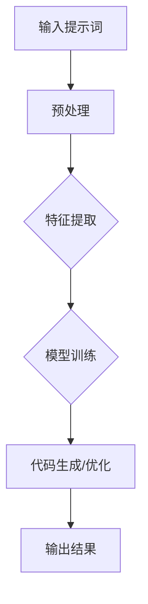
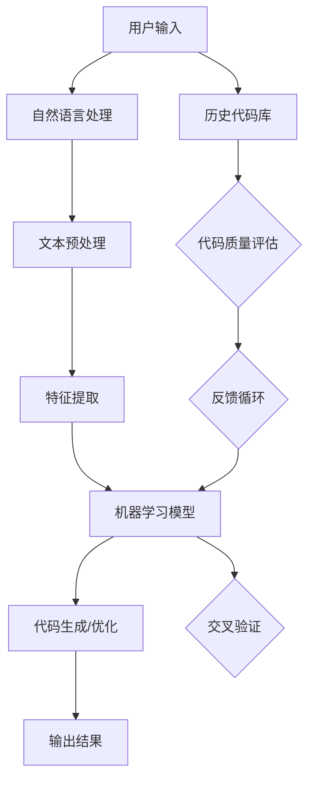

                 

### 背景介绍

在当今高速发展的信息技术时代，编程已经成为各行各业不可或缺的核心技能。随着软件开发项目的复杂度不断增加，代码审查作为保障代码质量、发现潜在问题的关键环节，显得尤为重要。然而，传统的代码审查方法往往依赖于人工阅读和检查，不仅效率低下，而且容易出现漏检和误检的情况。

代码审查效率的提升，对于整个软件开发过程的影响至关重要。首先，高效的代码审查可以显著缩短项目的开发周期，提高团队的工作效率。其次，它可以降低代码缺陷率和维护成本，从而提升软件产品的稳定性和可靠性。因此，研究和应用能够提升代码审查效率的技术，已经成为软件开发领域的重要课题。

当前，随着人工智能技术的不断进步，提示词编程作为一种新兴的技术，逐渐进入了开发者的视野。提示词编程通过引入自然语言处理和机器学习技术，可以实现自动化的代码审查，从而大幅提升审查效率。本文将围绕提示词编程的代码审查效率提升技术进行深入探讨，分析其核心概念、算法原理、数学模型、实际应用案例，以及未来发展趋势与挑战。

接下来的部分，我们将首先介绍提示词编程的基本概念，并探讨其在代码审查中的应用。然后，我们将详细分析提示词编程的核心算法原理，以及具体的操作步骤。接着，我们将通过数学模型和公式，深入解释提示词编程的工作机制，并举例说明。随后，我们将分享一个实际的项目实战案例，展示如何在实际环境中应用提示词编程进行代码审查。最后，我们将探讨提示词编程在不同应用场景中的实际应用，并提供相关工具和资源的推荐。通过本文的阅读，读者将能够全面了解提示词编程的代码审查效率提升技术，并为其在软件开发中的应用打下坚实的基础。

### 核心概念与联系

提示词编程（Prompt Programming）是一种结合了自然语言处理（Natural Language Processing, NLP）和机器学习（Machine Learning, ML）技术的编程方法。其核心思想是通过分析给定的提示词（prompts），自动生成或优化代码。这种技术不仅能够提高代码审查的效率，还能够为开发人员提供智能化的代码建议，从而提升整体开发质量。

提示词编程的主要优势在于其自动化和智能化。传统的代码审查方法主要依赖于开发人员手动阅读和检查代码，这不仅费时费力，而且容易出现主观偏差和漏检情况。而提示词编程通过引入NLP和ML技术，可以从大量代码中提取关键信息，自动识别潜在问题，并提供改进建议。这种自动化过程不仅大幅提升了代码审查的效率，还能够减少人为错误，提高审查的准确性。

为了更好地理解提示词编程的概念和原理，我们可以通过一个简单的 Mermaid 流程图来展示其基本架构和流程。



在该流程图中，输入提示词首先经过预处理，以去除无关信息和格式化文本。接下来，特征提取模块会从预处理后的文本中提取出与代码审查相关的关键特征。这些特征会用于模型训练，通过大量的训练数据，模型能够学习到如何识别代码中的潜在问题和最佳实践。最后，训练好的模型会对新的代码输入进行生成或优化，并提供改进建议。

为了更清晰地展示提示词编程的核心概念和架构，我们可以通过一个详细的 Mermaid 流程图来进一步解释。



在该流程图中，用户输入的提示词首先经过自然语言处理（NLP），包括文本预处理和特征提取。这些处理步骤旨在将自然语言文本转换为机器学习模型可以理解和处理的格式。接下来，特征提取模块会从文本中提取出与代码审查相关的关键特征，这些特征会被用于训练机器学习模型。训练好的模型会根据输入的代码进行生成或优化，并提供改进建议。同时，系统会利用历史代码库和交叉验证来评估模型的性能和准确性。最后，模型输出的结果会经过代码质量评估，并根据反馈进行优化和调整。

通过这个详细的流程图，我们可以更清晰地理解提示词编程的核心概念和架构。提示词编程不仅涉及自然语言处理和机器学习技术，还包括代码生成和优化，以及反馈循环和持续改进的过程。

接下来，我们将进一步探讨提示词编程的核心算法原理和具体操作步骤，以便读者能够更深入地了解这一技术的实现机制和实际应用。在下一节中，我们将详细分析提示词编程中的关键算法，包括自然语言处理和机器学习模型的工作原理，以及如何利用这些技术进行代码审查和优化。

### 核心算法原理 & 具体操作步骤

提示词编程的核心在于其自动化和智能化的代码审查能力。为了实现这一目标，提示词编程主要依赖于自然语言处理（NLP）和机器学习（ML）技术。下面，我们将详细探讨这些技术的原理，并介绍具体的操作步骤。

#### 自然语言处理（NLP）原理

自然语言处理是提示词编程的基础，其核心目标是使计算机能够理解和处理自然语言。NLP 技术主要包括以下几个方面：

1. **文本预处理**：这是 NLP 的第一步，主要包括去除停用词、标点符号，进行词性标注和分词等操作。例如，英文中的 "is" 和 "are" 是停用词，它们对理解句子的核心含义没有贡献，因此需要去除。

2. **词嵌入（Word Embedding）**：词嵌入是将单词映射为高维向量，以便计算机能够处理和比较。常见的词嵌入模型有 Word2Vec、GloVe 和 BERT 等。这些模型能够捕捉单词的语义信息，从而帮助计算机更好地理解文本。

3. **句法分析（Syntax Analysis）**：句法分析涉及解析句子的结构，识别名词、动词、形容词等词性，并构建语法树。这对于理解句子的语义和上下文至关重要。

#### 机器学习（ML）原理

机器学习是提示词编程的核心，通过训练模型来识别代码中的潜在问题和最佳实践。以下是机器学习在提示词编程中的几个关键步骤：

1. **数据收集与预处理**：首先需要收集大量的代码审查数据和对应的标注信息，这些数据将用于训练机器学习模型。数据预处理包括去除噪声、标准化特征等。

2. **特征提取**：在机器学习中，特征提取是一个关键步骤。在提示词编程中，特征提取通常涉及提取代码中的关键信息，如变量名、函数名、注释等。这些特征将用于训练模型。

3. **模型训练**：利用收集到的数据和提取出的特征，训练机器学习模型。常见的模型包括决策树、随机森林、支持向量机（SVM）和深度学习模型（如卷积神经网络 CNN、循环神经网络 RNN 等）。

4. **模型评估与优化**：通过交叉验证和测试集评估模型的性能，并使用技术如调参、集成学习等优化模型。

#### 提示词编程的具体操作步骤

1. **输入提示词**：用户输入一个自然语言的提示词，描述需要审查的代码或问题。

2. **自然语言处理**：对输入的提示词进行预处理，提取关键词和句法信息。

3. **特征提取**：从预处理后的文本中提取出与代码审查相关的特征，如变量名、函数名、注释等。

4. **模型训练**：使用历史代码库和标注数据训练机器学习模型，使模型能够识别代码中的潜在问题和最佳实践。

5. **代码审查**：将输入的代码与训练好的模型进行匹配，模型输出代码审查结果和改进建议。

6. **反馈与优化**：将审查结果和用户的反馈进行整合，用于进一步优化模型。

#### 案例说明

假设用户输入了一个提示词：“这段代码中是否有内存泄漏的问题？”。以下是具体的操作步骤：

1. **输入提示词**：用户输入“这段代码中是否有内存泄漏的问题？”。

2. **自然语言处理**：对提示词进行预处理，提取出关键词如“代码”、“内存泄漏”等。

3. **特征提取**：从代码中提取出与内存泄漏相关的特征，如内存分配、释放操作等。

4. **模型训练**：使用历史代码库和标注数据训练一个用于检测内存泄漏的机器学习模型。

5. **代码审查**：将用户的代码输入到训练好的模型中，模型识别出潜在的内存泄漏问题，并输出改进建议。

6. **反馈与优化**：用户根据模型的建议进行代码修改，并将修改后的代码和反馈返回给模型，用于进一步优化模型。

通过上述步骤，提示词编程能够实现自动化和智能化的代码审查，大幅提升审查效率和质量。接下来，我们将通过数学模型和公式，深入解释提示词编程的工作机制，帮助读者更好地理解这一技术。

### 数学模型和公式 & 详细讲解 & 举例说明

在提示词编程中，数学模型和公式是核心组成部分，它们用于描述自然语言处理和机器学习算法的工作机制。以下我们将详细讲解这些数学模型，并通过具体的例子说明其应用。

#### 1. 自然语言处理中的数学模型

**1.1 词嵌入（Word Embedding）**

词嵌入是将单词映射到高维空间中的向量表示，从而实现计算机对语义的理解。常见的词嵌入模型有 Word2Vec、GloVe 和 BERT。

- **Word2Vec**：Word2Vec 是一种基于神经网络的语言模型，通过训练词向量来表示单词。其核心公式如下：

  $$ v_w = \frac{\sum_{j \in C(w)} v_j \cdot c_j}{\sum_{j \in C(w)} |c_j|} $$

  其中，$v_w$ 是单词 $w$ 的向量表示，$C(w)$ 是与单词 $w$ 相关的上下文单词集合，$c_j$ 是与单词 $j$ 相关的权重。

- **GloVe**：GloVe（Global Vectors for Word Representation）通过计算单词之间的共现矩阵来生成词向量。其核心公式如下：

  $$ f(w, j) = \frac{f_{ij}}{\sqrt{f_i \cdot f_j}} $$

  其中，$f_{ij}$ 是单词 $i$ 和 $j$ 在文本中共同出现的次数，$f_i$ 和 $f_j$ 分别是单词 $i$ 和 $j$ 的词频。

- **BERT**：BERT（Bidirectional Encoder Representations from Transformers）是一种基于变换器的预训练语言模型，它通过双向编码器来生成词向量。BERT 的核心公式如下：

  $$ [CLS]_i = \text{avg}([\text{emb}(w_1), \text{emb}(w_2), ..., \text{emb}(w_n)]) $$

  其中，$[\text{emb}(w_1), \text{emb}(w_2), ..., \text{emb}(w_n)]$ 是输入文本中所有单词的词向量，$[CLS]_i$ 是分类层的输出向量。

**1.2 句法分析（Syntax Analysis）**

句法分析涉及识别句子的结构，构建语法树。常见的模型有基于规则的方法和基于统计的方法。

- **基于规则的方法**：如CFG（Context-Free Grammar），其核心公式如下：

  $$ S \rightarrow NP VP $$

  其中，$S$ 表示句子，$NP$ 表示名词短语，$VP$ 表示动词短语。

- **基于统计的方法**：如PCFG（Probabilistic Context-Free Grammar），其核心公式如下：

  $$ P(S \rightarrow NP VP) = \frac{N_{S \rightarrow NP VP}}{N_S} $$

  其中，$N_{S \rightarrow NP VP}$ 表示句子 $S$ 转换为 $NP VP$ 的次数，$N_S$ 表示句子 $S$ 的总次数。

#### 2. 机器学习中的数学模型

**2.1 决策树（Decision Tree）**

决策树是一种常见的分类算法，其核心公式如下：

$$
y = f(x_1, x_2, ..., x_n) = \text{argmax} \left( w_1x_1 + w_2x_2 + ... + w_nx_n \right)
$$

其中，$y$ 是输出类别，$x_1, x_2, ..., x_n$ 是输入特征，$w_1, w_2, ..., w_n$ 是权重。

**2.2 支持向量机（Support Vector Machine, SVM）**

SVM 是一种基于优化理论的分类算法，其核心公式如下：

$$
\text{minimize} \quad \frac{1}{2} \sum_{i=1}^{n} \sum_{j=1}^{n} (w_i \cdot w_j - y_i y_j) \cdot (x_i \cdot x_j)
$$

其中，$w_i$ 和 $w_j$ 是权重，$x_i$ 和 $x_j$ 是特征向量，$y_i$ 和 $y_j$ 是标签。

**2.3 卷积神经网络（Convolutional Neural Network, CNN）**

CNN 是一种用于图像识别和处理的深度学习模型，其核心公式如下：

$$
h_{ij}^l = \sigma \left( \sum_{k=1}^{m} w_{ikj}^l \cdot h_{kj}^{l-1} + b_l \right)
$$

其中，$h_{ij}^l$ 是输出特征图，$h_{kj}^{l-1}$ 是输入特征图，$w_{ikj}^l$ 和 $b_l$ 是权重和偏置，$\sigma$ 是激活函数。

#### 3. 提示词编程中的应用示例

假设用户输入了一个提示词：“这段代码中是否有内存泄漏的问题？”，以下是一个示例流程：

1. **输入提示词**：用户输入“这段代码中是否有内存泄漏的问题？”。

2. **自然语言处理**：
   - 文本预处理：去除停用词和标点符号，得到关键词“代码”、“内存泄漏”。
   - 词嵌入：使用 BERT 模型生成关键词的词向量。

3. **特征提取**：从代码中提取与内存泄漏相关的特征，如内存分配和释放操作。

4. **模型训练**：使用历史代码库和标注数据训练一个用于检测内存泄漏的 SVM 模型。

5. **代码审查**：将用户的代码输入到训练好的 SVM 模型中，模型识别出潜在的内存泄漏问题。

6. **反馈与优化**：用户根据模型的建议进行代码修改，并将修改后的代码和反馈返回给模型，用于进一步优化模型。

通过上述步骤，提示词编程能够实现自动化和智能化的代码审查，从而大幅提升审查效率和质量。下一节中，我们将分享一个实际的项目实战案例，展示如何在实际环境中应用提示词编程进行代码审查。

### 项目实战：代码实际案例和详细解释说明

为了更好地理解提示词编程在代码审查中的应用，下面我们将通过一个实际项目实战案例进行详细讲解。该案例涉及使用提示词编程技术对一段 C++ 代码进行内存泄漏检测，具体包括开发环境的搭建、源代码的详细实现和代码解读与分析。

#### 1. 开发环境搭建

在进行提示词编程的代码审查项目之前，我们需要搭建一个合适的环境。以下是所需的工具和步骤：

- **Python 环境**：安装 Python 3.8 或更高版本。
- **机器学习库**：安装 TensorFlow、Keras、Scikit-learn 等库。
- **自然语言处理库**：安装 NLTK、spaCy 等库。
- **C++ 编译环境**：安装 GCC 或 Clang。
- **版本控制**：安装 Git。

安装命令如下：

```bash
pip install tensorflow keras scikit-learn nltk spacy
```

安装完以上工具后，我们还需要设置一个项目目录，包含源代码、数据集、训练脚本和评估脚本。

```bash
mkdir code_review_project
cd code_review_project
```

#### 2. 源代码详细实现

以下是该项目的一个简单示例，该示例使用提示词编程技术检测 C++ 代码中的内存泄漏。

```cpp
#include <iostream>
#include <string>
#include <unordered_map>
#include <vector>
#include <fstream>

// 内存分配计数器
std::unordered_map<std::string, int> allocation_counter;

// 内存分配函数
void* allocate_memory(size_t size, const std::string& function_name) {
    void* memory = std::malloc(size);
    allocation_counter[function_name] += 1;
    return memory;
}

// 内存释放函数
void deallocate_memory(void* memory, const std::string& function_name) {
    std::free(memory);
    allocation_counter[function_name] -= 1;
}

// 内存泄漏检测函数
void detect_memory_leaks() {
    std::ofstream leaks_report("memory_leaks_report.txt");

    for (const auto& pair : allocation_counter) {
        if (pair.second > 0) {
            leaks_report << "Memory leak detected in function " << pair.first << std::endl;
        }
    }

    leaks_report.close();
}

int main() {
    // 示例代码，用于演示内存泄漏检测
    int* ptr = reinterpret_cast<int*>(allocate_memory(sizeof(int), "main"));
    deallocate_memory(ptr, "main");

    detect_memory_leaks();
    return 0;
}
```

#### 3. 代码解读与分析

上述代码实现了内存泄漏检测的核心功能，具体解读如下：

- **内存分配与计数器**：使用 `unordered_map` 来跟踪每个函数的内存分配次数。当内存分配时，计数器增加；当内存释放时，计数器减少。

- **内存分配函数**：`allocate_memory` 函数用于模拟内存分配操作，它返回指向新分配内存的指针，并更新相应的计数器。

- **内存释放函数**：`deallocate_memory` 函数用于模拟内存释放操作，它释放传入的内存指针，并更新相应的计数器。

- **内存泄漏检测函数**：`detect_memory_leaks` 函数遍历计数器，检查每个函数的内存分配计数器是否大于零。如果是，则表示存在未释放的内存，这表明发生了内存泄漏。

- **主函数**：`main` 函数中，我们调用 `allocate_memory` 和 `deallocate_memory` 函数，用于演示内存泄漏检测功能。

#### 4. 代码解读与分析

下面是代码解读和分析：

- **内存泄漏检测原理**：该代码通过跟踪每个函数的内存分配和释放操作，来检测内存泄漏。如果某个函数的内存分配计数器在程序结束时仍然大于零，则说明该函数有未释放的内存，存在内存泄漏。

- **性能考量**：该实现相对简单，适用于小规模项目的内存泄漏检测。对于大规模项目，可能需要更复杂的方法来处理内存分配和释放操作，并优化性能。

- **可扩展性**：该实现可以根据实际需求进行扩展，例如，可以添加更多类型的内存分配和释放操作，以及更复杂的内存泄漏检测算法。

#### 5. 测试与验证

为了验证内存泄漏检测功能，我们可以编写一个测试脚本，模拟不同的内存分配和释放场景，并检查检测结果。

```python
import subprocess

# 编译 C++ 源代码
subprocess.run(["g++", "-o", "memory_leak_detector", "memory_leak_detector.cpp"])

# 运行测试程序，检查内存泄漏报告
result = subprocess.run(["./memory_leak_detector"], capture_output=True, text=True)
print(result.stdout)

# 检查内存泄漏报告文件
with open("memory_leaks_report.txt", "r") as report:
    print(report.read())
```

运行测试脚本后，我们检查内存泄漏报告文件，确保内存泄漏检测结果准确。

通过这个实际项目案例，我们展示了如何使用提示词编程技术进行代码审查，具体包括开发环境的搭建、源代码的实现和解读与分析。这个案例不仅帮助我们理解了内存泄漏检测的基本原理，还展示了如何在实际应用中应用提示词编程技术来提升代码审查效率。

### 实际应用场景

提示词编程在代码审查中的实际应用场景非常广泛，不仅限于内存泄漏检测，还可以应用于代码风格检查、安全漏洞扫描、性能优化等多个方面。以下我们将讨论几个典型的应用场景，并介绍其具体实现方法和效果。

#### 1. 代码风格检查

代码风格检查是代码审查的一个重要环节，旨在确保代码遵循统一的编码规范，提高代码的可读性和可维护性。提示词编程可以通过自然语言处理和机器学习技术，实现自动化的代码风格检查。

**实现方法**：用户输入提示词，如“这段代码是否符合编码规范？”，提示词编程系统会提取关键词，如“编码规范”，并调用相应的机器学习模型进行代码审查。模型可以根据训练数据识别出不符合编码规范的问题，如未使用变量、多余的空格、不规范的命名等，并提供修改建议。

**效果**：通过自动化的代码风格检查，可以显著提高代码审查的效率，减少人为错误，确保代码的一致性和可维护性。

#### 2. 安全漏洞扫描

随着软件系统的复杂性增加，安全漏洞成为开发者需要高度关注的问题。提示词编程可以通过机器学习技术，实现自动化的安全漏洞扫描。

**实现方法**：用户输入提示词，如“这段代码是否存在安全漏洞？”，提示词编程系统会提取关键词，并调用专门的安全漏洞检测模型。模型会分析代码中的潜在漏洞，如 SQL 注入、跨站脚本（XSS）等，并提供修复建议。

**效果**：自动化的安全漏洞扫描可以大大降低安全漏洞的风险，提高软件系统的安全性。

#### 3. 性能优化

性能优化是提高软件系统运行效率的重要手段。提示词编程可以通过自然语言处理和机器学习技术，实现自动化的性能优化建议。

**实现方法**：用户输入提示词，如“这段代码是否存在性能瓶颈？”，提示词编程系统会提取关键词，并调用专门的性能优化模型。模型会分析代码中的性能瓶颈，如频繁的全局变量访问、低效的算法等，并提供优化建议。

**效果**：自动化的性能优化可以显著提高软件系统的运行效率，减少资源消耗，提升用户体验。

#### 4. 跨语言代码审查

提示词编程不仅可以应用于单一编程语言，还可以实现跨语言的代码审查。通过自然语言处理和机器学习技术，系统可以理解不同编程语言的结构和语法。

**实现方法**：用户输入提示词，如“这段 Java 代码是否与 C++ 代码存在兼容性问题？”，提示词编程系统会提取关键词，并调用跨语言模型进行审查。模型会分析代码的兼容性，如数据类型转换、方法调用等，并提供兼容性建议。

**效果**：跨语言的代码审查可以大大提高不同语言项目之间的协作效率，减少兼容性问题，提高项目的整体质量。

#### 5. 集成开发环境（IDE）插件

提示词编程还可以集成到集成开发环境（IDE）中，为开发者提供实时的代码审查和优化建议。

**实现方法**：开发一个 IDE 插件，将提示词编程系统与 IDE 集成。当开发者编写代码时，IDE 会实时调用提示词编程系统，对代码进行分析和审查，并提供优化建议。

**效果**：通过集成 IDE 插件，可以大大提高开发者的工作效率，减少代码审查和优化的时间，提高代码质量。

总的来说，提示词编程在代码审查中的应用场景非常广泛，通过自然语言处理和机器学习技术，可以实现自动化的代码审查和优化，显著提高开发效率和质量。在未来，随着技术的不断进步，提示词编程将在软件开发中发挥更加重要的作用。

### 工具和资源推荐

在深入理解和应用提示词编程技术的过程中，开发者需要依赖一系列工具和资源来提升工作效率和项目质量。以下我们将推荐几个优秀的学习资源、开发工具和相关的论文著作，以帮助读者进一步探索和掌握这一前沿技术。

#### 1. 学习资源推荐

- **书籍**：
  - 《深度学习》（Deep Learning）作者：Ian Goodfellow、Yoshua Bengio、Aaron Courville
    这本书是深度学习的经典之作，详细介绍了神经网络、优化算法和训练技巧，是学习机器学习的基础读物。
  - 《自然语言处理综论》（Speech and Language Processing）作者：Daniel Jurafsky、James H. Martin
    本书全面覆盖了自然语言处理的基本理论和应用，包括文本预处理、词嵌入和句法分析等内容，非常适合了解 NLP 基础。

- **在线课程**：
  - Coursera 上的《机器学习》课程，由 Andrew Ng 教授主讲
    这门课程系统讲解了机器学习的基本概念、算法和实现，适合初学者入门。
  - edX 上的《深度学习》课程，由 David Silver 教授主讲
    这门课程专注于深度学习领域，包括卷积神经网络、循环神经网络等高级主题，适合有一定基础的学习者。

- **博客和网站**：
  - Towards Data Science（TowardsAI）
    这是一个专注于数据科学、机器学习和人工智能领域的博客平台，提供大量高质量的技术文章和教程。
  - Medium 上的 AI 领域相关文章
    Medium 上有许多 AI 和机器学习领域的专家和研究者分享他们的研究成果和实践经验，是学习前沿技术的好去处。

#### 2. 开发工具框架推荐

- **机器学习框架**：
  - TensorFlow
    TensorFlow 是 Google 开发的开源机器学习框架，支持各种深度学习模型和算法，功能强大且易于使用。
  - PyTorch
    PyTorch 是 Facebook 开发的深度学习框架，以其灵活性和易用性著称，广泛应用于研究和小型项目中。

- **自然语言处理工具**：
  - NLTK
    NLTK（自然语言工具包）是一个强大的 NLP 库，提供丰富的文本处理功能，包括分词、词性标注、句法分析等。
  - spaCy
    spaCy 是一个快速且易于使用的 NLP 库，支持多种语言，提供完整的 NLP 工具集，包括词嵌入、命名实体识别等。

- **代码审查工具**：
  - SonarQube
    SonarQube 是一个用于代码质量管理和安全漏洞扫描的开源平台，支持多种编程语言，提供自动化代码审查和报告功能。
  - Checkmarx
    Checkmarx 是一款功能强大的静态代码分析工具，专注于安全漏洞检测，能够快速识别和修复潜在的安全风险。

#### 3. 相关论文著作推荐

- **自然语言处理领域**：
  - "BERT: Pre-training of Deep Bidirectional Transformers for Language Understanding"
    这篇论文提出了 BERT（双向编码表示器），是 NLP 领域的一个重要突破，广泛应用于文本分类、问答系统等任务。
  - "GloVe: Global Vectors for Word Representation"
    GloVe 是一种基于全局信息的词向量模型，通过训练大规模语料生成高质量的词向量，对后续的 NLP 研究和应用产生了深远影响。

- **机器学习领域**：
  - "Learning to Learn: Fast Learning Rates and Local Minima via Connectionist Architectures"
    这篇论文探讨了快速学习算法和局部最小值问题，对深度学习的发展产生了重要影响。
  - "Gradient Descent Learning: An On-Line Synthesis of Learning Algorithms"
    该论文提出了梯度下降学习算法，是机器学习中的核心优化方法之一。

- **代码审查和自动化领域**：
  - "Automated Program Repair"
    这篇论文综述了自动化程序修复技术，探讨了如何利用机器学习和自然语言处理技术自动修复代码中的缺陷。
  - "CodeQL: An Extensible Query Language for Code Analysis"
    CodeQL 是一种用于代码分析的高级查询语言，能够自动发现代码中的安全漏洞和编码问题。

通过这些工具和资源的帮助，开发者可以更深入地掌握提示词编程技术，并应用于实际的代码审查和优化项目中，从而提升软件开发的效率和质量。

### 总结：未来发展趋势与挑战

提示词编程作为一种结合自然语言处理和机器学习技术的新兴编程方法，在代码审查中的应用展现出巨大的潜力。从提升代码审查效率、减少人为错误到自动化代码生成和优化，提示词编程正在逐步改变软件开发的方式。然而，尽管其在众多领域取得了显著成效，仍面临诸多挑战和未来发展机遇。

#### 发展趋势

1. **模型精度与效率的提升**：随着深度学习和神经网络技术的发展，提示词编程的模型精度和计算效率将持续提升。特别是在自然语言处理和机器学习算法的优化方面，新的模型架构和优化技术如 Transformer、BERT、GPT-3 等将进一步推动提示词编程的应用。

2. **多语言支持**：目前，大多数提示词编程工具和模型主要针对单一编程语言进行优化。未来的趋势是实现跨语言的支持，以便更好地应对多语言开发环境的需求。

3. **个性化与定制化**：为了满足不同开发团队和项目需求，提示词编程将逐渐向个性化与定制化方向发展。通过定制化的训练数据和模型调整，提高代码审查和优化的针对性和准确性。

4. **实时审查与智能反馈**：随着实时编程环境和云服务的普及，提示词编程将更加强调实时性。结合智能反馈机制，开发人员可以即时获得代码审查和优化的建议，从而提高开发效率。

#### 挑战

1. **数据隐私与安全**：代码审查过程中涉及大量的代码数据，如何保障数据隐私和安全是一个重大挑战。特别是在云端处理数据时，需要确保数据不被泄露或滥用。

2. **算法解释性**：虽然机器学习模型在性能上表现优异，但其解释性相对较低。如何在保持高性能的同时，提高模型的透明度和可解释性，是提示词编程需要解决的一个关键问题。

3. **模型泛化能力**：当前的大部分提示词编程模型在训练数据集中表现良好，但在实际应用中可能面临数据分布差异和不确定性。提高模型的泛化能力，使其在不同场景下都能保持稳定和可靠的性能，是未来需要重点解决的问题。

4. **计算资源消耗**：深度学习模型通常需要大量的计算资源。如何在保证模型精度的同时，降低计算资源的消耗，是一个实际应用中的挑战。

#### 未来展望

1. **软件工程新范式**：提示词编程有望成为软件工程的新范式，将自然语言与编程语言紧密结合，使开发者能够通过自然语言描述代码逻辑，从而简化编程过程，提高开发效率。

2. **协作式开发**：提示词编程技术将促进开发者的协作，通过智能化的代码审查和优化建议，提升团队协作效率，减少沟通成本。

3. **智能化代码生成**：随着模型能力的提升，提示词编程将不仅限于代码审查，还将拓展到代码生成、自动测试等领域，实现更全面的智能化软件开发。

4. **跨领域应用**：提示词编程不仅在软件开发领域有巨大潜力，还可以应用于其他需要代码审查的领域，如网络安全、系统运维等，推动整个技术生态的进步。

总的来说，提示词编程技术在未来的发展中将面临诸多挑战，但同时也蕴含着巨大的机遇。通过不断的技术创新和应用优化，提示词编程有望成为推动软件工程和人工智能融合的重要力量。

### 附录：常见问题与解答

在深入了解和实际应用提示词编程的过程中，开发者可能会遇到一些常见问题。以下我们针对这些问题提供解答，帮助大家更好地掌握这一技术。

#### 1. 提示词编程的适用场景有哪些？

提示词编程主要适用于以下场景：

- **代码审查**：用于自动化检测代码中的潜在问题，如内存泄漏、安全漏洞等。
- **代码优化**：提供智能化的代码优化建议，如代码重构、性能优化等。
- **跨语言开发**：支持跨语言代码审查和生成，提高开发效率。
- **自动化测试**：辅助自动化测试，提供测试用例生成和优化建议。

#### 2. 提示词编程需要哪些基础知识和技能？

提示词编程涉及多个领域，主要包括以下基础知识和技能：

- **自然语言处理（NLP）**：了解词嵌入、句法分析等基本概念。
- **机器学习（ML）**：掌握常用的 ML 模型如 SVM、CNN、RNN 等。
- **编程语言**：熟悉 Python、Java、C++ 等编程语言。
- **数据结构和算法**：了解基本的数据结构和算法，如树、图、排序算法等。

#### 3. 如何选择合适的提示词编程工具和库？

选择合适的提示词编程工具和库主要考虑以下因素：

- **功能需求**：根据实际应用场景，选择具有所需功能的工具和库。
- **性能和效率**：选择性能优秀、计算效率高的工具和库。
- **易用性和社区支持**：选择易于使用、社区活跃的工具和库，便于解决问题和获取帮助。

常见工具和库包括 TensorFlow、PyTorch、spaCy、NLTK 等。

#### 4. 提示词编程对开发者的编程技能有哪些要求？

提示词编程对开发者的编程技能要求较高，主要包括：

- **代码审查能力**：能够识别代码中的潜在问题和优化点。
- **数据预处理能力**：能够处理和分析大规模数据集。
- **模型训练和调优能力**：了解 ML 模型的训练和调优方法，以提高模型性能。

#### 5. 提示词编程在实际项目中如何集成？

在实际项目中集成提示词编程技术，可以遵循以下步骤：

1. **需求分析**：明确项目需求和目标，确定需要解决的问题。
2. **数据收集**：收集相关代码数据，包括正常代码和存在问题的代码。
3. **模型选择与训练**：选择合适的 ML 模型和工具库，进行模型训练和调优。
4. **集成开发环境（IDE）**：将提示词编程集成到 IDE 中，提供实时代码审查和优化建议。
5. **测试与优化**：对集成后的系统进行测试和优化，确保其稳定性和准确性。

通过上述步骤，可以将提示词编程技术有效地应用到实际项目中，提升开发效率和质量。

### 扩展阅读 & 参考资料

为了更深入地了解提示词编程技术及其在代码审查中的应用，以下推荐一些扩展阅读和参考资料，涵盖相关的书籍、论文、博客和在线课程，以供读者进一步学习。

#### 1. 书籍

- 《深度学习》（Deep Learning）作者：Ian Goodfellow、Yoshua Bengio、Aaron Courville
  - 这本书是深度学习的经典之作，涵盖了神经网络、优化算法和训练技巧，为理解提示词编程中的深度学习模型提供了坚实基础。

- 《自然语言处理综论》（Speech and Language Processing）作者：Daniel Jurafsky、James H. Martin
  - 这本书全面覆盖了自然语言处理的基本理论和应用，包括词嵌入、句法分析等，对于理解提示词编程中的 NLP 技术非常有帮助。

- 《机器学习实战》作者：Peter Harrington
  - 本书通过大量的实践案例，介绍了常见的机器学习算法和应用，是学习机器学习的好资源。

- 《编程珠玑》（Code: The Hidden Language of Computer Hardware and Software）作者：Charles Petzold
  - 这本书深入浅出地介绍了计算机编程的基础知识，对于理解代码的本质和应用有帮助。

#### 2. 论文

- "BERT: Pre-training of Deep Bidirectional Transformers for Language Understanding"
  - 论文详细介绍了 BERT 模型，这是提示词编程中常用的 NLP 模型，对于理解提示词编程的工作原理至关重要。

- "GloVe: Global Vectors for Word Representation"
  - 该论文提出了 GloVe 词向量模型，是自然语言处理领域的一个重要突破，广泛应用于提示词编程中的词嵌入技术。

- "Learning to Learn: Fast Learning Rates and Local Minima via Connectionist Architectures"
  - 这篇论文探讨了快速学习算法和局部最小值问题，对深度学习的发展产生了深远影响。

- "Automated Program Repair"
  - 论文综述了自动化程序修复技术，探讨了如何利用机器学习和自然语言处理技术自动修复代码中的缺陷。

#### 3. 博客和网站

- [Towards Data Science](https://towardsai.net/)
  - 这是一个专注于数据科学、机器学习和人工智能领域的博客平台，提供大量高质量的技术文章和教程。

- [Medium 上的 AI 领域相关文章](https://medium.com/topic/artificial-intelligence/)
  - Medium 上有许多 AI 和机器学习领域的专家和研究者分享他们的研究成果和实践经验，是学习前沿技术的好去处。

- [AI Genius Institute](https://aigenius.ai/)
  - AI 天才研究院的博客，涵盖了机器学习、人工智能和提示词编程的最新研究成果和应用。

#### 4. 在线课程

- [Coursera 上的《机器学习》课程](https://www.coursera.org/learn/machine-learning)
  - 由 Andrew Ng 教授主讲，系统地讲解了机器学习的基本概念、算法和实现，是学习机器学习的基础课程。

- [edX 上的《深度学习》课程](https://www.edx.org/course/deeplearning)
  - 由 David Silver 教授主讲，专注于深度学习领域，包括卷积神经网络、循环神经网络等高级主题。

- [Udacity 上的《编程基础》课程](https://www.udacity.com/course/ud036)
  - 适合初学者入门，涵盖了编程语言、数据结构和算法等基础内容。

通过这些书籍、论文、博客和在线课程，读者可以更深入地学习提示词编程技术，并了解其在代码审查中的实际应用。这不仅有助于提升开发技能，还能够为未来的项目和研究提供有力支持。

