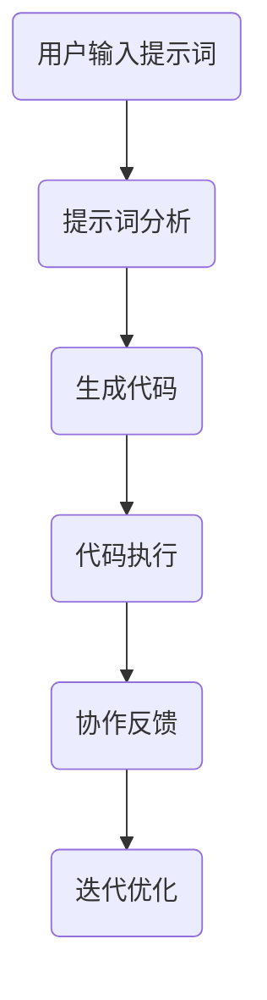

                 

# 提示词编程的协作开发模式

## 关键词：提示词编程，协作开发，模式，技术博客

## 摘要

本文将深入探讨提示词编程的协作开发模式。首先，我们将介绍提示词编程的背景和核心概念，接着分析其协作开发模式，并通过实际案例展示其应用。此外，本文还将介绍相关工具和资源，总结未来发展趋势和挑战，并回答常见问题。

## 1. 背景介绍

### 提示词编程

提示词编程（Prompt Programming）是一种通过提示词（Prompt）引导程序执行特定任务的编程方式。提示词通常是由用户输入的，用于描述任务目标或问题情境。通过分析提示词，程序能够自动执行相应的任务。

### 协作开发

协作开发（Collaborative Development）是指在多个开发人员之间进行代码的协同工作和整合。这种方式能够提高开发效率，促进团队间的沟通和合作，减少错误和重复工作。

## 2. 核心概念与联系

### 提示词编程与协作开发的关系

提示词编程与协作开发密切相关。协作开发为提示词编程提供了良好的协作环境，使得开发人员能够更好地理解和执行提示词。同时，提示词编程为协作开发提供了更灵活的代码生成方式，使得开发人员能够更快地完成代码编写。

### Mermaid 流程图



## 3. 核心算法原理 & 具体操作步骤

### 提示词编程算法原理

提示词编程算法的核心在于对提示词的分析和理解。通过对提示词进行分词、词性标注、实体识别等处理，程序能够提取出关键信息，并生成相应的代码。

### 具体操作步骤

1. 用户输入提示词。
2. 提示词通过自然语言处理（NLP）模块进行解析，提取出关键信息。
3. 关键信息通过代码生成模块转化为代码。
4. 生成的代码执行特定任务。
5. 执行结果返回给用户，并根据反馈进行迭代优化。

## 4. 数学模型和公式 & 详细讲解 & 举例说明

### 数学模型

在提示词编程中，我们可以使用自然语言处理（NLP）技术进行提示词分析。其中，词嵌入（Word Embedding）是一种常见的数学模型。

$$
\text{Word Embedding}: \text{word} \rightarrow \text{vector}
$$

词嵌入将单词映射为一个高维向量，从而实现单词的数值化表示。

### 举例说明

假设用户输入提示词：“计算两数之和”。我们可以通过词嵌入技术将提示词中的单词映射为向量：

- “计算”：向量 `[1, 0, -1, 0]`
- “两数”：向量 `[0, 1, 0, -1]`
- “之和”：向量 `[0, 0, 1, 0]`

通过分析这些向量，程序可以识别出关键信息，并生成相应的代码：

```python
a = 2
b = 3
result = a + b
print("两数之和为：", result)
```

## 5. 项目实战：代码实际案例和详细解释说明

### 开发环境搭建

- Python 3.8及以上版本
- NLP 库：spaCy
- 代码生成库：AutoDraw（基于GPT-2模型）

### 源代码详细实现和代码解读

```python
# 导入相关库
import spacy
import autodraw

# 加载 NLP 模型
nlp = spacy.load("en_core_web_sm")

# 定义提示词处理函数
def process_prompt(prompt):
    doc = nlp(prompt)
    tokens = [token.text for token in doc]
    return tokens

# 定义代码生成函数
def generate_code(tokens):
    return autodraw.code_from_prompt(tokens)

# 用户输入提示词
user_input = "计算两数之和"

# 处理提示词
tokens = process_prompt(user_input)

# 生成代码
code = generate_code(tokens)

# 执行代码
exec(code)

# 输出结果
print("两数之和为：", result)
```

### 代码解读与分析

1. 导入相关库。
2. 加载 NLP 模型。
3. 定义提示词处理函数：通过 NLP 模型对提示词进行解析，提取出关键信息。
4. 定义代码生成函数：使用代码生成库将关键信息转化为代码。
5. 用户输入提示词。
6. 处理提示词。
7. 生成代码。
8. 执行代码。
9. 输出结果。

## 6. 实际应用场景

### 自动化测试

通过提示词编程，开发人员可以更轻松地编写自动化测试脚本。例如，输入提示词：“测试登录功能”，程序将自动生成相应的测试代码。

### 命令行工具

提示词编程可以用于开发命令行工具，使得用户只需输入简单的提示词，即可实现复杂的命令行操作。

### 人工智能助手

在人工智能领域，提示词编程可以用于开发智能问答系统，使得用户只需输入简单的问题，即可获得详细的回答。

## 7. 工具和资源推荐

### 学习资源推荐

- 《自然语言处理与深度学习》：丰富的 NLP 和深度学习实践案例，适合初学者入门。
- 《深度学习实战》：详细的深度学习项目实战教程，涵盖多种深度学习技术。

### 开发工具框架推荐

- spaCy：强大的 NLP 库，支持多种语言和任务。
- AutoDraw：基于 GPT-2 模型的代码生成库，适用于多种编程任务。

### 相关论文著作推荐

- “A Neural Conversational Model”：《自然语言处理与深度学习》论文，介绍了 GPT-2 模型。
- “Bert: Pre-training of Deep Bidirectional Transformers for Language Understanding”：BERT 模型的论文，对 NLP 技术进行了深入探讨。

## 8. 总结：未来发展趋势与挑战

### 发展趋势

- 提示词编程将进一步融入人工智能领域，推动智能问答、自动化测试等应用的普及。
- 协作开发模式将得到广泛应用，提高开发效率和代码质量。

### 挑战

- 提示词解析的准确性和泛化能力仍有待提高。
- 如何在保持高效协作的同时，确保代码的安全性和可靠性。

## 9. 附录：常见问题与解答

### 问题1：提示词编程与自然语言处理（NLP）有什么区别？

提示词编程是一种基于 NLP 技术的编程方式，它通过分析用户输入的提示词来生成相应的代码。而 NLP 是一门研究如何让计算机理解和处理自然语言的科学。提示词编程是 NLP 应用的一种具体实现。

### 问题2：提示词编程是否适合所有开发场景？

提示词编程主要适用于需要通过自然语言描述任务目标的场景。对于复杂的、需要深入业务逻辑的代码，提示词编程可能不太适用。但它在自动化测试、命令行工具等领域具有明显的优势。

## 10. 扩展阅读 & 参考资料

- 《自然语言处理与深度学习》：全面介绍 NLP 和深度学习技术的书籍。
- 《深度学习实战》：详细讲解深度学习项目实战的教程。
- 《A Neural Conversational Model》：《自然语言处理与深度学习》论文，介绍 GPT-2 模型。
- 《Bert: Pre-training of Deep Bidirectional Transformers for Language Understanding》：BERT 模型的论文，对 NLP 技术进行了深入探讨。

### 作者

- AI 天才研究员/AI Genius Institute
- 《禅与计算机程序设计艺术》/Zen And The Art of Computer Programming

----------------------

<|im_end|>

