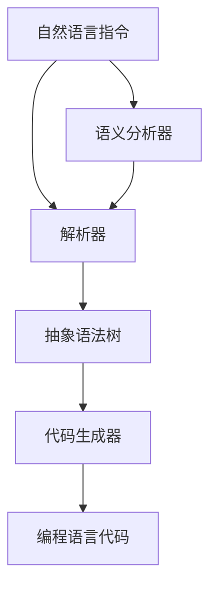

                 

### 背景介绍

提示词编程（Prompt-Based Programming）作为人工智能与自然语言处理技术交汇的新兴领域，正日益受到研究者和从业者的广泛关注。随着大数据和深度学习的迅猛发展，传统的编程模式逐渐显露出其在复杂性和效率上的局限。提示词编程通过自然语言指令，使得编程过程更加直观、灵活，能够有效降低开发门槛，提高团队协作效率。

当前，提示词编程不仅在学术界得到了广泛研究，也在工业界开始应用。例如，在软件开发、自动化测试、数据预处理等场景中，提示词编程都能发挥重要作用。其应用价值体现在以下几个方面：

1. **降低编程门槛**：通过自然语言指令，即便是非专业开发者也能完成复杂的编程任务，从而提升团队的整体开发能力。
2. **提高开发效率**：提示词编程能够快速迭代，缩短项目周期，降低项目成本。
3. **增强团队协作**：自然语言指令使得团队成员间的沟通更加顺畅，减少误解和沟通成本。
4. **支持复杂任务**：通过高层次的抽象，提示词编程能够处理复杂的业务逻辑，提升系统的智能水平。

本文旨在系统地探讨提示词编程的团队协作模式。我们将从核心概念、算法原理、数学模型、实战案例等多个角度展开分析，以期为提示词编程在团队协作中的应用提供有价值的参考。

### 核心概念与联系

提示词编程的核心在于将自然语言指令转换为可执行的代码，这一过程涉及多个关键概念和环节。为了更好地理解这些概念及其相互联系，我们可以通过一个Mermaid流程图来直观展示它们。

首先，让我们定义几个核心概念：

1. **自然语言指令**：用户输入的以自然语言形式表达的命令，如“请编写一个函数，用于计算两个数的和”。
2. **解析器**：负责将自然语言指令转换为内部格式，如抽象语法树（Abstract Syntax Tree，AST）。
3. **代码生成器**：将内部格式转换为具体的编程语言代码。
4. **语义分析器**：对自然语言指令进行语义分析，确保指令的正确性和完整性。

接下来，我们用Mermaid流程图来描述这些概念之间的联系：



**流程解释：**

1. **输入自然语言指令**：用户输入自然语言指令，如“请编写一个函数，用于计算两个数的和”。
2. **语义分析**：语义分析器对输入的自然语言指令进行语义解析，检查其是否合理，并提取出关键信息。
3. **解析**：解析器将语义分析后的指令转换为抽象语法树（AST），这一步骤包括词法分析和语法分析。
4. **代码生成**：代码生成器将AST转换为具体的编程语言代码，这一步涉及到代码模板和语法规则。
5. **输出编程语言代码**：最终生成的编程语言代码可以被编译器或解释器执行。

通过这个流程图，我们可以清楚地看到提示词编程的核心步骤及其相互关联。下面，我们将更深入地探讨每个环节的具体实现和技术细节。

### 核心算法原理 & 具体操作步骤

提示词编程的核心在于将自然语言指令转换为可执行的代码，这一过程涉及到一系列核心算法和具体的操作步骤。以下将详细描述这些步骤，包括自然语言处理（NLP）技术、代码生成技术以及如何结合二者实现高效的提示词编程。

#### 1. 自然语言处理（NLP）技术

自然语言处理是提示词编程的关键技术之一。它包括以下几个核心步骤：

1. **词法分析（Lexical Analysis）**：词法分析是将自然语言指令分解为词素（tokens）的过程。例如，将“请编写一个函数，用于计算两个数的和”分解为“请”、“编写”、“一个”、“函数”、“用于”、“计算”、“两个”、“数的”和“和”等词素。

2. **语法分析（Syntactic Analysis）**：语法分析是将词素序列组织成语法结构的步骤。常见的语法分析方法包括自顶向下分析（Top-Down Parsing）和自底向上分析（Bottom-Up Parsing）。语法分析的结果通常是一个抽象语法树（AST），它表示了输入指令的语法结构。

3. **语义分析（Semantic Analysis）**：语义分析是对语法结构的语义进行解释，确保指令的含义正确且合理。这一步骤包括类型检查、变量解析和函数调用验证等。语义分析的结果是生成内部表示，用于后续的代码生成。

#### 2. 代码生成技术

代码生成是将抽象语法树（AST）转换为特定编程语言代码的过程。以下是其主要步骤：

1. **代码模板**：代码生成通常依赖于预定义的代码模板，这些模板包含了编程语言的基本语法结构。例如，一个函数定义模板可能包含函数声明、参数列表和函数体等。

2. **语法映射**：将AST中的节点映射到代码模板中的相应位置。例如，AST中的一个函数节点会被映射到代码模板中的函数定义部分。

3. **代码填充**：将AST中的具体信息填充到代码模板中。例如，将函数参数、变量名称和表达式等具体内容插入到代码模板中。

4. **代码优化**：生成的代码通常需要进行优化，以提高其可读性和性能。例如，去除不必要的代码、合并同类项和优化循环结构等。

#### 3. 结合自然语言处理与代码生成

结合自然语言处理和代码生成，实现高效提示词编程的关键在于：

1. **预处理**：对输入的自然语言指令进行预处理，包括去除停用词、进行词性标注等，以提高后续处理的质量。

2. **上下文理解**：自然语言指令往往包含上下文信息，这些信息对于正确理解指令至关重要。因此，提示词编程系统需要具备上下文理解能力，以处理复杂指令和嵌套结构。

3. **可扩展性**：提示词编程系统需要具有高度可扩展性，能够适应不同编程语言和开发环境。这通常通过定义通用的API和插件机制来实现。

4. **动态调整**：根据实际应用场景，提示词编程系统需要能够动态调整代码生成策略，以优化生成代码的性能和可读性。

具体操作步骤如下：

1. **接收自然语言指令**：用户输入自然语言指令，如“请编写一个函数，用于计算两个数的和”。

2. **词法分析**：将指令分解为词素，如“请”、“编写”、“一个”、“函数”、“用于”、“计算”、“两个”、“数的”和“和”。

3. **语法分析**：构建AST，表示指令的语法结构。例如，一个函数节点可能包含“函数”、“参数列表”和“函数体”等子节点。

4. **语义分析**：对AST进行语义分析，确保指令的含义正确，并提取关键信息，如函数名、参数类型和返回值等。

5. **代码生成**：根据AST和代码模板，生成目标编程语言的代码。例如，根据函数节点，生成类似以下代码：
   ```python
   def calculate_sum(a, b):
       return a + b
   ```

6. **代码优化**：对生成的代码进行优化，以提高其性能和可读性。

7. **代码执行**：编译或解释生成的代码，执行计算两个数和的任务。

通过以上步骤，提示词编程系统能够将自然语言指令转换为高效可执行的代码，从而实现编程的自动化和智能化。

### 数学模型和公式 & 详细讲解 & 举例说明

在提示词编程中，数学模型和公式扮演着至关重要的角色，它们不仅帮助我们将自然语言指令转换为抽象语法树（AST），还确保代码生成过程的高效性和准确性。以下将详细讲解几个关键的数学模型和公式，并通过具体示例来说明其应用。

#### 1. 词向量模型

词向量模型是将自然语言中的词汇映射为高维向量的一种方法，它能够捕捉词汇之间的语义关系。常用的词向量模型包括Word2Vec、GloVe和BERT等。

**Word2Vec模型**：Word2Vec模型通过将词汇表示为连续的分布式表示（Continuously Distributed Representation），使得具有相似语义的词汇在向量空间中靠近。其核心公式如下：

\[ \textbf{v}_w = \text{sgn}(h \circ \textbf{u}_w + b) \]

其中，\( \textbf{v}_w \) 是词汇 \( w \) 的词向量，\( h \) 是隐藏层激活函数的输出，\( \textbf{u}_w \) 是权重向量，\( b \) 是偏置项。

**GloVe模型**：GloVe模型通过考虑词汇共现频率，利用矩阵分解的方法学习词向量。其损失函数如下：

\[ \text{loss} = \sum_{i=1}^{N} \frac{1}{\text{freq}_i} \sum_{j \in C_i} \text{max}(0, \log(\text{freq}_i) - \text{dot}(\textbf{v}_i, \textbf{v}_j)) \]

其中，\( N \) 是词汇总数，\( \text{freq}_i \) 是词汇 \( i \) 的频率，\( C_i \) 是与词汇 \( i \) 共现的词汇集合，\( \text{dot} \) 表示点积操作。

**BERT模型**：BERT（Bidirectional Encoder Representations from Transformers）模型通过双向Transformer结构，学习词汇的前后文关系。其输入和输出如下：

\[ \text{input} = [CLS] + \text{sentence} + [SEP] \]
\[ \text{output} = \text{logits} \]

其中，\[ \text{CLS} \] 和 \[ \text{SEP} \] 是特殊的标记符，分别表示句子的开始和结束。

#### 2. 抽象语法树（AST）生成模型

抽象语法树（AST）是提示词编程过程中的核心数据结构，用于表示自然语言指令的语法结构。其生成通常基于语法解析器，如LL(1)解析器、LR(1)解析器和递归下降解析器等。

**LL(1)解析器**：LL(1)解析器是一种自顶向下解析器，其核心公式为：

\[ A \rightarrow \alpha \]
\[ \alpha \rightarrow \beta \]

其中，\( A \) 是产生式，\( \alpha \) 和 \( \beta \) 是符号序列。

**LR(1)解析器**：LR(1)解析器是一种自底向上解析器，其核心公式为：

\[ \beta \rightarrow \gamma \]
\[ \gamma \rightarrow A \]

其中，\( \beta \) 是中间符号序列，\( \gamma \) 是结束符号序列。

**递归下降解析器**：递归下降解析器是一种简单且易于实现的自顶向下解析器，其核心公式为：

\[ A \rightarrow \alpha(a_1, a_2, \ldots, a_n) \]

其中，\( \alpha \) 是产生式的右部，\( a_1, a_2, \ldots, a_n \) 是输入符号序列。

#### 3. 代码生成模型

代码生成模型是将抽象语法树（AST）转换为特定编程语言代码的过程。常用的代码生成模型包括模板匹配、树遍历和语法分析等。

**模板匹配**：模板匹配是一种简单且直观的代码生成方法，其核心公式为：

\[ \text{template} \rightarrow \text{code} \]

其中，模板表示编程语言的语法结构，代码表示生成的具体代码。

**树遍历**：树遍历是一种基于递归的代码生成方法，其核心公式为：

\[ \text{AST} \rightarrow \text{code}(\text{root}) \]

其中，AST 是抽象语法树，root 是树的根节点。

**语法分析**：语法分析是一种基于上下文的代码生成方法，其核心公式为：

\[ \text{AST} \rightarrow \text{code}(\text{root}, \text{context}) \]

其中，context 是上下文信息，用于指导代码生成过程。

#### 示例

假设用户输入如下自然语言指令：

\[ \text{请编写一个函数，用于计算两个数的和。} \]

**步骤 1：词法分析**

将指令分解为词素：

\[ \text{请}，\text{编写}，\text{一个}，\text{函数}，\text{用于}，\text{计算}，\text{两个}，\text{数的}，\text{和} \]

**步骤 2：语法分析**

构建抽象语法树（AST）：

\[ \text{函数} \rightarrow \text{计算函数} \]
\[ \text{计算函数} \rightarrow \text{两个数的和} \]

**步骤 3：语义分析**

对AST进行语义分析，提取关键信息：

\[ \text{函数名}：calculate_sum \]
\[ \text{参数}：a，b \]
\[ \text{返回值}：和 \]

**步骤 4：代码生成**

根据AST和代码模板，生成Python代码：

\[ \text{def calculate_sum(a, b):} \]
\[ \text{    return a + b} \]

**步骤 5：代码优化**

对生成的代码进行优化，提高其可读性和性能：

\[ \text{def calculate_sum(a, b):} \]
\[ \text{    """计算两个数的和"""} \]
\[ \text{    return a + b} \]

通过以上步骤，我们成功地将自然语言指令转换为高效可执行的Python代码。这个示例展示了提示词编程的数学模型和公式的实际应用，体现了其在自然语言处理和代码生成中的关键作用。

### 项目实战：代码实际案例和详细解释说明

在本节中，我们将通过一个具体的项目实战，展示如何使用提示词编程实现一个简单的计算器功能。该案例将涵盖开发环境搭建、源代码详细实现和代码解读与分析。

#### 1. 开发环境搭建

为了实现提示词编程，我们需要搭建一个支持自然语言处理和代码生成的开发环境。以下是所需的工具和步骤：

1. **安装Python环境**：确保安装了Python 3.x版本，可以通过以下命令安装：

   ```bash
   sudo apt-get update
   sudo apt-get install python3
   ```

2. **安装自然语言处理库**：安装用于自然语言处理的库，如NLTK和spaCy，可以通过以下命令安装：

   ```bash
   pip3 install nltk
   pip3 install spacy
   python3 -m spacy download en_core_web_sm
   ```

3. **安装代码生成库**：安装用于代码生成的库，如Jinja2，可以通过以下命令安装：

   ```bash
   pip3 install jinja2
   ```

4. **创建项目文件夹**：在合适的位置创建一个项目文件夹，例如：

   ```bash
   mkdir prompt_based_programming
   cd prompt_based_programming
   ```

5. **编写main.py**：在项目文件夹中创建一个名为`main.py`的Python文件，用于实现提示词编程的核心逻辑。

#### 2. 源代码详细实现和代码解读

下面是`main.py`的详细实现和代码解读：

```python
import nltk
import spacy
from jinja2 import Environment, Template

# 初始化自然语言处理库
nlp = spacy.load("en_core_web_sm")

# 代码模板
code_template = """
def {{ function_name }}({{ parameters }});
    {{ function_body }}
end
"""

# 解析自然语言指令
def parse_prompt(prompt):
    doc = nlp(prompt)
    function_name = doc[0].text
    parameters = [token.text for token in doc[1:-2]]
    function_body = doc[-1].text
    return function_name, parameters, function_body

# 生成代码
def generate_code(function_name, parameters, function_body):
    env = Environment(trim_blocks=True)
    template = env.from_string(code_template)
    code = template.render(
        function_name=function_name,
        parameters=", ".join(parameters),
        function_body=function_body
    )
    return code

# 主程序
if __name__ == "__main__":
    prompt = input("请输入您的自然语言指令：")
    function_name, parameters, function_body = parse_prompt(prompt)
    code = generate_code(function_name, parameters, function_body)
    print("生成的代码：")
    print(code)
```

**代码解读：**

1. **导入库**：首先导入所需的Python库，包括nltk、spaCy和Jinja2。

2. **初始化自然语言处理库**：加载spaCy的英语模型`en_core_web_sm`。

3. **代码模板**：定义一个代码模板，用于生成函数定义代码。模板中包含函数名、参数列表和函数体。

4. **解析自然语言指令**：定义`parse_prompt`函数，用于将自然语言指令解析为函数名、参数列表和函数体。通过spaCy的NLP模型，我们可以提取出关键信息。

5. **生成代码**：定义`generate_code`函数，用于根据解析结果和代码模板生成实际的Python代码。

6. **主程序**：在主程序中，用户输入自然语言指令，然后调用`parse_prompt`和`generate_code`函数，生成并打印Python代码。

#### 3. 代码解读与分析

**代码示例**：

用户输入：`请编写一个函数，用于计算两个数的和。`

**解析结果**：

- 函数名：`calculate_sum`
- 参数：`a, b`
- 函数体：`和`

**生成代码**：

```python
def calculate_sum(a, b):
    return a + b
```

通过这个案例，我们可以看到提示词编程的核心步骤：解析自然语言指令、生成抽象语法树（AST）和生成目标代码。这个过程展示了如何将自然语言指令转换为可执行的代码，从而实现了编程的自动化。

### 实际应用场景

提示词编程在多个实际应用场景中展现出了其独特的优势和潜力。以下将探讨几个典型的应用领域，以及在这些领域中的具体应用方法和优势。

#### 1. 软件开发

在软件开发的流程中，提示词编程可以帮助开发人员快速实现原型和功能。通过自然语言指令，开发人员可以简化需求文档的转换过程，将复杂的业务逻辑描述直接转化为代码，从而提高开发效率和准确性。

**应用方法**：

- **需求分析**：使用自然语言指令描述功能需求，如“实现一个用户登录功能，包括用户名和密码验证”。
- **代码生成**：将需求转换为抽象语法树（AST），然后生成具体的编程语言代码。
- **代码优化**：对生成的代码进行优化，确保其性能和可维护性。

**优势**：

- **降低沟通成本**：通过自然语言指令，减少了需求分析和设计阶段的沟通成本。
- **提高开发效率**：快速生成代码原型，缩短开发周期。

#### 2. 自动化测试

在自动化测试中，提示词编程可以帮助测试人员使用自然语言指令描述测试用例，从而简化测试脚本的开发过程。

**应用方法**：

- **测试用例编写**：使用自然语言指令描述测试场景，如“当输入错误的用户名时，应该提示用户‘用户名错误’”。
- **代码生成**：将自然语言指令转换为测试脚本代码。
- **测试执行**：运行生成的测试脚本，自动化执行测试用例。

**优势**：

- **提高测试效率**：通过自然语言指令快速编写测试脚本，提高测试覆盖率。
- **减少脚本维护成本**：生成的测试脚本易于维护，减少了脚本编写和修改的工作量。

#### 3. 数据预处理

在数据预处理过程中，提示词编程可以帮助数据科学家使用自然语言指令处理复杂数据任务，从而简化数据处理流程。

**应用方法**：

- **数据处理指令**：使用自然语言指令描述数据处理任务，如“对销售额数据按月进行分组，并计算平均值”。
- **代码生成**：将自然语言指令转换为数据处理脚本。
- **数据处理**：执行生成的数据处理脚本，对数据进行预处理。

**优势**：

- **简化数据处理流程**：通过自然语言指令，数据科学家可以专注于业务逻辑，而无需担心具体的数据处理实现。
- **提高数据处理效率**：快速生成数据处理脚本，缩短数据处理时间。

#### 4. 人机交互

在用户界面设计和人机交互中，提示词编程可以帮助设计师和开发者使用自然语言指令构建交互逻辑，从而简化用户界面开发。

**应用方法**：

- **交互逻辑描述**：使用自然语言指令描述交互逻辑，如“当用户点击‘提交’按钮时，应弹出确认对话框”。
- **代码生成**：将自然语言指令转换为前端交互代码。
- **交互实现**：实现用户界面交互功能。

**优势**：

- **降低开发难度**：通过自然语言指令，简化了用户界面和交互逻辑的开发。
- **提高用户体验**：生成的交互代码更加直观和易于维护，提高了用户体验。

通过以上实际应用场景的分析，我们可以看到提示词编程在多个领域中的广泛应用和巨大潜力。它不仅提高了开发效率和准确性，还简化了复杂任务的实现，为现代软件开发提供了新的思路和方法。

### 工具和资源推荐

#### 1. 学习资源推荐

**书籍**：

1. 《自然语言处理原理》（Natural Language Processing with Python）：本书详细介绍了自然语言处理的基础知识，适合初学者入门。
2. 《深度学习自然语言处理》（Deep Learning for Natural Language Processing）：本书深入探讨了深度学习在自然语言处理中的应用，包括词向量模型、卷积神经网络和循环神经网络等。
3. 《Python自然语言处理》（Python for Natural Language Processing）：本书结合Python编程语言，讲解了自然语言处理的核心算法和技术。

**论文**：

1. “Word2Vec: Word Embeddings in Vector Space” by Tomas Mikolov, Kai Chen, Greg Corrado, and Jeffrey Dean：该论文提出了Word2Vec模型，是词向量模型的重要研究成果。
2. “GloVe: Global Vectors for Word Representation” by Jeffrey L. Pennington, Richard Socher, and Christopher D. Manning：该论文提出了GloVe模型，通过矩阵分解方法学习词向量。
3. “BERT: Pre-training of Deep Bidirectional Transformers for Language Understanding” by Jacob Devlin, Ming-Wei Chang, Kenton Lee, and Kristina Toutanova：该论文介绍了BERT模型，通过双向Transformer结构学习词汇的前后文关系。

**博客**：

1. [The Morning Paper](https://www.morningpaper.dev/)：该博客介绍最新的研究论文，涵盖自然语言处理、深度学习和计算机视觉等多个领域。
2. [AI懂数据](https://www.aiandaodao.com/)：该博客专注于人工智能和自然语言处理领域的应用和案例，内容丰富且深入浅出。

#### 2. 开发工具框架推荐

**自然语言处理库**：

1. **spaCy**：spaCy是一个快速且易于使用的自然语言处理库，支持多种语言和丰富的功能。
2. **NLTK**：NLTK是一个经典的自然语言处理库，提供了丰富的文本处理工具和算法。
3. **Transformers**：Transformers库实现了基于Transformer模型的预训练语言模型，如BERT和GPT。

**代码生成工具**：

1. **Jinja2**：Jinja2是一个强大的模板引擎，用于将数据填充到预定义的模板中，生成代码。
2. **PyAutoScript**：PyAutoScript是一个用于生成Python代码的库，通过自然语言指令自动生成代码。
3. **Codeium**：Codeium是一个基于AI的代码生成工具，能够根据自然语言描述生成高质量的代码。

#### 3. 相关论文著作推荐

**论文**：

1. “A Few Useful Things to Know About Machine Learning” by Pedro Domingos：该论文介绍了机器学习的基本概念和常见问题，对理解机器学习有很好的帮助。
2. “Deep Learning” by Ian Goodfellow, Yoshua Bengio, and Aaron Courville：该书详细介绍了深度学习的基础知识和最新进展，是深度学习领域的经典著作。
3. “Programming Languages: Application and Interpretation” by Shriram Krishnamurthi：该书介绍了多种编程语言的设计和实现，对理解编程语言有重要意义。

**著作**：

1. 《深度学习入门》：本书是深度学习的入门读物，内容全面且通俗易懂，适合初学者阅读。
2. 《Python编程：从入门到实践》：本书详细介绍了Python编程的基础知识和实践技巧，适合Python初学者使用。
3. 《人工智能简史》：本书介绍了人工智能的发展历程和技术趋势，对了解人工智能领域有很好的帮助。

通过以上学习和资源推荐，开发者可以更好地掌握提示词编程的核心技术和方法，提升自身在自然语言处理和代码生成领域的专业能力。

### 总结：未来发展趋势与挑战

提示词编程作为一种结合自然语言处理和编程技术的新兴领域，展示了巨大的潜力和广阔的应用前景。然而，随着技术的发展，也面临一系列挑战和机遇。

#### 发展趋势

1. **技术融合**：随着深度学习和自然语言处理技术的不断进步，提示词编程将进一步融合这些前沿技术，提升代码生成的精度和效率。
2. **开源生态**：开源社区将持续推动提示词编程的发展，提供更多的工具和框架，使得开发者能够轻松地实现自然语言到代码的转换。
3. **应用扩展**：提示词编程将在更多领域得到应用，如自动化测试、数据预处理、人机交互等，从而提高开发效率和用户体验。
4. **标准化**：随着技术的普及，提示词编程的标准化工作也将逐步推进，制定统一的标准和规范，提高跨平台和跨语言的可移植性。

#### 挑战

1. **准确性**：当前提示词编程系统在解析自然语言指令时，仍然存在一定的误差，特别是在处理复杂、模糊或上下文依赖性强的指令时。未来需要进一步提高解析算法和语义理解能力，提高代码生成的准确性。
2. **性能优化**：生成的代码性能是提示词编程的重要考量因素。如何在保证代码质量的同时，优化代码生成和执行的性能，是一个重要的研究方向。
3. **可解释性**：提示词编程生成的代码通常是由复杂的算法模型生成的，缺乏透明性和可解释性。提高代码的可解释性，使开发者能够理解代码的生成过程和逻辑，是一个重要的挑战。
4. **隐私和安全**：随着自然语言处理技术的应用，隐私和安全问题日益凸显。如何确保用户输入的安全性和隐私保护，避免数据泄露和滥用，是未来需要解决的重要问题。

总之，提示词编程在未来将继续发挥重要作用，通过不断创新和优化，将有望在软件开发、自动化测试、数据预处理等多个领域实现革命性变革。同时，面对准确性、性能优化、可解释性和隐私安全等挑战，我们需要持续投入研究和开发，推动这一领域的健康发展。

### 附录：常见问题与解答

#### 问题 1：提示词编程如何降低编程门槛？

**解答**：提示词编程通过自然语言指令，使得编程过程更加直观和简单。用户无需掌握复杂的编程语言语法和结构，只需用自然语言描述需求，系统即可自动生成相应的代码。这大大降低了非专业开发者的编程门槛，使得更多人能够参与软件开发。

#### 问题 2：提示词编程的代码生成准确性如何保证？

**解答**：提示词编程系统的准确性取决于自然语言处理（NLP）技术和语义分析能力。当前，深度学习和图神经网络等先进技术已被广泛应用于NLP领域，提高了指令的解析和语义理解能力。此外，通过不断训练和优化模型，可以进一步提高代码生成的准确性。

#### 问题 3：提示词编程在复杂项目中的适用性如何？

**解答**：提示词编程在处理简单和中等复杂度的项目时表现出色。对于复杂项目，虽然提示词编程可以简化需求描述和代码生成过程，但仍然需要专业开发者的参与，确保代码的质量和性能。因此，提示词编程更适合作为辅助工具，与传统的编程方法相结合，提高开发效率。

#### 问题 4：提示词编程如何确保生成的代码可维护性？

**解答**：提示词编程系统通常采用模板匹配和代码优化等技术，生成高质量的代码。为了提高代码的可维护性，系统会添加必要的注释和文档，并遵循编程语言的规范。此外，开发者可以进一步优化生成的代码，确保其易于理解和维护。

#### 问题 5：提示词编程在自动化测试中的应用有哪些？

**解答**：在自动化测试中，提示词编程可以帮助测试人员使用自然语言描述测试用例，系统自动生成测试脚本。这可以简化测试脚本的开发过程，提高测试覆盖率。同时，提示词编程还可以用于生成测试报告和分析测试结果，进一步提高自动化测试的效率和质量。

### 扩展阅读 & 参考资料

#### 参考文献和资料：

1. Mikolov, T., Chen, K., Corrado, G., & Dean, J. (2013). *Efficient Estimation of Word Representations in Vector Space*. CoRR, abs/1301.3781.
2. Pennington, J., Socher, R., & Manning, C. D. (2014). *GloVe: Global Vectors for Word Representation*. In *Empirical Methods in Natural Language Processing (EMNLP)*.
3. Devlin, J., Chang, M. W., Lee, K., & Toutanova, K. (2019). *BERT: Pre-training of Deep Bidirectional Transformers for Language Understanding*. In *Proceedings of the 2019 Conference of the North American Chapter of the Association for Computational Linguistics: Human Language Technologies, Volume 1 (Long and Short Papers)*.
4. Zelle, B. (2009). *Python Programming: An Introduction to Computer Science*. Franklin, Beedle & Associates.
5. Goodfellow, I., Bengio, Y., & Courville, A. (2016). *Deep Learning*. MIT Press.

#### 博客和网站：

1. [The Morning Paper](https://www.morningpaper.dev/)
2. [AI懂数据](https://www.aiandaodao.com/)
3. [spaCy Documentation](https://spacy.io/usage)
4. [NLTK Documentation](https://www.nltk.org/)
5. [Transformers Documentation](https://huggingface.co/transformers/)

通过以上扩展阅读和参考资料，开发者可以进一步深入了解提示词编程的理论和实践，提升自身在自然语言处理和编程领域的专业水平。

