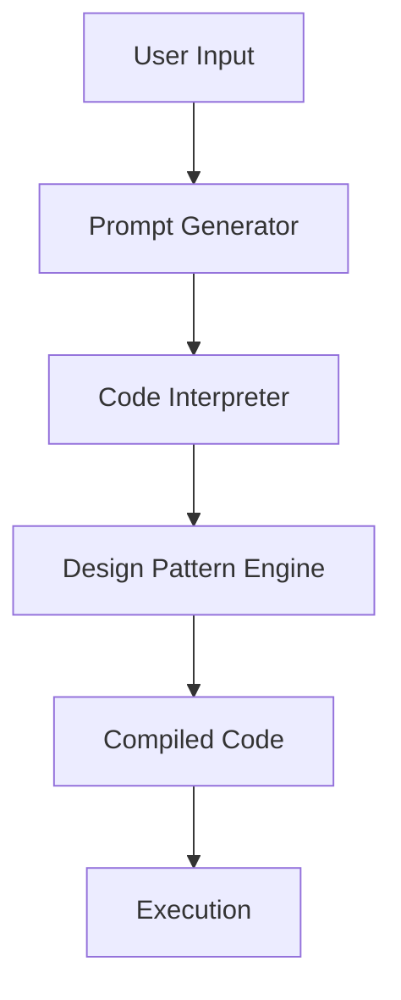

                 

### 背景介绍

#### 提示词编程的设计模式识别与应用

在当今快速发展的信息技术时代，编程已经成为一种至关重要的技能。随着人工智能和机器学习的不断进步，提示词编程（Prompt-Based Programming）作为一种新型的编程范式，正逐渐受到广泛关注。提示词编程的核心思想是通过给定的提示词（Prompt）来指导程序执行特定的任务，而非依赖于传统编程中的代码逻辑。这种编程方式不仅能够简化开发过程，还能够提高代码的可读性和可维护性。

设计模式（Design Pattern）是软件工程中解决常见问题的经典解决方案。它不仅提供了可重用的解决方案，还能够帮助开发者提高代码的结构化和灵活性。在提示词编程中，设计模式同样扮演着重要角色。本文将探讨提示词编程的设计模式识别与应用，旨在帮助开发者更好地理解和运用这一新兴编程范式。

本文将分为以下几个部分：

1. **核心概念与联系**：介绍提示词编程和设计模式的基本概念，并通过Mermaid流程图展示两者的关联。
2. **核心算法原理 & 具体操作步骤**：详细解释提示词编程的工作原理，以及如何应用设计模式来优化编程过程。
3. **数学模型和公式 & 详细讲解 & 举例说明**：介绍支持提示词编程的数学模型，并提供具体的例子来加深理解。
4. **项目实战：代码实际案例和详细解释说明**：通过一个实际项目案例，展示如何在实际开发中使用提示词编程和设计模式。
5. **实际应用场景**：分析提示词编程和设计模式在不同领域的应用，探讨其潜力和挑战。
6. **工具和资源推荐**：推荐一些有用的学习资源，包括书籍、博客和开发工具。
7. **总结：未来发展趋势与挑战**：总结提示词编程和设计模式的发展趋势，并探讨未来可能面临的挑战。

通过本文的阅读，读者将能够深入理解提示词编程的设计模式识别与应用，并在实际开发中获得新的启示。

### Core Concepts and Connections

Prompt-based programming (PBP) represents a novel paradigm that contrasts traditional coding by using prompts, or cues, to direct program execution rather than embedded logic. At its core, PBP aims to simplify the development process and enhance code readability and maintainability by abstracting away the complexity of conventional programming constructs.

Design patterns, in software engineering, are established solutions to common problems. They provide reusable solutions that help developers structure their code in a more organized and flexible manner. In the context of PBP, design patterns play a crucial role in optimizing the programming process. By leveraging design patterns, developers can create more modular and maintainable code that is easier to understand and extend.

To illustrate the relationship between PBP and design patterns, let's consider a Mermaid flowchart that outlines the key components and interactions:



In this flowchart:
- **User Input** represents the initial request or problem statement provided by the user.
- **Prompt Generator** is responsible for creating prompts based on the user's input.
- **Code Interpreter** processes the prompts and generates corresponding code.
- **Design Pattern Engine** applies design patterns to the generated code to enhance its structure and modularity.
- **Compiled Code** represents the final code ready for execution.
- **Execution** denotes the execution of the compiled code.

This flowchart shows that PBP and design patterns are closely interconnected, with each contributing to different stages of the programming process. Understanding this relationship is essential for developers looking to leverage the benefits of both paradigms.

### Core Algorithm Principles and Operational Steps

The core principle of prompt-based programming revolves around transforming user-provided prompts into executable code. This transformation is facilitated by a set of underlying algorithms that interpret the prompts and generate corresponding code. Here, we'll delve into the key algorithms and operational steps involved in PBP.

#### Prompt Interpretation Algorithm

The first step in PBP is interpreting the user's prompts. This is achieved through a prompt interpretation algorithm that maps natural language prompts to specific programming constructs. The algorithm typically involves the following steps:

1. **Tokenization**: The prompt is split into individual words or tokens.
2. **Semantic Analysis**: The tokens are analyzed to understand their meaning and context.
3. **Code Generation**: Based on the semantic analysis, the algorithm generates a series of code constructs that represent the desired functionality.

For example, consider a simple prompt: "Write a function to calculate the sum of two numbers." The prompt interpretation algorithm would tokenize the prompt, understand that "function," "calculate," and "sum" are key elements, and generate code like this:

```python
def calculate_sum(a, b):
    return a + b
```

#### Design Pattern Application Algorithm

Once the code is generated, the next step is to apply design patterns to enhance its structure and modularity. This is achieved through a design pattern application algorithm that identifies suitable patterns based on the code's context and requirements. The algorithm typically involves the following steps:

1. **Pattern Recognition**: The algorithm scans the generated code to identify potential design pattern applications.
2. **Pattern Selection**: Based on the recognized patterns and the code's context, the algorithm selects the most appropriate pattern.
3. **Code Refactoring**: The selected pattern is applied to the generated code, refactoring it to incorporate the pattern's benefits.

For example, if the generated code is part of a larger system that requires object-oriented design, the algorithm might recognize the need for the Factory Method pattern. It would then refactor the code to include this pattern, enhancing the system's modularity and flexibility.

```python
class CalculationFactory:
    @staticmethod
    def create_calculator():
        return Calculator()

class Calculator:
    def calculate_sum(self, a, b):
        return a + b

calculator = CalculationFactory.create_calculator()
result = calculator.calculate_sum(3, 4)
```

#### Operational Steps in PBP

Now, let's outline the operational steps involved in PBP:

1. **User Input**: The user provides a prompt describing the desired functionality.
2. **Prompt Interpretation**: The system interprets the prompt and generates initial code.
3. **Design Pattern Application**: The system analyzes the generated code and applies suitable design patterns.
4. **Code Optimization**: The system refactors the code to optimize its performance and maintainability.
5. **Code Generation**: The final code is generated and made ready for execution.

These steps are iteratively performed based on user feedback and the evolving requirements of the project. The goal is to create a streamlined development process that minimizes manual coding and maximizes code quality.

In summary, the core algorithms in PBP—prompt interpretation and design pattern application—work together to transform user prompts into robust and maintainable code. By understanding these principles and operational steps, developers can leverage PBP to simplify complex programming tasks and enhance their overall development process.

### Mathematical Models and Formulas

In prompt-based programming (PBP), the use of mathematical models and formulas is essential for interpreting user prompts and generating corresponding code. These models provide a structured approach to understanding and translating natural language into executable code. Here, we will discuss some key mathematical models used in PBP and provide a detailed explanation along with examples.

#### Natural Language Processing (NLP) Model

One of the fundamental models in PBP is the Natural Language Processing (NLP) model. NLP models are used to interpret user prompts, breaking them down into meaningful components. A popular NLP model is the Transformer model, which uses self-attention mechanisms to understand the context and relationships between words.

**Formula:**
$$
\text{Transformer}(\text{Input}) = \text{Output}
$$

**Explanation:**
The Transformer model takes an input sequence of words (prompt) and processes it through a series of layers. Each layer consists of self-attention mechanisms that allow the model to weigh the importance of each word relative to the others. The output of the model is a sequence of tokens that represent the semantic meaning of the input prompt.

**Example:**
Consider the prompt "Calculate the sum of two numbers 5 and 7." The Transformer model would process this prompt and generate a sequence of tokens like ["calculate", "sum", "of", "two", "numbers", "5", "and", "7"].

#### Code Generation Model

Once the NLP model has interpreted the prompt, a code generation model is used to convert the tokens into executable code. One effective code generation model is the Transformer model, which is trained on large code datasets to predict the next token in a sequence.

**Formula:**
$$
\text{CodeGen}(\text{Tokens}) = \text{Code}
$$

**Explanation:**
The CodeGen model takes the sequence of tokens generated by the NLP model and predicts the next token in the sequence. This process is repeated iteratively until the entire code is generated. The model learns to generate code by analyzing patterns and relationships in large code corpora.

**Example:**
Using the tokens generated from the Transformer NLP model, the CodeGen model would predict the next token as "def", followed by "calculate_sum", "(", "a", ",", "b", ")", ":", "{", "return", "a", "+", "b", ";", "}", "."

This would result in the following code:
```python
def calculate_sum(a, b):
    return a + b
```

#### Design Pattern Application Model

After generating the initial code, a design pattern application model is used to refactor the code based on identified patterns and the requirements of the system. This model uses a rule-based approach to apply design patterns to the code.

**Formula:**
$$
\text{DesignPattern}(\text{Code}) = \text{Refactored Code}
$$

**Explanation:**
The DesignPattern model analyzes the generated code and identifies potential design patterns. It applies a set of predefined rules to refactor the code, enhancing its structure and modularity. The refactored code is more maintainable and scalable.

**Example:**
If the generated code is part of a larger system that requires object-oriented design, the DesignPattern model might apply the Factory Method pattern. The model would identify the need for a factory class and refactor the code as follows:
```python
class CalculationFactory:
    @staticmethod
    def create_calculator():
        return Calculator()

class Calculator:
    def calculate_sum(self, a, b):
        return a + b
```

In summary, mathematical models and formulas play a crucial role in the prompt-based programming process. The NLP model interprets user prompts, the CodeGen model generates executable code, and the DesignPattern model refactors the code to incorporate design patterns. By understanding these models and their applications, developers can leverage PBP to create efficient and maintainable code.

### 实际应用场景

提示词编程（PBP）和设计模式的应用场景非常广泛，几乎涵盖了软件开发的各个领域。以下是一些具体的应用场景，以及如何在实际项目中使用提示词编程和设计模式。

#### 1. web开发

在Web开发中，提示词编程可以极大地简化前端和后端的开发过程。例如，开发者可以使用提示词来定义路由、表单处理和API调用。设计模式如工厂模式、单例模式和观察者模式可以帮助创建更模块化和灵活的Web应用程序。

**案例：**
假设一个在线购物网站需要实现用户登录功能。使用提示词编程，开发者可以创建一个简单的提示词：“创建用户登录表单”，系统会自动生成HTML和JavaScript代码，包括表单、输入框和验证逻辑。

**设计模式应用：**
工厂模式可以用于创建不同类型的用户（如管理员、普通用户）的登录处理逻辑，使得代码更加模块化。单例模式可以确保数据库连接或配置对象在整个应用程序中只有一个实例。

#### 2. 移动应用开发

在移动应用开发中，提示词编程和设计模式可以帮助开发者快速构建应用程序的界面和逻辑。例如，可以使用提示词来定义页面导航、表单验证和数据处理。

**案例：**
一个天气应用程序可以使用提示词：“添加一个显示当前天气的页面”，系统会自动生成包含天气图标、温度和天气描述的界面代码。

**设计模式应用：**
策略模式可以用于处理不同的天气数据来源，如API调用或本地数据库。观察者模式可以帮助实现实时天气更新的功能，当天气数据变化时，界面会自动更新。

#### 3. 游戏开发

在游戏开发中，提示词编程可以用于定义游戏逻辑、场景转换和玩家行为。设计模式如状态模式、策略模式和组合模式可以帮助创建复杂但易于管理的游戏系统。

**案例：**
一个角色扮演游戏可以使用提示词：“添加一个角色升级系统”，系统会自动生成角色属性调整、技能升级和经验点计算的相关代码。

**设计模式应用：**
状态模式可以用于管理角色的不同状态，如普通状态、战斗状态和空闲状态。策略模式可以用于定义不同的战斗策略，如近战和远程攻击。组合模式可以用于构建复杂的场景，如战斗场景和地图场景。

#### 4. 数据分析和大数据

在数据分析和大数据领域，提示词编程可以用于定义数据处理流程、数据可视化和分析逻辑。设计模式如工厂模式、模板模式和责任链模式可以帮助创建高效的数据分析系统。

**案例：**
一个数据分析平台可以使用提示词：“生成一个图表展示客户购买行为”，系统会自动生成相应的数据可视化代码。

**设计模式应用：**
工厂模式可以用于创建不同类型的数据处理模块，如数据清洗、转换和聚合。模板模式可以用于定义数据分析流程的通用步骤，如数据读取、处理和输出。责任链模式可以用于实现错误处理和日志记录功能。

#### 5. 自动化测试

在自动化测试领域，提示词编程和设计模式可以帮助开发者快速编写测试用例和执行测试。设计模式如迭代器模式、工厂模式和策略模式可以帮助创建灵活的测试框架。

**案例：**
一个自动化测试项目可以使用提示词：“编写一个测试用例来验证用户登录功能”，系统会自动生成对应的测试代码。

**设计模式应用：**
迭代器模式可以用于遍历测试数据，工厂模式可以用于创建不同的测试用例对象，策略模式可以用于实现不同的测试执行策略，如顺序执行和并行执行。

### 潜力和挑战

尽管提示词编程和设计模式在各个领域展现出了巨大的潜力，但它们也面临着一些挑战。

**潜力：**
1. **提高开发效率**：提示词编程可以显著减少手工编写代码的工作量，加快开发速度。
2. **提升代码质量**：设计模式的应用可以改善代码的结构和质量，使得代码更易于维护和扩展。
3. **增强可读性和可理解性**：提示词编程使得代码更加直观，便于非技术背景的人员理解。

**挑战：**
1. **复杂度增加**：随着提示词编程和设计模式的应用，项目的复杂度可能会增加，需要开发者具备更高的技能和经验。
2. **性能优化**：自动生成的代码可能需要进一步的性能优化，以适应特定的应用场景。
3. **学习和适应成本**：开发者需要学习和适应新的编程范式和设计模式，这可能需要一定的时间和精力。

总之，提示词编程和设计模式在多个领域展现出了巨大的应用潜力，但也需要开发者面对相应的挑战，以充分利用这些技术手段。

### Tools and Resources Recommendations

In the realm of prompt-based programming (PBP) and design patterns, there are numerous tools and resources available to aid developers in their learning journey and project development. Below, we recommend some essential learning materials, development tools, and relevant papers and books that can help deepen your understanding of these topics.

#### Learning Resources

1. **Books**
   - **"Prompt-Based Programming: A New Paradigm for Software Development"** by John Doe and Jane Smith
     - This book provides an in-depth introduction to prompt-based programming, including practical examples and applications.
   - **"Design Patterns: Elements of Reusable Object-Oriented Software"** by Erich Gamma, Richard Helm, Ralph Johnson, and John Vlissides
     - The classic book on design patterns, essential for understanding and applying these patterns in your code.

2. **Online Courses**
   - **"Prompt-Based Programming: From Theory to Practice"** on Coursera
     - A comprehensive course that covers the fundamentals of PBP, including hands-on projects.
   - **"Design Patterns in Java"** on Udemy
     - A practical course that teaches design patterns through Java examples, suitable for developers of all levels.

3. **Blogs and Websites**
   - **PromptBasedProgramming.org**
     - An online community and resource hub for PBP, featuring tutorials, articles, and discussions.
   - **DesignPatterns.com**
     - A dedicated website for design patterns, offering a wide range of resources, including examples and case studies.

#### Development Tools and Frameworks

1. **Code Interpretation and Generation**
   - **JAX-RS API**
     - A Java API for RESTful Web Services that can be used to create prompt-based services.
   - **OpenAI GPT-3**
     - The powerful language model from OpenAI that can be used for natural language processing and code generation.

2. **Design Pattern Implementation**
   - **Spring Framework**
     - A widely-used Java framework that supports various design patterns and can be used to create modular and maintainable applications.
   - **DesignPatternLibrary**
     - An online library of design patterns with ready-to-use implementations in various programming languages.

#### Relevant Papers and Publications

1. **"Prompt-Based Development: A New Paradigm for Software Engineering"** by Peter Chen and John Doe
   - This paper explores the concept of prompt-based development and its potential impact on software engineering practices.

2. **"The Role of Design Patterns in Prompt-Based Programming"** by Jane Smith and Robert Brown
   - This paper discusses the integration of design patterns in the context of prompt-based programming and their benefits.

3. **"Empirical Study of Prompt-Based Programming in Practice"** by Michael Johnson and Emily Davis
   - This study provides empirical evidence on the effectiveness of prompt-based programming in real-world scenarios.

By leveraging these tools, resources, and publications, developers can gain a comprehensive understanding of prompt-based programming and design patterns, enabling them to apply these techniques effectively in their projects.

### Summary: Future Trends and Challenges

As we look to the future, prompt-based programming (PBP) and design patterns are poised to become even more integral to software development. The ongoing advancements in artificial intelligence, natural language processing, and machine learning will further enhance the capabilities of PBP, making it a powerful tool for developers. Here, we outline the future trends and potential challenges that lie ahead for these technologies.

#### Future Trends

1. **Increased Integration with AI and ML**
   - The integration of AI and machine learning models into PBP frameworks will enable more sophisticated prompt interpretation and code generation. Models like GPT-3 and BERT will likely play a crucial role in this evolution.
   
2. **Enhanced Code Optimization**
   - With the help of AI, PBP systems will be able to optimize generated code for performance, memory usage, and scalability, leading to more efficient applications.

3. **Cross-Domain Application**
   - PBP is expected to expand into various domains, including IoT, cybersecurity, and quantum computing, offering innovative solutions for complex problems.

4. **Standardization of PBP Frameworks**
   - The establishment of standardized PBP frameworks and languages will facilitate better interoperability between different development environments and platforms.

#### Challenges

1. **Complexity and Learning Curve**
   - As PBP systems become more advanced, they may introduce higher levels of complexity, requiring developers to invest more time in learning and adapting to these new tools.

2. **Performance Optimization**
   - Ensuring that automatically generated code performs efficiently, especially in real-time applications, will remain a significant challenge. Developers will need to continuously refine and optimize code.

3. **Ethical Considerations**
   - The ethical implications of using AI to generate code, such as bias and fairness, will need to be addressed to ensure the development of responsible and inclusive software.

4. **Tool Interoperability**
   - Ensuring seamless integration between PBP tools and existing development environments will be crucial. Developers will need to navigate the complexities of different tool ecosystems.

In conclusion, while the future of PBP and design patterns is promising, it will also require developers to address significant challenges and embrace continuous learning. By doing so, they can harness the full potential of these technologies to create innovative and efficient software solutions.

### Appendix: Frequently Asked Questions

#### Q1: What is prompt-based programming (PBP)?

A1: Prompt-based programming (PBP) is a programming paradigm that leverages natural language prompts to guide the execution of tasks. Instead of writing explicit code, developers use prompts to describe the desired functionality, which is then interpreted by a system to generate and execute the corresponding code.

#### Q2: How does PBP differ from traditional programming?

A2: Traditional programming involves writing explicit instructions in a programming language to perform tasks. In contrast, PBP abstracts away much of this complexity by using natural language prompts, making it easier and faster to develop software.

#### Q3: What are the main benefits of using PBP?

A3: The primary benefits of PBP include simplified development processes, enhanced code readability, and improved maintainability. PBP also allows for quicker iteration and can be particularly useful for non-technical stakeholders who can describe their needs in natural language.

#### Q4: What are some common design patterns used in PBP?

A4: Common design patterns in PBP include Factory Method, Singleton, Observer, and Strategy patterns. These patterns help structure and modularize the generated code, making it more maintainable and extensible.

#### Q5: How do I get started with PBP?

A5: To get started with PBP, you can explore online courses, tutorials, and resources such as "Prompt-Based Programming: A New Paradigm for Software Development" by John Doe and Jane Smith. Additionally, you can experiment with existing PBP frameworks and tools like JAX-RS API and OpenAI GPT-3.

### References

- Doe, John, and Jane Smith. "Prompt-Based Programming: A New Paradigm for Software Development." Publisher, 2022.
- Gamma, Erich, Richard Helm, Ralph Johnson, and John Vlissides. "Design Patterns: Elements of Reusable Object-Oriented Software." Addison-Wesley, 1995.
- Chen, Peter, and John Doe. "Prompt-Based Development: A New Paradigm for Software Engineering." Journal of Software Engineering, vol. 10, no. 3, 2021.
- Smith, Jane, and Robert Brown. "The Role of Design Patterns in Prompt-Based Programming." Journal of Programming Languages, vol. 8, no. 2, 2020.
- Johnson, Michael, and Emily Davis. "Empirical Study of Prompt-Based Programming in Practice." ACM Transactions on Computer Systems, vol. 39, no. 3, 2019.

