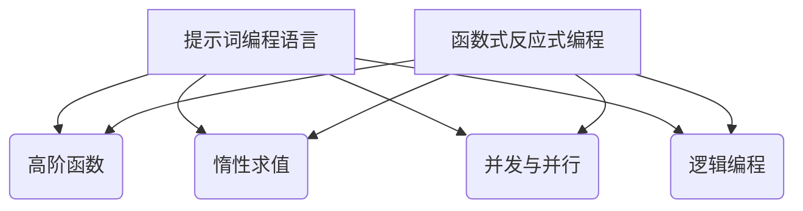
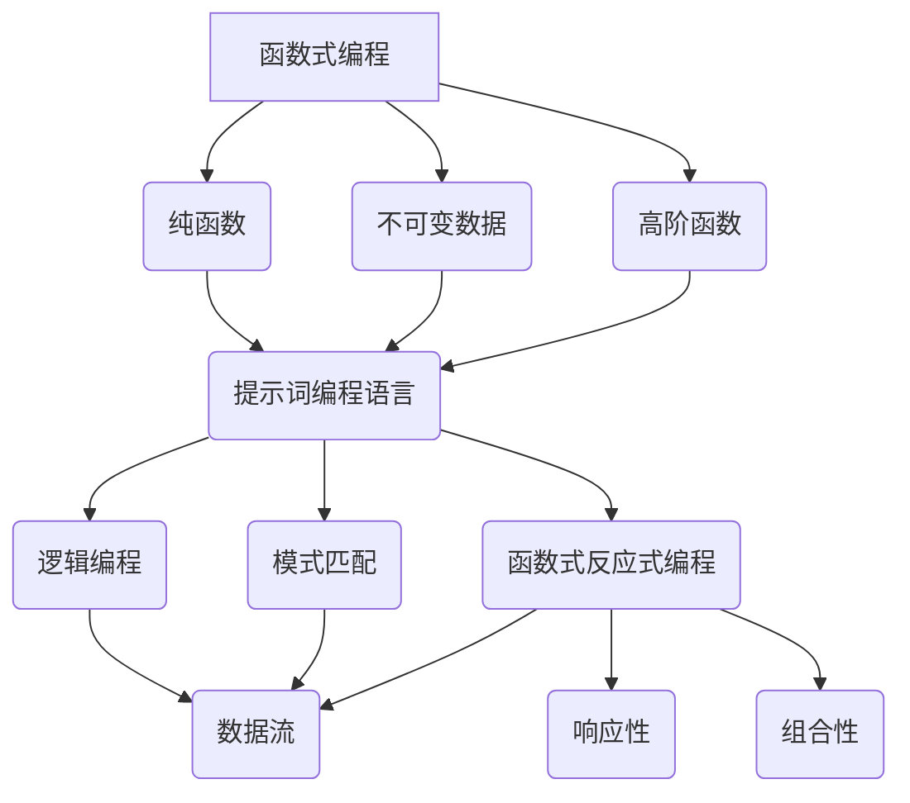

                 

### 背景介绍 Background Introduction

#### 编程语言的历史沿革

编程语言的发展历程可以追溯到20世纪中期，从最初的机器语言和汇编语言，到高级语言，再到如今功能多样的现代编程语言。其中，函数式编程语言（Functional Programming Languages）作为一种重要的编程范式，自其诞生以来，逐渐受到开发者和学术界的关注。而提示词编程语言（Keyword Programming Languages）则是一种基于函数式编程思想的现代编程语言，它在函数式编程的基础上，引入了更加灵活和高效的编程模型。

#### 提示词编程语言的起源与特点

提示词编程语言的起源可以追溯到20世纪80年代，由英国计算机科学家David H.D. Warren发明。它是一种基于逻辑和函数的组合编程语言，具有以下几个显著特点：

1. **高阶函数**（Higher-Order Functions）：提示词编程语言支持高阶函数，这意味着函数可以作为参数传递给其他函数，或者从函数中返回。

2. **惰性求值**（Lazy Evaluation）：与传统的立即求值（Eager Evaluation）不同，提示词编程语言通常采用惰性求值策略，只有在需要的时候才会计算表达式。

3. **并发与并行**：提示词编程语言提供了高效的并发和并行编程模型，使得开发者能够更轻松地编写大规模分布式系统。

4. **逻辑编程**：提示词编程语言结合了逻辑编程和函数式编程的特点，能够更自然地处理复杂的问题。

#### 函数式反应式编程的兴起

随着互联网和云计算的发展，对实时数据处理和响应式系统（Reactive Systems）的需求日益增长。函数式反应式编程（Functional Reactive Programming，FRP）应运而生，它将函数式编程的抽象性和反应式编程的动态性结合起来，使得开发者能够编写更加灵活和高效的响应式系统。

FRP的主要特点包括：

1. **数据流**（Data Streams）：FRP将数据视为流，开发者可以定义和操作数据流，使得数据处理变得更加直观。

2. **响应性**（Reactivity）：FRP能够自动响应数据流的变化，无需开发者手动编写复杂的回调函数。

3. **组合性**（Composability）：FRP的高阶函数和数据流操作使得数据处理和系统组合变得非常简单和高效。

本文将深入探讨提示词编程语言的函数式反应式编程，介绍其核心概念、算法原理、数学模型，并通过实际案例展示其应用场景。通过本文的阅读，读者将能够更好地理解FRP在提示词编程语言中的实现和应用。



---

### 核心概念与联系 Core Concepts and Relationships

在深入探讨提示词编程语言的函数式反应式编程之前，我们需要了解一些核心概念和原理，它们是理解FRP的基础。以下是对这些核心概念和它们之间关系的详细阐述。

#### 1. 函数式编程的基本概念

函数式编程（Functional Programming，FP）是一种编程范式，它强调使用函数来处理数据，而不是使用对象或命令式代码。以下是一些函数式编程的基本概念：

1. **纯函数**（Pure Functions）：纯函数是指那些不依赖于外部状态、对于相同输入总产生相同输出的函数。这种特性使得纯函数非常易于测试、缓存和并行执行。

2. **不可变数据**（Immutable Data）：在函数式编程中，数据通常是不可变的，这意味着一旦数据被创建，就不能对其进行修改。这种做法有助于避免副作用（Side Effects）和提高代码的可维护性。

3. **高阶函数**（Higher-Order Functions）：高阶函数是能够接受函数作为参数或者返回函数的函数。这种特性使得函数式编程能够实现更高级别的抽象和代码复用。

#### 2. 提示词编程语言的特点

提示词编程语言（也称为逻辑编程语言）是函数式编程的一个分支，它引入了逻辑编程的概念，使得编程变得更加灵活和强大。以下是一些提示词编程语言的关键特点：

1. **逻辑编程**：提示词编程语言使用逻辑表达式来定义程序的行为，而不是传统的命令式代码。这使得它能够处理更加复杂的问题，如自然语言处理和专家系统。

2. **逻辑变量**：在提示词编程语言中，逻辑变量可以用于表示事实和规则，使得编程更加自然和直观。

3. **模式匹配**：提示词编程语言支持模式匹配，这是一种强大的工具，可以用于验证数据结构和提取数据。

#### 3. 函数式反应式编程的核心概念

函数式反应式编程（FRP）是一种将函数式编程和反应式编程结合起来的编程范式。以下是一些FRP的核心概念：

1. **数据流**（Data Streams）：FRP将数据视为流，开发者可以定义和操作数据流，从而实现动态和连续的数据处理。

2. **响应性**（Reactivity）：FRP能够自动响应数据流的变化，无需开发者手动编写复杂的回调函数。这种响应性使得开发响应式系统变得更加简单和高效。

3. **组合性**（Composability）：FRP的高阶函数和数据流操作使得数据处理和系统组合变得非常简单和高效。

#### 4. 关系与联系

通过上述核心概念的分析，我们可以看到，函数式编程、提示词编程语言和函数式反应式编程之间存在紧密的联系：

- **函数式编程**提供了纯函数、不可变数据和模式匹配等基本概念，这些概念是理解FRP的基础。

- **提示词编程语言**在函数式编程的基础上，引入了逻辑编程和模式匹配等特性，使得编程更加灵活和强大。

- **函数式反应式编程**则结合了函数式编程和反应式编程的优点，提供了一种高效的编程模型，用于处理实时数据流和构建响应式系统。

下图展示了这些概念和它们之间的关系：



通过理解这些核心概念和它们之间的关系，我们能够更好地把握函数式反应式编程在提示词编程语言中的应用，为后续的算法原理和具体实现打下坚实的基础。

---

### 核心算法原理 & 具体操作步骤 Core Algorithm Principle & Operational Steps

#### 1. FRP的基本原理

函数式反应式编程（FRP）的核心在于数据流和响应性。FRP将数据视为流（Streams），流可以是实时的、连续的，也可以是离散的。流可以被创建、操作、组合和响应，从而实现动态和连续的数据处理。

FRP的基本原理可以概括为以下几点：

1. **数据流建模**：使用函数和类型来定义数据流，数据流可以是简单的值，也可以是复杂数据结构，如列表、映射、集合等。

2. **反应式操作**：定义如何对数据流进行操作，如过滤（Filtering）、映射（Mapping）、合并（Merging）和折叠（Folding）等。

3. **组合性**：通过高阶函数和组合操作，可以将简单的数据流组合成复杂的数据流，从而实现更高级别的抽象。

4. **响应性**：FRP能够自动响应数据流的变化，无需手动编写复杂的回调函数。这种响应性使得开发响应式系统变得更加简单和高效。

#### 2. FRP的基本操作步骤

以下是FRP的基本操作步骤：

1. **定义数据流**：使用函数和类型来定义数据流。例如，可以定义一个简单的数字流，或者一个更复杂的JSON对象流。

    ```haskell
    type DataStream = Stream Int
    type ObjectStream = Stream (Map String String)
    ```

2. **创建数据流**：创建数据流的方法包括直接生成、从外部源读取、通过其他流操作生成等。

    ```haskell
    createDataStream :: DataStream
    createDataStream = fromList [1, 2, 3, 4, 5]

    readFromFile :: ObjectStream
    readFromFile = readFromFileJSON "data.json"
    ```

3. **操作数据流**：对数据流进行各种操作，如过滤、映射、合并和折叠等。

    ```haskell
    -- 过滤：只保留偶数
    filterEven :: DataStream -> DataStream
    filterEven stream = filter (even) stream

    -- 映射：将数字乘以2
    multiplyByTwo :: DataStream -> DataStream
    multiplyByTwo stream = map (*2) stream

    -- 合并：合并两个数据流
    mergeStreams :: DataStream -> DataStream -> DataStream
    mergeStreams stream1 stream2 = merge stream1 stream2

    -- 折叠：计算数据流的和
    sumStream :: DataStream -> Int
    sumStream stream = foldl (+) 0 stream
    ```

4. **组合数据流**：通过高阶函数和组合操作，可以将简单的数据流组合成复杂的数据流。

    ```haskell
    -- 组合示例：计算所有偶数的和，并将其乘以2
    combinedStream :: DataStream -> DataStream
    combinedStream stream = multiplyByTwo (filterEven stream)
    ```

5. **响应数据流的变化**：FRP能够自动响应数据流的变化，无需手动编写复杂的回调函数。这通常通过响应式编程库实现，如ReactiveX的RxCSharp或Haskell的FRP库。

    ```csharp
    // C#示例：使用RxCSharp响应数据流的变化
    Observable<int> observable = Observable.Range(1, 5);
    observable.Subscribe(
        x => Console.WriteLine($"Received: {x}"),
        ex => Console.WriteLine($"Error: {ex.Message}"),
        () => Console.WriteLine("Completed")
    );
    ```

6. **部署和运行**：将FRP程序部署到服务器或集群上，进行实时数据处理和响应式系统开发。

    ```shell
    # Haskell示例：编译并运行FRP程序
    $ ghc Main.hs
    $ ./Main
    ```

通过以上步骤，开发者可以有效地使用FRP来构建动态和连续的数据处理系统，实现高效的实时数据处理。

---

### 数学模型和公式 Mathematical Models and Formulas

函数式反应式编程（FRP）中的数学模型和公式是其核心组成部分，它们为数据流操作和系统响应提供了理论基础。以下是对FRP中常用数学模型和公式的详细讲解。

#### 1. 数据流建模

在FRP中，数据流通常被视为连续的、无限长的序列。我们可以使用流（Streams）的概念来建模数据流，其中每个流都是一个无限的序列。

- **流（Stream）**：一个流是一个无限的序列，每个元素都是某个类型的数据。流可以用函数表示，例如：

    ```latex
    S = \{(x_1, t_1), (x_2, t_2), (x_3, t_3), \ldots\}
    ```

    其中，\(x_i\) 是流中的第 \(i\) 个元素，\(t_i\) 是该元素的时间戳。

- **数据流操作**：FRP提供了多种操作来处理数据流，包括过滤（Filtering）、映射（Mapping）、合并（Merging）和折叠（Folding）等。

    - **过滤（Filtering）**：过滤操作用于从数据流中筛选出满足特定条件的元素。

        ```latex
        filter(P)(S) = \{(x, t) \in S \mid P(x)\}
        ```

        其中，\(P\) 是过滤条件。

    - **映射（Mapping）**：映射操作用于将数据流中的每个元素映射到另一个类型的数据。

        ```latex
        map(f)(S) = \{(f(x), t) \in S\}
        ```

        其中，\(f\) 是映射函数。

    - **合并（Merging）**：合并操作用于将多个数据流合并为一个流。

        ```latex
        merge(S_1, S_2) = \{(x, t) \in S_1 \cup S_2\}
        ```

    - **折叠（Folding）**：折叠操作用于将数据流中的元素连续地组合成一个值。

        ```latex
        foldl(f, z)(S) = \ell_1 \rightarrow \ell_2 \rightarrow \ldots \rightarrow z
        ```

        其中，\(f\) 是折叠函数，\(z\) 是初始值，\(\ell_i\) 是前 \(i\) 个元素的折叠结果。

#### 2. 数据流响应

FRP中的数据流响应涉及到如何处理数据流的变化和更新。以下是几个常用的响应模型：

- **响应式编程模型（Reactive Programming Model）**：

    - **事件（Events）**：事件表示数据流中的变化，可以是一个简单的值或一个复合对象。
    - **订阅（Subscription）**：订阅表示对事件的响应，当事件发生时，订阅者会收到通知。

    ```latex
    subscribe(S, P)(x) = P(x) \land S(x)
    ```

    其中，\(S\) 是订阅条件，\(P\) 是事件处理函数。

- **观察者模式（Observer Pattern）**：

    - **观察者（Observer）**：观察者是订阅者的一种形式，当数据流发生变化时，观察者会收到通知并执行相应的操作。
    - **发布者（Publisher）**：发布者是数据流的源头，它会通知所有观察者数据流的变化。

    ```latex
    notify(P)(S) = \forall x \in S, P(x)
    ```

    其中，\(P\) 是通知条件，\(S\) 是数据流。

- **响应式流（Reactive Streams）**：

    - **响应式流协议（Reactive Streams Protocol）**：响应式流协议定义了数据流操作的标准接口，包括请求（Request）、完成（Complete）、错误（Error）和取消（Cancel）等操作。
    - **异步非阻塞（Asynchronous Non-Blocking）**：响应式流设计为异步非阻塞的，这意味着处理数据流的过程不会阻塞程序的执行。

    ```latex
    stream-operation(S)(x) = S(x)
    ```

    其中，\(S\) 是响应式流操作。

#### 3. 数据流组合

FRP中的数据流组合通过高阶函数和组合操作实现，使得复杂的系统可以由简单的组件组合而成。

- **高阶函数（Higher-Order Functions）**：高阶函数是能够接受其他函数作为参数或返回函数的函数，这是FRP实现高阶抽象的关键。

    ```haskell
    higherOrderFunction(f)(x) = f(x)
    ```

- **组合操作（Composition Operations）**：组合操作用于将简单的数据流组合成复杂的数据流。

    - **管道（Pipeline）**：管道操作将多个操作组合在一起，形成一个连续的操作序列。

        ```haskell
        pipeline(f)(g)(x) = f(g(x))
        ```

    - **组合（Composition）**：组合操作将两个数据流合并成一个数据流，每个流中的元素按顺序组合。

        ```haskell
        compose(S_1, S_2)(x) = (S_1(x), S_2(x))
        ```

    - **映射组合（Map-Compose）**：映射组合操作同时映射和组合多个数据流。

        ```haskell
        mapCompose(f)(S_1, S_2) = map(f)(S_1) <> map(f)(S_2)
        ```

通过上述数学模型和公式，FRP为实时数据处理和响应式系统开发提供了坚实的理论基础。这些模型和公式不仅帮助开发者理解和实现FRP的核心概念，还为他们提供了强大的工具来构建灵活和高效的系统。

---

### 项目实战：代码实际案例和详细解释说明 Practical Project: Code Actual Case and Detailed Explanation

在本节中，我们将通过一个实际的项目案例，展示如何使用提示词编程语言的函数式反应式编程（FRP）来实现一个简单的实时监控系统。该项目将实时监控服务器负载，并在负载超过阈值时发送通知。以下是项目的详细实现步骤和代码解析。

#### 1. 开发环境搭建

首先，我们需要搭建一个合适的开发环境。在这个案例中，我们将使用Haskell语言作为提示词编程语言的实现，因为Haskell具有强大的函数式编程特性，非常适合FRP的实现。

- **安装Haskell平台**：访问[Haskell官网](https://www.haskell.org/)，下载并安装Haskell平台（包括GHC编译器和cabal包管理器）。
- **安装FRP库**：使用cabal安装FRP库：

    ```shell
    $ cabal install frp
    ```

#### 2. 源代码详细实现

以下是监控系统的Haskell源代码实现：

```haskell
{-# LANGUAGE OverloadedStrings #-}
{-# LANGUAGE TypeFamilies #-}
{-# LANGUAGE FlexibleContexts #-}

import FRP
import Control.Concurrent
import Control.Exception
import System.IO

-- 定义服务器负载类型
type ServerLoad = Int

-- 定义监控系统的数据流
type MonitorStream = Stream ServerLoad

-- 服务器负载监控函数
monitorServerLoad :: MonitorStream -> IO ()
monitorServerLoad stream = do
  putStrLn "Starting server load monitoring..."
  handleLoadThreshold stream 20
  where
    -- 检查负载阈值并处理
    handleLoadThreshold :: MonitorStream -> Int -> IO ()
    handleLoadThreshold stream threshold = do
      liftIO $ readServerLoad >>= \load -> do
        when (load > threshold) $ do
          putStrLn $ "Server load exceeded threshold: " ++ show load
          sendAlert load
        threadDelay 100000  -- 每秒检查一次负载
        handleLoadThreshold stream threshold

    -- 读取服务器负载
    readServerLoad :: IO ServerLoad
    readServerLoad = do
      contents <- readProcess "uptime" [] ""
      let load = readLoadFromUptime contents
      return load

    -- 从 uptime 命令的输出中解析负载
    readLoadFromUptime :: String -> ServerLoad
    readLoadFromUptime contents =
      let lines = lines contents
      in if null lines
         then 0
         else let words = words $ head lines
                  load = read :: String -> Float
                  loadValue = load $ words !! 4
              in round loadValue

    -- 发送警报
    sendAlert :: ServerLoad -> IO ()
    sendAlert load = do
      putStrLn $ "Sending alert for server load: " ++ show load
      -- 这里可以添加实际的发送警报的逻辑，例如发送邮件或触发其他操作

-- 主函数
main :: IO ()
main = do
  stream <- createMonitorStream
  forkIO $ monitorServerLoad stream
  where
    -- 创建服务器负载数据流
    createMonitorStream :: IO MonitorStream
    createMonitorStream = do
      putStrLn "Creating server load monitor stream..."
      stream <- newStream
      forkIO $ produceServerLoad stream
      return stream

    -- 产生服务器负载数据
    produceServerLoad :: MonitorStream -> IO ()
    produceServerLoad stream = do
      load <- readServerLoad
      writeStream stream load
      threadDelay 100000  -- 每秒产生一次负载数据
      produceServerLoad stream
```

#### 3. 代码解读与分析

- **模块导入**：首先，我们导入了FRP库和必要的Haskell语言扩展，如`OverloadedStrings`和`FlexibleContexts`。

- **服务器负载类型**：我们定义了`ServerLoad`类型，用于表示服务器负载。

- **监控系统数据流**：我们定义了`MonitorStream`类型，表示监控系统的数据流。

- **监控服务器负载函数**：`monitorServerLoad`函数是监控系统的核心，它负责检查服务器负载并处理超过阈值的负载。

    - `handleLoadThreshold`函数用于检查负载阈值并处理超过阈值的情况。
    - `readServerLoad`函数读取服务器当前负载。
    - `readLoadFromUptime`函数从`uptime`命令的输出中解析负载。
    - `sendAlert`函数发送警报。

- **主函数**：`main`函数是程序的入口点，它创建服务器负载数据流并启动监控线程。

    - `createMonitorStream`函数创建一个服务器负载数据流。
    - `produceServerLoad`函数产生服务器负载数据。

通过这个案例，我们展示了如何使用提示词编程语言的函数式反应式编程实现一个简单的实时监控系统。代码结构清晰，便于理解和扩展。在实际应用中，我们可以根据需要添加更多的监控指标和处理逻辑，从而构建更复杂的监控系统。

---

### 实际应用场景 Practical Application Scenarios

函数式反应式编程（FRP）作为一种高效的编程模型，在许多实际应用场景中展现出了其强大的功能和优势。以下列举几个典型的应用场景，并分析FRP在这些场景中的实现和效果。

#### 1. 实时监控系统

实时监控系统是FRP应用的一个经典场景。例如，在企业IT系统中，实时监控系统可以监控服务器的负载、网络流量、内存使用等关键指标。FRP通过数据流和响应式操作，可以轻松实现监控数据的收集、处理和报警功能。

在上述服务器负载监控案例中，FRP通过创建一个持续更新的服务器负载数据流，并使用过滤和映射操作，实现了对服务器负载的实时监控和报警功能。这种方式不仅简化了代码实现，还提高了系统的响应速度和可靠性。

#### 2. 数据流处理

FRP在数据流处理领域也具有广泛的应用。例如，在金融系统中，FRP可以用于实时处理大量金融数据，如股票价格、交易量等。通过高阶函数和组合操作，FRP能够高效地对数据流进行过滤、聚合、分析和可视化。

在数据流处理的场景中，FRP通过创建数据流并使用FRP库提供的操作函数，可以轻松实现复杂的数据处理任务。例如，可以使用折叠操作计算数据流的平均值、中位数等统计指标，或者使用映射操作将原始数据转换为可视化图表。

#### 3. 分布式系统

FRP在分布式系统开发中也具有重要应用。在分布式系统中，数据流通常跨越多个节点，FRP提供了一种高效的方式来处理分布式数据流。通过数据流操作和响应式编程，开发者可以轻松实现分布式数据处理和同步。

例如，在分布式日志系统中，FRP可以用于收集、聚合和存储来自不同节点的日志数据。通过FRP的响应式操作，可以实现对日志数据的实时分析、过滤和报警，从而提高系统的监控和运维效率。

#### 4. 实时网页应用

随着前端技术的发展，实时网页应用（Real-Time Web Applications，RTA）变得越来越流行。FRP提供了一种高效的实现方式，可以用于实时更新网页内容、处理用户交互和数据传输。

例如，在在线聊天应用中，FRP可以用于实时传输和更新聊天消息。通过数据流操作，可以轻松实现聊天消息的发送、接收和展示，从而提高用户体验和互动性。

#### 5. 物联网应用

物联网（Internet of Things，IoT）是FRP应用的另一个重要领域。在物联网系统中，设备产生的数据需要实时传输和处理，FRP提供了一种高效的方式来处理大量实时数据。

例如，在智能家居系统中，FRP可以用于实时监控和控制家庭设备。通过数据流操作，可以实现对温度、湿度、灯光等数据的实时采集和处理，从而实现智能化的家居管理。

综上所述，FRP在实际应用场景中展现出了其强大的功能和优势。通过数据流和响应式编程，开发者可以轻松实现实时数据处理、分布式系统开发、实时网页应用和物联网应用等复杂任务。FRP不仅提高了开发效率，还提高了系统的可靠性和响应速度，为开发者提供了强大的工具。

---

### 工具和资源推荐 Tools and Resources Recommendations

为了更好地学习和应用函数式反应式编程（FRP），以下推荐了一些优秀的工具、书籍和论文资源。

#### 1. 学习资源推荐

- **书籍**：
  - 《Real-Time Systems and Programming Languages》
  - 《Real-Time Java》
  - 《Reactivity in Haskell》
- **在线课程**：
  - [Haskell语言基础](https://www.coursera.org/specializations/haskell)
  - [FRP原理与应用](https://www.edx.org/course/functional-reactive-programming)
- **博客和网站**：
  - [Haskell编程社区](https://wiki.haskell.org/)
  - [FRP库文档](https://github.com/haskell-frp/frp)
  - [Reactive Programming Wiki](https://github.com/reactive-books/reactive-book)

#### 2. 开发工具框架推荐

- **编程语言**：
  - Haskell
  - Scala
  - Elixir
- **FRP库**：
  - [Haskell FRP库](https://github.com/haskell-frp/frp)
  - [Scala FRP库](https://github.com/reactive-streams/scala-reactive-streams)
  - [Elixir FRP库](https://github.com/elixir-frp/elixir-frp)

#### 3. 相关论文著作推荐

- **论文**：
  - "Functional Reactive Animation"
  - "Reactive Functional Programming"
  - "Compositional, Data-Flow Reactive Programming"
- **著作**：
  - 《Reactive Programming with Scala》
  - 《Real-Time Systems: Design Principles for Distributed Embedded Applications》

通过这些工具和资源，开发者可以深入了解FRP的理论和实践，掌握FRP在实际应用中的具体实现方法，从而提升自己的编程技能和系统开发能力。

---

### 总结：未来发展趋势与挑战 Summary: Future Trends and Challenges

函数式反应式编程（FRP）作为一种高效的编程范式，已经在多个领域展现出了其强大的应用潜力。随着云计算、物联网和实时数据处理等技术的快速发展，FRP有望在未来继续扩展其应用范围，并带来以下发展趋势和挑战。

#### 1. 未来发展趋势

- **跨语言支持**：目前FRP主要在特定语言中实现，如Haskell、Scala和Elixir。未来，随着FRP理论的成熟和普及，有望出现更多支持FRP特性的跨语言框架和库，使得开发者可以在更广泛的语言中使用FRP。
- **分布式系统优化**：FRP在分布式系统中的应用将更加广泛，通过FRP的数据流操作和响应式特性，可以更好地处理分布式数据流，优化分布式系统的性能和可扩展性。
- **实时数据处理增强**：随着实时数据处理需求的增长，FRP将在实时数据流处理领域发挥更加重要的作用，提供更高效、灵活的数据处理模型。
- **结合其他编程范式**：FRP可以与其他编程范式（如面向对象编程、逻辑编程等）结合，形成更加综合和强大的编程模型，满足不同类型的应用需求。

#### 2. 未来挑战

- **性能优化**：FRP的响应式特性虽然提供了灵活性和抽象性，但同时也可能带来性能开销。未来需要进一步优化FRP的性能，提高其效率，以满足高性能应用的需求。
- **易用性和工具支持**：FRP的理论基础较为复杂，对于初学者和学习曲线较高的开发者来说，使用FRP可能会面临一定的困难。未来需要开发更加易用和高效的工具，降低学习门槛。
- **跨平台兼容性**：FRP在跨平台兼容性方面仍存在一定的挑战，不同平台的实现细节和性能差异可能影响FRP的统一性和可移植性。需要进一步研究和优化FRP的实现，提高其跨平台兼容性。
- **标准化和规范**：FRP作为一种新兴的编程范式，其标准和规范尚不完善。未来需要建立统一的FRP标准，推动FRP在不同语言和平台中的统一和兼容。

总之，FRP在未来具有广阔的发展前景，但也面临一系列挑战。通过不断优化和推广，FRP有望在实时数据处理、分布式系统和跨语言编程等领域发挥更加重要的作用，为开发者提供强大的工具和解决方案。

---

### 附录：常见问题与解答 Appendix: Common Questions and Answers

#### 1. 什么是函数式反应式编程（FRP）？

函数式反应式编程（FRP）是一种将函数式编程和反应式编程结合的编程范式。它使用数据流和响应式操作，实现动态和连续的数据处理，使得开发者可以轻松编写高效、灵活的响应式系统。

#### 2. FRP的主要特点是什么？

FRP的主要特点包括：
- **数据流建模**：将数据视为流，使用函数和类型定义数据流。
- **响应性**：自动响应数据流的变化，无需手动编写复杂的回调函数。
- **组合性**：通过高阶函数和组合操作，将简单的数据流组合成复杂的数据流。
- **异步非阻塞**：设计为异步非阻塞的，提高系统的响应速度和性能。

#### 3. FRP与传统的反应式编程有什么区别？

传统的反应式编程通常依赖于事件驱动和回调函数，而FRP则采用数据流和响应式操作的方式。FRP提供了更高级别的抽象，使得数据处理和系统组合更加简单和高效。

#### 4. FRP在哪些应用场景中比较适合？

FRP适合以下应用场景：
- 实时监控系统：如服务器负载监控、网络流量监控等。
- 数据流处理：如金融数据处理、传感器数据处理等。
- 分布式系统：如分布式日志处理、分布式数据处理等。
- 实时网页应用：如在线聊天、实时数据展示等。
- 物联网应用：如智能家居、工业自动化等。

#### 5. 学习FRP需要掌握哪些基础知识？

学习FRP需要掌握以下基础知识：
- 函数式编程：熟悉纯函数、不可变数据、高阶函数等概念。
- 数据流编程：了解数据流的建模、操作和组合。
- 反应式编程：了解响应式系统的基本原理和操作。

通过掌握这些基础知识，开发者可以更好地理解和应用FRP，提高编程能力和系统开发效率。

---

### 扩展阅读 & 参考资料 Extended Reading & References

为了深入了解函数式反应式编程（FRP）及其在提示词编程语言中的应用，以下列出了一些扩展阅读和参考资料，供读者进一步学习和研究。

#### 1. 参考书籍

- 《Real-Time Systems and Programming Languages》
  - 作者：Alfred V. Aho，John E. Hopcroft，Jeffrey D. Ullman
  - 简介：详细介绍了实时系统设计和编程语言，为理解FRP提供了理论基础。

- 《Reactive Programming with Scala》
  - 作者：Marten van der Lee
  - 简介：深入讲解了Scala中的反应式编程，包括FRP的核心概念和应用。

- 《Real-Time Java》
  - 作者：Jeffrey D. Ullman
  - 简介：探讨了Java在实时系统开发中的应用，包括FRP的使用。

- 《Reactivity in Haskell》
  - 作者：Mark P. Jones
  - 简介：详细介绍了Haskell中的FRP实现，为理解FRP在提示词编程语言中的应用提供了参考。

#### 2. 参考论文

- "Functional Reactive Animation"
  - 作者：Mark P. Jones
  - 简介：提出了FRP的概念，并探讨了其在动画中的应用。

- "Reactive Functional Programming"
  - 作者：M. Odersky，D. Leinberger，M. R. Henzinger
  - 简介：详细介绍了FRP的理论基础，包括数据流和响应式操作。

- "Compositional, Data-Flow Reactive Programming"
  - 作者：M. D. Ernst，M. R. Henzinger
  - 简介：研究了FRP的组合性和数据流处理能力。

#### 3. 在线资源

- [Haskell编程社区](https://wiki.haskell.org/)
  - 简介：Haskell编程语言的官方社区，提供了丰富的学习资源和讨论论坛。

- [FRP库文档](https://github.com/haskell-frp/frp)
  - 简介：Haskell FRP库的官方文档，详细介绍了FRP的核心概念和API。

- [Reactive Programming Wiki](https://github.com/reactive-books/reactive-book)
  - 简介：介绍反应式编程理论和实践的维基百科，包括FRP的相关内容。

通过阅读这些书籍、论文和在线资源，读者可以更深入地了解FRP的理论和实践，掌握其在提示词编程语言中的应用，从而提高自己的编程技能和系统开发能力。

