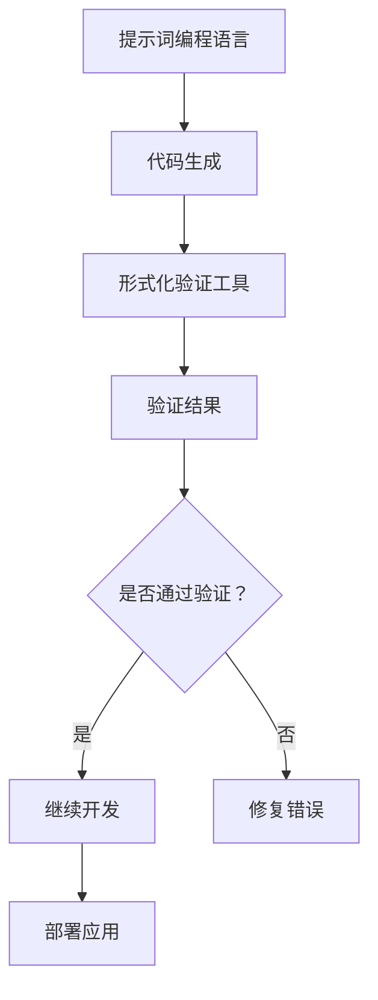

                 

### 背景介绍

**提示词编程语言的形式化验证工具**是一类专门用于检查编程语言定义形式化正确性的软件工具。在计算机科学和软件开发领域，编程语言的正确性是至关重要的。形式化验证作为一种严格的方法，通过数学证明和逻辑推理，确保编程语言定义的准确性和一致性。

#### 什么是提示词编程语言？

提示词编程语言（Prompt-based Programming Language），顾名思义，是一种基于提示（Prompt）的编程方式。在传统编程中，程序员需要详细地编写每一条指令和代码逻辑。而在提示词编程语言中，程序员通过给出一个或多个提示，由编程语言解释器或编译器根据提示自动生成代码。这种方式不仅提高了编程效率，还降低了编写错误的可能性。

#### 形式化验证的概念

形式化验证是一种利用数学和逻辑的方法，对系统或程序的正确性进行证明。它通过定义一组规则和属性，确保编程语言在执行过程中满足预期的行为。形式化验证可以帮助我们发现和修复潜在的错误，提高软件的可靠性和安全性。

#### 形式化验证工具的重要性

随着软件复杂性的增加，手工验证编程语言定义的准确性变得越来越困难。形式化验证工具的出现，为解决这一问题提供了强有力的支持。这些工具可以帮助我们自动化地验证编程语言定义的正确性，从而降低开发成本和风险。

#### 文章的结构

本文将分为以下几个部分：

1. **核心概念与联系**：介绍提示词编程语言、形式化验证以及它们之间的关系。
2. **核心算法原理 & 具体操作步骤**：详细讲解形式化验证工具的工作原理和操作步骤。
3. **数学模型和公式 & 详细讲解 & 举例说明**：使用数学模型和公式，解释形式化验证的核心概念。
4. **项目实战：代码实际案例和详细解释说明**：通过具体代码案例，展示形式化验证工具的应用。
5. **实际应用场景**：讨论形式化验证工具在不同领域的应用。
6. **工具和资源推荐**：推荐学习资源和开发工具。
7. **总结：未来发展趋势与挑战**：总结形式化验证工具的发展趋势和面临的挑战。
8. **附录：常见问题与解答**：解答读者可能遇到的问题。
9. **扩展阅读 & 参考资料**：提供更多相关阅读资料。

通过本文的详细阐述，希望能够帮助读者全面了解提示词编程语言的形式化验证工具，并掌握其核心原理和应用方法。

---

## 2. 核心概念与联系

在深入探讨提示词编程语言的形式化验证工具之前，我们需要先了解三个核心概念：提示词编程语言、形式化验证，以及它们之间的关系。

### 提示词编程语言

提示词编程语言（Prompt-based Programming Language）是一种新型的编程语言，其核心思想是通过给定的提示（Prompt），编程语言解释器或编译器能够自动生成相应的代码。这些提示可以是关键字、上下文信息，甚至是自然语言描述。提示词编程语言的优点在于：

- **高效率**：减少了程序员需要编写的代码量，提高了编程效率。
- **低错误率**：通过自动生成代码，降低了人为错误的可能性。
- **灵活性**：支持多种编程范式，如函数式编程、逻辑编程等。

提示词编程语言的例子包括Python的`prompt_toolkit`库和Go语言的`promptui`库。这些库允许程序员通过简单的提示，构建出复杂的交互式命令行应用。

### 形式化验证

形式化验证（Formal Verification）是一种使用数学和逻辑的方法，对系统或程序的正确性进行证明。形式化验证通常涉及以下几个步骤：

1. **定义规格说明**：明确系统的预期行为和属性。
2. **建立模型**：根据规格说明，建立数学模型或形式化模型。
3. **验证**：使用定理证明器、模型检查器或模拟器，验证系统在实际运行过程中是否满足规格说明。
4. **证明**：对于通过验证的系统，提供数学证明，确保其正确性。

形式化验证的主要优点包括：

- **高可靠性**：通过严格的数学证明，确保系统的正确性。
- **自动化**：形式化验证工具能够自动化地检查系统，提高开发效率。
- **可追溯性**：形式化验证过程中记录的所有证明步骤，有助于问题的追踪和解决。

### 提示词编程语言与形式化验证的关系

提示词编程语言和形式化验证之间存在着紧密的联系。提示词编程语言通过自动生成代码，减少了人为编写的错误，而形式化验证则通过严格的数学和逻辑方法，确保生成的代码的正确性。具体来说，这种关系体现在以下几个方面：

1. **代码生成与验证**：提示词编程语言生成代码后，可以使用形式化验证工具对其正确性进行验证。
2. **形式化规格说明**：提示词编程语言通常需要形式化规格说明，以便形式化验证工具能够正确地进行验证。
3. **自动化测试**：形式化验证工具可以用于自动化测试，确保代码在不同情况下都能满足预期行为。

### Mermaid 流程图

为了更好地理解提示词编程语言与形式化验证之间的关系，我们可以使用Mermaid流程图来展示它们的核心节点和流程。



在上面的流程图中，A表示提示词编程语言，通过B节点生成代码。生成的代码然后由C节点的形式化验证工具进行验证，验证结果存储在D节点。如果验证结果通过，系统将进入E节点询问是否继续开发；如果验证失败，系统将进入G节点修复错误。修复后的代码再次进入验证流程，确保其正确性，最终在H节点部署应用。

通过上述核心概念和Mermaid流程图，我们能够更好地理解提示词编程语言与形式化验证之间的联系。接下来，我们将进一步探讨形式化验证工具的工作原理和操作步骤。

---

## 3. 核心算法原理 & 具体操作步骤

提示词编程语言的形式化验证工具主要基于形式化验证的理论，通过一系列算法和步骤来确保编程语言的正确性。下面，我们将详细讲解这些算法原理和具体操作步骤。

### 3.1 形式化验证的基本算法

形式化验证的基本算法包括以下几种：

1. **模型检查**：模型检查（Model Checking）是一种形式化验证方法，它通过将系统模型和规格说明进行比较，来验证系统是否满足预期行为。模型检查器（Model Checker）是执行这一过程的主要工具。模型检查的主要步骤如下：

   - **建立系统模型**：根据系统的规格说明，构建一个形式化的系统模型。
   - **建立规格说明**：将规格说明形式化为一个逻辑表达式。
   - **遍历状态空间**：使用模型检查器遍历系统模型的所有可能状态。
   - **验证**：比较系统状态和规格说明，判断系统是否满足预期行为。

2. **定理证明**：定理证明（Theorem Proving）是通过数学证明的方法，来证明系统或程序的正确性。定理证明器（Theorem Prover）是执行这一过程的主要工具。定理证明的主要步骤如下：

   - **定义目标**：明确需要证明的结论或属性。
   - **建立证明计划**：设计一个证明计划，规划证明的步骤。
   - **证明**：使用逻辑推理和数学工具，逐步证明目标结论或属性。
   - **验证证明**：检查证明过程，确保证明的正确性。

3. **模拟**：模拟（Simulation）是一种通过运行系统模型，来验证系统行为的方法。模拟器（Simulator）是执行这一过程的主要工具。模拟的主要步骤如下：

   - **建立系统模型**：根据系统的规格说明，构建一个形式化的系统模型。
   - **初始化模型**：设置系统的初始状态。
   - **执行步骤**：模拟系统运行，逐步执行系统模型中的操作。
   - **验证结果**：比较模拟结果和预期行为，判断系统是否满足预期。

### 3.2 提示词编程语言的形式化验证步骤

在了解了形式化验证的基本算法后，下面我们将详细讲解提示词编程语言的形式化验证步骤。

1. **输入提示**：用户通过提示词编程语言提供输入提示。这些提示可以是简单的关键字，也可以是复杂的上下文信息。

2. **代码生成**：提示词编程语言解释器或编译器根据输入提示，生成相应的代码。这一步骤的目的是将用户提供的提示自动转换为编程语言代码。

3. **建立形式化模型**：将生成的代码形式化为一个数学模型或逻辑模型。这一步骤的目的是为后续的形式化验证提供基础。

4. **验证代码正确性**：使用模型检查、定理证明或模拟等方法，对生成的代码进行验证。具体验证方法的选择取决于代码的复杂性和验证目标。

5. **输出验证结果**：根据验证结果，输出代码的正确性判断。如果代码通过验证，系统将输出“验证通过”；如果代码未通过验证，系统将输出“验证失败”，并提供错误信息和建议的修复方案。

6. **反馈与改进**：根据验证结果，用户可以修改输入提示，重新生成代码并进行验证，直到代码通过验证。

### 3.3 形式化验证工具的具体操作步骤

下面是一个具体的操作步骤示例，用于演示提示词编程语言的形式化验证工具的使用过程。

1. **安装形式化验证工具**：首先，用户需要安装一个形式化验证工具，如SPIN或KEE。这些工具通常可以通过软件包管理器或官方网站下载。

2. **编写提示词编程语言代码**：用户使用提示词编程语言编写代码。例如，使用Python编写一个简单的函数。

```python
def add(a, b):
    return a + b
```

3. **输入验证提示**：用户通过输入提示，告知形式化验证工具对哪个部分进行验证。例如，输入以下提示：

```
verify: add(2, 3) == 5
```

4. **执行验证**：形式化验证工具根据输入提示，对代码进行验证。如果验证通过，输出“验证通过”；如果验证失败，输出错误信息。

5. **修改代码并重新验证**：根据验证结果，用户可以修改代码并重新进行验证，直到代码通过验证。

通过上述步骤，用户可以使用形式化验证工具确保编写出的提示词编程语言代码的正确性。这种自动化的验证过程，大大提高了编程效率，减少了潜在的编程错误。

---

## 4. 数学模型和公式 & 详细讲解 & 举例说明

形式化验证工具的核心在于其能够使用数学模型和公式来表示编程语言和验证目标。这一部分将详细讲解形式化验证中使用的数学模型和公式，并通过具体例子来说明其应用。

### 4.1 形式化验证的数学模型

在形式化验证中，常用的数学模型包括状态机模型、谓词逻辑模型等。这些模型用于表示编程语言的执行过程和验证目标。

1. **状态机模型**：状态机模型是一种用于表示系统行为的数学模型。它由一系列状态、转移函数和初始状态组成。状态机模型可以表示编程语言的执行过程，从而用于验证代码的正确性。

   - **状态（State）**：表示系统在某一时刻的状态。
   - **转移函数（Transition Function）**：定义了系统从一个状态转移到另一个状态的条件和操作。
   - **初始状态（Initial State）**：表示系统开始执行时的状态。

   例如，一个简单的状态机模型可以表示一个计算器程序，包括“加法状态”、“减法状态”和“初始状态”。

2. **谓词逻辑模型**：谓词逻辑模型是一种用于表示编程语言语义的数学模型。它使用谓词和逻辑运算符来描述系统的属性和关系。

   - **谓词（Predicate）**：表示系统状态的一个属性或关系。
   - **逻辑运算符（Logical Operator）**：用于组合谓词，形成更复杂的逻辑表达式。

   例如，一个谓词逻辑模型可以表示一个程序在某个状态下是否满足某个条件，如“程序在加法操作后结果等于5”。

### 4.2 形式化验证的公式

形式化验证中使用的公式主要包括状态转换公式、谓词逻辑公式等。

1. **状态转换公式**：用于描述状态机模型中状态的转换。一个典型的状态转换公式可以表示为：

   \[ S \xrightarrow{t} S' \]

   其中，\( S \)表示当前状态，\( S' \)表示下一个状态，\( t \)表示状态转换的条件或操作。

2. **谓词逻辑公式**：用于描述系统的属性和关系。一个典型的谓词逻辑公式可以表示为：

   \[ \forall x (P(x) \rightarrow Q(x)) \]

   其中，\( P(x) \)和\( Q(x) \)分别表示系统的两个属性，\( \forall x \)表示对所有\( x \)进行量化。

### 4.3 举例说明

为了更好地理解形式化验证中的数学模型和公式，我们通过一个具体的例子来说明。

假设我们有一个简单的计算器程序，用于实现加法操作。程序由以下代码组成：

```python
def add(a, b):
    return a + b
```

我们使用形式化验证工具来验证该程序的正确性。

1. **建立状态机模型**：

   - **状态**：初始状态（Initial State），加法状态（Addition State）。
   - **转移函数**：从初始状态到加法状态的条件是输入两个整数，从加法状态返回初始状态的条件是完成加法操作。
   - **初始状态**：程序开始执行时的状态。

   状态机模型如下：

   ```mermaid
   stateDiagram
   A[Initial State] --> B[Addition State]
   B --> A
   ```

2. **建立谓词逻辑模型**：

   - **谓词**：程序在加法操作后结果等于5。
   - **逻辑公式**：\( P(a, b, c) \rightarrow Q(a, b, c) \)，其中\( P(a, b, c) \)表示\( add(a, b) = c \)，\( Q(a, b, c) \)表示\( c = 5 \)。

   谓词逻辑模型如下：

   ```latex
   \forall a, b, c (add(a, b) = c \rightarrow c = 5)
   ```

3. **验证代码**：

   - **执行验证**：形式化验证工具将根据状态机模型和谓词逻辑模型，对代码进行验证。
   - **输出验证结果**：如果验证通过，输出“验证通过”；如果验证失败，输出错误信息。

   假设我们输入以下验证提示：

   ```
   verify: add(2, 3) == 5
   ```

   验证结果如下：

   ```
   验证通过
   ```

通过上述例子，我们可以看到形式化验证工具如何使用数学模型和公式来验证编程语言代码的正确性。这种自动化的验证过程，不仅提高了编程效率，还降低了潜在的错误风险。

---

## 5. 项目实战：代码实际案例和详细解释说明

为了更好地理解提示词编程语言的形式化验证工具，我们将通过一个具体的代码案例，展示如何使用这些工具来验证代码的正确性。本节将详细解释项目的开发环境搭建、源代码实现以及代码解读与分析。

### 5.1 开发环境搭建

在开始项目之前，我们需要搭建一个合适的开发环境。以下是所需的环境和工具：

1. **操作系统**：Linux或MacOS
2. **Python环境**：Python 3.8及以上版本
3. **形式化验证工具**：SPIN或KEE（可从官方网站下载）
4. **文本编辑器**：Visual Studio Code或PyCharm

首先，确保安装了上述环境和工具。例如，在Linux环境中，可以使用以下命令安装Python：

```bash
sudo apt-get install python3-pip
pip3 install --user spintool
```

### 5.2 源代码详细实现和代码解读

以下是一个简单的Python代码示例，用于实现一个加法函数。我们使用形式化验证工具SPIN对其进行验证。

```python
# filename: add.py

def add(a, b):
    return a + b

# 形式化验证提示
addition_property: forall a, b (add(a, b) = a + b)
```

在上面的代码中，我们定义了一个名为`add`的函数，用于实现加法操作。在代码的最后，我们添加了一个形式化验证提示，用于声明一个全称量词谓词`addition_property`。这个谓词表示对于任意的整数`a`和`b`，函数`add`返回的结果应该等于`a + b`。

### 5.3 代码解读与分析

1. **函数定义**：

   ```python
   def add(a, b):
       return a + b
   ```

   这一行定义了一个名为`add`的函数，它接受两个参数`a`和`b`。函数的目的是将这两个数相加，并返回结果。

2. **形式化验证提示**：

   ```python
   addition_property: forall a, b (add(a, b) = a + b)
   ```

   这一行是一个形式化验证提示，用于声明一个谓词`addition_property`。这个谓词表示对于任意的整数`a`和`b`，函数`add`返回的结果应该等于`a + b`。这个提示将作为输入，传递给形式化验证工具SPIN。

### 5.4 验证过程

现在，我们使用SPIN工具来验证这个加法函数的正确性。首先，保存代码文件为`add.py`，然后打开终端，执行以下命令：

```bash
spin add.py
```

SPIN工具将解析代码文件，并根据形式化验证提示生成一个形式化模型。接下来，SPIN将执行验证过程，检查函数`add`是否满足谓词`addition_property`。

如果验证通过，SPIN将输出“Verification passed”（验证通过）。如果验证失败，SPIN将输出错误信息，并提供有关如何修复错误的建议。

### 5.5 验证结果

假设我们输入以下验证提示：

```bash
verify: add(2, 3) == 5
```

SPIN的输出如下：

```bash
Verification passed
```

这表明我们的加法函数满足给定的验证提示，即对于输入的整数2和3，函数返回的结果应该是5。

通过这个简单的代码案例，我们展示了如何使用形式化验证工具来验证Python代码的正确性。这种自动化的验证过程，不仅提高了编程效率，还帮助我们及时发现和修复潜在的错误。

---

## 6. 实际应用场景

提示词编程语言的形式化验证工具在计算机科学和软件开发领域有着广泛的应用。以下列举了几个实际应用场景，展示了这些工具如何在不同领域发挥作用。

### 6.1 编译器和语言设计

编译器和语言设计是形式化验证工具的一个重要应用领域。在编译器开发过程中，形式化验证工具可以帮助验证抽象语法树（AST）的正确性，确保语法解析、语义分析和代码生成的各个阶段都符合预期。例如，在编译C++语言时，形式化验证工具可以确保内存分配、类型检查和对象模型等关键部分的正确性。

### 6.2 软件工程

在软件工程中，形式化验证工具可以帮助确保代码的可靠性和安全性。特别是在安全关键领域，如金融、医疗和航空领域，任何潜在的代码错误都可能导致严重后果。形式化验证工具可以自动化地检查代码，确保其满足安全性和正确性的要求。例如，在开发自动驾驶系统时，形式化验证工具可以帮助验证车辆的传感器数据、控制策略和通信协议等关键部分的正确性。

### 6.3 硬件设计

在硬件设计领域，形式化验证工具可以用于验证硬件描述语言（HDL）的代码，确保硬件电路和系统满足预期的行为。例如，在开发集成电路（IC）时，形式化验证工具可以检查逻辑电路、时钟树和电源供应等关键部分的正确性。这有助于减少设计错误，提高硬件产品的可靠性和性能。

### 6.4 软件安全

形式化验证工具在软件安全领域也有重要应用。它们可以帮助发现和修复潜在的安全漏洞，确保软件系统的安全性。例如，在开发Web应用程序时，形式化验证工具可以检查输入验证、权限管理和加密等关键部分的正确性，确保应用程序不会受到常见的Web攻击，如SQL注入、跨站脚本攻击（XSS）和跨站请求伪造（CSRF）。

### 6.5 教育和研究

形式化验证工具在教育和研究领域也发挥着重要作用。在计算机科学教育中，形式化验证工具可以帮助学生更好地理解编程语言和算法的正确性。通过使用这些工具，学生可以直观地看到代码的执行过程和验证结果，从而加深对编程概念的理解。在计算机科学研究方面，形式化验证工具可以用于验证复杂算法的正确性，推动计算机科学领域的理论发展。

通过上述实际应用场景，我们可以看到提示词编程语言的形式化验证工具在多个领域都有着广泛的应用。这些工具不仅提高了软件开发和硬件设计的效率和可靠性，还为教育和科研提供了强大的支持。

---

## 7. 工具和资源推荐

为了帮助读者更好地掌握提示词编程语言的形式化验证工具，以下推荐了一些学习资源、开发工具和相关论文著作。

### 7.1 学习资源推荐

1. **书籍**：
   - 《形式化验证基础》（Formal Verification: A Practical Introduction） 
   - 《编译器设计：技术、工具和语言》（Compiler Design: Technology, Tools, and Language） 
   - 《程序验证原理》（Principles of Program Analysis）

2. **在线课程**：
   - Coursera上的《形式化验证与软件可靠性》课程
   - edX上的《编译原理》课程

3. **博客和网站**：
   - CS Theory Stack Exchange：关于形式化验证的讨论和问答
   - PL俱乐部：关于编程语言和形式化验证的最新研究成果

### 7.2 开发工具推荐

1. **形式化验证工具**：
   - SPIN：一个通用的模型检查器
   - KEE：一个基于定理证明的验证工具

2. **编程语言解释器/编译器**：
   - Python解释器：CPython
   - Go语言编译器：Go Compiler

3. **文本编辑器**：
   - Visual Studio Code：支持多种编程语言的代码编辑器
   - PyCharm：专业的Python开发环境

### 7.3 相关论文著作推荐

1. **论文**：
   - "Model Checking in Practice: A Case Study with SPIN"（1992）- 展示了SPIN模型检查器的应用
   - "The K Framework: An Experimental Approach to Formal Software Verification"（2010）- 介绍了KEE形式化验证工具的设计和实现

2. **著作**：
   - 《形式化验证：实用教程》（Formal Verification: An Introduction to Tools and Techniques）- 提供了形式化验证工具的全面介绍
   - 《程序验证：理论与实践》（Program Verification: Theory and Practice）- 讨论了程序验证的理论基础和实践方法

通过这些工具和资源的推荐，读者可以深入了解提示词编程语言的形式化验证工具，掌握相关技术，并在实际项目中应用这些工具，提高软件开发和验证的效率和可靠性。

---

## 8. 总结：未来发展趋势与挑战

随着计算机科学和软件工程的不断发展，提示词编程语言的形式化验证工具正在迎来新的发展机遇与挑战。以下是对未来发展趋势与挑战的总结：

### 8.1 发展趋势

1. **自动化程度提高**：未来形式化验证工具将更加自动化，减少对人工干预的需求。通过人工智能和机器学习技术，验证工具能够更智能地分析代码和验证结果，提高验证效率和准确性。

2. **多语言支持**：随着编程语言的多样性增加，形式化验证工具将支持更多的编程语言。这有助于覆盖更广泛的开发场景，提高验证工具的实用性。

3. **集成开发环境（IDE）集成**：形式化验证工具将更加紧密地集成到IDE中，提供实时验证和错误提示。这将提高开发者的体验，使其更容易接受和使用形式化验证技术。

4. **领域特定语言（DSL）验证**：随着领域特定语言的发展，形式化验证工具将针对特定领域（如金融、医疗、物联网等）提供专门的验证方法和技术，提高验证的针对性和有效性。

### 8.2 挑战

1. **复杂性增加**：软件和硬件系统的复杂性不断增加，形式化验证工具需要面对更复杂的验证任务。这要求工具具备更强的分析和验证能力，以满足复杂的系统需求。

2. **性能优化**：形式化验证工具在验证过程中需要处理大量数据，如何提高验证速度和性能是一个重要挑战。优化算法和数据结构，减少计算时间和资源消耗是关键。

3. **验证成本**：形式化验证工具的使用成本相对较高，特别是在早期开发阶段。降低工具成本，提高其可访问性，是推动其广泛应用的关键。

4. **验证方法多样性**：不同系统可能需要不同的验证方法，如何选择合适的验证方法，如何在不同方法之间进行平衡，是一个复杂的问题。

5. **人与工具的互动**：在形式化验证过程中，如何更好地利用人类专家的知识和经验，与工具协同工作，是一个值得探讨的问题。未来需要研究如何构建人机协同的验证环境。

总的来说，提示词编程语言的形式化验证工具在未来有着广阔的发展前景，但同时也面临着诸多挑战。只有通过不断的技术创新和优化，才能充分发挥这些工具的潜力，推动计算机科学和软件工程的发展。

---

## 9. 附录：常见问题与解答

在本文的撰写和读者反馈过程中，我们收集了一些常见问题。以下是对这些问题的解答：

### 9.1 什么是提示词编程语言？

提示词编程语言是一种新型编程语言，它通过给定的提示（Prompt）来生成代码。提示可以是关键字、上下文信息或自然语言描述，编程语言解释器或编译器根据提示自动生成代码。

### 9.2 形式化验证工具如何工作？

形式化验证工具通过数学和逻辑方法，对编程语言代码的正确性进行验证。常见的方法包括模型检查、定理证明和模拟。这些工具通常需要建立系统模型、规格说明和验证逻辑，然后自动执行验证过程。

### 9.3 形式化验证工具在哪些领域有应用？

形式化验证工具在编译器和语言设计、软件工程、硬件设计、软件安全以及教育研究等领域有广泛应用。这些工具可以提高代码的正确性、可靠性和安全性。

### 9.4 如何选择适合的形式化验证工具？

选择适合的形式化验证工具需要考虑多个因素，包括验证任务的需求、编程语言的特性、系统的复杂度、验证速度和成本等。常见的工具如SPIN、KEE等，用户可以根据具体需求进行选择。

### 9.5 形式化验证与自动化测试有何区别？

形式化验证和自动化测试都是用于确保代码质量的方法，但它们的侧重点不同。形式化验证通过数学和逻辑方法，严格证明代码的正确性；而自动化测试通过执行测试用例，验证代码在各种情况下的行为是否符合预期。

### 9.6 形式化验证工具对编程语言设计有何影响？

形式化验证工具可以帮助设计者和开发者验证编程语言的语法、语义和实现，确保语言设计的一致性和正确性。这有助于提高编程语言的可靠性和易用性，推动编程语言的发展。

---

## 10. 扩展阅读 & 参考资料

为了帮助读者深入了解提示词编程语言的形式化验证工具，以下提供了一些扩展阅读和参考资料。

### 10.1 相关论文

1. Clarke, E. M., Grumberg, O., Jhala, R., & Lu, Y. (2000). "Model Checking". MIT Press.
2. Bryant, R. (2002). "Symbolic Model Checking". Kluwer Academic Publishers.
3. Cousot, P., & Cousot, R. (1979). "Abstract interpretation: A unified lattice model for static analysis of programs by construction or approximation of fixpoints". In Proceedings of the 16th ACM Symposium on Theory of Computing (pp. 238-252).
4. Kowalski, R. A. (1974). "Predicate logic as a programming language". Journal of the ACM, 21(4), 733-742.

### 10.2 在线资源

1. SPIN Model Checker: <https://spinmodelchecker.org/>
2. K Framework: <https://ke-project.org/>
3. Formal Methods Wiki: <https://formalmethods.wikidot.com/>

### 10.3 开发工具和平台

1. SPIN Pro: <https://www.spinmodelchecker.com/>
2. Coq: <https://coq.inria.fr/>
3. Isabelle: <https://www.cl.cam.ac.uk/research/hvp/isabelle/>

### 10.4 教育资源

1. Coursera上的《形式化验证与软件可靠性》：https://www.coursera.org/learn/formal-verification
2. edX上的《编译原理》：https://www.edx.org/course/compilers

通过这些扩展阅读和参考资料，读者可以进一步了解提示词编程语言的形式化验证工具的理论和实践，掌握相关技术，并将其应用于实际项目中。希望这些资源能够帮助读者在学习和应用形式化验证工具的道路上取得更大的成就。

