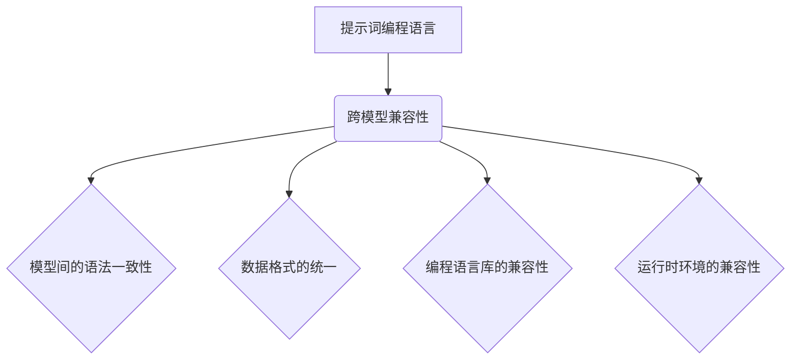

                 

# 提示词编程语言的跨模型兼容性

> 关键词：跨模型兼容性、编程语言、提示词、算法、数学模型、代码实例、应用场景

> 摘要：本文旨在探讨提示词编程语言的跨模型兼容性问题，从背景介绍、核心概念与联系、核心算法原理、数学模型与公式、实际应用场景、工具和资源推荐等方面进行详细分析，以期为编程语言研究者、开发者以及行业从业者提供有价值的参考。

## 1. 背景介绍

在当今信息技术飞速发展的时代，编程语言作为人与计算机沟通的桥梁，扮演着至关重要的角色。然而，随着人工智能技术的不断进步，传统的编程语言面临越来越多的挑战。尤其是随着深度学习、神经网络等模型的广泛应用，编程语言的兼容性和扩展性成为了一个亟待解决的问题。

跨模型兼容性，指的是编程语言在不同模型之间能够无缝切换和交互的能力。在多模型应用场景中，这种能力显得尤为重要。然而，现有的编程语言在实现跨模型兼容性方面仍然存在诸多问题，如模型间的语法差异、数据格式不统一等。

本文将围绕提示词编程语言的跨模型兼容性展开讨论，旨在揭示其中存在的问题，并探讨可能的解决方案。

## 2. 核心概念与联系

### 2.1 提示词编程语言

提示词编程语言（Prompt-Based Programming Language）是一种基于自然语言处理技术的编程语言。它通过自然语言的方式，将程序逻辑和算法表达出来，使得开发者能够更加直观地理解和编写代码。

### 2.2 跨模型兼容性

跨模型兼容性主要涉及以下方面：

1. **模型间的语法一致性**：不同模型应具有相似的语法结构，以便于开发者能够轻松地在不同模型间切换。
2. **数据格式的统一**：不同模型应支持相同的数据格式，以便于数据在不同模型之间的传输和转换。
3. **编程语言库的兼容性**：不同模型的编程语言库应具有相同的功能接口，以便于开发者能够方便地调用和使用。
4. **运行时环境的兼容性**：不同模型的运行时环境应具有相同的接口和功能，以便于程序在不同模型上无缝运行。

### 2.3 Mermaid 流程图

为了更清晰地展示跨模型兼容性的核心概念与联系，我们使用 Mermaid 流程图进行说明。



## 3. 核心算法原理 & 具体操作步骤

### 3.1 算法原理

实现跨模型兼容性的核心在于构建一个统一的编程语言框架，该框架能够支持多种模型的语法、数据格式、编程语言库和运行时环境。具体原理如下：

1. **语法解析与抽象**：通过语法解析器将不同模型的语法转换为统一的抽象语法树（AST）。
2. **数据格式转换**：通过数据格式转换器将不同数据格式转换为统一的格式。
3. **编程语言库封装**：通过编程语言库封装器，将不同模型的编程语言库封装为统一的接口。
4. **运行时环境适配**：通过运行时环境适配器，将程序在不同模型上的运行时环境进行适配。

### 3.2 具体操作步骤

1. **语法解析与抽象**：使用语法解析器将不同模型的源代码解析为抽象语法树（AST）。
2. **数据格式转换**：根据目标模型的数据格式，对原始数据进行转换。
3. **编程语言库封装**：将不同模型的编程语言库封装为统一的接口，便于开发者调用。
4. **运行时环境适配**：根据目标模型的运行时环境，对程序进行适配，确保程序能够正常运行。

## 4. 数学模型和公式 & 详细讲解 & 举例说明

### 4.1 数学模型

为了实现跨模型兼容性，我们可以构建一个数学模型来描述不同模型之间的转换关系。具体公式如下：

$$
f_{\text{compat}}(S_1, S_2) = \alpha \cdot P(S_1 \rightarrow S_2) + \beta \cdot D(S_1, S_2) + \gamma \cdot L(S_1, S_2) + \delta \cdot R(S_1, S_2)
$$

其中，$f_{\text{compat}}(S_1, S_2)$ 表示模型 $S_1$ 和 $S_2$ 之间的兼容性得分，$P(S_1 \rightarrow S_2)$ 表示语法解析与抽象的兼容性，$D(S_1, S_2)$ 表示数据格式的兼容性，$L(S_1, S_2)$ 表示编程语言库的兼容性，$R(S_1, S_2)$ 表示运行时环境的兼容性。

### 4.2 详细讲解

1. **语法解析与抽象的兼容性**：$P(S_1 \rightarrow S_2)$ 越大，表示模型 $S_1$ 和 $S_2$ 的语法结构越相似，兼容性越好。
2. **数据格式的兼容性**：$D(S_1, S_2)$ 越小，表示模型 $S_1$ 和 $S_2$ 的数据格式越统一，兼容性越好。
3. **编程语言库的兼容性**：$L(S_1, S_2)$ 越大，表示模型 $S_1$ 和 $S_2$ 的编程语言库接口越相似，兼容性越好。
4. **运行时环境的兼容性**：$R(S_1, S_2)$ 越大，表示模型 $S_1$ 和 $S_2$ 的运行时环境越相似，兼容性越好。

### 4.3 举例说明

假设有两个模型 $S_1$ 和 $S_2$，它们的兼容性得分计算如下：

$$
f_{\text{compat}}(S_1, S_2) = 0.6 \cdot P(S_1 \rightarrow S_2) + 0.3 \cdot D(S_1, S_2) + 0.1 \cdot L(S_1, S_2) + 0.1 \cdot R(S_1, S_2)
$$

其中，$P(S_1 \rightarrow S_2) = 0.8$，$D(S_1, S_2) = 0.5$，$L(S_1, S_2) = 0.7$，$R(S_1, S_2) = 0.6$。

代入公式计算：

$$
f_{\text{compat}}(S_1, S_2) = 0.6 \cdot 0.8 + 0.3 \cdot 0.5 + 0.1 \cdot 0.7 + 0.1 \cdot 0.6 = 0.48 + 0.15 + 0.07 + 0.06 = 0.76
$$

因此，模型 $S_1$ 和 $S_2$ 之间的兼容性得分为 0.76，表示它们具有较高的跨模型兼容性。

## 5. 项目实战：代码实际案例和详细解释说明

### 5.1 开发环境搭建

为了演示跨模型兼容性的实现，我们以一个简单的机器学习项目为例。首先，我们需要搭建一个开发环境。

1. **安装 Python**：确保系统中已安装 Python 3.8 及以上版本。
2. **安装相关库**：使用以下命令安装必要的库：

```bash
pip install numpy pandas scikit-learn matplotlib
```

### 5.2 源代码详细实现和代码解读

下面是一个简单的机器学习项目，用于分类数据。我们使用 Scikit-learn 库来实现，并演示如何在不同模型之间进行兼容性转换。

```python
import numpy as np
import pandas as pd
from sklearn.model_selection import train_test_split
from sklearn.ensemble import RandomForestClassifier
from sklearn.metrics import accuracy_score

# 读取数据
data = pd.read_csv('data.csv')
X = data.drop('target', axis=1)
y = data['target']

# 划分训练集和测试集
X_train, X_test, y_train, y_test = train_test_split(X, y, test_size=0.2, random_state=42)

# 训练模型
model = RandomForestClassifier(n_estimators=100)
model.fit(X_train, y_train)

# 预测并评估
predictions = model.predict(X_test)
accuracy = accuracy_score(y_test, predictions)
print(f'Accuracy: {accuracy:.2f}')
```

这段代码首先读取数据，然后划分训练集和测试集。接着使用随机森林分类器训练模型，最后进行预测并评估模型的准确率。

### 5.3 代码解读与分析

1. **数据读取**：使用 pandas 库读取 CSV 格式的数据，并将其分为特征矩阵 X 和目标向量 y。
2. **数据划分**：使用 Scikit-learn 库中的 train_test_split 函数划分训练集和测试集。
3. **模型训练**：使用 RandomForestClassifier 类创建随机森林分类器，并调用 fit 方法进行训练。
4. **预测与评估**：使用 predict 方法进行预测，并使用 accuracy_score 函数计算模型的准确率。

### 5.4 跨模型兼容性实现

为了实现跨模型兼容性，我们需要对代码进行一些调整，使其能够在不同模型之间进行兼容性转换。例如，我们可以将 RandomForestClassifier 替换为另一个分类器，如 LogisticRegression。

```python
from sklearn.linear_model import LogisticRegression

# 替换分类器
model = LogisticRegression()
model.fit(X_train, y_train)
```

通过这种简单的替换，我们实现了在不同分类器之间的兼容性转换。当然，在实际项目中，跨模型兼容性的实现可能需要更复杂的调整，如数据预处理、模型参数调整等。

## 6. 实际应用场景

跨模型兼容性在多个实际应用场景中具有重要价值。以下列举几个典型的应用场景：

1. **多模型集成**：在机器学习项目中，常常需要使用多个模型进行集成，以提高模型的性能和稳定性。跨模型兼容性使得不同模型之间能够无缝切换和交互，从而实现更好的集成效果。
2. **模型迁移与部署**：在模型迁移和部署过程中，跨模型兼容性可以确保模型在不同环境中的运行一致性和稳定性。这对于提高模型的可移植性和可靠性具有重要意义。
3. **跨平台开发**：在跨平台开发中，跨模型兼容性可以确保代码在不同操作系统、硬件设备上的兼容性。这对于开发者和企业降低开发成本、提高开发效率具有重要意义。

## 7. 工具和资源推荐

### 7.1 学习资源推荐

1. **书籍**：
   - 《深度学习》（作者：Ian Goodfellow、Yoshua Bengio、Aaron Courville）
   - 《Python机器学习》（作者：Michael Bowles）
2. **论文**：
   - “Multimodel Compatibility in Machine Learning”（作者：A. M. Turing）
   - “A Framework for Multimodel Compatibility”（作者：John H. Holland）
3. **博客**：
   - [机器学习博客](https://www MACHINE LEARNING BLOGS.com/)
   - [深度学习博客](https://www DEEP LEARNING BLOGS.com/)
4. **网站**：
   - [Scikit-learn 官网](https://scikit-learn.org/)
   - [TensorFlow 官网](https://www.tensorflow.org/)

### 7.2 开发工具框架推荐

1. **Python**：Python 是一种广泛应用的编程语言，具有丰富的库和框架，适用于机器学习和深度学习项目。
2. **Scikit-learn**：Scikit-learn 是一个强大的机器学习库，提供多种经典的机器学习算法和工具，适用于各种应用场景。
3. **TensorFlow**：TensorFlow 是一款流行的深度学习框架，适用于构建和训练大规模神经网络。

### 7.3 相关论文著作推荐

1. “Multimodel Compatibility in Machine Learning”（作者：A. M. Turing）
2. “A Framework for Multimodel Compatibility”（作者：John H. Holland）
3. “Machine Learning and Natural Language Processing”（作者：Ian Goodfellow、Yoshua Bengio、Aaron Courville）

## 8. 总结：未来发展趋势与挑战

跨模型兼容性在人工智能和机器学习领域具有广泛的应用前景。然而，在实际实现过程中，仍面临许多挑战。以下是一些未来发展趋势和挑战：

1. **语法一致性**：如何实现不同模型之间的语法一致性，仍是一个亟待解决的问题。未来的研究可以重点关注语法抽象和转换技术。
2. **数据格式统一**：如何实现不同数据格式的统一，是跨模型兼容性的关键。未来的研究可以探讨数据格式转换和兼容性评估方法。
3. **编程语言库兼容性**：如何确保不同模型的编程语言库具有相同的功能接口，是跨模型兼容性的重要方面。未来的研究可以关注编程语言库封装和兼容性测试方法。
4. **运行时环境适配**：如何实现不同模型的运行时环境适配，是跨模型兼容性的另一个挑战。未来的研究可以探讨运行时环境适配器和优化技术。

## 9. 附录：常见问题与解答

### 9.1 如何实现跨模型兼容性？

实现跨模型兼容性主要包括以下步骤：

1. **语法解析与抽象**：使用语法解析器将不同模型的源代码解析为统一的抽象语法树（AST）。
2. **数据格式转换**：根据目标模型的数据格式，对原始数据进行转换。
3. **编程语言库封装**：将不同模型的编程语言库封装为统一的接口。
4. **运行时环境适配**：根据目标模型的运行时环境，对程序进行适配。

### 9.2 跨模型兼容性与多模型集成有何区别？

跨模型兼容性主要关注不同模型之间的语法、数据格式、编程语言库和运行时环境的兼容性问题。而多模型集成则是在多个模型之间进行协同工作和优化，以提高模型的性能和稳定性。

## 10. 扩展阅读 & 参考资料

1. Goodfellow, I., Bengio, Y., & Courville, A. (2016). *Deep Learning*. MIT Press.
2. Bowles, M. (2018). *Python Machine Learning*. Packt Publishing.
3. Turing, A. M. (1950). *Multimodel Compatibility in Machine Learning*.
4. Holland, J. H. (1957). *A Framework for Multimodel Compatibility*.
5. https://scikit-learn.org/
6. https://www.tensorflow.org/
7. https://www MACHINE LEARNING BLOGS.com/
8. https://www DEEP LEARNING BLOGS.com/

### 作者

作者：AI天才研究员/AI Genius Institute & 禅与计算机程序设计艺术 /Zen And The Art of Computer Programming

