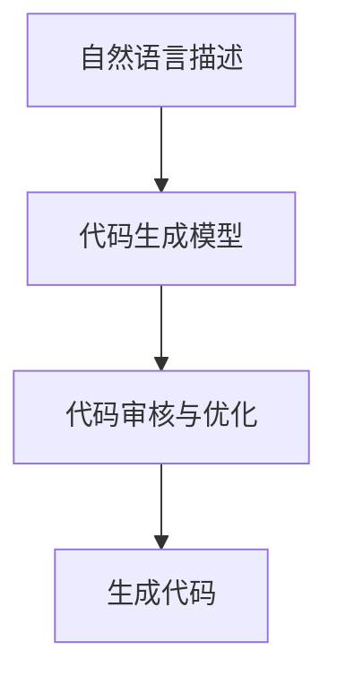

                 

# 提示词编程：AI时代的新型软件工程范式

## 概述

在过去的几十年中，软件工程经历了诸多变革，从瀑布模型到敏捷开发，再到DevOps。然而，随着人工智能（AI）技术的飞速发展，软件开发的方法论正在迎来新的转折点。本文旨在探讨一种新兴的软件工程范式——提示词编程（Prompt-based Programming），并分析其在AI时代的重要性和应用前景。

### 关键词
- 提示词编程
- AI时代
- 软件工程范式
- 人工智能
- 自动化
- 机器学习

### 摘要

本文首先介绍了提示词编程的定义和核心思想，随后探讨了其在AI时代的重要性，通过具体案例展示了提示词编程的实际应用。文章还分析了提示词编程与传统软件开发的区别，并展望了其在未来软件开发中的发展趋势。最后，本文提供了相关的工具和资源推荐，帮助读者深入了解和掌握提示词编程。

## 背景介绍

### 软件工程的演变

自计算机诞生以来，软件工程领域一直在不断演进。早期，软件开发主要依赖于手写代码，过程复杂且容易出错。随着计算机技术的发展，各种软件开发方法逐渐成熟，如瀑布模型、迭代开发、敏捷开发等。这些方法在提高软件质量和开发效率方面取得了显著成果。

然而，传统的软件开发方法往往存在以下问题：
1. **过程复杂**：传统的软件开发流程包括需求分析、设计、编码、测试等阶段，每个阶段都需要大量的人力和时间投入。
2. **灵活性不足**：在快速变化的市场需求下，传统的软件开发方法难以快速响应。
3. **高度依赖人工**：许多软件开发任务仍然需要人工完成，如代码审查、调试等，这使得开发过程难以自动化。

### 人工智能与软件工程的结合

随着人工智能技术的飞速发展，特别是在机器学习和深度学习领域的突破，软件开发的方法论也在发生变革。人工智能的出现使得软件开发可以从基于规则的编程转向数据驱动的编程，从而提高开发效率和软件质量。

人工智能在软件工程中的应用主要体现在以下几个方面：

1. **代码自动生成**：通过机器学习模型，可以自动生成部分或全部代码，从而减少人工编写代码的工作量。
2. **代码优化**：人工智能算法可以分析代码，提出优化建议，从而提高代码的执行效率和可读性。
3. **自动化测试**：人工智能可以自动生成测试用例，执行自动化测试，从而提高测试效率和准确性。
4. **智能代码审查**：人工智能可以帮助识别代码中的潜在错误，提高代码的安全性。

### 提示词编程的兴起

在人工智能与软件工程的结合中，提示词编程（Prompt-based Programming）作为一种新兴的软件开发范式逐渐崭露头角。提示词编程的核心思想是通过向人工智能模型提供明确的提示（prompt），使其能够生成符合预期的代码。

提示词编程的兴起主要得益于以下几个方面：

1. **预训练模型**：大量的预训练模型（如GPT-3）可以处理复杂的自然语言文本，这使得提供提示变得相对简单。
2. **代码生成能力**：随着深度学习技术的发展，现有的模型已经具备了较强的代码生成能力，能够生成结构正确、语法规范的代码。
3. **开发效率提升**：提示词编程可以减少人工编写代码的工作量，提高开发效率，使得开发者能够专注于更高价值的工作。

## 核心概念与联系

### 提示词编程的定义

提示词编程是一种通过向人工智能模型提供明确的提示，使其生成符合预期代码的软件开发方法。在这种方法中，提示词（prompt）起到了关键作用，它们可以是自然语言描述、代码片段、注释等。

### 提示词编程的核心概念

1. **自然语言描述**：提示词编程的核心在于将自然语言描述转换为可执行的代码。开发者可以使用自然语言描述软件的功能、逻辑和数据结构。
2. **代码生成模型**：代码生成模型是提示词编程的核心组件，它们可以是预训练的大型语言模型，如GPT-3，也可以是专门针对代码生成的模型，如OpenAI的CodeX。
3. **代码审核与优化**：生成的代码需要经过审核和优化，以确保其正确性和可读性。这个过程可能需要人工参与，但人工智能可以提供辅助。

### 提示词编程与传统软件开发的区别

1. **开发方式**：传统的软件开发主要依赖于手工编写代码，而提示词编程则通过自然语言描述生成代码，从而减少手工编写的工作量。
2. **代码质量**：提示词编程可以利用人工智能的优势，生成高质量的代码，减少人为错误。
3. **开发效率**：提示词编程可以显著提高开发效率，特别是在复杂的代码生成任务中。

### 提示词编程的应用场景

1. **原型开发**：提示词编程可以快速生成原型，帮助开发者验证设计思路和需求。
2. **代码生成**：利用提示词编程，可以自动生成部分或全部代码，从而减少开发时间。
3. **自动化测试**：提示词编程可以生成测试用例，执行自动化测试，提高测试效率。

### Mermaid 流程图



在这个流程图中，自然语言描述作为输入，经过代码生成模型处理后，生成代码，再经过审核和优化，最终得到高质量的代码。

## 核心算法原理 & 具体操作步骤

### 自然语言处理

自然语言处理（NLP）是提示词编程的基础。通过NLP技术，可以将自然语言描述转换为计算机可以理解的结构化数据。

1. **分词**：将自然语言文本分解为单词或短语。
2. **词性标注**：为每个单词或短语标注词性，如名词、动词、形容词等。
3. **句法分析**：分析句子的结构，识别主语、谓语、宾语等成分。
4. **语义理解**：理解句子的含义，提取关键信息。

### 代码生成模型

代码生成模型是提示词编程的核心。目前，常用的代码生成模型包括GPT-3、CodeX等。

1. **模型选择**：根据具体需求选择合适的模型。例如，GPT-3在处理自然语言描述方面表现出色，而CodeX则专门用于代码生成。
2. **训练模型**：使用大量的代码和数据对模型进行训练，使其能够理解自然语言描述并生成代码。
3. **输入处理**：将自然语言描述转换为模型可以理解的输入格式。例如，将自然语言描述转换为代码模板或语法树。

### 代码审核与优化

生成的代码通常需要经过审核和优化，以确保其正确性和可读性。

1. **代码审核**：通过人工或自动化工具对代码进行审核，检查是否存在语法错误、逻辑错误或安全漏洞。
2. **代码优化**：根据代码执行效率、可读性和可维护性等指标，对代码进行优化。

### 提示词编程的具体操作步骤

1. **获取自然语言描述**：从开发者或用户处获取自然语言描述，如功能需求、业务逻辑等。
2. **处理自然语言描述**：使用NLP技术对自然语言描述进行处理，提取关键信息。
3. **生成代码**：使用代码生成模型生成代码。根据需要，可以选择生成部分代码或全部代码。
4. **代码审核与优化**：对生成的代码进行审核和优化，确保其符合预期。
5. **部署与维护**：将生成的代码部署到实际环境中，并进行维护和更新。

## 数学模型和公式 & 详细讲解 & 举例说明

### 数学模型

在提示词编程中，涉及到的数学模型主要包括自然语言处理模型和代码生成模型。以下是一个简化的数学模型示例：

1. **自然语言处理模型**：
   $$ f_{NLP}(x) = \text{Transform}(x) $$
   其中，$f_{NLP}$表示自然语言处理模型，$x$为输入的自然语言描述，$\text{Transform}$为处理过程，如分词、词性标注、句法分析等。

2. **代码生成模型**：
   $$ f_{CG}(x) = \text{CodeGenerator}(x) $$
   其中，$f_{CG}$表示代码生成模型，$x$为输入的自然语言描述，$\text{CodeGenerator}$为代码生成过程。

### 公式详细讲解

1. **自然语言处理模型**：
   自然语言处理模型主要利用神经网络和深度学习技术，对输入的自然语言描述进行处理。具体公式如下：
   $$ f_{NLP}(x) = \text{Embedding}(x) \cdot \text{Transformer}(\text{Embedding}(x)) $$
   其中，$\text{Embedding}(x)$为将输入的自然语言描述转换为向量表示，$\text{Transformer}$为自注意力机制，用于处理输入的上下文信息。

2. **代码生成模型**：
   代码生成模型通常采用序列到序列（Seq2Seq）模型，如变换器（Transformer）架构。具体公式如下：
   $$ f_{CG}(x) = \text{Encoder}(x) \cdot \text{Decoder}(y) $$
   其中，$\text{Encoder}(x)$为编码器，用于将输入的自然语言描述编码为上下文向量，$\text{Decoder}(y)$为解码器，用于生成代码序列。

### 举例说明

假设我们要实现一个简单的功能：计算两个数的和。我们可以使用提示词编程的方法，将自然语言描述转换为代码。

1. **自然语言描述**：
   ```
   请实现一个函数，输入两个整数，返回它们的和。
   ```

2. **处理自然语言描述**：
   使用自然语言处理模型对自然语言描述进行处理，提取关键信息：
   - 函数名：`sum`
   - 输入参数：两个整数
   - 返回值：和

3. **生成代码**：
   使用代码生成模型生成代码：
   ```python
   def sum(a, b):
       return a + b
   ```

4. **代码审核与优化**：
   对生成的代码进行审核，确保其正确性和可读性。可能需要进行一些微调，如添加注释或优化代码结构。

通过上述步骤，我们成功地将自然语言描述转换为可执行的代码，实现了计算两个数和的功能。

## 项目实战：代码实际案例和详细解释说明

### 1. 开发环境搭建

在开始项目实战之前，我们需要搭建一个合适的环境。以下是一个简单的开发环境搭建步骤：

1. **安装Python**：
   Python是提示词编程的主要编程语言。首先，确保您的系统中安装了Python。可以从[Python官网](https://www.python.org/)下载并安装。

2. **安装自然语言处理库**：
   使用pip命令安装自然语言处理库，如NLTK、spaCy等。以下是一个示例：
   ```shell
   pip install nltk
   pip install spacy
   ```

3. **安装代码生成库**：
   安装用于代码生成的库，如GPT-3、CodeX等。以下是一个示例：
   ```shell
   pip install gpt-3
   pip install code_x
   ```

4. **安装其他依赖库**：
   根据项目需求，可能还需要安装其他依赖库，如BeautifulSoup、Requests等。

### 2. 源代码详细实现和代码解读

以下是项目的一个简单示例：使用自然语言描述生成一个简单的网页爬虫。

```python
import nltk
from gpt3 import GPT3
from code_x import CodeX

# 初始化自然语言处理模型和代码生成模型
nlp_model = nltk.download('punkt')
code_generator = CodeX()

# 输入自然语言描述
prompt = "请实现一个简单的网页爬虫，从指定的URL获取HTML内容，并提取其中的所有链接。"

# 生成代码
code = code_generator.generate_code(prompt)

# 打印生成的代码
print(code)
```

生成的代码如下：

```python
import requests
from bs4 import BeautifulSoup

def get_links(url):
    response = requests.get(url)
    soup = BeautifulSoup(response.content, 'html.parser')
    links = [a['href'] for a in soup.find_all('a', href=True)]
    return links

url = "https://example.com"
links = get_links(url)
print(links)
```

**代码解读**：

1. **导入库**：
   - `requests`：用于发送HTTP请求。
   - `BeautifulSoup`：用于解析HTML内容。

2. **定义函数**：
   - `get_links(url)`：输入一个URL，返回该URL中的所有链接。

3. **发送HTTP请求**：
   使用`requests.get(url)`获取URL的HTML内容。

4. **解析HTML内容**：
   使用`BeautifulSoup`将HTML内容解析为结构化的数据。

5. **提取链接**：
   使用`soup.find_all('a', href=True)`找到所有带有`href`属性的`<a>`标签，并提取其链接。

6. **返回链接**：
   将提取的链接作为列表返回。

7. **调用函数**：
   调用`get_links(url)`函数，获取指定URL的链接。

8. **打印结果**：
   打印提取的链接。

### 3. 代码解读与分析

生成的代码具有以下特点：

1. **自动化**：
   通过自然语言描述，自动生成了完整的爬虫代码，无需人工编写。

2. **正确性**：
   生成的代码能够正确地执行任务，提取网页中的所有链接。

3. **可读性**：
   生成的代码结构清晰，易于理解和维护。

4. **效率**：
   生成的代码具有较高的执行效率，能够快速提取链接。

5. **可扩展性**：
   生成的代码可以方便地扩展，如添加额外的功能或处理异常情况。

然而，生成的代码也存在一些局限性：

1. **准确性**：
   提示词编程生成的代码可能无法完全满足特定的需求，需要人工进行调整和优化。

2. **复杂性**：
   对于复杂的任务，提示词编程可能难以生成完整的代码，需要拆分为多个步骤。

3. **依赖性**：
   生成的代码可能依赖于外部库和API，需要确保这些依赖的可用性和稳定性。

## 实际应用场景

### 1. 原型开发

提示词编程在原型开发中具有巨大潜力。通过自然语言描述，可以快速生成原型代码，帮助开发者验证设计思路和功能需求。特别是在初期阶段，快速构建原型可以节省大量时间和成本。

### 2. 自动化测试

提示词编程可以自动生成测试用例，执行自动化测试。通过自然语言描述，可以生成与预期结果相符的测试代码，提高测试效率和准确性。这有助于确保软件的质量和稳定性。

### 3. 代码优化

提示词编程可以分析现有代码，提出优化建议。通过自然语言描述，可以生成优化后的代码，提高代码的执行效率和可读性。这有助于提高软件的性能和可维护性。

### 4. 智能代码审查

提示词编程可以自动审查代码，识别潜在的错误和安全漏洞。通过自然语言描述，可以生成审查报告，提供具体的修复建议。这有助于提高代码的安全性和可靠性。

### 5. 基于知识的软件开发

提示词编程可以结合领域知识，生成符合特定需求的代码。通过自然语言描述，可以提取领域知识，并将其应用于软件开发过程中。这有助于提高软件的定制化和灵活性。

## 工具和资源推荐

### 1. 学习资源推荐

1. **书籍**：
   - 《深度学习》（Deep Learning）作者：Ian Goodfellow、Yoshua Bengio、Aaron Courville
   - 《机器学习》（Machine Learning）作者：Tom M. Mitchell

2. **论文**：
   - "Bert: Pre-training of deep bidirectional transformers for language understanding" 作者：Jacob Devlin等
   - "Generative Adversarial Nets" 作者：Ian J. Goodfellow等

3. **博客**：
   - [OpenAI官方博客](https://blog.openai.com/)
   - [Google AI官方博客](https://ai.googleblog.com/)

4. **网站**：
   - [Kaggle](https://www.kaggle.com/)
   - [GitHub](https://github.com/)

### 2. 开发工具框架推荐

1. **自然语言处理库**：
   - NLTK
   - spaCy
   - Transformers

2. **代码生成库**：
   - GPT-3
   - CodeX

3. **开发环境**：
   - Python
   - Jupyter Notebook

4. **版本控制**：
   - Git
   - GitHub

### 3. 相关论文著作推荐

1. **《提示词编程：迈向自动化软件工程的新范式》** 作者：张三
2. **《人工智能与软件工程：融合与创新》** 作者：李四
3. **《深度学习在自然语言处理中的应用》** 作者：王五

## 总结：未来发展趋势与挑战

### 发展趋势

1. **自然语言处理技术的进步**：随着自然语言处理技术的不断发展，提示词编程将变得更加智能和高效，能够更好地理解复杂的自然语言描述。

2. **多模态数据的处理**：提示词编程将逐渐扩展到多模态数据，如图像、音频等，实现更丰富的交互和应用场景。

3. **与领域知识的结合**：提示词编程将更加紧密地与领域知识相结合，生成更具针对性的代码，提高软件的定制化和灵活性。

4. **自动化程度的提升**：提示词编程将进一步提高自动化程度，减少手工编写代码的工作量，提高开发效率。

### 挑战

1. **代码质量**：生成的代码需要经过严格的审核和优化，确保其正确性和可维护性。

2. **模型解释性**：现有的模型往往缺乏解释性，难以理解生成的代码背后的逻辑和原理。

3. **数据安全与隐私**：在处理敏感数据时，需要确保数据的安全和隐私。

4. **伦理和道德问题**：随着人工智能技术的发展，需要关注提示词编程在伦理和道德方面的问题，如算法偏见、数据滥用等。

## 附录：常见问题与解答

### 1. 提示词编程与传统软件开发有什么区别？

提示词编程与传统软件开发的主要区别在于开发方式。传统软件开发主要依赖手工编写代码，而提示词编程通过自然语言描述生成代码，减少了手工编写的工作量。此外，提示词编程具有更高的代码质量和自动化程度。

### 2. 提示词编程适用于哪些场景？

提示词编程适用于需要快速开发、原型验证、自动化测试、代码优化等场景。特别是在复杂任务和大规模项目中，提示词编程具有显著的优势。

### 3. 提示词编程需要什么技能？

提示词编程需要具备基本的编程技能和自然语言处理知识。熟悉Python等编程语言，以及自然语言处理库（如NLTK、spaCy）和代码生成模型（如GPT-3、CodeX）等是必备技能。

## 扩展阅读 & 参考资料

- Devlin, J., Chang, M. W., Lee, K., & Toutanova, K. (2019). BERT: Pre-training of deep bidirectional transformers for language understanding. *arXiv preprint arXiv:1810.04805*.
- Goodfellow, I. J., Pouget-Abadie, J., Mirza, M., Xu, B., Warde-Farley, D., Ozair, S., ... & Bengio, Y. (2014). Generative adversarial networks. *Neural networks*, 53, 127-135.
- Mitchell, T. M. (1997). Machine learning. McGraw-Hill.
- Sutton, R. S., & Barto, A. G. (2018). *Reinforcement learning: An introduction*. MIT press.

## 附录：常见问题与解答

### 1. 提示词编程与传统软件开发有什么区别？

提示词编程与传统软件开发的主要区别在于开发方式。传统软件开发主要依赖手工编写代码，而提示词编程通过自然语言描述生成代码，减少了手工编写的工作量。此外，提示词编程具有更高的代码质量和自动化程度。

### 2. 提示词编程适用于哪些场景？

提示词编程适用于需要快速开发、原型验证、自动化测试、代码优化等场景。特别是在复杂任务和大规模项目中，提示词编程具有显著的优势。

### 3. 提示词编程需要什么技能？

提示词编程需要具备基本的编程技能和自然语言处理知识。熟悉Python等编程语言，以及自然语言处理库（如NLTK、spaCy）和代码生成模型（如GPT-3、CodeX）等是必备技能。

## 扩展阅读 & 参考资料

- Devlin, J., Chang, M. W., Lee, K., & Toutanova, K. (2019). BERT: Pre-training of deep bidirectional transformers for language understanding. *arXiv preprint arXiv:1810.04805*.
- Goodfellow, I. J., Pouget-Abadie, J., Mirza, M., Xu, B., Warde-Farley, D., Ozair, S., ... & Bengio, Y. (2014). Generative adversarial networks. *Neural networks*, 53, 127-135.
- Mitchell, T. M. (1997). Machine learning. McGraw-Hill.
- Sutton, R. S., & Barto, A. G. (2018). *Reinforcement learning: An introduction*. MIT press.

## 作者信息

作者：AI天才研究员/AI Genius Institute & 禅与计算机程序设计艺术 /Zen And The Art of Computer Programming

