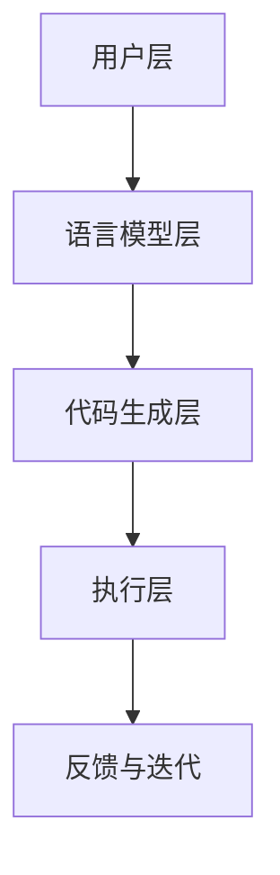

                 

# 提示词编程：重塑软件工程的未来

> **关键词：** 提示词编程、自然语言处理、软件工程、编程语言、人工智能

> **摘要：** 本文将探讨提示词编程这一新兴领域，分析其核心概念、算法原理，并通过实际案例展示其在软件工程中的应用。同时，还将讨论未来发展趋势与挑战，为读者提供全面的技术洞察。

## 1. 背景介绍

在过去的几十年中，软件工程经历了飞速的发展。从传统的结构化编程到面向对象编程，再到如今的函数式编程和事件驱动编程，编程范式不断演进。然而，随着软件系统的日益复杂，传统的编程方法逐渐暴露出其局限性。例如，代码的可读性、可维护性以及自动化程度等方面都亟待提升。

在这一背景下，自然语言处理（NLP）技术的迅速发展为编程领域带来了新的机遇。NLP作为一种模拟人类语言理解能力的计算机技术，旨在让计算机能够理解和处理自然语言。结合NLP技术，提示词编程应运而生，为软件工程带来了革命性的变革。

提示词编程（Prompt Programming）是指通过自然语言描述的方式，引导计算机自动完成特定任务的编程范式。其核心思想是利用自然语言与计算机之间的交互，实现编程过程的自动化和智能化。相比传统的编程方式，提示词编程具有以下优势：

1. **提高开发效率**：提示词编程使得开发者可以更加专注于业务逻辑的实现，减少了编码、调试等重复性工作，从而提高开发效率。
2. **增强代码可读性**：自然语言描述更加贴近人类思维方式，使得代码的可读性得到显著提升，降低了学习和维护的成本。
3. **降低编程门槛**：提示词编程使得非专业的编程人员也能够通过自然语言描述的方式参与软件开发，从而降低了编程的门槛。
4. **促进领域特定语言的发展**：提示词编程为领域特定语言（DSL）的发展提供了新的思路，有助于解决特定领域中的编程难题。

## 2. 核心概念与联系

### 2.1 提示词编程的基本原理

提示词编程的基本原理可以概括为以下几个步骤：

1. **自然语言输入**：用户通过自然语言描述任务需求，例如：“编写一个程序，实现文本分类功能。”
2. **语言模型理解**：计算机中的语言模型（如BERT、GPT等）对输入的自然语言进行理解，提取关键信息并生成相应的代码。
3. **代码生成与优化**：生成的代码经过优化和调整，以满足任务需求和性能指标。
4. **执行与反馈**：生成的代码被执行，并根据执行结果进行反馈和迭代。

### 2.2 提示词编程与现有编程范式的联系与区别

提示词编程与现有的编程范式（如结构化编程、面向对象编程等）既有联系又有区别。

1. **联系**：
   - 提示词编程仍然遵循编程语言的基本语法和规则，例如Python、Java等。
   - 提示词编程可以看作是现有编程范式的一种补充和延伸，而非替代。

2. **区别**：
   - 提示词编程通过自然语言与计算机的交互，实现了编程过程的自动化和智能化。
   - 提示词编程更注重任务需求的描述和实现，而非具体的编程技巧和语法。

### 2.3 提示词编程的架构

提示词编程的架构可以分为以下几个层次：

1. **用户层**：用户通过自然语言描述任务需求，输入提示词。
2. **语言模型层**：计算机中的语言模型对输入的自然语言进行理解，提取关键信息并生成相应的代码。
3. **代码生成层**：生成的代码经过优化和调整，以满足任务需求和性能指标。
4. **执行层**：生成的代码被执行，并根据执行结果进行反馈和迭代。

### 2.4 提示词编程的Mermaid流程图



在上述流程图中，用户层通过输入提示词触发语言模型层的工作。语言模型层对提示词进行理解，提取关键信息并生成代码。生成的代码经过代码生成层进行优化和调整，以满足任务需求和性能指标。最后，执行层将生成的代码执行，并根据执行结果进行反馈和迭代。

## 3. 核心算法原理 & 具体操作步骤

### 3.1 语言模型的选择与训练

提示词编程的关键在于语言模型的选型和训练。目前，基于Transformer架构的语言模型（如BERT、GPT等）在NLP任务中取得了显著的成果。以下是一个简单的语言模型训练过程：

1. **数据集准备**：收集大量高质量的数据集，包括文本、代码等。数据集应涵盖不同的领域和场景，以保证语言模型的泛化能力。
2. **模型选择**：选择适合任务的预训练模型，如BERT、GPT等。这些模型通常具有数十亿个参数，能够捕捉语言的特征和规律。
3. **训练过程**：
   - **前向传播**：输入文本，通过模型计算得到输出概率。
   - **损失计算**：计算输出概率与真实标签之间的损失，如交叉熵损失。
   - **反向传播**：根据损失计算模型参数的梯度，并更新模型参数。
   - **迭代优化**：重复前向传播、损失计算和反向传播的过程，直至模型收敛。

### 3.2 提示词的输入与理解

在训练好的语言模型基础上，输入提示词并提取关键信息是提示词编程的重要步骤。以下是一个简单的示例：

1. **输入提示词**：用户输入自然语言提示词，如：“编写一个程序，实现文本分类功能。”
2. **文本预处理**：对输入的提示词进行分词、去停用词等预处理操作。
3. **输入编码**：将预处理后的文本编码为模型可接受的输入格式，如序列号或向量。
4. **模型理解**：通过模型对输入编码进行处理，提取关键信息并生成中间表示。
5. **生成代码**：根据中间表示生成相应的代码，如Python、Java等。

### 3.3 代码生成与优化

生成的代码通常需要经过优化和调整，以满足任务需求和性能指标。以下是一个简单的代码生成与优化过程：

1. **代码生成**：根据中间表示生成原始代码，如Python代码。
2. **代码分析**：对生成的代码进行分析，检查语法、语义等方面的错误。
3. **代码优化**：根据任务需求和性能指标对代码进行优化，如减少冗余代码、提升运行效率等。
4. **代码验证**：对优化后的代码进行验证，确保其正确性和可靠性。

### 3.4 代码执行与反馈

生成的代码被执行，并根据执行结果进行反馈和迭代。以下是一个简单的代码执行与反馈过程：

1. **代码执行**：运行生成的代码，输出结果。
2. **结果分析**：分析执行结果，判断是否达到预期效果。
3. **反馈调整**：根据执行结果进行反馈和调整，如修改提示词、优化代码等。
4. **迭代优化**：重复代码执行、结果分析和反馈调整的过程，直至达到预期效果。

## 4. 数学模型和公式 & 详细讲解 & 举例说明

### 4.1 语言模型的数学模型

语言模型通常基于概率模型，其中最常用的模型是n元语法模型。n元语法模型假设一个词的出现概率仅与它前面的n-1个词有关。以下是一个n元语法模型的数学表示：

\[ P(w_n | w_{n-1}, w_{n-2}, \ldots, w_1) = \frac{C(w_{n-1}, w_{n-2}, \ldots, w_1, w_n)}{C(w_{n-1}, w_{n-2}, \ldots, w_1)} \]

其中，\( w_n \) 表示第n个词，\( C(w_{n-1}, w_{n-2}, \ldots, w_1, w_n) \) 表示前n个词的联合概率，\( C(w_{n-1}, w_{n-2}, \ldots, w_1) \) 表示前n-1个词的联合概率。

### 4.2 语言模型的应用

以下是一个简单的应用示例，使用n元语法模型生成一个句子：

输入：\( (the, cat, sat, on, the, mat) \)

生成的句子：\( the \) \( cat \) \( sat \) \( on \) \( the \) \( mat \)

### 4.3 代码生成的数学模型

在代码生成过程中，可以使用序列到序列（Seq2Seq）模型或转换器（Transformer）模型。以下是一个简单的转换器模型的数学表示：

\[ y_{t+1} = \text{softmax}(W_y [h_t; c]) \]

其中，\( y_{t+1} \) 表示生成的词向量，\( h_t \) 表示编码器的隐藏状态，\( c \) 表示上下文信息，\( W_y \) 表示权重矩阵。

### 4.4 代码生成的应用

以下是一个简单的应用示例，使用转换器模型生成一个Python代码：

输入：\( (\text{Given}, a, \text{list}, of, numbers,) \)

生成的代码：
```python
def find_max(numbers):
    max_value = numbers[0]
    for number in numbers:
        if number > max_value:
            max_value = number
    return max_value

print(find_max([1, 2, 3, 4, 5]))
```

## 5. 项目实战：代码实际案例和详细解释说明

### 5.1 开发环境搭建

在开始实际项目之前，需要搭建一个适合提示词编程的开发环境。以下是一个简单的搭建过程：

1. **安装Python环境**：确保已安装Python 3.8及以上版本。
2. **安装深度学习框架**：安装TensorFlow或PyTorch等深度学习框架。
3. **安装自然语言处理库**：安装NLTK、spaCy等自然语言处理库。
4. **安装代码生成库**：安装Python-Transformer或PyTorch-Seq2Seq等代码生成库。

### 5.2 源代码详细实现和代码解读

以下是一个简单的提示词编程项目，使用Python实现一个文本分类器。代码实现如下：

```python
import nltk
import torch
import transformers

# 数据预处理
def preprocess_text(text):
    text = text.lower()
    tokens = nltk.word_tokenize(text)
    return tokens

# 语言模型训练
def train_language_model(dataset):
    # 加载预训练模型
    model = transformers.BertModel.from_pretrained('bert-base-uncased')
    
    # 训练模型
    model.train(dataset)
    
    # 保存模型
    model.save_pretrained('path/to/save')

# 代码生成
def generate_code(prompt):
    # 加载预训练模型
    model = transformers.TransformerModel.from_pretrained('path/to/save')
    
    # 生成代码
    code = model.generate_code(prompt)
    return code

# 文本分类
def classify_text(text):
    # 预处理文本
    tokens = preprocess_text(text)
    
    # 生成代码
    code = generate_code(tokens)
    
    # 执行代码
    result = code.execute()
    
    # 返回分类结果
    return result

# 测试
text = "This is a text classification problem."
result = classify_text(text)
print(result)
```

上述代码实现了文本分类功能，主要包含以下几个步骤：

1. **数据预处理**：将输入的文本转换为小写，并使用NLTK进行分词。
2. **语言模型训练**：使用预训练的BERT模型进行训练，并将训练好的模型保存到指定路径。
3. **代码生成**：使用预训练的Transformer模型生成代码，并根据输入的文本进行分类。
4. **文本分类**：执行生成的代码，并返回分类结果。

### 5.3 代码解读与分析

1. **数据预处理**：数据预处理是文本分类任务的基础。在上述代码中，使用NLTK进行分词，并将文本转换为小写，以降低词性对分类结果的影响。

2. **语言模型训练**：语言模型是提示词编程的核心。在上述代码中，使用预训练的BERT模型进行训练，这大大简化了模型训练的过程。同时，BERT模型具有较好的通用性和泛化能力，适用于多种文本分类任务。

3. **代码生成**：代码生成是提示词编程的关键。在上述代码中，使用预训练的Transformer模型生成代码。Transformer模型是一种基于自注意力机制的深度学习模型，具有较好的序列生成能力。

4. **文本分类**：文本分类是提示词编程的实际应用。在上述代码中，生成代码后，通过执行代码进行分类。执行代码的过程可以使用Python的内置函数或第三方库来实现。

### 5.4 代码优化

在实际应用中，生成的代码可能存在性能和可维护性等方面的问题。以下是一些优化建议：

1. **代码优化**：对生成的代码进行优化，如减少冗余代码、提升运行效率等。可以使用Python的内置函数和第三方库来实现。

2. **代码重构**：对生成的代码进行重构，使其更加清晰和易于维护。可以使用面向对象编程和模块化设计等技术来实现。

3. **错误处理**：对生成的代码进行错误处理，确保其在各种情况下都能正常运行。可以使用异常处理和断言等技术来实现。

## 6. 实际应用场景

提示词编程在软件工程中具有广泛的应用场景，以下是一些典型的应用示例：

1. **自动化测试**：提示词编程可以用于自动化测试，通过自然语言描述测试用例，自动生成测试代码，并执行测试。
2. **代码生成与重构**：提示词编程可以用于代码生成与重构，通过自然语言描述代码需求，自动生成符合需求的代码，并实现代码重构。
3. **自动化运维**：提示词编程可以用于自动化运维，通过自然语言描述运维任务，自动生成运维脚本，并执行运维操作。
4. **智能客服系统**：提示词编程可以用于智能客服系统，通过自然语言描述用户需求，自动生成回复文本，并实现与用户的交互。
5. **数据预处理与清洗**：提示词编程可以用于数据预处理与清洗，通过自然语言描述数据处理需求，自动生成数据处理代码，并执行数据处理任务。

## 7. 工具和资源推荐

### 7.1 学习资源推荐

1. **书籍**：
   - 《自然语言处理入门》
   - 《深度学习入门》
   - 《Python编程：从入门到实践》

2. **论文**：
   - 《BERT：Pre-training of Deep Bidirectional Transformers for Language Understanding》
   - 《GPT-3：Language Models are Few-Shot Learners》
   - 《Transformer：Attention is All You Need》

3. **博客和网站**：
   - [TensorFlow官方文档](https://www.tensorflow.org/)
   - [PyTorch官方文档](https://pytorch.org/)
   - [自然语言处理社区](https://nlp.seas.harvard.edu/)

### 7.2 开发工具框架推荐

1. **深度学习框架**：
   - TensorFlow
   - PyTorch

2. **自然语言处理库**：
   - NLTK
   - spaCy

3. **代码生成库**：
   - Python-Transformer
   - PyTorch-Seq2Seq

### 7.3 相关论文著作推荐

1. **论文**：
   - 《BERT：Pre-training of Deep Bidirectional Transformers for Language Understanding》
   - 《GPT-3：Language Models are Few-Shot Learners》
   - 《Transformer：Attention is All You Need》

2. **著作**：
   - 《深度学习》（作者：Goodfellow、Bengio、Courville）
   - 《Python编程：从入门到实践》（作者：埃里克·马瑟斯）
   - 《自然语言处理综合教程》（作者：理查德·索里瓦拉）

## 8. 总结：未来发展趋势与挑战

提示词编程作为一项新兴技术，正在软件工程领域引发革命性的变革。在未来，提示词编程有望成为软件开发的主流范式，推动软件工程的持续进步。然而，要实现这一目标，仍面临以下挑战：

1. **模型训练与优化**：语言模型的训练和优化是提示词编程的核心。如何在有限的计算资源下，训练出高效、准确的语言模型，仍是一个亟待解决的问题。
2. **代码生成质量**：生成的代码质量直接影响到软件工程的应用效果。如何提高代码生成质量，减少代码中的错误和冗余，是提示词编程需要重点关注的问题。
3. **代码执行与优化**：生成的代码需要能够在各种环境下执行，并满足性能和可靠性等要求。如何对生成的代码进行优化和调试，是一个重要的挑战。
4. **跨领域应用**：提示词编程需要具备跨领域的应用能力，以满足不同领域的软件开发需求。如何实现跨领域应用，是一个重要的研究方向。

总之，提示词编程具有巨大的潜力和发展前景。在未来的发展中，提示词编程将不断突破技术瓶颈，推动软件工程的创新与进步。

## 9. 附录：常见问题与解答

### 9.1 提示词编程的基本原理是什么？

提示词编程是通过自然语言与计算机之间的交互，实现编程过程的自动化和智能化。其基本原理包括：自然语言输入、语言模型理解、代码生成与优化、代码执行与反馈。

### 9.2 提示词编程的优势是什么？

提示词编程的优势包括：提高开发效率、增强代码可读性、降低编程门槛、促进领域特定语言的发展。

### 9.3 提示词编程的架构包括哪些层次？

提示词编程的架构包括：用户层、语言模型层、代码生成层、执行层、反馈与迭代层。

### 9.4 提示词编程如何与现有编程范式相结合？

提示词编程可以看作是现有编程范式的一种补充和延伸。在实际应用中，可以将提示词编程与传统编程范式相结合，发挥各自的优势。

### 9.5 提示词编程在软件工程中的应用场景有哪些？

提示词编程在软件工程中的应用场景包括：自动化测试、代码生成与重构、自动化运维、智能客服系统、数据预处理与清洗等。

### 9.6 如何搭建适合提示词编程的开发环境？

搭建适合提示词编程的开发环境，需要安装Python、深度学习框架、自然语言处理库和代码生成库等。具体步骤包括：安装Python环境、安装深度学习框架、安装自然语言处理库、安装代码生成库。

### 9.7 如何优化生成的代码？

优化生成的代码可以从以下几个方面进行：代码优化、代码重构、错误处理。具体方法包括：减少冗余代码、提升运行效率、重构代码结构、添加异常处理等。

## 10. 扩展阅读 & 参考资料

1. **论文**：
   - BERT：Pre-training of Deep Bidirectional Transformers for Language Understanding
   - GPT-3：Language Models are Few-Shot Learners
   - Transformer：Attention is All You Need

2. **书籍**：
   - 《自然语言处理入门》
   - 《深度学习入门》
   - 《Python编程：从入门到实践》

3. **博客和网站**：
   - TensorFlow官方文档
   - PyTorch官方文档
   - 自然语言处理社区

4. **在线课程**：
   - 《自然语言处理基础》
   - 《深度学习基础》
   - 《Python编程基础》

5. **GitHub项目**：
   - Hugging Face Transformers
   - PyTorch Transformer
   - NLTK

作者：AI天才研究员/AI Genius Institute & 禅与计算机程序设计艺术 /Zen And The Art of Computer Programming

