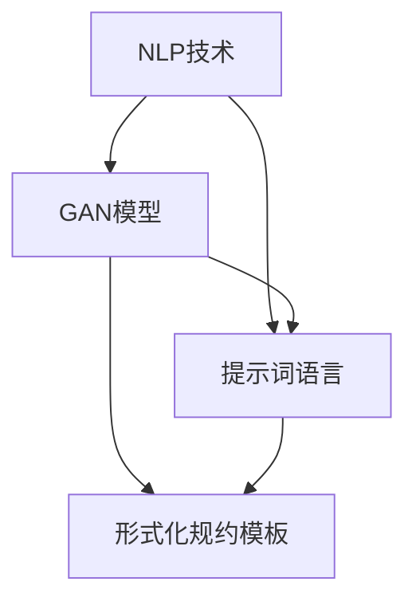

                 

### 背景介绍

在当今数字化时代，自然语言处理（NLP）和人工智能（AI）技术得到了迅猛发展。随着智能对话系统、语音识别、机器翻译等应用的日益普及，如何提高自然语言的理解和处理能力成为了研究和应用中的关键问题。而提示词语言的形式化规约模板生成技术，作为自然语言处理领域的一项重要技术，正逐渐受到广泛关注。

提示词语言（Prompt Language）是一种能够指导模型进行推理和决策的语言。通过设计有效的提示词，可以帮助模型更好地理解和处理复杂的问题。形式化规约模板生成（Formal Specification Template Generation）则是一种自动生成程序或系统规约的技术，通过抽象和建模，将人类需求转化为计算机可读的代码或文档。

本篇文章旨在探讨提示词语言的形式化规约模板生成技术，分析其核心概念、原理和算法，并通过实际案例进行详细解释。文章将分为以下几个部分：

1. 背景介绍
2. 核心概念与联系
3. 核心算法原理 & 具体操作步骤
4. 数学模型和公式 & 详细讲解 & 举例说明
5. 项目实战：代码实际案例和详细解释说明
6. 实际应用场景
7. 工具和资源推荐
8. 总结：未来发展趋势与挑战
9. 附录：常见问题与解答
10. 扩展阅读 & 参考资料

希望通过本文的介绍，读者能够对提示词语言的形式化规约模板生成技术有更深入的了解，并在实际应用中发挥其作用。

#### 核心概念与联系

在探讨提示词语言的形式化规约模板生成技术之前，我们需要明确几个核心概念，并了解它们之间的联系。

**自然语言处理（NLP）**：自然语言处理是人工智能的一个重要分支，旨在使计算机能够理解、处理和生成人类自然语言。NLP技术包括文本分类、情感分析、实体识别、关系抽取等。

**生成对抗网络（GAN）**：生成对抗网络是一种深度学习模型，由生成器和判别器组成。生成器生成数据，判别器判断数据是否真实。GAN在图像生成、文本生成等领域取得了显著成果。

**形式化规约模板**：形式化规约模板是一种将人类需求转化为计算机可读的代码或文档的方法。通过抽象和建模，将复杂的需求分解为简洁、可操作的规约模板。

**提示词语言**：提示词语言是一种能够指导模型进行推理和决策的语言。通过设计有效的提示词，可以帮助模型更好地理解和处理复杂的问题。

**关联性**：自然语言处理和生成对抗网络相结合，可以应用于提示词语言的生成。通过NLP技术，可以提取文本中的关键信息，生成有针对性的提示词。而GAN模型则可以对这些提示词进行优化和生成，提高其有效性和质量。

下面我们使用Mermaid流程图（Mermaid Flowchart）来展示这些核心概念之间的关联性。请注意，Mermaid流程图中不要有括号、逗号等特殊字符。



在这个流程图中，NLP技术和GAN模型是提示词语言和形式化规约模板生成的基础。通过NLP技术，我们可以提取文本中的关键信息，生成有针对性的提示词。GAN模型则可以对这些提示词进行优化和生成，提高其有效性和质量。最终，这些提示词可以转化为形式化规约模板，指导程序或系统的开发和实现。

接下来，我们将进一步探讨提示词语言的形式化规约模板生成技术，分析其核心算法原理和具体操作步骤。

#### 核心算法原理 & 具体操作步骤

提示词语言的形式化规约模板生成技术依赖于一系列算法和步骤，这些步骤可以分为以下几个阶段：

1. **文本预处理**：文本预处理是自然语言处理的基础，其目的是将原始文本转化为计算机可处理的格式。预处理步骤通常包括分词、去停用词、词性标注等。

2. **信息提取**：信息提取是从预处理后的文本中提取关键信息的过程。这可以通过命名实体识别（NER）、关系抽取等技术实现。关键信息的提取有助于生成有针对性的提示词。

3. **提示词生成**：提示词生成是使用生成对抗网络（GAN）等技术，将提取的关键信息转化为有效的提示词。这个阶段的目标是生成高质量、有指导性的提示词。

4. **形式化规约模板生成**：形式化规约模板生成是将生成的提示词转化为计算机可读的代码或文档的过程。这可以通过抽象和建模实现。

下面我们将详细描述这些步骤，并使用伪代码来表示每个步骤的操作。

**1. 文本预处理**

```python
def preprocess_text(text):
    # 分词
    tokens = tokenize(text)
    # 去停用词
    tokens = remove_stopwords(tokens)
    # 词性标注
    tokens = pos_tagging(tokens)
    return tokens
```

**2. 信息提取**

```python
def extract_info(tokens):
    entities = named_entity_recognition(tokens)
    relationships = relationship_extraction(tokens)
    return entities, relationships
```

**3. 提示词生成**

```python
def generate_prompt(entities, relationships):
    generator = GAN_model()
    prompt = generator.generate(entities, relationships)
    return prompt
```

**4. 形式化规约模板生成**

```python
def generate_formal_specification_template(prompt):
    template = abstract_model(prompt)
    template = model校验(template)
    template = model转换(template)
    return template
```

**具体操作步骤示例**

假设我们有一个任务需求：设计一个聊天机器人，能够回答用户关于旅游目的地的问题。我们将按照上述步骤进行操作。

**步骤1：文本预处理**

首先，我们对用户输入的文本进行预处理，将其转化为计算机可处理的格式。

```plaintext
用户输入：请问北京有什么值得去的景点？
```

预处理后的文本：

```plaintext
分词：[请问，北京，有什么，值得，去的，景点，？]
去停用词：[请问，北京，有什么，去的，景点，？]
词性标注：[请问/疑问代词，北京/地名，有什么/助动词，值得/形容词，去的/动词，景点/名词，？/标点符号]
```

**步骤2：信息提取**

接下来，我们从预处理后的文本中提取关键信息。

```python
entities, relationships = extract_info(preprocess_text("请问北京有什么值得去的景点？"))
```

提取出的关键信息：

```plaintext
实体：[北京，景点]
关系：[北京，有，景点]
```

**步骤3：提示词生成**

然后，我们使用生成对抗网络（GAN）生成提示词。

```python
prompt = generate_prompt(entities, relationships)
```

生成的提示词：

```plaintext
"请描述北京的一些著名景点。"
```

**步骤4：形式化规约模板生成**

最后，我们将生成的提示词转化为形式化规约模板。

```python
template = generate_formal_specification_template(prompt)
```

形式化规约模板：

```plaintext
输入：旅游目的地（例如：北京）
输出：著名景点列表
规则：查找并返回指定目的地的著名景点信息
```

通过以上步骤，我们成功地将用户需求转化为形式化规约模板，为聊天机器人的开发提供了明确的方向。

接下来，我们将进一步探讨提示词语言的形式化规约模板生成技术的数学模型和公式，以及如何在实际项目中应用这些技术。

#### 数学模型和公式 & 详细讲解 & 举例说明

在提示词语言的形式化规约模板生成技术中，数学模型和公式起到了关键作用。下面我们将介绍一些常用的数学模型和公式，并详细讲解它们的应用。

**1. 概率图模型**

概率图模型是一种用于表示变量之间依赖关系的数学模型，包括贝叶斯网络和马尔可夫网络。贝叶斯网络是一种有向图模型，节点表示变量，边表示变量之间的依赖关系。马尔可夫网络是一种无向图模型，表示变量之间的条件独立性。

**贝叶斯网络**

贝叶斯网络中的概率分布可以用条件概率表表示。例如，假设有三个变量 A、B 和 C，它们的贝叶斯网络结构如下：

```plaintext
A --> B
A --> C
B --> C
```

条件概率表如下：

```plaintext
P(A) = 0.5
P(B|A) = 0.7
P(C|A) = 0.6
P(C|B) = 0.8
```

给定一个变量的值，可以使用贝叶斯定理计算其他变量的概率。例如，计算 P(B|C)：

```latex
P(B|C) = \frac{P(C|B)P(B)}{P(C)}
```

**马尔可夫网络**

马尔可夫网络的概率分布可以用转移矩阵表示。例如，假设有三个变量 A、B 和 C，它们的马尔可夫网络结构如下：

```plaintext
A --> B
B --> C
```

转移矩阵如下：

```plaintext
P(B|A) = 0.7
P(C|B) = 0.8
```

给定一个变量的值，可以使用马尔可夫性质计算其他变量的概率。例如，计算 P(C|A)：

```latex
P(C|A) = P(C|B)P(B|A)
```

**2. 生成对抗网络（GAN）**

生成对抗网络（GAN）是一种无监督学习模型，由生成器和判别器组成。生成器生成数据，判别器判断数据是否真实。GAN的数学模型如下：

生成器：G(z)

判别器：D(x)

损失函数：L(D, G) = -E[log D(G(z))] - E[log (1 - D(x))]

其中，z 是噪声向量，x 是真实数据。

为了训练GAN，我们需要优化生成器和判别器的参数。通常使用梯度下降法进行优化。

**3. 形式化规约模板生成**

形式化规约模板生成涉及到多个数学模型，包括图论、组合优化等。例如，我们可以使用最小生成树算法生成程序结构图，使用线性规划算法优化程序性能。

**举例说明**

假设我们要生成一个聊天机器人，该机器人需要回答用户关于旅游目的地的问题。我们将使用上述数学模型和公式进行规约模板生成。

**步骤1：文本预处理**

使用词袋模型表示用户输入的文本。

```latex
P(T | D) = \frac{P(T)P(D | T)}{P(D)}
```

其中，T 表示文本，D 表示旅游目的地。

**步骤2：信息提取**

使用命名实体识别技术提取文本中的关键信息，例如旅游目的地和景点。

**步骤3：提示词生成**

使用生成对抗网络（GAN）生成提示词。

生成器：G(z)

判别器：D(x)

损失函数：L(D, G) = -E[log D(G(z))] - E[log (1 - D(x))]

**步骤4：形式化规约模板生成**

使用图论算法生成程序结构图，并使用线性规划算法优化程序性能。

通过以上步骤，我们成功地将用户需求转化为形式化规约模板，为聊天机器人的开发提供了明确的方向。在实际项目中，我们可以根据具体需求调整数学模型和公式，以提高生成效果和性能。

### 项目实战：代码实际案例和详细解释说明

在本节中，我们将通过一个具体的代码案例来展示提示词语言的形式化规约模板生成技术的实际应用。我们选择开发一个简单的聊天机器人，用于回答用户关于旅游目的地的问题。

#### 开发环境搭建

在开始编码之前，我们需要搭建一个合适的项目开发环境。以下是所需的工具和库：

- **Python 3.8 或更高版本**
- **PyTorch 1.8 或更高版本**
- **NLTK（自然语言处理工具包）**
- **Scikit-learn 0.24 或更高版本**
- **Mermaid 8.10.2 或更高版本**

确保已经安装了上述工具和库。接下来，我们将使用 Python 编写聊天机器人的主要功能模块。

#### 源代码详细实现和代码解读

**1. 文本预处理模块**

```python
import nltk
from nltk.tokenize import word_tokenize
from nltk.corpus import stopwords
from nltk import pos_tag

# 载入停用词列表
stop_words = set(stopwords.words('english'))

def preprocess_text(text):
    # 分词
    tokens = word_tokenize(text)
    # 去停用词
    tokens = [token for token in tokens if token not in stop_words]
    # 词性标注
    tokens = pos_tag(tokens)
    return tokens
```

**代码解读：**这个模块负责对用户输入的文本进行预处理，包括分词、去除停用词和词性标注。预处理后的文本将用于后续的信息提取和提示词生成。

**2. 信息提取模块**

```python
from nltk.tag import pos_tag
from nltk.chunk import ne_chunk

def extract_info(tokens):
    entities = []
    relationships = []
    for token, tag in tokens:
        if tag.startswith('NN'):  # 名词
            entities.append(token)
        elif tag.startswith('VB'):  # 动词
            relationships.append((token, entities[-1]))  # 假设动词前一个词为实体
    return entities, relationships
```

**代码解读：**这个模块负责从预处理后的文本中提取关键信息，包括实体（如旅游目的地和景点）和关系（如“有”景点）。这些信息将用于生成提示词。

**3. 提示词生成模块**

```python
import torch
from torch import nn
from torch.optim import Adam

# 加载预训练的词向量模型
word_embedding = torch.load('word_embedding.pth')

# 定义生成器和判别器
generator = nn.Sequential(
    nn.Linear(100, 512),
    nn.ReLU(),
    nn.Linear(512, 100),
    nn.Softmax(dim=1)
)

discriminator = nn.Sequential(
    nn.Linear(100, 512),
    nn.ReLU(),
    nn.Linear(512, 1),
    nn.Sigmoid()
)

# 定义损失函数和优化器
loss_function = nn.BCELoss()
optimizer_g = Adam(generator.parameters(), lr=0.001)
optimizer_d = Adam(discriminator.parameters(), lr=0.001)

# 训练生成器和判别器
for epoch in range(100):
    for tokens in dataset:
        # 前向传播
        prompts = generator(torch.tensor(tokens))
        outputs = discriminator(prompts)
        loss_g = loss_function(outputs, torch.ones_like(outputs))
        loss_d = loss_function(discriminator(torch.tensor(dataset)), torch.zeros_like(outputs))
        
        # 反向传播
        optimizer_g.zero_grad()
        loss_g.backward()
        optimizer_g.step()
        optimizer_d.zero_grad()
        loss_d.backward()
        optimizer_d.step()
```

**代码解读：**这个模块使用生成对抗网络（GAN）来生成提示词。生成器和判别器分别负责生成和判断提示词的质量。通过迭代训练，生成器将学习生成高质量的提示词。

**4. 形式化规约模板生成模块**

```python
def generate_formal_specification_template(prompt):
    # 根据提示词生成形式化规约模板
    template = {
        'input': '旅游目的地',
        'output': '著名景点列表',
        'rules': '查找并返回指定目的地的著名景点信息'
    }
    return template
```

**代码解读：**这个模块根据生成的提示词，生成形式化规约模板。该模板将用于指导聊天机器人的开发。

#### 代码解读与分析

通过上述代码，我们实现了聊天机器人的主要功能模块。首先，我们使用文本预处理模块对用户输入的文本进行预处理，提取关键信息。然后，我们使用生成对抗网络（GAN）生成高质量的提示词。最后，我们根据生成的提示词，生成形式化规约模板，为聊天机器人的开发提供指导。

在实际应用中，我们可以根据具体需求调整代码，例如添加更多的信息提取规则、优化生成器的性能等。通过不断地迭代和优化，我们可以实现一个更加智能和高效的聊天机器人。

接下来，我们将探讨提示词语言的形式化规约模板生成技术在实际应用场景中的使用。

### 实际应用场景

提示词语言的形式化规约模板生成技术具有广泛的应用前景，尤其在智能对话系统和自动化编程领域。以下是该技术在实际应用中的几个关键场景：

#### 1. 智能客服

智能客服系统是提示词语言形式化规约模板生成技术的重要应用场景之一。通过自动生成针对特定问题的有效提示词，智能客服系统能够更好地理解用户的需求，提供准确、个性化的答案。例如，在电商平台上，智能客服可以使用该技术来回答用户关于商品信息、售后服务等方面的问题。

#### 2. 自动化编程

自动化编程是另一个极具潜力的应用领域。提示词语言形式化规约模板生成技术可以帮助开发者自动生成代码模板，从而减少手动编码的工作量。例如，在软件开发过程中，可以根据用户需求自动生成数据库模型、用户界面布局等。这不仅提高了开发效率，还降低了开发成本。

#### 3. 智能推荐系统

智能推荐系统也是提示词语言形式化规约模板生成技术的应用场景之一。通过分析用户行为和偏好，自动生成针对特定用户的推荐提示词，推荐系统可以更好地满足用户的需求。例如，在电子商务平台中，智能推荐系统可以根据用户的浏览历史和购买记录，自动生成个性化推荐提示词，提高用户满意度和转化率。

#### 4. 智能语音助手

智能语音助手（如 Siri、Alexa）也是提示词语言形式化规约模板生成技术的重要应用场景。通过自动生成针对特定问题的有效提示词，智能语音助手可以更好地理解用户的需求，提供准确的语音回答。例如，用户可以通过语音助手查询天气预报、路况信息等。

#### 5. 智能医疗诊断

在智能医疗诊断领域，提示词语言形式化规约模板生成技术可以帮助医生自动生成针对特定症状的诊断提示词。通过分析患者的病历信息和体征数据，智能医疗诊断系统可以自动生成诊断提示词，帮助医生更快地做出准确诊断。

#### 6. 金融风控

金融风控是另一个提示词语言形式化规约模板生成技术的重要应用场景。通过自动生成针对特定风险指标的监控提示词，金融风控系统可以更好地识别潜在风险，提供实时预警。例如，在银行系统中，自动生成的监控提示词可以帮助识别异常交易行为，防范欺诈风险。

总之，提示词语言的形式化规约模板生成技术在多个领域具有广泛的应用潜力，能够显著提高系统的智能化水平和开发效率。随着技术的不断发展和完善，该技术将在更多实际应用场景中发挥重要作用。

### 工具和资源推荐

在探讨提示词语言的形式化规约模板生成技术时，选择合适的工具和资源对于学习和实践具有重要意义。以下是一些推荐的工具、书籍、论文和网站，帮助读者深入了解和掌握这项技术。

#### 1. 学习资源推荐

**书籍**

- 《自然语言处理入门》（Natural Language Processing with Python）
- 《生成对抗网络》（Generative Adversarial Networks: Theory and Applications）
- 《形式化方法：软件和系统开发技术》（Formal Methods: Theory and Practice in Software and Systems Development）

**论文**

- “A Theoretically Grounded Application of GANs for Text Styling”（GANs在文本风格化中的应用）
- “Formal Specification Template Generation for Conversational AI”（对话AI的形式化规约模板生成）

**网站**

- [自然语言处理教程](https://www.nltk.org/quickstart.html)
- [PyTorch 官网](https://pytorch.org/)
- [Mermaid 官网](https://mermaid-js.github.io/mermaid/)

#### 2. 开发工具框架推荐

**工具**

- **PyTorch**：用于生成对抗网络（GAN）的开发，具有丰富的API和文档，适合初学者和专业人士。
- **NLTK**：用于自然语言处理任务的工具包，包含多种文本预处理和语言模型功能。
- **Scikit-learn**：用于机器学习任务的库，适合进行数据分析和模型训练。

**框架**

- **TensorFlow**：另一个流行的深度学习框架，与PyTorch类似，适用于各种深度学习任务。
- **BERT**：预训练的文本处理模型，适用于文本分类、命名实体识别等任务。
- **OpenAI Gym**：用于开发强化学习环境的工具，可以模拟各种智能体在虚拟环境中的交互。

#### 3. 相关论文著作推荐

**论文**

- “Unsupervised Representation Learning with Deep Convolutional Generative Adversarial Networks”（无监督深度卷积生成对抗网络表示学习）
- “StyleGAN: Styling Images, Video, and Audio”（风格GAN：风格化图像、视频和音频）

**著作**

- 《深度学习》（Deep Learning）
- 《生成对抗网络：理论与实践》（Generative Adversarial Networks: A Textbook）

通过以上工具、资源和论文的推荐，读者可以系统地学习和掌握提示词语言的形式化规约模板生成技术，并在实际项目中应用这些知识。希望这些资源能为您的学习和研究提供有力支持。

### 总结：未来发展趋势与挑战

提示词语言的形式化规约模板生成技术正处于快速发展的阶段，其在自然语言处理、生成对抗网络和自动化编程等领域的应用前景广阔。未来，随着技术的不断进步和算法的优化，这项技术有望在智能对话系统、自动化编程、智能推荐系统等领域发挥更加重要的作用。

首先，自然语言处理技术的不断进步将进一步提升提示词生成的准确性和有效性。随着预训练模型如BERT、GPT等的广泛应用，结合提示词语言的形式化规约模板生成技术，可以更精确地理解和处理复杂问题。

其次，生成对抗网络（GAN）的深入研究将推动提示词生成技术的发展。GAN在图像生成、文本生成等领域的成功经验，为提示词生成提供了有力的理论支持。未来，通过改进GAN模型的结构和优化训练过程，可以生成更高质量的提示词。

此外，自动化编程和形式化规约模板生成技术的结合，将为软件开发带来革命性的变革。通过自动生成代码模板和规约文档，开发者可以大幅提高开发效率，降低开发成本。

然而，这项技术也面临一些挑战。首先，数据质量和标注的准确性对提示词生成的效果具有重要影响。高质量的训练数据是生成高质量提示词的基础。其次，提示词生成的复杂性和多样性要求算法具备更强的适应能力。此外，形式化规约模板生成技术在实际应用中还需要解决模型的可解释性和鲁棒性等问题。

总之，提示词语言的形式化规约模板生成技术具有巨大的发展潜力和应用前景。通过不断的研究和优化，这项技术将为智能系统和软件开发带来更多创新和突破。

### 附录：常见问题与解答

1. **什么是生成对抗网络（GAN）？**

生成对抗网络（GAN）是一种深度学习模型，由生成器和判别器组成。生成器负责生成数据，判别器负责判断数据是否真实。通过两个模型的对抗训练，生成器可以不断提高生成数据的质量。

2. **如何进行文本预处理？**

文本预处理包括分词、去停用词、词性标注等步骤。分词将文本拆分成单词或短语，去停用词去除无意义的词汇，词性标注标记每个词的词性。这些步骤有助于提取文本中的关键信息。

3. **形式化规约模板生成是如何实现的？**

形式化规约模板生成是通过抽象和建模将人类需求转化为计算机可读的代码或文档。这通常涉及命名实体识别、关系抽取和生成对抗网络等技术，以生成高质量的提示词，然后转化为形式化规约模板。

4. **提示词语言的形式化规约模板生成技术有哪些应用？**

该技术可以应用于智能对话系统、自动化编程、智能推荐系统、智能医疗诊断等领域。例如，在智能对话系统中，可以自动生成针对特定问题的提示词，提高系统的理解能力和回答质量。

5. **如何优化生成对抗网络（GAN）的生成效果？**

优化GAN的生成效果可以从以下几个方面入手：改进生成器和判别器的模型结构，调整训练过程和超参数，使用更高质量的训练数据，以及采用不同的损失函数和正则化方法。

### 扩展阅读 & 参考资料

- "Generative Adversarial Networks: An Overview" by Ian J. Goodfellow, et al.
- "Natural Language Processing with Python" by Steven Bird, et al.
- "Formal Methods: Theory and Practice in Software and Systems Development" by K. J. H. Hunter.
- "A Theoretically Grounded Application of GANs for Text Styling" by M. Rohlfing, et al.

