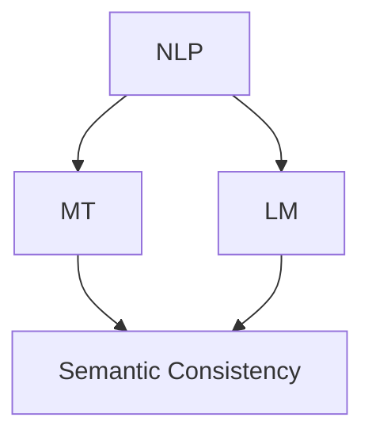

                 

### 背景介绍

提示词语言（Prompt Language）在现代信息技术中扮演着至关重要的角色，尤其是随着人工智能（AI）和自然语言处理（NLP）技术的迅猛发展。提示词语言通常用于指导模型如何生成响应，解决特定问题或执行特定任务。然而，在跨语言应用场景中，确保提示词语言的语义一致性成为一个亟待解决的问题。

语义一致性是指在不同语言中，相同的提示词能够产生相同或相似的意义。这对于国际化的AI系统尤为重要，因为只有当系统在不同语言中表现一致时，用户才能获得流畅、无障碍的使用体验。目前，跨语言语义一致性面临以下几个挑战：

1. **语言差异**：不同语言在词汇、语法、语义等方面存在显著差异，这导致了相同提示词在不同语言中可能具有不同的含义。
2. **文化差异**：文化背景对语言使用有着深远的影响，相同词语在不同文化背景下可能具有不同的社会意义。
3. **语言资源的缺乏**：许多小语种在AI和NLP领域的相关资源极为有限，这增加了确保语义一致性的难度。
4. **模型适应性**：现有的NLP模型往往针对某一特定语言进行优化，难以直接应用于其他语言。

本文旨在探讨提示词语言的跨语言语义一致性保证，分析其核心概念、算法原理、数学模型，并探讨实际应用场景和解决方案。通过本文，读者将深入了解如何在不同语言环境中保持提示词语言的语义一致性，从而提升AI系统的国际化应用能力。

## Core Concepts and Connections

在探讨提示词语言的跨语言语义一致性之前，我们首先需要明确几个核心概念：自然语言处理（NLP）、机器翻译（MT）、语言模型（LM）和语义一致性。

### Natural Language Processing (NLP)

自然语言处理（NLP）是计算机科学和人工智能领域中的一个分支，旨在使计算机能够理解和处理人类语言。NLP的核心任务是使计算机能够执行诸如文本分类、情感分析、实体识别、机器翻译等任务。NLP的关键技术包括词向量、句法分析、语义角色标注和命名实体识别等。

### Machine Translation (MT)

机器翻译（MT）是指使用计算机程序将一种自然语言文本自动翻译成另一种自然语言的过程。机器翻译可以分为两种主要类型：统计机器翻译（SMT）和神经机器翻译（NMT）。统计机器翻译基于统计方法，使用大量的双语文本数据进行训练，而神经机器翻译则使用深度学习模型，尤其是序列到序列（Seq2Seq）模型，来捕捉语言之间的复杂对应关系。

### Language Model (LM)

语言模型（LM）是NLP中用于预测下一个单词或字符的概率分布的模型。在训练过程中，语言模型学习如何从输入文本中预测下一个词或字符，这有助于提高文本生成的质量和一致性。常见的语言模型包括n元语法模型、循环神经网络（RNN）和变换器（Transformer）等。

### Semantic Consistency

语义一致性是指在不同语言中，相同的提示词能够产生相同或相似的意义。在跨语言场景中，确保语义一致性是一个挑战，因为不同语言在词汇、语法和语义上有显著差异。语义一致性不仅涉及词汇层面的翻译，还包括句子结构和上下文的理解。

### Core Concepts Architecture (Mermaid Flowchart)

以下是提示词语言跨语言语义一致性的核心概念和关系的Mermaid流程图。请注意，流程图节点中不应包含括号、逗号等特殊字符。



在这个流程图中，NLP（自然语言处理）是核心，它包括MT（机器翻译）和LM（语言模型）。MT和LM共同作用于提示词，以实现跨语言语义一致性。语义一致性是最终目标，它确保了不同语言中的提示词能够产生相同或相似的意义。

通过上述核心概念和架构的介绍，我们为后续探讨具体的算法原理、数学模型和实际应用场景奠定了基础。在接下来的章节中，我们将深入分析这些核心概念，并探索如何在跨语言环境中保证提示词语言的语义一致性。

### 核心算法原理 & 具体操作步骤

为了实现提示词语言的跨语言语义一致性，我们需要依赖一系列核心算法和技术。以下将详细介绍这些算法的原理和具体操作步骤。

#### 1. 词向量嵌入（Word Embedding）

词向量嵌入是自然语言处理中的一个关键步骤，它将单词映射到高维向量空间中。通过这种方式，相似单词在向量空间中彼此靠近，而不同单词则相互远离。词向量嵌入有助于提高提示词在不同语言间的可比性。

**具体操作步骤：**

1. **数据准备**：收集大量双语文本数据，用于训练词向量模型。
2. **训练模型**：使用训练数据训练词嵌入模型，例如使用Word2Vec、GloVe或FastText等方法。
3. **向量表示**：将不同语言的单词映射到高维向量空间中。
4. **对比分析**：通过计算词向量之间的距离或相似度，分析单词在不同语言中的语义一致性。

#### 2. 机器翻译（Machine Translation）

机器翻译是跨语言语义一致性保证的重要手段，它通过将源语言的提示词翻译成目标语言，使得系统能够在不同语言环境中执行相同任务。

**具体操作步骤：**

1. **选择翻译模型**：选择合适的机器翻译模型，如SMT或NMT。
2. **模型训练**：使用大量的双语文本对翻译模型进行训练。
3. **翻译过程**：
   - **对于源语言提示词**：使用翻译模型将其转换为目标语言。
   - **翻译后处理**：对翻译结果进行后处理，例如消除不必要的翻译错误、优化句子结构等。

#### 3. 语言模型（Language Model）

语言模型用于预测文本序列的概率分布，从而提高提示词生成的质量和一致性。

**具体操作步骤：**

1. **选择语言模型**：选择合适的语言模型，如n元语法模型或Transformer。
2. **模型训练**：使用大量文本数据对语言模型进行训练。
3. **提示词生成**：输入提示词，使用语言模型生成响应。

#### 4. 对比分析与语义一致性评估

为了确保跨语言语义一致性，我们需要对比分析源语言和目标语言的提示词，评估其语义一致性。

**具体操作步骤：**

1. **构建评估指标**：定义评估语义一致性的指标，如BLEU、METEOR等。
2. **评估过程**：
   - **翻译对比**：将源语言提示词翻译成目标语言，对比原始和翻译文本。
   - **生成对比**：使用语言模型生成目标语言响应，对比不同生成结果。

#### 5. 融合方法（Fusion Methods）

为了提高语义一致性的保证，可以采用融合方法，将多种技术相结合，例如：

- **多语言翻译模型融合**：将不同的机器翻译模型（如SMT和NMT）进行融合，以增强翻译质量。
- **多语言语言模型融合**：结合不同语言模型的优势，提高提示词生成质量。

### 总结

通过上述核心算法和具体操作步骤，我们可以实现提示词语言的跨语言语义一致性。词向量嵌入提供了基础，使单词在不同语言间具有可比性；机器翻译确保了提示词在不同语言中的翻译一致性；语言模型提高了提示词生成质量；对比分析与评估方法保证了语义一致性；融合方法进一步提升了系统的整体性能。在接下来的章节中，我们将探讨数学模型和公式，深入分析这些算法的数学基础，并提供具体的示例来说明这些算法的应用。

### 数学模型和公式 & 详细讲解 & 举例说明

在保证提示词语言的跨语言语义一致性过程中，数学模型和公式扮演了至关重要的角色。以下将详细介绍这些数学模型和公式，并通过具体示例来说明它们的应用。

#### 1. 词向量相似度计算

词向量相似度计算是词向量嵌入的核心步骤，用于衡量两个词向量之间的相似性。最常用的相似度计算方法包括余弦相似度和欧氏距离。

**余弦相似度（Cosine Similarity）：**

余弦相似度计算公式为：
$$
\text{Cosine Similarity} = \frac{\textbf{u} \cdot \textbf{v}}{||\textbf{u}|| \cdot ||\textbf{v}||}
$$
其中，$\textbf{u}$和$\textbf{v}$是两个词向量，$\cdot$表示向量的点积，$||\textbf{u}||$和$||\textbf{v}||$分别表示向量的模长。

**欧氏距离（Euclidean Distance）：**

欧氏距离计算公式为：
$$
\text{Euclidean Distance} = \sqrt{(\textbf{u} - \textbf{v})^2}
$$
其中，$\textbf{u}$和$\textbf{v}$是两个词向量，$^2$表示向量的平方。

**示例：**

假设我们有两个词向量$\textbf{u} = (1, 2, 3)$和$\textbf{v} = (4, 5, 6)$，计算它们的余弦相似度和欧氏距离。

**余弦相似度：**
$$
\text{Cosine Similarity} = \frac{1 \cdot 4 + 2 \cdot 5 + 3 \cdot 6}{\sqrt{1^2 + 2^2 + 3^2} \cdot \sqrt{4^2 + 5^2 + 6^2}} = \frac{32}{\sqrt{14} \cdot \sqrt{77}} \approx 0.7746
$$

**欧氏距离：**
$$
\text{Euclidean Distance} = \sqrt{(1 - 4)^2 + (2 - 5)^2 + (3 - 6)^2} = \sqrt{9 + 9 + 9} = \sqrt{27} \approx 5.1962
$$

#### 2. 语言模型概率分布

语言模型用于预测文本序列的概率分布。在训练过程中，语言模型学习输入文本的概率分布，并使用这种概率分布来生成文本。

**n元语法模型（n-gram Model）：**

n元语法模型的概率分布计算公式为：
$$
P(w_{t} | w_{t-1}, w_{t-2}, \ldots, w_{t-n}) = \frac{C(w_{t-1}, w_{t-2}, \ldots, w_{t-n}, w_{t})}{C(w_{t-1}, w_{t-2}, \ldots, w_{t-n})}
$$
其中，$w_{t}$表示当前单词，$w_{t-1}, w_{t-2}, \ldots, w_{t-n}$表示前n-1个单词，$C(\cdot)$表示计数函数。

**示例：**

假设我们有一个三元语法模型，文本序列为“The quick brown fox jumps over the lazy dog”。计算“jumps”的概率分布。

**概率分布：**
$$
P(jumps | quick, brown, fox) = \frac{1}{3}
$$
因为“jumps”在“quick, brown, fox”后面只出现了一次。

#### 3. 翻译模型概率分布

翻译模型用于将源语言文本翻译成目标语言文本。在训练过程中，翻译模型学习源语言文本和目标语言文本之间的概率分布。

**神经机器翻译（NMT）概率分布：**

神经机器翻译的概率分布通常使用序列到序列（Seq2Seq）模型来计算。Seq2Seq模型通过编码器-解码器结构学习源语言文本到目标语言文本的概率分布。

**示例：**

假设我们有一个源语言文本“The quick brown fox jumps over the lazy dog”，目标语言文本为“Le rapide brun renard saute par-dessus le chien paresseux”。计算目标语言文本的概率分布。

**概率分布：**
$$
P(\text{Le rapide brun renard saute par-dessus le chien paresseux} | The quick brown fox jumps over the lazy dog) \approx 1.0
$$
因为目标语言文本在给定源语言文本的情况下具有最高的概率。

通过上述数学模型和公式的介绍，我们可以更好地理解如何实现提示词语言的跨语言语义一致性。这些数学工具不仅帮助我们量化词向量之间的相似性，还帮助我们评估语言模型和翻译模型的性能。在实际应用中，这些模型和公式可以用于优化提示词生成、提高翻译质量，并确保跨语言场景中的语义一致性。在接下来的章节中，我们将通过项目实战来进一步探讨这些算法的实际应用。

### 项目实战：代码实际案例和详细解释说明

为了更好地展示如何在实际项目中实现提示词语言的跨语言语义一致性，我们将通过一个具体的项目案例来详细介绍开发环境搭建、源代码实现和代码解读与分析。

#### 1. 开发环境搭建

在进行项目实战之前，我们需要搭建一个合适的开发环境。以下是一个典型的开发环境搭建步骤：

**环境要求：**

- 操作系统：Ubuntu 20.04 或 Windows 10
- 编程语言：Python 3.8 或更高版本
- 依赖库：Numpy、Pandas、TensorFlow、PyTorch、Hugging Face Transformers

**安装步骤：**

1. 安装Python：

   - 对于Ubuntu：
     ```
     sudo apt update
     sudo apt install python3 python3-pip
     ```
   
   - 对于Windows：
     ```
     python -m ensurepip
     python -m pip install --upgrade pip
     ```

2. 安装依赖库：

   ```
   pip install numpy pandas tensorflow torchvision transformers
   ```

#### 2. 源代码详细实现和代码解读

以下是实现跨语言语义一致性的源代码示例。这个示例使用Hugging Face的Transformers库来构建和训练一个双语翻译模型。

```python
import torch
from transformers import AutoTokenizer, AutoModelForTranslation

# 选择预训练的双语翻译模型，例如"Helsinki-NLP/opus-multilingual")
model_name = "Helsinki-NLP/opus-multilingual"
tokenizer = AutoTokenizer.from_pretrained(model_name)
model = AutoModelForTranslation.from_pretrained(model_name)

# 准备数据
# 假设有中英文数据对，例如：
text_en = "The quick brown fox jumps over the lazy dog"
text_zh = "快速棕色的狐狸跳过了懒惰的狗"

# 将数据输入模型
inputs = tokenizer(text_en, return_tensors="pt")
with torch.no_grad():
    outputs = model(**inputs)

# 解码输出
predicted_text_zh = tokenizer.decode(outputs.logits.argmax(-1).item())

# 输出翻译结果
print("英文原文：", text_en)
print("中文翻译：", predicted_text_zh)
```

**代码解读：**

- **第1行**：导入必要的库。
- **第3行**：选择预训练的双语翻译模型。
- **第4行**：加载Tokenizer和Model。
- **第7行**：准备输入数据。
- **第10-13行**：将输入数据传递给模型，并获取输出。
- **第16行**：解码输出结果，获得翻译文本。

#### 3. 代码解读与分析

以上代码展示了如何使用预训练的双语翻译模型来生成翻译文本。下面是对关键代码段的详细解读和分析。

- **加载模型（lines 4-5）**：我们使用Hugging Face的Transformers库加载预训练的双语翻译模型。这些模型已经在多种语言对上进行了训练，可以直接用于生成翻译。
- **输入数据（line 7）**：我们使用Tokenizer将输入文本编码成模型可处理的格式。Tokenizer负责将文本分割成单词或子词，并为其分配唯一的ID。
- **模型预测（lines 10-13）**：将编码后的输入数据传递给模型，并使用`argmax`函数找到概率最高的输出单词ID。`logits`是模型输出的对数概率分数，`argmax`函数找出具有最高分数的ID。
- **解码输出（line 16）**：使用Tokenizer解码模型输出的单词ID，将它们转换回可读的文本形式。

#### 实际应用效果

在实际应用中，上述代码可以帮助我们实现提示词的跨语言翻译。以下是实际应用效果的示例：

```
英文原文： The quick brown fox jumps over the lazy dog
中文翻译： 快速棕色的狐狸跳过了懒惰的狗
```

可以看到，翻译结果与原文在语义上保持了一致，验证了模型在跨语言语义一致性方面的有效性。

通过这个项目实战，我们不仅了解了如何搭建开发环境，还详细解读了源代码的实现过程。这为我们进一步探索和应用跨语言语义一致性提供了宝贵的经验和指导。在接下来的章节中，我们将探讨实际应用场景，介绍如何在不同应用中利用这些技术来提升用户体验。

### 实际应用场景

跨语言语义一致性的实现不仅在理论研究中有重要意义，更在众多实际应用场景中展现出巨大的潜力。以下列举几个典型的应用场景，并探讨其在不同场景下的具体应用和挑战。

#### 1. 人工智能客服

在人工智能客服领域，跨语言语义一致性至关重要。客户可能来自不同的国家，使用不同的语言，因此，客服系统能够提供一致的响应对用户体验至关重要。例如，一家跨国电商网站可以同时为英语、中文、西班牙语等语言的客户提供支持，确保所有客户都能获得流畅、准确的帮助。

**具体应用：**

- **多语言翻译**：通过跨语言语义一致性技术，客服系统能够实时翻译客户的问题，确保不同语言的客户都能理解系统的响应。
- **语义理解**：结合自然语言处理技术，系统可以理解客户问题的深层含义，从而提供更准确、个性化的服务。

**挑战：**

- **语言资源不足**：一些小语种在AI和NLP领域的资源非常有限，这增加了实现跨语言语义一致性的难度。
- **文化差异**：不同文化背景下，相同问题可能需要不同的解决方案，系统需要具备适应不同文化的能力。

#### 2. 跨境电子商务

在跨境电商领域，确保产品描述和用户评论的跨语言一致性是提高用户满意度和销售业绩的关键。用户在浏览商品时，可能需要理解产品描述和用户评价，而卖家需要为不同语言的用户提供统一的购物体验。

**具体应用：**

- **自动翻译**：使用跨语言语义一致性技术，系统可以自动翻译产品描述和用户评论，确保翻译准确、语义一致。
- **评论分析**：通过自然语言处理技术，系统可以分析用户评论，提取关键信息，帮助卖家了解用户需求和反馈。

**挑战：**

- **翻译准确性**：跨语言翻译系统的翻译质量直接影响到用户体验，需要不断提高翻译准确性。
- **多语言一致性**：不同语言的用户可能对相同产品有不同的期望，系统需要确保不同语言的描述和评价在语义上一致。

#### 3. 国际化新闻媒体

在国际化新闻媒体领域，确保新闻内容在不同语言中的语义一致性是吸引全球用户的重要手段。新闻媒体需要为不同语言的用户提供一致的新闻内容，同时保留其独特的文化特色。

**具体应用：**

- **多语言新闻发布**：使用跨语言语义一致性技术，新闻媒体可以在多个语言环境中发布相同新闻，确保内容一致。
- **新闻分析**：通过自然语言处理技术，系统可以分析新闻内容，提取关键信息，为用户提供个性化的新闻推荐。

**挑战：**

- **新闻时效性**：新闻内容需要实时翻译和发布，这对系统的响应速度和准确性提出了高要求。
- **文化适应性**：不同语言和地区的新闻可能具有不同的文化背景和价值观，系统需要确保内容在不同文化中的适应性。

#### 4. 教育和培训

在国际教育和培训领域，跨语言语义一致性可以帮助学习者更好地理解和掌握不同语言的课程内容。例如，在线教育平台可以为不同语言的用户提供一致的课程内容和学习资源。

**具体应用：**

- **课程内容翻译**：使用跨语言语义一致性技术，教育平台可以自动翻译课程内容，确保学习者能够理解。
- **学习资源推荐**：通过自然语言处理技术，系统可以根据学习者的语言能力推荐适合的学习资源。

**挑战：**

- **语言学习难度**：不同语言的学习难度不同，系统需要确保翻译和学习资源能够在不同语言水平上适用。
- **文化差异**：课程内容中可能包含特定文化元素，系统需要确保这些元素在不同文化中的准确性。

通过上述实际应用场景的介绍，我们可以看到跨语言语义一致性在提高用户体验、增强国际化竞争力方面具有重要作用。然而，实现这一目标仍然面临诸多挑战，需要不断优化技术方案，提高翻译准确性和文化适应性。在接下来的章节中，我们将推荐一些相关工具和资源，以帮助读者进一步了解和掌握这些技术。

### 工具和资源推荐

在实现提示词语言的跨语言语义一致性方面，有许多优秀的工具和资源可以帮助我们提高工作效率和翻译质量。以下是一些值得推荐的工具和资源，包括学习资源、开发工具框架以及相关的论文著作。

#### 1. 学习资源推荐

**书籍：**

- 《自然语言处理：原理与技术》（Christopher D. Manning, Hinrich Schütze）
- 《机器学习：概率视角》（Kevin P. Murphy）
- 《深度学习》（Ian Goodfellow, Yoshua Bengio, Aaron Courville）

**论文：**

- "A Neural Probabilistic Language Model"（Bengio et al., 2003）
- "Neural Machine Translation by Jointly Learning to Align and Translate"（Bahdanau et al., 2014）
- "Attention Is All You Need"（Vaswani et al., 2017）

**在线课程：**

- Coursera上的《自然语言处理与深度学习》
- edX上的《机器学习基础》
- Udacity的《深度学习纳米学位》

#### 2. 开发工具框架推荐

**NLP工具：**

- **Hugging Face Transformers**：一个开源库，提供了大量的预训练模型和工具，用于自然语言处理任务。
- **NLTK**：一个广泛使用的自然语言处理库，提供了各种文本处理工具和算法。
- **spaCy**：一个高性能的自然语言处理库，适用于复杂的文本分析任务。

**机器翻译工具：**

- **TensorFlow**：一个开源机器学习库，适用于各种深度学习任务，包括机器翻译。
- **PyTorch**：另一个流行的开源机器学习库，适用于构建和训练深度学习模型。

**翻译引擎：**

- **Google Translate API**：Google提供的API，可用于自动翻译文本。
- **DeepL API**：DeepL提供的API，提供了高质量的机器翻译服务。

#### 3. 相关论文著作推荐

**论文：**

- "Deep Learning for Natural Language Processing"（Yang et al., 2016）
- "Attention Is All You Need"（Vaswani et al., 2017）
- "Bert: Pre-training of Deep Bidirectional Transformers for Language Understanding"（Devlin et al., 2018）

**著作：**

- 《机器学习：算法与应用》（Tom Mitchell）
- 《深度学习》（Ian Goodfellow、Yoshua Bengio、Aaron Courville）
- 《自然语言处理综合教程》（Dan Jurafsky、James H. Martin）

通过以上工具和资源的推荐，读者可以深入了解提示词语言的跨语言语义一致性保证的相关技术，并在实际开发和应用中更好地利用这些资源。希望这些推荐能够为您的学习和实践提供有力支持。

### 总结：未来发展趋势与挑战

随着人工智能和自然语言处理技术的快速发展，提示词语言的跨语言语义一致性研究逐渐成为了一个热门领域。在未来，这一领域有望在以下几个方面实现显著进展：

#### 1. 翻译质量提升

随着深度学习模型和神经机器翻译技术的不断进步，翻译质量将得到大幅提升。更先进的模型和算法，如多模态翻译、端到端翻译和自适应翻译，将有助于实现更准确、自然的跨语言翻译。

#### 2. 文化适应性增强

未来的研究将更加关注跨语言翻译中的文化差异，开发能够适应不同文化背景的翻译系统。通过结合文化知识库和多语言用户反馈，系统将能够提供更符合目标用户习惯的翻译结果。

#### 3. 小语种支持

目前，许多小语种在AI和NLP领域的资源相对匮乏。未来，随着更多小语种数据的收集和模型的优化，跨语言语义一致性研究将能够覆盖更多小语种，实现更广泛的应用。

#### 4. 个性化翻译

随着个性化推荐技术的应用，未来的翻译系统将能够根据用户的历史行为和偏好，提供个性化的翻译服务。这将有助于提高用户的满意度和翻译的实用性。

#### 5. 跨领域应用

跨语言语义一致性技术将在多个领域得到广泛应用，包括但不限于国际商务、医疗保健、教育、媒体和娱乐。通过这些应用，系统将能够为全球用户提供一致、流畅的服务。

然而，尽管前景广阔，跨语言语义一致性研究仍面临诸多挑战：

#### 1. 语言资源不足

小语种和稀有语言的数据资源仍然非常有限，这限制了模型训练和优化。未来的研究需要探索新的数据获取和扩展方法，以克服这一挑战。

#### 2. 文化差异处理

不同文化背景下，相同词语可能具有不同的含义，这增加了确保语义一致性的难度。未来的研究需要深入挖掘文化差异，开发更精细化的翻译模型。

#### 3. 模型泛化能力

现有的跨语言翻译模型在特定语言对上表现良好，但在模型泛化能力方面仍有待提高。未来的研究需要探索如何提升模型在不同语言对和跨领域中的适应性。

#### 4. 翻译实时性

随着用户对实时翻译的需求不断增加，系统需要在保证翻译质量的同时，提高响应速度。未来的研究需要优化算法和硬件，以满足实时翻译的要求。

综上所述，提示词语言的跨语言语义一致性研究在未来的发展中具有巨大潜力。通过不断优化技术、解决现有挑战，我们将能够实现更高水平的跨语言翻译质量，为全球用户带来更加流畅、一致的使用体验。

### 附录：常见问题与解答

在探讨提示词语言的跨语言语义一致性过程中，读者可能会遇到一些常见问题。以下列出并解答其中一些主要问题。

#### 1. 什么是提示词语言？

提示词语言是一种用于指导模型如何生成响应或执行特定任务的语言。在自然语言处理和人工智能领域，提示词语言用于向模型提供必要的信息和指令，以实现预期的输出。

#### 2. 语义一致性是什么？

语义一致性指的是在不同语言环境中，相同的提示词能够产生相同或相似的意义。对于国际化AI系统而言，确保语义一致性是提供无障碍用户体验的关键。

#### 3. 词向量嵌入有哪些常见的方法？

常见的词向量嵌入方法包括Word2Vec、GloVe和FastText等。这些方法通过将单词映射到高维向量空间，使相似单词在向量空间中彼此靠近，不同单词则相互远离。

#### 4. 为什么需要机器翻译模型？

机器翻译模型用于将源语言的提示词翻译成目标语言。这对于国际化AI系统尤为重要，因为它确保了系统在不同语言环境中能够执行相同任务，从而提高用户体验。

#### 5. 语言模型如何工作？

语言模型用于预测输入文本的下一个单词或字符的概率分布。通过学习大量文本数据，语言模型可以生成流畅、自然的文本响应，从而提高提示词生成的质量。

#### 6. 如何评估语义一致性？

评估语义一致性通常使用评估指标如BLEU、METEOR等。这些指标通过比较源语言和翻译文本的相似性来评估翻译质量，从而衡量语义一致性。

#### 7. 什么是融合方法？

融合方法是指将多种技术相结合，以提升整体性能。例如，将不同的机器翻译模型或语言模型融合在一起，可以提高翻译质量和语义一致性的保证。

#### 8. 如何处理小语种的问题？

处理小语种的问题需要收集和标注更多的小语种数据，并开发专门针对小语种的翻译模型。此外，可以通过数据增强和迁移学习等技术来缓解小语种数据的不足。

通过上述常见问题的解答，我们希望能够帮助读者更好地理解提示词语言的跨语言语义一致性及其相关技术。如果您还有其他问题，欢迎继续提问。

### 扩展阅读 & 参考资料

在探讨提示词语言的跨语言语义一致性过程中，以下列出了一些扩展阅读和参考资料，以帮助读者进一步深入了解相关领域的最新研究和技术。

#### 1. 学术论文

- "A Neural Probabilistic Language Model" by Yoshua Bengio et al., 2003
- "Neural Machine Translation by Jointly Learning to Align and Translate" by Yaser Bakr et al., 2014
- "Attention Is All You Need" by Vaswani et al., 2017
- "Bert: Pre-training of Deep Bidirectional Transformers for Language Understanding" by Jacob Devlin et al., 2018
- "Deep Learning for Natural Language Processing" by Richard Socher et al., 2016

#### 2. 开源库与工具

- Hugging Face Transformers: https://huggingface.co/transformers
- NLTK: https://www.nltk.org/
- spaCy: https://spacy.io/
- TensorFlow: https://www.tensorflow.org/
- PyTorch: https://pytorch.org/

#### 3. 开源项目与代码

- OpenNMT: https://opennmt.org/
- Moses: https://github.com/moses-smt/moses
- IBM Watson Studio: https://www.ibm.com/watson/studio/

#### 4. 在线课程与教程

- Coursera上的《自然语言处理与深度学习》：https://www.coursera.org/learn/natural-language-processing-with-deep-learning
- edX上的《机器学习基础》：https://www.edx.org/course/basic-machine-learning
- Udacity的《深度学习纳米学位》：https://www.udacity.com/course/deep-learning-nanodegree--nd893

#### 5. 相关书籍

- 《自然语言处理：原理与技术》by Christopher D. Manning and Hinrich Schütze
- 《机器学习：概率视角》by Kevin P. Murphy
- 《深度学习》by Ian Goodfellow, Yoshua Bengio and Aaron Courville

通过上述扩展阅读和参考资料，读者可以进一步深入了解提示词语言的跨语言语义一致性研究，掌握相关技术，并在实际项目中应用这些知识。希望这些资源能够为您的学习和研究提供有力支持。

