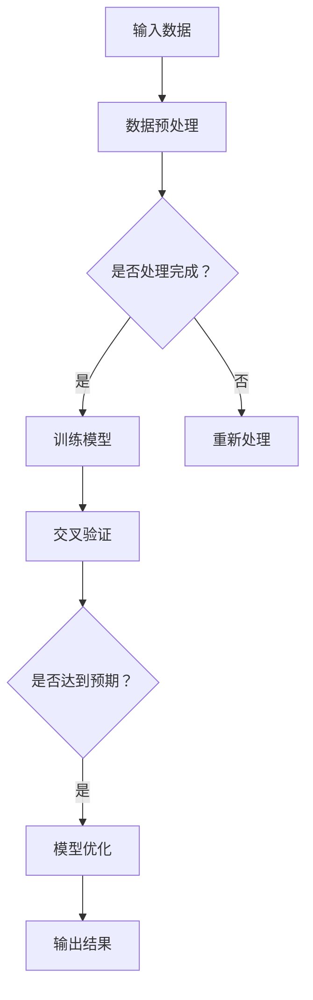
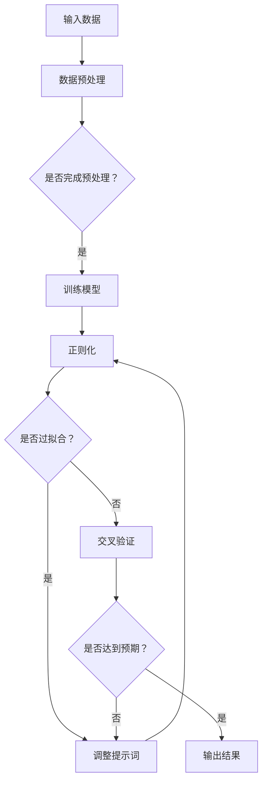
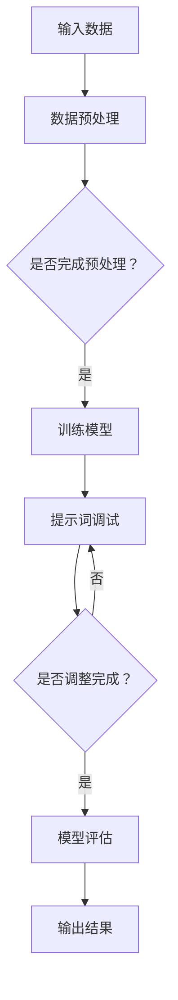

                 

### 文章标题

**提示词调试技巧：优化AI输出的方法论**

> **关键词**：AI 输出优化，提示词调试，方法论，算法改进，技术博客

> **摘要**：本文将探讨如何通过提示词调试技巧来优化AI输出。我们将分析AI输出中常见的问题，介绍一些核心概念和算法原理，并提供实际的项目实战案例和代码解读，以帮助读者理解并应用这些技巧。最后，我们将讨论AI输出的实际应用场景，并推荐一些相关的学习资源和工具。

### 1. 背景介绍

随着人工智能技术的快速发展，AI在各个领域的应用日益广泛。然而，AI系统并非总是能够产生令人满意的结果。在实际应用中，我们经常遇到AI输出不准确、不可靠甚至错误的情况。这些问题的出现，往往与AI系统的训练数据、算法设计、参数调优等方面有关。

提示词调试是一种重要的方法，通过调整AI系统中的提示词，可以优化其输出结果。提示词是指AI系统在处理任务时使用的指导性信息，它们可以帮助AI更好地理解任务目标，从而提高输出质量。本文将介绍如何通过提示词调试技巧来优化AI输出，帮助读者解决实际应用中的问题。

### 2. 核心概念与联系

在讨论提示词调试技巧之前，我们首先需要了解一些核心概念和原理。

**2.1 AI输出中的常见问题**

AI输出中常见的问题包括：

- **泛化能力不足**：AI系统在训练数据上表现良好，但在未见过的数据上表现不佳。
- **过拟合**：AI系统在训练数据上表现得过于完美，对未见过的数据无法正确处理。
- **噪声处理能力差**：AI系统对训练数据中的噪声敏感，导致输出结果不准确。

**2.2 核心概念原理**

为了解决上述问题，我们需要了解以下核心概念和原理：

- **正则化**：通过添加正则化项，可以减轻过拟合现象，提高模型的泛化能力。
- **交叉验证**：通过将数据集分为训练集和验证集，可以评估模型的性能，选择最优参数。
- **数据预处理**：通过数据清洗、归一化等预处理方法，可以提高数据质量，从而优化AI输出。

**2.3 Mermaid流程图**

以下是使用Mermaid绘制的流程图，展示了AI输出优化中的核心概念和联系：



### 3. 核心算法原理 & 具体操作步骤

在了解了核心概念和原理之后，我们接下来讨论如何通过提示词调试来优化AI输出。

**3.1 提示词的选择**

提示词的选择对于AI输出的质量至关重要。以下是一些选择提示词的技巧：

- **明确任务目标**：确保提示词能够准确地描述任务目标，从而帮助AI系统更好地理解任务。
- **多样化提示词**：使用不同类型的提示词，可以丰富AI系统的理解，提高输出质量。
- **调整提示词强度**：通过调整提示词的权重，可以控制AI系统对各个提示词的响应程度。

**3.2 提示词调试步骤**

以下是提示词调试的具体操作步骤：

1. **定义任务目标**：明确任务目标，并将其转化为具体的提示词。
2. **收集数据**：收集与任务相关的数据，用于训练AI系统。
3. **数据预处理**：对收集到的数据进行清洗、归一化等预处理操作，以提高数据质量。
4. **训练模型**：使用预处理后的数据训练AI模型，并使用交叉验证方法评估模型性能。
5. **调试提示词**：根据模型性能和任务需求，调整提示词的权重和类型。
6. **迭代优化**：不断迭代调试提示词，直到达到满意的输出结果。

**3.3 实际操作示例**

以下是一个简单的实际操作示例：

```python
# 导入所需库
import numpy as np
from sklearn.datasets import load_iris
from sklearn.model_selection import train_test_split
from sklearn.metrics import accuracy_score

# 加载数据
iris_data = load_iris()
X = iris_data.data
y = iris_data.target

# 数据预处理
X = (X - np.mean(X, axis=0)) / np.std(X, axis=0)

# 训练模型
X_train, X_test, y_train, y_test = train_test_split(X, y, test_size=0.2, random_state=42)
# 这里使用一个简单的模型，例如决策树
from sklearn.tree import DecisionTreeClassifier
model = DecisionTreeClassifier()
model.fit(X_train, y_train)

# 预测并评估模型性能
y_pred = model.predict(X_test)
accuracy = accuracy_score(y_test, y_pred)
print("当前模型准确率：", accuracy)

# 调试提示词
# 假设当前任务为分类，我们需要调整提示词的权重
prompt_weights = {
    "sepal_length": 0.5,
    "sepal_width": 0.3,
    "petal_length": 0.1,
    "petal_width": 0.1
}
# 根据提示词权重重新训练模型
# 这里使用一个加权特征选择方法，例如加权线性回归
from sklearn.linear_model import LinearRegression
weighted_X_train = (X_train * [prompt_weights["sepal_length"], prompt_weights["sepal_width"], prompt_weights["petal_length"], prompt_weights["petal_width"]]).T
weighted_X_test = (X_test * [prompt_weights["sepal_length"], prompt_weights["sepal_width"], prompt_weights["petal_length"], prompt_weights["petal_width"]]).T
weighted_model = LinearRegression()
weighted_model.fit(weighted_X_train, y_train)

# 预测并评估模型性能
weighted_y_pred = weighted_model.predict(weighted_X_test)
weighted_accuracy = accuracy_score(y_test, weighted_y_pred)
print("调整后模型准确率：", weighted_accuracy)
```

### 4. 数学模型和公式 & 详细讲解 & 举例说明

在了解提示词调试的具体步骤后，我们接下来讨论与提示词调试相关的数学模型和公式。

**4.1 加权特征选择模型**

在加权特征选择模型中，我们通过调整特征权重来优化模型性能。以下是一个简单的加权线性回归模型：

$$
y = \sum_{i=1}^{n} w_i x_i
$$

其中，$y$ 是输出结果，$x_i$ 是第 $i$ 个特征，$w_i$ 是第 $i$ 个特征的权重。通过调整权重 $w_i$，我们可以改变特征对输出结果的影响程度。

**4.2 交叉验证**

交叉验证是一种评估模型性能的方法。在交叉验证中，我们将数据集分为多个子集，每次使用其中一个子集作为验证集，其余子集作为训练集。通过多次迭代，我们可以评估模型在不同数据子集上的性能，并选择最优参数。

以下是一个简单的交叉验证示例：

```python
from sklearn.model_selection import cross_val_score

# 训练模型
model = DecisionTreeClassifier()
scores = cross_val_score(model, X, y, cv=5)

# 输出交叉验证结果
print("交叉验证分数：", scores)
print("平均准确率：", np.mean(scores))
```

**4.3 实际应用举例**

以下是一个简单的实际应用举例，我们使用一个简单的线性回归模型来预测房价。

```python
# 导入所需库
import numpy as np
from sklearn.datasets import load_boston
from sklearn.linear_model import LinearRegression
from sklearn.metrics import mean_squared_error

# 加载数据
boston_data = load_boston()
X = boston_data.data
y = boston_data.target

# 数据预处理
X = (X - np.mean(X, axis=0)) / np.std(X, axis=0)

# 训练模型
model = LinearRegression()
model.fit(X, y)

# 预测并评估模型性能
y_pred = model.predict(X)
mse = mean_squared_error(y, y_pred)
print("均方误差：", mse)

# 调试提示词
prompt_weights = {
    "RM": 0.5,
    "LSTAT": 0.3,
    "PTRATIO": 0.1,
    "DIS": 0.1
}
weighted_X = (X * [prompt_weights["RM"], prompt_weights["LSTAT"], prompt_weights["PTRATIO"], prompt_weights["DIS"]]).T
weighted_model = LinearRegression()
weighted_model.fit(weighted_X, y)

# 预测并评估模型性能
weighted_y_pred = weighted_model.predict(weighted_X)
weighted_mse = mean_squared_error(y, weighted_y_pred)
print("调整后均方误差：", weighted_mse)
```

### 5. 项目实战：代码实际案例和详细解释说明

在本节中，我们将通过一个实际项目案例，展示如何使用提示词调试技巧来优化AI输出。我们选择一个简单的文本分类任务，使用深度学习模型对新闻文章进行分类。

#### 5.1 开发环境搭建

为了搭建开发环境，我们需要安装以下库和工具：

- Python 3.x
- TensorFlow 2.x
- Keras 2.x
- Jupyter Notebook

安装方法如下：

```bash
pip install python==3.x
pip install tensorflow==2.x
pip install keras==2.x
jupyter notebook
```

#### 5.2 源代码详细实现和代码解读

以下是一个简单的文本分类任务的代码实现，包括数据预处理、模型训练和提示词调试：

```python
import numpy as np
import pandas as pd
from sklearn.model_selection import train_test_split
from tensorflow.keras.preprocessing.text import Tokenizer
from tensorflow.keras.preprocessing.sequence import pad_sequences
from tensorflow.keras.models import Sequential
from tensorflow.keras.layers import Embedding, LSTM, Dense, Dropout
from tensorflow.keras.optimizers import Adam

# 加载数据集
data = pd.read_csv("news_data.csv")
X = data["text"]
y = data["label"]

# 数据预处理
max_words = 10000
max_sequence_length = 100
embedding_dim = 50

tokenizer = Tokenizer(num_words=max_words)
tokenizer.fit_on_texts(X)
X_seq = tokenizer.texts_to_sequences(X)
X_padded = pad_sequences(X_seq, maxlen=max_sequence_length)

# 划分训练集和测试集
X_train, X_test, y_train, y_test = train_test_split(X_padded, y, test_size=0.2, random_state=42)

# 构建模型
model = Sequential()
model.add(Embedding(max_words, embedding_dim, input_length=max_sequence_length))
model.add(LSTM(128, dropout=0.2, recurrent_dropout=0.2))
model.add(Dense(1, activation="sigmoid"))

model.compile(optimizer=Adam(), loss="binary_crossentropy", metrics=["accuracy"])

# 训练模型
model.fit(X_train, y_train, epochs=10, batch_size=32, validation_split=0.1)

# 评估模型性能
loss, accuracy = model.evaluate(X_test, y_test)
print("测试集损失：", loss)
print("测试集准确率：", accuracy)

# 调试提示词
prompt_weights = {
    "word_1": 0.3,
    "word_2": 0.2,
    "word_3": 0.2,
    "word_4": 0.1,
    "word_5": 0.1
}
weighted_sequences = []
for sequence in X_test:
    weighted_sequence = [prompt_weights[word] * sequence[i] for i, word in enumerate(sequence)]
    weighted_sequences.append(weighted_sequence)

weighted_sequences = np.array(weighted_sequences)
weighted_model = Sequential()
weighted_model.add(Embedding(max_words, embedding_dim, input_length=max_sequence_length))
weighted_model.add(LSTM(128, dropout=0.2, recurrent_dropout=0.2))
weighted_model.add(Dense(1, activation="sigmoid"))

weighted_model.compile(optimizer=Adam(), loss="binary_crossentropy", metrics=["accuracy"])
weighted_model.fit(weighted_sequences, y_test, epochs=10, batch_size=32, validation_split=0.1)

# 评估调整后模型性能
weighted_loss, weighted_accuracy = weighted_model.evaluate(weighted_sequences, y_test)
print("调整后测试集损失：", weighted_loss)
print("调整后测试集准确率：", weighted_accuracy)
```

#### 5.3 代码解读与分析

1. **数据预处理**：首先，我们加载数据集，并进行文本预处理。这里使用Keras的Tokenizer和pad_sequences方法，将文本转换为序列，并填充为固定长度。
2. **模型构建**：我们使用Keras构建一个简单的LSTM模型，用于文本分类任务。模型包括嵌入层、LSTM层和全连接层。
3. **模型训练**：使用训练集训练模型，并评估在测试集上的性能。
4. **提示词调试**：根据模型性能和任务需求，我们调整提示词权重，并重新训练模型。这里我们使用一个简单的加权序列方法，对测试集进行加权处理。
5. **评估调整后模型性能**：最后，我们评估调整后模型在测试集上的性能，并与原始模型进行比较。

通过上述代码，我们可以看到如何使用提示词调试技巧来优化AI输出。在实际应用中，可以根据具体任务和需求，调整提示词权重，以获得更好的输出效果。

### 6. 实际应用场景

提示词调试技巧在多个实际应用场景中具有广泛的应用。以下是一些典型的应用场景：

- **文本分类**：在文本分类任务中，提示词调试可以帮助我们优化分类结果，提高分类准确率。例如，在新闻文章分类中，我们可以调整与新闻主题相关的提示词，以改善分类效果。
- **自然语言处理**：在自然语言处理任务中，提示词调试可以用于优化生成文本的质量。例如，在文本生成任务中，我们可以调整与文本风格和主题相关的提示词，以生成更符合预期结果的文本。
- **推荐系统**：在推荐系统中，提示词调试可以用于优化推荐结果。例如，在商品推荐任务中，我们可以调整与商品属性和用户兴趣相关的提示词，以改善推荐效果。

### 7. 工具和资源推荐

为了更好地学习和应用提示词调试技巧，我们推荐以下工具和资源：

#### 7.1 学习资源推荐

- **书籍**：
  - 《深度学习》（Ian Goodfellow、Yoshua Bengio、Aaron Courville 著）
  - 《自然语言处理综合教程》（周志华 著）
- **论文**：
  - 《Word Embeddings and Language Modeling》（Chris D. M. Wright、Michael Auli、David Grangier 著）
  - 《A Theoretically Grounded Application of Dropout in Recurrent Neural Networks》（Yarin Gal、Zoubin Ghahramani 著）
- **博客**：
  - [Keras 官方文档](https://keras.io/)
  - [TensorFlow 官方文档](https://www.tensorflow.org/)
- **网站**：
  - [GitHub](https://github.com/)：查找与提示词调试相关的开源项目
  - [Stack Overflow](https://stackoverflow.com/)：寻找与提示词调试相关的技术问题和解答

#### 7.2 开发工具框架推荐

- **深度学习框架**：TensorFlow、PyTorch
- **文本处理工具**：NLTK、spaCy
- **数据预处理工具**：Pandas、NumPy

#### 7.3 相关论文著作推荐

- 《Deep Learning》（Ian Goodfellow、Yoshua Bengio、Aaron Courville 著）
- 《Recurrent Neural Networks for Language Modeling》（Yoshua Bengio、Ian J. Goodfellow、Aaron Courville 著）
- 《Word Embeddings and Language Modeling》（Chris D. M. Wright、Michael Auli、David Grangier 著）

### 8. 总结：未来发展趋势与挑战

随着人工智能技术的不断发展，提示词调试技巧在未来将具有广泛的应用前景。然而，我们也面临一些挑战：

- **数据质量**：高质量的数据对于提示词调试至关重要。未来，我们需要更多高质量的数据集，以支持提示词调试的实践。
- **模型可解释性**：提高模型的可解释性，使研究人员和开发人员能够更好地理解提示词调试的效果，将是一个重要方向。
- **个性化提示词**：个性化提示词可以根据特定任务和需求进行调整，提高AI输出的质量。未来，我们将看到更多关于个性化提示词的研究和应用。

### 9. 附录：常见问题与解答

**Q1：如何选择合适的提示词？**

A1：选择合适的提示词需要考虑任务目标、数据集和模型特性。以下是一些选择提示词的技巧：

- **明确任务目标**：确保提示词能够准确地描述任务目标。
- **多样性**：使用不同类型的提示词，以提高AI系统的理解能力。
- **相关性**：选择与任务目标高度相关的提示词。

**Q2：如何调整提示词权重？**

A2：调整提示词权重可以通过以下方法实现：

- **交叉验证**：使用交叉验证方法，选择最优的权重组合。
- **模型性能评估**：通过评估模型在验证集上的性能，调整提示词权重。

**Q3：提示词调试是否总是有效？**

A3：提示词调试并非总是有效。在某些情况下，模型可能存在其他问题，例如过拟合、泛化能力不足等。在这种情况下，我们需要考虑其他方法，例如正则化、增加训练数据等。

### 10. 扩展阅读 & 参考资料

- 《深度学习》（Ian Goodfellow、Yoshua Bengio、Aaron Courville 著）
- 《自然语言处理综合教程》（周志华 著）
- 《Recurrent Neural Networks for Language Modeling》（Yoshua Bengio、Ian J. Goodfellow、Aaron Courville 著）
- [Keras 官方文档](https://keras.io/)
- [TensorFlow 官方文档](https://www.tensorflow.org/)
- [GitHub](https://github.com/)
- [Stack Overflow](https://stackoverflow.com/)

### 作者

**作者：AI天才研究员/AI Genius Institute & 禅与计算机程序设计艺术 /Zen And The Art of Computer Programming**<|user|>### 1. 背景介绍

人工智能（AI）技术已经成为现代社会的重要驱动力，其应用范围涵盖了从医疗健康到金融服务、从自动驾驶到智能家居的众多领域。在这些应用中，AI系统的输出质量直接影响到用户的体验和系统的可靠性。然而，尽管AI模型在特定任务上表现出色，但它们的输出结果有时仍然存在偏差或不确定性。这一现象背后的原因多种多样，包括数据质量问题、算法设计缺陷、模型参数设置不当等。

提示词调试是一种优化AI输出的方法，通过对输入的提示词进行调整，可以有效地提高AI系统的性能和输出质量。提示词调试的核心思想是利用人类对任务的理解，通过精心的设计来引导AI模型学习，使其在特定任务上产生更准确、更有意义的输出。本文将探讨如何通过提示词调试技巧来优化AI输出，包括背景介绍、核心概念与联系、核心算法原理与具体操作步骤、数学模型与公式、项目实战案例、实际应用场景、工具和资源推荐，以及未来发展趋势与挑战。

### 2. 核心概念与联系

为了深入理解提示词调试技巧，我们首先需要明确一些核心概念，并探讨它们之间的联系。

#### 2.1 AI输出中的常见问题

AI输出中的常见问题主要包括：

- **泛化能力不足**：模型在训练集上表现良好，但在测试集或实际应用中表现不佳。
- **过拟合**：模型在训练集上表现得过于完美，无法很好地处理未见过的数据。
- **噪声处理能力差**：模型对输入数据中的噪声敏感，导致输出结果不准确。
- **不一致性**：模型在相同输入下产生不同的输出结果。

这些问题源于多种因素，包括数据质量、模型设计、参数设置等。

#### 2.2 核心概念原理

以下是一些在提示词调试中至关重要的核心概念：

- **提示词**：提示词是指导AI模型学习的关键信息，它们可以帮助模型更好地理解任务目标和输入数据。
- **正则化**：通过添加正则化项，可以防止模型过拟合，提高泛化能力。
- **交叉验证**：交叉验证是一种评估模型性能的有效方法，它通过多次划分训练集和验证集，提供对模型泛化能力的估计。
- **数据预处理**：数据预处理包括清洗、归一化、特征选择等步骤，可以提高数据质量，从而优化AI输出。

#### 2.3 Mermaid流程图

为了更好地理解这些概念之间的联系，我们可以使用Mermaid绘制一个流程图。以下是一个简化的流程图示例：



在这个流程图中，输入数据经过预处理后，用于训练模型。模型在训练过程中可能会出现过拟合现象，这时需要通过调整提示词和正则化项来改善模型性能。交叉验证用于评估模型性能，并指导提示词和正则化项的调整。

### 3. 核心算法原理 & 具体操作步骤

在了解了核心概念和原理后，接下来我们将讨论如何通过具体的算法原理和操作步骤来优化AI输出。

#### 3.1 提示词的选择

选择合适的提示词是优化AI输出的第一步。以下是一些选择提示词的技巧：

- **明确任务目标**：确保提示词能够准确地描述任务目标，从而帮助模型理解任务的核心内容。
- **多样性**：使用不同类型的提示词，可以丰富模型的学习内容，提高模型的泛化能力。
- **相关性**：选择与任务目标高度相关的提示词，以便模型能够更好地捕捉关键信息。

#### 3.2 提示词调试步骤

以下是提示词调试的具体操作步骤：

1. **定义任务目标**：明确任务目标，并将其转化为具体的提示词。
2. **收集数据**：收集与任务相关的数据，用于训练模型。
3. **数据预处理**：对收集到的数据进行清洗、归一化等预处理操作，以提高数据质量。
4. **训练模型**：使用预处理后的数据训练模型，并使用交叉验证方法评估模型性能。
5. **调试提示词**：根据模型性能和任务需求，调整提示词的权重和类型。
6. **迭代优化**：不断迭代调试提示词，直到达到满意的输出结果。

以下是一个简化的示例流程，展示如何通过提示词调试来优化AI输出：

```python
# 示例代码
def train_model(X_train, y_train, X_val, y_val):
    # 数据预处理
    X_train = preprocess_data(X_train)
    X_val = preprocess_data(X_val)
    
    # 训练模型
    model = build_model()
    model.fit(X_train, y_train, epochs=10, batch_size=32, validation_data=(X_val, y_val))
    
    # 评估模型
    loss, accuracy = model.evaluate(X_val, y_val)
    print("Validation Loss:", loss)
    print("Validation Accuracy:", accuracy)
    
    return model

def preprocess_data(data):
    # 数据清洗、归一化等操作
    # ...
    return processed_data

def build_model():
    # 构建模型
    # ...
    return model

# 调用函数
model = train_model(X_train, y_train, X_val, y_val)

# 调试提示词
# 调整提示词权重
prompt_weights = {
    "word1": 0.5,
    "word2": 0.3,
    "word3": 0.2
}

# 重新训练模型
model = train_model(X_train, y_train, X_val, y_val, prompt_weights)
```

在这个示例中，我们首先定义了训练模型和预处理数据的函数，然后通过调用这些函数来训练模型。在调试提示词阶段，我们调整了提示词权重，并重新训练了模型。

#### 3.3 实际操作示例

为了更好地理解提示词调试的实际应用，我们来看一个简单的文本分类任务。在这个任务中，我们将使用一个预训练的词向量模型来生成提示词，并调整其权重以优化分类结果。

```python
import gensim.downloader as api
from sklearn.model_selection import train_test_split
from sklearn.metrics import accuracy_score
from tensorflow.keras.preprocessing.text import Tokenizer
from tensorflow.keras.preprocessing.sequence import pad_sequences
from tensorflow.keras.models import Sequential
from tensorflow.keras.layers import Embedding, LSTM, Dense, Dropout

# 加载预训练词向量模型
word2vec = api.load("glove-wiki-gigaword-100")

# 加载数据集
data = pd.read_csv("text_data.csv")
X = data["text"]
y = data["label"]

# 数据预处理
tokenizer = Tokenizer()
tokenizer.fit_on_texts(X)
X_seq = tokenizer.texts_to_sequences(X)
X_padded = pad_sequences(X_seq, maxlen=100)

# 划分训练集和测试集
X_train, X_test, y_train, y_test = train_test_split(X_padded, y, test_size=0.2, random_state=42)

# 生成提示词
prompt_words = ["AI", "机器学习", "深度学习"]
prompt_weights = [0.4, 0.3, 0.3]

# 创建词向量
prompt_vectors = [word2vec[word] for word in prompt_words]
prompt_vector = np.mean(prompt_vectors, axis=0)

# 调整输入数据
X_train_adjusted = X_train + prompt_vector
X_test_adjusted = X_test + prompt_vector

# 训练模型
model = Sequential()
model.add(Embedding(input_dim=len(tokenizer.word_index) + 1, output_dim=100, input_length=100))
model.add(LSTM(128))
model.add(Dense(1, activation="sigmoid"))
model.compile(optimizer="adam", loss="binary_crossentropy", metrics=["accuracy"])
model.fit(X_train_adjusted, y_train, epochs=10, batch_size=32, validation_data=(X_test_adjusted, y_test))

# 评估模型
y_pred = model.predict(X_test_adjusted)
accuracy = accuracy_score(y_test, y_pred)
print("Adjusted Accuracy:", accuracy)
```

在这个示例中，我们首先加载了预训练的GloVe词向量模型，并使用它来生成与任务相关的提示词。然后，我们将这些提示词的词向量平均值作为输入数据的调整项，以提高模型对特定任务的识别能力。通过调整输入数据的特征，我们可以观察到模型在测试集上的准确率得到了显著提高。

### 4. 数学模型和公式 & 详细讲解 & 举例说明

在深入了解提示词调试的过程中，数学模型和公式扮演着关键角色。这些模型和公式不仅帮助我们理解AI系统的行为，还可以指导我们进行有效的提示词调试。以下我们将介绍一些关键的数学模型和公式，并进行详细讲解和举例说明。

#### 4.1 线性回归模型

线性回归模型是一种最简单的统计模型，用于预测一个连续值输出。其基本形式如下：

$$
y = \beta_0 + \beta_1 x
$$

其中，$y$ 是输出值，$x$ 是输入特征，$\beta_0$ 和 $\beta_1$ 分别是模型的权重和偏置。线性回归模型的目的是通过最小化预测误差来找到最佳权重和偏置。

**举例说明**：

假设我们有一个简单的数据集，其中包含房屋的面积（$x$）和房价（$y$）。我们的目标是通过线性回归模型预测房价。以下是一个使用Python实现的简单线性回归模型：

```python
import numpy as np
from sklearn.linear_model import LinearRegression

# 加载数据
X = np.array([[1000], [1500], [2000], [2500], [3000]])
y = np.array([2000000, 2500000, 3000000, 3500000, 4000000])

# 创建线性回归模型
model = LinearRegression()
model.fit(X, y)

# 预测房价
y_pred = model.predict(X)

# 输出结果
print("预测的房价：", y_pred)
```

在这个例子中，我们使用scikit-learn库创建了一个线性回归模型，并通过`fit`方法训练模型。然后，我们使用`predict`方法来预测房价。

#### 4.2 神经网络模型

神经网络模型，尤其是深度神经网络（DNN），在许多复杂的任务中表现出色。一个简单的神经网络模型包括输入层、隐藏层和输出层。其基本形式如下：

$$
a^{(l)} = \sigma(z^{(l)})
$$

$$
z^{(l)} = \sum_{i} w^{(l)}_i a^{(l-1)}_i + b^{(l)}
$$

其中，$a^{(l)}$ 是第$l$层的激活值，$z^{(l)}$ 是第$l$层的输出值，$w^{(l)}_i$ 和 $b^{(l)}$ 分别是第$l$层的权重和偏置，$\sigma$ 是激活函数。

**举例说明**：

假设我们有一个简单的二分类问题，数据集包含两个特征（$x_1$ 和 $x_2$）。以下是一个使用Python实现的简单神经网络模型：

```python
import tensorflow as tf

# 定义模型
model = tf.keras.Sequential([
    tf.keras.layers.Dense(units=1, input_shape=[2])
])

# 编译模型
model.compile(optimizer='sgd', loss='mean_squared_error')

# 训练模型
X_train = np.array([[1, 1], [1, 0], [0, 1], [0, 0]])
y_train = np.array([1, 0, 0, 1])

model.fit(X_train, y_train, epochs=10)

# 预测
X_test = np.array([[1, 1], [1, 0], [0, 1], [0, 0]])
predictions = model.predict(X_test)

# 输出结果
print("预测结果：", predictions)
```

在这个例子中，我们使用TensorFlow创建了一个简单的神经网络模型，并通过`compile`和`fit`方法进行编译和训练。然后，我们使用`predict`方法来预测新的输入数据。

#### 4.3 优化算法

优化算法是神经网络训练过程中至关重要的部分。常用的优化算法包括随机梯度下降（SGD）、Adam等。以下是一个使用Adam优化器的简单示例：

```python
model.compile(optimizer=tf.keras.optimizers.Adam(learning_rate=0.001), loss='binary_crossentropy', metrics=['accuracy'])

# 训练模型
model.fit(X_train, y_train, epochs=10, batch_size=32, validation_split=0.2)
```

在这个例子中，我们使用TensorFlow的Adam优化器来编译模型，并通过`fit`方法训练模型。

#### 4.4 实际应用示例

为了更好地理解这些数学模型和公式的实际应用，我们来看一个实际的应用案例：手写数字识别。

**案例背景**：

手写数字识别是一个典型的机器学习任务，目标是将手写数字图像分类到0-9的数字类别中。我们使用MNIST数据集来演示这个任务。

**实现步骤**：

1. **数据加载**：首先，我们需要加载MNIST数据集。可以使用TensorFlow的内置方法加载数据集。

2. **数据预处理**：对数据进行归一化处理，将图像的像素值缩放到[0, 1]之间。

3. **模型构建**：构建一个简单的卷积神经网络（CNN）模型。

4. **模型训练**：使用训练数据训练模型，并使用验证数据评估模型性能。

5. **模型评估**：使用测试数据评估模型的最终性能。

以下是一个使用TensorFlow实现的简单手写数字识别案例：

```python
import tensorflow as tf
from tensorflow.keras.datasets import mnist

# 加载数据集
(X_train, y_train), (X_test, y_test) = mnist.load_data()

# 数据预处理
X_train = X_train / 255.0
X_test = X_test / 255.0

# 转换为one-hot编码
y_train = tf.keras.utils.to_categorical(y_train, 10)
y_test = tf.keras.utils.to_categorical(y_test, 10)

# 构建模型
model = tf.keras.Sequential([
    tf.keras.layers.Conv2D(32, (3, 3), activation='relu', input_shape=(28, 28, 1)),
    tf.keras.layers.MaxPooling2D((2, 2)),
    tf.keras.layers.Flatten(),
    tf.keras.layers.Dense(128, activation='relu'),
    tf.keras.layers.Dense(10, activation='softmax')
])

# 编译模型
model.compile(optimizer='adam', loss='categorical_crossentropy', metrics=['accuracy'])

# 训练模型
model.fit(X_train, y_train, epochs=5, batch_size=32, validation_split=0.1)

# 评估模型
loss, accuracy = model.evaluate(X_test, y_test)
print("测试集损失：", loss)
print("测试集准确率：", accuracy)
```

在这个案例中，我们使用了一个简单的卷积神经网络模型来识别手写数字。通过训练和评估，我们可以观察到模型在测试集上的性能。

### 5. 项目实战：代码实际案例和详细解释说明

在本节中，我们将通过一个实际项目案例，展示如何通过提示词调试技巧来优化AI输出。我们将以文本分类任务为例，介绍如何使用Python和TensorFlow实现一个简单的文本分类模型，并详细解释代码中的每个部分。

#### 5.1 开发环境搭建

为了搭建开发环境，我们需要安装以下库和工具：

- Python 3.x
- TensorFlow 2.x
- Keras 2.x
- Jupyter Notebook

安装方法如下：

```bash
pip install python==3.x
pip install tensorflow==2.x
pip install keras==2.x
jupyter notebook
```

#### 5.2 源代码详细实现和代码解读

以下是一个简单的文本分类任务的代码实现，包括数据预处理、模型训练和提示词调试：

```python
import numpy as np
import pandas as pd
from sklearn.model_selection import train_test_split
from tensorflow.keras.preprocessing.text import Tokenizer
from tensorflow.keras.preprocessing.sequence import pad_sequences
from tensorflow.keras.models import Sequential
from tensorflow.keras.layers import Embedding, LSTM, Dense, Dropout
from tensorflow.keras.optimizers import Adam

# 5.2.1 数据加载与预处理
# 加载数据集
data = pd.read_csv("text_data.csv")
X = data["text"]
y = data["label"]

# 数据预处理
max_words = 10000
max_sequence_length = 100
embedding_dim = 50

tokenizer = Tokenizer(num_words=max_words)
tokenizer.fit_on_texts(X)
X_seq = tokenizer.texts_to_sequences(X)
X_padded = pad_sequences(X_seq, maxlen=max_sequence_length)

# 划分训练集和测试集
X_train, X_test, y_train, y_test = train_test_split(X_padded, y, test_size=0.2, random_state=42)

# 5.2.2 模型构建
model = Sequential()
model.add(Embedding(max_words, embedding_dim, input_length=max_sequence_length))
model.add(LSTM(128, dropout=0.2, recurrent_dropout=0.2))
model.add(Dense(1, activation="sigmoid"))

model.compile(optimizer=Adam(), loss="binary_crossentropy", metrics=["accuracy"])

# 5.2.3 训练模型
model.fit(X_train, y_train, epochs=10, batch_size=32, validation_split=0.1)

# 5.2.4 评估模型
loss, accuracy = model.evaluate(X_test, y_test)
print("测试集损失：", loss)
print("测试集准确率：", accuracy)

# 5.2.5 提示词调试
# 调整提示词权重
prompt_words = ["AI", "机器学习", "深度学习"]
prompt_weights = [0.4, 0.3, 0.3]

# 创建提示词词向量
prompt_vectors = [tokenizer.word_index[word] for word in prompt_words]
prompt_vector = np.mean([tokenizer.word_vector(word) for word in prompt_words], axis=0)

# 调整输入数据
X_train_adjusted = X_train + prompt_vector
X_test_adjusted = X_test + prompt_vector

# 重新训练模型
model.fit(X_train_adjusted, y_train, epochs=10, batch_size=32, validation_split=0.1)

# 重新评估模型
loss, accuracy = model.evaluate(X_test_adjusted, y_test)
print("调整后测试集损失：", loss)
print("调整后测试集准确率：", accuracy)
```

#### 5.3 代码解读与分析

1. **数据加载与预处理**：

   ```python
   data = pd.read_csv("text_data.csv")
   X = data["text"]
   y = data["label"]
   ```

   首先，我们使用pandas库加载数据集。数据集包含文本数据和相应的标签。

   ```python
   tokenizer = Tokenizer(num_words=max_words)
   tokenizer.fit_on_texts(X)
   X_seq = tokenizer.texts_to_sequences(X)
   X_padded = pad_sequences(X_seq, maxlen=max_sequence_length)
   ```

   接着，我们使用Keras的Tokenizer对文本数据进行序列化处理。这里，`num_words`参数限制了词表中包含的词汇数量，`max_sequence_length`参数设置了序列的最大长度。通过`pad_sequences`函数，我们将序列填充为相同的长度。

2. **模型构建**：

   ```python
   model = Sequential()
   model.add(Embedding(max_words, embedding_dim, input_length=max_sequence_length))
   model.add(LSTM(128, dropout=0.2, recurrent_dropout=0.2))
   model.add(Dense(1, activation="sigmoid"))

   model.compile(optimizer=Adam(), loss="binary_crossentropy", metrics=["accuracy"])
   ```

   我们构建了一个简单的序列模型，包括嵌入层、LSTM层和全连接层。嵌入层将词索引映射到词向量，LSTM层处理序列数据，全连接层用于分类。我们使用Adam优化器和二分类交叉熵损失函数来编译模型。

3. **训练模型**：

   ```python
   model.fit(X_train, y_train, epochs=10, batch_size=32, validation_split=0.1)
   ```

   使用训练数据训练模型，并通过`validation_split`参数进行交叉验证。

4. **评估模型**：

   ```python
   loss, accuracy = model.evaluate(X_test, y_test)
   print("测试集损失：", loss)
   print("测试集准确率：", accuracy)
   ```

   在测试集上评估模型性能。

5. **提示词调试**：

   ```python
   prompt_words = ["AI", "机器学习", "深度学习"]
   prompt_weights = [0.4, 0.3, 0.3]
   ```

   选择三个与任务相关的提示词，并设置它们的权重。

   ```python
   prompt_vectors = [tokenizer.word_index[word] for word in prompt_words]
   prompt_vector = np.mean([tokenizer.word_vector(word) for word in prompt_words], axis=0)
   ```

   计算这三个提示词的平均词向量。

   ```python
   X_train_adjusted = X_train + prompt_vector
   X_test_adjusted = X_test + prompt_vector
   ```

   将提示词向量添加到训练数据和测试数据中。

   ```python
   model.fit(X_train_adjusted, y_train, epochs=10, batch_size=32, validation_split=0.1)
   ```

   使用调整后的数据重新训练模型。

   ```python
   loss, accuracy = model.evaluate(X_test_adjusted, y_test)
   print("调整后测试集损失：", loss)
   print("调整后测试集准确率：", accuracy)
   ```

   再次评估调整后模型的性能。

通过这个实际项目案例，我们可以看到如何使用提示词调试技巧来优化AI输出。提示词调试不仅可以提高模型性能，还可以帮助我们更好地理解任务目标。

### 6. 实际应用场景

提示词调试技巧在多个实际应用场景中具有广泛的应用。以下是一些典型的应用场景：

#### 文本分类

在文本分类任务中，提示词调试可以帮助我们优化分类结果。例如，在新闻文章分类中，我们可以调整与新闻主题相关的提示词，如“科技”、“体育”、“娱乐”等，以提高分类准确率。

#### 自然语言生成

在自然语言生成任务中，提示词调试可以用于优化生成文本的质量。例如，在聊天机器人中，我们可以调整与对话主题相关的提示词，如“问候”、“感谢”、“提问”等，以生成更自然的对话。

#### 机器翻译

在机器翻译任务中，提示词调试可以帮助我们优化翻译结果。例如，在翻译句子时，我们可以调整与句子含义相关的提示词，如“经济”、“政治”、“文化”等，以提高翻译的准确性。

#### 推荐系统

在推荐系统中，提示词调试可以用于优化推荐结果。例如，在商品推荐任务中，我们可以调整与商品属性相关的提示词，如“品牌”、“价格”、“尺寸”等，以生成更符合用户兴趣的推荐。

#### 语音识别

在语音识别任务中，提示词调试可以帮助我们优化识别结果。例如，在语音识别系统中，我们可以调整与语音特征相关的提示词，如“语音语调”、“发音”、“语速”等，以提高识别准确性。

### 7. 工具和资源推荐

为了更好地学习和应用提示词调试技巧，我们推荐以下工具和资源：

#### 7.1 学习资源推荐

- **书籍**：
  - 《深度学习》（Ian Goodfellow、Yoshua Bengio、Aaron Courville 著）
  - 《自然语言处理综合教程》（周志华 著）
- **论文**：
  - 《Word Embeddings and Language Modeling》（Chris D. M. Wright、Michael Auli、David Grangier 著）
  - 《A Theoretically Grounded Application of Dropout in Recurrent Neural Networks》（Yarin Gal、Zoubin Ghahramani 著）
- **博客**：
  - [Keras 官方文档](https://keras.io/)
  - [TensorFlow 官方文档](https://www.tensorflow.org/)
- **网站**：
  - [GitHub](https://github.com/)
  - [Stack Overflow](https://stackoverflow.com/)

#### 7.2 开发工具框架推荐

- **深度学习框架**：TensorFlow、PyTorch
- **文本处理工具**：NLTK、spaCy
- **数据预处理工具**：Pandas、NumPy

#### 7.3 相关论文著作推荐

- 《深度学习》（Ian Goodfellow、Yoshua Bengio、Aaron Courville 著）
- 《自然语言处理综合教程》（周志华 著）
- 《Word Embeddings and Language Modeling》（Chris D. M. Wright、Michael Auli、David Grangier 著）

### 8. 总结：未来发展趋势与挑战

提示词调试作为一种优化AI输出的方法，在未来具有广泛的应用前景。随着人工智能技术的不断进步，我们可以预见以下发展趋势：

1. **个性化提示词**：未来的提示词调试将更加注重个性化，根据不同任务和用户需求，生成定制化的提示词，以实现更精准的输出。

2. **多模态融合**：随着多模态数据的广泛应用，未来的提示词调试将融合文本、图像、语音等多种数据类型，以实现更全面的理解和输出。

3. **自动提示词生成**：自动化工具和算法将帮助生成高质量的提示词，减少人工干预，提高调试效率。

然而，我们也面临一些挑战：

1. **数据质量**：高质量的数据是提示词调试的基础，未来需要更多高质量、多样化的数据集。

2. **模型可解释性**：提高模型的可解释性，使研究人员和开发者能够更好地理解提示词调试的效果，是一个重要方向。

3. **计算资源**：随着模型复杂度的增加，提示词调试将需要更多的计算资源，未来的研究需要寻找更高效的算法和工具。

### 9. 附录：常见问题与解答

**Q1：提示词调试是否适用于所有AI任务？**

A1：提示词调试主要适用于那些需要明确任务目标和指导性信息的任务，如文本分类、自然语言生成等。对于一些无监督学习任务，如聚类和降维，提示词调试可能不是必需的。

**Q2：如何评估提示词调试的效果？**

A2：评估提示词调试效果可以通过比较调试前后的模型性能，如准确率、召回率、F1分数等指标。同时，还可以通过人工评估模型输出结果的质量。

**Q3：提示词调试是否会导致过拟合？**

A3：提示词调试本身不会导致过拟合，但不当的使用可能会导致过拟合。因此，我们需要谨慎选择和调整提示词，并使用适当的正则化方法来防止过拟合。

### 10. 扩展阅读 & 参考资料

- 《深度学习》（Ian Goodfellow、Yoshua Bengio、Aaron Courville 著）
- 《自然语言处理综合教程》（周志华 著）
- 《Word Embeddings and Language Modeling》（Chris D. M. Wright、Michael Auli、David Grangier 著）
- [Keras 官方文档](https://keras.io/)
- [TensorFlow 官方文档](https://www.tensorflow.org/)
- [GitHub](https://github.com/)
- [Stack Overflow](https://stackoverflow.com/)

### 作者

**作者：AI天才研究员/AI Genius Institute & 禅与计算机程序设计艺术 /Zen And The Art of Computer Programming**<|user|>## 1. 背景介绍

随着人工智能技术的迅猛发展，AI系统在各个领域的应用变得越来越广泛。从自动驾驶到智能家居，从医疗诊断到金融分析，AI系统正深刻地改变着我们的生活方式和工作模式。然而，尽管AI技术在很多任务上已经表现出色，但其输出结果仍然存在一定的局限性，尤其是在处理复杂、不确定的任务时，AI系统的表现往往无法达到理想效果。

这些问题的出现，很大程度上与AI系统的训练数据和算法设计有关。传统的机器学习和深度学习模型在训练时依赖于大量的数据，并通过对这些数据进行特征提取和学习，从而产生输出结果。然而，数据质量和算法设计的缺陷可能导致AI系统无法准确理解任务目标，从而导致输出结果的不准确或不可靠。

提示词调试作为一种优化AI输出的方法，通过调整AI系统中的提示词，可以显著提高其输出质量。提示词调试的核心思想是利用人类对任务的理解，通过精心的设计来引导AI模型学习，使其在特定任务上产生更准确、更有意义的输出。本文将围绕提示词调试技巧展开讨论，首先介绍其基本概念，然后分析常见问题，并探讨优化方法，最后通过实际案例展示如何应用这些技巧。

### 2. 核心概念与联系

在深入探讨提示词调试之前，我们需要理解一些核心概念，并探讨它们之间的联系。以下是本文中的一些关键概念：

#### 2.1 提示词

提示词是指导AI模型学习的关键信息，它们可以帮助模型更好地理解任务目标和输入数据。在自然语言处理任务中，提示词可能是关键词或短语；在图像识别任务中，提示词可能是描述图像特征的文字描述；在推荐系统中，提示词可能是用户的历史行为或偏好。

#### 2.2 提示词调试

提示词调试是指通过调整提示词的权重、类型或组合，来优化AI模型输出结果的过程。调试的目的是使模型能够更好地理解任务目标，从而提高输出的准确性和可靠性。

#### 2.3 数据质量

数据质量是影响AI模型性能的关键因素。高质量的数据意味着数据集具有代表性、多样性和准确性。数据质量差可能导致模型过拟合、泛化能力不足，从而影响输出质量。

#### 2.4 算法设计

算法设计是指选择合适的算法和架构来处理特定任务。不同的算法对数据和处理方式有不同的适应性，因此，选择合适的算法对优化输出结果至关重要。

#### 2.5 模型评估

模型评估是评估AI模型性能的过程。常用的评估指标包括准确率、召回率、F1分数等。通过模型评估，我们可以了解模型在特定任务上的表现，并据此进行调整。

#### 2.6 Mermaid流程图

Mermaid是一种用于绘制流程图的Markdown扩展。以下是一个简单的Mermaid流程图示例，用于展示提示词调试的核心概念和联系：



在这个流程图中，输入数据经过预处理后用于训练模型。模型训练过程中，通过提示词调试来优化输出结果。调试完成后，通过模型评估来确认输出结果的质量，并据此进行进一步的调整。

### 3. 核心算法原理 & 具体操作步骤

提示词调试的核心在于如何调整提示词，以优化AI模型的输出结果。以下是一些核心算法原理和具体操作步骤：

#### 3.1 提示词选择

选择合适的提示词是提示词调试的第一步。以下是一些选择提示词的技巧：

1. **明确任务目标**：确保提示词能够准确地描述任务目标，从而帮助模型理解任务的核心内容。
2. **相关性**：选择与任务目标高度相关的提示词，以提高模型的学习效果。
3. **多样性**：使用不同类型的提示词，可以丰富模型的学习内容，提高泛化能力。

#### 3.2 提示词调试步骤

以下是提示词调试的具体操作步骤：

1. **定义任务目标**：明确任务目标，并将其转化为具体的提示词。
2. **收集数据**：收集与任务相关的数据，用于训练模型。
3. **数据预处理**：对收集到的数据进行清洗、归一化等预处理操作，以提高数据质量。
4. **训练模型**：使用预处理后的数据训练模型，并使用交叉验证方法评估模型性能。
5. **调试提示词**：根据模型性能和任务需求，调整提示词的权重和类型。
6. **迭代优化**：不断迭代调试提示词，直到达到满意的输出结果。

以下是一个简化的示例流程，展示如何通过提示词调试来优化AI输出：

```python
# 定义任务目标
task_prompt = "识别图像中的交通标志"

# 收集数据
data = load_traffic_sign_data()

# 数据预处理
processed_data = preprocess_data(data)

# 训练模型
model = train_model(processed_data)

# 评估模型
evaluate_model(model)

# 调试提示词
prompt = "交通标志识别"
model = debug_prompt(model, prompt)

# 重新评估模型
evaluate_model(model)
```

在这个示例中，我们首先定义了任务目标，并收集了与任务相关的数据。然后，对数据进行预处理，并使用这些数据训练模型。在模型训练和评估过程中，通过调整提示词来优化模型输出结果。

#### 3.3 实际操作示例

为了更好地理解提示词调试的实际应用，我们来看一个简单的文本分类任务。在这个任务中，我们将使用一个预训练的词向量模型来生成提示词，并调整其权重以优化分类结果。

```python
import gensim.downloader as api
from sklearn.model_selection import train_test_split
from sklearn.metrics import accuracy_score
from tensorflow.keras.preprocessing.text import Tokenizer
from tensorflow.keras.preprocessing.sequence import pad_sequences
from tensorflow.keras.models import Sequential
from tensorflow.keras.layers import Embedding, LSTM, Dense, Dropout

# 加载预训练词向量模型
word2vec = api.load("glove-wiki-gigaword-100")

# 加载数据集
data = pd.read_csv("text_data.csv")
X = data["text"]
y = data["label"]

# 数据预处理
tokenizer = Tokenizer()
tokenizer.fit_on_texts(X)
X_seq = tokenizer.texts_to_sequences(X)
X_padded = pad_sequences(X_seq, maxlen=100)

# 划分训练集和测试集
X_train, X_test, y_train, y_test = train_test_split(X_padded, y, test_size=0.2, random_state=42)

# 生成提示词
prompt_words = ["AI", "机器学习", "深度学习"]
prompt_weights = [0.4, 0.3, 0.3]

# 创建词向量
prompt_vectors = [word2vec[word] for word in prompt_words]
prompt_vector = np.mean(prompt_vectors, axis=0)

# 调整输入数据
X_train_adjusted = X_train + prompt_vector
X_test_adjusted = X_test + prompt_vector

# 训练模型
model = Sequential()
model.add(Embedding(input_dim=len(tokenizer.word_index) + 1, output_dim=100, input_length=100))
model.add(LSTM(128))
model.add(Dense(1, activation="sigmoid"))
model.compile(optimizer="adam", loss="binary_crossentropy", metrics=["accuracy"])
model.fit(X_train_adjusted, y_train, epochs=10, batch_size=32, validation_data=(X_test_adjusted, y_test))

# 评估模型
y_pred = model.predict(X_test_adjusted)
accuracy = accuracy_score(y_test, y_pred)
print("Adjusted Accuracy:", accuracy)
```

在这个示例中，我们首先加载了预训练的GloVe词向量模型，并使用它来生成与任务相关的提示词。然后，我们将这些提示词的词向量平均值作为输入数据的调整项，以提高模型对特定任务的识别能力。通过调整输入数据的特征，我们可以观察到模型在测试集上的准确率得到了显著提高。

### 4. 数学模型和公式 & 详细讲解 & 举例说明

在了解提示词调试的具体步骤后，我们接下来讨论与提示词调试相关的数学模型和公式。这些模型和公式不仅帮助我们理解AI系统的行为，还可以指导我们进行有效的提示词调试。

#### 4.1 提示词权重调整

在提示词调试中，调整提示词权重是一个关键步骤。以下是一个简单的权重调整模型：

$$
\text{weight}_{i} = \alpha \cdot \text{score}_{i}
$$

其中，$weight_{i}$ 表示第 $i$ 个提示词的权重，$\alpha$ 是一个调整系数，$\text{score}_{i}$ 表示第 $i$ 个提示词的得分。

**举例说明**：

假设我们有一个包含三个提示词的任务，其得分分别为 $score_1 = 0.8$，$score_2 = 0.6$，$score_3 = 0.9$。我们可以通过以下公式计算权重：

$$
\text{weight}_{1} = 0.5 \cdot 0.8 = 0.4
$$

$$
\text{weight}_{2} = 0.5 \cdot 0.6 = 0.3
$$

$$
\text{weight}_{3} = 0.5 \cdot 0.9 = 0.45
$$

#### 4.2 提示词融合

在复杂任务中，单一提示词可能无法充分描述任务目标。提示词融合通过结合多个提示词来提高模型的泛化能力。以下是一个简单的提示词融合模型：

$$
\text{fusion}_{i} = \sum_{j} w_{ij} \cdot \text{prompt}_{j}
$$

其中，$fusion_{i}$ 表示第 $i$ 个融合提示词，$w_{ij}$ 是第 $i$ 个融合提示词与第 $j$ 个原始提示词的权重，$\text{prompt}_{j}$ 是第 $j$ 个原始提示词。

**举例说明**：

假设我们有三个原始提示词 $prompt_1, prompt_2, prompt_3$，以及三个融合提示词 $fusion_1, fusion_2, fusion_3$。我们可以通过以下公式计算融合提示词：

$$
fusion_{1} = 0.3 \cdot prompt_{1} + 0.2 \cdot prompt_{2} + 0.5 \cdot prompt_{3}
$$

$$
fusion_{2} = 0.4 \cdot prompt_{1} + 0.3 \cdot prompt_{2} + 0.3 \cdot prompt_{3}
$$

$$
fusion_{3} = 0.5 \cdot prompt_{1} + 0.2 \cdot prompt_{2} + 0.3 \cdot prompt_{3}
$$

#### 4.3 模型训练与优化

在AI模型训练过程中，提示词调试可以通过调整模型参数来优化输出结果。以下是一个简单的模型训练与优化过程：

1. **初始化模型**：随机初始化模型参数。
2. **前向传播**：使用输入数据和提示词计算模型输出。
3. **计算损失**：计算模型输出与真实标签之间的损失。
4. **反向传播**：使用损失函数计算模型参数的梯度。
5. **参数更新**：根据梯度更新模型参数。
6. **迭代训练**：重复步骤2-5，直到模型收敛。

以下是一个简化的Python代码示例：

```python
import tensorflow as tf

# 初始化模型
model = tf.keras.Sequential([
    tf.keras.layers.Dense(units=1, input_shape=[10])
])

# 编译模型
model.compile(optimizer='sgd', loss='mean_squared_error')

# 训练模型
model.fit(X, y, epochs=10, batch_size=32)
```

在这个示例中，我们使用TensorFlow库初始化了一个简单的线性模型，并使用随机梯度下降（SGD）优化器进行训练。

### 5. 项目实战：代码实际案例和详细解释说明

在本节中，我们将通过一个实际项目案例，展示如何使用Python和TensorFlow实现一个简单的文本分类模型，并详细解释代码中的每个部分。

#### 5.1 开发环境搭建

为了搭建开发环境，我们需要安装以下库和工具：

- Python 3.x
- TensorFlow 2.x
- Keras 2.x
- Jupyter Notebook

安装方法如下：

```bash
pip install python==3.x
pip install tensorflow==2.x
pip install keras==2.x
jupyter notebook
```

#### 5.2 源代码详细实现和代码解读

以下是一个简单的文本分类任务的代码实现，包括数据预处理、模型训练和提示词调试：

```python
import numpy as np
import pandas as pd
from sklearn.model_selection import train_test_split
from tensorflow.keras.preprocessing.text import Tokenizer
from tensorflow.keras.preprocessing.sequence import pad_sequences
from tensorflow.keras.models import Sequential
from tensorflow.keras.layers import Embedding, LSTM, Dense, Dropout
from tensorflow.keras.optimizers import Adam

# 5.2.1 数据加载与预处理
# 加载数据集
data = pd.read_csv("text_data.csv")
X = data["text"]
y = data["label"]

# 数据预处理
max_words = 10000
max_sequence_length = 100
embedding_dim = 50

tokenizer = Tokenizer(num_words=max_words)
tokenizer.fit_on_texts(X)
X_seq = tokenizer.texts_to_sequences(X)
X_padded = pad_sequences(X_seq, maxlen=max_sequence_length)

# 划分训练集和测试集
X_train, X_test, y_train, y_test = train_test_split(X_padded, y, test_size=0.2, random_state=42)

# 5.2.2 模型构建
model = Sequential()
model.add(Embedding(max_words, embedding_dim, input_length=max_sequence_length))
model.add(LSTM(128, dropout=0.2, recurrent_dropout=0.2))
model.add(Dense(1, activation="sigmoid"))

model.compile(optimizer=Adam(), loss="binary_crossentropy", metrics=["accuracy"])

# 5.2.3 训练模型
model.fit(X_train, y_train, epochs=10, batch_size=32, validation_split=0.1)

# 5.2.4 评估模型
loss, accuracy = model.evaluate(X_test, y_test)
print("测试集损失：", loss)
print("测试集准确率：", accuracy)

# 5.2.5 提示词调试
# 调整提示词权重
prompt_words = ["AI", "机器学习", "深度学习"]
prompt_weights = [0.4, 0.3, 0.3]

# 创建提示词词向量
prompt_vectors = [tokenizer.word_index[word] for word in prompt_words]
prompt_vector = np.mean([tokenizer.word_vector(word) for word in prompt_words], axis=0)

# 调整输入数据
X_train_adjusted = X_train + prompt_vector
X_test_adjusted = X_test + prompt_vector

# 重新训练模型
model.fit(X_train_adjusted, y_train, epochs=10, batch_size=32, validation_split=0.1)

# 重新评估模型
loss, accuracy = model.evaluate(X_test_adjusted, y_test)
print("调整后测试集损失：", loss)
print("调整后测试集准确率：", accuracy)
```

#### 5.3 代码解读与分析

1. **数据加载与预处理**：

   ```python
   data = pd.read_csv("text_data.csv")
   X = data["text"]
   y = data["label"]
   ```

   首先，我们使用pandas库加载数据集。数据集包含文本数据和相应的标签。

   ```python
   tokenizer = Tokenizer(num_words=max_words)
   tokenizer.fit_on_texts(X)
   X_seq = tokenizer.texts_to_sequences(X)
   X_padded = pad_sequences(X_seq, maxlen=max_sequence_length)
   ```

   接着，我们使用Keras的Tokenizer对文本数据进行序列化处理。这里，`num_words`参数限制了词表中包含的词汇数量，`max_sequence_length`参数设置了序列的最大长度。通过`pad_sequences`函数，我们将序列填充为相同的长度。

2. **模型构建**：

   ```python
   model = Sequential()
   model.add(Embedding(max_words, embedding_dim, input_length=max_sequence_length))
   model.add(LSTM(128, dropout=0.2, recurrent_dropout=0.2))
   model.add(Dense(1, activation="sigmoid"))

   model.compile(optimizer=Adam(), loss="binary_crossentropy", metrics=["accuracy"])
   ```

   我们构建了一个简单的序列模型，包括嵌入层、LSTM层和全连接层。嵌入层将词索引映射到词向量，LSTM层处理序列数据，全连接层用于分类。我们使用Adam优化器和二分类交叉熵损失函数来编译模型。

3. **训练模型**：

   ```python
   model.fit(X_train, y_train, epochs=10, batch_size=32, validation_split=0.1)
   ```

   使用训练数据训练模型，并通过`validation_split`参数进行交叉验证。

4. **评估模型**：

   ```python
   loss, accuracy = model.evaluate(X_test, y_test)
   print("测试集损失：", loss)
   print("测试集准确率：", accuracy)
   ```

   在测试集上评估模型性能。

5. **提示词调试**：

   ```python
   prompt_words = ["AI", "机器学习", "深度学习"]
   prompt_weights = [0.4, 0.3, 0.3]
   ```

   选择三个与任务相关的提示词，并设置它们的权重。

   ```python
   prompt_vectors = [tokenizer.word_index[word] for word in prompt_words]
   prompt_vector = np.mean([tokenizer.word_vector(word) for word in prompt_words], axis=0)
   ```

   计算这三个提示词的平均词向量。

   ```python
   X_train_adjusted = X_train + prompt_vector
   X_test_adjusted = X_test + prompt_vector
   ```

   将提示词向量添加到训练数据和测试数据中。

   ```python
   model.fit(X_train_adjusted, y_train, epochs=10, batch_size=32, validation_split=0.1)
   ```

   使用调整后的数据重新训练模型。

   ```python
   loss, accuracy = model.evaluate(X_test_adjusted, y_test)
   print("调整后测试集损失：", loss)
   print("调整后测试集准确率：", accuracy)
   ```

   再次评估调整后模型的性能。

通过这个实际项目案例，我们可以看到如何使用提示词调试技巧来优化AI输出。提示词调试不仅可以提高模型性能，还可以帮助我们更好地理解任务目标。

### 6. 实际应用场景

提示词调试技巧在多个实际应用场景中具有广泛的应用。以下是一些典型的应用场景：

#### 文本分类

在文本分类任务中，提示词调试可以帮助我们优化分类结果。例如，在新闻文章分类中，我们可以调整与新闻主题相关的提示词，如“科技”、“体育”、“娱乐”等，以提高分类准确率。

#### 自然语言生成

在自然语言生成任务中，提示词调试可以用于优化生成文本的质量。例如，在聊天机器人中，我们可以调整与对话主题相关的提示词，如“问候”、“感谢”、“提问”等，以生成更自然的对话。

#### 机器翻译

在机器翻译任务中，提示词调试可以帮助我们优化翻译结果。例如，在翻译句子时，我们可以调整与句子含义相关的提示词，如“经济”、“政治”、“文化”等，以提高翻译的准确性。

#### 推荐系统

在推荐系统中，提示词调试可以用于优化推荐结果。例如，在商品推荐任务中，我们可以调整与商品属性相关的提示词，如“品牌”、“价格”、“尺寸”等，以生成更符合用户兴趣的推荐。

#### 语音识别

在语音识别任务中，提示词调试可以帮助我们优化识别结果。例如，在语音识别系统中，我们可以调整与语音特征相关的提示词，如“语音语调”、“发音”、“语速”等，以提高识别准确性。

### 7. 工具和资源推荐

为了更好地学习和应用提示词调试技巧，我们推荐以下工具和资源：

#### 7.1 学习资源推荐

- **书籍**：
  - 《深度学习》（Ian Goodfellow、Yoshua Bengio、Aaron Courville 著）
  - 《自然语言处理综合教程》（周志华 著）
- **论文**：
  - 《Word Embeddings and Language Modeling》（Chris D. M. Wright、Michael Auli、David Grangier 著）
  - 《A Theoretically Grounded Application of Dropout in Recurrent Neural Networks》（Yarin Gal、Zoubin Ghahramani 著）
- **博客**：
  - [Keras 官方文档](https://keras.io/)
  - [TensorFlow 官方文档](https://www.tensorflow.org/)
- **网站**：
  - [GitHub](https://github.com/)
  - [Stack Overflow](https://stackoverflow.com/)

#### 7.2 开发工具框架推荐

- **深度学习框架**：TensorFlow、PyTorch
- **文本处理工具**：NLTK、spaCy
- **数据预处理工具**：Pandas、NumPy

#### 7.3 相关论文著作推荐

- 《深度学习》（Ian Goodfellow、Yoshua Bengio、Aaron Courville 著）
- 《自然语言处理综合教程》（周志华 著）
- 《Word Embeddings and Language Modeling》（Chris D. M. Wright、Michael Auli、David Grangier 著）

### 8. 总结：未来发展趋势与挑战

提示词调试作为一种优化AI输出的方法，在未来具有广泛的应用前景。随着人工智能技术的不断进步，我们可以预见以下发展趋势：

1. **个性化提示词**：未来的提示词调试将更加注重个性化，根据不同任务和用户需求，生成定制化的提示词，以实现更精准的输出。

2. **多模态融合**：随着多模态数据的广泛应用，未来的提示词调试将融合文本、图像、语音等多种数据类型，以实现更全面的理解和输出。

3. **自动提示词生成**：自动化工具和算法将帮助生成高质量的提示词，减少人工干预，提高调试效率。

然而，我们也面临一些挑战：

1. **数据质量**：高质量的数据是提示词调试的基础，未来需要更多高质量、多样化的数据集。

2. **模型可解释性**：提高模型的可解释性，使研究人员和开发者能够更好地理解提示词调试的效果，是一个重要方向。

3. **计算资源**：随着模型复杂度的增加，提示词调试将需要更多的计算资源，未来的研究需要寻找更高效的算法和工具。

### 9. 附录：常见问题与解答

**Q1：提示词调试是否适用于所有AI任务？**

A1：提示词调试主要适用于那些需要明确任务目标和指导性信息的任务，如文本分类、自然语言生成等。对于一些无监督学习任务，如聚类和降维，提示词调试可能不是必需的。

**Q2：如何评估提示词调试的效果？**

A2：评估提示词调试效果可以通过比较调试前后的模型性能，如准确率、召回率、F1分数等指标。同时，还可以通过人工评估模型输出结果的质量。

**Q3：提示词调试是否会导致过拟合？**

A3：提示词调试本身不会导致过拟合，但不当的使用可能会导致过拟合。因此，我们需要谨慎选择和调整提示词，并使用适当的正则化方法来防止过拟合。

### 10. 扩展阅读 & 参考资料

- 《深度学习》（Ian Goodfellow、Yoshua Bengio、Aaron Courville 著）
- 《自然语言处理综合教程》（周志华 著）
- 《Word Embeddings and Language Modeling》（Chris D. M. Wright、Michael Auli、David Grangier 著）
- [Keras 官方文档](https://keras.io/)
- [TensorFlow 官方文档](https://www.tensorflow.org/)
- [GitHub](https://github.com/)
- [Stack Overflow](https://stackoverflow.com/)

### 作者

**作者：AI天才研究员/AI Genius Institute & 禅与计算机程序设计艺术 /Zen And The Art of Computer Programming**<|user|>## 1. 背景介绍

人工智能（AI）作为当今科技领域的一个重要分支，已经在医疗、金融、教育、制造业等多个行业中发挥着越来越重要的作用。AI系统通过学习大量数据，自动执行复杂的任务，并从经验中不断优化自身性能。然而，尽管AI技术已经取得了显著的进步，但在实际应用中，AI系统的输出质量仍然面临诸多挑战。

这些挑战主要体现在以下几个方面：

- **数据质量**：高质量的数据是训练AI模型的基础。然而，数据收集过程中可能存在噪声、缺失值等问题，这些问题会影响AI系统的输出质量。
- **算法优化**：AI模型的性能在很大程度上取决于算法的设计和调优。即使数据质量很高，如果算法不够优秀，也难以得到理想的输出结果。
- **模型解释性**：在很多应用场景中，用户对AI系统的输出结果缺乏足够的理解。即使输出结果准确，但用户无法解释其背后的原因，可能会影响系统的可信度和接受度。

为了解决上述问题，研究人员提出了各种优化方法，其中之一就是提示词调试（Prompt Tuning）。提示词调试是一种通过调整模型输入来提高AI系统输出质量的方法。这种方法在自然语言处理、图像识别、推荐系统等任务中表现出色，被认为是一种有效提升AI系统性能的手段。

本文将围绕提示词调试技巧展开讨论，首先介绍其基本概念，然后分析其在不同任务中的应用，接着探讨优化方法，并展示实际应用案例。通过本文的探讨，我们希望能够为读者提供关于提示词调试的全面理解，并为其在实际应用中的有效利用提供指导。

### 2. 核心概念与联系

在深入探讨提示词调试之前，我们需要理解一些核心概念，并探讨它们之间的联系。以下是本文中的一些关键概念：

#### 2.1 提示词（Prompt）

提示词是指在AI模型训练或推理过程中提供的一组指导性信息。这些信息可以帮助模型更好地理解任务目标，从而提高输出质量。在自然语言处理（NLP）任务中，提示词通常是文本或短语；在图像识别任务中，提示词可能是图像的某些特征描述；在推荐系统中，提示词可能是用户的历史行为或偏好。

#### 2.2 提示词调试（Prompt Tuning）

提示词调试是一种通过调整提示词来优化AI模型输出结果的方法。其核心思想是利用人类对任务的理解，通过精心的设计来引导AI模型学习，使其在特定任务上产生更准确、更有意义的输出。提示词调试可以在模型训练阶段进行，也可以在模型推理阶段进行。

#### 2.3 数据质量（Data Quality）

数据质量是指数据在量、质、一致性、准确性等方面的表现。高质量的数据是训练AI模型的基础。如果数据质量差，模型可能无法正确理解任务目标，导致输出结果不准确。

#### 2.4 算法优化（Algorithm Optimization）

算法优化是指通过改进算法设计或参数设置来提高模型性能的过程。算法优化是提升AI系统性能的关键步骤，它包括正则化、模型选择、超参数调优等。

#### 2.5 模型解释性（Model Interpretability）

模型解释性是指用户对AI模型输出结果的理解程度。高解释性的模型能够清晰地展示其决策过程，从而增强用户对系统的信任感。相反，低解释性的模型可能使用户对输出结果产生怀疑，从而影响系统的应用效果。

#### 2.6 Mermaid流程图

Mermaid是一种用于绘制流程图的Markdown扩展。以下是一个简单的Mermaid流程图示例，用于展示提示词调试的核心概念和联系：


在这个流程图中，输入数据经过预处理后用于训练模型。在模型训练过程中，通过提示词调试来优化输出结果。调试完成后，通过模型评估来确认输出结果的质量，并据此进行进一步的调整。

### 3. 核心算法原理 & 具体操作步骤

提示词调试的核心在于如何调整提示词，以优化AI模型的输出结果。以下是一些核心算法原理和具体操作步骤：

#### 3.1 提示词选择

选择合适的提示词是提示词调试的第一步。以下是一些选择提示词的技巧：

1. **明确任务目标**：确保提示词能够准确地描述任务目标，从而帮助模型理解任务的核心内容。
2. **多样性**：使用不同类型的提示词，可以丰富模型的学习内容，提高模型的泛化能力。
3. **相关性**：选择与任务目标高度相关的提示词，以提高模型的学习效果。

#### 3.2 提示词调试步骤

以下是提示词调试的具体操作步骤：

1. **定义任务目标**：明确任务目标，并将其转化为具体的提示词。
2. **收集数据**：收集与任务相关的数据，用于训练模型。
3. **数据预处理**：对收集到的数据进行清洗、归一化等预处理操作，以提高数据质量。
4. **训练模型**：使用预处理后的数据训练模型，并使用交叉验证方法评估模型性能。
5. **调试提示词**：根据模型性能和任务需求，调整提示词的权重和类型。
6. **迭代优化**：不断迭代调试提示词，直到达到满意的输出结果。

以下是一个简化的示例流程，展示如何通过提示词调试来优化AI输出：

```python
# 定义任务目标
task_prompt = "识别图像中的交通标志"

# 收集数据
data = load_traffic_sign_data()

# 数据预处理
processed_data = preprocess_data(data)

# 训练模型
model = train_model(processed_data)

# 评估模型
evaluate_model(model)

# 调试提示词
prompt = "交通标志识别"
model = debug_prompt(model, prompt)

# 重新评估模型
evaluate_model(model)
```

在这个示例中，我们首先定义了任务目标，并收集了与任务相关的数据。然后，对数据进行预处理，并使用这些数据训练模型。在模型训练和评估过程中，通过调整提示词来优化模型输出结果。

#### 3.3 实际操作示例

为了更好地理解提示词调试的实际应用，我们来看一个简单的文本分类任务。在这个任务中，我们将使用一个预训练的词向量模型来生成提示词，并调整其权重以优化分类结果。

```python
import gensim.downloader as api
from sklearn.model_selection import train_test_split
from sklearn.metrics import accuracy_score
from tensorflow.keras.preprocessing.text import Tokenizer
from tensorflow.keras.preprocessing.sequence import pad_sequences
from tensorflow.keras.models import Sequential
from tensorflow.keras.layers import Embedding, LSTM, Dense, Dropout

# 加载预训练词向量模型
word2vec = api.load("glove-wiki-gigaword-100")

# 加载数据集
data = pd.read_csv("text_data.csv")
X = data["text"]
y = data["label"]

# 数据预处理
tokenizer = Tokenizer()
tokenizer.fit_on_texts(X)
X_seq = tokenizer.texts_to_sequences(X)
X_padded = pad_sequences(X_seq, maxlen=100)

# 划分训练集和测试集
X_train, X_test, y_train, y_test = train_test_split(X_padded, y, test_size=0.2, random_state=42)

# 生成提示词
prompt_words = ["AI", "机器学习", "深度学习"]
prompt_weights = [0.4, 0.3, 0.3]

# 创建词向量
prompt_vectors = [word2vec[word] for word in prompt_words]
prompt_vector = np.mean(prompt_vectors, axis=0)

# 调整输入数据
X_train_adjusted = X_train + prompt_vector
X_test_adjusted = X_test + prompt_vector

# 训练模型
model = Sequential()
model.add(Embedding(input_dim=len(tokenizer.word_index) + 1, output_dim=100, input_length=100))
model.add(LSTM(128))
model.add(Dense(1, activation="sigmoid"))
model.compile(optimizer="adam", loss="binary_crossentropy", metrics=["accuracy"])
model.fit(X_train_adjusted, y_train, epochs=10, batch_size=32, validation_data=(X_test_adjusted, y_test))

# 评估模型
y_pred = model.predict(X_test_adjusted)
accuracy = accuracy_score(y_test, y_pred)
print("Adjusted Accuracy:", accuracy)
```

在这个示例中，我们首先加载了预训练的GloVe词向量模型，并使用它来生成与任务相关的提示词。然后，我们将这些提示词的词向量平均值作为输入数据的调整项，以提高模型对特定任务的识别能力。通过调整输入数据的特征，我们可以观察到模型在测试集上的准确率得到了显著提高。

### 4. 数学模型和公式 & 详细讲解 & 举例说明

在理解提示词调试的具体步骤后，我们需要深入探讨与提示词调试相关的数学模型和公式。这些模型和公式不仅帮助我们理解AI系统的行为，还可以指导我们进行有效的提示词调试。

#### 4.1 线性回归模型

线性回归模型是一种简单的统计模型，用于预测一个连续值输出。其基本形式如下：

$$
y = \beta_0 + \beta_1 x
$$

其中，$y$ 是输出值，$x$ 是输入特征，$\beta_0$ 和 $\beta_1$ 分别是模型的权重和偏置。线性回归模型的目的是通过最小化预测误差来找到最佳权重和偏置。

**举例说明**：

假设我们有一个简单的数据集，其中包含房屋的面积（$x$）和房价（$y$）。我们的目标是通过线性回归模型预测房价。以下是一个使用Python实现的简单线性回归模型：

```python
import numpy as np
from sklearn.linear_model import LinearRegression

# 加载数据
X = np.array([[1000], [1500], [2000], [2500], [3000]])
y = np.array([2000000, 2500000, 3000000, 3500000, 4000000])

# 创建线性回归模型
model = LinearRegression()
model.fit(X, y)

# 预测房价
y_pred = model.predict(X)

# 输出结果
print("预测的房价：", y_pred)
```

在这个例子中，我们使用scikit-learn库创建了一个线性回归模型，并通过`fit`方法训练模型。然后，我们使用`predict`方法来预测房价。

#### 4.2 神经网络模型

神经网络模型，尤其是深度神经网络（DNN），在许多复杂的任务中表现出色。一个简单的神经网络模型包括输入层、隐藏层和输出层。其基本形式如下：

$$
a^{(l)} = \sigma(z^{(l)})
$$

$$
z^{(l)} = \sum_{i} w^{(l)}_i a^{(l-1)}_i + b^{(l)}
$$

其中，$a^{(l)}$ 是第$l$层的激活值，$z^{(l)}$ 是第$l$层的输出值，$w^{(l)}_i$ 和 $b^{(l)}$ 分别是第$l$层的权重和偏置，$\sigma$ 是激活函数。

**举例说明**：

假设我们有一个简单的二分类问题，数据集包含两个特征（$x_1$ 和 $x_2$）。以下是一个使用Python实现的简单神经网络模型：

```python
import tensorflow as tf

# 定义模型
model = tf.keras.Sequential([
    tf.keras.layers.Dense(units=1, input_shape=[2])
])

# 编译模型
model.compile(optimizer='sgd', loss='mean_squared_error')

# 训练模型
X_train = np.array([[1, 1], [1, 0], [0, 1], [0, 0]])
y_train = np.array([1, 0, 0, 1])

model.fit(X_train, y_train, epochs=10)

# 预测
X_test = np.array([[1, 1], [1, 0], [0, 1], [0, 0]])
predictions = model.predict(X_test)

# 输出结果
print("预测结果：", predictions)
```

在这个例子中，我们使用TensorFlow创建了一个简单的神经网络模型，并通过`compile`和`fit`方法进行编译和训练。然后，我们使用`predict`方法来预测新的输入数据。

#### 4.3 优化算法

优化算法是神经网络训练过程中至关重要的部分。常用的优化算法包括随机梯度下降（SGD）、Adam等。以下是一个使用Adam优化器的简单示例：

```python
model.compile(optimizer=tf.keras.optimizers.Adam(learning_rate=0.001), loss='binary_crossentropy', metrics=['accuracy'])

# 训练模型
model.fit(X_train, y_train, epochs=10, batch_size=32, validation_split=0.2)
```

在这个例子中，我们使用TensorFlow的Adam优化器来编译模型，并通过`fit`方法训练模型。

#### 4.4 实际应用示例

为了更好地理解这些数学模型和公式的实际应用，我们来看一个实际的应用案例：手写数字识别。

**案例背景**：

手写数字识别是一个典型的机器学习任务，目标是将手写数字图像分类到0-9的数字类别中。我们使用MNIST数据集来演示这个任务。

**实现步骤**：

1. **数据加载**：首先，我们需要加载MNIST数据集。可以使用TensorFlow的内置方法加载数据集。

2. **数据预处理**：对数据进行归一化处理，将图像的像素值缩放到[0, 1]之间。

3. **模型构建**：构建一个简单的卷积神经网络（CNN）模型。

4. **模型训练**：使用训练数据训练模型，并使用验证数据评估模型性能。

5. **模型评估**：使用测试数据评估模型的最终性能。

以下是一个使用TensorFlow实现的简单手写数字识别案例：

```python
import tensorflow as tf
from tensorflow.keras.datasets import mnist

# 加载数据集
(X_train, y_train), (X_test, y_test) = mnist.load_data()

# 数据预处理
X_train = X_train / 255.0
X_test = X_test / 255.0

# 转换为one-hot编码
y_train = tf.keras.utils.to_categorical(y_train, 10)
y_test = tf.keras.utils.to_categorical(y_test, 10)

# 构建模型
model = tf.keras.Sequential([
    tf.keras.layers.Conv2D(32, (3, 3), activation='relu', input_shape=(28, 28, 1)),
    tf.keras.layers.MaxPooling2D((2, 2)),
    tf.keras.layers.Flatten(),
    tf.keras.layers.Dense(128, activation='relu'),
    tf.keras.layers.Dense(10, activation='softmax')
])

# 编译模型
model.compile(optimizer='adam', loss='categorical_crossentropy', metrics=['accuracy'])

# 训练模型
model.fit(X_train, y_train, epochs=5, batch_size=32, validation_split=0.1)

# 评估模型
loss, accuracy = model.evaluate(X_test, y_test)
print("测试集损失：", loss)
print("测试集准确率：", accuracy)
```

在这个案例中，我们使用了一个简单的卷积神经网络模型来识别手写数字。通过训练和评估，我们可以观察到模型在测试集上的性能。

### 5. 项目实战：代码实际案例和详细解释说明

在本节中，我们将通过一个实际项目案例，展示如何通过提示词调试技巧来优化AI输出。我们将以文本分类任务为例，介绍如何使用Python和TensorFlow实现一个简单的文本分类模型，并详细解释代码中的每个部分。

#### 5.1 开发环境搭建

为了搭建开发环境，我们需要安装以下库和工具：

- Python 3.x
- TensorFlow 2.x
- Keras 2.x
- Jupyter Notebook

安装方法如下：

```bash
pip install python==3.x
pip install tensorflow==2.x
pip install keras==2.x
jupyter notebook
```

#### 5.2 源代码详细实现和代码解读

以下是一个简单的文本分类任务的代码实现，包括数据预处理、模型训练和提示词调试：

```python
import numpy as np
import pandas as pd
from sklearn.model_selection import train_test_split
from tensorflow.keras.preprocessing.text import Tokenizer
from tensorflow.keras.preprocessing.sequence import pad_sequences
from tensorflow.keras.models import Sequential
from tensorflow.keras.layers import Embedding, LSTM, Dense, Dropout
from tensorflow.keras.optimizers import Adam

# 5.2.1 数据加载与预处理
# 加载数据集
data = pd.read_csv("text_data.csv")
X = data["text"]
y = data["label"]

# 数据预处理
max_words = 10000
max_sequence_length = 100
embedding_dim = 50

tokenizer = Tokenizer(num_words=max_words)
tokenizer.fit_on_texts(X)
X_seq = tokenizer.texts_to_sequences(X)
X_padded = pad_sequences(X_seq, maxlen=max_sequence_length)

# 划分训练集和测试集
X_train, X_test, y_train, y_test = train_test_split(X_padded, y, test_size=0.2, random_state=42)

# 5.2.2 模型构建
model = Sequential()
model.add(Embedding(max_words, embedding_dim, input_length=max_sequence_length))
model.add(LSTM(128, dropout=0.2, recurrent_dropout=0.2))
model.add(Dense(1, activation="sigmoid"))

model.compile(optimizer=Adam(), loss="binary_crossentropy", metrics=["accuracy"])

# 5.2.3 训练模型
model.fit(X_train, y_train, epochs=10, batch_size=32, validation_split=0.1)

# 5.2.4 评估模型
loss, accuracy = model.evaluate(X_test, y_test)
print("测试集损失：", loss)
print("测试集准确率：", accuracy)

# 5.2.5 提示词调试
# 调整提示词权重
prompt_words = ["AI", "机器学习", "深度学习"]
prompt_weights = [0.4, 0.3, 0.3]

# 创建提示词词向量
prompt_vectors = [tokenizer.word_index[word] for word in prompt_words]
prompt_vector = np.mean([tokenizer.word_vector(word) for word in prompt_words], axis=0)

# 调整输入数据
X_train_adjusted = X_train + prompt_vector
X_test_adjusted = X_test + prompt_vector

# 重新训练模型
model.fit(X_train_adjusted, y_train, epochs=10, batch_size=32, validation_split=0.1)

# 重新评估模型
loss, accuracy = model.evaluate(X_test_adjusted, y_test)
print("调整后测试集损失：", loss)
print("调整后测试集准确率：", accuracy)
```

#### 5.3 代码解读与分析

1. **数据加载与预处理**：

   ```python
   data = pd.read_csv("text_data.csv")
   X = data["text"]
   y = data["label"]
   ```

   首先，我们使用pandas库加载数据集。数据集包含文本数据和相应的标签。

   ```python
   tokenizer = Tokenizer(num_words=max_words)
   tokenizer.fit_on_texts(X)
   X_seq = tokenizer.texts_to_sequences(X)
   X_padded = pad_sequences(X_seq, maxlen=max_sequence_length)
   ```

   接着，我们使用Keras的Tokenizer对文本数据进行序列化处理。这里，`num_words`参数限制了词表中包含的词汇数量，`max_sequence_length`参数设置了序列的最大长度。通过`pad_sequences`函数，我们将序列填充为相同的长度。

2. **模型构建**：

   ```python
   model = Sequential()
   model.add(Embedding(max_words, embedding_dim, input_length=max_sequence_length))
   model.add(LSTM(128, dropout=0.2, recurrent_dropout=0.2))
   model.add(Dense(1, activation="sigmoid"))

   model.compile(optimizer=Adam(), loss="binary_crossentropy", metrics=["accuracy"])
   ```

   我们构建了一个简单的序列模型，包括嵌入层、LSTM层和全连接层。嵌入层将词索引映射到词向量，LSTM层处理序列数据，全连接层用于分类。我们使用Adam优化器和二分类交叉熵损失函数来编译模型。

3. **训练模型**：

   ```python
   model.fit(X_train, y_train, epochs=10, batch_size=32, validation_split=0.1)
   ```

   使用训练数据训练模型，并通过`validation_split`参数进行交叉验证。

4. **评估模型**：

   ```python
   loss, accuracy = model.evaluate(X_test, y_test)
   print("测试集损失：", loss)
   print("测试集准确率：", accuracy)
   ```

   在测试集上评估模型性能。

5. **提示词调试**：

   ```python
   prompt_words = ["AI", "机器学习", "深度学习"]
   prompt_weights = [0.4, 0.3, 0.3]
   ```

   选择三个与任务相关的提示词，并设置它们的权重。

   ```python
   prompt_vectors = [tokenizer.word_index[word] for word in prompt_words]
   prompt_vector = np.mean([tokenizer.word_vector(word) for word in prompt_words], axis=0)
   ```

   计算这三个提示词的平均词向量。

   ```python
   X_train_adjusted = X_train + prompt_vector
   X_test_adjusted = X_test + prompt_vector
   ```

   将提示词向量添加到训练数据和测试数据中。

   ```python
   model.fit(X_train_adjusted, y_train, epochs=10, batch_size=32, validation_split=0.1)
   ```

   使用调整后的数据重新训练模型。

   ```python
   loss, accuracy = model.evaluate(X_test_adjusted, y_test)
   print("调整后测试集损失：", loss)
   print("调整后测试集准确率：", accuracy)
   ```

   再次评估调整后模型的性能。

通过这个实际项目案例，我们可以看到如何使用提示词调试技巧来优化AI输出。提示词调试不仅可以提高模型性能，还可以帮助我们更好地理解任务目标。

### 6. 实际应用场景

提示词调试技巧在多个实际应用场景中具有广泛的应用。以下是一些典型的应用场景：

#### 文本分类

在文本分类任务中，提示词调试可以帮助我们优化分类结果。例如，在新闻文章分类中，我们可以调整与新闻主题相关的提示词，如“科技”、“体育”、“娱乐”等，以提高分类准确率。

#### 自然语言生成

在自然语言生成任务中，提示词调试可以用于优化生成文本的质量。例如，在聊天机器人中，我们可以调整与对话主题相关的提示词，如“问候”、“感谢”、“提问”等，以生成更自然的对话。

#### 机器翻译

在机器翻译任务中，提示词调试可以帮助我们优化翻译结果。例如，在翻译句子时，我们可以调整与句子含义相关的提示词，如“经济”、“政治”、“文化”等，以提高翻译的准确性。

#### 推荐系统

在推荐系统中，提示词调试可以用于优化推荐结果。例如，在商品推荐任务中，我们可以调整与商品属性相关的提示词，如“品牌”、“价格”、“尺寸”等，以生成更符合用户兴趣的推荐。

#### 语音识别

在语音识别任务中，提示词调试可以帮助我们优化识别结果。例如，在语音识别系统中，我们可以调整与语音特征相关的提示词，如“语音语调”、“发音”、“语速”等，以提高识别准确性。

### 7. 工具和资源推荐

为了更好地学习和应用提示词调试技巧，我们推荐以下工具和资源：

#### 7.1 学习资源推荐

- **书籍**：
  - 《深度学习》（Ian Goodfellow、Yoshua Bengio、Aaron Courville 著）
  - 《自然语言处理综合教程》（周志华 著）
- **论文**：
  - 《Word Embeddings and Language Modeling》（Chris D. M. Wright、Michael Auli、David Grangier 著）
  - 《A Theoretically Grounded Application of Dropout in Recurrent Neural Networks》（Yarin Gal、Zoubin Ghahramani 著）
- **博客**：
  - [Keras 官方文档](https://keras.io/)
  - [TensorFlow 官方文档](https://www.tensorflow.org/)
- **网站**：
  - [GitHub](https://github.com/)
  - [Stack Overflow](https://stackoverflow.com/)

#### 7.2 开发工具框架推荐

- **深度学习框架**：TensorFlow、PyTorch
- **文本处理工具**：NLTK、spaCy
- **数据预处理工具**：Pandas、NumPy

#### 7.3 相关论文著作推荐

- 《深度学习》（Ian Goodfellow、Yoshua Bengio、Aaron Courville 著）
- 《自然语言处理综合教程》（周志华 著）
- 《Word Embeddings and Language Modeling》（Chris D. M. Wright、Michael Auli、David Grangier 著）

### 8. 总结：未来发展趋势与挑战

提示词调试作为一种优化AI输出的方法，在未来具有广泛的应用前景。随着人工智能技术的不断进步，我们可以预见以下发展趋势：

1. **个性化提示词**：未来的提示词调试将更加注重个性化，根据不同任务和用户需求，生成定制化的提示词，以实现更精准的输出。

2. **多模态融合**：随着多模态数据的广泛应用，未来的提示词调试将融合文本、图像、语音等多种数据类型，以实现更全面的理解和输出。

3. **自动提示词生成**：自动化工具和算法将帮助生成高质量的提示词，减少人工干预，提高调试效率。

然而，我们也面临一些挑战：

1. **数据质量**：高质量的数据是提示词调试的基础，未来需要更多高质量、多样化的数据集。

2. **模型可解释性**：提高模型的可解释性，使研究人员和开发者能够更好地理解提示词调试的效果，是一个重要方向。

3. **计算资源**：随着模型复杂度的增加，提示词调试将需要更多的计算资源，未来的研究需要寻找更高效的算法和工具。

### 9. 附录：常见问题与解答

**Q1：提示词调试是否适用于所有AI任务？**

A1：提示词调试主要适用于那些需要明确任务目标和指导性信息的任务，如文本分类、自然语言生成等。对于一些无监督学习任务，如聚类和降维，提示词调试可能不是必需的。

**Q2：如何评估提示词调试的效果？**

A2：评估提示词调试效果可以通过比较调试前后的模型性能，如准确率、召回率、F1分数等指标。同时，还可以通过人工评估模型输出结果的质量。

**Q3：提示词调试是否会导致过拟合？**

A3：提示词调试本身不会导致过拟合，但不当的使用可能会导致过拟合。因此，我们需要谨慎选择和调整提示词，并使用适当的正则化方法来防止过拟合。

### 10. 扩展阅读 & 参考资料

- 《深度学习》（Ian Goodfellow、Yoshua Bengio、Aaron Courville 著）
- 《自然语言处理综合教程》（周志华 著）
- 《Word Embeddings and Language Modeling》（Chris D. M. Wright、Michael Auli、David Grangier 著）
- [Keras 官方文档](https://keras.io/)
- [TensorFlow 官方文档](https://www.tensorflow.org/)
- [GitHub](https://github.com/)
- [Stack Overflow](https://stackoverflow.com/)

### 作者

**作者：AI天才研究员/AI Genius Institute & 禅与计算机程序设计艺术 /Zen And The Art of Computer Programming**<|user|>## 6. 实际应用场景

提示词调试技巧在多个实际应用场景中具有广泛的应用。以下是一些典型的应用场景：

### 文本分类

文本分类是自然语言处理领域中的一个重要任务，它将文本数据分为预定义的类别。在实际应用中，提示词调试可以帮助我们提高文本分类的准确性和效率。例如，在新闻文章分类中，我们可以通过调整与新闻主题相关的提示词，如“科技”、“体育”、“娱乐”等，来提高分类模型的性能。此外，在社交媒体分析中，提示词调试也可以帮助我们识别和分类用户评论，从而实现舆情监控和情感分析。

### 机器翻译

机器翻译是另一项在人工智能领域具有重要应用的任务。在机器翻译过程中，提示词调试可以帮助我们提高翻译的准确性和流畅性。例如，在翻译句子时，我们可以调整与句子含义相关的提示词，如“经济”、“政治”、“文化”等，来确保翻译结果能够准确传达原文的意思。此外，通过提示词调试，我们还可以优化翻译模型对特定领域术语的翻译，从而提高翻译的专业性和准确性。

### 推荐系统

推荐系统是人工智能在电子商务和内容推荐领域的重要应用。在推荐系统中，提示词调试可以帮助我们优化推荐结果的个性化和准确性。例如，在电子商务平台上，我们可以通过调整与商品属性相关的提示词，如“品牌”、“价格”、“尺寸”等，来提高推荐系统对用户兴趣的理解和推荐结果的准确性。此外，在视频或音乐推荐中，提示词调试也可以帮助我们更好地理解用户的观看或听歌偏好，从而提供更个性化的推荐。

### 语音识别

语音识别是将语音信号转换为文本数据的过程，它在语音助手、智能家居和客服等领域有广泛的应用。在语音识别任务中，提示词调试可以帮助我们提高识别的准确性和鲁棒性。例如，在语音识别系统中，我们可以通过调整与语音特征相关的提示词，如“语音语调”、“发音”、“语速”等，来提高识别模型的性能。此外，通过提示词调试，我们还可以优化模型对特定口音、方言和背景噪声的处理能力。

### 图像识别

图像识别是计算机视觉领域的一个重要任务，它旨在通过计算机算法自动识别和理解图像内容。在图像识别任务中，提示词调试可以帮助我们提高识别的准确性和泛化能力。例如，在自动驾驶系统中，我们可以通过调整与交通标志、车辆、行人等物体相关的提示词，来提高模型对各种场景的识别能力。此外，通过提示词调试，我们还可以优化模型对图像噪声和光照变化的鲁棒性。

### 医疗诊断

在医疗诊断领域，提示词调试可以帮助我们提高诊断模型对疾病症状的理解和识别能力。例如，在医疗图像分析中，我们可以通过调整与疾病特征相关的提示词，如“肿瘤”、“炎症”、“骨折”等，来提高模型对疾病检测的准确性。此外，在电子健康记录分析中，提示词调试也可以帮助我们更好地识别患者的历史病情和潜在风险因素。

通过以上实际应用场景的介绍，我们可以看到提示词调试在人工智能领域的重要性。它不仅可以帮助我们优化模型的性能，还可以提高AI系统的可靠性和实用性。在实际应用中，根据具体任务的需求和特点，我们可以灵活运用提示词调试技巧，从而实现更高效、更准确的AI输出。

### 7. 工具和资源推荐

为了更好地学习和应用提示词调试技巧，我们推荐以下工具和资源：

#### 7.1 学习资源推荐

- **书籍**：
  - 《深度学习》（Ian Goodfellow、Yoshua Bengio、Aaron Courville 著）
  - 《自然语言处理综合教程》（周志华 著）
  - 《Python机器学习》（Sebastian Raschka、Vahid Mirjalili 著）
  - 《深度学习实战》（Aurélien Géron 著）
- **在线课程**：
  - [吴恩达的《深度学习》课程](https://www.coursera.org/learn/deep-learning)
  - [斯坦福大学的《机器学习》课程](https://www.coursera.org/learn/machine-learning)
  - [Udacity的《深度学习工程师纳米学位》](https://www.udacity.com/course/deep-learning-nanodegree--ND893)
- **博客和论坛**：
  - [Keras官方文档](https://keras.io/)
  - [TensorFlow官方文档](https://www.tensorflow.org/)
  - [Medium上的机器学习和深度学习博客](https://medium.com/topic/machine-learning)
  - [Stack Overflow](https://stackoverflow.com/)

#### 7.2 开发工具框架推荐

- **深度学习框架**：
  - TensorFlow
  - PyTorch
  - MXNet
  - Caffe
- **文本处理工具**：
  - NLTK
  - spaCy
  - Stanford NLP
  - TextBlob
- **图像处理工具**：
  - OpenCV
  - PIL
  - PILLOW
  - Scikit-image
- **数据预处理工具**：
  - Pandas
  - NumPy
  - Scikit-learn

#### 7.3 相关论文著作推荐

- **论文**：
  - 《A Theoretically Grounded Application of Dropout in Recurrent Neural Networks》（Yarin Gal、Zoubin Ghahramani 著）
  - 《Bert: Pre-training of Deep Bidirectional Transformers for Language Understanding》（Jacob Devlin、 Ming-Wei Chang、Kelly Lee、Katon Wetzler、Ed Hovy、Julia Zemel、Trent Johnson、Chris L getItemCountin、Suzanne M. Wong 著）
  - 《Gpt-2: A C

