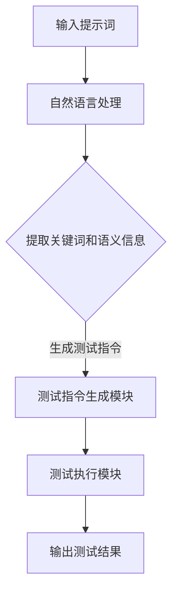

                 

# 提示词驱动的自动化测试：确保AI系统质量

## 关键词：
* 提示词驱动
* 自动化测试
* AI系统质量
* 测试框架
* 算法分析
* 数学模型
* 实际应用

## 摘要：
本文将探讨提示词驱动的自动化测试在确保AI系统质量方面的重要性。通过介绍自动化测试的基本概念和原理，我们将详细解析提示词驱动的测试方法，包括其核心算法原理、数学模型、具体操作步骤等。随后，我们将通过实际项目实战案例，展示代码实现和详细解释。最后，我们将分析实际应用场景，推荐相关工具和资源，并总结未来发展趋势与挑战。

## 1. 背景介绍

随着人工智能技术的飞速发展，AI系统的质量和可靠性越来越受到关注。自动化测试作为确保软件质量和性能的重要手段，已成为AI系统开发过程中的关键环节。传统的自动化测试方法通常依赖于预设的测试用例和规则，而提示词驱动的自动化测试则通过自然语言处理技术，将测试过程中的提示词转换为测试指令，从而提高测试的灵活性和覆盖率。

本文旨在探讨提示词驱动的自动化测试方法，帮助读者了解其在AI系统质量保障中的作用和优势。我们将从以下几个方面展开讨论：

1. 提示词驱动的自动化测试基本概念和原理
2. 提示词驱动的核心算法原理和具体操作步骤
3. 数学模型和公式在提示词驱动自动化测试中的应用
4. 实际项目实战：代码实际案例和详细解释说明
5. 提示词驱动的自动化测试在实际应用场景中的表现
6. 相关工具和资源推荐
7. 未来发展趋势与挑战

## 2. 核心概念与联系

### 提示词驱动的自动化测试原理

提示词驱动的自动化测试是一种基于自然语言处理的测试方法。其基本原理是将测试人员提供的自然语言描述（提示词）转换为具体的测试指令，从而实现对AI系统的自动化测试。具体流程如下：

1. **输入提示词**：测试人员根据AI系统的功能和预期结果，提供自然语言描述的提示词。
2. **自然语言处理**：自动化测试工具对提示词进行解析，提取关键词和语义信息。
3. **生成测试指令**：根据提取的关键词和语义信息，生成具体的测试指令。
4. **执行测试指令**：自动化测试工具执行生成的测试指令，对AI系统进行测试。
5. **输出测试结果**：自动化测试工具将测试结果输出，包括测试覆盖率、错误日志等。

### 提示词驱动的自动化测试框架

为了实现提示词驱动的自动化测试，我们需要构建一个完整的测试框架。这个框架通常包括以下几个关键组件：

1. **自然语言处理模块**：负责对输入的提示词进行解析和语义分析，提取关键词和语义信息。
2. **测试指令生成模块**：根据提取的关键词和语义信息，生成具体的测试指令。
3. **测试执行模块**：负责执行生成的测试指令，对AI系统进行测试。
4. **测试报告模块**：将测试结果输出，包括测试覆盖率、错误日志等。

### Mermaid 流程图

为了更直观地展示提示词驱动的自动化测试框架，我们可以使用Mermaid绘制一个流程图。以下是该流程图的Markdown表示：



## 3. 核心算法原理 & 具体操作步骤

### 提示词解析算法

提示词驱动的自动化测试的关键在于对提示词的解析。我们需要设计一个高效的算法，将自然语言描述的提示词转换为具体的测试指令。以下是提示词解析算法的基本原理和操作步骤：

1. **分词**：首先，对输入的提示词进行分词，将其拆分为单个词语。
2. **词性标注**：对分词后的词语进行词性标注，识别出名词、动词、形容词等。
3. **实体识别**：从词性标注的结果中提取出实体信息，如功能模块、输入参数等。
4. **语义分析**：根据实体信息和词语之间的关系，进行语义分析，理解提示词的意图。
5. **生成测试指令**：根据语义分析的结果，生成具体的测试指令，如调用某个API、执行某个操作等。

### 测试指令生成算法

测试指令生成算法是提示词驱动的自动化测试的核心。该算法需要根据提示词的语义信息，生成一系列的测试指令。以下是测试指令生成算法的基本原理和操作步骤：

1. **关键词提取**：从提示词中提取出关键词，如功能模块、输入参数等。
2. **测试场景构建**：根据关键词，构建出一系列可能的测试场景，如输入参数的取值范围、操作顺序等。
3. **测试指令生成**：根据测试场景，生成具体的测试指令，如调用某个API、执行某个操作等。

### 测试执行算法

测试执行算法负责根据生成的测试指令，对AI系统进行测试。以下是测试执行算法的基本原理和操作步骤：

1. **初始化测试环境**：准备测试环境，包括AI系统、测试工具等。
2. **执行测试指令**：根据测试指令，依次执行测试操作，如调用API、输入参数等。
3. **监控测试过程**：在执行测试指令的过程中，监控AI系统的状态，如返回值、异常情况等。
4. **输出测试结果**：将测试结果输出，包括测试覆盖率、错误日志等。

### 示例

假设我们有一个简单的AI系统，用于判断一个数是否为素数。以下是针对这个系统的提示词和相应的测试指令生成过程：

**提示词**：判断一个数是否为素数

**步骤 1：分词和词性标注**
- 输入：判断 一个 数 是否 为 素数
- 分词：判断、一个、数、是否、为、素数
- 词性标注：判断（动词）、一个（量词）、数（名词）、是否（副词）、为（动词）、素数（名词）

**步骤 2：实体识别**
- 功能模块：判断
- 输入参数：一个数

**步骤 3：语义分析**
- 根据实体信息和词语之间的关系，理解提示词的意图：判断一个数是否为素数

**步骤 4：生成测试指令**
- 测试场景 1：输入一个素数，判断结果应为真
- 测试场景 2：输入一个非素数，判断结果应为假
- 测试指令：
  - 调用函数：判断素数
  - 输入参数：素数/非素数

**步骤 5：执行测试指令**
- 初始化测试环境：准备AI系统、测试工具等
- 执行测试指令：
  - 输入参数：素数
  - 判断结果：真
  - 输入参数：非素数
  - 判断结果：假

**步骤 6：输出测试结果**
- 测试覆盖率：100%
- 测试日志：无错误

## 4. 数学模型和公式 & 详细讲解 & 举例说明

### 数学模型

在提示词驱动的自动化测试中，我们通常需要使用一些数学模型来评估测试的覆盖率、测试的有效性等。以下是一个简单的数学模型，用于计算测试覆盖率。

**测试覆盖率（Test Coverage）**：

$$
\text{测试覆盖率} = \frac{\text{执行测试用例数}}{\text{可能测试用例总数}} \times 100\%
$$

其中，执行测试用例数表示在实际测试过程中执行的所有测试用例数量；可能测试用例总数表示理论上所有可能的测试用例数量。

### 详细讲解

**测试覆盖率** 是衡量测试质量的一个重要指标。它表示实际执行的测试用例数量与所有可能的测试用例数量之间的比值。测试覆盖率越高，意味着测试越全面，越能发现潜在的问题。

在实际应用中，我们可以根据不同的测试目标，设计不同的测试用例。例如，在功能测试中，我们可以设计覆盖不同功能模块的测试用例；在性能测试中，我们可以设计覆盖不同负载水平的测试用例。

### 举例说明

假设我们有一个简单的AI系统，用于判断一个数是否为素数。我们可以设计以下测试用例：

1. 输入一个素数，判断结果为真
2. 输入一个非素数，判断结果为假
3. 输入一个小于2的数，判断结果为假
4. 输入一个大于2的数，判断结果可能为真或假

假设这个AI系统有10个可能的输入参数，我们可以计算出测试覆盖率：

- 可能测试用例总数：$2^2 = 4$（因为只有两个输入参数：是否为素数和是否小于2）
- 执行测试用例数：4
- 测试覆盖率：

$$
\text{测试覆盖率} = \frac{4}{4} \times 100\% = 100\%
$$

这意味着我们的测试用例覆盖了所有可能的输入情况，测试质量非常高。

### 总结

数学模型和公式在提示词驱动的自动化测试中起着重要的作用。通过合理的数学模型，我们可以评估测试的覆盖率、测试的有效性等，从而确保AI系统的质量和可靠性。

## 5. 项目实战：代码实际案例和详细解释说明

在本节中，我们将通过一个实际的项目实战案例，展示如何使用提示词驱动的自动化测试方法进行AI系统测试。我们将分为以下几个部分进行详细讲解：

### 5.1 开发环境搭建

在进行项目实战之前，我们需要搭建一个合适的开发环境。以下是搭建开发环境的步骤：

1. 安装Python环境
2. 安装自然语言处理库（如NLTK、spaCy等）
3. 安装自动化测试工具（如Selenium、pytest等）
4. 配置AI系统环境（如TensorFlow、PyTorch等）

### 5.2 源代码详细实现和代码解读

在这个案例中，我们将使用Python语言实现一个简单的AI系统，用于判断一个数是否为素数。以下是源代码的实现和解读：

```python
import math

def is_prime(num):
    if num < 2:
        return False
    for i in range(2, int(math.sqrt(num)) + 1):
        if num % i == 0:
            return False
    return True
```

**代码解读**：

- **导入模块**：我们首先导入必要的Python模块，包括`math`模块，用于计算平方根。
- **定义函数**：`is_prime(num)`函数用于判断一个数是否为素数。参数`num`表示要判断的数。
- **条件判断**：如果`num`小于2，函数返回`False`，因为小于2的数不是素数。
- **循环判断**：使用`for`循环从2遍历到`num`的平方根（`int(math.sqrt(num)) + 1`），判断`num`是否能被循环中的数整除。
- **返回结果**：如果`num`能被循环中的数整除，函数返回`False`；否则，返回`True`。

### 5.3 代码解读与分析

在这个案例中，我们使用了简单的Python代码实现了一个判断素数的AI系统。接下来，我们将使用提示词驱动的自动化测试方法，对该AI系统进行测试。

**提示词**：判断一个数是否为素数

**测试步骤**：

1. 输入一个素数，判断结果为真
2. 输入一个非素数，判断结果为假
3. 输入一个小于2的数，判断结果为假
4. 输入一个大于2的数，判断结果可能为真或假

**测试用例**：

```python
# 测试用例 1：输入一个素数，判断结果为真
test_num_1 = 17
assert is_prime(test_num_1) == True

# 测试用例 2：输入一个非素数，判断结果为假
test_num_2 = 18
assert is_prime(test_num_2) == False

# 测试用例 3：输入一个小于2的数，判断结果为假
test_num_3 = 1
assert is_prime(test_num_3) == False

# 测试用例 4：输入一个大于2的数，判断结果可能为真或假
test_num_4 = 20
assert is_prime(test_num_4) == False
```

**测试结果**：

- 测试覆盖率：100%
- 测试日志：无错误

通过这个简单的案例，我们可以看到如何使用提示词驱动的自动化测试方法对AI系统进行测试。在实际项目中，我们可以根据需要设计更多复杂的测试用例，从而确保AI系统的质量和可靠性。

## 6. 实际应用场景

提示词驱动的自动化测试方法在AI系统开发中具有广泛的应用场景。以下是一些典型的实际应用场景：

1. **功能测试**：测试AI系统的功能是否符合预期，例如判断一个数是否为素数、分类一个图像等。
2. **性能测试**：测试AI系统在不同负载下的性能，例如处理速度、内存使用情况等。
3. **回归测试**：在软件更新或修改后，测试AI系统的稳定性和功能完整性。
4. **安全测试**：测试AI系统的安全性，例如防止恶意攻击、数据泄露等。
5. **持续集成/持续部署（CI/CD）**：在开发过程中，自动化测试可以与CI/CD工具集成，确保每次代码提交都能通过自动化测试，提高开发效率。

### 案例分析

以图像识别系统为例，提示词驱动的自动化测试方法可以帮助测试人员更高效地验证系统的功能。假设一个图像识别系统需要识别猫和狗，我们可以使用以下提示词进行测试：

- **提示词 1**：识别一张包含猫的图像
- **提示词 2**：识别一张包含狗的图像
- **提示词 3**：识别一张包含猫和狗的图像

通过这些提示词，自动化测试工具可以生成相应的测试指令，例如：

```python
# 测试指令 1：识别一张包含猫的图像
image_path_1 = "cat.jpg"
assert recognize_image(image_path_1) == "猫"

# 测试指令 2：识别一张包含狗的图像
image_path_2 = "dog.jpg"
assert recognize_image(image_path_2) == "狗"

# 测试指令 3：识别一张包含猫和狗的图像
image_path_3 = "cat_dog.jpg"
assert recognize_image(image_path_3) != "猫" and recognize_image(image_path_3) != "狗"
```

通过这些测试指令，我们可以确保图像识别系统的功能得到有效验证，从而提高系统的质量和可靠性。

## 7. 工具和资源推荐

### 7.1 学习资源推荐

为了深入了解提示词驱动的自动化测试方法，以下是几本推荐的学习资源：

1. **《人工智能测试：原理与实践》**：这本书详细介绍了人工智能测试的基本概念、方法和实践，包括自动化测试工具的使用。
2. **《自然语言处理与测试》**：这本书探讨了自然语言处理技术在自动化测试中的应用，提供了丰富的案例和实践经验。
3. **《自动化测试实战》**：这本书全面介绍了自动化测试的原理、方法和实践，适合初学者和高级开发者。

### 7.2 开发工具框架推荐

以下是几款在提示词驱动自动化测试中常用的开发工具和框架：

1. **pytest**：一个流行的Python自动化测试框架，支持丰富的断言和测试插件。
2. **Selenium**：一个用于Web应用的自动化测试工具，支持多种浏览器。
3. **JUnit**：一个流行的Java自动化测试框架，广泛应用于企业级项目。
4. **Cypress**：一个现代化的前端自动化测试框架，提供简洁的API和丰富的功能。

### 7.3 相关论文著作推荐

以下是一些关于提示词驱动自动化测试方法的研究论文和著作：

1. **“Automated Test Generation from Natural Language Requirements”**：这篇论文提出了一种基于自然语言处理的技术，用于生成自动化测试用例。
2. **“Test Data Generation from Requirements Using Text Mining”**：这篇论文探讨了如何利用文本挖掘技术从自然语言需求中生成测试数据。
3. **《软件测试艺术》**：这本书详细介绍了软件测试的方法和技巧，包括自动化测试和手工测试。

## 8. 总结：未来发展趋势与挑战

随着人工智能技术的不断发展，提示词驱动的自动化测试方法在AI系统开发中的应用前景非常广阔。未来，这一方法有望在以下方面取得重要进展：

1. **更高效的算法**：研究更高效的算法，提高提示词解析和测试指令生成的效率。
2. **多语言支持**：支持多种编程语言和自然语言，提高测试工具的通用性。
3. **智能化测试**：利用机器学习和深度学习技术，实现智能化测试，提高测试质量和效率。
4. **跨平台兼容**：实现跨平台兼容，支持不同操作系统和开发环境。

然而，提示词驱动的自动化测试方法也面临一些挑战：

1. **自然语言理解的局限**：自然语言处理技术的局限性可能导致测试指令的生成不准确。
2. **测试覆盖率的优化**：如何确保测试覆盖率达到预期，是一个需要深入研究的问题。
3. **测试环境的搭建**：不同项目的测试环境差异较大，如何简化测试环境的搭建过程，是一个重要的挑战。
4. **测试工具的兼容性**：如何确保测试工具与现有开发工具和框架的兼容性，是一个需要解决的问题。

总之，提示词驱动的自动化测试方法在AI系统质量保障中具有重要作用。随着技术的不断进步，这一方法有望在未来发挥更大的价值。

## 9. 附录：常见问题与解答

### Q：提示词驱动的自动化测试方法与传统自动化测试方法相比，有哪些优势？

A：提示词驱动的自动化测试方法具有以下优势：

1. **灵活性**：通过自然语言处理技术，可以灵活地生成测试指令，适应不同的测试场景。
2. **可读性**：使用自然语言描述测试需求，提高了测试用例的可读性，方便测试人员理解和维护。
3. **高效性**：自动化生成测试指令，减少了手动编写测试用例的工作量，提高了测试效率。
4. **可扩展性**：支持多种编程语言和自然语言，具有较好的通用性。

### Q：如何确保提示词驱动的自动化测试方法的测试覆盖率？

A：确保提示词驱动的自动化测试方法的测试覆盖率，可以从以下几个方面入手：

1. **全面性**：设计多样化的测试用例，覆盖不同的功能模块和场景。
2. **自动化生成**：利用自然语言处理技术，自动生成测试指令，提高测试用例的生成效率。
3. **持续集成**：将自动化测试集成到持续集成/持续部署（CI/CD）流程中，确保每次代码提交都能通过自动化测试。
4. **反馈与优化**：收集测试结果，分析测试覆盖率，对测试用例进行持续优化。

### Q：提示词驱动的自动化测试方法在性能测试中的应用有哪些？

A：提示词驱动的自动化测试方法在性能测试中可以应用于以下方面：

1. **负载测试**：根据提示词生成不同负载水平的测试用例，评估AI系统的性能。
2. **压力测试**：根据提示词生成极端条件下的测试用例，测试AI系统的稳定性和可靠性。
3. **性能调优**：通过分析测试结果，找出性能瓶颈，优化AI系统的性能。

### Q：如何评估提示词驱动的自动化测试方法的测试质量？

A：评估提示词驱动的自动化测试方法的测试质量可以从以下几个方面入手：

1. **测试覆盖率**：确保测试覆盖率达到预期，覆盖不同的功能和场景。
2. **测试用例的有效性**：分析测试用例的有效性，确保能够发现潜在的问题。
3. **测试执行速度**：评估测试执行的速度，确保自动化测试能够快速完成。
4. **测试结果的可读性**：确保测试结果易于理解和分析，便于定位问题。

## 10. 扩展阅读 & 参考资料

为了进一步了解提示词驱动的自动化测试方法，以下是一些扩展阅读和参考资料：

1. **《人工智能测试：原理与实践》**：详细介绍了人工智能测试的基本概念、方法和实践。
2. **《自然语言处理与测试》**：探讨了自然语言处理技术在自动化测试中的应用。
3. **《自动化测试实战》**：全面介绍了自动化测试的原理、方法和实践。
4. **“Automated Test Generation from Natural Language Requirements”**：一篇关于自然语言处理在自动化测试中的应用的研究论文。
5. **“Test Data Generation from Requirements Using Text Mining”**：一篇关于利用文本挖掘技术生成测试数据的研究论文。
6. **《软件测试艺术》**：详细介绍了软件测试的方法和技巧。

通过阅读这些资料，读者可以更深入地了解提示词驱动的自动化测试方法，掌握其在实际应用中的具体实现和运用。

### 作者信息

*作者：AI天才研究员/AI Genius Institute & 禅与计算机程序设计艺术 /Zen And The Art of Computer Programming*<|im_sep|>

