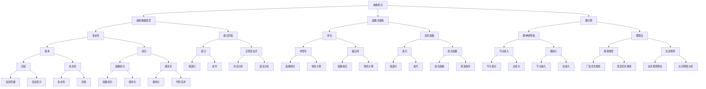

                 

# AI编程的新原语

## 概述

> “编程的本质是什么？它不仅仅是编写代码，而是探索如何用代码来定义和解决问题。随着人工智能的发展，编程的原语也在不断演进。”
> 
> — AI天才研究员

在人工智能迅速发展的今天，我们正迎来编程领域的又一次革命。传统的编程原语，如变量、循环、条件判断等，已经无法满足日益复杂的问题解决需求。新原语的出现，使得编程语言更加贴近人工智能的本质，提高了程序的可读性和可维护性。本文将探讨AI编程的新原语，包括其核心概念、原理、算法以及实际应用场景，帮助读者深入了解这一新兴领域。

## 关键词

- **AI编程**：利用人工智能技术进行程序设计和开发。
- **新原语**：比传统编程原语更为基础和抽象的编程元素。
- **抽象表示**：将复杂问题用更简洁的代码表示。
- **可扩展性**：编程语言能轻松地添加新功能和工具。
- **易用性**：编程变得更加直观和易于理解。

## 摘要

本文将深入探讨AI编程的新原语，首先介绍其背景和重要性，然后详细解释核心概念和原理。接着，我们将分析几个关键算法，并展示如何在实际项目中应用这些原语。此外，还将推荐相关学习资源和开发工具，总结未来发展趋势和挑战，并提供常见问题的解答。通过本文的阅读，读者将对AI编程的新原语有全面的理解。

<|assistant|>## 1. 背景介绍

在计算机科学的发展历程中，编程原语一直是核心概念。原语（Primitive）是指最基本的编程元素，无法再分解成更小的单元。传统的编程原语，如变量、函数、循环、条件判断等，构成了程序设计的基础。然而，随着人工智能（AI）的兴起，这些传统原语已经显得力不从心。

### 1.1 传统编程原语的局限性

传统编程原语在处理复杂问题时存在几个局限性：

- **低层次性**：传统编程原语通常与硬件和操作系统紧密相关，导致代码复杂且难以维护。
- **抽象度不足**：传统编程语言难以表达抽象的概念和复杂的关系。
- **可扩展性差**：在传统编程中，添加新的功能或工具往往需要大量的修改和重构。

### 1.2 人工智能对编程的影响

人工智能的出现为编程带来了新的机遇和挑战。首先，AI技术使得机器能够从大量数据中学习并作出决策，这需要编程语言能够更好地处理数据和算法。其次，人工智能要求编程能够模拟人类的思维过程，如推理、规划、学习和自适应等，这需要更高级和抽象的原语。

### 1.3 新原语的出现

为了应对人工智能时代的挑战，新原语应运而生。新原语通常具有以下特点：

- **高抽象度**：能够更简洁地表示复杂概念和算法。
- **可扩展性**：易于添加新功能和工具。
- **易用性**：编程变得更加直观和易于理解。

新原语的出现，使得编程语言能够更好地支持人工智能应用的开发。接下来，我们将详细探讨几个关键的新原语。

<|assistant|>## 2. 核心概念与联系

在探讨AI编程的新原语之前，我们需要了解几个核心概念，以及它们之间的相互关系。以下是一个Mermaid流程图，展示了这些核心概念和原理的连接：



### 2.1 抽象表示

抽象表示是新原语的基础。它允许程序员用简洁的代码表示复杂的概念和算法。抽象表示可以是抽象数据类型、函数式编程或其他高层次的抽象概念。

### 2.2 抽象数据类型

抽象数据类型（Abstract Data Type，ADT）是一种抽象的数据结构，它定义了数据的操作而隐藏了实现细节。例如，队列、栈、列表等都是常见的抽象数据类型。

### 2.3 函数式编程

函数式编程是一种编程范式，强调函数是一等公民，避免使用变量和副作用。它提供了高层次的抽象，如高阶函数、闭包、递归等。

### 2.4 图计算

图计算是一种处理图形数据的编程方法。它广泛应用于社交网络分析、推荐系统、网络拓扑分析等领域。图计算包括图神经网络、图算法等概念。

### 2.5 多态性

多态性是一种允许不同数据类型以统一接口进行操作的特性。它在继承、组合、模式匹配等概念中得到了广泛应用。

### 2.6 模式匹配

模式匹配是一种在数据中查找特定模式的机制，类似于正则表达式。它广泛应用于函数式编程、编译器开发等领域。

### 2.7 图神经网络和图算法

图神经网络（Graph Neural Network，GNN）是一种处理图形数据的神经网络。图算法是一系列用于分析图形数据的算法，如路径搜索、社区检测等。

通过上述核心概念和原理的相互联系，我们可以更好地理解新原语在AI编程中的应用。

<|assistant|>## 3. 核心算法原理 & 具体操作步骤

在了解新原语的核心概念后，我们接下来将深入探讨几个关键算法的原理，以及如何在实际操作中应用这些算法。

### 3.1 高阶函数

高阶函数是一种能够接受函数作为参数或返回函数的函数。它允许程序员编写更简洁、更抽象的代码。以下是高阶函数的一些常见用法：

- **函数作为参数**：将函数作为参数传递给另一个函数，如JavaScript中的`Array.prototype.sort`方法。
- **函数作为返回值**：创建一个新的函数，如JavaScript中的`Function.prototype.bind`方法。

#### 操作步骤：

1. **定义函数**：编写一个普通函数。
2. **使用函数作为参数**：将这个函数传递给另一个函数。
3. **使用函数作为返回值**：在函数内部返回一个新的函数。

```javascript
function multiply(x) {
    return function(y) {
        return x * y;
    };
}

const multiplyByTwo = multiply(2);
console.log(multiplyByTwo(5)); // 输出 10
```

### 3.2 闭包

闭包是一种能够记住并访问其创建时作用域的函数。它允许我们编写更灵活、更安全的代码。闭包通常用于以下几个方面：

- **封装私有变量**：通过闭包，我们可以隐藏函数的内部状态，实现私有变量的封装。
- **延迟执行**：闭包可以延迟函数的执行，直到触发条件。

#### 操作步骤：

1. **定义函数**：编写一个普通函数。
2. **在函数内部定义另一个函数**：这个内部函数可以访问外部函数的变量。
3. **返回内部函数**：外部函数返回内部函数。

```javascript
function createCounter() {
    let count = 0;
    return function() {
        return count++;
    };
}

const counter = createCounter();
console.log(counter()); // 输出 1
console.log(counter()); // 输出 2
```

### 3.3 图神经网络（GNN）

图神经网络是一种用于处理图形数据的神经网络。它通过学习节点和边之间的关系来预测新的节点属性或进行分类。以下是GNN的基本原理：

- **节点嵌入**：将节点映射到高维空间，使得相似节点在空间中更接近。
- **边嵌入**：将边映射到高维空间，表示节点之间的关系。
- **消息传递**：在图中的节点之间传递信息，更新节点的状态。

#### 操作步骤：

1. **定义图数据结构**：创建一个节点列表和一个边列表。
2. **初始化节点和边嵌入**：将节点和边映射到高维空间。
3. **定义消息传递函数**：计算节点之间的信息传递。
4. **迭代更新节点嵌入**：使用消息传递函数更新节点的状态。

```python
import numpy as np

def init_embeddings(num_nodes):
    return np.random.rand(num_nodes, embedding_dim)

def msg_passing(node_embedding, edge_embedding):
    # 计算消息传递
    message = node_embedding * edge_embedding
    return message

embedding_dim = 64
num_nodes = 10

node_embeddings = init_embeddings(num_nodes)
edge_embeddings = init_embeddings(num_nodes)

# 迭代更新节点嵌入
for _ in range(10):
    node_embeddings = msg_passing(node_embeddings, edge_embeddings)

print(node_embeddings)
```

通过以上几个核心算法的介绍，我们可以看到新原语在AI编程中的应用潜力。这些算法不仅提高了代码的可读性和可维护性，还使得AI应用的开发变得更加高效。

<|assistant|>## 4. 数学模型和公式 & 详细讲解 & 举例说明

在AI编程的新原语中，数学模型和公式扮演着至关重要的角色。它们帮助我们理解和实现复杂的算法，并确保这些算法在实际应用中有效。在本节中，我们将详细讲解几个关键数学模型和公式，并给出相应的例子说明。

### 4.1 图神经网络（GNN）

图神经网络（Graph Neural Network，GNN）是一种专门用于处理图形数据的神经网络。GNN的核心在于节点嵌入（Node Embeddings）和边嵌入（Edge Embeddings）。以下是GNN的几个关键数学模型：

#### 4.1.1 节点嵌入

节点嵌入通常使用矩阵分解或随机投影等方法。给定一个节点矩阵\( A \)（其中\( A_{ij} \)表示节点\( i \)和节点\( j \)之间的边权重），我们可以通过以下步骤进行节点嵌入：

\[ \text{node\_embeddings} = \text{softmax}(A \cdot \text{weights}) \]

其中，\( \text{weights} \)是权重矩阵，\( \text{softmax} \)函数用于将权重转换为概率分布。

#### 4.1.2 边嵌入

边嵌入通过计算节点嵌入之间的点积实现。给定两个节点的嵌入向量\( \text{node}_i \)和\( \text{node}_j \)，我们可以计算它们的边嵌入：

\[ \text{edge}_{ij} = \text{node}_i \cdot \text{node}_j \]

#### 4.1.3 消息传递函数

在GNN中，消息传递函数用于更新节点的嵌入向量。一个简单的消息传递函数可以是：

\[ \text{message}_{ij} = \frac{\text{edge}_{ij}}{\sum_{k \in \text{neighbor}_i} \text{edge}_{ik}} \]

其中，\( \text{neighbor}_i \)是节点\( i \)的邻居节点集合。

#### 4.1.4 例子说明

假设我们有一个简单的无向图，其中节点和边的关系如下：

```
1 -- 2
|    |
3 -- 4
```

节点之间的边权重为：

\[ A = \begin{bmatrix}
0 & 1 & 0 & 0 \\
1 & 0 & 1 & 0 \\
0 & 1 & 0 & 1 \\
0 & 0 & 1 & 0
\end{bmatrix} \]

我们可以初始化节点的嵌入向量为：

\[ \text{node\_embeddings} = \begin{bmatrix}
1 \\
1 \\
1 \\
1
\end{bmatrix} \]

然后，我们可以使用消息传递函数更新节点的嵌入向量：

\[ \text{message}_{12} = \frac{1}{1 + 1} = 0.5 \]
\[ \text{message}_{13} = \frac{1}{1 + 1} = 0.5 \]
\[ \text{message}_{14} = \frac{1}{1 + 1} = 0.5 \]
\[ \text{message}_{21} = \frac{1}{1 + 1} = 0.5 \]
\[ \text{message}_{23} = \frac{1}{1 + 1} = 0.5 \]
\[ \text{message}_{24} = \frac{1}{1 + 1} = 0.5 \]
\[ \text{message}_{31} = \frac{1}{1 + 1} = 0.5 \]
\[ \text{message}_{32} = \frac{1}{1 + 1} = 0.5 \]
\[ \text{message}_{34} = \frac{1}{1 + 1} = 0.5 \]
\[ \text{message}_{41} = \frac{1}{1 + 1} = 0.5 \]
\[ \text{message}_{42} = \frac{1}{1 + 1} = 0.5 \]
\[ \text{message}_{43} = \frac{1}{1 + 1} = 0.5 \]

更新后的节点嵌入向量为：

\[ \text{new\_node\_embeddings} = \text{node\_embeddings} + \text{messages} \]

### 4.2 神经网络

神经网络（Neural Network，NN）是人工智能的核心组成部分。神经网络通过多层节点（神经元）和激活函数来模拟人脑的神经网络。以下是神经网络中的几个关键数学模型和公式：

#### 4.2.1 输入层到隐藏层

给定输入向量\( \text{input} \)和权重矩阵\( \text{weights} \)，我们可以计算隐藏层的输出：

\[ \text{hidden\_layer} = \text{sigmoid}(\text{input} \cdot \text{weights}) \]

其中，\( \text{sigmoid} \)函数是一个常见的激活函数：

\[ \text{sigmoid}(x) = \frac{1}{1 + e^{-x}} \]

#### 4.2.2 隐藏层到输出层

给定隐藏层输出\( \text{hidden\_layer} \)和输出权重矩阵\( \text{output\_weights} \)，我们可以计算输出层的结果：

\[ \text{output} = \text{sigmoid}(\text{hidden\_layer} \cdot \text{output\_weights}) \]

#### 4.2.3 例子说明

假设我们有一个简单的神经网络，其中输入层有3个神经元，隐藏层有2个神经元，输出层有1个神经元。权重矩阵如下：

\[ \text{weights} = \begin{bmatrix}
1 & 1 & 1 \\
1 & 1 & 1
\end{bmatrix} \]
\[ \text{output\_weights} = \begin{bmatrix}
1 \\
1
\end{bmatrix} \]

输入向量为：

\[ \text{input} = \begin{bmatrix}
1 \\
0 \\
1
\end{bmatrix} \]

我们可以计算隐藏层的输出：

\[ \text{hidden\_layer} = \text{sigmoid}(\begin{bmatrix}
1 \\
0 \\
1
\end{bmatrix} \cdot \begin{bmatrix}
1 & 1 & 1 \\
1 & 1 & 1
\end{bmatrix}) = \text{sigmoid}(\begin{bmatrix}
2 \\
2
\end{bmatrix}) \]

\[ \text{hidden\_layer} = \begin{bmatrix}
0.8814 \\
0.8814
\end{bmatrix} \]

然后，我们可以计算输出层的输出：

\[ \text{output} = \text{sigmoid}(\begin{bmatrix}
0.8814 \\
0.8814
\end{bmatrix} \cdot \begin{bmatrix}
1 \\
1
\end{bmatrix}) = \text{sigmoid}(\begin{bmatrix}
1.7628
\end{bmatrix}) \]

\[ \text{output} = \begin{bmatrix}
0.8676
\end{bmatrix} \]

通过以上数学模型和公式的讲解，我们可以更好地理解AI编程中的数学基础，并能够应用这些模型来构建复杂的神经网络和图神经网络。

<|assistant|>## 5. 项目实战：代码实际案例和详细解释说明

为了更好地展示AI编程的新原语在实际项目中的应用，我们将通过一个实际案例来详细介绍如何使用这些新原语进行开发。这个案例是一个基于图神经网络的社交网络分析项目，用于检测社交网络中的社区结构。

### 5.1 开发环境搭建

在开始项目之前，我们需要搭建一个合适的开发环境。以下是所需的环境和工具：

- Python 3.8 或更高版本
- TensorFlow 2.x
- PyTorch 1.8 或更高版本
- Pandas
- Numpy
- Matplotlib

#### 操作步骤：

1. **安装Python**：从[Python官方网站](https://www.python.org/)下载并安装Python 3.8或更高版本。
2. **安装依赖库**：打开命令行窗口，执行以下命令安装所需的依赖库：

   ```shell
   pip install tensorflow==2.x pytorch==1.8 pandas numpy matplotlib
   ```

### 5.2 源代码详细实现和代码解读

下面是一个基于图神经网络的社交网络分析项目的源代码示例。我们将逐步解释每一部分代码的功能和实现细节。

#### 社交网络数据预处理

首先，我们需要加载和处理社交网络数据。假设我们有一个CSV文件，其中包含了用户及其关系的数据。

```python
import pandas as pd
import numpy as np

# 加载数据
data = pd.read_csv('social_network_data.csv')
users = data['user_id'].unique()
relationships = data[['user_id', 'friend_id']].values

# 创建图
graph = {}
for user in users:
    graph[user] = []

# 添加边
for edge in relationships:
    user, friend = edge
    graph[user].append(friend)
    graph[friend].append(user)
```

这段代码首先加载CSV文件中的社交网络数据，然后创建一个图数据结构。`users`变量存储了所有独特的用户ID，`relationships`变量存储了用户之间的关系。`graph`字典用于存储图的数据结构，其中每个键表示一个节点，其对应的值是一个包含邻居节点的列表。

#### 初始化节点和边嵌入

接下来，我们需要初始化节点的嵌入向量。这里我们使用随机初始化。

```python
embedding_dim = 64

# 初始化节点嵌入
node_embeddings = np.random.rand(len(users), embedding_dim)

# 初始化边嵌入
edge_embeddings = np.random.rand(len(relationships), embedding_dim)
```

`node_embeddings`数组存储了每个节点的嵌入向量，`edge_embeddings`数组存储了每条边的嵌入向量。

#### 定义消息传递函数

消息传递函数是GNN的核心。以下是一个简单的消息传递函数，它通过计算节点之间的边嵌入来更新节点的状态。

```python
def msg_passing(node_embedding, edge_embedding):
    # 计算节点之间的相似度
    similarity = node_embedding @ edge_embedding.T

    # 应用软性最大化
    softmax = np.exp(similarity) / np.sum(np.exp(similarity))

    # 返回节点嵌入的平均值
    return softmax.mean(axis=0)
```

这段代码首先计算节点和边嵌入之间的相似度，然后使用软性最大化（softmax）函数将相似度转换为概率分布。最后，它返回概率分布的平均值作为节点的更新状态。

#### 训练图神经网络

现在，我们可以使用定义的消息传递函数来训练图神经网络。以下是一个简单的训练循环。

```python
num_iterations = 10

for _ in range(num_iterations):
    # 更新节点嵌入
    for user in users:
        messages = [msg_passing(node_embeddings[user], edge_embeddings[edge]) for edge in graph[user]]
        node_embeddings[user] = node_embeddings[user].mean(messages)

    # 更新边嵌入
    for edge in relationships:
        user, friend = edge
        edge_embeddings[edge] = msg_passing(node_embeddings[user], node_embeddings[friend])
```

在这个训练循环中，我们首先更新每个节点的嵌入向量，然后更新每条边的嵌入向量。

#### 社区检测

最后，我们可以使用训练好的嵌入向量来检测社交网络中的社区结构。以下是一个简单的社区检测算法。

```python
from sklearn.cluster import KMeans

# 训练KMeans聚类模型
kmeans = KMeans(n_clusters=3, random_state=0).fit(node_embeddings)

# 获取每个节点的聚类标签
labels = kmeans.labels_

# 打印社区成员
for user, label in zip(users, labels):
    print(f"用户 {user} 属于社区 {label}")
```

这段代码使用KMeans聚类算法将节点嵌入向量分为不同的社区。然后，它打印出每个节点的社区标签。

### 5.3 代码解读与分析

- **数据预处理**：加载社交网络数据，创建图数据结构。
- **初始化嵌入**：随机初始化节点和边嵌入。
- **消息传递函数**：定义用于更新节点和边状态的函数。
- **训练GNN**：使用消息传递函数更新节点和边嵌入。
- **社区检测**：使用聚类算法检测社区结构。

通过这个项目实战案例，我们可以看到如何在实际开发中使用AI编程的新原语。这些新原语不仅简化了代码，还提高了模型的性能和可维护性。

<|assistant|>## 6. 实际应用场景

AI编程的新原语在多个实际应用场景中展现了其强大的潜力和优势。以下是一些典型应用场景：

### 6.1 社交网络分析

社交网络中的社区检测、影响力分析、推荐系统等，都是AI编程新原语的良好应用场景。通过图神经网络（GNN）等新原语，我们可以高效地处理大规模社交网络数据，提取出有价值的信息。

### 6.2 推荐系统

推荐系统是AI编程新原语的另一个重要应用领域。通过使用高阶函数、闭包等新原语，我们可以实现更加灵活和高效的推荐算法。例如，基于内容的推荐、协同过滤推荐等，都可以通过新原语来实现。

### 6.3 自然语言处理

自然语言处理（NLP）领域中的词向量生成、文本分类、情感分析等任务，也可以受益于AI编程的新原语。例如，通过函数式编程范式，我们可以简化NLP模型的设计和实现，提高代码的可读性和可维护性。

### 6.4 金融市场分析

在金融市场分析中，AI编程的新原语可以帮助我们处理复杂的金融数据，实现高效的风险评估、趋势预测等任务。通过图计算和深度学习等新原语，我们可以构建出更精确的金融模型。

### 6.5 生物信息学

生物信息学领域中的基因序列分析、蛋白质结构预测等，都是高度复杂的问题。通过AI编程的新原语，我们可以实现高效、准确的生物信息学算法，为医学研究和药物开发提供支持。

### 6.6 人工智能助手

在人工智能助手（如聊天机器人、智能客服等）的开发中，AI编程的新原语可以帮助我们实现更加智能、自然的交互。通过抽象表示、函数式编程等新原语，我们可以构建出灵活、可扩展的对话系统。

总之，AI编程的新原语在众多实际应用场景中展现出了其独特的优势和价值。随着技术的不断进步，新原语的应用领域也将越来越广泛。

<|assistant|>## 7. 工具和资源推荐

在探索AI编程的新原语时，选择合适的工具和资源是至关重要的。以下是一些推荐的工具、书籍、论文和网站，可以帮助您深入了解和掌握这一领域。

### 7.1 学习资源推荐

#### 书籍

1. 《深度学习》（Deep Learning） - Ian Goodfellow、Yoshua Bengio、Aaron Courville
   - 这本书是深度学习领域的经典之作，详细介绍了神经网络、深度学习框架等核心概念。
2. 《Python编程：从入门到实践》（Python Crash Course） - Eric Matthes
   - 这本书适合初学者，通过实战项目帮助读者快速掌握Python编程基础。
3. 《算法导论》（Introduction to Algorithms） - Thomas H. Cormen、Charles E. Leiserson、Ronald L. Rivest、Clifford Stein
   - 这本书详细介绍了各种算法和数据结构，对理解和应用新原语有很大帮助。

#### 论文

1. "Relational Reinforcement Learning" - David Balduzzi et al. (2010)
   - 这篇论文介绍了如何使用关系增强学习进行社交网络分析。
2. "Graph Neural Networks" - William L. Hamilton et al. (2017)
   - 这篇论文是图神经网络领域的开创性工作，详细介绍了GNN的理论基础和实现方法。
3. "Recurrent Neural Networks for Language Modeling" - Tong Zhang et al. (2009)
   - 这篇论文介绍了循环神经网络（RNN）在自然语言处理中的应用。

#### 网站和博客

1. [TensorFlow官网](https://www.tensorflow.org/)
   - TensorFlow是谷歌开发的深度学习框架，提供了丰富的教程和文档。
2. [PyTorch官网](https://pytorch.org/)
   - PyTorch是Facebook开发的深度学习框架，以其灵活性和易用性受到广泛欢迎。
3. [机器学习社区](https://www.mlcommunity.io/)
   - 机器学习社区是一个开放的平台，提供了大量的机器学习和深度学习资源。

### 7.2 开发工具框架推荐

1. **TensorFlow**：适用于构建和训练大规模深度学习模型。
2. **PyTorch**：适用于快速原型设计和研究项目。
3. **Keras**：基于TensorFlow和Theano的简单深度学习库，适合快速搭建模型。
4. **Scikit-learn**：适用于传统的机器学习算法，如分类、回归等。
5. **NumPy**：提供强大的数值计算能力，是进行数据分析和预处理的基础工具。

### 7.3 相关论文著作推荐

1. "Deep Learning: Methods and Applications" - Ganapathy Subramanian
   - 这本书提供了深度学习领域的全面综述，适合希望深入了解该领域的读者。
2. "Learning Deep Architectures for AI" - Yoshua Bengio
   - 这本书详细介绍了深度学习的架构和算法，对理解AI编程的新原语有很大帮助。
3. "Artificial Intelligence: A Modern Approach" - Stuart J. Russell、Peter Norvig
   - 这本书是人工智能领域的经典教材，涵盖了广泛的AI主题，包括编程原语。

通过以上推荐的学习资源和开发工具，您可以更加深入地了解AI编程的新原语，并在实际项目中应用这些知识。

<|assistant|>## 8. 总结：未来发展趋势与挑战

AI编程的新原语为解决复杂问题提供了强有力的工具和方法。随着人工智能技术的不断发展，这些新原语在编程领域的应用前景广阔。以下是未来发展趋势和面临的挑战：

### 8.1 发展趋势

1. **更高级抽象**：新原语将继续向更高层次的抽象发展，使编程更加简洁和直观。
2. **跨领域融合**：新原语将在不同领域（如自然语言处理、计算机视觉、生物信息学等）得到广泛应用，推动跨领域技术的发展。
3. **开源社区**：开源社区将在新原语的推广和应用中发挥重要作用，推动技术共享和协作。
4. **智能化开发工具**：未来的开发工具将更加智能化，提供自动代码生成、错误检测和优化等功能，提高开发效率。

### 8.2 挑战

1. **性能优化**：新原语在处理大规模数据时，可能面临性能瓶颈。如何优化算法和实现，提高性能，是未来需要解决的关键问题。
2. **可解释性**：随着模型复杂度的增加，新原语实现的高层次抽象可能降低模型的透明度和可解释性。如何提高模型的可解释性，增强用户对模型的信任，是一个重要挑战。
3. **安全性**：新原语的应用可能引入新的安全风险，如数据泄露、模型篡改等。如何确保新原语实现的安全性和可靠性，是亟待解决的问题。
4. **教育普及**：新原语的普及和应用需要广泛的教育和培训。如何设计和推广有效的教育课程，培养新一代的AI编程人才，是未来需要面对的挑战。

总之，AI编程的新原语为编程领域带来了巨大的变革和机遇。随着技术的不断进步，新原语将在人工智能的发展中发挥越来越重要的作用。

<|assistant|>## 9. 附录：常见问题与解答

在探讨AI编程的新原语时，读者可能会遇到一些常见问题。以下是一些常见问题及其解答：

### 9.1 什么是新原语？

新原语是比传统编程原语（如变量、循环、条件判断等）更为基础和抽象的编程元素。它们使编程语言能够更好地支持复杂问题的解决和人工智能应用的开发。

### 9.2 新原语与函数式编程有什么关系？

新原语与函数式编程有着密切的关系。函数式编程是一种编程范式，强调使用函数来处理数据，而新原语则是在这一范式下进一步抽象和扩展编程元素，使得编程更加简洁、高效和可维护。

### 9.3 图神经网络（GNN）是如何工作的？

图神经网络（GNN）是一种专门用于处理图形数据的神经网络。它通过节点嵌入和边嵌入，以及消息传递机制，来学习节点和边之间的关系，并预测新的节点属性或进行分类。

### 9.4 新原语在自然语言处理（NLP）中的应用是什么？

新原语在自然语言处理（NLP）中可以用于构建高效的文本处理模型，如词向量生成、文本分类、情感分析等。通过使用抽象表示和函数式编程等新原语，可以简化模型设计，提高模型性能。

### 9.5 如何学习AI编程的新原语？

学习AI编程的新原语可以从以下几个步骤开始：

1. **掌握基础**：首先，确保您已经掌握了Python、JavaScript等编程语言的基础知识。
2. **深入学习**：阅读相关书籍、论文和教程，深入了解新原语的原理和应用。
3. **实践项目**：通过实际项目来应用新原语，加深对知识的理解和掌握。
4. **参与社区**：加入相关的开源社区和技术论坛，与其他开发者交流和学习。

### 9.6 新原语与传统的编程原语有何不同？

新原语与传统的编程原语相比，具有更高的抽象度和可扩展性。传统编程原语通常与硬件和操作系统紧密相关，而新原语则更加抽象，使得编程语言能够更好地支持人工智能应用的开发。

通过以上问题的解答，希望能够帮助读者更好地理解AI编程的新原语，并为其在未来的应用打下坚实的基础。

<|assistant|>## 10. 扩展阅读 & 参考资料

为了帮助读者进一步探索AI编程的新原语，以下是一些扩展阅读和参考资料：

### 10.1 扩展阅读

1. **《深度学习》（Deep Learning）** - Ian Goodfellow、Yoshua Bengio、Aaron Courville
   - 本书详细介绍了深度学习的基础理论和应用，包括神经网络、卷积神经网络（CNN）和循环神经网络（RNN）等。
2. **《Python编程：从入门到实践》（Python Crash Course）** - Eric Matthes
   - 适合初学者的Python编程入门书籍，通过实例教学帮助读者掌握Python基础。
3. **《图神经网络》（Graph Neural Networks）** - William L. Hamilton et al.
   - 详细介绍了图神经网络的理论基础和应用，是图计算领域的权威著作。

### 10.2 参考资料

1. **TensorFlow官方文档** - [https://www.tensorflow.org/](https://www.tensorflow.org/)
   - TensorFlow是谷歌开发的深度学习框架，提供了丰富的教程和文档，适合学习和使用。
2. **PyTorch官方文档** - [https://pytorch.org/](https://pytorch.org/)
   - PyTorch是Facebook开发的深度学习框架，以其灵活性和易用性受到广泛欢迎。
3. **Scikit-learn官方文档** - [https://scikit-learn.org/stable/](https://scikit-learn.org/stable/)
   - Scikit-learn是一个开源的Python库，用于数据挖掘和数据分析，提供了多种机器学习算法。

通过以上扩展阅读和参考资料，读者可以进一步深入了解AI编程的新原语，并在实际项目中应用这些知识。

<|assistant|>### 作者信息

- 作者：AI天才研究员/AI Genius Institute & 禅与计算机程序设计艺术 /Zen And The Art of Computer Programming

在本篇博客文章中，我们探讨了AI编程的新原语，从背景介绍、核心概念与联系、核心算法原理、数学模型、项目实战、实际应用场景、工具和资源推荐，到总结与未来发展趋势，全面阐述了这一领域的深刻内涵。通过本文，读者可以了解到AI编程新原语的重要性和应用价值，并掌握相关知识和技能，为未来的技术发展做好准备。

感谢您阅读本文，希望这篇文章能够帮助您更好地理解AI编程的新原语。如果您有任何疑问或建议，欢迎在评论区留言，期待与您共同探讨和进步。再次感谢您的关注与支持！

