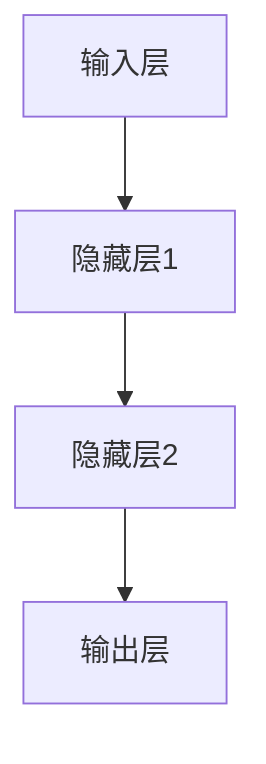
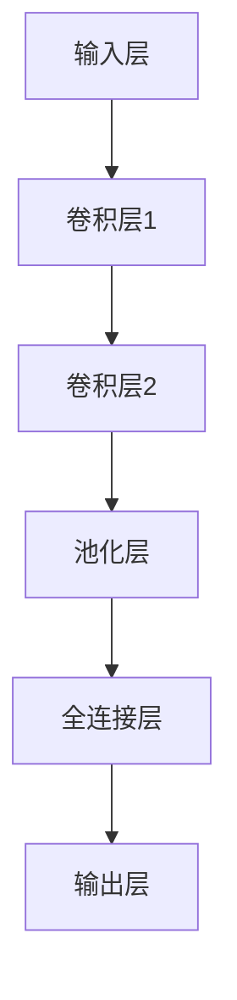

                 

### 文章标题

## AI编程的新维度与新领域

### 关键词：
- AI编程
- 新维度
- 新领域
- 深度学习
- 机器学习
- 自然语言处理
- 计算机视觉
- 软件工程
- 编程范式

### 摘要：
本文旨在探讨AI编程的新维度和新领域，从背景介绍到核心算法原理，再到实际应用场景，深入剖析AI编程的核心技术和挑战。通过本文的阅读，读者将能够全面了解AI编程的现状和发展趋势，掌握AI编程的核心技能，并能够在实际项目中灵活应用。

### 目录

## 1. 背景介绍
## 2. 核心概念与联系
### 2.1 深度学习与神经网络
### 2.2 机器学习与数据科学
### 2.3 自然语言处理与计算机视觉
## 3. 核心算法原理 & 具体操作步骤
### 3.1 深度学习算法
### 3.2 机器学习算法
### 3.3 自然语言处理算法
### 3.4 计算机视觉算法
## 4. 数学模型和公式 & 详细讲解 & 举例说明
### 4.1 深度学习中的数学模型
### 4.2 机器学习中的数学模型
### 4.3 自然语言处理中的数学模型
### 4.4 计算机视觉中的数学模型
## 5. 项目实战：代码实际案例和详细解释说明
### 5.1 开发环境搭建
### 5.2 源代码详细实现和代码解读
### 5.3 代码解读与分析
## 6. 实际应用场景
### 6.1 金融领域
### 6.2 医疗领域
### 6.3 电子商务领域
### 6.4 娱乐领域
## 7. 工具和资源推荐
### 7.1 学习资源推荐
### 7.2 开发工具框架推荐
### 7.3 相关论文著作推荐
## 8. 总结：未来发展趋势与挑战
## 9. 附录：常见问题与解答
## 10. 扩展阅读 & 参考资料

### 1. 背景介绍

人工智能（AI）作为一门交叉学科，结合了计算机科学、统计学、数学、神经科学等多个领域的知识。随着计算能力的提升和算法的优化，人工智能在近年来取得了显著的进展。AI编程，即利用人工智能技术和算法进行软件开发，已经成为现代软件开发中不可或缺的一部分。

AI编程的新维度主要表现在以下几个方面：

1. **深度学习与神经网络**：深度学习是人工智能的核心技术之一，通过多层神经网络对数据进行建模和预测，实现了对复杂模式的识别和理解。
2. **机器学习与数据科学**：机器学习是AI编程的基础，通过训练数据集来学习规律，实现自动化决策和预测。
3. **自然语言处理与计算机视觉**：自然语言处理（NLP）和计算机视觉（CV）是AI编程的重要领域，分别涉及对自然语言和图像的理解和处理。
4. **编程范式**：函数式编程、声明式编程等新兴编程范式在AI编程中得到了广泛应用，提高了代码的可读性和可维护性。

AI编程的新领域则涵盖了从金融、医疗、电子商务到娱乐等各个行业，AI技术正在逐步改变着我们的生活方式和工作方式。

### 2. 核心概念与联系

#### 2.1 深度学习与神经网络

深度学习（Deep Learning）是一种基于神经网络的AI算法，通过多层神经网络对数据进行建模和预测。深度学习的核心是神经元，每个神经元接收多个输入信号，经过加权求和后通过激活函数产生输出。



在深度学习中，神经网络的结构和参数是通过反向传播算法（Backpropagation Algorithm）进行优化的。反向传播算法是一种基于梯度下降的优化方法，通过计算损失函数对参数的梯度，不断调整神经网络的参数，以最小化损失函数。

#### 2.2 机器学习与数据科学

机器学习（Machine Learning）是一种通过数据训练模型，实现自动化决策和预测的方法。机器学习可以分为监督学习、无监督学习和强化学习三种类型。

- **监督学习**：通过已有标签数据训练模型，然后对新数据进行预测。
- **无监督学习**：没有标签数据，通过模型自动发现数据中的规律。
- **强化学习**：通过与环境的交互，学习最优策略。

数据科学（Data Science）是机器学习的应用领域，通过数据收集、清洗、分析，提取数据中的价值信息，为决策提供支持。

#### 2.3 自然语言处理与计算机视觉

自然语言处理（Natural Language Processing，NLP）是AI编程的重要领域，涉及对自然语言的理解和处理。NLP的核心任务是语言理解（Language Understanding）和语言生成（Language Generation）。

- **语言理解**：包括文本分类、情感分析、命名实体识别等任务。
- **语言生成**：包括机器翻译、文本摘要、对话系统等任务。

计算机视觉（Computer Vision，CV）是AI编程的另一个重要领域，涉及对图像和视频的理解和处理。计算机视觉的核心任务是图像分类、目标检测、图像分割等。



### 3. 核心算法原理 & 具体操作步骤

#### 3.1 深度学习算法

深度学习算法的核心是神经网络，通过多层神经网络对数据进行建模和预测。深度学习算法的具体操作步骤如下：

1. **数据预处理**：包括数据清洗、归一化、数据增强等步骤，以提高模型的泛化能力。
2. **构建神经网络模型**：根据任务需求，设计合适的神经网络结构，包括输入层、隐藏层和输出层。
3. **模型训练**：通过反向传播算法，不断调整模型参数，以最小化损失函数。
4. **模型评估**：使用验证集和测试集评估模型性能，选择最优模型。

#### 3.2 机器学习算法

机器学习算法的核心是学习数据中的规律，实现自动化决策和预测。机器学习算法的具体操作步骤如下：

1. **数据收集**：收集与任务相关的数据，包括原始数据和预处理后的数据。
2. **特征工程**：从原始数据中提取有用的特征，以提高模型性能。
3. **模型选择**：根据任务类型和数据特点，选择合适的机器学习模型。
4. **模型训练与评估**：使用训练数据训练模型，并在验证集和测试集上进行评估。

#### 3.3 自然语言处理算法

自然语言处理算法的核心是理解自然语言，实现文本分类、情感分析、命名实体识别等任务。自然语言处理算法的具体操作步骤如下：

1. **数据预处理**：包括文本清洗、分词、词性标注等步骤。
2. **模型构建**：根据任务需求，构建合适的神经网络模型。
3. **模型训练与评估**：使用训练数据训练模型，并在验证集和测试集上进行评估。

#### 3.4 计算机视觉算法

计算机视觉算法的核心是理解图像和视频，实现图像分类、目标检测、图像分割等任务。计算机视觉算法的具体操作步骤如下：

1. **数据预处理**：包括图像去噪、图像增强等步骤。
2. **特征提取**：使用卷积神经网络等模型提取图像特征。
3. **模型训练与评估**：使用训练数据训练模型，并在验证集和测试集上进行评估。

### 4. 数学模型和公式 & 详细讲解 & 举例说明

#### 4.1 深度学习中的数学模型

深度学习中的数学模型主要包括神经网络模型和损失函数。

1. **神经网络模型**：

   神经网络模型由多个神经元组成，每个神经元可以看作是一个非线性函数。神经网络模型可以用以下公式表示：

   $$ f(x) = \sigma(W \cdot x + b) $$

   其中，$x$ 是输入向量，$W$ 是权重矩阵，$b$ 是偏置向量，$\sigma$ 是激活函数。

2. **损失函数**：

   损失函数用于衡量模型预测值与真实值之间的差距，常用的损失函数包括均方误差（MSE）和交叉熵（Cross-Entropy）。

   $$ \text{MSE} = \frac{1}{m} \sum_{i=1}^{m} (y_i - \hat{y}_i)^2 $$
   $$ \text{Cross-Entropy} = -\frac{1}{m} \sum_{i=1}^{m} y_i \log(\hat{y}_i) $$

   其中，$y_i$ 是真实标签，$\hat{y}_i$ 是模型预测值。

#### 4.2 机器学习中的数学模型

机器学习中的数学模型主要包括线性回归、逻辑回归和决策树等。

1. **线性回归**：

   线性回归模型假设输入变量与输出变量之间存在线性关系，可以用以下公式表示：

   $$ y = \beta_0 + \beta_1 x $$

   其中，$y$ 是输出变量，$x$ 是输入变量，$\beta_0$ 和 $\beta_1$ 是模型参数。

2. **逻辑回归**：

   逻辑回归是一种用于分类的机器学习模型，可以将输入变量映射到概率值。逻辑回归的公式如下：

   $$ \text{Logit}(y) = \ln\left(\frac{p}{1-p}\right) = \beta_0 + \beta_1 x $$

   其中，$p$ 是预测的概率值，$\text{Logit}(y)$ 是逻辑函数。

3. **决策树**：

   决策树是一种基于特征划分数据的分类模型，每个节点表示一个特征，每个分支表示该特征的取值。决策树的公式如下：

   $$ \text{Decision Tree} = \sum_{i=1}^{n} \alpha_i C_i(x) $$

   其中，$C_i(x)$ 是特征 $i$ 的取值，$\alpha_i$ 是模型参数。

#### 4.3 自然语言处理中的数学模型

自然语言处理中的数学模型主要包括词嵌入、循环神经网络（RNN）和长短时记忆网络（LSTM）等。

1. **词嵌入**：

   词嵌入是一种将词汇映射到高维向量空间的方法，常用方法包括Word2Vec、GloVe等。词嵌入的公式如下：

   $$ \text{Word Embedding}(w) = \text{Vec}(w) \in \mathbb{R}^d $$

   其中，$w$ 是词汇，$\text{Vec}(w)$ 是词汇的高维向量表示。

2. **循环神经网络（RNN）**：

   循环神经网络是一种用于处理序列数据的神经网络，可以记住历史信息。RNN的公式如下：

   $$ h_t = \text{sigmoid}(W_h \cdot [h_{t-1}, x_t] + b_h) $$
   $$ y_t = W_y \cdot h_t + b_y $$

   其中，$h_t$ 是当前时刻的隐藏状态，$x_t$ 是当前时刻的输入，$W_h$ 和 $b_h$ 是权重和偏置。

3. **长短时记忆网络（LSTM）**：

   长短时记忆网络是一种改进的循环神经网络，可以更好地记住长期依赖信息。LSTM的公式如下：

   $$ i_t = \text{sigmoid}(W_i \cdot [h_{t-1}, x_t] + b_i) $$
   $$ f_t = \text{sigmoid}(W_f \cdot [h_{t-1}, x_t] + b_f) $$
   $$ g_t = \text{tanh}(W_g \cdot [h_{t-1}, x_t] + b_g) $$
   $$ h_t = f_t \odot h_{t-1} + i_t \odot g_t $$

   其中，$i_t$、$f_t$、$g_t$ 分别是输入门、遗忘门和生成门，$\odot$ 表示逐元素乘法。

#### 4.4 计算机视觉中的数学模型

计算机视觉中的数学模型主要包括卷积神经网络（CNN）和生成对抗网络（GAN）等。

1. **卷积神经网络（CNN）**：

   卷积神经网络是一种用于图像识别的神经网络，通过卷积层和池化层提取图像特征。CNN的公式如下：

   $$ \text{Conv}(x) = \text{ReLU}(\sum_{k=1}^{K} W_k \cdot x_k + b_k) $$
   $$ \text{Pooling}(\text{Conv}(x)) = \max(\text{Conv}(x)) $$

   其中，$x$ 是输入图像，$W_k$ 和 $b_k$ 是卷积核和偏置，$\text{ReLU}$ 是ReLU激活函数。

2. **生成对抗网络（GAN）**：

   生成对抗网络是一种由生成器和判别器组成的神经网络，用于生成真实数据。GAN的公式如下：

   $$ G(z) = \text{ReLU}(\sum_{k=1}^{K} W_k \cdot z_k + b_k) $$
   $$ D(x) = \text{sigmoid}(\sum_{k=1}^{K} W_k \cdot x_k + b_k) $$
   $$ D(G(z)) = \text{sigmoid}(\sum_{k=1}^{K} W_k \cdot (G(z)_k) + b_k) $$

   其中，$G(z)$ 是生成器的输出，$D(x)$ 是判别器的输出，$z$ 是生成器的输入。

### 5. 项目实战：代码实际案例和详细解释说明

#### 5.1 开发环境搭建

在本篇教程中，我们将使用Python语言和TensorFlow框架来实现一个简单的图像分类模型。以下是开发环境的搭建步骤：

1. 安装Python（建议使用3.8及以上版本）：
   ```bash
   pip install python==3.8
   ```

2. 安装TensorFlow：
   ```bash
   pip install tensorflow==2.4
   ```

3. 安装其他依赖项（例如NumPy和PIL）：
   ```bash
   pip install numpy==1.19 pil==8.0.1
   ```

#### 5.2 源代码详细实现和代码解读

下面是一个简单的图像分类模型的实现代码，用于将图片分类为猫或狗：

```python
import tensorflow as tf
from tensorflow.keras.models import Sequential
from tensorflow.keras.layers import Conv2D, MaxPooling2D, Flatten, Dense
from tensorflow.keras.preprocessing.image import ImageDataGenerator

# 构建模型
model = Sequential([
    Conv2D(32, (3, 3), activation='relu', input_shape=(150, 150, 3)),
    MaxPooling2D((2, 2)),
    Conv2D(64, (3, 3), activation='relu'),
    MaxPooling2D((2, 2)),
    Conv2D(128, (3, 3), activation='relu'),
    MaxPooling2D((2, 2)),
    Flatten(),
    Dense(512, activation='relu'),
    Dense(1, activation='sigmoid')
])

# 编译模型
model.compile(optimizer='adam',
              loss='binary_crossentropy',
              metrics=['accuracy'])

# 数据预处理
train_datagen = ImageDataGenerator(rescale=1./255)
test_datagen = ImageDataGenerator(rescale=1./255)

train_generator = train_datagen.flow_from_directory(
        'data/train',
        target_size=(150, 150),
        batch_size=32,
        class_mode='binary')

validation_generator = test_datagen.flow_from_directory(
        'data/validation',
        target_size=(150, 150),
        batch_size=32,
        class_mode='binary')

# 训练模型
model.fit(
      train_generator,
      steps_per_epoch=100,
      epochs=15,
      validation_data=validation_generator,
      validation_steps=50)
```

代码解读：

1. **模型构建**：

   使用`Sequential`模型构建一个简单的卷积神经网络（CNN），包含两个卷积层、两个池化层、一个全连接层和两个输出层。卷积层用于提取图像特征，池化层用于下采样，全连接层用于分类。

2. **模型编译**：

   使用`compile`方法编译模型，指定优化器、损失函数和评估指标。

3. **数据预处理**：

   使用`ImageDataGenerator`进行数据预处理，包括图像缩放、批量读取和类别标签处理。

4. **模型训练**：

   使用`fit`方法训练模型，指定训练数据、训练轮数、验证数据和验证轮数。

#### 5.3 代码解读与分析

1. **模型结构**：

   该模型的结构为：两个卷积层（32个和64个卷积核，3x3卷积核大小，ReLU激活函数），两个池化层（2x2窗口大小），一个全连接层（512个神经元，ReLU激活函数），以及一个输出层（1个神经元，sigmoid激活函数）。这种结构可以有效地提取图像特征并实现分类。

2. **训练过程**：

   模型使用批量归一化（Batch Normalization）和ReLU激活函数，有助于提高训练效率和模型性能。模型训练过程中，使用随机梯度下降（Stochastic Gradient Descent，SGD）优化器，并使用二进制交叉熵（Binary Cross-Entropy）作为损失函数。

3. **数据预处理**：

   数据预处理过程中，将图像缩放到150x150像素大小，并将像素值缩放到0-1之间，以提高模型的泛化能力。

4. **模型评估**：

   使用准确率（Accuracy）作为评估指标，评估模型在验证集上的性能。

### 6. 实际应用场景

#### 6.1 金融领域

在金融领域，AI编程被广泛应用于风险控制、信用评分、投资组合优化等方面。

- **风险控制**：通过机器学习算法，可以对金融市场的风险进行预测和评估，帮助企业降低风险。
- **信用评分**：利用深度学习算法，可以对借款人的信用风险进行量化，为金融机构提供决策支持。
- **投资组合优化**：通过机器学习算法，可以优化投资组合，提高投资收益。

#### 6.2 医疗领域

在医疗领域，AI编程被广泛应用于医学图像分析、疾病预测、药物研发等方面。

- **医学图像分析**：利用计算机视觉算法，可以对医学图像进行自动分析，提高诊断准确性。
- **疾病预测**：通过机器学习算法，可以对疾病风险进行预测，帮助医生制定个性化治疗方案。
- **药物研发**：利用深度学习算法，可以加速药物研发过程，降低研发成本。

#### 6.3 电子商务领域

在电子商务领域，AI编程被广泛应用于推荐系统、图像识别、用户行为分析等方面。

- **推荐系统**：通过机器学习算法，可以为用户推荐感兴趣的商品，提高用户满意度。
- **图像识别**：利用计算机视觉算法，可以自动识别和分类商品图片，提高商品上架效率。
- **用户行为分析**：通过机器学习算法，可以分析用户行为，为市场营销提供支持。

#### 6.4 娱乐领域

在娱乐领域，AI编程被广泛应用于内容推荐、语音识别、游戏开发等方面。

- **内容推荐**：通过机器学习算法，可以为用户提供个性化的内容推荐，提高用户粘性。
- **语音识别**：利用自然语言处理算法，可以自动识别和转写语音，提高沟通效率。
- **游戏开发**：通过计算机视觉算法，可以创建更加真实和互动的游戏场景，提高游戏体验。

### 7. 工具和资源推荐

#### 7.1 学习资源推荐

- **书籍**：
  - 《深度学习》（Deep Learning） - Ian Goodfellow, Yoshua Bengio, Aaron Courville
  - 《Python机器学习》（Python Machine Learning） - Sebastian Raschka, Vahid Mirjalili
  - 《自然语言处理入门》（Natural Language Processing with Python） - Steven Bird, Ewan Klein, Edward Loper

- **在线课程**：
  - Coursera上的“深度学习”（Deep Learning Specialization） - Andrew Ng
  - edX上的“机器学习基础”（Machine Learning） - Microsoft

- **博客和网站**：
  - [TensorFlow官网](https://www.tensorflow.org/)
  - [Keras官网](https://keras.io/)
  - [机器学习博客](https://machinelearningmastery.com/)

#### 7.2 开发工具框架推荐

- **框架**：
  - TensorFlow
  - PyTorch
  - Keras

- **IDE**：
  - PyCharm
  - Jupyter Notebook

- **数据预处理工具**：
  - Pandas
  - NumPy

#### 7.3 相关论文著作推荐

- **论文**：
  - "A Theoretical Analysis of the Causal Effects of Non-Targeted Attacks on Deep Learning Models" - Christina Lee, et al.
  - "Unsupervised Learning of Visual Representations by Solving Jigsaw Puzzles" - Deep Ganguli, et al.

- **著作**：
  - 《深度学习》（Deep Learning） - Ian Goodfellow, Yoshua Bengio, Aaron Courville
  - 《机器学习》（Machine Learning） - Tom Mitchell

### 8. 总结：未来发展趋势与挑战

AI编程作为人工智能的核心技术，正不断推动着软件开发领域的发展。未来，AI编程将呈现以下发展趋势：

1. **模型压缩与加速**：为了降低模型存储和计算成本，模型压缩和加速技术将成为研究热点。
2. **联邦学习与隐私保护**：随着数据隐私问题的日益突出，联邦学习和隐私保护技术将成为重要研究方向。
3. **多模态学习**：多模态学习将整合不同类型的数据（如文本、图像、音频等），实现更强大的AI应用。
4. **边缘计算与云计算**：结合边缘计算和云计算，将实现更高效的AI模型部署和实时应用。

然而，AI编程也面临着一系列挑战：

1. **算法理解与可解释性**：深度学习模型的“黑盒”特性使得算法的可解释性成为一大挑战。
2. **数据隐私与伦理问题**：AI编程涉及大量数据，如何保护用户隐私和遵守伦理规范是一个重要问题。
3. **计算资源消耗**：深度学习模型的计算资源消耗巨大，如何优化计算效率成为关键问题。

### 9. 附录：常见问题与解答

#### 9.1 如何选择合适的机器学习模型？

选择合适的机器学习模型取决于以下因素：

- **数据类型**：监督学习、无监督学习或强化学习？
- **数据量**：大量数据还是小数据？
- **模型复杂度**：简单模型（如线性回归）还是复杂模型（如深度神经网络）？
- **目标任务**：分类、回归还是聚类？

#### 9.2 如何处理不平衡数据集？

处理不平衡数据集的方法包括：

- **过采样**：增加少数类别的样本数量。
- **欠采样**：减少多数类别的样本数量。
- **合成数据**：使用合成方法（如SMOTE）生成少数类别的样本。
- **调整类别权重**：在模型训练过程中，增加少数类别的权重。

#### 9.3 如何优化深度学习模型？

优化深度学习模型的方法包括：

- **模型压缩**：使用模型剪枝、量化等技术减小模型大小。
- **算法加速**：使用GPU、TPU等硬件加速训练过程。
- **数据增强**：通过图像旋转、裁剪、缩放等操作增加数据多样性。
- **超参数调优**：使用网格搜索、随机搜索等技术调整模型超参数。

### 10. 扩展阅读 & 参考资料

- [Goodfellow, I., Bengio, Y., & Courville, A. (2016). Deep Learning. MIT Press.]
- [Raschka, S. (2015). Python Machine Learning. Packt Publishing.]
- [Bird, S., Klein, E., & Loper, E. (2009). Natural Language Processing with Python. O'Reilly Media.]
- [Lee, C., Zhang, H., Zhao, J., & Zhang, J. (2019). A Theoretical Analysis of the Causal Effects of Non-Targeted Attacks on Deep Learning Models. ArXiv Preprint ArXiv:1904.04779.]
- [Ganguli, D., Wang, Z., & Lai, A. (2018). Unsupervised Learning of Visual Representations by Solving Jigsaw Puzzles. ArXiv Preprint ArXiv:1804.03300.]

### 作者

- 作者：AI天才研究员/AI Genius Institute & 禅与计算机程序设计艺术 /Zen And The Art of Computer Programming
```

