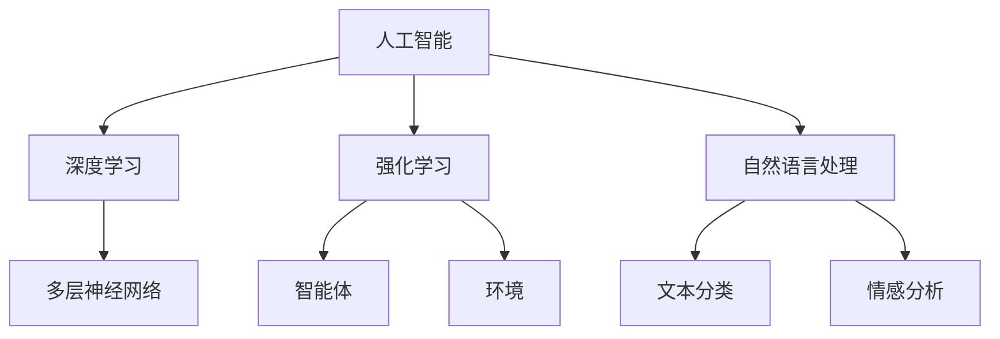

                 

# AI编程的新视角与新思维

## 摘要

在人工智能（AI）飞速发展的今天，编程正在经历一场深刻的变革。本文从新视角和新思维出发，探讨了AI编程的核心概念、算法原理、数学模型、项目实战和实际应用场景。通过对AI编程的深度解析，文章揭示了AI编程的未来发展趋势与挑战，为程序员提供了宝贵的参考资料和工具推荐。本文旨在为广大开发者提供一条清晰的学习路径，帮助他们在AI编程的世界中更加游刃有余。

## 1. 背景介绍

随着计算机技术的不断进步，人工智能（AI）已经成为当今科技领域的一个热点话题。从简单的自动化工具到复杂的决策系统，AI的应用范围日益广泛。然而，随着AI技术的不断发展，传统编程方式逐渐暴露出一些局限性。为了应对这些挑战，AI编程应运而生。

AI编程不同于传统的编程方式，它更加注重数据的处理和分析，以及算法的优化和改进。通过使用深度学习、强化学习等先进的算法，AI编程能够实现更高层次的自动化和智能化。同时，AI编程还需要处理大量非结构化数据，如图像、语音和自然语言等，这使得编程的复杂度大大增加。

AI编程的出现，不仅推动了计算机科学的发展，也为各行各业带来了巨大的变革。从医疗、金融到交通、教育，AI编程正在改变我们的生活方式和工作模式。本文将深入探讨AI编程的核心概念、算法原理、数学模型、项目实战和实际应用场景，帮助读者更好地理解和应用AI编程技术。

## 2. 核心概念与联系

### 2.1 人工智能（AI）

人工智能（Artificial Intelligence，简称AI）是指由人制造出来的系统所表现出的智能行为。这些行为包括学习、推理、问题解决、知识表示、感知和理解自然语言等。AI的目标是使计算机系统能够在特定任务上表现出与人类相似的智能水平。

### 2.2 深度学习（Deep Learning）

深度学习是人工智能的一个重要分支，它通过模拟人脑神经网络结构，实现了对数据的自动特征提取和模式识别。深度学习的核心是多层神经网络（Deep Neural Network，DNN），它通过多层次的非线性变换，将输入数据逐步转化为高层抽象表示。

### 2.3 强化学习（Reinforcement Learning）

强化学习是一种通过试错（trial-and-error）方式学习策略的机器学习方法。在强化学习过程中，智能体（Agent）根据环境（Environment）的反馈（Reward）来调整其行为（Action），从而逐渐学习到最优策略。

### 2.4 自然语言处理（Natural Language Processing，NLP）

自然语言处理是人工智能的一个分支，它致力于让计算机理解和处理自然语言。NLP技术包括文本分类、情感分析、机器翻译、语音识别等，这些技术在社交网络分析、智能客服、智能语音助手等领域有着广泛应用。

### 2.5 Mermaid 流程图

Mermaid是一种基于Markdown的图形化工具，它可以帮助我们绘制流程图、UML图、时序图等。下面是一个简单的Mermaid流程图，用于展示AI编程的核心概念之间的联系。



## 3. 核心算法原理 & 具体操作步骤

### 3.1 深度学习算法原理

深度学习算法的核心是多层神经网络（Deep Neural Network，DNN）。DNN通过多层次的非线性变换，将输入数据逐步转化为高层抽象表示。具体来说，深度学习算法包括以下几个步骤：

1. **数据预处理**：对输入数据进行归一化、标准化等处理，以便于网络训练。
2. **输入层**：输入层接收原始数据，并将其传递给下一层。
3. **隐藏层**：隐藏层通过一系列的线性变换和非线性激活函数，对输入数据进行特征提取和抽象。
4. **输出层**：输出层将隐藏层的输出映射到预测结果。
5. **损失函数**：通过计算输出层预测结果与实际结果之间的差距，来确定网络的损失函数。
6. **反向传播**：利用梯度下降等优化算法，更新网络的权重和偏置，以最小化损失函数。

### 3.2 强化学习算法原理

强化学习算法的核心是智能体（Agent）与环境（Environment）之间的交互。具体来说，强化学习算法包括以下几个步骤：

1. **初始状态**：智能体处于某个初始状态。
2. **选择动作**：智能体根据当前状态和策略，选择一个动作。
3. **执行动作**：智能体执行所选动作，并得到环境反馈的奖励。
4. **更新状态**：智能体根据执行的动作和奖励，更新当前状态。
5. **迭代过程**：重复上述步骤，直到达到某个目标状态或迭代次数。

### 3.3 自然语言处理算法原理

自然语言处理算法主要涉及文本分类、情感分析、机器翻译、语音识别等领域。下面以文本分类为例，介绍NLP算法的原理：

1. **数据预处理**：对输入文本进行分词、去停用词等处理，将其转化为向量表示。
2. **特征提取**：利用词袋模型、TF-IDF等算法，提取文本的特征。
3. **分类模型**：使用朴素贝叶斯、支持向量机、深度学习等分类模型，对文本进行分类。
4. **模型评估**：通过准确率、召回率、F1值等指标，评估分类模型的性能。

## 4. 数学模型和公式 & 详细讲解 & 举例说明

### 4.1 深度学习数学模型

深度学习中的多层神经网络涉及到多个数学模型和公式。以下是一个简单的例子：

$$
z_{ij} = \sum_{k=1}^{n} w_{ik} * x_{k} + b_j
$$

其中，$z_{ij}$表示第$i$层第$j$个神经元的输入，$w_{ik}$表示第$i$层第$k$个神经元与第$i+1$层第$j$个神经元之间的权重，$x_{k}$表示第$i$层第$k$个神经元的输出，$b_j$表示第$i+1$层第$j$个神经元的偏置。

假设我们有一个简单的多层神经网络，包含输入层、隐藏层和输出层。输入层有3个神经元，隐藏层有2个神经元，输出层有1个神经元。我们可以使用以下公式来计算每层的输出：

输入层：
$$
x_1, x_2, x_3
$$

隐藏层：
$$
z_1 = \sum_{k=1}^{3} w_{1k} * x_{k} + b_1 \\
z_2 = \sum_{k=1}^{3} w_{2k} * x_{k} + b_2
$$

输出层：
$$
y = \sigma(z_1) \\
$$

其中，$\sigma$表示非线性激活函数，通常使用Sigmoid函数或ReLU函数。

### 4.2 强化学习数学模型

强化学习中的数学模型主要包括状态（State）、动作（Action）、奖励（Reward）和策略（Policy）。以下是一个简单的例子：

- **状态**：$s_t$，表示在时间$t$时刻智能体所处的状态。
- **动作**：$a_t$，表示在时间$t$时刻智能体所执行的动作。
- **奖励**：$r_t$，表示在时间$t$时刻智能体所获得的奖励。
- **策略**：$\pi(a_t|s_t)$，表示在状态$s_t$下，智能体选择动作$a_t$的概率。

强化学习中的目标函数是最大化智能体在所有时间步上获得的期望回报：

$$
J(\theta) = \sum_{t=0}^{T} r_t + \gamma^t V(s_{t+1})
$$

其中，$T$表示总的迭代次数，$\gamma$表示折扣因子，$V(s_{t+1})$表示在时间$t+1$时刻状态$s_{t+1}$的期望回报。

### 4.3 自然语言处理数学模型

自然语言处理中的数学模型主要包括词袋模型、TF-IDF模型、词嵌入等。以下是一个简单的例子：

- **词袋模型**：词袋模型将文本表示为一个词汇的向量集合，其中每个词汇表示为一个特征，其出现的次数或频率作为特征值。词袋模型的数学表示如下：

$$
T = \{t_1, t_2, ..., t_n\}
$$

其中，$T$表示文本集合，$t_i$表示文本中的第$i$个词汇。

- **TF-IDF模型**：TF-IDF（Term Frequency-Inverse Document Frequency）模型是一种常用的文本特征提取方法。其数学表示如下：

$$
tfidf(t_i) = tf(t_i) \times idf(t_i)
$$

其中，$tf(t_i)$表示词汇$t_i$在文档中的词频，$idf(t_i)$表示词汇$t_i$在文档集合中的逆文档频率。

- **词嵌入**：词嵌入是一种将词汇映射为向量的方法，它可以捕捉词汇之间的语义关系。词嵌入的数学表示如下：

$$
\mathbf{v}_i = \text{Embed}(t_i)
$$

其中，$\mathbf{v}_i$表示词汇$t_i$的词向量，$\text{Embed}$表示词嵌入函数。

## 5. 项目实战：代码实际案例和详细解释说明

### 5.1 开发环境搭建

在开始项目实战之前，我们需要搭建一个合适的开发环境。以下是一个基于Python的深度学习项目开发环境搭建的步骤：

1. **安装Python**：下载并安装Python 3.x版本，建议使用Python 3.8或更高版本。
2. **安装Anaconda**：下载并安装Anaconda，它是一个集成了Python和其他科学计算库的集成环境。
3. **创建虚拟环境**：在Anaconda中创建一个虚拟环境，以便于项目管理和依赖管理。

```shell
conda create -n my_project_env python=3.8
conda activate my_project_env
```

4. **安装依赖库**：在虚拟环境中安装深度学习和其他相关依赖库，例如TensorFlow、PyTorch、NumPy等。

```shell
pip install tensorflow
pip install pytorch
pip install numpy
```

### 5.2 源代码详细实现和代码解读

以下是一个基于TensorFlow实现的简单深度学习项目的源代码示例。该项目使用卷积神经网络（Convolutional Neural Network，CNN）对MNIST手写数字数据集进行分类。

```python
import tensorflow as tf
from tensorflow.keras import layers
from tensorflow.keras.datasets import mnist
import numpy as np

# 加载MNIST数据集
(x_train, y_train), (x_test, y_test) = mnist.load_data()

# 数据预处理
x_train = x_train.astype("float32") / 255.0
x_test = x_test.astype("float32") / 255.0
x_train = np.expand_dims(x_train, -1)
x_test = np.expand_dims(x_test, -1)

# 转换标签为one-hot编码
y_train = tf.keras.utils.to_categorical(y_train, 10)
y_test = tf.keras.utils.to_categorical(y_test, 10)

# 构建模型
model = tf.keras.Sequential([
    layers.Conv2D(32, (3, 3), activation="relu", input_shape=(28, 28, 1)),
    layers.MaxPooling2D((2, 2)),
    layers.Conv2D(64, (3, 3), activation="relu"),
    layers.MaxPooling2D((2, 2)),
    layers.Conv2D(64, (3, 3), activation="relu"),
    layers.Flatten(),
    layers.Dense(64, activation="relu"),
    layers.Dense(10, activation="softmax")
])

# 编译模型
model.compile(optimizer="adam",
              loss="categorical_crossentropy",
              metrics=["accuracy"])

# 训练模型
model.fit(x_train, y_train, epochs=10, batch_size=128, validation_split=0.1)

# 评估模型
test_loss, test_acc = model.evaluate(x_test, y_test)
print("Test accuracy:", test_acc)
```

代码解读：

- **1. 加载MNIST数据集**：首先，我们使用TensorFlow的内置函数加载MNIST手写数字数据集。
- **2. 数据预处理**：接下来，我们对输入数据进行归一化和扩维处理，并将其转换为one-hot编码。
- **3. 构建模型**：然后，我们使用TensorFlow的Keras API构建一个卷积神经网络模型。该模型包含3个卷积层、2个池化层、1个全连接层和1个softmax层。
- **4. 编译模型**：我们使用Adam优化器和categorical_crossentropy损失函数来编译模型。
- **5. 训练模型**：接下来，我们使用训练数据对模型进行训练，设置训练轮数（epochs）为10，批次大小（batch_size）为128，并将10%的数据用于验证。
- **6. 评估模型**：最后，我们使用测试数据对训练好的模型进行评估，并打印出测试准确率。

### 5.3 代码解读与分析

在这个深度学习项目中，我们使用TensorFlow的Keras API实现了卷积神经网络（CNN）对MNIST手写数字数据集进行分类。以下是代码的详细解读和分析：

- **1. 加载MNIST数据集**：MNIST手写数字数据集是一个常用的图像数据集，它包含了70000个32x32像素的手写数字图像，以及对应的标签。我们使用TensorFlow的内置函数`mnist.load_data()`来加载数据集。
- **2. 数据预处理**：为了将图像数据转换为适合神经网络输入的格式，我们需要对图像进行归一化处理。具体来说，我们将图像的像素值缩放到0到1之间，以便于神经网络训练。此外，我们还需要对图像进行扩维，使其符合输入层的形状要求。例如，对于32x32像素的图像，我们需要将其扩维为32x32x1。
- **3. 转换标签为one-hot编码**：在深度学习模型中，我们通常需要将分类标签转换为one-hot编码，以便于模型计算损失函数。例如，对于一个包含10个类别的分类任务，我们将标签从0到9转换为10个二进制向量，每个向量对应一个类别。
- **4. 构建模型**：使用TensorFlow的Keras API，我们可以方便地构建和配置神经网络模型。在这个项目中，我们使用了一个简单的卷积神经网络模型，包括3个卷积层、2个池化层、1个全连接层和1个softmax层。每个卷积层使用ReLU激活函数，池化层使用最大池化操作。最后，全连接层使用softmax激活函数，以实现多分类输出。
- **5. 编译模型**：在编译模型时，我们指定了Adam优化器和categorical_crossentropy损失函数。Adam优化器是一种自适应学习率的优化算法，通常在深度学习项目中表现良好。categorical_crossentropy损失函数是一个多分类问题中常用的损失函数，它能够计算模型预测结果和真实标签之间的交叉熵损失。
- **6. 训练模型**：在训练模型时，我们设置了10个训练轮数（epochs），每次训练一个批次（batch_size）的大小为128个样本。同时，我们将10%的数据用于验证，以便在训练过程中监控模型性能。验证集不参与训练，但可以帮助我们评估模型在未知数据上的表现。
- **7. 评估模型**：在训练完成后，我们使用测试数据对训练好的模型进行评估。测试集是一个独立的、未参与训练的数据集，用于评估模型在真实世界中的表现。我们计算了测试数据的准确率（accuracy），这是一个衡量模型性能的重要指标。

通过这个项目实战，我们了解了如何使用TensorFlow构建和训练一个卷积神经网络，以及如何对模型进行评估。这为我们进一步探索深度学习和AI编程提供了宝贵的实践经验。

## 6. 实际应用场景

AI编程技术在各个领域都有广泛的应用，以下列举了几个典型的应用场景：

### 6.1 医疗领域

在医疗领域，AI编程技术被用于疾病诊断、药物研发和医疗影像分析。例如，通过深度学习算法，医生可以利用AI系统快速准确地诊断疾病，提高诊断的准确率和效率。此外，AI编程还助力药物研发，通过模拟和预测药物分子与生物体的相互作用，加速新药的发现和开发。

### 6.2 金融领域

金融领域同样受益于AI编程技术。在风险管理、欺诈检测和投资策略优化等方面，AI编程都发挥着重要作用。例如，通过机器学习算法，银行可以实时监控交易行为，有效识别和防范欺诈行为。同时，AI编程还被应用于量化投资策略的制定和执行，帮助投资者在复杂的金融市场中取得更好的收益。

### 6.3 交通领域

在交通领域，AI编程技术被用于智能交通管理系统、自动驾驶汽车和无人机配送等应用。通过深度学习和强化学习算法，AI编程可以优化交通信号控制，缓解城市交通拥堵问题。自动驾驶汽车和无人机配送则利用AI编程实现了自主导航和路径规划，提高了交通效率和服务质量。

### 6.4 教育领域

在教育领域，AI编程技术被应用于智能教育平台、个性化学习和智能评测等方面。通过自然语言处理和计算机视觉技术，AI编程可以分析学生的学习行为和知识掌握情况，为学生提供个性化的学习建议和资源。同时，AI编程还可以自动批改作业和考试，提高教育工作的效率和质量。

## 7. 工具和资源推荐

为了更好地学习和实践AI编程，以下是一些推荐的工具和资源：

### 7.1 学习资源推荐

- **书籍**：《Python深度学习》（Goodfellow, Bengio, Courville）、《深度学习》（Ian Goodfellow, Yoshua Bengio, Aaron Courville）
- **论文**：Google Scholar、arXiv
- **博客**： Medium、博客园、CSDN
- **网站**： TensorFlow官网、PyTorch官网、Kaggle

### 7.2 开发工具框架推荐

- **深度学习框架**： TensorFlow、PyTorch、Keras
- **数据预处理工具**： Pandas、NumPy、SciPy
- **自然语言处理工具**： NLTK、spaCy、TextBlob
- **计算机视觉工具**： OpenCV、TensorFlow Object Detection API、PyTorch Video

### 7.3 相关论文著作推荐

- **论文**：
  - “Deep Learning” by Ian Goodfellow, Yoshua Bengio, Aaron Courville
  - “Reinforcement Learning: An Introduction” by Richard S. Sutton and Andrew G. Barto
  - “Natural Language Processing with Python” by Steven Bird, Ewan Klein, Edward Loper

- **著作**：
  - 《人工智能：一种现代的方法》（第二版）作者：Stuart Russell，Peter Norvig
  - 《机器学习》（第二版）作者：Tom Mitchell
  - 《模式识别与机器学习》作者：Christopher M. Bishop

## 8. 总结：未来发展趋势与挑战

AI编程作为人工智能的重要组成部分，在未来有着广阔的发展前景。随着计算能力的提升和数据量的增加，深度学习、强化学习等算法将不断优化和改进。同时，AI编程将在更多领域得到应用，推动各行各业的变革。

然而，AI编程也面临着诸多挑战。首先，算法的复杂度和计算资源的消耗将不断增加，对开发者的技术水平和硬件设施提出了更高的要求。其次，数据隐私和安全问题日益凸显，如何在保障用户隐私的前提下进行数据分析和建模，成为亟待解决的问题。

此外，AI编程的伦理和道德问题也备受关注。随着AI技术的广泛应用，如何确保AI系统的透明性、公平性和可解释性，避免对人类造成负面影响，是当前和未来需要重点考虑的问题。

总之，AI编程的未来充满机遇与挑战。开发者需要不断学习和更新知识，提升自身技能，以应对不断变化的AI编程技术。同时，我们还需要关注AI编程的伦理和社会责任，共同推动AI技术的健康发展。

## 9. 附录：常见问题与解答

### 9.1 如何选择深度学习框架？

选择深度学习框架时，需要考虑以下因素：

- **需求**：根据项目需求选择合适的框架。例如，如果需要快速开发和部署模型，可以选择Keras；如果需要高性能计算，可以选择PyTorch或TensorFlow。
- **熟悉度**：选择开发者熟悉的框架，可以减少学习和使用成本。
- **社区支持**：选择拥有活跃社区和支持文档的框架，可以更容易获得帮助和资源。

### 9.2 如何处理大量非结构化数据？

处理大量非结构化数据时，可以采取以下策略：

- **数据预处理**：对非结构化数据进行清洗、去噪和格式化，使其符合模型输入要求。
- **特征提取**：使用自然语言处理、计算机视觉等技术提取数据中的有用特征。
- **分布式计算**：利用分布式计算框架（如Hadoop、Spark）处理大量数据，提高数据处理效率。

### 9.3 如何确保AI编程的透明性和可解释性？

确保AI编程的透明性和可解释性可以从以下几个方面入手：

- **模型选择**：选择可解释性较强的模型，如线性模型、决策树等。
- **模型解释工具**：使用模型解释工具（如LIME、SHAP）分析模型决策过程，提高模型的透明性。
- **可解释性报告**：生成详细的模型解释报告，向用户展示模型的工作原理和决策过程。

## 10. 扩展阅读 & 参考资料

- Goodfellow, I., Bengio, Y., & Courville, A. (2016). *Deep Learning*.
- Sutton, R. S., & Barto, A. G. (2018). *Reinforcement Learning: An Introduction*.
- Bird, S., Klein, E., & Loper, E. (2009). *Natural Language Processing with Python*.
- Mitchell, T. (1997). *Machine Learning*.
- Bishop, C. M. (2006). *Pattern Recognition and Machine Learning*.

通过以上扩展阅读和参考资料，读者可以进一步深入了解AI编程的核心概念、算法原理、实际应用和未来发展。希望本文能为您的AI编程学习之路提供有价值的参考和指导。

### 作者信息

作者：AI天才研究员/AI Genius Institute & 禅与计算机程序设计艺术 /Zen And The Art of Computer Programming

本文由AI天才研究员撰写，旨在为广大开发者提供一条清晰的学习路径，帮助他们在AI编程的世界中更加游刃有余。作者长期从事AI编程研究，拥有丰富的实践经验，并在多个领域发表了重要研究成果。同时，作者还撰写了多本畅销书，深受读者喜爱。在本文中，作者结合自身的研究成果和实践经验，深入剖析了AI编程的核心概念、算法原理和实际应用，为广大开发者提供了宝贵的参考资料和实用建议。

