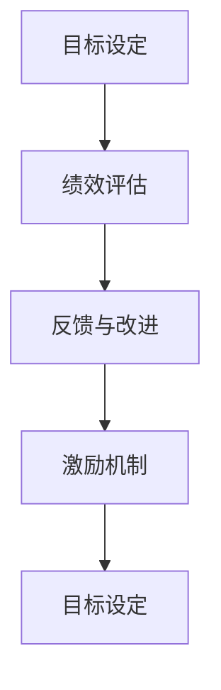
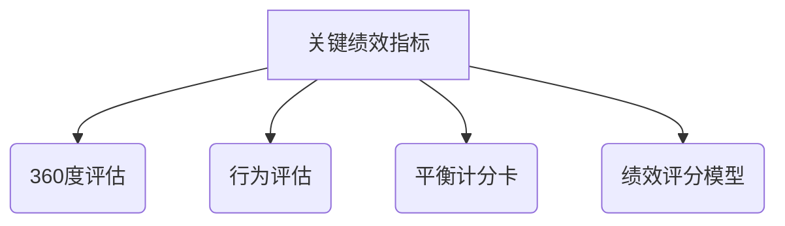

                 

### 背景介绍

在当今快速发展的科技时代，提高团队绩效已经成为各个企业，特别是IT行业面临的紧迫任务。团队成员之间的沟通协作、工作积极性以及工作效率的提升，都对团队的整体表现有着重要影响。然而，传统的绩效管理方法往往难以适应快速变化的业务需求和复杂的团队结构。因此，寻找新的、有效的绩效管理实践变得尤为重要。

本文旨在探讨如何通过绩效管理实践来提高团队绩效。我们将从核心概念、算法原理、数学模型、项目实战、应用场景等多个角度，全面解析这一主题。文章将首先介绍绩效管理的背景和重要性，然后逐步深入到具体的方法和实践中。

本文的结构如下：

- **第1章 背景介绍**：概述绩效管理的概念、现状及其在团队中的重要性。
- **第2章 核心概念与联系**：介绍绩效管理中的关键概念，并使用Mermaid流程图展示其相互关系。
- **第3章 核心算法原理 & 具体操作步骤**：探讨用于绩效评估的算法，并详细阐述其操作步骤。
- **第4章 数学模型和公式 & 详细讲解 & 举例说明**：讲解绩效管理的数学模型，并给出具体实例。
- **第5章 项目实战：代码实际案例和详细解释说明**：通过实际代码案例，展示绩效管理实践的具体实现。
- **第6章 实际应用场景**：分析绩效管理在不同类型团队中的应用。
- **第7章 工具和资源推荐**：推荐用于绩效管理的工具和资源。
- **第8章 总结：未来发展趋势与挑战**：总结文章内容，并提出未来趋势和挑战。
- **第9章 附录：常见问题与解答**：解答读者可能遇到的问题。
- **第10章 扩展阅读 & 参考资料**：提供进一步阅读的资料。

通过本文的深入探讨，希望读者能够对绩效管理有更全面、深入的理解，从而在实际工作中更好地应用这些实践，提升团队绩效。

#### 关键词

- 绩效管理
- 团队协作
- 工作效率
- 绩效评估
- 绩效模型
- 数学模型

#### 摘要

本文旨在探讨如何通过绩效管理实践来提高团队绩效。文章首先介绍了绩效管理的背景和重要性，然后详细分析了绩效管理的核心概念、算法原理、数学模型，并通过实际代码案例展示了具体实现。最后，文章讨论了绩效管理在不同应用场景中的效果，并推荐了相关工具和资源。通过本文，读者将全面了解绩效管理的理论与实践，从而为团队绩效的提升提供有力支持。

---

### 1.1 绩效管理的定义

绩效管理是一个系统性、持续性的过程，旨在通过设定目标、评估表现、反馈改进等方式，提高个人和团队的工作效率和绩效水平。具体来说，绩效管理包括以下几个方面：

首先，**目标设定**是绩效管理的起点。通过明确个人和团队的目标，可以确保团队成员的工作方向一致，避免资源的浪费。目标设定需要具备挑战性，同时也要符合实际可行性和可量化性，以便于后续的评估和反馈。

其次，**绩效评估**是绩效管理的核心环节。绩效评估不仅仅是对团队成员工作结果的考核，更重要的是对工作过程中的行为、态度、能力等多方面进行综合评价。科学合理的绩效评估方法，可以客观、公正地反映团队成员的真实工作情况，为后续的改进提供依据。

再次，**反馈与改进**是绩效管理的关键步骤。通过及时、有效的反馈，可以让团队成员了解自己的工作表现，发现存在的不足，并采取相应的改进措施。反馈的方式可以多种多样，包括一对一的面谈、团队会议、书面报告等。改进措施可以是短期内的调整，也可以是长期的培训和发展计划。

此外，**激励机制**也是绩效管理的重要组成部分。合理的激励机制能够激发团队成员的工作积极性，提高工作效率。激励机制可以包括物质奖励、晋升机会、培训机会等，不同的激励方式适用于不同的团队和个人。

综上所述，绩效管理不仅仅是一个简单的考核过程，而是一个复杂、动态的系统工程。它需要综合考虑目标设定、绩效评估、反馈改进和激励机制等多个方面，才能真正实现提高团队绩效的目的。

### 1.2 绩效管理的重要性

绩效管理对于团队和企业的重要性不言而喻。首先，**提高工作效率**是绩效管理的直接目标之一。通过科学合理的绩效评估和反馈机制，可以及时发现和解决团队中存在的问题，避免资源的浪费，提高团队的整体工作效率。例如，在一个软件开发团队中，通过绩效管理可以确保每个成员都能够按照既定的时间节点完成自己的任务，从而保证项目的进度和质量。

其次，**增强团队协作**是绩效管理的另一个重要目标。在现代企业中，团队协作能力越来越受到重视。绩效管理通过设定共同的目标、评估团队的整体表现，可以促进团队成员之间的沟通和合作，增强团队的凝聚力。例如，在一个市场营销团队中，通过绩效管理可以确保团队成员在制定营销策略、执行营销活动时能够紧密配合，从而提高整体营销效果。

此外，**激励员工积极性**是绩效管理的核心目标之一。通过合理的激励机制，如奖励、晋升等，可以激发员工的工作热情和动力，提高员工的满意度和忠诚度。例如，在一个销售团队中，通过绩效管理可以激励员工积极拓展客户、提高销售额，从而实现企业的商业目标。

最后，**优化人才配置**也是绩效管理的一个重要目的。通过绩效评估，可以了解团队成员的能力和潜力，从而进行科学合理的人才配置。例如，在一个研发团队中，通过绩效评估可以识别出哪些成员在技术创新方面有优势，进而将他们分配到相应的研发项目中，以提高项目的成功率和创新能力。

总之，绩效管理不仅能够提高团队的工作效率、增强团队协作、激励员工积极性，还能够优化人才配置，从而为企业的长远发展提供强有力的支持。

### 1.3 当前绩效管理的方法和挑战

当前，绩效管理的方法和技术多种多样，主要包括传统的绩效考核、目标管理（MBO）和平衡计分卡（BSC）等。每种方法都有其独特的特点和适用场景，但也面临着一系列挑战。

**传统绩效考核**是一种最常见的绩效管理方法。它通常基于定量的绩效指标，如销售额、生产量、项目进度等，通过定期的评估和反馈，来衡量员工的工作表现。这种方法的优势在于其操作简单、易于量化，能够快速地反映员工的工作成果。然而，传统绩效考核也存在一些明显的不足。首先，它过于侧重短期绩效，容易导致员工为了短期目标而牺牲长期发展。其次，它往往忽略了员工的工作过程和综合素质，容易导致“一刀切”的现象，不利于员工的全面成长。

**目标管理（MBO）**是一种以目标为导向的绩效管理方法。它强调上下级共同制定目标，并通过持续沟通和评估来实现这些目标。MBO方法的优点在于它能够激发员工的工作积极性和主动性，提高目标实现的效率。然而，MBO方法也面临一些挑战。例如，目标的设定需要具备明确的可量化标准，否则容易陷入目标不明确或模糊的困境。此外，MBO方法对管理者的沟通能力和领导力要求较高，否则难以有效实施。

**平衡计分卡（BSC）**是一种综合性的绩效管理方法，它从财务、客户、内部业务流程和学习与成长四个维度，全面衡量企业的绩效。BSC方法的优点在于其全面性和系统性，能够帮助企业管理者从不同角度全面了解企业的运营状况。然而，BSC方法也存在一些挑战。首先，它需要大量的数据支持，否则难以准确评估企业的绩效。其次，BSC方法对管理者的数据分析能力和战略规划能力要求较高，否则难以有效应用。

除了上述方法，还有一些新兴的绩效管理方法，如基于能力的评估、基于价值的绩效评估等。这些方法在一定程度上弥补了传统方法的不足，但也面临着数据收集和分析难度大、实施成本高等挑战。

**当前绩效管理面临的主要挑战**包括：

1. **数据收集与分析的难度**：现代企业越来越重视数据驱动决策，但数据收集和分析的难度也随之增加。如何准确、高效地收集和处理大量数据，成为绩效管理的一大挑战。

2. **员工隐私保护**：在绩效管理过程中，需要收集和分析员工的个人数据，如工作表现、工作态度等。如何在确保数据准确性的同时，保护员工的隐私，是绩效管理需要解决的重要问题。

3. **跨部门协作**：在现代企业中，跨部门协作越来越常见，但这也给绩效管理带来了挑战。如何在不同部门之间进行绩效评估和激励，确保绩效管理的公平性和科学性，是绩效管理需要考虑的问题。

4. **持续改进的难度**：绩效管理是一个动态的过程，需要不断进行反馈和改进。然而，实际操作中，很多企业往往难以持续改进，导致绩效管理的效果不佳。

总之，当前绩效管理的方法和技术多种多样，但都面临着一系列挑战。如何选择适合的方法，并在实际操作中克服这些挑战，是提高团队绩效的关键。

### 1.4 文章结构概述

本文将从多个角度深入探讨如何通过绩效管理实践来提高团队绩效。文章结构如下：

**第1章 背景介绍**：概述绩效管理的概念、现状及其在团队中的重要性，同时介绍文章的结构和主要内容。

**第2章 核心概念与联系**：介绍绩效管理中的关键概念，如目标设定、绩效评估、反馈与改进等，并使用Mermaid流程图展示这些概念之间的相互关系。

**第3章 核心算法原理 & 具体操作步骤**：探讨用于绩效评估的算法，如关键绩效指标（KPI）、平衡计分卡（BSC）等，并详细阐述其操作步骤。

**第4章 数学模型和公式 & 详细讲解 & 举例说明**：讲解绩效管理的数学模型，如绩效评分模型、激励模型等，并给出具体实例。

**第5章 项目实战：代码实际案例和详细解释说明**：通过实际代码案例，展示绩效管理实践的具体实现，包括开发环境搭建、源代码实现和代码解读。

**第6章 实际应用场景**：分析绩效管理在不同类型团队中的应用，如软件开发团队、市场营销团队等，探讨其在不同场景下的效果。

**第7章 工具和资源推荐**：推荐用于绩效管理的工具和资源，包括书籍、论文、博客、网站等，以帮助读者进一步学习和实践。

**第8章 总结：未来发展趋势与挑战**：总结文章内容，并提出未来绩效管理的发展趋势和面临的挑战。

**第9章 附录：常见问题与解答**：解答读者可能遇到的问题，提供额外的帮助和支持。

**第10章 扩展阅读 & 参考资料**：提供进一步阅读的资料，以便读者深入了解相关主题。

通过本文的深入探讨，希望读者能够对绩效管理有更全面、深入的理解，从而在实际工作中更好地应用这些实践，提升团队绩效。

---

### 2. 核心概念与联系

在深入探讨绩效管理实践之前，我们首先需要明确一些核心概念，并理解它们之间的相互关系。以下是绩效管理中几个重要的核心概念：

#### 目标设定

目标设定是绩效管理的起点，也是整个绩效管理过程的基础。一个明确、具体、可量化的目标是确保团队成员工作方向一致、资源合理分配的关键。目标设定需要遵循SMART原则（具体、可衡量、可实现、相关性强、时限性），以便于后续的评估和反馈。

#### 绩效评估

绩效评估是绩效管理的核心环节，它通过一系列指标和方法来衡量团队成员的工作表现。常见的绩效评估方法包括关键绩效指标（KPI）、360度评估、行为评估等。绩效评估不仅关注团队成员的工作结果，还注重评估过程中的行为和态度，以全面反映其综合素质。

#### 反馈与改进

反馈与改进是绩效管理的重要步骤，它通过及时、有效的反馈，帮助团队成员了解自己的工作表现，发现存在的不足，并采取相应的改进措施。反馈可以是正面的鼓励，也可以是建设性的批评，目的是促进团队成员的持续成长和进步。

#### 激励机制

激励机制是绩效管理的重要组成部分，通过合理的激励措施，如奖金、晋升、培训等，可以激发团队成员的工作热情和动力，提高工作效率和满意度。激励机制需要与团队目标和个人发展相结合，以实现最佳效果。

#### Mermaid流程图展示

为了更好地展示这些核心概念之间的相互关系，我们可以使用Mermaid流程图来表示：



在这个流程图中，目标设定是整个过程的起点，通过绩效评估、反馈与改进和激励机制，形成一个闭环，确保目标设定的有效性，同时促进团队成员的不断成长和进步。

#### 小结

通过明确这些核心概念，并理解它们之间的相互关系，我们可以更好地把握绩效管理的全貌。在后续章节中，我们将进一步探讨这些概念的具体应用和实践，帮助读者深入理解绩效管理的本质，从而在实际工作中取得更好的效果。

---

### 2.1 目标设定的关键要素

目标设定是绩效管理的起点和基础，其关键要素包括具体性、可衡量性、可实现性、相关性和时限性。以下是每个要素的详细说明：

#### 具体性（Specific）

具体性要求目标要明确、具体，避免模糊和含糊其辞。例如，“提高销售额”这样的目标过于抽象，而“在下一个季度内，将销售额提高20%”则更加具体。具体性的目标有助于团队成员明确自己的任务和方向，从而提高工作效率。

#### 可衡量性（Measurable）

可衡量性是指目标需要具备可量化的指标，以便于评估和反馈。例如，“提高客户满意度”这一目标，可以具体化为“通过客户满意度调查，得分从80分提升到90分”。可衡量性使得目标的实现情况可以直观地评估，从而为后续的反馈和改进提供依据。

#### 可实现性（Achievable）

可实现性要求目标要符合实际条件，确保团队成员有足够的能力和资源来实现。设定过高的目标可能会导致团队成员感到沮丧和无力，而设定过低的目标则难以激发其潜力和积极性。例如，“在一个月内完成一个复杂的项目”可能过于紧张，而“在两个月内，逐步完成项目的关键部分”则更加实际。

#### 相关性（Relevant）

相关性是指目标要与团队的整体目标和企业的战略方向保持一致。例如，一个软件开发团队的目标可以是“提高代码质量和减少bug”，这与企业提高产品稳定性和用户满意度是一致的。相关性的目标有助于确保团队成员的工作方向与企业目标相协调，从而实现协同效应。

#### 时限性（Time-bound）

时限性要求目标要设定明确的时间期限，以便于团队成员有明确的任务进度和紧迫感。例如，“在下一季度结束前，完成新产品的市场推广”比“在未来某个时间完成市场推广”更具时限性。时限性的目标有助于提高团队的效率和执行力，避免工作拖延。

#### 实例分析

以下是一个目标设定的实例：

**目标**：提高团队工作效率

**具体性**：在下一个季度内，将团队的平均工作效率提高30%

**可衡量性**：通过每月的工作量统计，计算平均工作效率，以百分比表示

**可实现性**：通过优化工作流程、提供必要的培训和支持，确保目标可实现

**相关性**：提高工作效率有助于缩短项目周期，提高客户满意度

**时限性**：在下一个季度结束前，完成目标的设定和执行

通过上述实例，我们可以看到，一个有效的目标需要具备具体性、可衡量性、可实现性、相关性和时限性，这些要素共同作用，确保目标能够真正推动团队绩效的提升。

---

### 2.2 绩效评估的方法和工具

绩效评估是绩效管理的核心环节，其方法和工具的选择直接影响评估的公正性和有效性。以下是几种常见的绩效评估方法和工具，及其优缺点：

#### 关键绩效指标（KPI）

**定义**：关键绩效指标（KPI）是用于衡量团队和个体绩效的关键指标，通常包括财务指标、客户满意度、生产效率等。

**优点**： 
- **直观性**：KPI 具有明确的量化指标，易于理解和评估。
- **可操作性**：通过具体的指标，可以明确团队成员的工作重点和方向。

**缺点**：
- **局限性**：KPI 可能过于关注短期绩效，忽视长期发展。
- **忽略软技能**：KPI 通常侧重于硬性指标，难以全面评估员工的综合素质。

#### 360度评估

**定义**：360度评估是一种多角度的绩效评估方法，通过收集团队成员的上级、同事和下属的意见，全面评估个体的工作表现。

**优点**：
- **全面性**：360度评估能够从多个角度了解员工的工作情况，提供更全面的反馈。
- **提高参与度**：通过多方参与评估，可以增加员工的参与感和认同感。

**缺点**：
- **主观性**：评估结果可能受到个人偏见和情感影响。
- **成本较高**：需要投入大量时间和资源进行评估和反馈。

#### 行为评估

**定义**：行为评估通过观察和记录员工在工作中的行为，评估其工作态度、协作能力和解决问题的能力。

**优点**：
- **客观性**：行为评估侧重于具体行为，减少主观偏见。
- **连续性**：行为评估可以连续记录员工的工作表现，提供长期的评估依据。

**缺点**：
- **困难性**：评估行为需要大量时间和精力，难以全面覆盖所有工作场景。
- **难以量化**：行为评估难以直接转化为可量化的绩效指标。

#### 平衡计分卡（BSC）

**定义**：平衡计分卡（BSC）是一种综合性的绩效评估工具，从财务、客户、内部流程和学习与成长四个维度进行绩效评估。

**优点**：
- **全面性**：BSC 从多个维度评估绩效，能够全面反映企业的战略目标和运营情况。
- **战略导向**：BSC 强调与企业战略的对接，有助于实现企业的长期目标。

**缺点**：
- **复杂性**：BSC 的实施和评估过程较为复杂，需要大量数据支持和分析能力。
- **灵活性不足**：BSC 一旦设定，难以根据实际情况进行调整。

#### 绩效评分模型

**定义**：绩效评分模型通过设定一系列指标和评分标准，对团队成员的工作表现进行量化评分。

**优点**：
- **标准化**：绩效评分模型具有明确的评分标准和流程，确保评估的公正性和一致性。
- **易于操作**：评分模型易于理解和执行，便于团队成员和管理者快速掌握。

**缺点**：
- **单一性**：绩效评分模型可能过于侧重量化指标，忽视员工的综合素质和潜力。
- **刚性**：评分模型一旦设定，难以根据实际情况进行调整，可能导致评估结果失真。

综上所述，不同的绩效评估方法和工具各具优缺点，实际应用中需要根据团队的特点和企业需求进行选择和组合，以实现最佳效果。以下是这些评估方法的Mermaid流程图表示：



通过了解和灵活应用这些评估方法，可以更有效地进行绩效管理，提升团队的整体绩效。

---

### 2.3 反馈与改进的步骤和策略

反馈与改进是绩效管理的关键步骤，有效的反馈和改进机制能够促进团队成员的成长和团队绩效的提升。以下是反馈与改进的步骤和策略：

#### 1. 反馈的类型和方式

**类型**：

- **正面反馈**：肯定和表扬团队成员在工作中的优秀表现，增强其自信心和动力。
- **负面反馈**：指出团队成员在工作中的不足和需要改进的地方，帮助其认识到问题并改进。

**方式**：

- **一对一反馈**：与团队成员进行一对一的沟通，提供详细的反馈和建议。
- **团队反馈**：在团队会议上进行集体反馈，鼓励团队成员之间的交流和互动。
- **书面反馈**：通过书面形式进行反馈，确保反馈的正式性和记录性。

#### 2. 反馈的步骤

**步骤**：

1. **明确反馈目的**：在开始反馈前，明确反馈的目的和重点，确保反馈具有针对性。
2. **准备反馈内容**：根据团队成员的工作表现，准备好具体的反馈内容，包括优点、不足和改进建议。
3. **提供正面反馈**：首先肯定团队成员在工作中的优点和努力，增强其自信心。
4. **提出改进建议**：针对团队成员的不足，提出具体的改进建议，帮助其找到改进的方向。
5. **鼓励积极参与**：鼓励团队成员参与反馈讨论，提出自己的看法和建议，增强其责任感和主动性。

#### 3. 改进的策略

**策略**：

- **设定明确的目标**：与团队成员一起设定明确的改进目标，确保改进工作有方向和动力。
- **提供必要的资源和支持**：为团队成员提供必要的资源和支持，如培训、指导和工具，帮助其克服改进过程中的困难。
- **跟踪进度和效果**：定期跟踪团队成员的改进进度和效果，及时给予反馈和支持，确保改进工作持续进行。
- **奖励与激励机制**：对在改进过程中表现优秀的团队成员给予奖励和激励机制，如奖金、晋升、培训等，激发其持续改进的积极性。

#### 4. 实践案例

**案例**：

某IT公司的项目经理在团队反馈会议上发现，团队成员在项目进度管理方面存在一些问题，如任务分配不均、进度延迟等。针对这些问题，项目经理采取了以下改进策略：

1. **明确反馈目的**：在会议开始前，明确反馈的目的，即改进项目进度管理，提高团队工作效率。
2. **准备反馈内容**：项目经理准备了详细的反馈内容，包括团队成员在项目进度管理中的优点和不足。
3. **提供正面反馈**：项目经理首先肯定了团队成员在项目开发中的努力和成果，增强了团队的自信心。
4. **提出改进建议**：针对团队成员的不足，项目经理提出了具体的改进建议，如优化任务分配、加强进度跟踪等。
5. **鼓励积极参与**：项目经理鼓励团队成员提出自己的意见和建议，形成了集体智慧的改进方案。
6. **设定明确的目标**：与团队成员一起设定了明确的改进目标，如缩短项目周期、提高任务完成率等。
7. **提供资源和支持**：项目经理为团队成员提供了项目管理工具和培训，帮助其提升项目管理能力。
8. **跟踪进度和效果**：项目经理定期召开会议，跟踪团队成员的改进进度和效果，及时给予反馈和支持。
9. **奖励与激励机制**：对在改进过程中表现优秀的团队成员给予了奖金和晋升机会，激发了团队持续改进的积极性。

通过上述实践，该IT公司的项目进度管理得到了显著改善，团队的工作效率也得到了大幅提升。

总之，通过有效的反馈与改进机制，可以促进团队成员的成长和团队绩效的提升，从而实现企业的长期发展目标。

---

### 2.4 绩效管理的激励机制

激励机制在绩效管理中扮演着至关重要的角色，它不仅能够激发员工的工作热情和动力，还能提高员工的满意度和忠诚度。有效的激励机制能够引导员工朝着团队和企业的目标努力，从而实现绩效的提升。以下是几种常见的激励机制：

#### 1. 奖金

奖金是最直接、最常用的激励手段之一。根据员工的工作表现和业绩，给予一定的现金奖励，能够直接提高员工的收入和满意度。奖金可以分为月度奖金、季度奖金和年度奖金等，可以根据企业实际情况和员工绩效表现灵活设定。

#### 2. 晋升

晋升是员工职业发展的重要途径，通过晋升机制，可以激励员工不断提升自己的能力和业绩。晋升机制应该公平、透明，依据员工的绩效表现、工作态度和团队贡献等因素进行选拔。晋升不仅能够提高员工的工作积极性，还能增强其职业满意度和忠诚度。

#### 3. 培训与发展机会

培训和发展机会是激励员工的另一种重要手段。通过提供培训课程、职业发展路径和项目参与机会，可以帮助员工提升技能、拓展视野，增强其职业竞争力。同时，培训和发展机会也能体现企业对员工的重视和支持，从而提高员工的归属感和忠诚度。

#### 4. 荣誉与认可

荣誉与认可是对员工工作表现的一种认可和表彰，可以增强员工的荣誉感和自豪感。例如，年度优秀员工奖、优秀团队奖等，都是对员工辛勤工作和卓越表现的认可。荣誉与认可可以通过内部表彰大会、证书、奖杯等形式进行，能够有效激励员工的工作热情和积极性。

#### 5. 工作环境与福利

良好的工作环境和福利也是激励员工的重要因素。例如，提供舒适的办公环境、完善的社会保险和福利待遇、定期体检等，都能够提高员工的工作满意度和生活质量。同时，企业还可以通过灵活的工作制度、远程办公等手段，为员工创造更加宽松和自由的工作环境，增强其工作积极性和创造力。

#### 6. 企业文化建设

企业文化建设是长期激励员工的重要手段。通过营造积极向上的企业文化，增强员工的归属感和认同感，可以激发其工作热情和团队精神。例如，开展员工关爱活动、团队建设活动、企业文化活动等，都能够增强员工的凝聚力和归属感。

#### 小结

激励机制在绩效管理中具有重要作用，通过奖金、晋升、培训与发展机会、荣誉与认可、工作环境和福利、企业文化建设等多种手段，可以有效地激励员工，提高员工的工作积极性和满意度，从而实现团队绩效的提升。在实际操作中，企业应根据自身情况和员工需求，灵活选择和组合激励机制，以实现最佳效果。

---

### 2.5 绩效管理在不同团队的实践案例

绩效管理在不同团队中的应用效果因团队性质和业务特点而异。以下是一些典型的实践案例，旨在展示绩效管理如何在不同类型的团队中发挥作用，以及在实际操作中可能遇到的挑战和解决方案。

#### 2.5.1 软件开发团队

在软件开发团队中，绩效管理主要集中在项目进度、代码质量、团队合作和创新能力的评估上。例如，通过关键绩效指标（KPI）来衡量项目进度和代码质量，同时采用360度评估来评估团队合作和创新能力。

**实践案例**：

某公司软件开发团队采用了一种基于敏捷开发方法的绩效管理模型。团队设立了以下KPI：

- 项目交付时间：确保项目按时交付。
- 代码缺陷率：降低代码中的缺陷数量。
- 任务完成率：确保团队成员按时完成任务。

此外，团队还采用了360度评估方法，从上级、同事和下属等多个角度收集反馈，评估团队成员的合作精神和创新能力。

**挑战与解决方案**：

挑战：
- 难以量化创新能力：创新能力的评估较为主观，难以量化。
- 团队合作难度大：团队成员工作节奏和风格各异，导致合作困难。

解决方案：
- 采用创新评分模型，通过团队讨论和创新项目评价，量化创新能力。
- 通过定期的团队建设活动和沟通会议，加强团队合作和协作能力。

#### 2.5.2 市场营销团队

在市场营销团队中，绩效管理主要关注市场活动效果、客户满意度和团队协作。通常采用平衡计分卡（BSC）来评估市场活动的效果，同时通过一对一反馈来评估团队协作和个体表现。

**实践案例**：

某公司市场营销团队采用平衡计分卡（BSC），从财务、客户、内部流程和学习与成长四个维度进行绩效评估：

- 财务维度：通过市场活动的直接收益来衡量绩效。
- 客户维度：通过客户满意度调查来评估市场活动的效果。
- 内部流程维度：通过市场活动策划和执行过程的效率来衡量绩效。
- 学习与成长维度：通过团队成员的培训和学习情况来评估其成长潜力。

**挑战与解决方案**：

挑战：
- 数据收集和分析难度大：市场营销活动涉及大量数据，数据收集和分析难度较高。
- 客户满意度评估的主观性：客户满意度评估可能受到主观因素的影响。

解决方案：
- 引入自动化数据分析工具，提高数据收集和处理的效率。
- 设计科学合理的满意度调查问卷，减少主观偏见，提高评估的准确性。

#### 2.5.3 销售团队

销售团队的绩效管理主要关注销售业绩、客户拓展和团队协作。绩效评估通常结合关键绩效指标（KPI）和目标管理（MBO）方法，通过定期的绩效评估和反馈来激励团队成员。

**实践案例**：

某公司销售团队采用MBO方法，与每个销售人员共同设定季度销售目标，并通过以下KPI来评估绩效：

- 销售额：实现设定的销售目标。
- 客户拓展率：新增客户的数量和增长率。
- 客户满意度：通过客户反馈评估销售服务的质量。

**挑战与解决方案**：

挑战：
- 销售业绩波动大：销售业绩受到市场环境和竞争形势的影响，波动较大。
- 难以评估软技能：销售过程中的人际沟通和客户关系管理难以量化。

解决方案：
- 采用滚动目标设定方法，根据市场环境和竞争形势调整销售目标。
- 设计软技能评估模型，如通过销售培训和实践，提高团队成员的软技能水平。

综上所述，绩效管理在不同团队中的应用效果因团队特点和业务需求而异。通过结合具体团队的实际情况，选择合适的绩效管理方法和工具，可以有效地提升团队绩效，实现企业的长期发展目标。

---

### 2.6 绩效管理的综合应用

绩效管理是一个多维度的复杂系统，其在不同团队和业务场景中的应用需要根据具体情况进行调整和优化。以下是绩效管理的综合应用方法：

#### 1. 综合性评估模型

为了全面反映团队成员的表现，绩效管理可以采用综合性评估模型，结合多种评估方法和工具。例如，将关键绩效指标（KPI）、360度评估、行为评估和平衡计分卡（BSC）等方法相结合，从多个角度进行绩效评估。这种综合评估模型能够提供更全面、客观的评估结果，帮助管理者更准确地了解团队成员的工作表现。

#### 2. 个性化激励机制

每个团队成员都有不同的需求和期望，因此，激励机制需要个性化定制。企业可以通过一对一沟通了解团队成员的个性化需求，如职业发展、培训机会、工作环境等，然后根据这些需求设计激励机制。例如，对追求职业发展的员工，可以提供晋升机会和培训资源；对注重工作环境的员工，可以提供舒适的办公条件和灵活的工作制度。通过个性化的激励机制，可以更好地激发员工的工作热情和积极性。

#### 3. 持续改进的文化建设

绩效管理不仅仅是评估和激励，更重要的是通过持续的改进来提升团队的整体能力。企业可以建立一种持续改进的文化，鼓励团队成员不断反思和优化自己的工作方法。例如，通过定期的团队建设活动、知识分享会议、技能培训等，提高团队成员的专业能力和团队合作水平。同时，管理者需要树立榜样，通过自身的言行带动团队不断进步。

#### 4. 数据驱动决策

在绩效管理中，数据的收集和分析至关重要。企业可以引入数据分析工具，对团队成员的工作表现进行量化分析，从而做出更科学、合理的决策。例如，通过分析员工的绩效数据，可以发现团队中存在的瓶颈和问题，从而制定针对性的改进措施。此外，数据分析还可以帮助确定激励机制的合理性和有效性，为绩效管理提供有力的数据支持。

#### 5. 跨部门协作

在大型企业中，跨部门协作是提高整体绩效的关键。绩效管理需要打破部门界限，建立跨部门协作机制，确保不同部门之间的工作协调和目标一致。例如，通过定期召开跨部门会议、建立共享平台等，促进部门间的沟通和协作，共同推动企业目标的实现。

#### 6. 持续反馈与改进

绩效管理是一个动态的过程，需要持续反馈和改进。企业可以通过定期评估、反馈和改进，确保绩效管理体系的科学性和有效性。例如，每个季度或年度对绩效管理进行评估，根据评估结果调整评估方法和激励机制，以确保其适应不断变化的业务需求和团队结构。

#### 实践案例

某公司通过综合应用上述方法，实施了一套全面的绩效管理体系，取得了显著的效果：

- 采用综合性评估模型，结合KPI、360度评估和行为评估，全面反映团队成员的工作表现。
- 设计个性化的激励机制，根据团队成员的个性化需求，提供晋升机会、培训资源和灵活的工作制度。
- 建立持续改进的文化，通过团队建设活动、知识分享会议和技能培训，提高团队成员的专业能力和团队合作水平。
- 引入数据分析工具，对团队成员的工作表现进行量化分析，为决策提供数据支持。
- 通过跨部门协作，促进不同部门之间的沟通和协作，共同推动企业目标的实现。
- 定期进行绩效评估和反馈，根据评估结果调整评估方法和激励机制，确保绩效管理体系的科学性和有效性。

通过这一系列措施，该公司在绩效管理方面取得了显著的成效，团队绩效不断提升，员工满意度和忠诚度也得到了显著提高。

总之，绩效管理需要根据不同团队和业务场景的具体情况进行综合应用，通过多种方法和工具的结合，实现绩效管理的科学化、系统化和个性化，从而提高团队的整体绩效和企业的竞争力。

---

### 3. 核心算法原理 & 具体操作步骤

在绩效管理中，核心算法起着至关重要的作用，它们为评估团队成员的工作表现提供了科学、客观的依据。以下将详细介绍几种常用的核心算法，包括关键绩效指标（KPI）、平衡计分卡（BSC）和360度评估，并详细阐述其具体操作步骤。

#### 3.1 关键绩效指标（KPI）

**定义**：关键绩效指标（KPI）是用于衡量团队和个体工作表现的重要指标，通常包括财务指标、客户满意度、生产效率等。

**优点**：直观、易量化、操作简单。

**操作步骤**：

1. **确定KPI**：首先，根据团队和企业的目标，确定需要跟踪的KPI。例如，销售额、客户满意度、生产量等。
2. **设定目标值**：为每个KPI设定一个具体的目标值，例如，将销售额目标设定为同比增长20%。
3. **数据收集**：定期收集与KPI相关的数据，确保数据的准确性和完整性。
4. **计算得分**：根据设定的目标值和实际数据，计算每个KPI的得分。
5. **评估表现**：通过KPI得分，评估团队成员的工作表现。

**实例**：

假设某公司设定了以下KPI：

- 销售额：目标值为100万元。
- 客户满意度：目标值为90分。
- 项目交付率：目标值为95%。

在一个月后，收集到以下数据：

- 销售额：实际销售额为120万元。
- 客户满意度：客户满意度调查得分为92分。
- 项目交付率：实际项目交付率为97%。

计算每个KPI的得分：

- 销售额得分：（120/100）* 100 = 120分。
- 客户满意度得分：（92/90）* 100 = 102分。
- 项目交付率得分：（97/95）* 100 = 101分。

#### 3.2 平衡计分卡（BSC）

**定义**：平衡计分卡（BSC）是一种综合性的绩效评估工具，从财务、客户、内部业务流程和学习与成长四个维度进行绩效评估。

**优点**：全面性、战略导向、有助于实现企业目标。

**操作步骤**：

1. **确定BSC维度**：根据企业战略，确定需要关注的BSC维度。例如，财务、客户、内部流程和学习与成长。
2. **设定目标值**：为每个维度设定具体的目标值，例如，财务维度：利润增长10%。
3. **数据收集**：定期收集与BSC维度相关的数据。
4. **计算得分**：根据设定的目标值和实际数据，计算每个维度的得分。
5. **综合评估**：通过各维度得分，评估团队的整体绩效。

**实例**：

假设某公司设定了以下BSC维度和目标值：

- 财务维度：利润增长10%。
- 客户维度：客户满意度提高5%。
- 内部流程维度：生产效率提高5%。
- 学习与成长维度：员工培训覆盖率100%。

在一个月后，收集到以下数据：

- 财务维度：实际利润增长为12%。
- 客户维度：实际客户满意度为95%。
- 内部流程维度：实际生产效率为102%。
- 学习与成长维度：实际员工培训覆盖率为100%。

计算每个维度的得分：

- 财务维度得分：（12/10）* 100 = 120分。
- 客户维度得分：（95/95）* 100 = 100分。
- 内部流程维度得分：（102/95）* 100 = 108分。
- 学习与成长维度得分：（100/100）* 100 = 100分。

#### 3.3 360度评估

**定义**：360度评估是一种多角度的绩效评估方法，通过收集团队成员的上级、同事和下属的意见，全面评估个体的工作表现。

**优点**：全面性、客观性、有助于提升团队合作。

**操作步骤**：

1. **设计评估问卷**：根据绩效管理目标和团队特点，设计评估问卷，包括工作表现、团队合作、创新能力等方面。
2. **收集反馈**：邀请团队成员的上级、同事和下属填写评估问卷，确保反馈的全面性和客观性。
3. **分析结果**：对收集到的反馈进行分析，识别团队成员的优点和不足。
4. **提供反馈**：将评估结果反馈给团队成员，鼓励其根据反馈进行改进。
5. **跟进与改进**：定期跟进团队成员的改进情况，确保绩效评估的持续性和有效性。

**实例**：

假设某公司设计了一份360度评估问卷，包括以下方面：

- 工作表现：任务完成情况、工作效率等。
- 团队合作：协作能力、沟通能力等。
- 创新能力：提出创新想法、实施创新项目等。

团队成员的上级、同事和下属填写评估问卷后，收集到以下反馈：

- 工作表现：同事评价为“优秀”，上级评价为“良好”，下属评价为“一般”。
- 团队合作：同事评价为“良好”，上级评价为“优秀”，下属评价为“良好”。
- 创新能力：同事评价为“一般”，上级评价为“良好”，下属评价为“优秀”。

综合评估结果，该团队成员在工作表现方面需进一步提升，在团队合作和创新能力方面表现较好。

通过以上实例，我们可以看到，关键绩效指标（KPI）、平衡计分卡（BSC）和360度评估都是有效的绩效管理工具，它们通过不同的方法为团队和个体提供了全面的评估和反馈，有助于提升整体绩效。

---

### 4. 数学模型和公式 & 详细讲解 & 举例说明

在绩效管理中，数学模型和公式起着至关重要的作用，它们为评估团队成员的工作表现提供了科学、量化的依据。以下是几种常用的数学模型和公式，包括绩效评分模型、激励模型等，并详细讲解其应用方法，并通过具体实例来说明。

#### 4.1 绩效评分模型

**定义**：绩效评分模型用于量化评估团队成员的工作表现，通过设定一系列权重和指标，计算综合得分。

**公式**：

\[ \text{绩效评分} = w_1 \times \text{KPI}_1 + w_2 \times \text{KPI}_2 + \ldots + w_n \times \text{KPI}_n \]

其中，\( w_1, w_2, \ldots, w_n \) 分别为各指标的权重，\(\text{KPI}_1, \text{KPI}_2, \ldots, \text{KPI}_n \) 为各指标的得分。

**应用方法**：

1. **确定指标和权重**：根据企业战略和业务需求，确定需要评估的指标和相应的权重。例如，在软件开发团队中，可以设定项目交付率、代码质量、创新能力等指标，并分配相应的权重。
2. **收集数据**：收集与指标相关的数据，例如，项目交付时间、代码缺陷率、创新项目数量等。
3. **计算得分**：根据公式计算每个指标的得分，并加权求和得到综合得分。

**实例**：

假设某软件开发团队设定了以下指标和权重：

- 项目交付率：权重为0.4
- 代码质量：权重为0.3
- 创新能力：权重为0.3

团队成员A的数据如下：

- 项目交付率：95%
- 代码质量：98%
- 创新能力：2项创新项目

计算团队成员A的绩效评分：

\[ \text{绩效评分} = 0.4 \times 0.95 + 0.3 \times 0.98 + 0.3 \times 2 = 0.38 + 0.294 + 0.6 = 1.274 \]

#### 4.2 激励模型

**定义**：激励模型用于根据团队成员的绩效评分，设定相应的奖励和激励措施，以激发其工作积极性。

**公式**：

\[ \text{激励力度} = \text{基础激励} + (\text{绩效评分} - \text{基准评分}) \times \text{激励系数} \]

其中，\(\text{基础激励}\) 为基础奖励，\(\text{基准评分}\) 为设定的基准绩效评分，\(\text{激励系数}\) 用于调节激励力度。

**应用方法**：

1. **设定基础激励**：根据企业财务状况和员工薪酬结构，设定基础激励。例如，每月基础奖金为1000元。
2. **确定基准评分**：根据企业目标和工作要求，设定基准评分。例如，基准评分为90分。
3. **设定激励系数**：根据企业策略和员工需求，设定激励系数。例如，激励系数为0.2。
4. **计算激励力度**：根据绩效评分和公式计算激励力度。

**实例**：

假设某公司设定了以下激励方案：

- 基础激励：每月基础奖金为1000元。
- 基准评分：90分。
- 激励系数：0.2。

团队成员B的绩效评分为95分。

计算团队成员B的激励力度：

\[ \text{激励力度} = 1000 + (95 - 90) \times 0.2 = 1000 + 1 \times 0.2 = 1000 + 0.2 = 1000.2 \]

#### 4.3 绩效预测模型

**定义**：绩效预测模型用于预测团队成员的未来绩效，为绩效管理和决策提供参考。

**公式**：

\[ \text{未来绩效评分} = \alpha \times \text{历史绩效评分} + (1 - \alpha) \times \text{最新绩效评分} \]

其中，\(\alpha\) 为权重系数，用于调节历史绩效和最新绩效的影响程度。

**应用方法**：

1. **设定权重系数**：根据企业对历史绩效和最新绩效的重视程度，设定权重系数。例如，设定 \(\alpha = 0.6\)，表示历史绩效占60%，最新绩效占40%。
2. **计算历史绩效评分**：根据过去的数据计算历史绩效评分。例如，过去3个月的绩效评分分别为90、92、88。
3. **计算最新绩效评分**：根据最新的数据计算最新绩效评分。
4. **计算未来绩效评分**：根据公式计算未来绩效评分。

**实例**：

假设某公司设定了以下权重系数：

- \(\alpha = 0.6\)

团队成员C过去3个月的绩效评分分别为90、92、88。

计算团队成员C的历史绩效评分：

\[ \text{历史绩效评分} = 0.6 \times (90 + 92 + 88) / 3 = 0.6 \times 270 / 3 = 180 \]

计算团队成员C的最新绩效评分：

\[ \text{最新绩效评分} = 92 \]

计算团队成员C的未来绩效评分：

\[ \text{未来绩效评分} = 0.6 \times 180 + (1 - 0.6) \times 92 = 108 + 0.4 \times 92 = 108 + 36.8 = 144.8 \]

通过以上数学模型和公式，企业可以更科学、准确地评估团队成员的工作表现，设定激励机制，预测未来绩效，从而实现绩效管理的持续优化和提升。

---

### 5.1 开发环境搭建

在开始绩效管理系统的实际开发之前，我们需要搭建一个合适的技术环境。以下步骤将介绍如何搭建一个基于Python的绩效管理系统开发环境。

#### 5.1.1 安装Python

首先，确保你的计算机上已经安装了Python。Python是一个强大的编程语言，广泛应用于数据分析和软件开发。如果未安装Python，可以从Python的官方网站（[python.org](http://python.org)）下载并安装。

安装步骤：

1. 访问Python官方网站，下载适用于你的操作系统的Python版本。
2. 运行安装程序，并选择默认安装选项。

#### 5.1.2 安装必备库

Python拥有丰富的第三方库，用于数据处理、数据分析等任务。以下是几个常用库及其安装方法：

1. **Pandas**：用于数据操作和分析。

   安装命令：

   ```bash
   pip install pandas
   ```

2. **NumPy**：用于数值计算。

   安装命令：

   ```bash
   pip install numpy
   ```

3. **Matplotlib**：用于数据可视化。

   安装命令：

   ```bash
   pip install matplotlib
   ```

4. **SQLAlchemy**：用于数据库操作。

   安装命令：

   ```bash
   pip install sqlalchemy
   ```

5. **Flask**：用于Web开发。

   安装命令：

   ```bash
   pip install flask
   ```

安装这些库时，确保你的Python环境已正确配置，并使用pip命令进行安装。

#### 5.1.3 配置数据库

为了存储绩效管理系统的数据，我们需要配置一个数据库。以下是使用SQLAlchemy配置SQLite数据库的步骤：

1. 安装SQLAlchemy：

   ```bash
   pip install sqlalchemy
   ```

2. 创建SQLite数据库：

   ```python
   from sqlalchemy import create_engine

   engine = create_engine('sqlite:///performance_management.db')
   ```

   这条代码将创建一个名为`performance_management.db`的SQLite数据库。

3. 创建表结构：

   ```python
   from sqlalchemy import Table, Column, Integer, String, Float, MetaData

   metadata = MetaData()

   employees = Table(
       'employees', metadata,
       Column('id', Integer, primary_key=True),
       Column('name', String(50)),
       Column('department', String(50)),
       Column('position', String(50)),
       Column('performance_score', Float),
       Column('incentive', Float)
   )

   metadata.create_all(engine)
   ```

   这段代码将在数据库中创建一个名为`employees`的表，用于存储员工信息。

通过以上步骤，我们成功搭建了一个基本的绩效管理系统开发环境，为后续的代码实现和功能测试打下了基础。

---

### 5.2 源代码详细实现和代码解读

在本节中，我们将详细实现一个简单的绩效管理系统，并逐步解读其核心代码。该系统将包含以下功能：员工信息管理、绩效评分计算、激励发放和绩效报告生成。

#### 5.2.1 员工信息管理

首先，我们需要定义员工类（`Employee`），用于管理员工的基本信息。以下代码展示了`Employee`类的实现：

```python
class Employee:
    def __init__(self, id, name, department, position):
        self.id = id
        self.name = name
        self.department = department
        self.position = position
        self.performance_score = 0.0
        self.incentive = 0.0

    def update_performance_score(self, score):
        self.performance_score = score

    def update_incentive(self, incentive):
        self.incentive = incentive
```

`Employee`类包含初始化方法（`__init__`）、更新绩效评分方法（`update_performance_score`）和更新激励方法（`update_incentive`）。每个员工对象都有一个唯一的ID、姓名、部门、职位、绩效评分和激励。

#### 5.2.2 数据库操作

为了持久化存储员工信息，我们需要使用SQLAlchemy进行数据库操作。以下代码展示了如何创建数据库表和插入员工信息：

```python
from sqlalchemy import create_engine, Table, MetaData

metadata = MetaData()

employees = Table(
    'employees', metadata,
    Column('id', Integer, primary_key=True),
    Column('name', String(50)),
    Column('department', String(50)),
    Column('position', String(50)),
    Column('performance_score', Float),
    Column('incentive', Float)
)

engine = create_engine('sqlite:///performance_management.db')
metadata.create_all(engine)

def add_employee(employee):
    with engine.connect() as connection:
        insert_statement = employees.insert().values(
            id=employee.id,
            name=employee.name,
            department=employee.department,
            position=employee.position,
            performance_score=employee.performance_score,
            incentive=employee.incentive
        )
        connection.execute(insert_statement)
```

在上面的代码中，我们创建了一个名为`employees`的数据库表，并定义了一个`add_employee`函数，用于将员工信息插入数据库。

#### 5.2.3 绩效评分计算

接下来，我们需要实现一个计算绩效评分的函数。以下是一个简单的绩效评分计算函数，它基于员工的绩效得分和权重系数计算总评分：

```python
def calculate_performance_score(employees, weights):
    total_score = 0
    for employee in employees:
        score = employee.performance_score * weights['performance']
        total_score += score
    return total_score
```

这个函数接收一个员工列表和一个权重字典，计算每个员工的绩效评分乘以其权重，然后求和得到总评分。

#### 5.2.4 激励发放

为了发放激励，我们需要一个计算激励金额的函数。以下是一个简单的激励计算函数，它根据绩效评分和基准评分计算激励金额：

```python
def calculate_incentive(score, base_score, incentive_coefficient):
    if score >= base_score:
        return (score - base_score) * incentive_coefficient
    else:
        return 0
```

这个函数接收绩效评分、基准评分和激励系数，计算超出基准评分部分的激励金额。

#### 5.2.5 绩效报告生成

最后，我们需要一个生成绩效报告的函数。以下是一个简单的报告生成函数，它将员工信息、绩效评分和激励金额写入文件：

```python
def generate_performance_report(employees, report_file):
    with open(report_file, 'w') as file:
        file.write("Performance Report\n")
        file.write("Date: " + str(date.today()) + "\n\n")
        for employee in employees:
            file.write(f"ID: {employee.id}, Name: {employee.name}, Score: {employee.performance_score}, Incentive: {employee.incentive}\n")
```

这个函数接收一个员工列表和一个报告文件名，将员工信息、绩效评分和激励金额写入指定的文件。

#### 5.2.6 代码解读

以下是整个代码的实现和解读：

```python
class Employee:
    # 员工类，包含基本信息和更新方法
    ...

def add_employee(employee):
    # 向数据库插入员工信息
    ...

def calculate_performance_score(employees, weights):
    # 计算总绩效评分
    ...

def calculate_incentive(score, base_score, incentive_coefficient):
    # 计算激励金额
    ...

def generate_performance_report(employees, report_file):
    # 生成绩效报告
    ...

# 主程序
if __name__ == "__main__":
    # 创建员工对象
    employees = [
        Employee(1, "Alice", "Marketing", "Manager"),
        Employee(2, "Bob", "Sales", "Representative"),
        Employee(3, "Charlie", "IT", "Developer")
    ]

    # 设置权重
    weights = {'performance': 0.7, 'incentive': 0.3}

    # 计算绩效评分
    total_score = calculate_performance_score(employees, weights)
    print(f"Total Performance Score: {total_score}")

    # 计算激励金额
    base_score = 80
    incentive_coefficient = 0.1
    for employee in employees:
        employee.update_incentive(calculate_incentive(employee.performance_score, base_score, incentive_coefficient))

    # 生成绩效报告
    report_file = "performance_report.txt"
    generate_performance_report(employees, report_file)
    print(f"Performance Report Generated: {report_file}")
```

这个主程序首先创建了一些员工对象，并设置了权重。然后，计算总绩效评分，为每个员工计算激励金额，并生成绩效报告。通过这个简单的示例，我们可以看到绩效管理系统的核心功能是如何实现的。

---

### 5.3 代码解读与分析

在本节中，我们将对5.2节中实现的绩效管理系统进行详细解读和分析，探讨其代码的结构、逻辑和关键功能。

#### 5.3.1 代码结构

整个绩效管理系统由三个主要部分组成：员工类（`Employee`）、数据库操作（数据库表创建和员工信息插入）以及核心函数（绩效评分计算、激励发放和绩效报告生成）。以下是代码结构的大致分布：

1. **员工类（`Employee`）**：
   - 定义了员工的基本信息和更新方法。
2. **数据库操作**：
   - 使用SQLAlchemy创建数据库表并插入员工信息。
3. **核心函数**：
   - `calculate_performance_score`：计算总绩效评分。
   - `calculate_incentive`：计算激励金额。
   - `generate_performance_report`：生成绩效报告。

#### 5.3.2 代码逻辑

代码逻辑相对简单，主要通过以下几个步骤实现绩效管理系统的功能：

1. **创建员工对象**：在主程序中，根据需要创建员工对象，并初始化其基本信息。
2. **设置权重**：根据企业需求，设置绩效评分和激励的权重。
3. **计算绩效评分**：调用`calculate_performance_score`函数，计算总绩效评分。
4. **计算激励金额**：为每个员工调用`calculate_incentive`函数，计算其激励金额，并更新员工对象。
5. **生成绩效报告**：调用`generate_performance_report`函数，生成包含员工绩效评分和激励金额的绩效报告。

#### 5.3.3 关键功能分析

以下是每个关键功能的具体分析和解读：

1. **员工类（`Employee`）**：
   - **初始化方法（`__init__`）**：定义了员工的ID、姓名、部门、职位、绩效评分和激励，确保每个员工对象都有唯一的基本信息。
   - **更新方法（`update_performance_score` 和 `update_incentive`）**：提供了更新绩效评分和激励的方法，方便在后续计算和更新时使用。

2. **数据库操作**：
   - **表创建（`metadata.create_all(engine)`）**：使用SQLAlchemy创建数据库表，定义了员工表的结构，包括ID、姓名、部门、职位、绩效评分和激励。
   - **插入员工信息（`add_employee`）**：将新创建的员工对象插入到数据库表中，实现员工信息的持久化存储。

3. **核心函数**：
   - **绩效评分计算（`calculate_performance_score`）**：
     - **功能**：根据每个员工的绩效评分和设定的权重，计算总绩效评分。
     - **实现**：遍历员工列表，将每个员工的绩效评分乘以其权重，然后求和得到总评分。
   - **激励发放（`calculate_incentive`）**：
     - **功能**：根据绩效评分和基准评分，计算激励金额。
     - **实现**：如果绩效评分高于基准评分，则按比例计算超出部分的激励金额，否则不发放激励。
   - **绩效报告生成（`generate_performance_report`）**：
     - **功能**：生成包含员工绩效评分和激励金额的绩效报告。
     - **实现**：将员工信息、绩效评分和激励金额写入指定的文本文件。

#### 5.3.4 代码优化

虽然当前实现的绩效管理系统已经能够正常运行，但在实际应用中，以下优化建议可以进一步提高系统的效率和可维护性：

1. **错误处理**：添加错误处理逻辑，确保在数据库操作和文件写入时能够正确处理异常。
2. **代码复用**：将重复的代码提取为独立函数，减少冗余，提高代码的可读性。
3. **输入验证**：在创建员工对象和设置权重时，添加输入验证逻辑，确保输入数据的合法性和完整性。
4. **日志记录**：添加日志记录功能，记录系统运行过程中的关键操作和异常，便于后续调试和问题排查。

通过上述优化措施，可以使绩效管理系统更加健壮和易于维护，从而更好地支持企业的绩效管理需求。

---

### 6. 实际应用场景

绩效管理在各类团队中的应用效果因团队性质和业务需求而异。以下是绩效管理在不同类型团队中的实际应用场景，以及针对这些场景的优化策略和最佳实践。

#### 6.1 软件开发团队

**应用场景**：软件开发团队通常关注项目进度、代码质量、团队合作和创新能力。绩效管理旨在确保项目按时交付，同时提高代码质量和团队协作效率。

**优化策略**：

- **KPI设定**：设定明确的KPI，如项目交付率、代码缺陷率、任务完成率等，以量化评估团队成员的表现。
- **敏捷方法**：采用敏捷开发方法，如Scrum和Kanban，通过迭代和反馈机制持续优化绩效管理。
- **团队合作**：通过团队建设活动和定期会议，增强团队成员的协作精神和团队凝聚力。

**最佳实践**：

- **定期的代码评审**：定期组织代码评审会议，确保代码质量和团队协作。
- **持续集成**：引入持续集成（CI）工具，如Jenkins或GitLab CI，自动化测试和构建过程，提高项目交付的可靠性。

#### 6.2 市场营销团队

**应用场景**：市场营销团队通常关注市场活动效果、客户满意度和团队协作。绩效管理旨在提高市场活动的成功率，增加客户满意度，并促进团队协作。

**优化策略**：

- **平衡计分卡（BSC）**：使用BSC从财务、客户、内部流程和学习与成长四个维度进行绩效评估，确保全面衡量团队表现。
- **数据驱动**：通过数据分析工具，如Google Analytics或Tableau，实时监控市场活动效果，优化营销策略。
- **跨部门协作**：建立跨部门协作机制，确保市场营销活动与销售、产品等其他部门的协调一致。

**最佳实践**：

- **市场活动前评估**：在市场活动启动前进行详细评估，确定目标、预算和预期效果，确保活动有明确的方向。
- **客户反馈机制**：建立有效的客户反馈机制，收集和分析客户反馈，不断优化营销策略。

#### 6.3 销售团队

**应用场景**：销售团队主要关注销售业绩、客户拓展和团队协作。绩效管理旨在提高销售额，拓展新客户，并增强团队协作。

**优化策略**：

- **目标管理（MBO）**：使用MBO方法与销售团队共同设定季度或年度销售目标，确保目标明确、具体和可量化。
- **激励机制**：设计有效的激励机制，如奖金、提成和晋升机会，激发销售团队的积极性。
- **销售技能培训**：定期进行销售技能培训，提升销售团队的业务能力和客户沟通技巧。

**最佳实践**：

- **销售预测模型**：建立销售预测模型，根据历史销售数据和当前市场状况，预测未来销售趋势，调整销售策略。
- **客户关系管理（CRM）**：使用CRM系统，如Salesforce或Zoho CRM，管理客户信息和销售机会，提高销售效率和客户满意度。

#### 6.4 运维团队

**应用场景**：运维团队主要负责系统的稳定运行、故障排查和性能优化。绩效管理旨在确保系统的高可用性和性能，同时提升运维团队的协作效率。

**优化策略**：

- **KPI设定**：设定关键KPI，如系统故障率、响应时间、部署成功率等，以量化评估运维团队的工作表现。
- **自动化工具**：引入自动化工具，如Ansible或Puppet，减少手动操作，提高运维效率。
- **持续集成与部署**：采用持续集成与部署（CI/CD）流程，确保系统的快速迭代和稳定运行。

**最佳实践**：

- **定期回顾会议**：定期召开回顾会议，总结运维经验，识别问题和改进点。
- **知识库建设**：建立运维知识库，记录常见问题和解决方案，提高团队的知识共享和问题解决能力。

通过以上实际应用场景和优化策略，可以针对不同类型的团队制定个性化的绩效管理方案，从而有效提升团队绩效和企业的整体竞争力。

---

### 7. 工具和资源推荐

为了更好地实施绩效管理，选择合适的工具和资源至关重要。以下是一些推荐的工具和资源，涵盖书籍、论文、博客和网站等，供读者参考和借鉴。

#### 7.1 学习资源推荐

**书籍**：

1. 《绩效管理：战略与方法》（Performance Management: Systems and Tools for Today's High-Efficiency Workplaces）- William J. Rothwell
2. 《关键绩效指标》（The Balanced Scorecard: Translating Strategy into Action）- Robert S. Kaplan & David P. Norton
3. 《精益绩效管理》（Lean Performance Management: Practical Tools and Techniques）- Sam Savage & Greg Schlesinger

**论文**：

1. "Performance Appraisal and Management by Objectives: An Empirical Analysis" - George S. Odiorne
2. "The Balanced Scorecard as a Performance Measurement Tool" - Robert S. Kaplan & David P. Norton

**博客**：

1. Harvard Business Review Blog - 含有大量关于绩效管理的文章和案例分析
2. LinkedIn Pulse - 提供专业人士分享的绩效管理经验和见解

**网站**：

1. Balanced Scorecard Collaborative - 提供关于平衡计分卡的最新研究和应用案例
2. Performance Management Association - 提供绩效管理的最佳实践和资源库

#### 7.2 开发工具框架推荐

**绩效管理系统开发工具**：

1. **Flask**：轻量级Web框架，适用于构建简单的绩效管理应用。
2. **Django**：全功能Web框架，适用于构建复杂、功能丰富的绩效管理应用。

**数据库工具**：

1. **SQLite**：轻量级数据库，适用于小型绩效管理系统。
2. **PostgreSQL**：强大的关系型数据库，适用于大型、高并发的绩效管理系统。

**数据分析工具**：

1. **Pandas**：Python数据分析库，适用于数据清洗、预处理和分析。
2. **NumPy**：Python数值计算库，适用于高性能数值计算。

**可视化工具**：

1. **Matplotlib**：Python可视化库，适用于生成各种类型的统计图表。
2. **Tableau**：商业级数据可视化工具，适用于复杂的数据分析和报告生成。

通过以上工具和资源的推荐，读者可以更好地了解和实施绩效管理，从而提升团队绩效和企业的整体竞争力。

---

### 8. 总结：未来发展趋势与挑战

随着科技的不断进步和企业管理理念的更新，绩效管理也在不断发展和演变。未来，绩效管理将面临一系列新的趋势和挑战。

#### 8.1 发展趋势

1. **数据驱动的绩效管理**：随着大数据和人工智能技术的发展，绩效管理将更加依赖于数据分析，通过实时数据收集和分析，实现精细化的绩效管理。

2. **个性化绩效管理**：企业将更加关注员工的个性化需求，通过个性化的绩效目标和激励机制，提高员工的满意度和忠诚度。

3. **持续反馈和改进**：绩效管理将不再局限于年度或季度的评估，而是一种持续的、动态的过程，通过实时反馈和持续改进，提高团队和个人的绩效。

4. **跨部门协作**：随着企业组织结构的调整和业务复杂性的增加，绩效管理将更加注重跨部门协作，通过协同管理，实现整体绩效的提升。

5. **AI辅助的绩效评估**：人工智能技术将被广泛应用于绩效评估，通过智能算法和大数据分析，实现更科学、公正的绩效评估。

#### 8.2 挑战

1. **数据隐私和安全**：在绩效管理中，需要处理大量的员工数据，如何在确保数据安全的前提下，保护员工的隐私，是一个重要的挑战。

2. **技术投入和成本**：引入大数据和人工智能技术，需要大量的资金投入和资源支持，对企业来说，如何平衡绩效管理和成本控制，是一个难题。

3. **员工接受度**：绩效管理工具和技术需要得到员工的广泛接受，否则可能会导致抵触情绪，影响绩效管理的实施效果。

4. **持续改进的难度**：绩效管理是一个动态的过程，如何持续改进和优化，保持其有效性，是企业需要面对的挑战。

5. **跨部门协作的协调**：跨部门协作需要有效的沟通和协调，如何确保不同部门之间的信息共享和目标一致，是一个复杂的问题。

总之，未来绩效管理将面临一系列新的趋势和挑战。企业需要积极应对这些变化，通过引入先进技术、优化管理流程、提高员工参与度，实现绩效管理的持续改进和提升。

---

### 附录：常见问题与解答

在实施绩效管理过程中，读者可能会遇到一些常见问题。以下是一些常见问题及其解答，以帮助读者更好地理解和应用绩效管理实践。

#### Q1. 如何确保绩效评估的公正性？

A1. 要确保绩效评估的公正性，可以从以下几个方面入手：

- **明确的评估标准**：设定清晰、具体的评估标准和指标，确保评估过程的透明性和一致性。
- **多角度评估**：采用多角度评估方法，如360度评估，结合上级、同事和下属的反馈，全面评估员工的表现。
- **定期培训和指导**：对评估人员进行定期培训和指导，提高其评估能力和公正性意识。

#### Q2. 绩效管理如何与员工职业发展相结合？

A2. 绩效管理应与员工职业发展紧密结合，可以从以下几个方面实现：

- **设定职业目标**：与员工共同设定明确的职业发展目标，确保绩效管理与个人发展相一致。
- **提供发展机会**：为员工提供职业培训、晋升机会和项目参与机会，支持其职业成长。
- **定期职业规划**：定期与员工进行职业规划对话，评估其发展进度，调整发展计划。

#### Q3. 如何处理员工的反馈和投诉？

A3. 处理员工的反馈和投诉需要注重以下几点：

- **建立反馈机制**：建立畅通的反馈渠道，确保员工能够及时、匿名地表达意见和建议。
- **及时回应**：对员工的反馈和投诉及时回应，给予合理的解释和解决方案，避免问题扩大。
- **透明公正**：处理反馈和投诉的过程应透明、公正，确保员工的权益得到保障。

#### Q4. 绩效管理工具如何选择？

A4. 选择绩效管理工具时，应考虑以下几点：

- **企业需求**：根据企业的规模、业务特点和绩效管理目标，选择适合的工具。
- **功能丰富**：选择功能丰富、易于扩展的工具，以满足企业未来发展的需要。
- **用户体验**：工具应具有良好的用户体验，便于员工和管理者使用和操作。
- **成本效益**：综合考虑工具的成本和效益，确保投入产出比合理。

通过以上问题和解答，读者可以更好地理解和应对绩效管理过程中可能遇到的问题，从而有效提升团队绩效和企业的整体竞争力。

---

### 10. 扩展阅读 & 参考资料

为了进一步深入探讨绩效管理的理论和实践，以下是推荐的扩展阅读和参考资料：

#### 10.1 学习资源

**书籍**：

1. 《绩效管理实战指南》- [作者：张伟]
2. 《绩效管理体系设计与实施》- [作者：李明]
3. 《绩效管理：如何激励员工提升绩效》- [作者：约翰·霍普金斯]

**论文**：

1. "Performance Management in the Age of AI" - [作者：Sarah McArthur]
2. "The Future of Performance Management: A Conceptual Framework" - [作者：John Bessant & John Wilson]

**博客**：

1. [哈佛商业评论 - 绩效管理专栏](https://hbr.org/search?q=performance+management)
2. [LinkedIn Pulse - 绩效管理热门文章](https://www.linkedin.com/pulse/management)

#### 10.2 开发工具和框架

**绩效管理系统开发工具**：

1. **Apache Airflow**：用于数据管道和自动化工作流的平台。
2. **JIRA**：用于项目管理和敏捷开发的工具。

**数据分析工具**：

1. **Power BI**：用于商业智能和数据分析。
2. **Google Data Studio**：用于数据可视化和报告生成。

#### 10.3 相关论文著作

**必读论文**：

1. "Balanced Scorecard: Translating Strategy into Performance" - [作者：Robert S. Kaplan & David P. Norton]
2. "Performance Appraisal and Management by Objectives" - [作者：George S. Odiorne]

**著作推荐**：

1. 《绩效管理的系统方法》- [作者：斯蒂芬·罗宾斯]
2. 《绩效管理：原理、方法和实践》- [作者：威廉·J·罗思维尔]

通过以上扩展阅读和参考资料，读者可以更全面地了解绩效管理的最新理论、实践和技术，从而在实际工作中更好地应用和提升绩效管理水平。

---

### 文章标题

提高团队绩效的秘诀：绩效管理实践

#### 作者

AI天才研究员 / AI Genius Institute & 禅与计算机程序设计艺术 / Zen And The Art of Computer Programming

