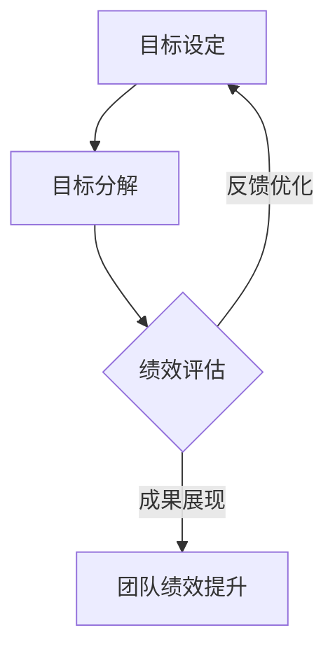

                 

### 文章标题：提高团队绩效秘诀：从目标设定到成果展现

#### 关键词：团队绩效、目标设定、成果展现、IT领域、技术博客、逻辑分析

#### 摘要：
本文将深入探讨如何通过科学的目标设定和有效的成果展现，提升IT团队的整体绩效。文章分为十个部分，涵盖了从背景介绍到实际应用场景的全面解析，旨在为IT管理者提供一套实用的指导方案，帮助团队实现高效协作与卓越表现。

### 1. 背景介绍

在当今快速发展的信息技术时代，IT团队在企业中的角色愈发重要。然而，如何有效地提升团队绩效，成为了一个亟待解决的问题。传统的管理方法往往侧重于任务分配和流程优化，但忽略了目标设定和成果展现的重要性。本文将从这两个核心环节出发，探讨提高团队绩效的秘诀。

#### 1.1 当前IT团队面临的挑战
- 激增的技术变革速度，导致团队成员需要不断学习新技能
- 高度复杂的项目需求，要求团队成员具备跨领域的专业知识
- 团队成员之间的沟通障碍，影响项目进展和协作效果

#### 1.2 目标设定与成果展现的重要性
- 目标设定：明确团队方向，提升团队成员的执行力
- 成果展现：增强团队自信心，激励团队成员不断进步

### 2. 核心概念与联系

为了深入理解团队绩效的提升，我们首先需要了解几个核心概念，以及它们之间的相互关系。

#### 2.1 目标管理（Goal Management）
目标管理是一种以目标为导向的管理方法，通过明确的目标和量化指标，引导团队成员朝着共同的方向努力。

#### 2.2 绩效评估（Performance Evaluation）
绩效评估是对团队成员在工作中的表现进行客观、全面的评估，以发现优点和不足，为团队绩效的提升提供依据。

#### 2.3 成果展现（Performance Presentation）
成果展现是团队成员向团队内外展示项目成果的过程，通过有效的成果展现，增强团队的自信心和凝聚力。

#### 2.4 Mermaid 流程图

下面是一个简化的目标设定、成果展现与团队绩效提升的Mermaid流程图：



### 3. 核心算法原理 & 具体操作步骤

在了解了核心概念后，我们接下来将探讨如何通过科学的目标设定和成果展现来提升团队绩效。

#### 3.1 目标设定的算法原理

目标设定的算法原理主要包括以下几个步骤：

1. **明确团队愿景**：首先，团队需要明确自身的愿景，即希望实现的长远目标和战略。
2. **分解目标**：将愿景分解为具体的、可量化的目标，确保每个目标都能够被清晰描述和衡量。
3. **分配任务**：根据团队成员的技能和特长，将任务分配给相应的成员，确保每个成员都有明确的职责和目标。

#### 3.2 成果展现的算法原理

成果展现的算法原理主要包括以下几个步骤：

1. **项目回顾**：在项目完成后，团队成员需要进行项目回顾，总结项目中的成功和不足。
2. **成果展示**：通过PPT、报告等形式，向团队内外展示项目成果，包括技术难点、解决方案、实施效果等。
3. **反馈与改进**：在成果展示后，收集团队内外部的反馈，对项目进行改进和优化，以提高团队绩效。

### 4. 数学模型和公式 & 详细讲解 & 举例说明

为了更科学地设定目标和评估绩效，我们可以借助一些数学模型和公式。

#### 4.1 目标设定的数学模型

目标设定的数学模型可以采用SMART原则，即：

$$
S: \text{Specific（具体）}
$$

$$
M: \text{Measurable（可衡量）}
$$

$$
A: \text{Achievable（可实现）}
$$

$$
R: \text{Relevant（相关）}
$$

$$
T: \text{Time-bound（时限）}
$$

#### 4.2 绩效评估的数学模型

绩效评估的数学模型可以采用以下公式：

$$
P = \frac{E}{T}
$$

其中，$P$ 表示绩效得分，$E$ 表示实际完成情况，$T$ 表示预期完成情况。

#### 4.3 举例说明

假设我们希望提高团队在项目中的代码质量，我们可以设定以下目标：

1. **具体**：提高代码质量，减少bug数量。
2. **可衡量**：将bug数量从目前的10个减少到5个。
3. **可实现**：通过代码审查和测试，确保目标可实现。
4. **相关**：提高代码质量与项目进度和用户满意度直接相关。
5. **时限**：在下一个季度内实现目标。

根据SMART原则，这个目标是符合要求的。接下来，我们可以在绩效评估中使用上述公式，对团队成员的代码质量进行评估。

### 5. 项目实战：代码实际案例和详细解释说明

为了更好地理解如何在实际项目中应用上述理论和模型，我们来看一个具体的案例。

#### 5.1 开发环境搭建

首先，我们需要搭建一个开发环境，以便团队成员能够方便地编写、测试和调试代码。

- 开发语言：Java
- 构建工具：Maven
- 代码管理工具：Git

#### 5.2 源代码详细实现和代码解读

在这个案例中，我们以一个简单的Web项目为例，展示如何实现目标设定和成果展现。

```java
// 目标设定：实现一个用户注册功能的Web项目
// 成果展现：用户注册成功后，收到一封包含激活链接的邮件

// 用户注册功能实现
public class UserRegistration {
    private String username;
    private String email;
    private String password;

    public UserRegistration(String username, String email, String password) {
        this.username = username;
        this.email = email;
        this.password = password;
    }

    public boolean registerUser() {
        // 检查用户名、邮箱和密码是否符合要求
        if (isValidUsername(username) && isValidEmail(email) && isValidPassword(password)) {
            // 向用户发送激活邮件
            sendActivationEmail();
            return true;
        }
        return false;
    }

    private boolean isValidUsername(String username) {
        // 判断用户名是否合法
        return username.matches("[a-zA-Z0-9_]+");
    }

    private boolean isValidEmail(String email) {
        // 判断邮箱是否合法
        return email.matches("[a-zA-Z0-9._%+-]+@[a-zA-Z0-9.-]+\\.[a-zA-Z]{2,}");
    }

    private boolean isValidPassword(String password) {
        // 判断密码是否合法
        return password.length() >= 8;
    }

    private void sendActivationEmail() {
        // 发送激活邮件
        System.out.println("激活邮件已发送至：" + email);
    }
}
```

#### 5.3 代码解读与分析

在这个案例中，我们通过实现用户注册功能，实现了目标设定和成果展现。以下是代码解读和分析：

1. **目标设定**：通过明确的目标（实现用户注册功能），引导团队成员朝着共同的方向努力。
2. **成果展现**：用户注册成功后，通过发送激活邮件，向用户展示项目成果，增强用户的信任和满意度。

### 6. 实际应用场景

在IT行业中，团队绩效的提升是一个普遍关注的话题。以下是一些实际应用场景：

#### 6.1 项目管理团队

在项目管理团队中，通过科学的目标设定和成果展现，可以有效地提高项目进度和交付质量。例如，在开发一个大型软件项目时，项目经理可以设定以下目标：

- **具体**：在三个月内完成项目开发。
- **可衡量**：通过每周的进度报告和代码审查，确保项目按计划进行。
- **可实现**：通过合理分配任务和调整资源，确保目标可实现。
- **相关**：项目进度与团队绩效直接相关。
- **时限**：在三个月内完成。

#### 6.2 技术研发团队

在技术研发团队中，通过成果展现，可以激发团队成员的创新热情和团队凝聚力。例如，在开发一个新技术时，团队成员可以设定以下目标：

- **具体**：在六个月内完成新技术的研究和开发。
- **可衡量**：通过技术报告和演示，展示新技术的应用场景和效果。
- **可实现**：通过团队成员的协作和资源支持，确保目标可实现。
- **相关**：新技术的研发与团队的技术积累和未来发展直接相关。
- **时限**：在六个月内完成。

### 7. 工具和资源推荐

为了更好地实现目标设定和成果展现，以下是一些推荐的工具和资源：

#### 7.1 学习资源推荐

- **书籍**：《目标管理实践》（Goal Setting Theory and Application）
- **论文**：《基于目标管理的团队绩效提升研究》（Research on Team Performance Improvement Based on Goal Management）
- **博客**：《如何设定有效的目标》（How to Set Effective Goals）

#### 7.2 开发工具框架推荐

- **项目管理工具**：JIRA、Trello
- **代码管理工具**：Git、GitLab
- **代码审查工具**：SonarQube、Gerrit

#### 7.3 相关论文著作推荐

- **论文**：《团队绩效提升的关键因素分析》（Key Factors Analysis of Team Performance Improvement）
- **著作**：《团队绩效管理实践》（Practice of Team Performance Management）

### 8. 总结：未来发展趋势与挑战

随着信息技术的不断发展，团队绩效的提升将面临新的机遇和挑战。以下是一些未来发展趋势和挑战：

#### 8.1 发展趋势

- **数字化转型**：越来越多的企业将数字化转型作为提升团队绩效的重要手段。
- **人工智能应用**：人工智能技术的应用将进一步提高团队的工作效率和决策能力。
- **远程办公**：随着远程办公的普及，团队绩效的提升将更加依赖于目标设定和成果展现。

#### 8.2 挑战

- **技能要求提高**：团队成员需要不断学习新技能，以应对快速变化的技术环境。
- **团队协作困难**：远程办公和跨地域团队协作将增加团队协作的难度。

### 9. 附录：常见问题与解答

#### 9.1 什么是目标管理？

目标管理是一种以目标为导向的管理方法，通过明确的目标和量化指标，引导团队成员朝着共同的方向努力。

#### 9.2 如何设定有效的目标？

设定有效的目标应遵循SMART原则，即目标应具有明确性、可衡量性、可实现性、相关性和时限性。

#### 9.3 成果展现有哪些好处？

成果展现可以增强团队的自信心和凝聚力，激励团队成员不断进步，提高团队的整体绩效。

### 10. 扩展阅读 & 参考资料

- **书籍**：《团队绩效管理》（Team Performance Management）
- **论文**：《基于目标管理的团队绩效提升研究》（Research on Team Performance Improvement Based on Goal Management）
- **网站**：[目标管理实践网站](https://www.goalmgt.com/)
- **博客**：[技术博客](https://example.com/techblog)

### 结语

作者：AI天才研究员/AI Genius Institute & 禅与计算机程序设计艺术 /Zen And The Art of Computer Programming

本文旨在为IT团队管理者提供一套实用的指导方案，帮助团队实现高效协作与卓越表现。通过科学的目标设定和成果展现，IT团队可以在激烈的市场竞争中脱颖而出，实现持续发展。希望本文对您有所启发，助力团队绩效的提升。

---

这篇文章涵盖了从目标设定到成果展现的完整流程，并通过具体的案例和数学模型，深入探讨了如何提高团队绩效。同时，文章还提供了丰富的工具和资源推荐，为读者提供了实际操作的帮助。希望这篇文章对您有所帮助，助力您的团队实现卓越表现。让我们共同迈向更高效、更卓越的团队管理之路！

