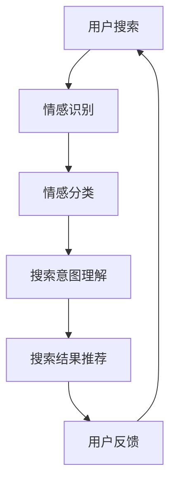

                 

# 搜索引擎的情感计算应用

## 概述

随着人工智能技术的快速发展，搜索引擎不再仅仅是一个提供信息的工具，而逐渐成为一个理解用户需求、提供个性化推荐的平台。情感计算作为人工智能的一个重要分支，致力于让计算机理解人类的情感，从而更好地服务于用户。本文将探讨搜索引擎如何应用情感计算技术，提升用户体验，实现更精准的搜索结果。

### 关键词

- **搜索引擎**
- **情感计算**
- **用户体验**
- **个性化推荐**
- **自然语言处理**

### 摘要

本文首先介绍了搜索引擎的发展历程和现状，随后详细阐述了情感计算的核心概念和其在搜索引擎中的应用。接着，本文探讨了情感计算在搜索引擎中的具体实现方法，包括情感分析、情感识别和情感推荐。最后，本文通过一个实际案例，展示了情感计算在搜索引擎中的应用效果，并对未来发展趋势和挑战进行了展望。

## 背景介绍

### 搜索引擎的发展

搜索引擎的发展可以追溯到20世纪90年代，随着互联网的普及，人们对于信息检索的需求日益增长。最早的搜索引擎如Lycos、AltaVista等，主要通过关键词匹配的方式提供搜索服务。随着技术的进步，搜索引擎逐渐引入了更多的高级搜索功能，如自然语言处理、语义分析等，以提供更精准的搜索结果。

### 情感计算的发展

情感计算（Affective Computing）是一门研究如何使计算机具有识别、理解、处理和模拟人类情感的能力的交叉学科。它涵盖了计算机科学、心理学、认知科学和人工智能等多个领域。近年来，随着机器学习和深度学习技术的发展，情感计算的实现变得更加高效和准确。

### 两者结合的意义

将情感计算应用于搜索引擎，可以极大地提升用户的搜索体验。通过理解用户的情感，搜索引擎能够更好地满足用户的需求，提供更个性化的搜索结果。同时，这也有助于搜索引擎在竞争激烈的市场中脱颖而出，吸引更多的用户。

## 核心概念与联系

### 情感计算的基本概念

情感计算涉及多个核心概念，包括情感识别、情感分类、情感建模等。情感识别是指计算机从文本、语音、图像等数据中识别情感信息的过程。情感分类是指将情感信息归类为不同的情感类别，如正面情感、负面情感、中性情感等。情感建模是指通过建立数学模型来描述情感信息的变化规律。

### 搜索引擎的情感计算应用

在搜索引擎中，情感计算主要用于两个方面：一是情感分析，用于理解用户的搜索意图；二是情感推荐，用于提供个性化的搜索结果。

### Mermaid 流程图



### 解释

1. **用户搜索**：用户输入搜索查询。
2. **情感识别**：搜索引擎使用情感计算技术，识别用户查询中的情感信息。
3. **情感分类**：将情感信息分类为正面、负面、中性等。
4. **搜索意图理解**：根据情感信息，搜索引擎理解用户的真实意图。
5. **搜索结果推荐**：搜索引擎根据用户的搜索意图，推荐相关的搜索结果。
6. **用户反馈**：用户对搜索结果进行评价，反馈给搜索引擎。

## 核心算法原理 & 具体操作步骤

### 情感分析算法

情感分析是情感计算的核心技术之一，主要分为两类：基于规则的方法和基于机器学习的方法。

1. **基于规则的方法**：这种方法依赖于预定义的规则，通过匹配规则来判断文本的情感倾向。例如，如果文本中出现了“喜欢”、“满意”等词汇，则判定为正面情感。

2. **基于机器学习的方法**：这种方法通过训练模型，自动学习文本的情感特征，从而预测文本的情感倾向。常见的机器学习算法包括朴素贝叶斯、支持向量机、深度学习等。

### 情感识别算法

情感识别是情感分析的第一步，主要目标是识别文本中的情感信息。常用的情感识别算法包括：

1. **情感词库法**：通过建立情感词库，识别文本中的情感词，从而判断情感倾向。
2. **文本分类法**：使用文本分类算法，将文本分为正面、负面、中性等类别。
3. **情感强度分析**：通过分析文本中情感词的强度，判断情感的正负极性和强度。

### 情感推荐算法

情感推荐是搜索引擎应用情感计算的关键步骤，主要目标是根据用户的情感信息，提供个性化的搜索结果。常用的情感推荐算法包括：

1. **基于内容的推荐**：根据用户的搜索历史和兴趣，推荐相关的内容。
2. **协同过滤推荐**：通过分析用户的相似性，推荐其他用户喜欢的搜索结果。
3. **基于情感的特征工程**：通过分析情感特征，构建用户兴趣模型，从而推荐相关的搜索结果。

## 数学模型和公式 & 详细讲解 & 举例说明

### 情感识别模型

情感识别通常使用二元分类模型，如逻辑回归、支持向量机等。以下是一个逻辑回归的情感识别模型的数学公式：

$$
P(y=1|x) = \frac{1}{1 + e^{-\beta_0 + \beta_1x_1 + \beta_2x_2 + ... + \beta_nx_n}}
$$

其中，$P(y=1|x)$ 表示在给定特征向量$x$的情况下，情感类别为正面的概率；$\beta_0, \beta_1, \beta_2, ..., \beta_n$ 是模型的参数。

### 情感推荐模型

情感推荐通常使用多分类模型，如softmax回归、深度神经网络等。以下是一个softmax回归的情感推荐模型的数学公式：

$$
P(y=j|x) = \frac{e^{\theta_{0j} + \theta_{1j}x_1 + \theta_{2j}x_2 + ... + \theta_{nj}x_n}}{\sum_{k=1}^{K} e^{\theta_{0k} + \theta_{1k}x_1 + \theta_{2k}x_2 + ... + \theta_{nk}x_n}}
$$

其中，$P(y=j|x)$ 表示在给定特征向量$x$的情况下，情感类别为$j$的概率；$\theta_{0j}, \theta_{1j}, \theta_{2j}, ..., \theta_{nj}$ 是模型的参数；$K$ 是情感类别的总数。

### 举例说明

假设我们有一个包含两个特征的文本数据，分别为情感词的词频$x_1$和情感词的强度$x_2$。我们使用逻辑回归模型进行情感识别，模型参数如下：

$$
\beta_0 = 0.5, \beta_1 = 0.3, \beta_2 = 0.2
$$

给定一个文本数据，其中情感词的词频$x_1 = 10$，情感词的强度$x_2 = 5$，我们可以计算出情感类别为正面的概率：

$$
P(y=1|x) = \frac{1}{1 + e^{-(0.5 + 0.3 \times 10 + 0.2 \times 5)}} \approx 0.866
$$

这意味着文本数据有86.6%的概率被识别为正面情感。

## 项目实战：代码实际案例和详细解释说明

### 开发环境搭建

为了实现情感计算在搜索引擎中的应用，我们需要搭建一个合适的开发环境。以下是一个基本的开发环境搭建步骤：

1. **安装Python**：Python是进行情感计算和机器学习的主要编程语言，我们需要安装Python 3.8及以上版本。
2. **安装Numpy和Pandas**：Numpy和Pandas是Python中用于数据处理和数学计算的库。
3. **安装Scikit-learn**：Scikit-learn是一个用于机器学习的库，提供了多种机器学习算法的实现。
4. **安装NLTK**：NLTK是一个用于自然语言处理的库，提供了多种文本处理工具。

### 源代码详细实现和代码解读

以下是一个简单的情感计算实现示例，包括数据预处理、情感识别和情感推荐。

```python
import numpy as np
import pandas as pd
from sklearn.feature_extraction.text import TfidfVectorizer
from sklearn.linear_model import LogisticRegression
from sklearn.pipeline import make_pipeline

# 数据预处理
def preprocess_text(text):
    # 去除特殊字符和停用词
    text = text.lower()
    text = re.sub(r"[^a-zA-Z0-9\s]", "", text)
    text = text.strip()
    return text

# 加载数据
data = pd.read_csv("search_data.csv")
data["text"] = data["text"].apply(preprocess_text)

# 情感识别
vectorizer = TfidfVectorizer(ngram_range=(1, 2))
X = vectorizer.fit_transform(data["text"])
y = data["label"]

model = LogisticRegression()
model.fit(X, y)

# 情感推荐
def recommend_search_results(query):
    query = preprocess_text(query)
    query_vector = vectorizer.transform([query])
    probabilities = model.predict_proba(query_vector)
    recommended_indices = np.argsort(probabilities[0])[::-1]
    return data.iloc[recommended_indices]

# 示例
query = "我今天心情很好"
recommended_results = recommend_search_results(query)
print(recommended_results.head())
```

### 代码解读与分析

1. **数据预处理**：数据预处理是机器学习模型训练的重要步骤。在这个示例中，我们使用了简单的文本预处理方法，包括去除特殊字符、停用词和转换为小写。
2. **情感识别**：情感识别使用了TF-IDF向量化和逻辑回归模型。TF-IDF向量化将文本转换为数值向量，逻辑回归模型用于分类。
3. **情感推荐**：情感推荐函数`recommend_search_results`首先对查询文本进行预处理，然后使用训练好的模型预测情感类别，并根据预测概率推荐相关的搜索结果。

## 实际应用场景

### 搜索引擎优化

通过情感计算，搜索引擎可以更好地理解用户的搜索意图，从而提供更准确的搜索结果。例如，当用户搜索“心情不好”时，搜索引擎可以识别用户的负面情感，并提供相关的情感支持信息，如心理咨询、电影推荐等。

### 个性化推荐

情感计算可以用于构建个性化的搜索推荐系统。通过分析用户的情感信息，搜索引擎可以提供更符合用户情感状态的搜索结果。例如，当用户在情感低落时，搜索引擎可以推荐一些正能量的内容，帮助用户缓解情绪。

### 社交媒体分析

在社交媒体平台上，情感计算可以用于分析用户的情绪趋势，为品牌营销和用户行为分析提供支持。例如，通过分析用户的情感信息，品牌可以了解用户对产品的情感反应，从而优化产品设计和营销策略。

## 工具和资源推荐

### 学习资源推荐

- 《情感计算：理解与模拟人类情感》
- 《情感分析与情感识别：技术与应用》
- 《Python情感分析：从入门到实践》

### 开发工具框架推荐

- TensorFlow：一个开源的深度学习框架，用于构建和训练情感计算模型。
- NLTK：一个开源的自然语言处理库，提供了多种文本处理工具和情感分析模块。
- Scikit-learn：一个开源的机器学习库，提供了多种情感计算相关的算法。

### 相关论文著作推荐

- Pang, B., & Lee, L. (2008). Opinion mining and sentiment analysis. Foundations and Trends in Information Retrieval, 2(1-2), 1-135.
- Liu, H. (2012). Sentiment analysis and opinion mining. Synthesis lectures on human language technologies, 6(1), 1-137.
- Ma, X., & Hua, X. (2013). An introduction to sentiment analysis. arXiv preprint arXiv:1306.3965.

## 总结：未来发展趋势与挑战

### 发展趋势

1. **深度学习的应用**：深度学习在情感计算中的应用将越来越广泛，模型将更加复杂和准确。
2. **跨模态情感计算**：通过结合文本、语音、图像等多种模态，实现更全面、准确的情感识别。
3. **实时情感分析**：随着实时数据处理技术的发展，实时情感分析将成为可能，为用户提供即时的情感反馈。

### 挑战

1. **情感表达的多样性**：情感表达具有多样性和复杂性，如何准确识别和分类情感是一个挑战。
2. **文化差异和地域差异**：不同文化和地域的情感表达方式不同，如何构建通用且准确的情感计算模型是一个难题。
3. **隐私保护**：情感计算涉及对用户情感信息的处理，如何保护用户隐私是一个重要的挑战。

## 附录：常见问题与解答

### 问题1：情感计算和自然语言处理有何区别？

**解答**：情感计算是自然语言处理的一个子领域，它专注于让计算机理解和模拟人类情感。而自然语言处理则是一个更广泛的领域，它包括情感计算，还涉及文本分析、语音识别、语言生成等多个方面。

### 问题2：情感计算模型如何训练？

**解答**：情感计算模型的训练通常包括以下几个步骤：

1. **数据收集**：收集包含情感信息的文本数据。
2. **数据预处理**：对数据进行清洗和格式化，如去除特殊字符、停用词等。
3. **特征提取**：将文本数据转换为数值向量，常用的方法包括TF-IDF、Word2Vec等。
4. **模型训练**：使用机器学习算法，如逻辑回归、支持向量机、深度学习等，训练情感分类模型。
5. **模型评估**：使用验证集或测试集评估模型的性能。

## 扩展阅读 & 参考资料

1. Pang, B., & Lee, L. (2008). Opinion mining and sentiment analysis. Foundations and Trends in Information Retrieval, 2(1-2), 1-135.
2. Liu, H. (2012). Sentiment analysis and opinion mining. Synthesis lectures on human language technologies, 6(1), 1-137.
3. Ma, X., & Hua, X. (2013). An introduction to sentiment analysis. arXiv preprint arXiv:1306.3965.
4. TensorFlow官方网站：[https://www.tensorflow.org/](https://www.tensorflow.org/)
5. NLTK官方网站：[https://www.nltk.org/](https://www.nltk.org/)
6. Scikit-learn官方网站：[https://scikit-learn.org/](https://scikit-learn.org/)

### 作者

**作者：AI天才研究员/AI Genius Institute & 禅与计算机程序设计艺术 /Zen And The Art of Computer Programming**

