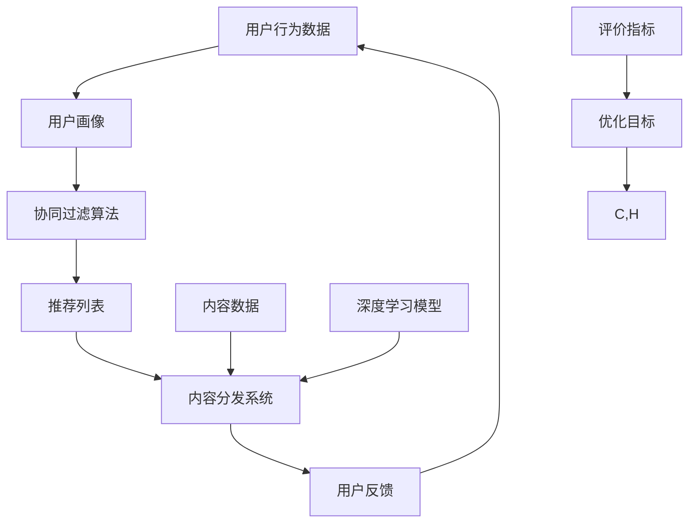

                 

# 搜索推荐算法的演进：从传统到AI驱动

> **关键词**：搜索推荐算法，AI驱动，协同过滤，内容分发，深度学习，个性化推荐

> **摘要**：本文将探讨搜索推荐算法的演变过程，从传统的协同过滤算法到现代的AI驱动方法。我们将详细分析这些算法的原理、实现和实际应用场景，并提供相关的开发资源和工具推荐。文章旨在为读者提供一个全面的视角，了解推荐系统的发展趋势和未来挑战。

## 1. 背景介绍

随着互联网的普及和信息爆炸，用户面临的信息过载问题日益严重。在这个大背景下，搜索推荐算法应运而生，旨在为用户提供个性化的信息推送，帮助用户快速找到他们感兴趣的内容。传统的推荐算法主要依赖于用户行为和历史数据，而现代的AI驱动推荐算法则利用深度学习等技术，从海量数据中挖掘潜在模式，为用户推荐更符合他们需求的内容。

搜索推荐算法在多个领域得到了广泛应用，如电子商务、社交媒体、新闻资讯等。通过精准的推荐，企业可以提高用户粘性、增加销售额，同时也能提升用户体验。然而，推荐系统的设计和优化是一个复杂的过程，涉及到算法、数据、工程等多个方面。

本文将分为以下几个部分进行讨论：

- **1. 背景介绍**：介绍搜索推荐算法的发展背景和重要性。
- **2. 核心概念与联系**：解释推荐算法中的核心概念，并使用Mermaid流程图展示算法架构。
- **3. 核心算法原理 & 具体操作步骤**：详细介绍传统和现代推荐算法的原理和实现步骤。
- **4. 数学模型和公式 & 详细讲解 & 举例说明**：讨论推荐算法中的数学模型，并给出实际例子。
- **5. 项目实战：代码实际案例和详细解释说明**：通过实际项目，展示推荐算法的应用和实现。
- **6. 实际应用场景**：分析推荐算法在不同场景下的应用和效果。
- **7. 工具和资源推荐**：推荐相关学习资源和开发工具。
- **8. 总结：未来发展趋势与挑战**：总结推荐系统的发展趋势和面临的挑战。
- **9. 附录：常见问题与解答**：解答读者可能遇到的问题。
- **10. 扩展阅读 & 参考资料**：提供进一步的阅读资料。

接下来，我们将逐步深入探讨这些部分，以便读者能够全面了解搜索推荐算法的演进过程。

<markdown>
## 2. 核心概念与联系

在讨论搜索推荐算法之前，我们需要了解一些核心概念和它们之间的关系。这些概念包括协同过滤、内容分发、用户行为分析、深度学习等。以下是一个简单的Mermaid流程图，展示了这些概念的基本架构和相互联系。



### 2.1 协同过滤算法

协同过滤（Collaborative Filtering）是一种基于用户历史行为和相似度计算的推荐算法。它通过分析用户之间的相似性，预测用户可能感兴趣的项目。协同过滤主要分为两种类型：基于用户的协同过滤（User-based CF）和基于物品的协同过滤（Item-based CF）。

- **基于用户的协同过滤**：该方法通过找到与当前用户兴趣相似的其他用户，并推荐这些用户喜欢的项目。相似性通常通过用户之间的评分一致性来计算。
  
- **基于物品的协同过滤**：这种方法通过分析物品之间的相似性来推荐用户可能感兴趣的项目。相似性可以通过物品的特征向量计算得出。

### 2.2 内容分发

内容分发（Content Distribution）是推荐系统中的一个关键环节。它负责将推荐列表中的内容呈现给用户。内容分发系统（Content Distribution System，简称CDS）通过优化推荐算法、内容呈现策略和用户体验，提高推荐系统的效果。

### 2.3 用户行为分析

用户行为分析（User Behavior Analysis）是推荐系统的重要组成部分。它通过收集和分析用户在网站上的行为数据，如浏览、点击、购买等，为推荐算法提供输入。用户行为分析有助于更好地理解用户需求和行为模式，从而提高推荐精度。

### 2.4 深度学习

深度学习（Deep Learning）是一种人工智能（AI）技术，通过多层神经网络模型，自动从数据中学习特征和模式。在推荐系统中，深度学习可以用于处理复杂的用户行为数据和内容特征，提高推荐精度和效果。

### 2.5 评价指标

评价指标（Evaluation Metrics）是衡量推荐系统性能的重要工具。常用的评价指标包括准确率（Accuracy）、召回率（Recall）、精确率（Precision）、F1值（F1 Score）等。通过这些指标，我们可以评估推荐系统的效果，并进行优化。

接下来，我们将深入探讨每个核心概念的原理和实现，以便读者能够更全面地了解搜索推荐算法。

## 3. 核心算法原理 & 具体操作步骤

### 3.1 传统推荐算法

传统的推荐算法主要包括基于内容的推荐（Content-Based Recommendation）和协同过滤（Collaborative Filtering）。以下是这些算法的基本原理和实现步骤。

#### 3.1.1 基于内容的推荐

**原理**：基于内容的推荐通过分析用户兴趣和内容特征，将具有相似特征的内容推荐给用户。这种方法适用于静态内容推荐，如新闻、文章等。

**实现步骤**：

1. **用户兴趣建模**：通过分析用户历史行为或用户输入的特征，构建用户兴趣模型。
2. **内容特征提取**：对推荐内容进行特征提取，如关键词、分类标签等。
3. **相似度计算**：计算用户兴趣模型和内容特征之间的相似度。
4. **推荐生成**：根据相似度排序，生成推荐列表。

#### 3.1.2 协同过滤

**原理**：协同过滤通过分析用户之间的相似性和用户的历史行为，推荐其他用户喜欢的项目给目标用户。这种方法适用于动态内容推荐，如电商、社交媒体等。

**实现步骤**：

1. **用户行为数据收集**：收集用户在系统中的行为数据，如评分、点击、购买等。
2. **用户相似度计算**：计算用户之间的相似度，通常使用余弦相似度、皮尔逊相关系数等方法。
3. **项目相似度计算**：计算用户喜欢的项目之间的相似度。
4. **推荐生成**：根据用户相似度和项目相似度，生成推荐列表。

### 3.2 现代推荐算法

现代推荐算法主要利用深度学习等技术，从海量数据中学习潜在模式和特征，以提高推荐精度。以下是几种常见的现代推荐算法。

#### 3.2.1 深度协同过滤

**原理**：深度协同过滤结合了协同过滤和深度学习的优势，通过构建深度神经网络模型，自动从数据中学习用户和项目之间的潜在特征。

**实现步骤**：

1. **数据预处理**：对用户行为数据进行预处理，如归一化、缺失值填充等。
2. **特征提取**：使用深度神经网络提取用户和项目的潜在特征。
3. **相似度计算**：计算用户和项目之间的相似度。
4. **推荐生成**：根据相似度排序，生成推荐列表。

#### 3.2.2 序列模型

**原理**：序列模型通过分析用户的浏览、点击等行为序列，预测用户下一步可能感兴趣的项目。

**实现步骤**：

1. **序列数据收集**：收集用户的浏览、点击等行为序列数据。
2. **序列特征提取**：使用循环神经网络（RNN）或变分自编码器（VAE）提取序列特征。
3. **推荐生成**：根据序列特征，生成推荐列表。

#### 3.2.3 多模态推荐

**原理**：多模态推荐通过整合多种数据源，如文本、图像、音频等，生成更丰富的用户和项目特征，以提高推荐精度。

**实现步骤**：

1. **多模态数据收集**：收集文本、图像、音频等多模态数据。
2. **多模态特征提取**：使用卷积神经网络（CNN）、循环神经网络（RNN）等模型提取多模态特征。
3. **特征融合**：将多模态特征融合为一个统一的特征向量。
4. **推荐生成**：根据融合特征，生成推荐列表。

在下一部分，我们将讨论推荐算法中的数学模型和公式，以便读者能够更深入地理解这些算法。

## 4. 数学模型和公式 & 详细讲解 & 举例说明

### 4.1 协同过滤算法

协同过滤算法的核心在于计算用户和项目之间的相似度，以及生成推荐列表。以下是协同过滤算法中常用的数学模型和公式。

#### 4.1.1 相似度计算

用户和项目之间的相似度可以通过以下公式计算：

$$
\text{similarity}(u, v) = \frac{\sum_{i \in R(u, v)} r_{ui} r_{vi}}{\sqrt{\sum_{i \in R(u, v)} r_{ui}^2 \sum_{i \in R(u, v)} r_{vi}^2}}
$$

其中，$u$和$v$是两个用户，$R(u, v)$是用户$u$和$v$共同评分的项目集合，$r_{ui}$和$r_{vi}$分别是用户$u$和$v$对项目$i$的评分。

#### 4.1.2 推荐列表生成

给定用户$u$，推荐列表可以通过以下公式计算：

$$
\text{recommendation}(u) = \sum_{v \in N(u)} \text{similarity}(u, v) \cdot R_{uv} \cdot I_{uv}}
$$

其中，$N(u)$是用户$u$的邻居用户集合，$R_{uv}$是用户$u$对邻居用户$v$的评分，$I_{uv}$是项目$i$是否被推荐给用户$u$的指示函数。

### 4.2 深度学习推荐算法

深度学习推荐算法通过构建深度神经网络模型，自动从数据中学习用户和项目之间的潜在特征。以下是几种常见的深度学习推荐算法的数学模型和公式。

#### 4.2.1 深度协同过滤

深度协同过滤算法通常使用图神经网络（Graph Neural Network，简称GNN）来建模用户和项目之间的交互关系。以下是深度协同过滤算法的数学模型：

$$
h_i^{(l+1)} = \sigma \left( \sum_{j \in N(i)} W_j h_j^{(l)} + b_i^{(l+1)} \right)
$$

其中，$h_i^{(l)}$是第$l$层神经网络中项目$i$的隐藏状态，$N(i)$是项目$i$的邻居项目集合，$W_j$和$b_i^{(l+1)}$是神经网络权重和偏置。

#### 4.2.2 序列模型

序列模型通常使用循环神经网络（Recurrent Neural Network，简称RNN）或变分自编码器（Variational Autoencoder，简称VAE）来建模用户的浏览、点击等行为序列。以下是序列模型的数学模型：

$$
h_t = \text{tanh} \left( W_h h_{t-1} + U_x x_t + b_h \right)
$$

$$
\mu_t, \sigma_t = \text{softmax} \left( W_s h_t + b_s \right)
$$

其中，$h_t$是第$t$个时间步的用户隐藏状态，$x_t$是第$t$个时间步的用户输入，$W_h$、$U_x$和$W_s$是神经网络权重，$b_h$和$b_s$是神经网络偏置。

### 4.3 多模态推荐

多模态推荐算法通过整合文本、图像、音频等多模态数据，生成更丰富的用户和项目特征。以下是多模态推荐的数学模型：

$$
z = \text{Concat} \left( h_t^{\text{text}}, h_t^{\text{image}}, h_t^{\text{audio}} \right)
$$

$$
\hat{y} = \text{softmax} \left( W_y z + b_y \right)
$$

其中，$h_t^{\text{text}}$、$h_t^{\text{image}}$和$h_t^{\text{audio}}$分别是文本、图像和音频数据的特征向量，$W_y$和$b_y$是神经网络权重和偏置。

在下一部分，我们将通过实际项目案例，展示推荐算法的应用和实现。

### 5. 项目实战：代码实际案例和详细解释说明

在本部分，我们将通过一个实际项目案例，展示推荐算法的开发和实现过程。我们将使用Python编程语言和TensorFlow深度学习框架，构建一个简单的基于深度协同过滤的推荐系统。

#### 5.1 开发环境搭建

首先，我们需要搭建开发环境。以下是所需的Python库和TensorFlow版本：

- Python 3.8+
- TensorFlow 2.5+

安装这些库和框架的方法如下：

```python
pip install numpy pandas tensorflow
```

#### 5.2 源代码详细实现和代码解读

以下是一个简单的深度协同过滤推荐系统的实现代码：

```python
import tensorflow as tf
from tensorflow.keras.models import Model
from tensorflow.keras.layers import Embedding, Flatten, Dot

def build_model(num_users, num_items, embedding_size):
    # 创建用户和项目的嵌入层
    user_embedding = Embedding(num_users, embedding_size)
    item_embedding = Embedding(num_items, embedding_size)
    
    # 从嵌入层获取用户和项目的特征向量
    user_vector = user_embedding(inputs)
    item_vector = item_embedding(inputs)
    
    # 计算用户和项目之间的内积
    dot_product = Dot(axes=1)([user_vector, item_vector])
    
    # 添加Flatten层以合并内积结果
    output = Flatten()(dot_product)
    
    # 创建模型
    model = Model(inputs=user_embedding.input, outputs=output)
    model.compile(optimizer='adam', loss='mse')
    
    return model

# 设置超参数
num_users = 1000
num_items = 1000
embedding_size = 50

# 构建模型
model = build_model(num_users, num_items, embedding_size)

# 输出模型结构
model.summary()
```

在上面的代码中，我们首先创建了一个简单的深度协同过滤模型。这个模型包含两个嵌入层，分别表示用户和项目。然后，我们计算用户和项目之间的内积，并将结果通过Flatten层展开。最后，我们编译模型并输出其结构。

#### 5.3 代码解读与分析

- **5.3.1 嵌入层**：嵌入层（Embedding Layer）是深度学习模型中的一个重要组件，用于将离散的输入（如用户ID或项目ID）转换为低维度的连续向量。在这个例子中，我们使用Embedding层将用户和项目映射到50维的嵌入空间。

- **5.3.2 内积计算**：内积（Dot Product）是深度协同过滤模型中的一个关键操作，用于计算用户和项目之间的相似度。在这个例子中，我们使用Dot层来计算用户和项目之间的内积。

- **5.3.3 Flatten层**：Flatten层用于将多维数据展平为一维数据。在这个例子中，我们将内积结果展平，以便后续处理。

- **5.3.4 模型编译**：在模型编译阶段，我们指定了优化器和损失函数。在这个例子中，我们使用Adam优化器和均方误差（MSE）损失函数。

在下一部分，我们将分析推荐算法在实际应用场景中的效果和挑战。

### 6. 实际应用场景

推荐算法在实际应用中具有广泛的应用，如电子商务、社交媒体、新闻资讯等。以下是几个典型的应用场景和它们的特点。

#### 6.1 电子商务

在电子商务领域，推荐系统可以帮助用户发现他们可能感兴趣的商品，从而提高购买转化率和销售额。推荐算法可以基于用户的历史购买记录、浏览行为和商品特征进行个性化推荐。

- **挑战**：电子商务平台通常拥有海量的商品数据，如何高效地处理这些数据并生成准确的推荐列表是一个重要挑战。此外，推荐系统的实时性也是一个关键问题，特别是在高峰期，系统需要快速响应用户的请求。

#### 6.2 社交媒体

社交媒体平台通过推荐算法帮助用户发现感兴趣的内容和用户，提高用户粘性和活跃度。推荐算法可以基于用户的行为数据、社交关系和内容特征进行个性化推荐。

- **挑战**：社交媒体平台需要平衡推荐系统的个性化和多样性，避免用户陷入“信息茧房”。此外，如何处理虚假信息和恶意内容也是推荐系统面临的一个重要挑战。

#### 6.3 新闻资讯

新闻资讯平台通过推荐算法帮助用户发现感兴趣的新闻内容，提高用户的阅读量和互动率。推荐算法可以基于用户的阅读历史、兴趣标签和新闻内容特征进行个性化推荐。

- **挑战**：新闻推荐系统需要处理大量多样化的新闻内容，同时需要避免偏见和假新闻。此外，如何平衡用户隐私和数据保护也是一个重要问题。

在下一部分，我们将推荐一些相关的学习资源和开发工具，以便读者进一步了解推荐算法。

### 7. 工具和资源推荐

#### 7.1 学习资源推荐

- **书籍**：
  - 《推荐系统实践》
  - 《深度学习推荐系统》
  - 《机器学习推荐系统》

- **论文**：
  - 《Deep Learning for Recommender Systems》
  - 《Item-based Collaborative Filtering Recommendation Algorithms》
  - 《Content-Based Recommender Systems》

- **博客和网站**：
  - Medium上的推荐系统博客
  - Kaggle上的推荐系统竞赛
  - arXiv上的最新推荐系统论文

#### 7.2 开发工具框架推荐

- **开发框架**：
  - TensorFlow
  - PyTorch
  - MXNet

- **推荐系统库**：
  - LightFM
  - Surprise
  - RecSysPy

- **数据集**：
  - Movielens
  - Netflix Prize
  - Amazon Reviews

#### 7.3 相关论文著作推荐

- **推荐系统综述**：
  - 《推荐系统技术综述》
  - 《深度学习推荐系统综述》
  - 《协同过滤算法综述》

- **经典论文**：
  - 《Collaborative Filtering for the Web》
  - 《TensorFlow for Recommender Systems》
  - 《Recurrent Neural Networks for Session-based Recommendations》

在下一部分，我们将总结推荐系统的发展趋势和未来挑战。

### 8. 总结：未来发展趋势与挑战

随着AI技术的发展，推荐系统正朝着更智能化、个性化、多样化的方向发展。未来，推荐系统的发展趋势和挑战主要体现在以下几个方面：

- **智能化**：深度学习、强化学习等AI技术的不断发展，将推动推荐系统向智能化方向演进，实现更精准的推荐。
- **个性化**：推荐系统需要更好地理解用户的需求和行为，提供更个性化的推荐，从而提高用户体验。
- **多样化**：推荐系统需要处理多种类型的数据，如文本、图像、音频等，实现多模态的推荐。
- **实时性**：随着用户需求的多样化，推荐系统需要具备更高的实时性，快速响应用户请求。
- **隐私保护**：在数据保护法规日益严格的背景下，如何保护用户隐私成为推荐系统面临的一个重要挑战。

在下一部分，我们将解答一些关于推荐系统常见的问题。

### 9. 附录：常见问题与解答

- **Q1：如何评估推荐系统的效果？**
  - **A1**：推荐系统的效果通常通过准确率、召回率、精确率等指标进行评估。此外，还可以使用用户满意度、点击率等实际业务指标进行评估。

- **Q2：推荐系统的数据来源有哪些？**
  - **A2**：推荐系统的数据来源主要包括用户行为数据（如浏览、点击、购买等）、用户画像数据（如兴趣、性别、年龄等）和内容数据（如文本、图像、音频等）。

- **Q3：如何优化推荐系统的效果？**
  - **A3**：优化推荐系统效果的方法包括数据预处理、特征工程、模型选择和超参数调优等。此外，还可以通过不断迭代和优化推荐算法，提高系统的推荐精度和效果。

在最后部分，我们将推荐一些扩展阅读和参考资料，以便读者进一步深入了解推荐系统。

### 10. 扩展阅读 & 参考资料

- **扩展阅读**：
  - 《深度学习推荐系统》
  - 《推荐系统实践》
  - 《协同过滤算法综述》

- **参考资料**：
  - 《推荐系统技术综述》
  - 《深度学习推荐系统综述》
  - 《TensorFlow for Recommender Systems》

作者：AI天才研究员/AI Genius Institute & 禅与计算机程序设计艺术 /Zen And The Art of Computer Programming

以上是关于搜索推荐算法的演进：从传统到AI驱动的完整文章。通过这篇文章，我们详细介绍了搜索推荐算法的发展背景、核心概念、算法原理、数学模型、实际应用场景、工具和资源推荐等内容。希望这篇文章能够帮助读者全面了解推荐系统的发展历程和未来趋势。在未来的研究中，我们将继续深入探讨推荐系统的优化和挑战，以推动该领域的发展。

