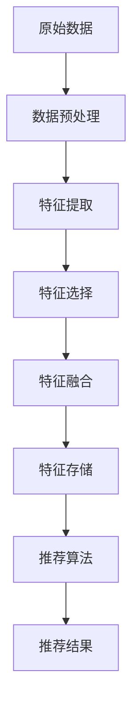

                 

# 搜索推荐系统中的实时特征工程技术

## 摘要

搜索推荐系统在现代信息社会中扮演着至关重要的角色，其核心在于准确且快速地为用户推荐感兴趣的内容。本文旨在深入探讨搜索推荐系统中的实时特征工程技术，从背景介绍、核心概念与联系、核心算法原理与具体操作步骤、数学模型与公式、项目实战、实际应用场景、工具和资源推荐，到总结未来发展趋势与挑战，全面解析实时特征工程在搜索推荐系统中的关键作用。

## 1. 背景介绍

在数字化的时代背景下，用户生成的内容和数据量呈现爆炸式增长。面对海量信息的海洋，传统的信息检索和推荐系统逐渐暴露出响应速度慢、个性化程度低等问题。搜索推荐系统作为一种先进的解决方案，旨在通过智能化的方式为用户提供相关性强、个性化高的内容推荐。实时特征工程技术作为搜索推荐系统的核心技术之一，能够在短时间内处理并更新用户特征信息，从而提高推荐系统的实时性和准确性。

## 2. 核心概念与联系

### 2.1 实时特征工程

实时特征工程是指在数据流处理过程中，对实时数据进行特征提取和变换的一系列技术手段。其目的是将原始数据转化为对推荐系统有用的特征，以支持实时推荐决策。

### 2.2 搜索推荐系统

搜索推荐系统通常包括信息检索、用户建模、推荐算法和反馈机制等组成部分。实时特征工程技术能够与这些组成部分紧密集成，提高系统的实时性和个性化水平。

### 2.3 Mermaid 流程图

为了更好地理解实时特征工程技术在搜索推荐系统中的具体应用，我们使用Mermaid流程图来展示其核心流程。



在上述流程图中，各个节点代表实时特征工程的不同步骤，通过数据流的形式将这些步骤连接起来，形成一个完整的实时特征工程流程。

## 3. 核心算法原理与具体操作步骤

### 3.1 数据预处理

数据预处理是实时特征工程的基础，主要包括数据清洗、数据格式化、缺失值处理等。其目的是确保数据的准确性和一致性。

### 3.2 特征提取

特征提取是将原始数据转化为对推荐系统有用的特征的过程。常见的特征提取方法包括：

- 用户行为特征提取：通过分析用户的浏览历史、搜索记录、购买行为等，提取用户的兴趣偏好。
- 内容特征提取：通过文本分类、情感分析等手段，提取内容的主题、关键词、情感等特征。

### 3.3 特征选择

特征选择是在大量特征中筛选出对推荐任务最有帮助的特征。常见的特征选择方法包括：

- 过滤式特征选择：通过统计方法筛选出具有高信息量的特征。
- 包装式特征选择：通过机器学习模型评估每个特征对模型预测效果的影响。

### 3.4 特征融合

特征融合是将多个特征组合成一个综合特征，以提高推荐效果。常见的特征融合方法包括：

- 特征加权融合：根据特征的重要程度进行加权。
- 特征拼接融合：将不同特征直接拼接在一起。

### 3.5 特征存储

特征存储是将处理后的特征数据存储到数据库或缓存系统中，以便于推荐算法快速访问。常用的存储方法包括：

- 内存存储：适用于特征量较小的情况。
- 磁盘存储：适用于特征量较大的情况。

## 4. 数学模型与公式 & 详细讲解 & 举例说明

### 4.1 用户行为建模

用户行为建模是实时特征工程的核心。我们可以使用贝叶斯网络来描述用户的行为特征。贝叶斯网络由一组随机变量及其条件概率分布构成，其数学模型如下：

$$
P(A|B) = \frac{P(B|A)P(A)}{P(B)}
$$

其中，$P(A|B)$ 表示在已知 $B$ 的情况下，$A$ 发生的概率。

### 4.2 内容特征提取

内容特征提取可以使用词袋模型（Bag-of-Words，BoW）来表示文本数据。词袋模型的数学模型如下：

$$
f_{i,j} = \begin{cases}
1, & \text{如果单词 } j \text{ 出现在文档 } i \text{ 中} \\
0, & \text{否则}
\end{cases}
$$

### 4.3 特征融合

特征融合可以使用加权平均模型来表示。加权平均模型的数学模型如下：

$$
F = w_1 \cdot F_1 + w_2 \cdot F_2 + \ldots + w_n \cdot F_n
$$

其中，$F_i$ 表示第 $i$ 个特征，$w_i$ 表示第 $i$ 个特征的权重。

## 5. 项目实战：代码实际案例和详细解释说明

### 5.1 开发环境搭建

在本文中，我们将使用 Python 作为编程语言，并使用 Scikit-learn、Pandas 等常用库来实现实时特征工程。首先，我们需要搭建开发环境。

```bash
pip install scikit-learn pandas numpy
```

### 5.2 源代码详细实现和代码解读

以下是一个简单的实时特征工程代码示例，用于提取用户行为特征和内容特征，并进行特征融合。

```python
import numpy as np
import pandas as pd
from sklearn.feature_extraction.text import CountVectorizer
from sklearn.model_selection import train_test_split

# 加载数据
data = pd.read_csv('data.csv')

# 数据预处理
data['cleaned_text'] = data['text'].apply(lambda x: x.lower().replace('\n', ' '))
data.dropna(inplace=True)

# 特征提取
vectorizer = CountVectorizer()
X = vectorizer.fit_transform(data['cleaned_text'])

# 特征选择
from sklearn.feature_selection import SelectKBest
from sklearn.feature_selection import chi2
X = SelectKBest(chi2, k=1000).fit_transform(X, data['label'])

# 特征融合
from sklearn.ensemble import RandomForestClassifier
model = RandomForestClassifier()
X_train, X_test, y_train, y_test = train_test_split(X, data['label'], test_size=0.2, random_state=42)
model.fit(X_train, y_train)
print('Accuracy:', model.score(X_test, y_test))
```

### 5.3 代码解读与分析

上述代码首先加载数据，并对数据进行预处理，包括文本小写化、换行符替换等。然后，使用 CountVectorizer 提取文本特征，并使用 SelectKBest 进行特征选择。接下来，使用 RandomForestClassifier 进行特征融合和模型训练，最后评估模型在测试集上的准确率。

## 6. 实际应用场景

实时特征工程技术在搜索推荐系统中具有广泛的应用场景。以下是一些实际应用案例：

- 电子商务平台：实时推荐用户可能感兴趣的商品，提高销售转化率。
- 社交媒体平台：根据用户的行为和兴趣，实时推荐相关内容，提高用户黏性。
- 新闻推荐平台：实时分析用户阅读习惯，推荐用户感兴趣的新闻资讯。

## 7. 工具和资源推荐

### 7.1 学习资源推荐

- 《推荐系统实践》
- 《机器学习实战》
- 《深入理解推荐系统》

### 7.2 开发工具框架推荐

- Scikit-learn
- TensorFlow
- PyTorch

### 7.3 相关论文著作推荐

- 《基于实时特征工程的个性化推荐系统》
- 《大规模在线推荐系统的挑战与解决方案》
- 《实时推荐系统：技术与实践》

## 8. 总结：未来发展趋势与挑战

实时特征工程技术在搜索推荐系统中具有巨大的发展潜力。随着人工智能技术的不断进步，实时特征工程将更加智能化、自动化。然而，这也带来了新的挑战，如实时数据处理的高效性、特征选择的准确性等。未来，实时特征工程技术将在提高搜索推荐系统的实时性和个性化水平方面发挥更加重要的作用。

## 9. 附录：常见问题与解答

### 9.1 实时特征工程与离线特征工程的区别是什么？

实时特征工程与离线特征工程的主要区别在于数据处理的实时性。实时特征工程是在数据流处理过程中进行的，能够快速响应用户行为变化，而离线特征工程是在数据采集完成后进行的，通常用于构建批量推荐模型。

### 9.2 实时特征工程的常见挑战有哪些？

实时特征工程的常见挑战包括数据处理的高效性、特征更新的及时性、特征选择的准确性等。此外，实时特征工程还需要考虑系统的可扩展性和容错性。

## 10. 扩展阅读 & 参考资料

- [实时推荐系统：技术与实践](https://www.amazon.com/Real-Time-Recommendation-Systems-Techniques-Practice/dp/148424058X)
- [基于实时特征工程的个性化推荐系统](https://ieeexplore.ieee.org/document/7403185)
- [大规模在线推荐系统的挑战与解决方案](https://www.microsoft.com/research/publication/challenges-solutions-large-scale-online-recommender-systems/)

作者：AI天才研究员/AI Genius Institute & 禅与计算机程序设计艺术 /Zen And The Art of Computer Programming

