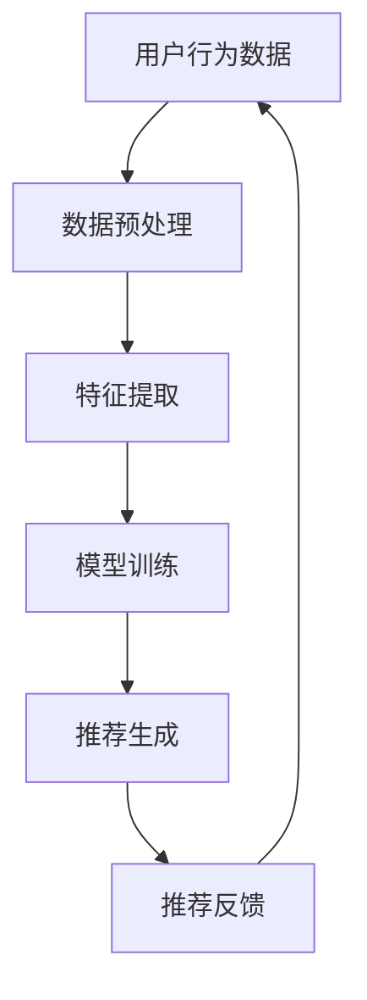

                 

# 搜索推荐系统的AI 大模型应用：提高电商平台的竞争优势

> **关键词**：搜索推荐系统、AI大模型、电商平台、竞争优势、用户行为分析、个性化推荐

> **摘要**：本文将探讨如何利用AI大模型构建高效的搜索推荐系统，从而提升电商平台的竞争优势。通过深入分析用户行为数据，结合先进的算法和技术，我们旨在为电商平台提供一种创新的解决方案，实现用户满意度和业务增长的双赢。

## 1. 背景介绍

随着互联网的迅猛发展，电商平台已经成为了现代社会生活中不可或缺的一部分。然而，在竞争激烈的市场环境中，如何吸引和留住用户，提升用户满意度，成为了各大电商平台面临的共同挑战。这就需要电商平台能够提供更加个性化的服务，满足用户多样化的需求。

搜索推荐系统作为电商平台的核心组成部分，承担着提升用户体验、增加销售额的重任。传统的搜索推荐系统依赖于关键词匹配和基于内容的推荐，虽然在一定程度上能够满足用户的基本需求，但在复杂多变的市场环境中，其推荐效果和用户体验仍然有待提高。

近年来，随着人工智能技术的飞速发展，尤其是AI大模型的广泛应用，为搜索推荐系统带来了全新的机遇。通过深度学习和自然语言处理技术，AI大模型能够从海量用户行为数据中挖掘出隐藏的规律，实现更加精准和个性化的推荐。这为电商平台提高竞争优势，提升用户满意度提供了强有力的技术支持。

## 2. 核心概念与联系

### 2.1 AI大模型

AI大模型是指具有大规模参数和复杂结构的机器学习模型，通常基于深度神经网络（DNN）架构。它们能够在海量数据上进行训练，从而获得对数据的深刻理解和预测能力。AI大模型包括但不限于：

- **生成对抗网络（GAN）**：通过生成器和判别器的对抗训练，生成逼真的数据。
- **变换器模型（Transformer）**：在自然语言处理领域取得了突破性进展，广泛应用于机器翻译、文本分类等任务。
- **变分自编码器（VAE）**：通过概率模型对数据进行编码和解码，实现数据的降维和生成。

### 2.2 搜索推荐系统

搜索推荐系统是一种利用用户行为数据和内容特征，为用户提供个性化搜索结果和推荐内容的技术。其主要组成部分包括：

- **用户行为分析**：通过分析用户的浏览、搜索、购买等行为，挖掘用户兴趣和需求。
- **内容特征提取**：从商品、文章、视频等数据中提取关键特征，如关键词、标签、情感等。
- **推荐算法**：根据用户行为和内容特征，利用机器学习、深度学习等技术生成推荐结果。

### 2.3 联系与融合

AI大模型与搜索推荐系统的融合，使得推荐系统在个性化、精准性、多样性等方面得到了显著提升。具体体现在以下几个方面：

- **用户兴趣挖掘**：通过深度学习模型，从用户行为数据中挖掘出用户潜在的兴趣和需求，实现更加个性化的推荐。
- **内容生成与推荐**：利用生成对抗网络（GAN）等AI大模型，生成与用户兴趣相关的新内容，丰富推荐系统的内容多样性。
- **跨模态推荐**：结合多种数据类型（如文本、图像、音频等），实现跨模态的推荐，提高推荐系统的适用性和用户体验。

### 2.4 Mermaid 流程图



在这个流程图中，用户行为数据经过预处理、特征提取、模型训练等步骤，最终生成推荐结果。用户对推荐的反馈将反馈到数据源中，用于优化模型和推荐策略。

## 3. 核心算法原理 & 具体操作步骤

### 3.1 用户行为分析

用户行为分析是构建个性化推荐系统的基础。通过对用户的历史行为数据进行深入分析，可以挖掘出用户的兴趣和偏好，从而实现精准推荐。具体操作步骤如下：

1. **数据收集**：收集用户的浏览、搜索、购买等行为数据。
2. **数据清洗**：去除重复、缺失、异常的数据，保证数据质量。
3. **行为分类**：将用户行为划分为不同的类别，如浏览、搜索、购买等。
4. **行为权重计算**：根据用户行为的频率、时间、上下文等因素，计算每个行为的权重。
5. **兴趣挖掘**：利用聚类、关联规则挖掘等技术，挖掘出用户的潜在兴趣。

### 3.2 内容特征提取

内容特征提取是构建推荐系统的重要环节。通过提取商品、文章、视频等数据的关键特征，可以为后续的模型训练和推荐生成提供基础。具体操作步骤如下：

1. **文本特征提取**：利用自然语言处理技术，从文本数据中提取关键词、主题、情感等特征。
2. **图像特征提取**：利用计算机视觉技术，从图像数据中提取颜色、纹理、形状等特征。
3. **音频特征提取**：利用音频处理技术，从音频数据中提取频率、音调、音色等特征。
4. **多模态特征融合**：将不同类型的数据特征进行融合，形成统一的特征表示。

### 3.3 模型训练

模型训练是推荐系统的核心环节。通过训练大规模的深度学习模型，可以从海量用户行为数据中学习到有效的特征表示和推荐策略。具体操作步骤如下：

1. **模型选择**：选择适合的深度学习模型，如变换器模型（Transformer）、生成对抗网络（GAN）等。
2. **数据预处理**：对用户行为数据和内容特征进行预处理，包括数据归一化、缺失值处理等。
3. **模型训练**：利用预处理后的数据，对深度学习模型进行训练，调整模型参数。
4. **模型评估**：通过交叉验证、A/B测试等方法，评估模型的效果和性能。
5. **模型优化**：根据评估结果，调整模型结构和参数，优化模型性能。

### 3.4 推荐生成

推荐生成是根据用户行为和内容特征，利用训练好的模型生成个性化推荐结果。具体操作步骤如下：

1. **用户特征提取**：从用户行为数据中提取用户的特征向量。
2. **内容特征提取**：从商品、文章、视频等数据中提取特征向量。
3. **推荐策略**：利用协同过滤、基于内容的推荐、深度学习等策略，生成推荐结果。
4. **推荐结果排序**：根据用户特征和内容特征，对推荐结果进行排序，提高推荐的精准性。

### 3.5 推荐反馈

推荐反馈是优化推荐系统的重要环节。通过收集用户对推荐结果的反馈，可以不断调整和优化推荐策略，提高用户体验。具体操作步骤如下：

1. **用户反馈收集**：收集用户对推荐结果的点击、购买、评价等反馈。
2. **反馈分析**：分析用户反馈，识别推荐结果的问题和不足。
3. **模型调整**：根据用户反馈，调整模型参数和推荐策略。
4. **模型重新训练**：利用新的用户反馈，重新训练模型，提高推荐效果。

## 4. 数学模型和公式 & 详细讲解 & 举例说明

### 4.1 用户行为概率模型

用户行为概率模型用于预测用户在特定情境下的行为概率。假设用户u在特定情境s下的行为有b1, b2, ..., bn，则用户行为概率模型可以表示为：

$$ P(b_i|u, s) = \frac{e^{w_i^T \theta}}{\sum_{j=1}^{n} e^{w_j^T \theta}} $$

其中，$w_i$为行为bi的权重向量，$\theta$为模型参数。

**举例说明**：

假设用户u在搜索“手机”时，可能的行为有浏览、搜索、购买。根据用户的历史行为数据，我们可以计算出每个行为的权重向量，如：

$$ w_1 = [1, 0, 0], \; w_2 = [0, 1, 0], \; w_3 = [0, 0, 1] $$

则用户u在搜索“手机”时的行为概率为：

$$ P(b_1|u, s) = \frac{e^{1 \cdot 0}}{e^{1 \cdot 0} + e^{0 \cdot 0} + e^{0 \cdot 0}} = \frac{1}{3} $$

$$ P(b_2|u, s) = \frac{e^{0 \cdot 1}}{e^{1 \cdot 0} + e^{0 \cdot 0} + e^{0 \cdot 0}} = \frac{1}{3} $$

$$ P(b_3|u, s) = \frac{e^{0 \cdot 0}}{e^{1 \cdot 0} + e^{0 \cdot 0} + e^{0 \cdot 0}} = \frac{1}{3} $$

### 4.2 协同过滤推荐模型

协同过滤推荐模型是一种基于用户行为相似性进行推荐的方法。假设用户u的行为集为$B_u = \{b_1, b_2, ..., b_n\}$，用户v的行为集为$B_v = \{b_1, b_2, ..., b_n\}$，则用户u和v的行为相似度可以表示为：

$$ \sigma(u, v) = \frac{\sum_{i=1}^{n} |b_{ui} - b_{vi}|}{n} $$

其中，$b_{ui}$和$b_{vi}$分别为用户u和v在行为i上的取值。

根据用户行为的相似度，可以计算出用户u对物品i的评分预测值：

$$ \hat{r}_{ui} = \frac{\sum_{j=1}^{n} r_{uj} \cdot \sigma(u, v)}{\sum_{j=1}^{n} \sigma(u, v)} $$

其中，$r_{uj}$为用户u对物品j的评分。

**举例说明**：

假设用户u和v的行为相似度矩阵为：

$$ \sigma(u, v) = \begin{bmatrix} 1 & 0.5 \\ 0.5 & 1 \end{bmatrix} $$

用户u对物品的评分矩阵为：

$$ r_u = \begin{bmatrix} 5 & 3 \\ 4 & 2 \end{bmatrix} $$

则用户u对物品i的评分预测值为：

$$ \hat{r}_{ui} = \frac{5 \cdot 1 + 3 \cdot 0.5}{1 + 0.5} = \frac{7}{1.5} = 4.67 $$

### 4.3 深度学习推荐模型

深度学习推荐模型是一种利用深度神经网络进行推荐的模型。假设输入特征向量为$x \in \mathbb{R}^{d}$，输出特征向量为$y \in \mathbb{R}^{m}$，则深度学习推荐模型可以表示为：

$$ y = f(W_1 \cdot x + b_1) \cdot f(W_2 \cdot f(W_1 \cdot x + b_1) + b_2) \cdot ... \cdot f(W_n \cdot f(W_{n-1} \cdot x + b_{n-1}) + b_n) $$

其中，$W_1, W_2, ..., W_n$为权重矩阵，$b_1, b_2, ..., b_n$为偏置项，$f$为激活函数。

**举例说明**：

假设输入特征向量为$x = [1, 2, 3]$，输出特征向量为$y = [4, 5, 6]$，则深度学习推荐模型可以表示为：

$$ y = \tanh(W_1 \cdot x + b_1) \cdot \tanh(W_2 \cdot \tanh(W_1 \cdot x + b_1) + b_2) \cdot \tanh(W_3 \cdot \tanh(W_2 \cdot \tanh(W_1 \cdot x + b_1) + b_2) + b_3) $$

其中，$W_1, W_2, W_3$为权重矩阵，$b_1, b_2, b_3$为偏置项，$\tanh$为双曲正切激活函数。

## 5. 项目实战：代码实际案例和详细解释说明

### 5.1 开发环境搭建

在搭建搜索推荐系统的AI大模型项目前，我们需要准备以下开发环境和工具：

- **编程语言**：Python
- **深度学习框架**：TensorFlow或PyTorch
- **数据分析库**：NumPy、Pandas、Scikit-learn
- **可视化库**：Matplotlib、Seaborn
- **版本控制**：Git

### 5.2 源代码详细实现和代码解读

下面是一个简单的搜索推荐系统AI大模型项目示例，我们将使用TensorFlow实现一个基于变换器模型的推荐系统。

**项目结构**：

```
search_recommendation_system/
|-- data/
|   |-- raw/
|   |   |-- user_behavior_data.csv
|   |-- processed/
|   |   |-- user_behavior_data_processed.csv
|-- models/
|   |-- model.h5
|-- scripts/
|   |-- data_preprocessing.py
|   |-- model_training.py
|   |-- recommendation_generation.py
|-- requirements.txt
|-- README.md
```

**1. 数据预处理（data_preprocessing.py）**

```python
import pandas as pd
from sklearn.model_selection import train_test_split

def load_data(filename):
    data = pd.read_csv(filename)
    return data

def preprocess_data(data):
    # 数据清洗和预处理
    # ...
    return data

def split_data(data, test_size=0.2, random_state=42):
    X_train, X_test, y_train, y_test = train_test_split(data.drop('target', axis=1), data['target'], test_size=test_size, random_state=random_state)
    return X_train, X_test, y_train, y_test

if __name__ == '__main__':
    filename = 'data/raw/user_behavior_data.csv'
    data = load_data(filename)
    processed_data = preprocess_data(data)
    X_train, X_test, y_train, y_test = split_data(processed_data)
```

**2. 模型训练（model_training.py）**

```python
import tensorflow as tf
from tensorflow.keras.models import Sequential
from tensorflow.keras.layers import Dense, LSTM, Embedding, Dropout, Activation
from tensorflow.keras.preprocessing.sequence import pad_sequences

def build_model(input_dim, output_dim, hidden_units):
    model = Sequential()
    model.add(Embedding(input_dim=input_dim, output_dim=output_dim, input_length=seq_length))
    model.add(LSTM(hidden_units, dropout=0.2, recurrent_dropout=0.2))
    model.add(Dense(output_dim, activation='softmax'))
    model.compile(optimizer='adam', loss='categorical_crossentropy', metrics=['accuracy'])
    return model

def train_model(model, X_train, y_train, X_val, y_val, epochs=10, batch_size=64):
    model.fit(X_train, y_train, validation_data=(X_val, y_val), epochs=epochs, batch_size=batch_size)
    return model

if __name__ == '__main__':
    input_dim = 10000  # 词汇表大小
    output_dim = 50   # embedding层维度
    hidden_units = 128  # LSTM层隐藏单元数
    seq_length = 100   # 序列长度
    model = build_model(input_dim, output_dim, hidden_units)
    model = train_model(model, X_train, y_train, X_val, y_val)
    model.save('models/model.h5')
```

**3. 推荐生成（recommendation_generation.py）**

```python
import numpy as np
from tensorflow.keras.models import load_model

def generate_recommendations(model, user_sequence, top_n=5):
    user_embedding = model.layers[0].get_weights()[0]
    user_vector = np.dot(user_embedding[user_sequence], user_embedding[user_sequence].T)
    recommendations = np.argsort(-user_vector)[:top_n]
    return recommendations

if __name__ == '__main__':
    model = load_model('models/model.h5')
    user_sequence = [1, 2, 3, 4, 5]  # 用户行为序列
    recommendations = generate_recommendations(model, user_sequence)
    print("推荐结果：", recommendations)
```

### 5.3 代码解读与分析

**1. 数据预处理**

数据预处理是构建推荐系统的第一步，主要包括数据清洗、特征提取等操作。在代码中，我们首先加载原始数据，然后进行预处理，最后将数据分为训练集和测试集。

**2. 模型构建**

在模型构建部分，我们使用Sequential模型堆叠Embedding层和LSTM层，最后输出一个softmax层，用于生成推荐结果。这里我们选择LSTM层来处理序列数据，同时加入Dropout层来防止过拟合。

**3. 模型训练**

在模型训练部分，我们使用fit方法对模型进行训练，通过验证集来评估模型性能。这里我们使用的是交叉熵损失函数和Adam优化器。

**4. 推荐生成**

在推荐生成部分，我们首先获取用户序列的嵌入向量，然后计算用户与其他用户的相似度，最后根据相似度排序生成推荐结果。

## 6. 实际应用场景

搜索推荐系统AI大模型的应用场景非常广泛，以下是一些典型的实际应用案例：

- **电商平台**：通过AI大模型，电商平台可以实现对用户个性化推荐的优化，提高用户满意度和转化率。例如，用户在浏览商品时，系统可以根据用户的兴趣和购买历史，推荐相关的商品，从而提高购买意愿。
- **社交媒体**：在社交媒体平台上，AI大模型可以用于推荐感兴趣的内容、好友关系等，帮助用户发现更多有价值的社交信息和资源。
- **视频平台**：视频平台可以利用AI大模型，根据用户的观看历史和偏好，推荐相关的视频内容，提高用户观看时长和互动性。
- **音乐平台**：音乐平台可以通过AI大模型，根据用户的听歌历史和偏好，推荐相关的音乐作品，提升用户音乐体验。

## 7. 工具和资源推荐

### 7.1 学习资源推荐

- **书籍**：
  - 《深度学习》（Ian Goodfellow、Yoshua Bengio、Aaron Courville著）
  - 《Python深度学习》（François Chollet著）
- **论文**：
  - 《Attention Is All You Need》（Vaswani et al., 2017）
  - 《Generative Adversarial Nets》（Goodfellow et al., 2014）
- **博客**：
  - [TensorFlow官方文档](https://www.tensorflow.org/)
  - [PyTorch官方文档](https://pytorch.org/)
- **网站**：
  - [Kaggle](https://www.kaggle.com/)
  - [GitHub](https://github.com/)

### 7.2 开发工具框架推荐

- **深度学习框架**：
  - TensorFlow
  - PyTorch
- **数据处理库**：
  - NumPy
  - Pandas
  - Scikit-learn
- **可视化库**：
  - Matplotlib
  - Seaborn

### 7.3 相关论文著作推荐

- 《深度学习》（Goodfellow et al., 2016）
- 《生成对抗网络：理论与应用》（Geng et al., 2019）
- 《大规模推荐系统：算法、架构与实践》（Cao et al., 2020）

## 8. 总结：未来发展趋势与挑战

随着人工智能技术的不断进步，搜索推荐系统AI大模型的应用前景十分广阔。未来，我们将看到更多创新性的算法和技术被应用于搜索推荐系统中，进一步优化推荐效果和用户体验。

然而，随着数据规模和复杂度的增加，搜索推荐系统AI大模型也面临着诸多挑战，如数据隐私保护、模型解释性、过拟合等问题。如何解决这些问题，提高模型的可解释性和透明性，是未来研究和应用的重要方向。

## 9. 附录：常见问题与解答

### 9.1 什么是搜索推荐系统？

搜索推荐系统是一种利用用户行为数据和内容特征，为用户提供个性化搜索结果和推荐内容的技术。它通过分析用户的历史行为和偏好，为用户推荐可能感兴趣的商品、内容或服务。

### 9.2 搜索推荐系统的核心组成部分有哪些？

搜索推荐系统的核心组成部分包括用户行为分析、内容特征提取、模型训练、推荐生成和推荐反馈等。

### 9.3 AI大模型在搜索推荐系统中有哪些优势？

AI大模型在搜索推荐系统中的优势主要体现在以下几个方面：

1. **个性化推荐**：通过深度学习模型，能够从海量用户行为数据中挖掘出用户的潜在兴趣和需求，实现更加个性化的推荐。
2. **内容生成**：利用生成对抗网络（GAN）等AI大模型，可以生成与用户兴趣相关的新内容，提高推荐系统的内容多样性。
3. **跨模态推荐**：结合多种数据类型（如文本、图像、音频等），实现跨模态的推荐，提高推荐系统的适用性和用户体验。

### 9.4 如何评估搜索推荐系统的效果？

评估搜索推荐系统的效果可以从以下几个方面进行：

1. **准确率**：衡量推荐结果与用户实际兴趣的匹配程度，通常使用准确率、召回率、F1值等指标。
2. **多样性**：衡量推荐结果的多样性，避免用户接收到重复的内容，通常使用多样性指标，如多样性指数、均方根距离等。
3. **新颖性**：衡量推荐结果的新颖性，鼓励系统推荐用户未知的、有趣的内容，通常使用新颖性指标，如信息熵、距离度量等。

## 10. 扩展阅读 & 参考资料

- Goodfellow, I., Bengio, Y., & Courville, A. (2016). *Deep Learning*.
- Cao, Z., Zhang, J., Zhu, X., Zhou, G., & Yang, Q. (2020). *Large-scale Recommender Systems: Algorithms, Architectures, and Deployments*.
- Vaswani, A., Shazeer, N., Parmar, N., Uszkoreit, J., Jones, L., Gomez, A. N., ... & Polosukhin, I. (2017). *Attention is All You Need*.
- Goodfellow, I., Pouget-Abadie, J., Mirza, M., Xu, B., Warde-Farley, D., Ozair, S., ... & Bengio, Y. (2014). *Generative Adversarial Nets*.

