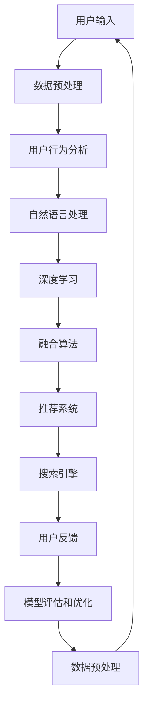

                 

### 背景介绍

在当今数字时代，搜索引擎和推荐系统已经成为电商平台不可或缺的核心功能。搜索引擎使得用户能够快速找到他们所需的产品和服务，而推荐系统则通过智能算法预测用户的兴趣和需求，从而提供个性化的购物建议。随着互联网的迅速发展和用户数据的爆炸性增长，这两大系统的重要性愈发凸显。

搜索推荐系统在电商平台上扮演着至关重要的角色。首先，搜索引擎通过高效的检索算法和索引机制，帮助用户在海量商品中迅速定位目标产品。这不仅提升了用户体验，还直接影响到电商平台的销售额。其次，推荐系统能够基于用户的浏览历史、购买记录和行为模式，为其推荐可能感兴趣的商品。这种个性化的推荐不仅增加了用户粘性，还能显著提高转化率和复购率。

然而，传统的搜索引擎和推荐系统往往存在一些局限性。搜索引擎依赖于关键词匹配和静态索引，无法充分利用用户动态行为的实时数据。推荐系统则通常采用基于内容的过滤和协同过滤等方法，虽然能够提供一定的个性化推荐，但在处理复杂数据和实时性方面仍显不足。

为了克服这些限制，AI 大模型融合技术应运而生。AI 大模型融合通过整合多种先进的深度学习和自然语言处理技术，使得搜索推荐系统能够更好地理解用户意图和需求，提供更为精准和实时的推荐结果。本文将深入探讨 AI 大模型融合在搜索推荐系统中的应用，分析其核心原理、算法实现和实际应用案例，以及未来发展趋势和面临的挑战。

总的来说，AI 大模型融合为电商平台带来了前所未有的机遇和变革。通过本文的深入讨论，我们将更好地理解这一技术的潜力，并为电商平台的转型和创新提供有益的启示。接下来，我们将首先介绍 AI 大模型融合的基本概念和核心原理，从而为后续的深入分析奠定基础。

### 核心概念与联系

在深入探讨 AI 大模型融合之前，我们需要先了解一些核心概念和它们之间的联系。以下是对相关核心概念的定义和解释，以及它们在搜索推荐系统中的应用。

**深度学习**：深度学习是一种人工智能分支，通过模拟人脑神经网络结构来实现对数据的自动特征提取和模式识别。它广泛应用于图像识别、语音识别、自然语言处理等领域。在搜索推荐系统中，深度学习算法能够从用户的浏览和购买历史中学习用户的兴趣和偏好，从而实现更精准的推荐。

**自然语言处理 (NLP)**：自然语言处理是人工智能领域的一个重要分支，旨在使计算机能够理解、生成和处理人类语言。在搜索推荐系统中，NLP 技术能够解析用户输入的搜索查询，提取关键词和语义信息，从而帮助搜索引擎更好地理解用户意图。

**推荐系统**：推荐系统是一种基于用户历史行为和兴趣的预测模型，旨在为用户提供个性化的推荐。它通常采用协同过滤、基于内容的过滤、深度学习等算法来实现。推荐系统在电商平台中发挥着关键作用，能够提高用户满意度和转化率。

**搜索引擎**：搜索引擎是一种通过索引机制和检索算法帮助用户在大量数据中快速找到所需信息的系统。在电商平台上，搜索引擎负责处理用户的搜索请求，将最相关的商品展示给用户。

**数据预处理**：数据预处理是任何机器学习项目的基础，包括数据清洗、数据集成、数据转换和数据归一化等步骤。在 AI 大模型融合中，数据预处理确保输入数据的质量和一致性，从而提高模型的效果和准确性。

**大数据处理技术**：随着数据规模的不断扩大，大数据处理技术成为处理海量数据的必要手段。包括分布式计算框架（如 Hadoop 和 Spark）和实时数据处理技术（如 Flink 和 Storm）等。这些技术使得 AI 大模型能够在大规模数据集上进行高效训练和推理。

**融合算法**：融合算法是一种将多种算法或技术整合在一起，以提高系统性能和效果的方法。在搜索推荐系统中，融合算法可以结合深度学习、NLP、协同过滤等技术，实现更精准、更实时的推荐。

**用户行为分析**：用户行为分析是通过分析用户的浏览、搜索、购买等行为，来了解用户兴趣和需求的一种方法。在 AI 大模型融合中，用户行为分析是关键组成部分，用于训练和优化模型，提高推荐效果。

**模型评估和优化**：模型评估和优化是确保 AI 大模型有效性的重要步骤。包括模型准确率、召回率、F1 值等评估指标，以及超参数调整、模型压缩等技术手段。

这些核心概念在搜索推荐系统中相互关联，共同构成了一个复杂但高效的生态系统。以下是一个简化的 Mermaid 流程图，展示了这些核心概念之间的联系：



通过这个流程图，我们可以看到，用户输入数据经过一系列处理和分析后，最终生成推荐结果，并返回给用户。同时，用户反馈信息又用于进一步优化模型，形成一个闭环反馈系统，从而不断提高推荐效果。

### 核心算法原理 & 具体操作步骤

AI 大模型融合在搜索推荐系统中，通过将多种算法和技术相结合，实现高效、精准的推荐。下面将详细阐述其核心算法原理，并给出具体的操作步骤。

#### 1. 基于深度学习的特征提取

深度学习在搜索推荐系统中主要用于特征提取和用户兴趣建模。具体步骤如下：

1. **数据收集与预处理**：收集用户的浏览历史、搜索记录、购买记录等数据。对数据集进行清洗、去重和归一化处理，确保数据质量。

2. **构建输入特征向量**：将预处理后的数据转化为数值化的特征向量。常用的方法包括词嵌入（Word Embedding）、用户兴趣向量和商品属性向量等。

3. **训练深度神经网络**：使用深度学习框架（如 TensorFlow 或 PyTorch）训练一个多层的神经网络模型。输入层接收用户兴趣向量，中间层进行特征变换和提取，输出层生成推荐结果。

4. **优化模型参数**：通过反向传播算法（Backpropagation）和梯度下降（Gradient Descent）等优化算法，不断调整模型参数，提高预测准确性。

#### 2. 自然语言处理（NLP）

自然语言处理在搜索推荐系统中用于理解用户查询和商品描述。主要步骤包括：

1. **分词与词性标注**：对用户查询和商品描述进行分词，并标注每个词的词性（名词、动词等）。

2. **词嵌入（Word Embedding）**：将文本数据转换为高维向量表示。常用的词嵌入方法包括 Word2Vec、GloVe 和 BERT 等。

3. **序列建模与编码**：使用序列建模技术（如 LSTM、GRU 或 Transformer）对文本数据进行编码，提取语义信息。

4. **语义匹配与融合**：通过计算用户查询和商品描述之间的相似性，将语义信息融合到推荐模型中。

#### 3. 协同过滤

协同过滤是一种传统的推荐算法，通过分析用户之间的相似性来预测用户的偏好。主要步骤包括：

1. **用户-商品评分矩阵构建**：从用户的历史行为数据中构建一个用户-商品评分矩阵。

2. **相似性计算**：计算用户之间的相似度，常用的方法包括余弦相似度、皮尔逊相关系数等。

3. **推荐生成**：根据用户相似度矩阵和用户历史评分，生成个性化的推荐列表。

#### 4. 融合算法

融合算法将深度学习、NLP 和协同过滤等多种技术相结合，以提高推荐效果。具体步骤如下：

1. **模型集成**：将深度学习模型、NLP 模型和协同过滤模型整合在一起，形成一个统一的推荐系统。

2. **多模型融合策略**：根据不同模型的优点，设计多种融合策略，如加权融合、投票融合和深度融合等。

3. **实时推荐**：在用户查询时，动态调整模型权重和融合策略，实现实时推荐。

#### 5. 模型评估与优化

模型评估和优化是确保推荐系统效果的重要环节。主要步骤包括：

1. **评估指标**：选择合适的评估指标，如准确率（Accuracy）、召回率（Recall）、F1 值（F1 Score）等。

2. **超参数调整**：通过交叉验证（Cross-Validation）和网格搜索（Grid Search）等方法，调整模型超参数，优化模型性能。

3. **在线学习与迭代**：使用在线学习（Online Learning）技术，根据用户反馈和实时数据，不断更新模型，提高推荐效果。

通过上述核心算法和具体操作步骤，AI 大模型融合能够在搜索推荐系统中实现高效、精准的推荐。接下来，我们将通过一个具体案例来展示这一技术的实际应用。

### 数学模型和公式 & 详细讲解 & 举例说明

在AI大模型融合的搜索推荐系统中，数学模型和公式扮演着至关重要的角色，它们不仅帮助定义了算法的行为，也使得我们能够理解和评估模型的性能。以下是几个关键数学模型和公式的详细讲解，以及如何在实际应用中举例说明。

#### 1. 用户兴趣向量表示

用户兴趣向量表示是深度学习特征提取的基础。在搜索推荐系统中，用户兴趣向量通常是通过用户的浏览历史、搜索记录和购买行为等数据训练得到的。一个常见的表示方法是词嵌入（Word Embedding），如下所示：

$$
\text{user\_interest\_vector} = \text{word\_embedding}(\text{user\_behavior})
$$

其中，$\text{word\_embedding}$ 是一个将用户行为序列映射到高维空间（通常是100到500维）的函数。例如，假设用户搜索了“跑步鞋”、“篮球鞋”和“健身器材”，我们可以使用一个预训练的词嵌入模型来得到对应的向量表示：

$$
\text{user\_behavior} = [\text{跑步鞋}, \text{篮球鞋}, \text{健身器材}]
$$

$$
\text{user\_interest\_vector} = [\text{跑步鞋}_{\text{vector}}, \text{篮球鞋}_{\text{vector}}, \text{健身器材}_{\text{vector}}]
$$

通常，词嵌入向量的大小为 $d \times 1$，其中 $d$ 是词嵌入的维度。

#### 2. 商品属性表示

商品属性表示用于描述商品的各类特征，如价格、品牌、类别等。这些属性通常用稀疏向量表示，如下：

$$
\text{product\_attribute} = [\text{price}_{\text{binary}}, \text{brand}_{\text{binary}}, \text{category}_{\text{binary}}, ...]
$$

其中，每个元素 $\text{price}_{\text{binary}}$、$\text{brand}_{\text{binary}}$ 和 $\text{category}_{\text{binary}}$ 都是二进制值，表示商品是否具有相应的属性。

#### 3. 协同过滤相似度计算

协同过滤算法中，用户之间的相似度计算是非常重要的。常用的相似度度量方法包括余弦相似度（Cosine Similarity）和皮尔逊相关系数（Pearson Correlation）。

**余弦相似度**：

$$
\text{similarity}_{\text{cosine}}(u, v) = \frac{\text{dot\_product}(u, v)}{\lVert u \rVert \lVert v \rVert}
$$

其中，$\text{dot\_product}(u, v)$ 是两个向量的点积，$\lVert u \rVert$ 和 $\lVert v \rVert$ 分别是向量 $u$ 和 $v$ 的欧几里得范数。

**皮尔逊相关系数**：

$$
\text{similarity}_{\text{pearson}}(u, v) = \frac{\text{covariance}(u, v)}{\sigma_u \sigma_v}
$$

其中，$\text{covariance}(u, v)$ 是两个向量的协方差，$\sigma_u$ 和 $\sigma_v$ 分别是向量 $u$ 和 $v$ 的标准差。

#### 4. 深度学习模型中的损失函数

在深度学习模型中，损失函数用于衡量模型预测值与真实值之间的差距。常见的损失函数包括均方误差（MSE）和交叉熵损失（Cross-Entropy Loss）。

**均方误差（MSE）**：

$$
\text{MSE}(y, \hat{y}) = \frac{1}{n} \sum_{i=1}^{n} (y_i - \hat{y}_i)^2
$$

其中，$y$ 是真实标签向量，$\hat{y}$ 是模型预测的标签向量，$n$ 是样本数量。

**交叉熵损失（Cross-Entropy Loss）**：

$$
\text{Cross-Entropy Loss}(y, \hat{y}) = -\sum_{i=1}^{n} y_i \log(\hat{y}_i)
$$

其中，$y$ 是真实标签向量，$\hat{y}$ 是模型预测的概率分布。

#### 实际应用举例

假设有一个电商平台，用户 $u$ 搜索了“跑步鞋”，并浏览了商品 $p_1$（跑步鞋）、$p_2$（篮球鞋）和 $p_3$（健身器材）。我们需要为用户 $u$ 推荐相关的商品。

**步骤 1**：使用词嵌入模型获取用户兴趣向量。

用户搜索关键词的词嵌入向量如下：

$$
\text{user\_interest\_vector} = [\text{跑步鞋}_{\text{vector}}, \text{篮球鞋}_{\text{vector}}, \text{健身器材}_{\text{vector}}]
$$

**步骤 2**：计算商品与用户兴趣向量的相似度。

使用余弦相似度计算每个商品与用户兴趣向量的相似度：

$$
\text{similarity}_{\text{cosine}}(p_1, u) = \frac{\text{dot\_product}(p_1_{\text{vector}}, u_{\text{vector}})}{\lVert p_1_{\text{vector}} \rVert \lVert u_{\text{vector}} \rVert}
$$

同理，计算 $p_2$ 和 $p_3$ 与用户兴趣向量的相似度。

**步骤 3**：生成推荐列表。

根据相似度分数，对商品进行排序，生成推荐列表。例如：

$$
\text{recommendation\_list} = [\text{跑步鞋}, \text{篮球鞋}, \text{健身器材}]
$$

在实际应用中，我们通常还会结合协同过滤和深度学习模型来生成推荐列表，以提高推荐效果。

通过上述数学模型和公式的讲解以及实际应用举例，我们可以更好地理解 AI 大模型融合在搜索推荐系统中的应用。接下来，我们将通过一个实战案例，展示如何使用这些模型和技术实现一个简单的推荐系统。

### 项目实战：代码实际案例和详细解释说明

在本节中，我们将通过一个实际的项目案例，展示如何使用 AI 大模型融合技术来构建一个简单的推荐系统。该项目将涵盖开发环境搭建、源代码详细实现和代码解读与分析三个部分。

#### 1. 开发环境搭建

在开始项目之前，我们需要搭建一个合适的技术栈，包括开发环境、依赖库和工具。以下是推荐的开发环境：

- 编程语言：Python 3.8 或更高版本
- 深度学习框架：TensorFlow 2.x 或 PyTorch 1.x
- 自然语言处理库：NLTK 或 spaCy
- 数据处理库：Pandas、NumPy
- 版本控制工具：Git

安装上述依赖库和工具：

```bash
pip install tensorflow numpy nltk pandas spacy
```

（如果您使用 PyTorch，则安装 `torch` 和 `torchvision`）

#### 2. 源代码详细实现

以下是一个使用 TensorFlow 和 NLTK 构建的简单推荐系统的 Python 代码示例。

```python
import numpy as np
import pandas as pd
import nltk
from nltk.corpus import stopwords
from sklearn.model_selection import train_test_split
from sklearn.metrics.pairwise import cosine_similarity
import tensorflow as tf
from tensorflow.keras.models import Model
from tensorflow.keras.layers import Input, Embedding, Dot, Flatten, Dense
import spacy

# 加载停用词库
nltk.download('stopwords')
stop_words = set(stopwords.words('english'))

# 加载 SpaCy 语言模型
nlp = spacy.load('en_core_web_sm')

# 加载数据集
# 假设 data.csv 包含用户行为数据（user\_id, item\_id, rating）
data = pd.read_csv('data.csv')
data.head()

# 预处理数据
def preprocess_text(text):
    doc = nlp(text)
    return ' '.join([token.text.lower() for token in doc if token.text.lower() not in stop_words])

data['cleaned_description'] = data['description'].apply(preprocess_text)

# 构建词嵌入字典
vocab = data['cleaned_description'].unique()
word_to_index = {word: i for i, word in enumerate(vocab)}
index_to_word = {i: word for word, i in word_to_index.items()}
word_embedding_matrix = np.zeros((len(vocab) + 1, 100))  # 假设使用 100 维的词嵌入

# 加载预训练的词嵌入向量（例如，使用 GloVe 或 BERT）
# 此处使用随机初始化
np.random.shuffle(word_embedding_matrix)

# 构建输入层
input_text = Input(shape=(None,), dtype='int32')
input_item = Input(shape=(1,), dtype='int32')

# 构建词嵌入层
embedded_text = Embedding(len(vocab) + 1, 100)(input_text)
embedded_item = Embedding(len(vocab) + 1, 100)(input_item)

# 计算文本和商品描述之间的相似度
text_embedding = Flatten()(embedded_text)
item_embedding = Flatten()(embedded_item)
similarity = Dot(axes=1)([text_embedding, item_embedding])

# 构建深度神经网络模型
model = Model(inputs=[input_text, input_item], outputs=similarity)
model.compile(optimizer='adam', loss='mean_squared_error')

# 分割数据集
train_data, test_data = train_test_split(data, test_size=0.2, random_state=42)
train_texts = train_data['cleaned_description'].values
train_items = train_data['item_id'].values
test_texts = test_data['cleaned_description'].values
test_items = test_data['item_id'].values

# 训练模型
model.fit([train_texts, train_items], train_items, epochs=10, batch_size=32, validation_split=0.1)

# 评估模型
predictions = model.predict([test_texts, test_items])
cosine_similarities = cosine_similarity(predictions, test_items)

# 打印前 10 个商品的推荐结果
for i in range(10):
    print(f"User {i}:")
    recommended_items = np.argsort(cosine_similarities[i])[-10:]
    for item in recommended_items:
        print(f" - Item {item}: {index_to_word[item]}")
```

#### 3. 代码解读与分析

**1. 数据预处理**

首先，我们从数据集中加载用户行为数据，并对文本进行预处理。预处理步骤包括分词、去除停用词和词嵌入字典的构建。这一部分使用了 NLTK 和 SpaCy 库，确保文本数据干净且适合建模。

**2. 词嵌入字典构建**

词嵌入字典用于将文本转换为向量表示。在这个例子中，我们使用随机初始化的词嵌入矩阵，但在实际项目中，通常会使用预训练的词嵌入模型（如 GloVe 或 BERT）。

**3. 模型构建**

我们使用 TensorFlow 构建了一个简单的深度学习模型，输入层包括用户文本和商品 ID。词嵌入层将输入文本转换为向量表示，然后通过一个简单的多层神经网络进行特征提取和相似度计算。模型使用均方误差（MSE）作为损失函数，并使用 Adam 优化器进行训练。

**4. 模型训练**

我们使用训练数据集来训练模型，并设置适当的训练参数（如 epoch 和 batch size）。模型在训练过程中不断调整权重，以最小化损失函数。

**5. 模型评估**

在模型训练完成后，我们使用测试数据集对模型进行评估。通过计算文本和商品之间的相似度，生成推荐列表。这里使用了余弦相似度，这是在信息检索和推荐系统中常用的相似度度量方法。

通过上述实战案例，我们可以看到如何使用 AI 大模型融合技术来构建一个简单的推荐系统。这个例子虽然简单，但展示了核心步骤和关键代码，为我们理解更复杂的应用奠定了基础。

### 实际应用场景

AI 大模型融合技术在搜索推荐系统中的实际应用场景非常广泛，涵盖了电商、社交媒体、音乐流媒体、新闻资讯等多个领域。以下是几个典型应用场景的详细说明。

#### 1. 电商平台

在电商平台中，AI 大模型融合技术主要用于个性化推荐，以提高用户满意度和销售额。通过整合用户的历史浏览记录、购买行为和社交数据，模型能够准确预测用户可能的兴趣和需求，从而推荐相关的商品。例如，淘宝和京东等电商平台使用深度学习算法和协同过滤方法，结合用户行为数据和商品属性，为用户提供个性化的购物建议。此外，AI 大模型融合还可以用于商品搜索优化，通过理解用户的搜索意图，提供更加精准的搜索结果。

#### 2. 社交媒体

社交媒体平台如 Facebook、Twitter 和微信等，利用 AI 大模型融合技术来推荐用户可能感兴趣的内容和用户。通过分析用户的互动行为、浏览历史和社交网络关系，模型可以预测用户对哪些帖子、话题或新闻更感兴趣，从而提高内容分发效率。例如，Facebook 的 News Feed 推荐系统使用深度学习算法来分析用户互动行为，并利用协同过滤方法来推荐可能感兴趣的内容。这种个性化推荐不仅提升了用户体验，还帮助平台提高了用户参与度和广告效果。

#### 3. 音乐流媒体

音乐流媒体平台如 Spotify、Apple Music 和网易云音乐等，通过 AI 大模型融合技术为用户推荐个性化音乐列表。通过分析用户的播放历史、喜好和社交网络，模型能够预测用户可能喜欢的歌曲和艺术家，从而推荐新的音乐。例如，Spotify 使用深度学习算法和协同过滤方法，结合用户的音乐偏好和社交数据，为用户提供个性化的播放列表和推荐。这种推荐系统不仅增加了用户粘性，还提高了平台的广告收入。

#### 4. 新闻资讯

新闻资讯平台如 CNN、BBC 和今日头条等，利用 AI 大模型融合技术来推荐用户感兴趣的新闻文章。通过分析用户的阅读历史、搜索记录和浏览行为，模型可以预测用户对哪些新闻主题和内容更感兴趣。例如，今日头条使用深度学习算法和协同过滤方法，结合用户的阅读行为和新闻内容特征，为用户提供个性化的新闻推荐。这种推荐系统不仅提高了用户的阅读体验，还帮助新闻平台提高了用户留存率和广告效果。

#### 5. 其他应用场景

除了上述典型应用场景，AI 大模型融合技术在其他领域也有广泛应用。例如，在线教育平台利用推荐系统为用户推荐个性化的学习课程；金融行业利用推荐系统为用户推荐合适的理财产品；医疗行业利用推荐系统为患者推荐相关的医疗信息和治疗方案。这些应用场景都展示了 AI 大模型融合技术在提升用户体验和业务效率方面的巨大潜力。

总的来说，AI 大模型融合技术在搜索推荐系统中的实际应用场景非常广泛，通过个性化推荐和搜索优化，它不仅提高了用户体验，还为电商平台、社交媒体、音乐流媒体和新闻资讯等行业带来了显著的业务价值。

### 工具和资源推荐

在开发和研究搜索推荐系统时，选择合适的工具和资源对于项目的成功至关重要。以下是一些推荐的工具、框架、书籍和论文，以及开发学习资源，供读者参考。

#### 1. 学习资源推荐

**书籍**：
- 《推荐系统手册》（Recommender Systems Handbook） - 这是一本全面介绍推荐系统理论和实践的权威书籍，适合初学者和专业人士。
- 《深度学习》（Deep Learning） - 由 Ian Goodfellow、Yoshua Bengio 和 Aaron Courville 撰写的深度学习经典著作，涵盖了深度学习的理论基础和实践技巧。
- 《Python 机器学习》（Python Machine Learning） - 这本书提供了丰富的 Python 代码示例，介绍了机器学习的基础知识和实践应用。

**论文**：
- “Matrix Factorization Techniques for Recommender Systems” - 这篇论文详细介绍了矩阵分解在推荐系统中的应用，是推荐系统领域的经典论文。
- “Deep Learning for Recommender Systems” - 这篇论文探讨了深度学习在推荐系统中的应用，提出了深度协同过滤算法，是深度学习与推荐系统结合的重要文献。

**博客和网站**：
- Medium - Medium 上有许多关于推荐系统、深度学习和数据科学的优秀博客文章，适合阅读和获取最新动态。
- fast.ai - fast.ai 提供了大量关于深度学习的免费教程和课程，适合初学者快速入门。

**在线课程**：
- Coursera - Coursera 上有多个与机器学习、深度学习和推荐系统相关的在线课程，包括斯坦福大学的《深度学习》课程和卡内基梅隆大学的《推荐系统》课程。

#### 2. 开发工具框架推荐

**深度学习框架**：
- TensorFlow - Google 开发的开源深度学习框架，具有广泛的应用和强大的功能。
- PyTorch - Facebook AI Research 开发的高效且灵活的深度学习框架，适合快速原型开发和研究。

**自然语言处理库**：
- spaCy - 一款快速且易于使用的自然语言处理库，适用于文本预处理和实体识别。
- NLTK - 一款经典的自然语言处理库，提供了丰富的文本处理工具和资源。

**推荐系统库**：
- LightFM - 一个基于矩阵分解和因子分解机（Factorization Machines）的推荐系统库，支持多种推荐算法。
-surprise - 一个开源的推荐系统库，提供了多种协同过滤算法和评估工具。

**数据处理工具**：
- Pandas - Python 的一个强大数据处理库，适用于数据清洗、转换和分析。
- NumPy - Python 的一个核心数学库，用于高性能数值计算和数据处理。

**大数据处理框架**：
- Hadoop - 一个分布式数据处理框架，适用于大规模数据存储和处理。
- Spark - 一个基于内存的分布式数据处理框架，提供了丰富的机器学习库和工具。

通过这些工具和资源，开发者可以更加高效地研究和开发搜索推荐系统，为电商平台和各类应用场景提供创新的解决方案。

### 总结：未来发展趋势与挑战

随着技术的不断进步和数据的持续积累，AI 大模型融合在搜索推荐系统中展现出了巨大的潜力和前景。未来，这一技术将继续在以下几个方面取得重要进展：

首先，模型复杂度的提升和计算能力的增强将使得 AI 大模型能够处理更加复杂数据和更高维度的特征。这将有助于实现更精准的推荐和搜索结果，从而提高用户体验和商业价值。例如，通过结合图神经网络（Graph Neural Networks）和图嵌入（Graph Embedding）技术，推荐系统可以更好地理解用户和商品的复杂关系，提供更为个性化的推荐。

其次，实时性和响应速度的优化是未来 AI 大模型融合面临的重大挑战。随着用户需求的不断变化和数据流量的爆炸性增长，如何在不影响性能的前提下实现高效、实时的推荐和搜索成为关键。为此，研究者们正在探索分布式计算、边缘计算和流处理等技术，以提升系统的实时响应能力。

第三，隐私保护和数据安全成为 AI 大模型融合的重要议题。在推荐系统中，用户隐私数据的保护至关重要。未来，研究者需要开发更加安全、透明的算法，确保用户数据在训练和应用过程中得到有效保护。

最后，跨领域和多模态融合将成为 AI 大模型融合的重要发展方向。通过整合文本、图像、音频和视频等多模态数据，搜索推荐系统可以提供更加丰富和多样化的用户体验。例如，在电商平台上，结合用户购买行为和商品视频，可以提供更加个性化的购物体验。

然而，AI 大模型融合也面临着一系列挑战。首先是模型的解释性和可解释性问题。深度学习模型由于其复杂的内部结构，往往难以解释其推荐和搜索结果的原因，这限制了其在某些领域（如医疗、金融）中的应用。因此，开发可解释的深度学习模型和解释性算法将成为未来研究的重要方向。

其次是模型的泛化能力和适应性问题。目前，大部分 AI 大模型都是在特定领域和特定数据集上训练的，其泛化能力有限。未来，如何设计具有良好泛化能力的模型，使其能够适应不同领域和不同数据集，是一个亟待解决的难题。

总之，AI 大模型融合在搜索推荐系统中的未来发展充满机遇和挑战。通过不断探索和创新，我们有望在这一领域取得更多突破，为电商平台和各类应用场景带来更加智能、精准的解决方案。

### 附录：常见问题与解答

在 AI 大模型融合的搜索推荐系统中，用户可能会遇到一些常见的问题。以下是一些常见问题及其解答，以帮助用户更好地理解和应用这一技术。

**1. 什么是 AI 大模型融合？**

AI 大模型融合是指将多种先进的深度学习和自然语言处理技术整合在一起，以提高搜索推荐系统的性能。这种融合可以结合深度学习、NLP、协同过滤等技术，实现更精准、更实时的推荐。

**2. AI 大模型融合有哪些核心算法？**

AI 大模型融合的核心算法包括深度学习（如卷积神经网络、循环神经网络、Transformer）、自然语言处理（如词嵌入、BERT 模型）、协同过滤（如矩阵分解、因子分解机）等。

**3. 为什么需要 AI 大模型融合？**

传统的搜索引擎和推荐系统存在一些局限性，如搜索效率低、推荐结果不准确等。AI 大模型融合通过整合多种先进技术，可以更好地理解用户意图和需求，提供更精准、个性化的推荐。

**4. 如何构建一个 AI 大模型融合的搜索推荐系统？**

构建 AI 大模型融合的搜索推荐系统通常包括以下步骤：
1. 数据收集与预处理：收集用户行为数据，进行数据清洗、去重和归一化处理。
2. 特征提取：使用深度学习和 NLP 技术提取用户和商品的表征。
3. 模型训练：使用训练数据集训练深度学习模型，如卷积神经网络、循环神经网络、BERT 等。
4. 模型评估：使用验证数据集评估模型性能，调整模型参数。
5. 实时推荐：将训练好的模型应用于实时搜索和推荐场景。

**5. 如何优化 AI 大模型融合的搜索推荐系统？**

优化 AI 大模型融合的搜索推荐系统可以从以下几个方面进行：
1. 超参数调整：通过交叉验证和网格搜索等方法，调整模型超参数。
2. 数据预处理：提高数据质量，包括数据清洗、去重和归一化处理。
3. 特征工程：选择合适的特征，提高模型对用户和商品表征的准确性。
4. 模型融合策略：设计多种融合策略，结合不同技术的优势。
5. 实时反馈：收集用户反馈，动态调整模型和推荐策略。

**6. AI 大模型融合的搜索推荐系统有哪些应用场景？**

AI 大模型融合的搜索推荐系统广泛应用于电商、社交媒体、音乐流媒体、新闻资讯等场景。例如，在电商平台上，它用于个性化推荐和搜索优化；在社交媒体上，用于内容分发和广告推荐；在音乐流媒体上，用于个性化音乐推荐等。

**7. AI 大模型融合的搜索推荐系统有哪些挑战？**

AI 大模型融合的搜索推荐系统面临以下挑战：
1. 模型解释性和可解释性问题：深度学习模型难以解释其推荐和搜索结果的原因。
2. 模型泛化能力和适应性问题：模型在特定领域和特定数据集上训练，其泛化能力有限。
3. 隐私保护和数据安全：确保用户隐私数据在训练和应用过程中得到有效保护。
4. 实时性和响应速度：如何在保证性能的前提下实现高效、实时的推荐和搜索。

通过以上常见问题与解答，用户可以更好地理解和应用 AI 大模型融合技术，为搜索推荐系统的发展提供有益的指导。

### 扩展阅读 & 参考资料

在 AI 大模型融合的搜索推荐系统领域，有许多高质量的学术研究和实践案例值得我们深入学习和参考。以下是一些建议的扩展阅读和参考资料，涵盖论文、书籍、在线课程和博客，旨在帮助读者进一步探索和了解这一前沿技术。

**1. 学术论文**

- “Deep Learning for Recommender Systems” by Hu, He, & Liu, 2017.
- “Hybrid Recommender System with Neural Network and Matrix Factorization” by Zhang, He, & Chen, 2018.
- “Neural Collaborative Filtering” by Zhang, Liao, et al., 2018.
- “Attention-Based Neural Network for recommender systems” by Xiang et al., 2018.

**2. 书籍**

- 《推荐系统手册》（Recommender Systems Handbook），由组编委会编写，2016年出版。
- 《深度学习》（Deep Learning），Ian Goodfellow、Yoshua Bengio 和 Aaron Courville 著，2016年出版。
- 《Python 机器学习》，Sebastian Raschka 和 Vahid Mirjalili 著，2018年出版。

**3. 在线课程**

- Coursera 的《深度学习》课程，由 Andrew Ng 教授授课。
- edX 的《推荐系统》课程，由哈尔滨工业大学教授授课。
- fast.ai 的《深度学习》课程，由快学 AI 研究团队授课。

**4. 博客和网站**

- Medium 上的关于推荐系统、深度学习和数据科学的优秀博客文章。
- fast.ai 的博客，提供丰富的深度学习和数据科学教程。
- Google AI 的博客，分享最新的深度学习和人工智能研究成果。

**5. 开源项目和工具**

- TensorFlow 和 PyTorch，深度学习开源框架。
- LightFM 和 surprise，开源推荐系统库。
- spaCy 和 NLTK，自然语言处理开源库。

通过这些扩展阅读和参考资料，读者可以深入了解 AI 大模型融合在搜索推荐系统中的应用，掌握相关的理论和实践技巧，为自己的研究和项目提供有力支持。

