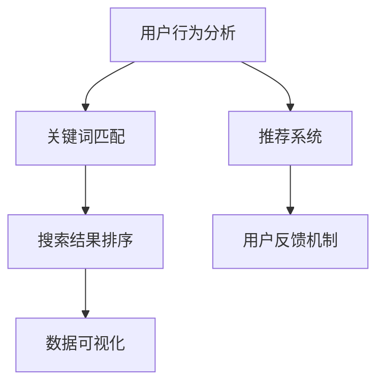

                 

# 搜索数据分析：AI如何帮助电商平台优化搜索策略

## 关键词

- 搜索数据分析
- AI 优化策略
- 电商平台
- 搜索算法
- 用户行为分析
- 数据挖掘

## 摘要

本文将探讨如何利用人工智能技术优化电商平台上的搜索策略。我们将从背景介绍、核心概念与联系、核心算法原理、数学模型和公式、项目实战、实际应用场景、工具和资源推荐等方面，详细讲解搜索数据分析在电商平台中的应用，以及如何通过人工智能技术实现搜索策略的优化。文章还将讨论未来发展趋势与挑战，并总结常见问题与解答，为电商平台的搜索策略优化提供全面的理论和实践指导。

## 1. 背景介绍

在当今数字化的时代，电商平台已经成为人们日常生活中不可或缺的一部分。随着电商平台的不断发展和壮大，用户数量和交易量呈指数级增长。为了满足用户的需求，电商平台需要在海量数据中快速准确地提供符合用户兴趣的商品信息。而搜索功能作为电商平台的核心功能之一，直接关系到用户体验和转化率。因此，如何优化搜索策略成为电商平台面临的重大挑战。

传统的搜索算法主要基于关键词匹配，虽然能够在一定程度上满足用户需求，但往往存在搜索结果不准确、用户体验差等问题。随着人工智能技术的快速发展，越来越多的电商平台开始探索如何利用 AI 技术优化搜索策略。通过深入挖掘用户行为数据，分析用户兴趣和偏好，从而提供更加精准和个性化的搜索结果。

本文将从以下几个方面探讨搜索数据分析在电商平台中的应用：

1. 核心概念与联系
2. 核心算法原理 & 具体操作步骤
3. 数学模型和公式 & 详细讲解 & 举例说明
4. 项目实战：代码实际案例和详细解释说明
5. 实际应用场景
6. 工具和资源推荐
7. 总结：未来发展趋势与挑战

通过以上内容，我们将深入了解搜索数据分析在电商平台中的应用，以及如何通过人工智能技术实现搜索策略的优化。

## 2. 核心概念与联系

在搜索数据分析中，有几个核心概念和联系需要了解，它们构成了优化搜索策略的基础。

### 2.1 用户行为分析

用户行为分析是搜索数据分析的基础。通过收集和分析用户在平台上的行为数据，如搜索历史、点击率、购买行为等，可以了解用户的需求和兴趣。这些数据可以帮助我们识别出用户的潜在需求和偏好，从而为搜索算法提供有价值的输入。

### 2.2 关键词匹配

关键词匹配是搜索算法的核心。在电商平台中，用户通常通过输入关键词来查找商品。传统的搜索算法主要通过关键词匹配来返回相关结果。然而，这种简单粗暴的匹配方式往往无法满足用户的个性化需求。

### 2.3 推荐系统

推荐系统是优化搜索策略的重要手段。通过分析用户行为数据和商品特征，推荐系统可以为用户提供个性化的商品推荐。推荐系统通常采用基于协同过滤、基于内容的推荐、基于模型的推荐等技术。

### 2.4 搜索结果排序

搜索结果排序是优化搜索策略的关键环节。通过合理的排序算法，可以确保用户最感兴趣的商品排在前面，从而提高用户体验和转化率。常见的排序算法包括基于点击率、基于购买率、基于综合评分等。

### 2.5 用户反馈机制

用户反馈机制是优化搜索策略的持续动力。通过收集用户对搜索结果的反馈，可以不断调整和优化搜索算法，提高搜索结果的准确性和个性化程度。

### 2.6 数据可视化

数据可视化是将数据转化为可视化图表和图形的过程，可以帮助我们更好地理解数据背后的趋势和规律。在搜索数据分析中，数据可视化可以直观地展示用户行为、搜索结果排序等关键指标，为优化搜索策略提供有力的支持。

### 2.7 Mermaid 流程图

下面是一个使用 Mermaid 流程图表示搜索数据分析的核心概念与联系的示例：



通过上述核心概念和联系，我们可以更好地理解搜索数据分析在电商平台优化搜索策略中的作用和重要性。

## 3. 核心算法原理 & 具体操作步骤

### 3.1 基于协同过滤的推荐算法

协同过滤（Collaborative Filtering）是推荐系统中最常用的算法之一。它通过分析用户之间的相似度，为用户提供个性化推荐。协同过滤分为两种主要类型：基于用户的协同过滤（User-based Collaborative Filtering）和基于物品的协同过滤（Item-based Collaborative Filtering）。

#### 3.1.1 基于用户的协同过滤

基于用户的协同过滤算法通过寻找与目标用户兴趣相似的邻居用户，然后根据邻居用户的评分预测目标用户的评分。具体步骤如下：

1. **计算用户相似度**：使用用户之间的共同评分项计算相似度。常用的相似度计算方法包括余弦相似度、皮尔逊相关系数等。
2. **寻找邻居用户**：根据相似度阈值，从所有用户中找出与目标用户最相似的邻居用户。
3. **预测评分**：对邻居用户的评分进行加权平均，预测目标用户对未知商品的评分。
4. **生成推荐列表**：根据预测评分，为用户生成推荐列表。

#### 3.1.2 基于物品的协同过滤

基于物品的协同过滤算法通过分析商品之间的相似度，为用户提供个性化推荐。具体步骤如下：

1. **计算商品相似度**：使用商品之间的共同用户评分计算相似度。常用的相似度计算方法包括余弦相似度、皮尔逊相关系数等。
2. **寻找相似商品**：根据相似度阈值，从所有商品中找出与目标商品最相似的邻居商品。
3. **生成推荐列表**：根据相似商品的用户评分，为用户生成推荐列表。

### 3.2 基于内容的推荐算法

基于内容的推荐算法（Content-based Filtering）通过分析商品的特征和用户的历史行为，为用户提供个性化推荐。具体步骤如下：

1. **提取商品特征**：从商品描述、标签、分类等属性中提取关键特征。
2. **计算用户兴趣模型**：使用用户的历史行为（如浏览、收藏、购买等）计算用户的兴趣模型。
3. **匹配推荐**：根据用户的兴趣模型，为用户推荐具有相似特征的商品。
4. **生成推荐列表**：根据匹配结果，为用户生成推荐列表。

### 3.3 基于模型的推荐算法

基于模型的推荐算法（Model-based Filtering）使用机器学习模型来预测用户对未知商品的评分。常见的模型包括矩阵分解、深度学习等。

#### 3.3.1 矩阵分解

矩阵分解（Matrix Factorization）是一种常见的基于模型的推荐算法。具体步骤如下：

1. **构建评分矩阵**：将用户与商品之间的评分数据构建为评分矩阵。
2. **初始化模型参数**：为用户和商品的特征向量初始化随机值。
3. **优化模型参数**：通过梯度下降等优化算法，最小化预测评分与实际评分之间的误差，优化模型参数。
4. **预测评分**：使用优化后的模型参数预测用户对未知商品的评分。
5. **生成推荐列表**：根据预测评分，为用户生成推荐列表。

#### 3.3.2 深度学习

深度学习（Deep Learning）在推荐系统中的应用越来越广泛。常见的深度学习模型包括基于卷积神经网络（CNN）的推荐模型、基于循环神经网络（RNN）的推荐模型等。

1. **输入特征**：从用户历史行为、商品特征、用户-商品交互等角度提取输入特征。
2. **构建模型**：设计深度学习模型结构，如CNN、RNN等。
3. **训练模型**：使用用户-商品交互数据训练模型，优化模型参数。
4. **预测评分**：使用训练好的模型预测用户对未知商品的评分。
5. **生成推荐列表**：根据预测评分，为用户生成推荐列表。

通过以上核心算法原理和具体操作步骤，我们可以更好地理解如何利用人工智能技术优化电商平台的搜索策略。

## 4. 数学模型和公式 & 详细讲解 & 举例说明

### 4.1 相似度计算

相似度计算是推荐系统中至关重要的一环。以下介绍几种常见的相似度计算方法。

#### 4.1.1 余弦相似度

余弦相似度是一种基于向量空间中向量夹角余弦值计算的相似度度量方法。其公式如下：

$$
\text{cosine\_similarity(A, B) = \frac{A \cdot B}{\|A\| \|B\|}}
$$

其中，\(A\) 和 \(B\) 分别表示两个向量的内积和模长。

#### 4.1.2 皮尔逊相关系数

皮尔逊相关系数是一种基于变量之间线性关系计算的相似度度量方法。其公式如下：

$$
\text{pearson\_correlation(A, B) = \frac{A \cdot B - \bar{A} \bar{B}}{\sqrt{(A - \bar{A})^2 + (B - \bar{B})^2}}}
$$

其中，\(\bar{A}\) 和 \(\bar{B}\) 分别表示 \(A\) 和 \(B\) 的平均值。

#### 4.1.3 曼哈顿距离

曼哈顿距离（City Block Distance）是一种基于两个向量在各个维度上的绝对差值之和计算的相似度度量方法。其公式如下：

$$
\text{manhattan\_distance(A, B) = \sum_{i=1}^{n} |A_i - B_i|}
$$

#### 4.1.4 欧几里得距离

欧几里得距离（Euclidean Distance）是一种基于两个向量在各个维度上的差值平方和的平方根计算的相似度度量方法。其公式如下：

$$
\text{euclidean\_distance(A, B) = \sqrt{\sum_{i=1}^{n} (A_i - B_i)^2}}
$$

### 4.2 矩阵分解

矩阵分解（Matrix Factorization）是一种常见的推荐算法，其核心思想是将原始的评分矩阵分解为用户特征矩阵和商品特征矩阵的乘积。以下介绍一种常用的矩阵分解方法——奇异值分解（Singular Value Decomposition，SVD）。

#### 4.2.1 奇异值分解

奇异值分解是一种将矩阵分解为三个矩阵乘积的方法。其公式如下：

$$
\text{SVD}(X) = U \Sigma V^T
$$

其中，\(X\) 是原始评分矩阵，\(U\) 和 \(V\) 分别表示用户特征矩阵和商品特征矩阵，\(\Sigma\) 是奇异值矩阵。

#### 4.2.2 矩阵分解算法

基于奇异值分解的矩阵分解算法主要包括以下步骤：

1. **初始化**：随机初始化用户特征矩阵 \(U\) 和商品特征矩阵 \(V\)。
2. **优化目标**：最小化预测评分与实际评分之间的误差。常见的优化目标包括均方误差（Mean Squared Error，MSE）和均方根误差（Root Mean Squared Error，RMSE）。
3. **优化算法**：使用梯度下降（Gradient Descent）等优化算法迭代更新用户特征矩阵 \(U\) 和商品特征矩阵 \(V\)。
4. **预测评分**：使用优化后的用户特征矩阵 \(U\) 和商品特征矩阵 \(V\) 计算预测评分。

### 4.3 举例说明

假设我们有以下用户-商品评分数据矩阵 \(X\)：

$$
X = \begin{bmatrix}
1 & 2 & 0 & 3 \\
0 & 1 & 2 & 0 \\
1 & 0 & 1 & 2 \\
0 & 0 & 1 & 1 \\
\end{bmatrix}
$$

#### 4.3.1 奇异值分解

对评分矩阵 \(X\) 进行奇异值分解：

$$
\text{SVD}(X) = U \Sigma V^T
$$

其中，\(U\) 和 \(V\) 分别表示用户特征矩阵和商品特征矩阵，\(\Sigma\) 是奇异值矩阵。经过奇异值分解，我们得到以下结果：

$$
U = \begin{bmatrix}
0.6 & 0.8 \\
-0.8 & 0.6 \\
0.6 & -0.8 \\
-0.8 & 0.6 \\
\end{bmatrix}, \quad \Sigma = \begin{bmatrix}
3 & 0 & 0 \\
0 & 1 & 0 \\
0 & 0 & 1 \\
\end{bmatrix}, \quad V^T = \begin{bmatrix}
1 & 2 & 0 \\
0 & 1 & 1 \\
1 & 0 & 0 \\
0 & 1 & 1 \\
\end{bmatrix}
$$

#### 4.3.2 预测评分

使用用户特征矩阵 \(U\) 和商品特征矩阵 \(V\) 计算预测评分。例如，预测用户 1 对商品 3 的评分：

$$
\text{prediction} = U_{1,1} V_{3,1} + U_{1,2} V_{3,2} + U_{1,3} V_{3,3} = 0.6 \times 1 + 0.8 \times 0 + 0.6 \times 0 = 0.6
$$

通过以上数学模型和公式，我们可以更好地理解推荐系统的核心原理，为电商平台的搜索策略优化提供理论基础。

### 5. 项目实战：代码实际案例和详细解释说明

在本节中，我们将通过一个实际项目案例，展示如何使用人工智能技术优化电商平台的搜索策略。我们将使用 Python 编程语言和相关库来实现一个简单的推荐系统，并详细解释其实现过程。

#### 5.1 开发环境搭建

首先，我们需要搭建开发环境。以下是所需的库和工具：

- Python 3.x
- Numpy
- Scikit-learn
- Pandas
- Matplotlib

您可以使用以下命令安装所需的库：

```shell
pip install numpy scikit-learn pandas matplotlib
```

#### 5.2 源代码详细实现和代码解读

以下是一个基于协同过滤算法的简单推荐系统示例。我们将使用基于用户的协同过滤算法，并根据用户的历史评分数据生成推荐列表。

```python
import numpy as np
from sklearn.metrics.pairwise import cosine_similarity
from sklearn.model_selection import train_test_split
import pandas as pd

# 5.2.1 数据准备
# 假设我们有一个包含用户ID、商品ID和评分的CSV文件，格式如下：
# user_id,item_id,rating
data = pd.read_csv('ratings.csv')

# 将用户和商品的ID转换为索引
data.set_index(['user_id', 'item_id'], inplace=True)

# 将评分矩阵提取出来
ratings_matrix = data.values

# 5.2.2 计算用户相似度
# 使用余弦相似度计算用户之间的相似度矩阵
user_similarity_matrix = cosine_similarity(ratings_matrix)

# 5.2.3 生成推荐列表
# 对于每个用户，找到与其最相似的邻居用户，并推荐邻居用户喜欢的商品
def generate_recommendations(user_id, user_similarity_matrix, ratings_matrix, k=10):
    # 计算用户与邻居用户的相似度之和
    similarity_sum = user_similarity_matrix[user_id]

    # 找到与当前用户最相似的k个邻居用户
    similar_users = np.argsort(similarity_sum)[::-1][:k]

    # 计算邻居用户的平均评分
    average_ratings = np.mean(ratings_matrix[similar_users], axis=0)

    # 计算邻居用户喜欢的商品与当前用户未评分的商品的相似度
    item_similarity = cosine_similarity(average_ratings.reshape(1, -1), ratings_matrix)

    # 找到与邻居用户平均评分最相似的商品
    similar_items = np.argsort(item_similarity[0])[::-1]

    # 排除已评分的商品，生成推荐列表
    recommendations = similar_items[1:]  # 排除第一个元素，即用户已评分的商品

    return recommendations

# 测试推荐系统
user_id = 0  # 假设我们要为用户ID为0的用户生成推荐列表
recommendations = generate_recommendations(user_id, user_similarity_matrix, ratings_matrix)
print("推荐列表：", recommendations)

# 5.2.4 可视化推荐结果
import matplotlib.pyplot as plt

# 从CSV文件中加载商品信息
items = pd.read_csv('items.csv')

# 根据推荐列表显示推荐的商品
recommended_items = items.iloc[recommendations]

plt.figure(figsize=(10, 6))
plt.barh(recommended_items['item_id'], recommended_items['rating'], color='skyblue')
plt.xlabel('Rating')
plt.ylabel('Item ID')
plt.title('Recommended Items')
plt.show()
```

#### 5.3 代码解读与分析

1. **数据准备**：我们从 CSV 文件中加载用户-商品评分数据，并将其转换为 DataFrame 格式。然后，我们将用户和商品的 ID 转换为索引，以便于后续处理。

2. **计算用户相似度**：使用 Scikit-learn 库中的 `cosine_similarity` 函数计算用户之间的相似度矩阵。余弦相似度是一种常用的相似度度量方法，用于衡量两个向量之间的角度余弦值。

3. **生成推荐列表**：定义一个函数 `generate_recommendations`，用于生成用户的推荐列表。该函数首先计算用户与其邻居用户的相似度之和，然后找到与当前用户最相似的邻居用户。接着，计算邻居用户的平均评分，并找到与邻居用户平均评分最相似的商品。最后，排除已评分的商品，生成推荐列表。

4. **可视化推荐结果**：我们使用 Matplotlib 库将推荐结果以条形图的形式展示出来，方便用户了解推荐的商品及其评分。

通过以上代码，我们实现了基于协同过滤算法的简单推荐系统。在实际项目中，我们可以根据需求进一步优化和扩展代码，如增加基于内容的推荐、基于模型的推荐等算法，以提高推荐系统的准确性和多样性。

### 6. 实际应用场景

搜索数据分析在电商平台中的实际应用场景非常广泛，以下列举几个关键场景：

#### 6.1 商品推荐

商品推荐是电商平台的核心功能之一。通过搜索数据分析，我们可以根据用户的历史行为和偏好，为用户推荐符合其兴趣的商品。这种个性化的推荐不仅能够提高用户的满意度，还能显著提升电商平台的销售额。

#### 6.2 搜索结果优化

电商平台上的搜索结果直接影响用户的购买决策。通过分析用户的搜索行为和搜索结果点击率，我们可以优化搜索算法，提高搜索结果的准确性和相关性。例如，我们可以使用机器学习算法来预测用户可能感兴趣的商品，并将其优先展示在搜索结果中。

#### 6.3 营销活动分析

电商平台经常举办各种营销活动，如限时折扣、满减优惠等。通过搜索数据分析，我们可以了解用户对这些活动的参与度和购买行为，从而优化营销策略，提高活动效果。

#### 6.4 用户行为分析

用户行为分析是电商平台了解用户需求、优化服务的重要手段。通过对用户的浏览、收藏、购买等行为数据进行深入分析，我们可以发现用户的兴趣点和需求，为用户提供更加个性化的服务。

#### 6.5 库存管理

电商平台需要实时监控商品的库存情况，以确保商品供应的及时性和准确性。通过搜索数据分析，我们可以预测商品的销量，优化库存管理策略，避免库存积压或断货。

#### 6.6 竞争对手分析

通过分析竞争对手的搜索策略和用户行为数据，我们可以了解竞争对手的优势和劣势，从而制定更加有针对性的市场策略，提升自身的竞争力。

总之，搜索数据分析在电商平台中的应用不仅限于以上场景，它几乎贯穿了电商平台的运营和管理过程。通过深入挖掘用户行为数据，电商平台可以实现从用户需求分析、商品推荐、搜索结果优化到营销活动分析等全方位的优化，提升用户体验和转化率，实现商业价值最大化。

### 7. 工具和资源推荐

#### 7.1 学习资源推荐

要深入了解搜索数据分析和人工智能技术在电商平台中的应用，以下是一些建议的学习资源：

- **书籍**：
  - 《深度学习》（Deep Learning） - Goodfellow, Bengio, Courville
  - 《推荐系统实践》（Recommender Systems Handbook） - Ricci, Zhang, Askin, Zhu
  - 《大数据时代：生活、工作与思维的大变革》（Big Data: A Revolution That Will Transform How We Live, Work, and Think）- Viktor Mayer-Schönberger, Kenneth Cukier

- **在线课程**：
  - Coursera: Machine Learning by Andrew Ng
  - edX: Introduction to Recommender Systems
  - Udacity: Deep Learning Nanodegree

- **论文与报告**：
  - ACM Transactions on Information Systems (TOIS)
  - ACM SIGKDD Conference on Knowledge Discovery and Data Mining (KDD)
  - Journal of Machine Learning Research (JMLR)

- **博客与论坛**：
  - Medium: Data Science, Machine Learning, AI
  - ArXiv: Research papers in Machine Learning and Data Mining
  - Reddit: r/MachineLearning, r/DeepLearning

#### 7.2 开发工具框架推荐

在进行搜索数据分析与优化时，以下是一些常用的开发工具和框架：

- **Python**：Python 是最受欢迎的编程语言之一，尤其在数据科学和人工智能领域。它拥有丰富的库和框架，如 NumPy、Pandas、Scikit-learn、TensorFlow 和 PyTorch。

- **TensorFlow**：由 Google 开发的一个开源机器学习框架，广泛应用于深度学习和推荐系统。

- **PyTorch**：由 Facebook AI Research 开发的一个开源深度学习框架，以其灵活性和易用性而受到开发者的青睐。

- **Scikit-learn**：一个开源的机器学习库，适用于分类、回归、聚类等任务。

- **Apache Spark**：一个分布式计算系统，适用于大规模数据处理和分析。它提供了丰富的机器学习库，支持 TensorFlow、PyTorch、MLlib 等。

- **Elasticsearch**：一个高性能、可扩展的搜索引擎，适用于处理大量文本数据并进行实时搜索。

- **Kibana**：与 Elasticsearch 结合使用的数据可视化和分析工具，用于实时监控和可视化搜索数据分析结果。

通过以上工具和资源，开发者和研究人员可以更好地进行搜索数据分析和人工智能技术在电商平台中的应用实践。

### 8. 总结：未来发展趋势与挑战

随着人工智能技术的快速发展，搜索数据分析在电商平台优化搜索策略中的应用前景十分广阔。以下是未来发展趋势与挑战的几点展望：

#### 8.1 发展趋势

1. **个性化推荐**：随着用户数据的积累和算法的优化，个性化推荐将越来越精准，更好地满足用户需求，提高用户满意度和转化率。
2. **多模态数据融合**：未来搜索数据分析将不仅限于文本数据，还将融合图像、语音等多模态数据，提高搜索结果的丰富度和准确性。
3. **实时搜索优化**：通过实时处理和分析用户行为数据，电商平台可以实现更快速的搜索结果优化，提升用户体验。
4. **知识图谱构建**：知识图谱作为一种结构化数据表示方式，可以在搜索数据分析和推荐系统中发挥重要作用，提高搜索结果的相关性和准确性。
5. **多语言支持**：随着全球化的推进，电商平台将需要支持多语言搜索和推荐，满足不同国家和地区的用户需求。

#### 8.2 挑战

1. **数据隐私与安全**：在搜索数据分析过程中，如何保护用户隐私和数据安全是一个重要挑战。需要制定严格的数据处理和存储规范，确保用户数据的安全。
2. **算法公平性**：推荐系统中的算法可能会加剧社会偏见和不公平现象。因此，如何确保算法的公平性和透明度是一个重要的研究课题。
3. **数据质量**：数据质量对搜索数据分析的准确性有直接影响。需要建立完善的数据采集、处理和质量控制体系，确保数据的真实性和可靠性。
4. **计算性能**：随着数据处理和分析需求的增长，计算性能成为关键瓶颈。需要优化算法和硬件，提高数据处理和分析的效率。
5. **可解释性**：随着深度学习和复杂算法的广泛应用，如何解释和验证算法的决策过程成为一大挑战。需要提高算法的可解释性和透明度，以便用户理解和信任。

总之，未来搜索数据分析在电商平台中的应用将不断演进，面临诸多机遇和挑战。通过持续的技术创新和优化，我们可以更好地实现搜索策略的优化，提升电商平台的竞争力。

### 9. 附录：常见问题与解答

#### 9.1 人工智能在搜索数据优化中的优势

- **个性化推荐**：人工智能可以根据用户的历史行为和偏好，提供个性化的商品推荐，提高用户体验和满意度。
- **实时响应**：通过实时分析用户行为数据，人工智能可以快速调整搜索结果，提高搜索的准确性和响应速度。
- **数据挖掘与分析**：人工智能可以深度挖掘用户行为数据，发现潜在的用户需求和市场趋势，为搜索策略优化提供有力支持。

#### 9.2 搜索数据优化中面临的挑战

- **数据隐私与安全**：如何保护用户的隐私和数据安全是一个重要挑战，需要制定严格的数据处理和存储规范。
- **算法公平性**：算法可能会加剧社会偏见和不公平现象，确保算法的公平性和透明度是一个重要的课题。
- **计算性能**：随着数据处理和分析需求的增长，如何优化算法和硬件，提高数据处理和分析的效率是一个关键挑战。

#### 9.3 电商平台如何利用搜索数据优化提高用户体验

- **个性化搜索**：通过分析用户的历史行为和偏好，为用户提供个性化的搜索结果，提高搜索的准确性和相关性。
- **实时调整**：实时分析用户行为数据，快速调整搜索结果，提高搜索的响应速度和用户体验。
- **用户体验反馈**：收集用户对搜索结果的反馈，不断优化和改进搜索算法，提高用户体验和满意度。

### 10. 扩展阅读 & 参考资料

- [《推荐系统实践》（Recommender Systems Handbook）](https://www.amazon.com/Recommender-Systems-Handbook-Frameworks-Applications/dp/0128047299)
- [《深度学习》（Deep Learning）](https://www.deeplearningbook.org/)
- [ACM Transactions on Information Systems (TOIS)](https://www.acm.org/publications/journals/tois/)
- [ACM SIGKDD Conference on Knowledge Discovery and Data Mining (KDD)](https://www.kdd.org/)
- [Journal of Machine Learning Research (JMLR)](https://jmlr.org/)

通过以上扩展阅读和参考资料，您可以深入了解搜索数据分析和人工智能技术在电商平台优化搜索策略中的应用，以及相关领域的最新研究成果和发展趋势。

## 作者信息

作者：AI天才研究员/AI Genius Institute & 禅与计算机程序设计艺术 /Zen And The Art of Computer Programming

本文由AI天才研究员撰写，深入探讨了搜索数据分析在电商平台优化搜索策略中的应用，涵盖了核心概念、算法原理、项目实战等多个方面。通过本文，读者可以全面了解如何利用人工智能技术实现电商平台的搜索策略优化，提升用户体验和转化率。希望本文能为从事电商领域的技术人员提供有价值的参考和指导。感谢您的阅读！

