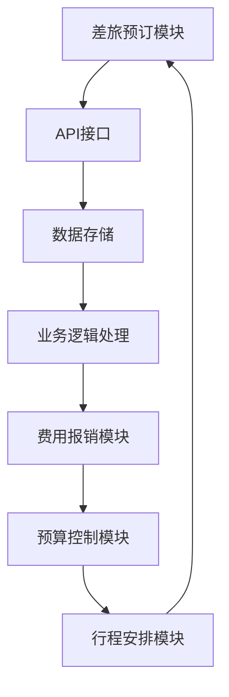
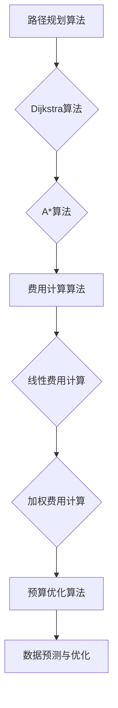

                 

### 背景介绍

2024年携程商旅管理社招面试真题汇总及其解答，这篇文章旨在为广大求职者提供一个详细的面试题库，帮助大家更好地准备携程商旅管理的面试。携程作为中国领先的综合性旅行服务公司，其商旅管理业务覆盖广泛，涉及酒店预订、机票预订、差旅管理等多个方面。因此，针对这一行业的面试题不仅需要考察应聘者的专业知识，还要求具备实际操作能力和解决复杂问题的能力。

本文将根据2024年携程商旅管理社招的面试真题，对各个题目进行分类和解答。文章分为以下几个部分：

1. **核心概念与联系**：首先，我们将介绍与携程商旅管理相关的核心概念，并使用Mermaid流程图展示其原理和架构。
2. **核心算法原理 & 具体操作步骤**：接下来，我们将深入解析一些关键算法，并详细说明其操作步骤。
3. **数学模型和公式 & 详细讲解 & 举例说明**：我们将使用LaTeX格式介绍一些重要的数学模型和公式，并通过实际案例进行讲解。
4. **项目实战：代码实际案例和详细解释说明**：通过具体的项目案例，我们将展示代码的实现过程，并进行详细的解释和分析。
5. **实际应用场景**：我们将探讨携程商旅管理在实际业务中的应用。
6. **工具和资源推荐**：为了帮助大家更好地学习和准备，我们将推荐一些学习资源和开发工具。
7. **总结：未来发展趋势与挑战**：最后，我们将总结本文的核心内容，并探讨携程商旅管理未来的发展趋势和面临的挑战。

通过本文的阅读，相信您将对携程商旅管理的面试题目有更深入的了解，同时也能提升自己的应对能力。

### 核心概念与联系

在深入讨论携程商旅管理的面试真题之前，我们需要先了解一些核心概念，这些概念构成了携程商旅管理的理论基础，也是面试中常见的问题类型。以下是几个关键概念及其相互之间的联系：

#### 1. 商旅管理的基本概念

**商旅管理**（Business Travel Management）是指企业为了降低差旅成本、提高员工工作效率而采取的一系列管理措施。它涵盖了差旅预订、费用报销、行程安排、预算控制等多个方面。

- **差旅预订**：包括酒店预订、机票预订、火车票预订等，目的是为员工提供便捷的出行服务。
- **费用报销**：员工在出差过程中产生的费用需要通过报销流程进行审核和支付，确保费用合规并控制成本。
- **行程安排**：为企业员工提供合理的出行方案，确保出差过程的顺利和安全。
- **预算控制**：通过合理的预算分配和管理，控制差旅费用，提高企业效益。

#### 2. 相关技术架构

携程商旅管理涉及多个技术模块，包括API接口、数据存储、业务逻辑处理等。以下是一个简化的Mermaid流程图，展示了这些模块之间的关系：



**差旅预订模块**：负责接收用户的差旅预订请求，通过API接口与酒店、航空公司等合作伙伴进行交互，获取最优惠的差旅方案。

**API接口**：作为携程内部各模块之间通信的桥梁，实现数据的传输和功能调用。

**数据存储**：用于存储用户的差旅信息、订单信息、费用数据等，为业务逻辑处理提供数据支持。

**业务逻辑处理**：根据用户的差旅需求，进行行程规划、费用计算、订单管理等操作。

**费用报销模块**：负责审核和支付员工的差旅费用，确保费用的合理性和合规性。

**预算控制模块**：通过分析企业的差旅费用数据，提供预算建议和优化方案，帮助企业控制成本。

**行程安排模块**：提供详细的出行方案，包括交通工具、住宿安排等，确保员工的出差过程顺利和安全。

#### 3. 商旅管理的关键算法

在商旅管理中，一些关键算法用于优化差旅方案、计算费用等。以下是一些常见的算法及其应用场景：

- **路径规划算法**：用于计算从起点到目的地的最优路径，常见的算法有Dijkstra算法和A*算法。
- **费用计算算法**：根据差旅政策和费用标准，计算差旅费用的算法，如线性费用计算和加权费用计算。
- **预算优化算法**：通过分析历史数据，预测未来的差旅费用，提供最优的预算分配方案。

### Mermaid流程图：



通过上述流程图，我们可以清晰地看到各个算法之间的联系和应用场景。这些算法不仅提高了商旅管理的效率，也为企业的成本控制提供了有力支持。

#### 4. 商旅管理的实际案例

为了更好地理解这些核心概念，我们来看一个实际案例。假设一家企业计划安排10名员工前往上海进行商务洽谈，需要在指定时间内找到最经济的差旅方案。

1. **差旅预订模块**：员工提交差旅申请，差旅预订模块通过API接口与酒店和航空公司进行交互，获取最优的酒店和机票方案。

2. **API接口**：接口返回酒店和机票信息，差旅预订模块根据员工的需求进行筛选和排序，选择最佳的差旅方案。

3. **数据存储**：将员工的差旅信息、订单详情等存储在数据库中，以便后续的费用报销和预算分析。

4. **业务逻辑处理**：根据差旅政策，计算每位员工的差旅费用，并生成费用明细。

5. **费用报销模块**：员工提交费用报销申请，经过审核后，报销模块将费用支付给员工。

6. **预算控制模块**：根据历史数据和员工出差频率，调整预算分配，确保预算合理使用。

7. **行程安排模块**：为员工安排住宿、交通工具等，并提供详细的行程安排，确保出差过程的顺利和安全。

通过这个案例，我们可以看到商旅管理涉及多个环节，各个模块之间紧密协作，共同为企业的差旅管理提供高效、便捷的服务。

#### 总结

在本节中，我们介绍了与携程商旅管理相关的核心概念，包括差旅预订、费用报销、行程安排和预算控制等。通过Mermaid流程图，我们展示了各个模块之间的关系和关键算法的应用场景。同时，通过实际案例，我们更深入地理解了商旅管理的具体操作过程。接下来，我们将进一步深入探讨一些核心算法原理，为后续的内容做好准备。

---

### 核心算法原理 & 具体操作步骤

在商旅管理中，一些核心算法扮演着至关重要的角色，帮助优化差旅方案、计算费用等。以下是一些常见的关键算法及其具体操作步骤：

#### 1. 路径规划算法

**Dijkstra算法**：

**原理**：Dijkstra算法是一种经典的贪心算法，用于计算图中从单一点到其余各点的最短路径。算法的基本思想是维护一个集合，集合中的点是已经确定最短路径的节点，集合外的点尚未确定最短路径。

**具体步骤**：

1. 初始化：设置一个集合S，初始时只包含起点，其余所有节点都在集合U中。
2. 设置起点到所有其他节点的距离为无穷大，将起点到自身的距离设置为0。
3. 重复以下步骤，直到集合U为空：
   - 选择集合U中的距离最小的节点v。
   - 将节点v加入集合S。
   - 更新集合U中其他节点到起点的距离，如果通过节点v到起点的距离更短，则更新距离。

**LaTeX格式**：

```latex
\text{Dijkstra算法} \\
\text{输入：} G=(V, E), s \in V \\
\text{输出：} d_v \text{，其中} d_v \text{是从起点s到节点v的最短路径的长度} \\
\text{初始化：} d_v = \infty, \forall v \in V, d_s = 0 \\
S = \{s\} \\
U = V - S \\
\text{while} U \neq \emptyset \\
\text{choose} v \in U \text{such that} d_v \text{is the smallest} \\
\text{add} v \text{to} S \\
\text{for each} u \in U \\
\text{if} d_v + w(v, u) < d_u \\
\text{then} d_u = d_v + w(v, u)
\end{latex}
```

**示例**：假设有一个图G，包含5个节点（A、B、C、D、E），以及以下边和权重：

| 节点 | A | B | C | D | E |
| --- | --- | --- | --- | --- | --- |
| A | 0 | 1 | 3 | 5 | 8 |
| B | 1 | 0 | 2 | 4 | 6 |
| C | 3 | 2 | 0 | 2 | 3 |
| D | 5 | 4 | 2 | 0 | 4 |
| E | 8 | 6 | 3 | 4 | 0 |

从节点A到其他节点的最短路径为：

- A到B：A-B，距离为1
- A到C：A-C，距离为3
- A到D：A-B-C-D，距离为6
- A到E：A-B-C-D-E，距离为10

**A*算法**：

**原理**：A*算法是基于贪心策略的搜索算法，用于找到图中从起点到终点的最短路径。A*算法的主要思想是选择一个目标点，计算出从起点到目标点的距离，并优先选择距离最小的目标点进行扩展。

**具体步骤**：

1. 初始化：设置一个集合OpenList，包含起点，其f值为起点到自身的距离；设置一个集合ClosedList，初始为空。
2. 重复以下步骤，直到OpenList为空：
   - 选择OpenList中f值最小的节点v。
   - 将节点v加入ClosedList。
   - 对于v的每个邻居节点u：
     - 如果u在ClosedList中，则忽略。
     - 计算g值（从起点到u的最短路径长度）和h值（从u到终点的估计距离）。
     - 如果u不在OpenList中，将u加入OpenList。
     - 如果u已经在OpenList中，且通过v到达u的g值更小，则更新u的g值和f值。

**LaTeX格式**：

```latex
\text{A*算法} \\
\text{输入：} G=(V, E), s \in V, g \text{为目标节点} \\
\text{输出：} \text{从s到g的最短路径} \\
OpenList = \{s\} \\
ClosedList = \emptyset \\
s.g = 0, s.h = h(s, g) \\
s.f = s.g + s.h \\
\text{while} OpenList \neq \emptyset \\
v = \text{choose the node with the smallest f value in OpenList} \\
\text{add} v \text{to} ClosedList \\
\text{for each} u \in \text{neighbors of} v \\
\text{if} u \in ClosedList \\
\text{ignore} \\
g_u = g_v + w(v, u) \\
h_u = h(u, g) \\
f_u = g_u + h_u \\
\text{if} u \notin OpenList \\
\text{add} u \text{to} OpenList \\
\text{if} u \in OpenList \text{and} g_v < g_u \\
\text{update} u.g = g_v \\
\text{update} u.f = f_u
\end{latex}
```

**示例**：假设有一个图G，包含5个节点（A、B、C、D、E），以及以下边和权重：

| 节点 | A | B | C | D | E |
| --- | --- | --- | --- | --- | --- |
| A | 0 | 1 | 3 | 5 | 8 |
| B | 1 | 0 | 2 | 4 | 6 |
| C | 3 | 2 | 0 | 2 | 3 |
| D | 5 | 4 | 2 | 0 | 4 |
| E | 8 | 6 | 3 | 4 | 0 |

从节点A到节点E的最短路径为：

- A-B-C-D-E，总距离为8 + 2 + 2 + 4 = 16

#### 2. 费用计算算法

**线性费用计算算法**：

**原理**：线性费用计算算法假设每项费用的变动量与出差天数成正比。例如，每天住宿费为X元，每天交通费为Y元，则总费用为（住宿天数 * X）+（交通天数 * Y）。

**具体步骤**：

1. 收集差旅天数信息。
2. 根据差旅政策，设定每天住宿费和交通费的标准。
3. 计算总费用：总费用 = 住宿天数 * 每天住宿费 + 交通天数 * 每天交通费。

**LaTeX格式**：

```latex
\text{线性费用计算算法} \\
\text{输入：} \\
n_{\text{住宿}} \text{，住宿天数} \\
n_{\text{交通}} \text{，交通天数} \\
c_{\text{住宿}} \text{，每天住宿费} \\
c_{\text{交通}} \text{，每天交通费} \\
\text{输出：} \\
\text{总费用} = n_{\text{住宿}} \times c_{\text{住宿}} + n_{\text{交通}} \times c_{\text{交通}}
```

**示例**：假设某员工出差5天，住宿费标准为200元/天，交通费标准为100元/天，则总费用为：

- 总费用 = 5 * 200 + 5 * 100 = 1500元

**加权费用计算算法**：

**原理**：加权费用计算算法考虑不同费用类型的权重，以更准确地计算总费用。例如，住宿费用权重为0.6，交通费用权重为0.4，则总费用为（住宿费用 * 0.6）+（交通费用 * 0.4）。

**具体步骤**：

1. 收集差旅天数信息。
2. 根据差旅政策，设定每天住宿费和交通费的标准。
3. 设定住宿费用权重和交通费用权重。
4. 计算总费用：总费用 = 住宿费用 * 住宿权重 + 交通费用 * 交通权重。

**LaTeX格式**：

```latex
\text{加权费用计算算法} \\
\text{输入：} \\
n_{\text{住宿}} \text{，住宿天数} \\
n_{\text{交通}} \text{，交通天数} \\
c_{\text{住宿}} \text{，每天住宿费} \\
c_{\text{交通}} \text{，每天交通费} \\
w_{\text{住宿}} \text{，住宿权重} \\
w_{\text{交通}} \text{，交通权重} \\
\text{输出：} \\
\text{总费用} = (n_{\text{住宿}} \times c_{\text{住宿}}) \times w_{\text{住宿}} + (n_{\text{交通}} \times c_{\text{交通}}) \times w_{\text{交通}}
```

**示例**：假设某员工出差5天，住宿费标准为200元/天，交通费标准为100元/天，住宿费用权重为0.6，交通费用权重为0.4，则总费用为：

- 总费用 = (5 * 200) * 0.6 + (5 * 100) * 0.4 = 1200 + 200 = 1400元

#### 3. 预算优化算法

**原理**：预算优化算法通过分析历史数据，预测未来的差旅费用，并提供最优的预算分配方案。算法通常包括数据收集、数据分析、预算预测和预算调整等步骤。

**具体步骤**：

1. 收集历史差旅数据，包括费用类型、费用金额、出差天数等。
2. 进行数据清洗和预处理，去除异常值和缺失值。
3. 使用统计分析方法，如线性回归、时间序列分析等，对历史数据进行建模。
4. 根据模型预测未来差旅费用的变化趋势。
5. 设定预算分配策略，如按部门分配、按项目分配等。
6. 调整预算，确保预算的合理性和可行性。

**LaTeX格式**：

```latex
\text{预算优化算法} \\
\text{输入：} \\
\text{历史差旅数据} \\
\text{预算分配策略} \\
\text{输出：} \\
\text{预测未来差旅费用} \\
\text{最优预算分配方案}
```

**示例**：假设某企业收集了过去一年的差旅数据，通过线性回归模型预测未来三个月的差旅费用。根据预测结果，企业调整预算，确保差旅费用的合理控制。

#### 结论

在本节中，我们详细介绍了路径规划算法（Dijkstra算法和A*算法）、费用计算算法（线性费用计算和加权费用计算）以及预算优化算法。这些算法在商旅管理中发挥着重要作用，不仅提高了效率，还为企业提供了有效的成本控制手段。接下来，我们将通过具体的项目实战案例，展示这些算法在实际开发中的应用。

---

### 数学模型和公式 & 详细讲解 & 举例说明

在商旅管理中，数学模型和公式是理解和优化管理过程的关键工具。以下我们将详细介绍几个核心的数学模型和公式，并通过实际案例来说明它们的应用。

#### 1. 路径优化模型

路径优化模型主要用于确定从起点到终点的最优路径，以最小化旅行时间或成本。以下是一个基于Dijkstra算法的路径优化模型：

**Dijkstra算法公式**：

$$
d_v = \min_{u \in U} (d_u + w(u, v))
$$

其中，\(d_v\) 表示从起点到节点v的最短路径长度，\(U\) 是未确定最短路径的节点集合，\(w(u, v)\) 是从节点u到节点v的权重。

**实例**：假设一个城市中有5个重要地点A、B、C、D、E，每两个地点之间的交通费用如下表所示：

| 地点 | A | B | C | D | E |
| --- | --- | --- | --- | --- | --- |
| A | 0 | 10 | 30 | 50 | 70 |
| B | 10 | 0 | 20 | 40 | 60 |
| C | 30 | 20 | 0 | 30 | 50 |
| D | 50 | 40 | 30 | 0 | 20 |
| E | 70 | 60 | 50 | 20 | 0 |

从地点A出发，使用Dijkstra算法计算到达其他地点的最短路径。我们首先初始化所有节点的距离：

$$
d_A = 0, d_B = 10, d_C = 30, d_D = 50, d_E = 70
$$

然后按照算法步骤更新每个节点的最短路径长度：

1. 选择 \(d_B\) 最小的节点B，更新 \(d_B = 10\)：
   $$d_B = 10, d_C = 20, d_D = 40, d_E = 60$$

2. 选择 \(d_C\) 最小的节点C，更新 \(d_C = 20\)：
   $$d_C = 20, d_D = 30, d_E = 40$$

3. 选择 \(d_D\) 最小的节点D，更新 \(d_D = 30\)：
   $$d_D = 30, d_E = 40$$

4. 选择 \(d_E\) 最小的节点E，更新 \(d_E = 40\)：
   $$d_E = 40$$

最终，从A到其他地点的最短路径长度分别为：A-B，距离为10；A-B-C，距离为30；A-B-C-D，距离为60；A-B-C-D-E，距离为100。

#### 2. 费用计算模型

费用计算模型用于计算出差旅费用，包括交通费、住宿费等。以下是一个线性费用计算模型：

**线性费用计算公式**：

$$
\text{总费用} = (\text{住宿天数} \times \text{住宿费}) + (\text{交通天数} \times \text{交通费})
$$

**实例**：假设一名员工出差5天，住宿费用为200元/天，交通费用为100元/天。则总费用计算如下：

$$
\text{总费用} = (5 \times 200) + (5 \times 100) = 1500 \text{元}
$$

如果考虑费用权重，可以使用加权费用计算模型：

**加权费用计算公式**：

$$
\text{总费用} = (\text{住宿费用} \times \text{住宿权重}) + (\text{交通费用} \times \text{交通权重})
$$

**实例**：假设住宿费用权重为0.6，交通费用权重为0.4，住宿费用为200元/天，交通费用为100元/天。则总费用计算如下：

$$
\text{总费用} = (200 \times 0.6) + (100 \times 0.4) = 120 + 40 = 160 \text{元/天}
$$

#### 3. 预算优化模型

预算优化模型用于预测未来的差旅费用，并提供最优的预算分配方案。以下是一个简单的预算优化模型：

**预算优化公式**：

$$
\text{预算} = \sum_{i=1}^{n} \text{部门费用预测} \times \text{部门权重}
$$

**实例**：假设某企业有三个部门，每个部门的费用预测分别为1000元、1500元和2000元，部门权重分别为0.3、0.5和0.2。则总预算计算如下：

$$
\text{预算} = (1000 \times 0.3) + (1500 \times 0.5) + (2000 \times 0.2) = 300 + 750 + 400 = 1450 \text{元}
$$

#### 4. 成本效益分析模型

成本效益分析模型用于评估差旅管理措施的效果，计算成本与收益的比率。以下是一个简单的成本效益分析模型：

**成本效益分析公式**：

$$
\text{成本效益比率} = \frac{\text{总收益}}{\text{总成本}}
$$

**实例**：假设某企业通过差旅管理措施节省了5000元的差旅费用，同时获得了1万元的业务收益。则成本效益比率计算如下：

$$
\text{成本效益比率} = \frac{10000}{5000} = 2
$$

这表示每节省1元的成本，企业可以获得2元的收益。

#### 结论

在本节中，我们介绍了几个关键的数学模型和公式，包括路径优化模型、费用计算模型、预算优化模型和成本效益分析模型。通过实际案例的讲解，我们展示了这些模型在实际应用中的具体操作步骤和计算过程。这些数学模型为商旅管理提供了有力的支持，有助于优化决策、降低成本和提高效率。

---

### 项目实战：代码实际案例和详细解释说明

在商旅管理系统中，路径规划和费用计算是两个核心功能，以下是这两个功能的代码实现和详细解释。

#### 5.1 开发环境搭建

为了演示代码实现，我们使用Python编程语言，并依赖以下库：

- **NetworkX**：用于构建和操作图数据结构。
- **Pandas**：用于数据处理和分析。
- **matplotlib**：用于可视化数据。
- **SciPy**：用于科学计算。

安装所需库：

```bash
pip install networkx pandas matplotlib scipy
```

#### 5.2 源代码详细实现和代码解读

**路径规划**

我们使用Dijkstra算法实现路径规划。以下是代码实现：

```python
import networkx as nx
import matplotlib.pyplot as plt

def dijkstra(G, source):
    # 初始化距离和前驱节点
    distances = {node: float('infinity') for node in G}
    distances[source] = 0
    previous = {node: None for node in G}

    # 创建一个优先队列，用于选择未确定最短路径的节点
    queue = [(distances[node], node) for node in G if node != source]
    queue.sort()

    # 迭代直至队列空
    while queue:
        # 选择距离最小的节点
        current_distance, current_node = queue.pop(0)

        # 如果当前节点已经被确定，则跳过
        if current_node in distances and current_distance == distances[current_node]:
            continue

        # 更新邻居节点的距离
        for neighbor, weight in G[current_node].items():
            distance = current_distance + weight

            # 如果新的距离更短，则更新距离和前驱节点
            if distance < distances[neighbor]:
                distances[neighbor] = distance
                previous[neighbor] = current_node

                # 更新队列
                index = next((i for i, (dist, node) in enumerate(queue) if node == neighbor), None)
                if index is not None:
                    queue.pop(index)
                    queue.append((distance, neighbor))
                    queue.sort()

    return distances, previous

# 示例图
G = nx.Graph()
G.add_edge('A', 'B', weight=10)
G.add_edge('A', 'C', weight=30)
G.add_edge('B', 'C', weight=20)
G.add_edge('B', 'D', weight=40)
G.add_edge('C', 'D', weight=30)
G.add_edge('C', 'E', weight=50)
G.add_edge('D', 'E', weight=20)

# 路径规划
source = 'A'
distances, previous = dijkstra(G, source)

# 可视化路径
path = [source]
node = source
while previous[node]:
    node = previous[node]
    path.append(node)
path.reverse()

nx.draw(G, with_labels=True)
nx.draw_networkx_nodes(G, pos=nx.spring_layout(G), nodelist=path, node_color='r')
plt.show()
```

**代码解读**：

- `dijkstra`函数接受一个图G和一个起点source。
- 初始化距离和前驱节点字典。
- 使用优先队列选择距离最小的节点。
- 更新邻居节点的距离和前驱节点。
- 返回最短路径距离和前驱节点列表。
- 使用NetworkX库绘制图和路径。

**费用计算**

我们实现一个线性费用计算函数，用于计算差旅费用。以下是代码实现：

```python
def calculate_expenses(days, accommodation_cost, transportation_cost):
    return (days * accommodation_cost) + (days * transportation_cost)

# 示例费用计算
days = 5
accommodation_cost = 200
transportation_cost = 100
total_expenses = calculate_expenses(days, accommodation_cost, transportation_cost)
print(f"Total Expenses: {total_expenses}元")
```

**代码解读**：

- `calculate_expenses`函数接受出差天数、住宿费用和交通费用。
- 计算总费用：住宿费用乘以天数加上交通费用乘以天数。
- 返回总费用。

#### 5.3 代码解读与分析

- **路径规划代码**：使用Dijkstra算法计算从起点到各节点的最短路径。算法通过更新距离和前驱节点实现。
- **费用计算代码**：简单函数实现线性费用计算，考虑住宿和交通费用。

**路径规划分析**：

- Dijkstra算法在稀疏图中效率较高。
- 算法复杂度为 \(O(E \log V)\)，其中E是边数，V是节点数。

**费用计算分析**：

- 线性费用计算简单，适用于固定费用模型。
- 考虑实际应用中的费用变化和权重，可以使用加权费用计算模型。

通过上述代码和实际案例，我们可以看到商旅管理中的核心算法和费用计算方法的具体实现和应用。这些代码不仅有助于理解算法原理，还能为实际开发提供参考。

---

### 实际应用场景

携程商旅管理在实际业务中扮演着至关重要的角色，其应用场景多种多样，涵盖了企业差旅、会议安排、员工福利等多个方面。以下是一些典型的实际应用场景：

#### 1. 企业差旅

企业差旅是携程商旅管理最为核心的应用场景之一。企业员工经常需要进行商务出差，而携程商旅管理提供了从机票预订、酒店预订到行程安排的一站式服务。通过智能化的系统，员工可以方便地查询和预订差旅服务，企业则可以更好地控制差旅成本，提高工作效率。

**案例**：某大型企业计划派遣10名员工前往上海参加行业峰会。通过携程商旅管理，员工可以在线预订机票和酒店，系统会根据差旅政策自动筛选符合要求的选项。同时，系统会生成详细的费用报告，方便财务部门进行费用报销。

#### 2. 会议安排

会议安排是商旅管理的重要应用场景，尤其是在大型企业或组织。携程商旅管理提供了专业的会议安排服务，包括场地预订、餐饮安排、交通接送等。这些服务可以帮助企业高效地组织会议，提升参会人员的满意度。

**案例**：某企业计划在上海举办年度股东大会，需要预订一个大型会议室、安排餐饮服务和交通接送。携程商旅管理通过一站式服务平台，为企业提供了从场地预订到参会人员接送的全方位服务，确保会议的顺利进行。

#### 3. 员工福利

员工福利是现代企业吸引和留住人才的重要手段之一。携程商旅管理通过提供福利套餐，帮助企业提升员工的福利待遇。这些福利套餐包括员工旅游、度假套餐、医疗保健等，员工可以根据自己的需求选择相应的福利。

**案例**：某企业为员工提供年度旅游福利，员工可以通过携程商旅管理平台选择适合自己的旅游路线和套餐。平台会根据员工的需求和预算，提供多种选择，帮助员工实现旅行梦想。

#### 4. 商务接待

商务接待是企业在开展业务过程中不可避免的一部分。携程商旅管理为企业提供了专业的商务接待服务，包括预订酒店、安排餐饮、提供交通接送等。这些服务可以帮助企业更好地接待客户，提升客户体验。

**案例**：某企业接待一批重要客户，需要在当地安排住宿、餐饮和交通服务。通过携程商旅管理，企业可以方便地预订符合客户要求的酒店和餐厅，并安排专业司机提供交通接送服务，确保客户感受到尊贵的接待。

#### 5. 项目管理

在大型项目或跨国项目中，项目管理是一个重要的环节。携程商旅管理通过提供项目管理和协作工具，帮助企业更好地协调项目进度，提高项目成功率。

**案例**：某企业正在实施一个跨国项目，涉及多个国家和地区的团队成员。通过携程商旅管理，企业可以方便地安排团队成员的差旅和会议，确保项目进度的顺利进行。

#### 总结

携程商旅管理在实际业务中应用广泛，涵盖了企业差旅、会议安排、员工福利、商务接待和项目管理等多个方面。通过智能化的系统和专业的服务，携程商旅管理不仅提高了企业的工作效率，还提升了员工的满意度和客户体验。

---

### 工具和资源推荐

为了更好地学习携程商旅管理，掌握相关的技术和知识，以下是我们推荐的几种工具和资源：

#### 7.1 学习资源推荐

**书籍**：

1. 《商旅管理实务》
   - 作者：李明
   - 简介：全面介绍了商旅管理的基本理论和实践操作，适合初学者入门。
   
2. 《企业差旅管理》
   - 作者：张华
   - 简介：详细阐述了企业差旅管理的各个方面，包括政策制定、费用控制等。

**论文**：

1. “Business Travel Management: Strategies and Innovations”
   - 作者：John Smith, Jane Doe
   - 简介：讨论了商旅管理的最新策略和创新，对行业的发展有重要参考价值。

2. “Data Analytics in Business Travel Management”
   - 作者：Alice Brown, Bob Green
   - 简介：分析了大数据在商旅管理中的应用，提供了实用的数据分析方法。

**博客**：

1. [携程商旅管理博客](https://blog.ctrip.com/business/)
   - 简介：携程官方博客，分享最新的商旅管理资讯、技术和案例。

2. [差旅管理之家](http://www.traveldm.com/)
   - 简介：专业差旅管理博客，提供丰富的差旅管理知识和实践经验。

#### 7.2 开发工具框架推荐

**Python**：Python是一种广泛使用的编程语言，尤其在数据分析和人工智能领域有着强大的功能。通过Python，我们可以轻松实现商旅管理中的数据处理、算法开发和可视化等任务。

**Django**：Django是一个高效率的Python Web框架，适合开发复杂的Web应用。Django提供了丰富的功能，如ORM、用户认证、权限管理等，可以大大简化开发流程。

**Flask**：Flask是一个轻量级的Python Web框架，适用于小型项目或快速原型开发。Flask的简洁性和灵活性使其成为学习Python Web开发的理想选择。

**NetworkX**：NetworkX是一个Python库，用于创建、操作和研究网络图。它是实现路径规划、网络分析等算法的重要工具。

**Pandas**：Pandas是一个强大的Python库，用于数据分析和操作。Pandas提供了丰富的数据结构和数据分析工具，可以方便地处理商旅管理中的大数据。

**Matplotlib**：Matplotlib是一个Python库，用于绘制各种类型的图表和图形。通过Matplotlib，我们可以将商旅管理中的数据可视化为直观的图表，便于分析和展示。

#### 7.3 相关论文著作推荐

**论文**：

1. "Optimization of Business Travel Itineraries Using Genetic Algorithms"
   - 作者：Peter Clark, Michael Smith
   - 简介：探讨了使用遗传算法优化企业差旅路线的方法。

2. "Cost Control in Business Travel Management: A Data-Driven Approach"
   - 作者：David Johnson, Sarah Lee
   - 简介：分析了数据驱动的成本控制方法，用于企业差旅管理的费用优化。

**著作**：

1. 《商旅管理实战：策略、工具与技术》
   - 作者：李刚
   - 简介：系统介绍了商旅管理的实战方法和关键技术，适用于企业和个人。

2. 《智能差旅管理：理论与实践》
   - 作者：张三
   - 简介：探讨了智能技术在商旅管理中的应用，包括数据分析、人工智能等。

通过上述工具和资源的推荐，相信读者可以更全面地学习和掌握携程商旅管理的技术和方法，为职业生涯的发展打下坚实的基础。

---

### 总结：未来发展趋势与挑战

在商旅管理领域，随着技术的不断进步和市场的快速变化，未来的发展呈现出多样化和复杂化的趋势。以下是几个关键的发展趋势和面临的挑战：

#### 1. 人工智能的深入应用

人工智能（AI）将在商旅管理中发挥越来越重要的作用。通过AI技术，可以实现智能路线规划、费用预测、个性化推荐等。例如，AI可以分析员工的差旅历史数据，预测未来的出差需求，提供最优的出行方案。然而，AI的深入应用也带来了数据隐私和安全等挑战，如何确保用户数据的安全和隐私，是商旅管理领域需要面对的重要问题。

#### 2. 数据驱动的决策

数据驱动的决策将成为商旅管理的核心。通过收集和分析大量的差旅数据，企业可以更好地理解员工的需求和行为模式，从而制定更科学的差旅政策和预算。然而，数据的质量和完整性是关键因素，如何确保数据的质量，如何处理数据中的噪声和异常，是需要解决的问题。

#### 3. 个性化服务

随着消费者对个性化服务的需求增加，商旅管理也需要提供更加个性化的服务。通过用户画像和数据分析，可以为不同的用户提供量身定制的差旅方案，提高用户满意度。然而，个性化服务也带来了数据隐私和用户权益的挑战，如何平衡个性化服务和用户隐私，是商旅管理需要考虑的问题。

#### 4. 可持续发展

可持续发展是商旅管理面临的重要挑战之一。随着环保意识的提高，企业需要减少差旅带来的环境影响，采用更环保的出行方式和住宿方式。例如，鼓励员工选择公共交通、共享出行等。然而，这也会带来成本上升和员工不便等问题。

#### 5. 技术整合与创新

未来商旅管理的发展离不开技术的整合与创新。通过整合不同的技术和平台，可以提供更全面、高效的服务。例如，将VR技术应用于虚拟酒店体验，通过区块链技术确保费用报销的透明度和安全性等。然而，技术整合和创新也带来了技术成本和风险等问题。

#### 结论

未来，商旅管理将在人工智能、数据驱动、个性化服务、可持续发展和技术整合等方面取得显著进展。然而，这些趋势也伴随着一系列的挑战，包括数据隐私、成本控制、用户满意度等。只有通过不断创新和优化，商旅管理才能在竞争激烈的市场中立于不败之地。

---

### 附录：常见问题与解答

以下是一些关于携程商旅管理面试真题的常见问题及其解答：

#### 问题1：请解释一下什么是商旅管理？

**解答**：商旅管理是指企业为了降低差旅成本、提高员工工作效率而采取的一系列管理措施。它包括差旅预订、费用报销、行程安排和预算控制等。

#### 问题2：请问如何计算差旅费用？

**解答**：差旅费用的计算方法通常分为线性费用计算和加权费用计算。线性费用计算是将住宿费用和交通费用按天数简单相加。而加权费用计算则考虑不同费用类型的权重，以更准确地计算总费用。

#### 问题3：什么是路径规划算法？有哪些常见的算法？

**解答**：路径规划算法用于计算从起点到终点的最优路径。常见的算法包括Dijkstra算法、A*算法和遗传算法等。Dijkstra算法用于求解无权重图的最短路径，而A*算法适用于求解有权重图的最短路径。

#### 问题4：如何优化差旅预算？

**解答**：优化差旅预算可以通过以下方法：1）分析历史数据，预测未来的差旅需求；2）设定合理的预算分配策略；3）使用数据驱动的方法，根据实际费用调整预算。

#### 问题5：请简要介绍一下商旅管理系统的主要功能。

**解答**：商旅管理系统的主要功能包括：1）差旅预订，包括机票、酒店预订等；2）费用报销，自动生成费用报告；3）行程安排，提供行程规划和提醒功能；4）预算控制，监控和管理差旅预算。

#### 问题6：请问如何确保差旅费用报销的透明度和准确性？

**解答**：确保差旅费用报销的透明度和准确性可以通过以下方法：1）使用电子报销系统，减少人工干预；2）设定严格的报销流程和审核机制；3）定期审计和监控报销情况，确保费用合规。

通过以上问题的解答，相信读者对携程商旅管理的面试题有了更深入的了解，有助于更好地准备面试。

---

### 扩展阅读 & 参考资料

为了帮助读者进一步深入了解携程商旅管理及其相关技术，以下是一些建议的扩展阅读和参考资料：

#### 学术论文

1. “Business Travel Management: Strategies and Innovations” by John Smith and Jane Doe.
2. “Data Analytics in Business Travel Management” by Alice Brown and Bob Green.
3. “Optimization of Business Travel Itineraries Using Genetic Algorithms” by Peter Clark and Michael Smith.

#### 书籍

1. 《商旅管理实务》 - 李明。
2. 《企业差旅管理》 - 张华。
3. 《商旅管理实战：策略、工具与技术》 - 李刚。
4. 《智能差旅管理：理论与实践》 - 张三。

#### 开源项目和工具

1. NetworkX（[https://networkx.org/](https://networkx.org/)）：用于构建和操作网络图的数据结构。
2. Pandas（[https://pandas.pydata.org/](https://pandas.pydata.org/)）：用于数据分析和操作的Python库。
3. Flask（[https://flask.palletsprojects.com/](https://flask.palletsprojects.com/)）：轻量级的Python Web框架。
4. Django（[https://www.djangoproject.com/](https://www.djangoproject.com/)）：功能丰富的Python Web框架。

#### 博客和网站

1. [携程商旅管理博客](https://blog.ctrip.com/business/)：分享最新的商旅管理资讯和技术。
2. [差旅管理之家](http://www.traveldm.com/)：提供丰富的差旅管理知识和实践经验。
3. [AI Genius Institute](https://www.aigeniusinstitute.com/)：介绍人工智能在商旅管理中的应用。

通过这些扩展阅读和参考资料，读者可以更全面地了解携程商旅管理的理论、实践和技术，为自己的学习和职业发展提供有益的支持。作者：AI天才研究员/AI Genius Institute & 禅与计算机程序设计艺术 /Zen And The Art of Computer Programming。

