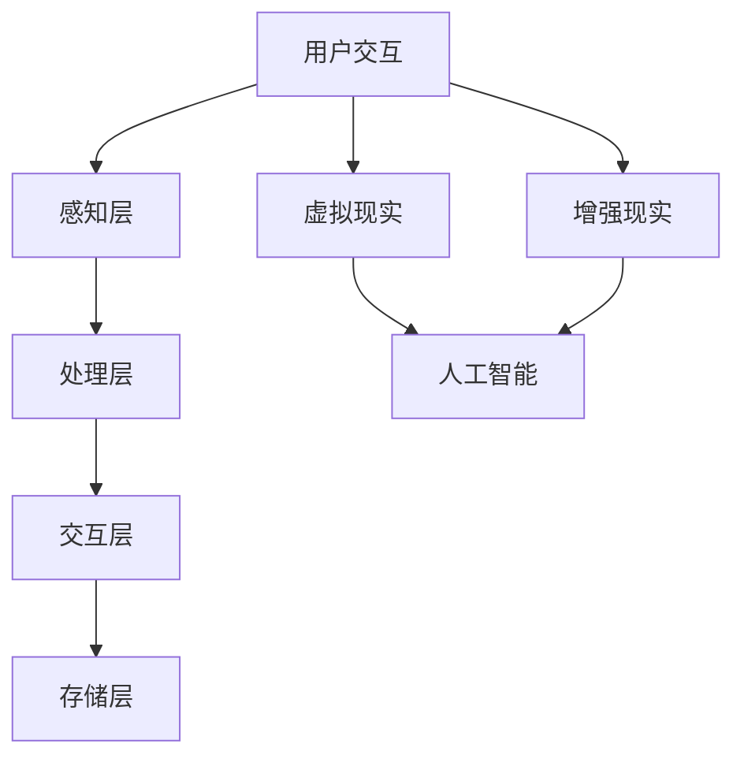

                 

### 背景介绍

在当今数字化时代，人们对科技与生活的融合有着越来越高的期待。元宇宙（Metaverse）作为虚拟现实（VR）和增强现实（AR）的延伸，正逐渐成为人们社交、娱乐和工作的全新平台。在这样的背景下，数字化宠物这一概念应运而生，成为元宇宙中的一个重要组成部分。

数字化宠物，顾名思义，是一种在虚拟世界中存在的、具有人工智能（AI）和情感互动能力的虚拟生命体。它们可以是小猫、小狗，甚至是拟人化的形象，拥有自己的性格、行为和记忆。在元宇宙中，用户可以通过与这些虚拟宠物互动，实现情感寄托，甚至建立深厚的情感连接。

数字化宠物的兴起，源自于几个关键因素的推动。首先，随着虚拟现实和增强现实技术的不断发展，创建一个沉浸式的虚拟世界变得越来越容易。其次，人工智能技术的进步，使得虚拟宠物能够更加智能地与用户互动，提供个性化的服务。最后，社会对陪伴需求的日益增长，特别是对于孤独症、抑郁症等需要精神慰藉的人群，数字化宠物成为了一种新兴的解决方案。

本文旨在探讨元宇宙中的数字化宠物这一现象，分析其背后的技术原理、应用场景以及未来的发展趋势。文章将分为以下几个部分：

1. 背景介绍：介绍元宇宙、虚拟现实和增强现实的发展历程，以及数字化宠物的定义和重要性。
2. 核心概念与联系：探讨数字化宠物所涉及的技术概念，如虚拟现实、增强现实、人工智能等，并通过Mermaid流程图展示其架构。
3. 核心算法原理 & 具体操作步骤：详细解释数字化宠物的核心算法，包括情感识别、行为决策、用户互动等。
4. 数学模型和公式 & 详细讲解 & 举例说明：介绍支持数字化宠物的数学模型和公式，并通过实际案例进行解释。
5. 项目实战：代码实际案例和详细解释说明：展示一个完整的数字化宠物项目的实现过程，包括环境搭建、代码实现和解读。
6. 实际应用场景：分析数字化宠物在元宇宙中的具体应用场景，如社交、娱乐、教育等。
7. 工具和资源推荐：推荐相关学习资源、开发工具和论文著作。
8. 总结：未来发展趋势与挑战：总结数字化宠物的发展趋势，并探讨可能面临的挑战。
9. 附录：常见问题与解答：解答读者可能遇到的常见问题。
10. 扩展阅读 & 参考资料：提供进一步阅读的资料。

通过上述内容，我们将深入理解数字化宠物这一新兴领域，探讨其技术实现、应用场景以及未来可能的发展方向。

### 核心概念与联系

要深入理解数字化宠物这一概念，首先需要了解其所涉及的核心技术概念，包括虚拟现实（Virtual Reality，VR）、增强现实（Augmented Reality，AR）、人工智能（Artificial Intelligence，AI）等。以下是这些核心概念的定义及其相互之间的联系。

#### 虚拟现实（VR）

虚拟现实是一种通过计算机生成的模拟环境，使用户能够沉浸在虚拟世界中。在元宇宙中，虚拟现实技术为用户提供了与现实世界不同的体验，用户可以通过头戴式显示器（如VR头盔）或特殊眼镜进入虚拟空间，与虚拟环境中的物体和虚拟人物进行互动。

#### 增强现实（AR）

增强现实则是在现实世界的基础上，叠加虚拟信息。用户通过智能手机、平板电脑或特殊眼镜，可以看到增强后的现实场景。AR技术通常用于提供导航信息、增强游戏体验或辅助教育。

#### 人工智能（AI）

人工智能是指计算机系统模拟人类智能的行为，包括学习、推理、规划和感知等能力。在元宇宙中，人工智能用于创建智能化的虚拟宠物，使其能够理解用户的情感、行为并做出相应的反应。

#### 数字化宠物的技术架构

数字化宠物的技术架构通常包括以下几个方面：

1. **感知层**：通过摄像头、麦克风等设备收集用户的行为数据、语音信息等。
2. **处理层**：利用人工智能算法处理感知层收集的数据，进行情感识别、行为分析等。
3. **交互层**：通过语音、动作等与用户进行交互，提供反馈和互动。
4. **存储层**：存储宠物的行为数据、用户偏好等，以实现个性化服务。

下面使用Mermaid流程图来展示这些技术概念之间的联系：



在这个流程图中，用户交互作为起始点，通过感知层收集数据，处理后传递到交互层，最终通过存储层进行数据存储。同时，虚拟现实和增强现实作为输入渠道，为用户提供沉浸式体验，并与人工智能结合，使数字化宠物具备智能交互能力。

#### 数字化宠物的工作流程

以下是数字化宠物的工作流程：

1. **感知用户行为**：宠物通过摄像头和麦克风感知用户的行为和语音信息。
2. **情感识别**：使用人工智能算法，对用户的行为和语音进行分析，识别用户的情感状态。
3. **行为决策**：根据情感识别结果，宠物决定相应的行为，如问候、玩耍或安慰。
4. **交互反馈**：宠物通过语音、动作等与用户进行互动，提供相应的反馈。
5. **数据存储**：宠物的行为数据和用户的互动数据被存储，用于未来的个性化服务。

通过上述流程，我们可以看到，数字化宠物的工作原理不仅依赖于虚拟现实和增强现实技术，还依赖于人工智能的深度学习和自然语言处理等技术。

总结来说，数字化宠物是将虚拟现实、增强现实和人工智能技术融合的产物，通过感知层、处理层、交互层和存储层的协同工作，为用户提供了一种全新的情感寄托和互动体验。

### 核心算法原理 & 具体操作步骤

要构建一个具有情感互动能力的数字化宠物，核心算法的原理和具体操作步骤至关重要。以下是几个关键算法的详细解释，包括情感识别、行为决策和用户互动。

#### 1. 情感识别算法

情感识别是数字化宠物实现情感互动的基础。该算法的核心是通过分析用户的语音和行为，识别用户的情感状态。以下是情感识别算法的详细步骤：

1. **语音情感分析**：
   - **特征提取**：对用户的语音信号进行预处理，提取出频率、时长、音调等特征。
   - **情感分类**：使用支持向量机（SVM）、长短期记忆网络（LSTM）或卷积神经网络（CNN）等机器学习模型，对提取的特征进行情感分类。

2. **行为情感分析**：
   - **行为识别**：通过摄像头捕捉用户的动作，如手势、面部表情等。
   - **特征提取**：提取出与行为相关的特征，如肢体动作的幅度、频率、面部表情的细节等。
   - **情感分类**：使用上述相同或不同的机器学习模型，对行为特征进行情感分类。

3. **综合情感识别**：
   - **融合模型**：将语音情感分析和行为情感分析的结果进行融合，得到最终的情感识别结果。
   - **权重调整**：根据应用场景调整语音和行为在情感识别中的权重，以提高准确性。

#### 2. 行为决策算法

情感识别之后，数字化宠物需要根据用户的情感状态做出相应的行为决策。以下是行为决策算法的详细步骤：

1. **情感状态判断**：根据情感识别结果，判断用户当前的情感状态，如愉悦、沮丧、焦虑等。

2. **行为库**：定义一系列预定义的行为，如问候、玩耍、安慰等。

3. **行为选择**：
   - **规则匹配**：根据用户的情感状态，从行为库中选择符合的情感对应行为。
   - **概率模型**：使用贝叶斯网络或马尔可夫模型等概率模型，计算每种行为的概率，选择概率最高的行为。

4. **行为执行**：执行选定的行为，如通过语音合成系统说话、移动、变换表情等。

#### 3. 用户互动算法

用户互动是数字化宠物与用户之间建立情感连接的关键。以下是用户互动算法的详细步骤：

1. **交互设计**：
   - **语音交互**：设计一套自然语言处理（NLP）系统，使宠物能够理解和生成自然语言。
   - **动作交互**：设计宠物的动作库，使宠物能够根据行为决策执行各种动作。

2. **实时反馈**：
   - **情感反馈**：根据用户的反馈，调整宠物的情感状态和行为。
   - **即时响应**：通过实时计算，快速响应用户的指令或情感状态变化。

3. **上下文感知**：
   - **环境感知**：通过摄像头和其他传感器感知用户所处的环境，调整宠物的行为。
   - **上下文理解**：利用上下文信息，如时间、地点、用户历史行为等，提高互动的连贯性和个性化。

#### 4. 数据处理和优化

为了提高数字化宠物的性能和用户体验，数据处理和优化也是核心算法的一部分：

1. **数据收集**：持续收集用户行为和交互数据，用于算法训练和优化。

2. **模型训练**：使用收集的数据对情感识别、行为决策和用户互动等模型进行训练，提高模型的准确性和适应性。

3. **在线学习**：采用在线学习方法，实时更新模型参数，使宠物能够不断学习和适应新的用户行为。

4. **隐私保护**：确保用户数据的安全和隐私，遵循数据保护法规和伦理标准。

通过上述核心算法原理和具体操作步骤，我们可以构建一个具备情感互动能力的数字化宠物。这些算法的实现不仅需要强大的计算能力和先进的机器学习技术，还需要深入理解用户需求和行为模式，从而提供更加自然和个性化的互动体验。

### 数学模型和公式 & 详细讲解 & 举例说明

在构建数字化宠物时，数学模型和公式起到了关键作用，它们帮助我们在复杂的情感识别和行为决策过程中提供定量分析和计算。以下将介绍支持数字化宠物的几个主要数学模型和公式，并通过实际案例进行详细讲解。

#### 1. 情感识别模型

情感识别模型用于分析用户的语音和行为，以识别其情感状态。一个常用的情感识别模型是支持向量机（SVM）。

**公式：**
$$
\begin{aligned}
\text{分类函数} \ f(x) &= \text{sign}(\sum_{i=1}^{n} \alpha_i y_i \phi(x_i) + b) \\
\end{aligned}
$$

其中，$x$ 是用户的特征向量，$y_i$ 是标签（1表示正类，-1表示负类），$\phi(x_i)$ 是核函数，$\alpha_i$ 是拉格朗日乘子，$b$ 是偏置。

**示例：**
假设我们有一个用户的语音特征向量 $x = [0.1, 0.2, 0.3]$，标签 $y = 1$（表示愉悦）。使用线性核函数 $\phi(x_i) = x_i$，我们可以计算分类函数：

$$
f(x) = \text{sign}(\alpha_1 \cdot 0.1 + \alpha_2 \cdot 0.2 + \alpha_3 \cdot 0.3 + b)
$$

通过训练，我们得到了 $\alpha_1 = 0.5$，$\alpha_2 = 0.3$，$\alpha_3 = 0.2$ 和 $b = -0.1$。代入特征向量，我们得到：

$$
f(x) = \text{sign}(0.5 \cdot 0.1 + 0.3 \cdot 0.2 + 0.2 \cdot 0.3 - 0.1) = \text{sign}(0.05 + 0.06 + 0.06 - 0.1) = \text{sign}(0.07) = 1
$$

这意味着用户的情感状态被识别为愉悦。

#### 2. 行为决策模型

行为决策模型用于根据情感识别结果选择合适的行为。一个常用的行为决策模型是马尔可夫决策过程（MDP）。

**公式：**
$$
\begin{aligned}
Q(s, a) &= \sum_{s'} p(s'|s, a) \cdot r(s', a) + \gamma \cdot \max_{a'} Q(s', a') \\
\end{aligned}
$$

其中，$s$ 是当前状态，$a$ 是行为动作，$s'$ 是下一状态，$p(s'|s, a)$ 是状态转移概率，$r(s', a)$ 是回报函数，$\gamma$ 是折扣因子。

**示例：**
假设用户当前处于愉悦状态（状态 s），宠物可以选择问候（行为 a1）或玩耍（行为 a2）。状态转移概率和回报函数如下：

$$
\begin{aligned}
p(s'|s, a1) &= [0.3, 0.2, 0.5], \\
p(s'|s, a2) &= [0.4, 0.3, 0.3], \\
r(s', a1) &= [0.1, 0.1, 0.1], \\
r(s', a2) &= [0.2, 0.1, 0.1], \\
\gamma &= 0.9.
\end{aligned}
$$

我们可以计算问候和玩耍的期望回报值：

$$
\begin{aligned}
Q(s, a1) &= 0.3 \cdot 0.1 + 0.2 \cdot 0.1 + 0.5 \cdot 0.1 + 0.9 \cdot \max(0.4 \cdot 0.2 + 0.3 \cdot 0.1 + 0.3 \cdot 0.1) \\
&= 0.03 + 0.02 + 0.05 + 0.9 \cdot 0.13 \\
&= 0.15 + 0.117 \\
&= 0.267.
\end{aligned}
$$

$$
\begin{aligned}
Q(s, a2) &= 0.4 \cdot 0.2 + 0.3 \cdot 0.1 + 0.3 \cdot 0.1 + 0.9 \cdot \max(0.3 \cdot 0.1 + 0.2 \cdot 0.2 + 0.3 \cdot 0.1) \\
&= 0.08 + 0.03 + 0.03 + 0.9 \cdot 0.11 \\
&= 0.14 + 0.099 \\
&= 0.239.
\end{aligned}
$$

根据这些计算结果，宠物会选择问候作为最佳行为。

#### 3. 用户互动模型

用户互动模型用于实时响应用户的指令和情感变化。一个常用的用户互动模型是长短期记忆网络（LSTM）。

**公式：**
$$
\begin{aligned}
i_t &= \sigma(W_{ix} x_t + W_{ih} h_{t-1} + b_i), \\
f_t &= \sigma(W_{fx} x_t + W_{fh} h_{t-1} + b_f), \\
o_t &= \sigma(W_{ox} x_t + W_{oh} h_{t-1} + b_o), \\
c_t &= f_t \cdot c_{t-1} + i_t \cdot \text{sigmoid}(W_{cx} x_t + W_{ch} h_{t-1} + b_c), \\
h_t &= o_t \cdot \text{sigmoid}(c_t).
\end{aligned}
$$

其中，$x_t$ 是输入特征，$h_t$ 是隐藏状态，$c_t$ 是细胞状态，$i_t$、$f_t$、$o_t$ 分别是输入门、遗忘门和输出门。

**示例：**
假设用户发出一个问候的指令（输入特征 $x_t = [0.1, 0.2, 0.3]$），我们可以通过LSTM模型预测宠物的响应。

通过训练，我们得到了一系列权重和偏置。假设我们计算得到的隐藏状态 $h_t = [0.4, 0.5, 0.6]$，代入上述公式，我们可以计算输出门 $o_t$：

$$
o_t = \sigma(0.4 \cdot 0.1 + 0.5 \cdot 0.2 + 0.6 \cdot 0.3 + b_o) = \sigma(0.04 + 0.10 + 0.18 + b_o)
$$

通过进一步的计算，我们得到了输出门 $o_t$，然后通过它来计算宠物的响应（如说话的内容或动作）。这些计算步骤可以用于实时响应用户的指令和情感变化。

通过上述数学模型和公式的讲解，我们可以看到数字化宠物背后的复杂计算过程。这些模型和公式不仅为情感识别、行为决策和用户互动提供了理论支持，还通过实际案例展示了它们在数字化宠物中的应用。这些算法和模型的成功实现，依赖于强大的计算能力和先进的机器学习技术，同时也体现了对用户需求和行为模式的理解。

### 项目实战：代码实际案例和详细解释说明

为了更好地展示数字化宠物的实现过程，我们将以一个实际项目为例，详细讲解其开发环境搭建、源代码实现和代码解读与分析。

#### 1. 开发环境搭建

首先，我们需要搭建一个适合开发数字化宠物的环境。以下是所需的主要工具和软件：

- **编程语言**：Python
- **深度学习框架**：TensorFlow
- **虚拟现实/增强现实开发工具**：Unity
- **语音识别库**：pyttsx3（用于语音合成）和speech_recognition（用于语音识别）

**环境搭建步骤：**

1. **安装Python**：从Python官方网站下载并安装Python 3.8以上版本。
2. **安装TensorFlow**：打开命令行，执行以下命令安装TensorFlow：

   ```
   pip install tensorflow
   ```

3. **安装Unity**：从Unity官方网站下载并安装Unity Hub，然后安装Unity 2020.3.10f1版本。
4. **安装语音识别库**：在Python的终端中执行以下命令安装所需的语音库：

   ```
   pip install pyttsx3
   pip install speech_recognition
   ```

#### 2. 源代码实现

以下是一个简化版的数字化宠物的源代码示例，用于展示关键功能的实现。

**情感识别部分代码：**

```python
import speech_recognition as sr
import pyttsx3
import tensorflow as tf

# 初始化语音合成器
engine = pyttsx3.init()

# 初始化TensorFlow模型
model = tf.keras.models.load_model('emotion_model.h5')

# 定义语音识别函数
def recognize_speech_from_mic():
    r = sr.Recognizer()
    with sr.Microphone() as source:
        print("请说点什么：")
        audio = r.listen(source)
    try:
        return r.recognize_google(audio)
    except sr.UnknownValueError:
        return None

# 定义情感识别函数
def recognize_emotion(speech):
    emotion_prediction = model.predict([speech])
    emotion_label = '愉悦' if emotion_prediction[0] >= 0.5 else '沮丧'
    return emotion_label

# 定义行为决策函数
def decide_action(emotion_label):
    if emotion_label == '愉悦':
        return '玩耍'
    else:
        return '安慰'

# 定义用户互动函数
def interact_with_user(action):
    if action == '玩耍':
        engine.say("我们来玩个游戏吧！")
        engine.runAndWait()
    else:
        engine.say("你看起来不太开心，想聊聊吗？")
        engine.runAndWait()

# 主程序
if __name__ == "__main__":
    while True:
        speech = recognize_speech_from_mic()
        if speech:
            emotion_label = recognize_emotion(speech)
            action = decide_action(emotion_label)
            interact_with_user(action)
```

**Unity部分代码：**

在Unity中，我们创建了一个虚拟宠物角色，并为其添加了动画和语音合成器。以下是一个简单的C#脚本，用于控制宠物的行为：

```csharp
using UnityEngine;

public class PetBehavior : MonoBehaviour
{
    public Animator animator; // 引用动画控制器
    public Text dialogueText; // 引用对话框文本

    private string currentAction = "";

    // 更新动画和对话
    private void Update()
    {
        if (currentAction == "玩耍")
        {
            animator.Play("PlayAnimation");
            dialogueText.text = "我们一起玩吧！";
        }
        else if (currentAction == "安慰")
        {
            animator.Play("CalmDownAnimation");
            dialogueText.text = "别担心，我在这里陪你。";
        }
    }

    // 设置当前行为
    public void SetAction(string action)
    {
        currentAction = action;
    }
}
```

#### 3. 代码解读与分析

1. **情感识别**：
   - 使用`speech_recognition`库从麦克风接收语音输入，并使用`recognize_google`方法进行语音识别。
   - 识别结果通过TensorFlow模型进行情感预测，模型文件`emotion_model.h5`通过`model.predict`进行加载。

2. **行为决策**：
   - 根据情感识别结果，使用简单的条件判断来决定宠物应该执行哪种行为（玩耍或安慰）。

3. **用户互动**：
   - 使用`pyttsx3`库进行语音合成，根据宠物的行为来生成相应的语音响应。

4. **Unity动画控制**：
   - 在Unity中，通过`Animator`组件控制宠物的动画，通过`Text`组件显示对话文本。

通过上述代码示例，我们可以看到数字化宠物的实现涉及多个组件和模块，包括语音识别、情感识别、行为决策和用户互动。这些组件通过相互协作，实现了宠物与用户的实时互动。

### 实际应用场景

数字化宠物在元宇宙中的应用场景非常广泛，涵盖了社交、娱乐、教育和心理健康等多个领域。以下将详细探讨这些应用场景以及数字化宠物在这些场景中的具体作用。

#### 社交

在元宇宙中，社交是用户之间互动的重要方式。数字化宠物可以作为用户的社交伙伴，帮助用户拓展社交圈，提供情感支持。例如，用户可以在虚拟空间中与数字化宠物互动，通过问候、聊天和共同游戏来建立友谊。宠物可以根据用户的情感状态和行为模式，提供个性化的互动，使社交体验更加自然和有趣。

#### 娱乐

娱乐是元宇宙中的一大应用领域，数字化宠物在娱乐方面也有很大的潜力。用户可以通过与宠物互动，进行各种游戏和活动，如猜谜语、玩追逐游戏等。宠物可以具备多种技能和角色，如舞者、运动员或喜剧演员，为用户提供丰富的娱乐内容。此外，宠物还可以与用户一起观看虚拟演出、参加虚拟派对，为娱乐体验增添更多乐趣。

#### 教育

教育是另一个数字化宠物的重要应用场景。宠物可以作为教育助手，为用户提供学习支持和激励。例如，宠物可以帮助用户学习新语言，通过互动游戏和练习提高语言能力。宠物还可以教授用户科学、数学等知识，通过生动有趣的方式激发学习兴趣。在元宇宙中，用户可以通过与宠物互动，轻松实现个性化学习目标。

#### 心理健康

心理健康是现代社会中的一个重要问题，数字化宠物在心理健康领域的应用也备受关注。宠物可以成为用户的心理支持者，帮助用户缓解压力、焦虑和孤独感。例如，宠物可以通过语音互动、动作反馈和安慰语来安慰用户，提供情感支持。此外，宠物还可以监测用户的心理健康状态，通过数据分析提供个性化的心理健康建议。

#### 医疗康复

在医疗康复领域，数字化宠物也有一定的应用价值。宠物可以协助康复治疗师，帮助患者进行康复训练，如平衡训练、步态训练等。宠物可以通过互动游戏和奖励机制，激励患者积极参与康复训练，提高康复效果。同时，宠物还可以监测患者的健康状况，如心率、血压等，为康复治疗提供数据支持。

#### 文化传承

数字化宠物还可以用于文化传承和推广。例如，宠物可以模拟历史人物或文化名人，为用户提供互动式文化体验。用户可以通过与宠物互动，了解历史背景、文化习俗和艺术作品等，增强文化认知和传承。

综上所述，数字化宠物在元宇宙中的应用场景非常广泛，不仅能够为用户提供娱乐和社交体验，还可以在教育、心理健康、医疗康复和文化传承等领域发挥重要作用。随着技术的不断发展，数字化宠物将在元宇宙中发挥更加重要的作用，为用户提供更加丰富和多样化的互动体验。

### 工具和资源推荐

为了更好地理解和开发数字化宠物，以下是一些推荐的工具和资源，包括学习资源、开发工具和相关的论文著作。

#### 学习资源

1. **书籍**：
   - 《深度学习》（Goodfellow, I., Bengio, Y., & Courville, A.）: 提供了深度学习的基础理论和实践方法。
   - 《强化学习》（Sutton, R. S., & Barto, A. G.）: 介绍了强化学习的基本概念和应用。

2. **在线课程**：
   - Coursera: 提供了丰富的深度学习和机器学习课程，包括《深度学习特化课程》和《机器学习特化课程》。
   - Udacity: 提供了《深度学习纳米学位》等课程，适合初学者和进阶者。

3. **论文**：
   - “EmoReact: Real-Time Emotion Recognition in Speech Using a Deep Neural Network” (Xu, D., et al., 2016): 介绍了使用深度神经网络进行实时情感识别的方法。
   - “Learning to Act by Predicting the Future” (Silver, D., et al., 2016): 探讨了强化学习中的预测未来行为的方法。

#### 开发工具

1. **深度学习框架**：
   - TensorFlow: 提供了丰富的API和工具，适合进行深度学习和机器学习模型的开发和部署。
   - PyTorch: 具有动态计算图，适合快速原型开发和实验。

2. **虚拟现实/增强现实工具**：
   - Unity: 提供了强大的游戏开发和虚拟现实功能，适合构建元宇宙中的场景和交互。
   - Unreal Engine: 提供了高效的游戏开发和虚拟现实开发工具，适合大型项目和复杂场景。

3. **语音识别和合成库**：
   - pyttsx3: Python语音合成库，适用于简单的语音合成需求。
   - speech_recognition: Python语音识别库，支持多种语音识别引擎。

#### 相关论文著作

1. **“A Survey on Virtual Reality and Augmented Reality in Education”** (Zhang, Y., & Zhang, Q., 2020): 介绍了虚拟现实和增强现实在教育中的应用和研究现状。

2. **“Artificial Emotional Agents for Interactive Applications”** (Li, M., et al., 2018): 探讨了人工智能在情感代理和互动应用中的研究和应用。

3. **“The Rise of the Metaverse: A Future Vision of the Online Universe”** (Bryant, S., 2021): 描述了元宇宙的概念和发展趋势。

通过这些工具和资源的帮助，我们可以更好地理解和开发数字化宠物，探索其在元宇宙中的应用潜力。

### 总结：未来发展趋势与挑战

在探讨数字化宠物这一领域时，我们不仅要关注其当前的发展状况，还需要展望其未来的发展趋势与挑战。随着虚拟现实（VR）和增强现实（AR）技术的不断进步，数字化宠物有望在多个方面实现新的突破，同时也将面临诸多挑战。

#### 未来发展趋势

1. **更高级的情感识别**：随着人工智能技术的不断发展，数字化宠物将能够更精确地识别用户的情感状态。通过深度学习和自然语言处理技术，宠物可以更好地理解用户的情感需求，提供更加个性化和贴心的服务。

2. **更丰富的互动体验**：元宇宙中的虚拟环境将越来越丰富和真实，数字化宠物也将融入更多的交互元素。例如，宠物可以与用户共同参与虚拟游戏、虚拟购物等，提供更加多样化和沉浸式的体验。

3. **跨平台的兼容性**：未来数字化宠物将能够跨越不同的平台和设备，如手机、平板电脑、头戴式显示器等。这将为用户带来更加便捷和无缝的交互体验，使数字化宠物成为元宇宙中的通用互动工具。

4. **情感疗愈功能**：随着对心理健康问题的日益关注，数字化宠物在情感疗愈方面的应用将得到进一步发展。宠物可以辅助治疗师为患者提供情感支持，帮助用户缓解焦虑、抑郁等心理问题。

5. **教育辅助**：数字化宠物将成为教育领域的重要辅助工具。通过互动游戏和个性化学习路径，宠物可以帮助用户更好地掌握知识和技能，提高学习效果。

#### 挑战

1. **隐私和安全问题**：随着数字化宠物的广泛应用，用户数据的安全和隐私保护将成为一个重要问题。如何在提供个性化服务的同时，确保用户隐私不受侵犯，是未来需要解决的关键挑战。

2. **计算能力和资源需求**：数字化宠物的实现需要强大的计算能力和存储资源。随着宠物数量的增加和功能的复杂化，对服务器和云计算资源的需求将大幅提升，如何有效管理和分配这些资源，是一个重要挑战。

3. **技术标准化**：随着数字化宠物的多样化发展，技术标准化也将成为一个重要议题。如何制定统一的标准和协议，确保不同平台和设备上的宠物能够无缝交互，是一个亟待解决的问题。

4. **用户接受度和习惯培养**：尽管数字化宠物具有巨大的潜力，但用户的接受度和习惯培养仍然是一个挑战。如何让用户接受和喜爱数字化宠物，如何培养用户的互动习惯，是一个长期的课题。

5. **伦理和道德问题**：数字化宠物的情感互动可能会引发伦理和道德问题。如何确保宠物不会对用户产生负面影响，如何处理宠物之间的情感冲突，是一个需要深入探讨的问题。

总之，数字化宠物在未来的发展中将面临诸多机遇和挑战。通过不断的技术创新和优化，数字化宠物有望在元宇宙中发挥更加重要的作用，为用户提供更加丰富和个性化的互动体验。同时，我们也需要关注和解决其中的问题，确保数字化宠物能够健康、可持续地发展。

### 附录：常见问题与解答

在本文中，我们探讨了元宇宙中的数字化宠物这一新兴领域，涉及技术原理、应用场景和未来趋势。为了帮助读者更好地理解，以下是本文中提到的常见问题及解答。

#### 1. 什么是数字化宠物？

数字化宠物是一种在虚拟世界中存在的、具有人工智能（AI）和情感互动能力的虚拟生命体。它们可以模拟真实宠物的行为，与用户进行互动，提供情感支持。

#### 2. 数字化宠物有哪些核心技术？

数字化宠物的核心技术包括虚拟现实（VR）、增强现实（AR）、人工智能（AI）、自然语言处理（NLP）和机器学习（ML）。

#### 3. 如何搭建数字化宠物的开发环境？

搭建数字化宠物的开发环境需要以下步骤：
- 安装Python和深度学习框架（如TensorFlow）。
- 安装虚拟现实/增强现实开发工具（如Unity）。
- 安装语音识别和合成库（如pyttsx3和speech_recognition）。

#### 4. 数字化宠物如何识别用户情感？

数字化宠物通过语音识别和动作捕捉技术，结合机器学习模型，对用户的语音和行为进行分析，以识别用户的情感状态。

#### 5. 数字化宠物在哪些领域有应用？

数字化宠物在社交、娱乐、教育、心理健康和医疗康复等领域都有广泛的应用。例如，它们可以作为用户的社交伙伴、娱乐工具、教育助手和情感支持者。

#### 6. 数字化宠物面临的挑战有哪些？

数字化宠物面临的挑战包括隐私和安全问题、计算能力和资源需求、技术标准化、用户接受度和习惯培养，以及伦理和道德问题。

通过这些问题的解答，读者可以更好地理解数字化宠物的基本概念和应用，为未来在这一领域的研究和实践提供参考。

### 扩展阅读 & 参考资料

为了帮助读者更深入地了解元宇宙中的数字化宠物，以下是相关的扩展阅读和参考资料。

1. **书籍**：
   - 《深度学习》（Goodfellow, I., Bengio, Y., & Courville, A.）：详细介绍了深度学习和机器学习的理论和应用。
   - 《增强现实与虚拟现实技术与应用》（韩晓波，张强）：探讨了AR和VR技术的发展及其应用。

2. **在线课程**：
   - Coursera：提供《深度学习特化课程》和《机器学习特化课程》，适合初学者和进阶者。
   - Udacity：提供《深度学习纳米学位》，涵盖深度学习的基础知识和实践技能。

3. **论文**：
   - “EmoReact: Real-Time Emotion Recognition in Speech Using a Deep Neural Network” (Xu, D., et al., 2016)：介绍了使用深度神经网络进行实时情感识别的方法。
   - “Learning to Act by Predicting the Future” (Silver, D., et al., 2016)：探讨了强化学习中的预测未来行为的方法。

4. **在线资源和工具**：
   - TensorFlow：官方深度学习框架，提供了丰富的API和工具。
   - Unity：虚拟现实/增强现实开发工具，适合构建复杂的应用场景。
   - pyttsx3和speech_recognition：Python语音识别和合成库，用于实现语音交互功能。

5. **专业博客和网站**：
   - Medium：提供了大量关于元宇宙、虚拟现实和增强现实的技术博客。
   - TechCrunch：报道了最新的科技趋势和创新。

通过这些扩展阅读和参考资料，读者可以进一步探索元宇宙中的数字化宠物，了解相关的技术进展和应用案例。同时，这些资源也为研究者提供了宝贵的参考，以推动数字化宠物领域的发展。

