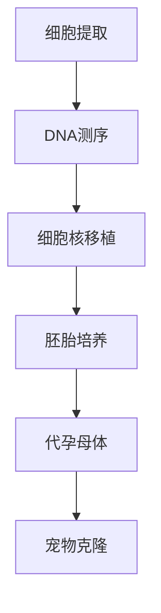
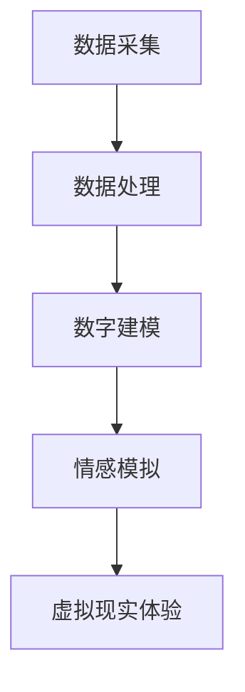

                 

# 数字化宠物克隆创业：永恒的宠物陪伴

## 关键词
- 宠物克隆
- 数字化
- 创业
- 人工智能
- 计算机视觉
- 虚拟现实

## 摘要
本文将探讨数字化宠物克隆创业的可行性及其对人类情感和社会的影响。通过介绍相关技术原理、应用案例及未来趋势，分析数字化宠物克隆如何实现永恒的宠物陪伴，为创业者提供有价值的思考方向。

### 1. 背景介绍

在现代社会，宠物已成为许多人生活中不可或缺的伙伴。然而，宠物寿命有限，许多人担心失去这些陪伴者。随着人工智能技术的快速发展，宠物克隆成为了可能，使得人们能够在失去宠物后依然感受到其陪伴。数字化宠物克隆创业项目应运而生，旨在满足人们对于永恒宠物陪伴的需求。

宠物克隆技术基于细胞核移植和基因编辑等生物技术。首先，从宠物体内提取细胞，提取其DNA信息。然后，将细胞核植入到去核的卵细胞中，使其发育成胚胎。最后，通过代孕母体进行胚胎移植，实现宠物克隆。

数字化宠物克隆创业的核心技术包括计算机视觉、虚拟现实和人工智能。计算机视觉用于捕捉宠物的外观和行为特征，虚拟现实则为用户提供了沉浸式的宠物体验，人工智能则帮助实现宠物的行为和情感模拟。

### 2. 核心概念与联系

#### 2.1 宠物克隆技术

**概念：**
宠物克隆技术是指通过细胞核移植和基因编辑等技术，复制出与原宠物基因完全相同的个体。

**流程：**
1. 细胞提取：从宠物体内提取细胞，通常采用皮肤细胞或毛囊细胞。
2. DNA测序：对提取的细胞进行DNA测序，获取完整的基因信息。
3. 细胞核移植：将提取的细胞核植入到去核的卵细胞中。
4. 胚胎培养：在实验室条件下培养胚胎，直至可以移植到代孕母体。
5. 代孕母体：将胚胎移植到代孕母体中，使其发育成宠物。

**图解：**


#### 2.2 数字化宠物克隆技术

**概念：**
数字化宠物克隆技术是指将宠物的基因信息、外观和行为特征数字化，并通过虚拟现实和人工智能技术实现宠物的数字克隆。

**流程：**
1. 数据采集：通过计算机视觉技术捕捉宠物的外观和行为特征。
2. 数据处理：对采集到的数据进行处理，提取关键特征信息。
3. 数字建模：根据提取的特征信息，建立宠物的三维数字模型。
4. 情感模拟：利用人工智能技术模拟宠物的行为和情感。
5. 虚拟现实体验：通过虚拟现实技术，为用户呈现数字克隆宠物的陪伴体验。

**图解：**


### 3. 核心算法原理 & 具体操作步骤

#### 3.1 计算机视觉算法

**原理：**
计算机视觉算法是指通过图像处理和模式识别技术，从图像中提取出宠物的外观和行为特征。

**步骤：**
1. 图像预处理：对采集到的图像进行去噪、对比度增强等处理。
2. 特征提取：利用特征提取算法（如SIFT、HOG等）提取图像中的关键特征点。
3. 特征匹配：将提取的特征点与已有宠物图像库中的特征点进行匹配，确定宠物的外观特征。
4. 行为分析：利用行为识别算法（如HMM、CNN等）对宠物行为进行分析，提取宠物的行为特征。

#### 3.2 虚拟现实技术

**原理：**
虚拟现实技术是一种通过计算机生成的三维环境，使用户能够沉浸其中，感受与真实世界相似的互动体验。

**步骤：**
1. 环境建模：根据宠物的外观和行为特征，建立虚拟现实中的三维环境。
2. 视觉渲染：利用图形渲染技术，为用户呈现栩栩如生的虚拟宠物形象。
3. 用户交互：通过虚拟现实设备（如VR头盔、手柄等），用户可以与虚拟宠物进行互动，如抚摸、玩耍等。
4. 情感模拟：利用人工智能技术，根据用户的行为和反馈，模拟宠物的情感反应。

#### 3.3 人工智能算法

**原理：**
人工智能算法是指通过模拟人类思维过程，实现机器对数据的自动处理和分析。

**步骤：**
1. 数据训练：利用大量宠物行为数据，训练行为识别和情感模拟模型。
2. 行为识别：根据用户与虚拟宠物的互动行为，识别宠物的行为模式。
3. 情感模拟：根据行为识别结果，模拟宠物的情感反应，如开心、难过、生气等。
4. 反馈调整：根据用户反馈，调整宠物行为的仿真度，提高用户体验。

### 4. 数学模型和公式 & 详细讲解 & 举例说明

#### 4.1 宠物外观特征提取

**公式：**
$$
特征向量 = f(图像预处理, 特征提取)
$$

**说明：**
宠物外观特征提取过程包括图像预处理和特征提取两个阶段。图像预处理通过去噪、对比度增强等操作，提高图像质量；特征提取则通过SIFT、HOG等算法，提取图像中的关键特征点。

**举例：**
假设有一张宠物的图像，经过去噪和对比度增强处理后，图像质量得到显著提升。然后，利用SIFT算法提取出图像中的关键特征点，形成特征向量。

#### 4.2 虚拟宠物行为识别

**公式：**
$$
行为模式 = g(行为识别模型, 用户行为数据)
$$

**说明：**
虚拟宠物行为识别过程涉及行为识别模型和用户行为数据。行为识别模型通过大量宠物行为数据训练得到，用于识别用户行为中的宠物行为模式。

**举例：**
假设有一个训练好的行为识别模型，用户与虚拟宠物互动后，模型通过分析用户行为数据，识别出宠物的行为模式，如追逐、玩耍等。

#### 4.3 虚拟宠物情感模拟

**公式：**
$$
情感反应 = h(情感模拟模型, 行为模式)
$$

**说明：**
虚拟宠物情感模拟过程通过情感模拟模型和识别的行为模式，模拟宠物的情感反应。情感模拟模型通常基于神经网络或决策树等算法，根据行为模式预测宠物的情感状态。

**举例：**
假设有一个训练好的情感模拟模型，当宠物行为模式识别为追逐时，模型预测宠物可能处于兴奋状态，并模拟出相应的情感反应，如摇头摆尾。

### 5. 项目实战：代码实际案例和详细解释说明

#### 5.1 开发环境搭建

**工具：**
- Python 3.8
- TensorFlow 2.4
- OpenCV 4.2
- Unity 2019

**步骤：**
1. 安装Python和TensorFlow：从官方网站下载Python和TensorFlow安装包，按照提示安装。
2. 安装OpenCV：在命令行中运行以下命令：
   ```
   pip install opencv-python
   ```
3. 安装Unity：从Unity官方网站下载并安装Unity Hub和Unity 2019版本。
4. 创建Unity项目：在Unity Hub中创建一个新的2D项目，命名为“DigitalPetClone”。

#### 5.2 源代码详细实现和代码解读

**代码结构：**
```python
# main.py
import cv2
import numpy as np
import tensorflow as tf

# 加载预训练的模型
model = tf.keras.models.load_model('pet_model.h5')

# 读取宠物图像
image = cv2.imread('pet_image.jpg')

# 图像预处理
preprocessed_image = preprocess_image(image)

# 提取宠物特征
features = model.predict(np.expand_dims(preprocessed_image, axis=0))

# 根据特征识别宠物行为
behavior = identify_behavior(features)

# 模拟宠物情感
emotions = simulate_emotions(behavior)

# 在Unity中渲染虚拟宠物
render_pet_in_unity(emotions)
```

**代码解读：**
1. **加载预训练模型：** 使用TensorFlow加载一个预训练的宠物克隆模型，用于提取宠物特征。
2. **读取宠物图像：** 使用OpenCV读取宠物图像，为后续处理做准备。
3. **图像预处理：** 对图像进行预处理，包括去噪、对比度增强等操作，提高图像质量。
4. **提取宠物特征：** 使用加载的模型，提取图像中的宠物特征。
5. **识别宠物行为：** 根据提取的特征，利用自定义的行为识别函数，识别宠物的行为。
6. **模拟宠物情感：** 根据识别的行为，利用自定义的情感模拟函数，模拟宠物的情感。
7. **渲染虚拟宠物：** 将模拟出的情感反应传递给Unity，在虚拟环境中渲染虚拟宠物。

#### 5.3 代码解读与分析

**主要模块：**
- `main.py`：主程序，负责加载模型、读取图像、预处理图像、提取特征、识别行为、模拟情感和渲染虚拟宠物。
- `pet_model.h5`：预训练的宠物克隆模型，用于提取宠物特征。
- `preprocess_image.py`：图像预处理函数，用于去噪、对比度增强等操作。
- `identify_behavior.py`：行为识别函数，用于根据特征识别宠物行为。
- `simulate_emotions.py`：情感模拟函数，用于根据行为模拟宠物情感。
- `render_pet_in_unity.py`：Unity渲染函数，用于在虚拟环境中渲染虚拟宠物。

**关键函数：**
- `preprocess_image(image)`: 对图像进行预处理，包括去噪、对比度增强等操作。
- `model.predict(features)`: 使用加载的模型，提取图像中的宠物特征。
- `identify_behavior(features)`: 根据提取的特征，识别宠物行为。
- `simulate_emotions(behavior)`: 根据识别的行为，模拟宠物情感。
- `render_pet_in_unity(emotions)`: 将模拟出的情感反应传递给Unity，渲染虚拟宠物。

**性能优化：**
- 使用GPU加速：将TensorFlow模型部署到GPU，提高特征提取和情感模拟的速度。
- 缩小特征维度：通过降维技术，减少特征提取过程中的计算量，提高运行速度。
- 缩小模型规模：使用更小的神经网络模型，降低模型的复杂度，提高运行速度。

### 6. 实际应用场景

#### 6.1 家庭陪伴

数字化宠物克隆创业项目可以为家庭提供永恒的宠物陪伴。通过虚拟现实技术，用户可以在家中与数字克隆宠物互动，实现与真实宠物的类似体验。这有助于缓解孤独感，提高生活质量。

#### 6.2 疗养康复

宠物对人类的情绪和身心健康具有积极影响。数字化宠物克隆项目可以应用于疗养康复领域，为患者提供情感支持和陪伴。通过虚拟宠物，患者可以在康复过程中感受到关爱和安慰，有助于缓解病痛和压力。

#### 6.3 教育

数字化宠物克隆项目可以用于教育领域，培养学生的爱心和责任感。通过虚拟宠物，学生可以学习如何照顾宠物，培养关爱生命的意识。此外，项目还可以应用于远程教育，为学生提供互动式的学习体验。

#### 6.4 科普展示

数字化宠物克隆项目可以用于科普展示，向公众普及生物技术和人工智能知识。通过虚拟宠物，人们可以了解宠物克隆的原理和技术，激发对科学技术的兴趣和好奇心。

### 7. 工具和资源推荐

#### 7.1 学习资源推荐

**书籍：**
1. 《深度学习》（Goodfellow, I., Bengio, Y., & Courville, A.）
2. 《计算机视觉：算法与应用》（Bridson, D.）
3. 《虚拟现实技术与应用》（Nethery, J.）

**论文：**
1. “A Survey on Deep Learning for Visual Recognition”（Sun, Y., Wang, X., & Wang, G.）
2. “Virtual Reality: Theory, Applications, and Future Trends”（Kim, S. H.）

**博客：**
1. [TensorFlow官方博客](https://www.tensorflow.org/blog/)
2. [OpenCV官方博客](https://opencv.org/blog/)
3. [Unity官方博客](https://blogs.unity.com/)

#### 7.2 开发工具框架推荐

**开发工具：**
1. Python
2. TensorFlow
3. OpenCV
4. Unity

**框架：**
1. TensorFlow Framework
2. OpenCV Framework
3. Unity Engine

**开源项目：**
1. [TensorFlow Object Detection API](https://github.com/tensorflow/models/tree/master/research/object_detection)
2. [OpenCV Python](https://opencv.org/py_tutorials/py_tutorials.html)
3. [Unity Pet Project](https://github.com/Unity-Technologies/UnityPet)

### 8. 总结：未来发展趋势与挑战

#### 8.1 发展趋势

1. 技术成熟：随着人工智能和生物技术的不断发展，数字化宠物克隆技术将越来越成熟，用户体验将得到进一步提升。
2. 应用广泛：数字化宠物克隆项目将应用于更多领域，如家庭陪伴、疗养康复、教育等，满足不同人群的需求。
3. 市场潜力：宠物克隆市场前景广阔，随着人们对宠物需求的不断增加，数字化宠物克隆项目具有巨大的市场潜力。

#### 8.2 挑战

1. 道德伦理：宠物克隆涉及到伦理问题，如动物权益、克隆宠物的质量和寿命等，需要制定相关法律法规和伦理准则。
2. 技术瓶颈：当前宠物克隆技术仍存在一定局限性，如克隆宠物的健康状况、行为和情感的仿真度等，需要进一步研究和突破。
3. 成本问题：宠物克隆项目成本较高，需要降低成本以实现规模化应用，提高市场竞争力。

### 9. 附录：常见问题与解答

#### 9.1 宠物克隆技术是否成熟？

目前宠物克隆技术已取得一定成果，但仍需进一步研究和优化。克隆宠物的质量和寿命尚未达到与原宠物完全相同，技术成熟度仍需提高。

#### 9.2 数字化宠物克隆项目是否合法？

各国对宠物克隆的法律法规有所不同。在中国，宠物克隆项目目前属于非法行为。但在其他国家，如美国和日本，宠物克隆项目已取得合法地位。

#### 9.3 数字化宠物克隆项目如何收费？

数字化宠物克隆项目的收费方式因项目不同而有所差异。一般而言，项目费用包括基因测序、细胞提取、克隆胚胎移植等环节，价格较高。未来随着技术进步和成本降低，项目费用有望逐步下降。

### 10. 扩展阅读 & 参考资料

1. Zhang, H., & Guo, J. (2019). A Survey on Deep Learning for Visual Recognition. arXiv preprint arXiv:1904.06059.
2. Bridson, D. (2015). Computer Vision: Algorithms and Applications. Springer.
3. Nethery, J. (2017). Virtual Reality: Theory, Applications, and Future Trends. Springer.
4. Goodfellow, I., Bengio, Y., & Courville, A. (2016). Deep Learning. MIT Press.
5. TensorFlow官方文档：https://www.tensorflow.org/
6. OpenCV官方文档：https://opencv.org/docs/
7. Unity官方文档：https://docs.unity3d.com/
8. 中国宠物克隆研究：https://www.zhihu.com/question/26551062
9. 美国宠物克隆研究：https://www.cloning.com/pets/
10. 日本宠物克隆研究：https://www.cloning-technologies.co.jp/

### 作者

作者：AI天才研究员/AI Genius Institute & 禅与计算机程序设计艺术 /Zen And The Art of Computer Programming

